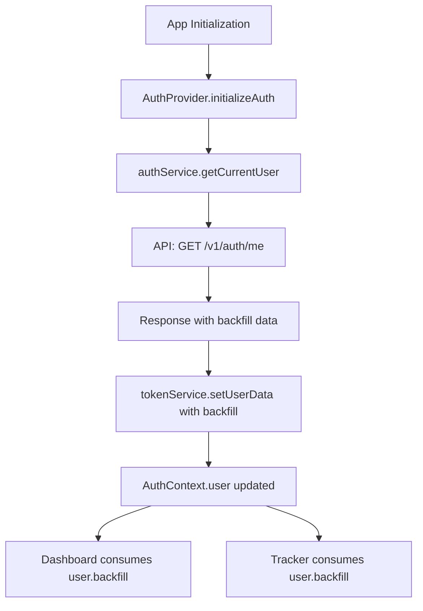
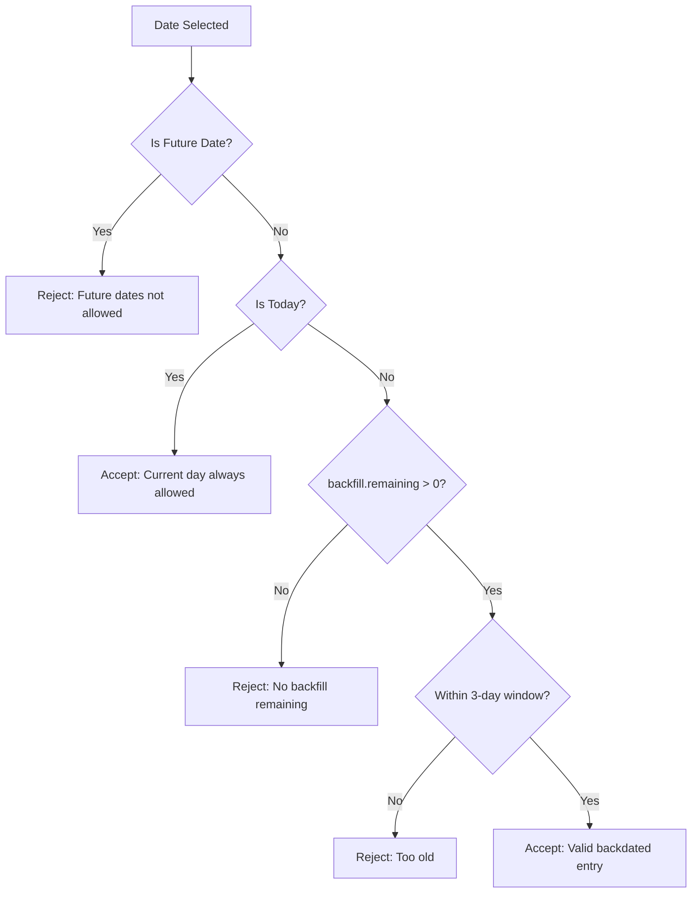

# Feature Design: Backfill Remaining Count Display and Enforcement

## Overview

The `/v1/auth/me` API endpoint now returns backfill information indicating how many times a user can submit backdated tracker entries. This feature adds visual display of the remaining backfill count on the dashboard and enforces the limit by preventing backdated entries when the count reaches zero.

## Business Context

Users have a grace limit for filling backdated activity tracker entries. The backfill object contains two properties:
- `limit`: Total number of backdated entries allowed
- `remaining`: Number of backdated entries still available

When `remaining` reaches zero, users can only submit activities for the current day, not for past dates within the previously allowed three-day window.

## User Experience Goals

- Provide clear visibility of remaining backfill opportunities
- Prevent confusion by disabling backdated entry submission when limit is exhausted
- Maintain existing functionality for current day entries
- Ensure seamless integration with existing dashboard metrics

## Data Model

### Extended UserData Interface

The `UserData` interface in `token-service.ts` will be extended to include:

| Field | Type | Description |
|-------|------|-------------|
| backfill | Object | Backfill information |
| backfill.limit | number | Total backfill entries allowed |
| backfill.remaining | number | Remaining backfill entries available |

### API Response Structure

The `/v1/auth/me` endpoint returns:

```
{
  id: number
  email: string
  name: string
  orgId: number
  roles: string[]
  permissions: string[]
  managerId: number | null
  departmentId: number
  department: object
  backfill: {
    limit: number
    remaining: number
  }
}
```

## Architecture

### Component Hierarchy

```
AuthProvider (Global State)
  ├─ Dashboard Page
  │   ├─ Statistics Cards Section
  │   │   ├─ Total Hours Tracked Card
  │   │   ├─ Leave Hours Card
  │   │   ├─ Total Hours Card
  │   │   └─ Backfill Remaining Card (NEW)
  │   ├─ Calendar Section
  │   └─ Activities Detail Section
  └─ Tracker Page
      └─ Activity Form (date validation updated)
```

### State Management Flow



### Data Flow Pattern

The backfill data follows the established authentication data flow pattern:

1. Backend API returns backfill data in `/v1/auth/me` response
2. `authService.getCurrentUser` receives and maps the data
3. `tokenService` stores complete user data including backfill in localStorage
4. `AuthProvider` exposes user data through context
5. Components access backfill via `useAuth` hook

## Functional Requirements

### Dashboard Display

**Objective**: Show backfill remaining count prominently

**Behavior**:
- Add a fourth statistics card in the dashboard grid
- Display remaining backfill count with appropriate label
- Show limit context for user awareness
- Use consistent styling with existing statistic cards

**Card Content Structure**:

| Element | Value |
|---------|-------|
| Label | Backfill Remaining |
| Primary Value | user.backfill.remaining |
| Secondary Text | `out of {user.backfill.limit} available` |

**Visual Considerations**:
- Grid layout expands from 3 columns to 4 on medium screens and above
- Responsive behavior maintained for mobile devices
- Consistent card height and padding with existing cards

### Tracker Date Validation

**Objective**: Enforce backfill limit by restricting date selection

**Current Behavior**:
- Users can select dates within last 3 days including today
- Date picker disables future dates and dates older than 3 days

**Updated Behavior**:

| Condition | Allowed Dates |
|-----------|---------------|
| backfill.remaining > 0 | Last 3 days including today (existing) |
| backfill.remaining === 0 | Only current day (today) |

**Implementation Strategy**:

The date validation logic should be updated in two places:

1. **Calendar Disabled Dates Function** (`disableInvalidDates`):
   - Check if `user.backfill.remaining` is zero
   - If zero, disable all dates except today
   - If greater than zero, maintain existing 3-day window logic

2. **Form Schema Validation** (`formSchema.activityDate`):
   - Add refinement to check backfill remaining
   - Validate that backdated entries are only allowed when remaining > 0
   - Provide clear error message when validation fails

**Validation Rules**:



**Error Messages**:

| Scenario | Error Message |
|----------|---------------|
| Backdated with zero remaining | You have exhausted your backfill limit. Only today's activities can be submitted. |
| Date older than 3 days (when remaining > 0) | Activity can only be added for the last 3 days including today. |
| Future date | Future dates are not allowed. |

### User Feedback

**Calendar Popover Description**:
- Update the form description text below the date picker
- Dynamically reflect the allowed date range based on backfill status

**Description Logic**:

| Condition | Description Text |
|-----------|------------------|
| backfill.remaining > 0 | Select a date within the last 3 days including today for tracking activities. |
| backfill.remaining === 0 | Only today's date can be selected for tracking activities. Your backfill limit has been reached. |

## Technical Considerations

### Type Safety

- Extend `UserData` interface with optional `backfill` property for backward compatibility
- Handle undefined backfill gracefully during transition period
- Use optional chaining when accessing `user?.backfill?.remaining`

### Null Safety

**Defensive Checks Required**:
- Verify user object exists before accessing backfill
- Provide fallback behavior when backfill is undefined
- Default to restrictive behavior (current day only) if data is missing

### Authentication Loading State

- Ensure tracker page waits for `authLoading` to complete before rendering date validation
- Prevent race conditions where validation logic runs before user data is available
- Maintain existing auth state handling patterns

### Cache Invalidation

- Backfill count may change server-side when activity is submitted
- Consider refreshing user data after successful tracker submission
- Evaluate if `refreshUser()` should be called after form submission

### Data Consistency

**Challenge**: Backfill count decrements server-side but client may not be aware

**Mitigation Options**:
1. Include updated backfill count in tracker submission response
2. Call `refreshUser()` after successful submission
3. Optimistically decrement client-side count

**Recommended Approach**: Call `refreshUser()` from AuthProvider after successful activity submission to ensure count is synchronized.

## Edge Cases

### Missing Backfill Data

**Scenario**: Older user accounts or API version mismatch

**Handling**:
- Treat undefined `backfill` as zero remaining (most restrictive)
- Log warning for debugging
- Display graceful message in dashboard card

### Zero Limit Configuration

**Scenario**: `backfill.limit` is 0 and `backfill.remaining` is 0

**Handling**:
- Same behavior as exhausted limit
- Display "0 out of 0 available" in dashboard
- Only allow current day entries

### Negative Remaining Count

**Scenario**: Data inconsistency or backend error

**Handling**:
- Treat as zero remaining
- Log error for investigation
- Apply most restrictive validation

### Concurrent Submissions

**Scenario**: User opens multiple tabs and submits backdated entries

**Handling**:
- Server-side validation is authoritative
- Client validation is advisory
- Error message from server will inform user if limit exceeded

## Non-Functional Requirements

### Performance

- No additional API calls required (data comes from existing `/v1/auth/me`)
- Minimal computational overhead for date validation logic
- Dashboard rendering performance unaffected by additional card

### Accessibility

- Backfill card should maintain ARIA labels consistent with other statistics
- Disabled date picker dates should communicate reason to screen readers
- Error messages should be accessible and clearly worded

### Maintainability

- Follow existing code patterns for statistics cards
- Reuse existing validation utilities and constants
- Document backfill logic clearly in code comments
- Maintain separation of concerns between UI and business logic

## Implementation Checklist

### Phase 1: Data Layer Updates

- [ ] Extend `UserData` interface in `token-service.ts` with optional backfill property
- [ ] Update `getCurrentUser` mapping in `auth-service.ts` to include backfill data
- [ ] Verify backfill data is persisted to localStorage via `tokenService.setUserData`

### Phase 2: Dashboard Display

- [ ] Update dashboard grid layout to accommodate fourth card
- [ ] Create backfill statistics card with label, count, and limit text
- [ ] Handle undefined backfill gracefully with fallback display
- [ ] Ensure responsive behavior on mobile, tablet, and desktop

### Phase 3: Tracker Validation

- [ ] Update `disableInvalidDates` function to check backfill remaining
- [ ] Modify form schema validation to enforce backfill limit
- [ ] Update form description text based on backfill status
- [ ] Add appropriate error messages for validation failures

### Phase 4: User Data Refresh

- [ ] Call `refreshUser()` after successful tracker submission
- [ ] Verify backfill count updates in dashboard after submission
- [ ] Test synchronization across multiple browser tabs

### Phase 5: Testing & Refinement

- [ ] Test with backfill remaining > 0
- [ ] Test with backfill remaining = 0
- [ ] Test with undefined backfill data
- [ ] Test date picker behavior in both states
- [ ] Verify error messages display correctly
- [ ] Test responsive layout on various screen sizes

## Files Requiring Changes

| File Path | Change Type | Description |
|-----------|-------------|-------------|
| `/lib/token-service.ts` | Update | Extend UserData interface with backfill property |
| `/lib/auth-service.ts` | Update | Map backfill data in getCurrentUser method |
| `/app/(authenticated)/page.tsx` | Update | Add backfill remaining statistics card |
| `/app/(authenticated)/tracker/page.tsx` | Update | Update date validation logic based on backfill |
| `/app/_components/AuthProvider.tsx` | Minor Update | Ensure backfill data flows through context |

## Success Criteria

- Dashboard displays backfill remaining count accurately
- Backfill card layout is consistent with existing statistics cards
- Date picker correctly restricts dates based on backfill status
- Validation errors are clear and actionable
- Current day entries are always allowed regardless of backfill status
- User data synchronization occurs after tracker submission
- No regressions in existing tracker or dashboard functionality
- Code follows established project patterns and conventions
## Implementation Checklist

### Phase 1: Data Layer Updates

- [ ] Extend `UserData` interface in `token-service.ts` with optional backfill property
- [ ] Update `getCurrentUser` mapping in `auth-service.ts` to include backfill data
- [ ] Verify backfill data is persisted to localStorage via `tokenService.setUserData`

### Phase 2: Dashboard Display

- [ ] Update dashboard grid layout to accommodate fourth card
- [ ] Create backfill statistics card with label, count, and limit text
- [ ] Handle undefined backfill gracefully with fallback display
- [ ] Ensure responsive behavior on mobile, tablet, and desktop

### Phase 3: Tracker Validation

- [ ] Update `disableInvalidDates` function to check backfill remaining
- [ ] Modify form schema validation to enforce backfill limit
- [ ] Update form description text based on backfill status
- [ ] Add appropriate error messages for validation failures

### Phase 4: User Data Refresh

- [ ] Call `refreshUser()` after successful tracker submission
- [ ] Verify backfill count updates in dashboard after submission
- [ ] Test synchronization across multiple browser tabs

### Phase 5: Testing & Refinement

- [ ] Test with backfill remaining > 0
- [ ] Test with backfill remaining = 0
- [ ] Test with undefined backfill data
- [ ] Test date picker behavior in both states
- [ ] Verify error messages display correctly
- [ ] Test responsive layout on various screen sizes

## Files Requiring Changes

| File Path | Change Type | Description |
|-----------|-------------|-------------|
| `/lib/token-service.ts` | Update | Extend UserData interface with backfill property |
| `/lib/auth-service.ts` | Update | Map backfill data in getCurrentUser method |
| `/app/(authenticated)/page.tsx` | Update | Add backfill remaining statistics card |
| `/app/(authenticated)/tracker/page.tsx` | Update | Update date validation logic based on backfill |
| `/app/_components/AuthProvider.tsx` | Minor Update | Ensure backfill data flows through context |

## Success Criteria

- Dashboard displays backfill remaining count accurately
- Backfill card layout is consistent with existing statistics cards
- Date picker correctly restricts dates based on backfill status
- Validation errors are clear and actionable
- Current day entries are always allowed regardless of backfill status
- User data synchronization occurs after tracker submission
- No regressions in existing tracker or dashboard functionality
- Code follows established project patterns and conventions

