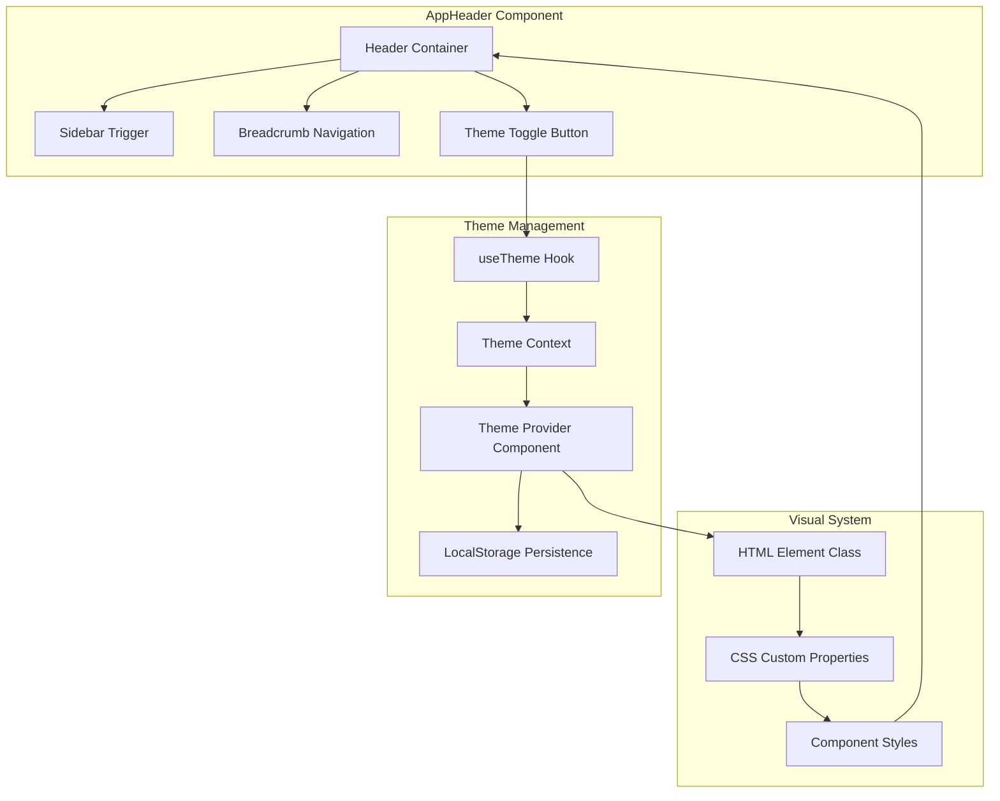
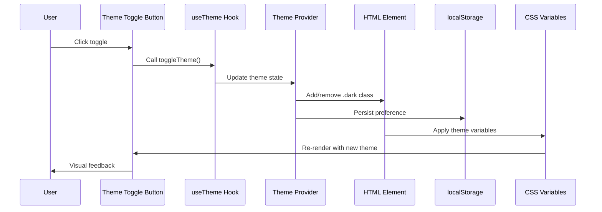
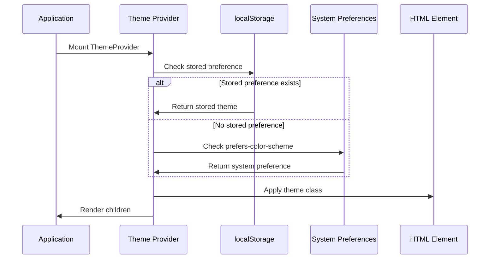
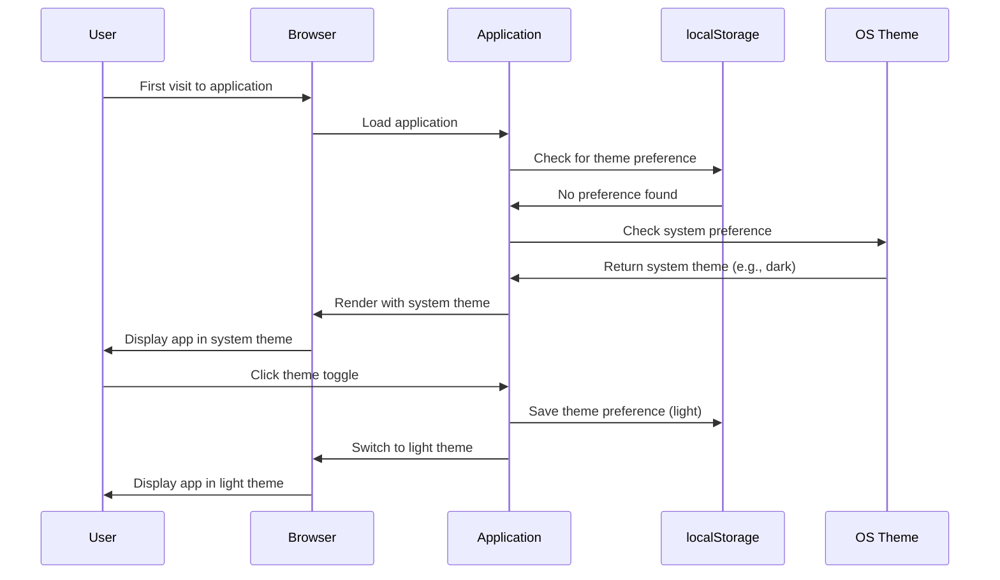
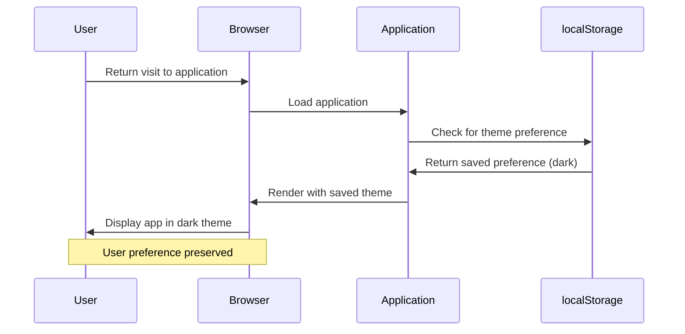

# Dark Mode Toggle Feature Design

## Overview

This feature introduces a dark mode toggle mechanism to the activity tracker application, enabling users to switch between light and dark themes seamlessly. The toggle button will be integrated into the AppHeader component, leveraging the existing shadcn/ui design system and the application's established theming infrastructure.

The implementation will provide persistent theme preference storage, smooth visual transitions between themes, and maintain consistency with the application's current design language using Radix UI primitives and Tailwind CSS utilities.

## Design Goals

- Provide intuitive dark mode switching through a toggle button in the AppHeader
- Preserve user theme preferences across browser sessions using localStorage
- Ensure seamless integration with the existing shadcn/ui design system
- Maintain accessibility standards for theme switching controls
- Support system preference detection for initial theme selection
- Deliver smooth, performant theme transitions without visual flicker

## Architecture

### Component Architecture



### State Management Flow



### Theme Initialization Flow



## Theme Provider Component

### Responsibilities

The Theme Provider serves as the central management system for theme state and persistence:

- **State Management**: Maintains current theme state (light, dark, or system)
- **Persistence**: Stores and retrieves theme preferences from localStorage
- **Initialization**: Determines initial theme based on stored preference or system settings
- **Propagation**: Provides theme state and controls through React Context
- **DOM Manipulation**: Applies theme class to HTML element for CSS variable resolution

### Provider Interface

| Property       | Type                          | Description                                       |
| -------------- | ----------------------------- | ------------------------------------------------- |
| theme          | 'light' \| 'dark' \| 'system' | Current active theme mode                         |
| setTheme       | (theme: Theme) => void        | Function to update theme preference               |
| toggleTheme    | () => void                    | Toggle between light and dark modes               |
| effectiveTheme | 'light' \| 'dark'             | Resolved theme after system preference evaluation |

### Storage Strategy

The theme preference will be persisted using the following approach:

- **Storage Key**: `theme-preference`
- **Storage Location**: localStorage (browser-specific persistence)
- **Storage Format**: Plain string value ('light', 'dark', or 'system')
- **Read Timing**: On provider mount and on storage event
- **Write Timing**: Immediately upon theme change
- **Fallback Behavior**: Default to 'system' if no stored value exists

### System Preference Detection

The provider will detect system color scheme preferences using:

- **Media Query**: `(prefers-color-scheme: dark)`
- **Event Listening**: Monitor changes to system preferences in real-time
- **Resolution Logic**: Only apply system preference when theme is set to 'system'
- **Cleanup**: Remove media query listeners on component unmount

## useTheme Hook

### Hook Interface

The custom hook provides components with theme management capabilities:

| Return Value   | Type                          | Description                           |
| -------------- | ----------------------------- | ------------------------------------- |
| theme          | 'light' \| 'dark' \| 'system' | User's theme preference setting       |
| effectiveTheme | 'light' \| 'dark'             | Actual resolved theme being displayed |
| setTheme       | (theme: Theme) => void        | Update theme preference               |
| toggleTheme    | () => void                    | Toggle between light/dark modes       |

### Hook Responsibilities

- Provide access to current theme state
- Expose theme manipulation functions
- Throw informative error if used outside ThemeProvider
- Offer memoized callbacks to prevent unnecessary re-renders

### Usage Pattern

Components will access theme functionality by invoking the useTheme hook:

- Import the hook from the hooks directory
- Call the hook within functional components
- Destructure desired properties (theme, setTheme, toggleTheme)
- Use theme state for conditional rendering or styling
- Call setTheme or toggleTheme to modify theme preference

## Theme Toggle Button Component

### Button Placement

The toggle button will be integrated into the AppHeader component:

- **Location**: Right section of the header (utilizing the existing `right` prop slot)
- **Alignment**: Positioned using the `ml-auto` class for right alignment
- **Container**: Wrapped in a div with appropriate padding (px-4)
- **Visibility**: Always visible across all authenticated pages

### Visual Design

The button will utilize the existing shadcn/ui Button component with the following characteristics:

| Aspect          | Specification                                              |
| --------------- | ---------------------------------------------------------- |
| Variant         | variant="noShadow" (flat appearance without shadow effect) |
| Size            | size="icon" (square button optimized for icon display)     |
| Icon Library    | Lucide React (consistent with app's icon system)           |
| Light Mode Icon | Sun icon (represents switching to dark mode)               |
| Dark Mode Icon  | Moon icon (represents switching to light mode)             |
| Icon Size       | Default lucide icon size (24px)                            |
| Transition      | Smooth icon swap with theme transition                     |

### Button States

The button will exhibit the following states:

- **Light Mode State**: Displays Sun icon, indicates dark mode is available
- **Dark Mode State**: Displays Moon icon, indicates light mode is available
- **Hover State**: Inherited from Button component (scale transform or opacity change)
- **Focus State**: Visible focus ring for keyboard navigation accessibility
- **Active State**: Visual feedback during click interaction
- **Disabled State**: Not applicable (toggle always available)

### Icon Selection Logic

The icon displayed will be determined by the effective theme:

| Effective Theme            | Icon Displayed | Semantic Meaning       |
| -------------------------- | -------------- | ---------------------- |
| light                      | Sun            | "Switch to dark mode"  |
| dark                       | Moon           | "Switch to light mode" |
| system (resolves to light) | Sun            | "Switch to dark mode"  |
| system (resolves to dark)  | Moon           | "Switch to light mode" |

### Accessibility Attributes

The toggle button will include proper accessibility attributes:

| Attribute    | Value          | Purpose                                      |
| ------------ | -------------- | -------------------------------------------- |
| aria-label   | "Toggle theme" | Descriptive label for screen readers         |
| role         | button         | Semantic role (implicit from button element) |
| tabIndex     | 0              | Keyboard focusable (default for button)      |
| aria-pressed | undefined      | Not a toggle button semantically             |

## AppHeader Integration

### Current Header Structure

The AppHeader currently consists of:

- Header container with flex layout
- Left section containing SidebarTrigger and Breadcrumb
- Optional right section for custom content

### Modified Header Structure

The AppHeader will be enhanced to include the theme toggle:

- Maintain existing left section (SidebarTrigger and Breadcrumb)
- Add theme toggle to right section when no custom content is provided
- Support both theme toggle and custom content simultaneously
- Preserve existing className and crumbs props

### Integration Approach

The theme toggle will be integrated using one of these approaches:

**Approach 1: Automatic Injection**

- Always render theme toggle in right section
- Allow additional content through right prop
- Combine theme toggle with custom right content

**Approach 2: Explicit Rendering**

- Render theme toggle only when no right content provided
- Keep right prop for complete customization
- Maintain backward compatibility with existing usage

**Recommended**: Approach 1 for consistent theme control availability across all pages.

### Header Layout Pattern

The header will follow this visual structure:

```
[SidebarTrigger] [Breadcrumb] ... [Custom Content] [Theme Toggle]
```

Where:

- SidebarTrigger: Positioned at far left
- Breadcrumb: Adjacent to trigger with gap-2 spacing
- Custom Content: Optional, positioned in right section
- Theme Toggle: Always present, positioned at far right

## Theme Application Mechanism

### CSS Class Strategy

The theme system operates through class-based CSS variable switching:

- **Light Mode**: No class on HTML element (default state)
- **Dark Mode**: `.dark` class applied to HTML element
- **Cascade**: Dark mode variables override light mode through specificity

### CSS Variable Resolution

The existing CSS custom properties support theme switching:

| Variable               | Light Mode Value              | Dark Mode Value               | Usage                  |
| ---------------------- | ----------------------------- | ----------------------------- | ---------------------- |
| --background           | oklch(93.46% 0.0305 255.11)   | oklch(29.23% 0.0626 270.49)   | Main background color  |
| --secondary-background | oklch(100% 0 0)               | oklch(23.93% 0 0)             | Card/panel backgrounds |
| --foreground           | oklch(0% 0 0)                 | oklch(92.49% 0 0)             | Text color             |
| --main                 | oklch(67.47% 0.1726 259.49)   | oklch(67.47% 0.1726 259.49)   | Primary brand color    |
| --border               | oklch(0% 0 0)                 | oklch(0% 0 0)                 | Border color           |
| --ring                 | oklch(0% 0 0)                 | oklch(100% 0 0)               | Focus ring color       |
| --shadow               | 4px 4px 0px 0px var(--border) | 4px 4px 0px 0px var(--border) | Box shadow definition  |

### Theme Class Application Timing

The theme class will be applied at specific points in the application lifecycle:

- **Initial Mount**: Applied during ThemeProvider initialization (before first paint)
- **User Toggle**: Applied immediately upon toggle button click
- **Storage Change**: Applied when localStorage changes in another tab
- **System Change**: Applied when system preference changes (if theme is 'system')

### Preventing Flash of Unstyled Content

To prevent visual flicker during page load:

- **Inline Script**: Inject blocking script in HTML head (before body)
- **Script Function**: Read localStorage and apply class before render
- **Execution Timing**: Execute synchronously before React hydration
- **Fallback**: If no preference, check system preference inline

The inline script logic:

1. Read theme preference from localStorage
2. If preference is 'dark', add .dark class immediately
3. If preference is 'system', check prefers-color-scheme media query
4. Apply appropriate class before DOM renders

## Root Layout Modification

### Provider Integration

The Theme Provider must wrap the entire application to enable theme access:

- **Placement**: Wrap children within the body element
- **Nesting**: Place inside AuthProvider to maintain existing provider hierarchy
- **Access**: All child components can access theme through useTheme hook

### Provider Hierarchy

The updated provider structure:

```
<html>
  <body>
    <AuthProvider>
      <ThemeProvider>
        {children}
      </ThemeProvider>
    </AuthProvider>
  </body>
</html>
```

### HTML Element Considerations

The theme class will be applied to the `<html>` element:

- **Rationale**: Allows theme to affect entire document including body
- **Scope**: All descendant elements inherit theme through CSS cascade
- **Access**: ThemeProvider must manipulate document.documentElement
- **Timing**: Class applied before React hydration to prevent flash

## Transition Effects

### Theme Transition Behavior

Visual transitions will enhance the theme switching experience:

| Element Type      | Transition Property                   | Duration | Timing Function |
| ----------------- | ------------------------------------- | -------- | --------------- |
| Background colors | background-color                      | 200ms    | ease-in-out     |
| Text colors       | color                                 | 200ms    | ease-in-out     |
| Border colors     | border-color                          | 200ms    | ease-in-out     |
| All components    | color, background-color, border-color | 200ms    | ease-in-out     |

### Transition Implementation

Transitions will be implemented through:

- **CSS Transition**: Applied to all elements via global CSS
- **Scope**: Target color-related properties only
- **Performance**: Use GPU-accelerated properties where possible
- **User Preference**: Respect prefers-reduced-motion for accessibility

### Reduced Motion Support

For users with motion sensitivity:

- **Media Query**: Detect `prefers-reduced-motion: reduce`
- **Behavior**: Disable transitions when preference is set
- **Fallback**: Instant theme switch without animation
- **Accessibility**: Ensure theme still changes, just without transition

## Component Dependencies

### Required Dependencies

All dependencies are already present in the project:

| Dependency               | Version  | Purpose                                     |
| ------------------------ | -------- | ------------------------------------------- |
| react                    | 19.2.0   | Core framework for components and hooks     |
| next                     | 16.0.0   | Framework for server-side rendering support |
| lucide-react             | ^0.546.0 | Icon library for Sun and Moon icons         |
| @radix-ui/react-slot     | ^1.2.3   | Used by Button component for composition    |
| class-variance-authority | ^0.7.1   | Used by Button component for variants       |
| tailwind-merge           | ^3.3.1   | Used by cn utility for class merging        |
| clsx                     | ^2.1.1   | Used by cn utility for conditional classes  |

### Existing UI Components

The implementation will leverage existing shadcn/ui components:

- **Button**: Primary toggle button component (components/ui/button.tsx)
- **Tooltip** (Optional): Potential enhancement for toggle button hint
- **Dropdown Menu** (Optional): Alternative UI for theme selection (light/dark/system)

## Testing Considerations

### Unit Testing Strategy

Components and hooks should support the following test scenarios:

**ThemeProvider Tests**:

- Renders children correctly
- Initializes theme from localStorage
- Falls back to system preference when no stored value
- Updates localStorage when theme changes
- Applies correct class to HTML element
- Handles system preference changes

**useTheme Hook Tests**:

- Returns current theme state
- Provides working setTheme function
- Provides working toggleTheme function
- Throws error when used outside provider
- Returns correct effectiveTheme based on system preference

**Theme Toggle Button Tests**:

- Renders correct icon for current theme
- Calls toggleTheme when clicked
- Has proper accessibility attributes
- Shows tooltip on hover (if implemented)

### Integration Testing Strategy

End-to-end tests should verify:

- Theme toggle button visible in AppHeader
- Clicking toggle switches theme
- Theme persists across page navigation
- Theme persists across browser refresh
- System preference affects initial theme
- No flash of unstyled content on load

### Visual Regression Testing

Visual tests should capture:

- AppHeader in light mode
- AppHeader in dark mode
- Toggle button hover states
- Toggle button focus states
- Smooth transition between themes

## User Experience Flow

### First-Time User Journey



### Returning User Journey



### Multi-Tab Synchronization

When a user has multiple tabs open:

- **Event Listener**: Listen for storage events on window
- **Cross-Tab Updates**: Detect theme changes in other tabs
- **Automatic Sync**: Update theme in all open tabs simultaneously
- **User Experience**: Consistent theme across all application instances

## Edge Cases and Handling

### Edge Case: localStorage Unavailable

If localStorage is blocked or unavailable:

- **Detection**: Wrap localStorage access in try-catch blocks
- **Fallback**: Use in-memory state only (session-based)
- **Behavior**: Theme resets on page refresh
- **User Impact**: Toggle still works within session

### Edge Case: System Preference Changes

When user changes OS theme while app is open:

- **Detection**: Media query listener detects change
- **Condition**: Only apply if theme preference is 'system'
- **Behavior**: App theme updates automatically
- **User Control**: User can override with manual theme selection

### Edge Case: Rapid Toggle Clicks

If user clicks toggle button rapidly:

- **Debouncing**: Not required (state updates are synchronous)
- **Visual Feedback**: Each click toggles theme immediately
- **Performance**: No performance impact due to CSS-only transitions
- **localStorage**: Each toggle writes to storage (acceptable overhead)

### Edge Case: Server-Side Rendering

During Next.js server-side rendering:

- **Initial HTML**: Rendered without theme class
- **Inline Script**: Applied before React hydration
- **Hydration**: ThemeProvider syncs with applied class
- **No Mismatch**: Prevents hydration errors

## File Structure

### New Files

The implementation will introduce the following files:

| File Path                          | Purpose                               |
| ---------------------------------- | ------------------------------------- |
| app/\_components/ThemeProvider.tsx | Theme provider component with context |
| hooks/use-theme.ts                 | Custom hook for accessing theme state |

### Modified Files

The implementation will modify these existing files:

| File Path                      | Modification                               |
| ------------------------------ | ------------------------------------------ |
| app/\_components/AppHeader.tsx | Add theme toggle button to header          |
| app/layout.tsx                 | Wrap children with ThemeProvider           |
| app/globals.css                | Add transition effects for theme switching |

### File Organization Rationale

- **ThemeProvider in app/\_components**: Consistent with other providers (AuthProvider)
- **useTheme in hooks**: Consistent with existing hooks (use-auth, use-mobile)
- **No new UI components needed**: Leverages existing Button component

## Design Patterns

### Provider Pattern

The theme management follows the React Context Provider pattern:

- **Context Creation**: Create ThemeContext with React.createContext
- **Provider Component**: Wraps application and provides theme state
- **Consumer Hook**: useTheme hook consumes context
- **Separation of Concerns**: Provider manages state, hook provides access

### Custom Hook Pattern

The useTheme hook follows React custom hook conventions:

- **Naming**: Prefixed with 'use' for React hook identification
- **Encapsulation**: Hides context implementation details
- **Error Handling**: Validates provider presence
- **Memoization**: Returns stable function references

### Compound Component Pattern

The AppHeader integration follows composition principles:

- **Flexibility**: Accepts optional right content prop
- **Composition**: Combines SidebarTrigger, Breadcrumb, and ThemeToggle
- **Extensibility**: Supports additional header elements
- **Consistency**: Maintains unified header appearance

## Accessibility Compliance

### WCAG 2.1 Compliance

The theme toggle implementation will meet these accessibility standards:

| Criterion                | Level | Compliance Strategy                           |
| ------------------------ | ----- | --------------------------------------------- |
| 1.4.3 Contrast (Minimum) | AA    | Verify contrast ratios in both themes         |
| 2.1.1 Keyboard           | A     | Toggle focusable and activatable via keyboard |
| 2.4.7 Focus Visible      | AA    | Visible focus indicator on toggle button      |
| 4.1.2 Name, Role, Value  | A     | Proper aria-label and semantic HTML           |

### Keyboard Navigation

The toggle button will support full keyboard interaction:

- **Tab Navigation**: Button is in tab order
- **Enter/Space Activation**: Triggers theme toggle
- **Focus Indicator**: Clear visual focus ring
- **Escape Key**: Not applicable (toggle is stateless button)

### Screen Reader Support

The toggle button will provide screen reader accessibility:

- **Label**: aria-label="Toggle theme" announces purpose
- **State Announcement**: Theme change announced (via live region if needed)
- **Icon Hiding**: Icons are decorative (aria-hidden="true")
- **Semantic HTML**: Uses native button element for proper role

### Focus Management

Focus behavior during theme switching:

- **Focus Preservation**: Focus remains on toggle button after click
- **No Focus Trap**: Toggle doesn't create focus trap
- **Logical Order**: Toggle positioned logically in tab order
- **Visual Clarity**: Focus ring visible in both themes

## Performance Considerations

### Render Optimization

The implementation will minimize unnecessary re-renders:

- **Context Splitting**: If needed, separate theme state from theme controls
- **Memoization**: Memoize callback functions (setTheme, toggleTheme)
- **Selective Updates**: Only components using theme re-render on change
- **Stable References**: Prevent new function instances on each render

### CSS Performance

Theme switching performance will be optimized:

- **CSS Variables**: Instant property value changes via cascade
- **No JavaScript Recalculation**: Theme applies through CSS only
- **GPU Acceleration**: Color transitions use GPU-accelerated properties
- **Minimal Reflow**: Color changes don't trigger layout recalculation

### Storage Performance

localStorage interaction will be efficient:

- **Synchronous Operations**: localStorage reads/writes are synchronous
- **Minimal Frequency**: Only write on user-initiated theme change
- **Error Handling**: Graceful fallback if storage unavailable
- **No Polling**: Event-based storage change detection

### Bundle Size Impact

The implementation will have minimal bundle size impact:

- **No New Dependencies**: Uses existing dependencies
- **Small Components**: Provider and hook are lightweight
- **Tree Shaking**: Unused theme code can be eliminated
- **Estimated Addition**: < 2KB gzipped

## Alternative Approaches Considered

### Alternative 1: CSS-Only Theme Toggle

**Approach**: Use CSS custom properties with checkbox input

**Advantages**:

- No JavaScript state management
- Works without React context
- Simpler implementation

**Disadvantages**:

- No persistence across sessions
- Limited control over transition timing
- Harder to integrate with system preferences
- Not compatible with React server components

**Decision**: Rejected due to lack of persistence and poor UX

### Alternative 2: System Preference Only

**Approach**: Always follow system theme without toggle

**Advantages**:

- No UI needed
- Automatic synchronization with OS
- Reduced complexity

**Disadvantages**:

- No user control over preference
- Can't override system setting
- Poor UX for users wanting different app theme

**Decision**: Rejected due to lack of user control

### Alternative 3: Dropdown Theme Selector

**Approach**: Use dropdown menu for light/dark/system selection

**Advantages**:

- Explicit system preference option
- More control for power users
- Can extend to additional themes

**Disadvantages**:

- More complex UI
- Requires extra click to open dropdown
- Slower to toggle between modes

**Decision**: Rejected for initial implementation; can be future enhancement

### Alternative 4: next-themes Package

**Approach**: Use third-party next-themes library

**Advantages**:

- Battle-tested solution
- Handles SSR flash prevention
- Built-in system preference detection

**Disadvantages**:

- Additional dependency (7KB)
- Less control over implementation
- May include unused features

**Decision**: Rejected to maintain minimal dependencies and full control

## Future Enhancements

### Potential Improvements

The following enhancements could be implemented in future iterations:

**Enhanced Theme Options**:

- Add explicit 'system' option in theme selector
- Support custom theme creation (color customization)
- Enable multiple theme presets (blue, green, purple variations)
- Add high-contrast theme for accessibility

**Improved User Experience**:

- Add tooltip to toggle button explaining current theme
- Implement theme preview before switching
- Add keyboard shortcut for theme toggle (e.g., Ctrl+Shift+T)
- Animate icon transition between sun and moon

**Advanced Features**:

- Schedule theme switching based on time of day
- Per-page theme preferences
- Theme synchronization across devices (requires backend)
- Theme customization panel with live preview

**Developer Experience**:

- Expose theme CSS variables to components
- Create theme utilities for conditional styling
- Add theme-aware component variants
- Provide theme debugging tools

### Migration Path

If implementing enhancements that change the API:

- Maintain backward compatibility with current toggle approach
- Provide migration guide for any breaking changes
- Use feature flags to gradually roll out new theme features
- Version the theme provider if significant changes occur
