# Google OAuth Login Feature Design

## Overview

This design document outlines the implementation strategy for integrating Google OAuth authentication into the activity-tracker Next.js application. The authentication flow will enable users to sign in using their Google accounts, extract identity tokens, authenticate with the backend API, and manage session tokens for secure access to protected resources.

### Business Objectives

- Provide seamless single sign-on (SSO) experience using Google credentials
- Eliminate password management overhead for users
- Secure user authentication through industry-standard OAuth 2.0 protocol
- Maintain persistent user sessions with token-based authentication
- Enable automatic token refresh to maintain uninterrupted user sessions

### Technical Scope

The implementation encompasses four major components:

1. **Frontend OAuth Integration**: Google Sign-In button and credential handling
2. **Token Extraction & Decoding**: Processing Google ID tokens to extract user identity
3. **Backend Authentication**: API integration for login and token management
4. **Session Management**: Secure storage and refresh of authentication tokens

## Architecture

### System Architecture Overview

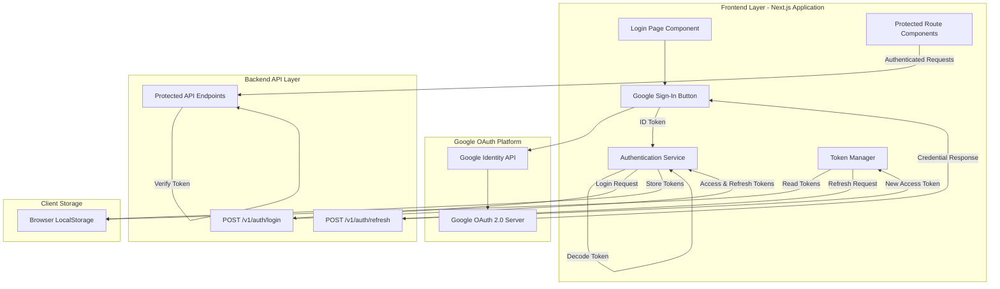

### Authentication Flow Sequence

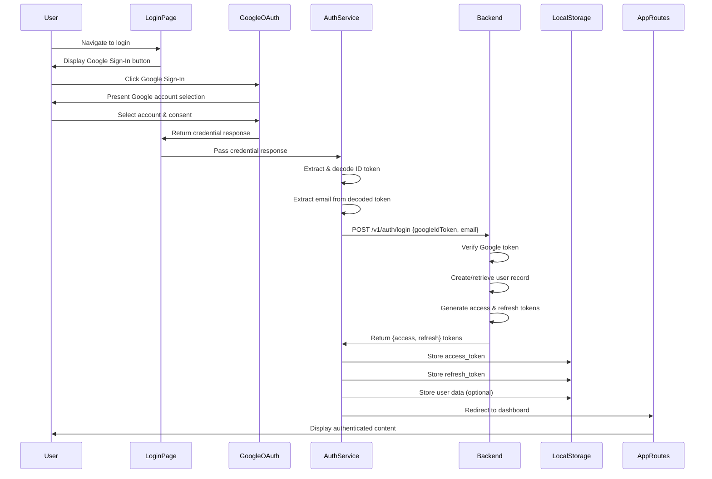

### Token Refresh Flow

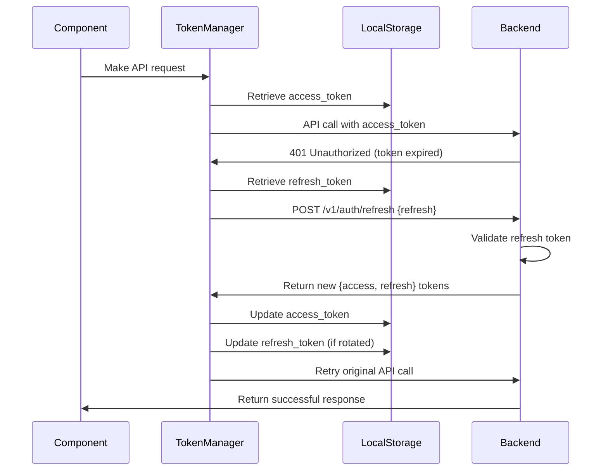

## Component Architecture

### Frontend Components Structure

Following the existing project structure conventions:

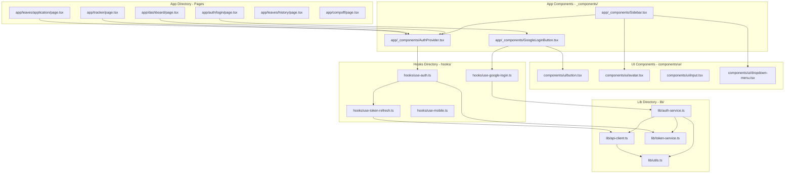

## File Structure

### New Files to Create

Following the existing project conventions:

| File Path                              | Type             | Purpose                                |
| -------------------------------------- | ---------------- | -------------------------------------- |
| app/auth/login/page.tsx                | Page Component   | Login page with Google OAuth button    |
| app/\_components/AuthProvider.tsx      | Context Provider | Global authentication state management |
| app/\_components/GoogleLoginButton.tsx | UI Component     | Google Sign-In button component        |
| lib/auth-service.ts                    | Service          | Authentication business logic          |
| lib/api-client.ts                      | Service          | HTTP client with interceptors          |
| lib/token-service.ts                   | Service          | Token management utilities             |
| hooks/use-auth.ts                      | Custom Hook      | Authentication state hook              |
| hooks/use-google-login.ts              | Custom Hook      | Google OAuth integration hook          |
| hooks/use-token-refresh.ts             | Custom Hook      | Token refresh logic hook               |

### Modified Files

| File Path                       | Modification           | Purpose                                        |
| ------------------------------- | ---------------------- | ---------------------------------------------- |
| app/\_components/Sidebar.tsx    | Enhance user dropdown  | Add authentication-aware menu items and logout |
| app/layout.tsx                  | Wrap with AuthProvider | Provide auth context to entire app             |
| app/dashboard/page.tsx          | Add auth check         | Protect route from unauthorized access         |
| app/tracker/page.tsx            | Add auth check         | Protect route from unauthorized access         |
| app/leaves/application/page.tsx | Add auth check         | Protect route from unauthorized access         |
| app/leaves/history/page.tsx     | Add auth check         | Protect route from unauthorized access         |
| app/compoff/page.tsx            | Add auth check         | Protect route from unauthorized access         |

## Data Models

### Google Credential Response

| Field      | Type   | Description                 | Required | Source                |
| ---------- | ------ | --------------------------- | -------- | --------------------- |
| credential | string | JWT-encoded Google ID token | Yes      | Google OAuth response |
| clientId   | string | Google OAuth client ID      | Yes      | Google OAuth response |
| select_by  | string | How user selected account   | No       | Google OAuth response |

### Decoded Google ID Token

| Field          | Type    | Description                   | Required | Example             |
| -------------- | ------- | ----------------------------- | -------- | ------------------- |
| email          | string  | User's Google email address   | Yes      | user@example.com    |
| email_verified | boolean | Email verification status     | Yes      | true                |
| name           | string  | User's full name              | No       | John Doe            |
| picture        | string  | Profile picture URL           | No       | https://...         |
| given_name     | string  | First name                    | No       | John                |
| family_name    | string  | Last name                     | No       | Doe                 |
| sub            | string  | Google user unique identifier | Yes      | 1234567890          |
| iss            | string  | Token issuer                  | Yes      | accounts.google.com |
| aud            | string  | Intended audience (client ID) | Yes      | [CLIENT_ID]         |
| iat            | number  | Issued at timestamp           | Yes      | 1234567890          |
| exp            | number  | Expiration timestamp          | Yes      | 1234571490          |

### Backend Login Request Payload

| Field         | Type   | Description                              | Required | Validation                  |
| ------------- | ------ | ---------------------------------------- | -------- | --------------------------- |
| googleIdToken | string | Google ID token from credential response | Yes      | JWT format, valid signature |
| email         | string | User email extracted from decoded token  | Yes      | Valid email format          |

### Backend Authentication Response

| Field       | Type   | Description                                      | Required | Storage Location            |
| ----------- | ------ | ------------------------------------------------ | -------- | --------------------------- |
| access      | string | Short-lived access token for API requests        | Yes      | localStorage: access_token  |
| refresh     | string | Long-lived token for obtaining new access tokens | Yes      | localStorage: refresh_token |
| user        | object | User profile information                         | No       | localStorage: AUTH (JSON)   |
| user.id     | string | Unique user identifier                           | No       | -                           |
| user.email  | string | User email address                               | No       | -                           |
| user.name   | string | User display name                                | No       | -                           |
| user.avatar | string | User profile picture URL                         | No       | -                           |

### Token Refresh Request Payload

| Field   | Type   | Description         | Required | Source                      |
| ------- | ------ | ------------------- | -------- | --------------------------- |
| refresh | string | Valid refresh token | Yes      | localStorage: refresh_token |

### Token Refresh Response

| Field   | Type   | Description       | Required | Notes                    |
| ------- | ------ | ----------------- | -------- | ------------------------ |
| access  | string | New access token  | Yes      | Replaces expired token   |
| refresh | string | New refresh token | No       | Only if rotation enabled |

## Authentication Service Design

### Service Responsibilities

The Authentication Service acts as the central orchestrator for all authentication-related operations, providing a clean abstraction layer between UI components and authentication logic.

**Core Responsibilities:**

- Initialize Google OAuth library
- Handle OAuth callback responses
- Decode and validate Google ID tokens
- Communicate with backend authentication endpoints
- Manage token storage and retrieval
- Coordinate token refresh operations
- Maintain authentication state
- Provide authentication status to components

### Service Interface

| Method                | Parameters                             | Return Type             | Description                                 |
| --------------------- | -------------------------------------- | ----------------------- | ------------------------------------------- |
| initializeGoogleOAuth | clientId: string                       | Promise\<void\>         | Initialize Google Identity Services library |
| handleGoogleSuccess   | credentialResponse: CredentialResponse | Promise\<void\>         | Process successful Google sign-in           |
| handleGoogleError     | error: Error                           | void                    | Handle OAuth errors                         |
| login                 | googleIdToken: string, email: string   | Promise\<AuthResponse\> | Authenticate with backend                   |
| logout                | -                                      | Promise\<void\>         | Clear tokens and session                    |
| refreshAccessToken    | -                                      | Promise\<string\>       | Obtain new access token                     |
| isAuthenticated       | -                                      | boolean                 | Check if user is logged in                  |
| getAccessToken        | -                                      | string \| null          | Retrieve current access token               |
| getUserData           | -                                      | UserData \| null        | Retrieve stored user information            |

### Authentication State Management

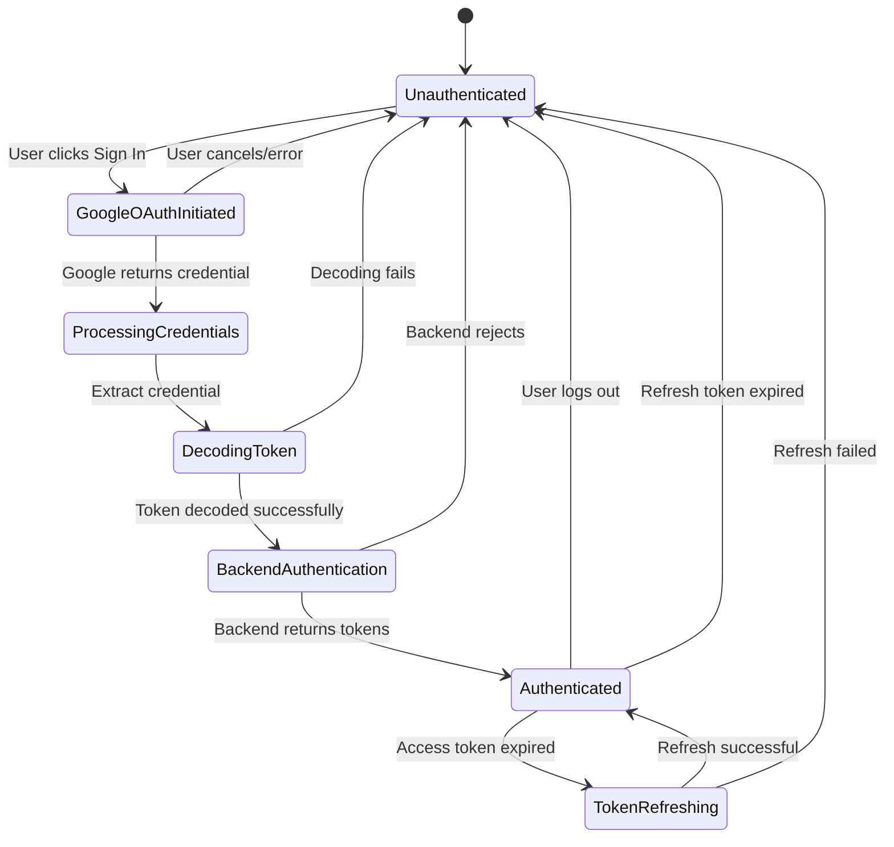

## API Integration Layer

### API Client Configuration

The API client serves as the communication layer between the frontend and backend, handling request/response transformation, authentication header injection, and error handling.

**Client Responsibilities:**

- Configure base URL for backend API
- Inject authentication headers automatically
- Handle request/response transformation
- Implement retry logic for failed requests
- Detect and handle token expiration
- Trigger token refresh flow when needed
- Handle network errors gracefully

### Request Interceptor Flow

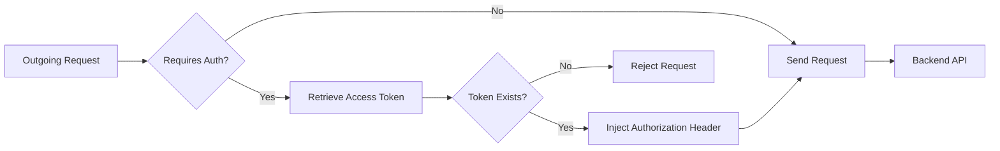

### Response Interceptor Flow

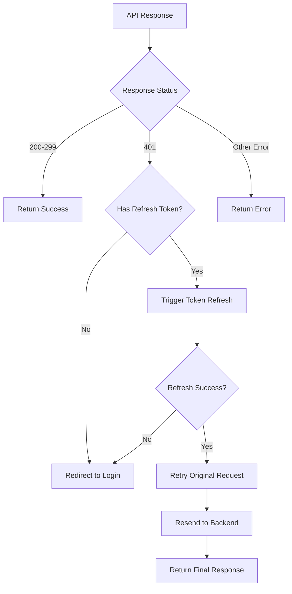

### API Endpoints Specification

#### Login Endpoint

**Endpoint:** `POST /v1/auth/login`

**Purpose:** Authenticate user with Google ID token and receive application access tokens

**Request Headers:**
| Header | Value | Required |
|--------|-------|----------|
| Content-Type | application/json | Yes |

**Request Body:**

```
{
  "googleIdToken": "eyJhbGciOiJSUzI1NiIsImtpZCI6IjE...",
  "email": "user@example.com"
}
```

**Success Response (200 OK):**

```
{
  "access": "eyJhbGciOiJIUzI1NiIsInR5cCI6IkpXVCJ9...",
  "refresh": "eyJhbGciOiJIUzI1NiIsInR5cCI6IkpXVCJ9...",
  "user": {
    "id": "user_123",
    "email": "user@example.com",
    "name": "John Doe",
    "avatar": "https://..."
  }
}
```

**Error Responses:**

| Status Code | Error Type   | Description                           | Response Body                        |
| ----------- | ------------ | ------------------------------------- | ------------------------------------ |
| 400         | Bad Request  | Missing or invalid request parameters | {"error": "Invalid request payload"} |
| 401         | Unauthorized | Google token verification failed      | {"error": "Invalid Google token"}    |
| 403         | Forbidden    | User account disabled or blocked      | {"error": "Account access denied"}   |
| 500         | Server Error | Backend processing error              | {"error": "Authentication failed"}   |

#### Token Refresh Endpoint

**Endpoint:** `POST /v1/auth/refresh`

**Purpose:** Exchange valid refresh token for new access token

**Request Headers:**
| Header | Value | Required |
|--------|-------|----------|
| Content-Type | application/json | Yes |

**Request Body:**

```
{
  "refresh": "eyJhbGciOiJIUzI1NiIsInR5cCI6IkpXVCJ9..."
}
```

**Success Response (200 OK):**

```
{
  "access": "eyJhbGciOiJIUzI1NiIsInR5cCI6IkpXVCJ9...",
  "refresh": "eyJhbGciOiJIUzI1NiIsInR5cCI6IkpXVCJ9..."
}
```

**Error Responses:**

| Status Code | Error Type   | Description                      | Response Body                       |
| ----------- | ------------ | -------------------------------- | ----------------------------------- |
| 400         | Bad Request  | Missing refresh token            | {"error": "Refresh token required"} |
| 401         | Unauthorized | Invalid or expired refresh token | {"error": "Invalid refresh token"}  |
| 500         | Server Error | Token generation failed          | {"error": "Token refresh failed"}   |

## Token Management Strategy

### Storage Strategy

**LocalStorage Schema:**

| Key           | Value Type  | Content                | Persistence            | Security Consideration           |
| ------------- | ----------- | ---------------------- | ---------------------- | -------------------------------- |
| access_token  | string      | JWT access token       | Until logout or expiry | Vulnerable to XSS attacks        |
| refresh_token | string      | JWT refresh token      | Until logout or expiry | Vulnerable to XSS attacks        |
| AUTH          | JSON string | Serialized user object | Until logout           | Contains non-sensitive user data |

**Storage Rationale:**

- LocalStorage chosen for simplicity and persistence across browser sessions
- Tokens remain available after page refresh
- Automatic expiration through token validation
- Easy integration with existing application architecture

**Security Considerations:**

- Tokens are vulnerable to XSS (Cross-Site Scripting) attacks
- HTTPOnly cookies provide better security but complicate implementation
- Content Security Policy (CSP) should be implemented to mitigate XSS risks
- Tokens should have short expiration times
- Sensitive operations should require re-authentication

### Token Lifecycle Management

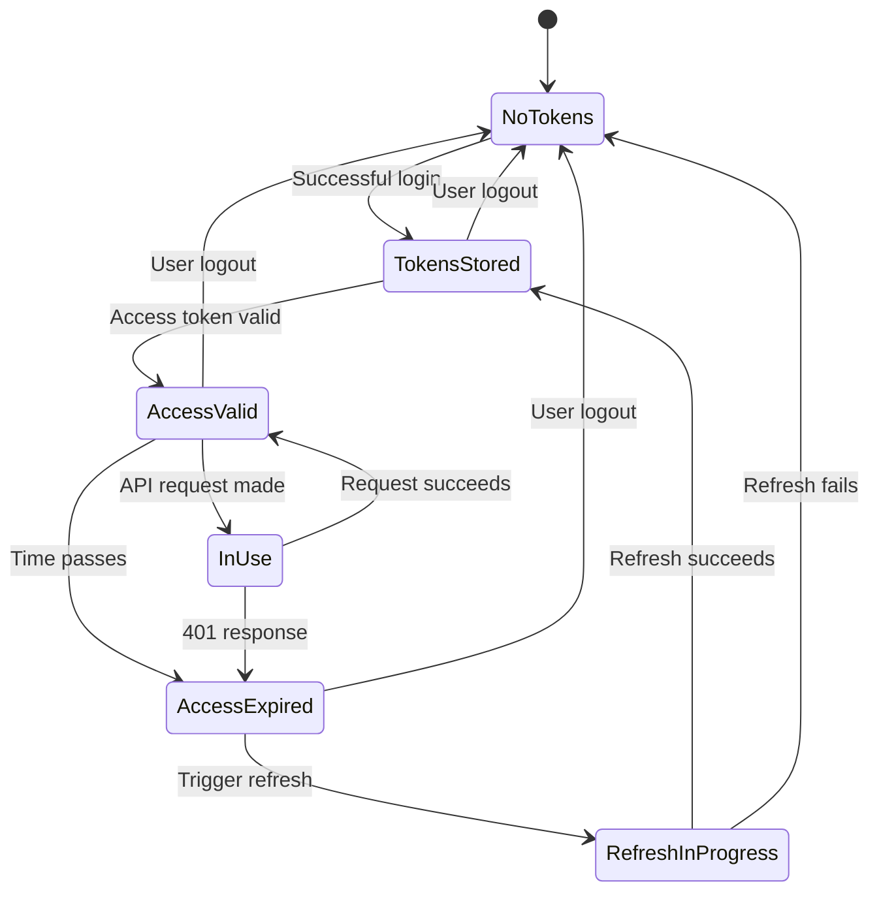

### Token Refresh Strategy

**Automatic Refresh Approach:**

The system implements reactive token refresh triggered by 401 Unauthorized responses rather than proactive refresh based on expiration time.

**Refresh Logic:**

1. Component makes API request with current access token
2. API client intercepts request and injects Authorization header
3. Backend validates token and returns 401 if expired
4. Response interceptor detects 401 status
5. Interceptor retrieves refresh token from storage
6. Interceptor calls refresh endpoint
7. New tokens stored in localStorage
8. Original request retried with new access token
9. Response returned to calling component

**Retry Strategy:**

| Scenario               | Action                         | Max Retries | Fallback           |
| ---------------------- | ------------------------------ | ----------- | ------------------ |
| 401 on first attempt   | Trigger refresh and retry      | 1           | Redirect to login  |
| 401 after refresh      | No retry                       | 0           | Redirect to login  |
| Network error          | Retry with exponential backoff | 3           | Show error message |
| Refresh endpoint fails | No retry                       | 0           | Redirect to login  |
| 5xx server error       | Retry with delay               | 2           | Show error message |

## Protected Routes Implementation

### Route Protection Strategy

Protected routes ensure that only authenticated users can access certain pages, automatically redirecting unauthenticated users to the login page.

**Protection Mechanism:**

- Authentication context provides global auth state
- Protected route wrapper components check authentication
- Route guards execute before component rendering
- Automatic redirection to login for unauthorized access
- Return URL preserved for post-login redirect

### Route Protection Flow

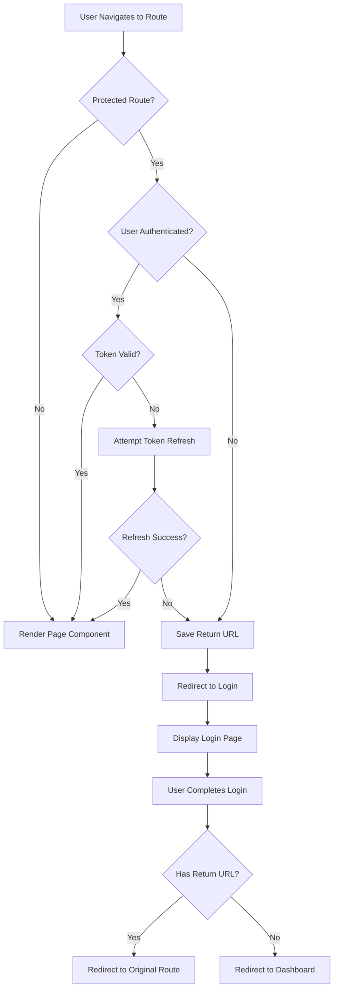

### Protected Routes Configuration

| Route Path          | Protection Level | Authentication Required | Fallback Action                        |
| ------------------- | ---------------- | ----------------------- | -------------------------------------- |
| /auth/login         | Public           | No                      | Redirect to dashboard if authenticated |
| /dashboard          | Protected        | Yes                     | Redirect to login                      |
| /tracker            | Protected        | Yes                     | Redirect to login                      |
| /leaves/application | Protected        | Yes                     | Redirect to login                      |
| /leaves/history     | Protected        | Yes                     | Redirect to login                      |
| /compoff            | Protected        | Yes                     | Redirect to login                      |
| /                   | Public           | No                      | No redirect                            |

### Protected Routes Configuration

Following the existing page structure patterns with header and breadcrumb navigation:

| Route Path          | Component File                  | Protection Level          | Header Pattern              | Breadcrumb Example               |
| ------------------- | ------------------------------- | ------------------------- | --------------------------- | -------------------------------- |
| /auth/login         | app/auth/login/page.tsx         | Public (redirect if auth) | None                        | None                             |
| /dashboard          | app/dashboard/page.tsx          | Protected                 | SidebarTrigger + Breadcrumb | Dashboard                        |
| /tracker            | app/tracker/page.tsx            | Protected                 | SidebarTrigger + Breadcrumb | Dashboard > Activity Tracker     |
| /leaves/application | app/leaves/application/page.tsx | Protected                 | SidebarTrigger + Breadcrumb | Dashboard > Leaves > Application |
| /leaves/history     | app/leaves/history/page.tsx     | Protected                 | SidebarTrigger + Breadcrumb | Dashboard > Leaves > History     |
| /compoff            | app/compoff/page.tsx            | Protected                 | SidebarTrigger + Breadcrumb | Dashboard > Comp-Off Request     |
| /                   | app/page.tsx                    | Public                    | SidebarTrigger + Breadcrumb | Dashboard                        |

**Page Structure Template (Following app/tracker/page.tsx pattern):**

All protected pages follow this consistent structure:

```
Page Component (default export)
├── <header> (flex h-16 items-center gap-2)
│   └── <div> (flex items-center gap-2 px-4)
│       ├── <SidebarTrigger className="-ml-1" />
│       └── <Breadcrumb>
│           └── <BreadcrumbList>
│               ├── <BreadcrumbItem> with <BreadcrumbLink>
│               ├── <BreadcrumbSeparator />
│               └── <BreadcrumbItem> with <BreadcrumbPage>
└── <div> (flex flex-1 flex-col gap-4 p-4 pt-0)
    └── Page Content
```

## User Interface Design

### Login Page Structure

Following the existing design system with Tailwind CSS and the established styling patterns.

**Page Layout Structure:**

- Full-height centered container using flex layout
- Application branding (NavTrack logo with Command icon)
- Welcome headline using `font-heading` class
- Descriptive text with appropriate text sizing
- Google Sign-In button using existing button variants
- Loading state during authentication
- Error message display area with appropriate styling

**Styling Conventions:**

- Use existing CSS custom properties (--background, --main, --border, etc.)
- Apply `rounded-base` for consistent border radius (5px)
- Use `border-2 border-border` for consistent borders
- Apply `shadow-shadow` for consistent box shadow (4px 4px 0px 0px)
- Use `font-heading` for headings (font-weight: 700)
- Use `font-base` for body text (font-weight: 500)
- Follow existing spacing patterns (px-4, py-2, gap-2, etc.)

**Component Composition:**

```
LoginPage
├── Centered Container (flex, min-h-screen, items-center, justify-center)
│   └── Card Container (rounded-base, border-2, shadow-shadow, p-8)
│       ├── Branding Section
│       │   ├── Command Icon (size-8)
│       │   └── App Name (font-heading, text-2xl)
│       ├── Welcome Section
│       │   ├── Headline (font-heading, text-xl)
│       │   └── Description (text-sm, text-foreground)
│       ├── GoogleLoginButton Component
│       └── Error Display (if error exists)
```

**Visual Hierarchy:**

1. Application branding (Command icon + "NavTrack" name)
2. Welcome headline ("Welcome to NavTrack")
3. Sign-in description ("Track your daily activities")
4. Google Sign-In button (using Button component with default variant)
5. Error message (if applicable, with appropriate styling)

### Authentication States UI

| State             | Visual Indicator      | User Feedback                          | Action Available           |
| ----------------- | --------------------- | -------------------------------------- | -------------------------- |
| Initial Load      | Login page displayed  | "Sign in to continue" message          | Click Google Sign-In       |
| OAuth Window Open | Modal overlay         | Google account selection               | Select account or cancel   |
| Processing Login  | Loading spinner       | "Signing you in..."                    | None (disabled buttons)    |
| Login Success     | Brief success message | "Welcome back!"                        | Auto-redirect to dashboard |
| Login Error       | Error message banner  | Specific error details                 | Retry button               |
| Token Expired     | Background refresh    | No visible indication (seamless)       | None (automatic)           |
| Refresh Failed    | Session expired modal | "Session expired, please log in again" | Return to login            |

### Google Sign-In Button Component

**Implementation Strategy:**

Utilize the existing `Button` component from `components/ui/button.tsx` with appropriate variant and styling.

**Component Structure:**

```
GoogleLoginButton
├── Button (from components/ui/button.tsx)
│   ├── Variant: "default" or "neutral"
│   ├── Size: "lg"
│   ├── Google Icon (SVG or lucide-react icon)
│   └── Button Text: "Sign in with Google"
```

**Styling Approach:**

- Use existing button variant system (default, neutral, noShadow, reverse)
- Apply consistent sizing (size="lg" for h-11 px-8)
- Include Google icon with proper spacing (gap-2 from button variants)
- Maintain existing shadow and hover effects
- Follow existing focus-visible ring styles

**Button States (Aligned with Existing Button Component):**

| State    | Appearance                             | Cursor      | CSS Classes                                                                 | Interaction   |
| -------- | -------------------------------------- | ----------- | --------------------------------------------------------------------------- | ------------- |
| Default  | Main background with border and shadow | pointer     | bg-main border-2 shadow-shadow                                              | Clickable     |
| Hover    | Translated position, no shadow         | pointer     | hover:translate-x-boxShadowX hover:translate-y-boxShadowY hover:shadow-none | Clickable     |
| Loading  | Disabled opacity with spinner          | wait        | disabled:opacity-50                                                         | Disabled      |
| Disabled | Reduced opacity, no pointer events     | not-allowed | disabled:pointer-events-none disabled:opacity-50                            | Not clickable |

**Integration with @react-oauth/google:**

- Wrap existing Button component with Google OAuth functionality
- Handle credential response callback
- Manage loading and error states
- Trigger auth service on successful OAuth

## Styling Strategy

### Design System Alignment

The authentication UI must align with the existing design system defined in `app/globals.css`.

**CSS Custom Properties (from globals.css):**

| Property               | Light Mode                    | Dark Mode                     | Usage                             |
| ---------------------- | ----------------------------- | ----------------------------- | --------------------------------- |
| --background           | oklch(93.46% 0.0305 255.11)   | oklch(29.23% 0.0626 270.49)   | Main background color             |
| --secondary-background | oklch(100% 0 0)               | oklch(23.93% 0 0)             | Card and elevated surfaces        |
| --foreground           | oklch(0% 0 0)                 | oklch(92.49% 0 0)             | Primary text color                |
| --main                 | oklch(67.47% 0.1726 259.49)   | oklch(67.47% 0.1726 259.49)   | Primary brand color (purple/blue) |
| --main-foreground      | oklch(0% 0 0)                 | oklch(0% 0 0)                 | Text on main color                |
| --border               | oklch(0% 0 0)                 | oklch(0% 0 0)                 | Border color (black)              |
| --shadow               | 4px 4px 0px 0px var(--border) | 4px 4px 0px 0px var(--border) | Box shadow value                  |

**Tailwind Theme Extensions (from globals.css @theme inline):**

| Custom Class      | Value         | Purpose                   |
| ----------------- | ------------- | ------------------------- |
| rounded-base      | 5px           | Consistent border radius  |
| shadow-shadow     | var(--shadow) | 4px offset shadow         |
| boxShadowX        | 4px           | Horizontal shadow offset  |
| boxShadowY        | 4px           | Vertical shadow offset    |
| reverseBoxShadowX | -4px          | Reverse horizontal offset |
| reverseBoxShadowY | -4px          | Reverse vertical offset   |
| font-base         | weight: 500   | Body text font weight     |
| font-heading      | weight: 700   | Heading font weight       |

### Component Styling Patterns

**Button Styling (from components/ui/button.tsx):**

- Base: `rounded-base text-sm font-base ring-offset-white gap-2`
- Default variant: `bg-main text-main-foreground border-2 border-border shadow-shadow`
- Hover effect: `hover:translate-x-boxShadowX hover:translate-y-boxShadowY hover:shadow-none`
- Focus: `focus-visible:ring-2 focus-visible:ring-black focus-visible:ring-offset-2`
- Disabled: `disabled:pointer-events-none disabled:opacity-50`

**Card/Container Pattern:**

- Background: `bg-secondary-background` or `bg-background/50`
- Border: `border-2 border-border`
- Rounded corners: `rounded-base`
- Shadow: `shadow-shadow` (for elevated cards)
- Padding: `p-4`, `p-6`, or `p-8` depending on size

**Typography Pattern:**

- Page headings: `font-heading text-2xl` or `text-xl`
- Section headings: `font-heading text-lg`
- Body text: `font-base text-sm` or `text-base`
- Muted text: `text-xs text-muted-foreground` (not defined, use `text-foreground opacity-70`)

**Layout Pattern (from existing pages):**

- Header: `flex h-16 shrink-0 items-center gap-2`
- Header content: `flex items-center gap-2 px-4`
- Main content: `flex flex-1 flex-col gap-4 p-4 pt-0`
- Grid layouts: `grid auto-rows-min gap-4 md:grid-cols-2` or `md:grid-cols-3`

### Authentication UI Styling

**Login Page Card:**

```
Outer container: min-h-screen flex items-center justify-center bg-background
Card container: bg-secondary-background border-2 border-border rounded-base shadow-shadow p-8
Max width: max-w-md w-full
Spacing: flex flex-col gap-6
```

**Google Login Button:**

```
Use Button component with:
- variant="default" (bg-main with shadow)
- size="lg" (h-11 px-8)
- className="w-full" (full width in card)
- Include Google icon with gap-2 spacing (handled by button)
```

**Error Message:**

```
Container: bg-red-50 border-2 border-red-500 rounded-base p-4
Text: text-sm text-red-700
Dark mode: dark:bg-red-900/20 dark:border-red-500 dark:text-red-300
```

**Loading State:**

```
Spinner: Lucide-react Loader2 icon with animate-spin
Button disabled: disabled state with opacity-50
Text: "Signing in..." with truncate
```

## Client-Side Utilities

### Utility Functions

Leverage the existing `lib/utils.ts` for consistent utility patterns.

**Existing Utility:**

The project already includes a `cn()` utility function for merging Tailwind classes:

- Uses `clsx` for conditional class names
- Uses `tailwind-merge` to properly merge Tailwind classes
- Available at `lib/utils.ts`
- Import: `import { cn } from "@/lib/utils"`

**Additional Auth Utilities (to be added to lib/):**

| Utility File         | Purpose                   | Key Functions                                                |
| -------------------- | ------------------------- | ------------------------------------------------------------ |
| lib/auth-service.ts  | Core authentication logic | initGoogleOAuth(), handleGoogleSuccess(), login(), logout()  |
| lib/api-client.ts    | HTTP client configuration | createClient(), request interceptors, response interceptors  |
| lib/token-service.ts | Token management          | getAccessToken(), setTokens(), clearTokens(), isTokenValid() |

**Naming Conventions:**

- Use kebab-case for file names (auth-service.ts, not authService.ts)
- Export named functions for services
- Use PascalCase for React components
- Use camelCase for utility functions
- Use SCREAMING_SNAKE_CASE for constants

## Security Considerations

### Token Security

**Access Token Security:**

- Short expiration time (recommended: 15-60 minutes)
- Transmitted only over HTTPS
- Validated on every backend request
- Included in Authorization header (Bearer scheme)
- Never logged or exposed in URLs

**Refresh Token Security:**

- Longer expiration time (recommended: 7-30 days)
- Used only for token refresh endpoint
- Should support rotation (new refresh token with each refresh)
- Invalidated on logout
- Single-use preferred to prevent replay attacks

### XSS (Cross-Site Scripting) Protection

**Mitigation Strategies:**

- Implement Content Security Policy (CSP) headers
- Sanitize all user-generated content before rendering
- Use React's built-in XSS protection (JSX auto-escaping)
- Avoid using dangerouslySetInnerHTML
- Validate and sanitize data from localStorage before use
- Regular security audits of dependencies

### CSRF (Cross-Site Request Forgery) Protection

**Mitigation Strategies:**

- Backend validates token signature and origin
- SameSite cookie attribute (if using cookies)
- State parameter in OAuth flow
- Verify token audience (aud claim) matches client ID
- HTTPS-only communication

### Google Token Validation

**Backend Validation Requirements:**

- Verify token signature using Google's public keys
- Validate issuer (iss) is accounts.google.com
- Validate audience (aud) matches OAuth client ID
- Check token expiration (exp) timestamp
- Verify email_verified claim is true
- Validate token not used before issued (iat)

### Data Privacy

**User Data Handling:**

- Request minimum necessary OAuth scopes
- Store only essential user information
- Comply with data protection regulations (GDPR, CCPA)
- Provide clear privacy policy
- Allow users to delete their data
- Encrypt sensitive data at rest
- Use secure communication channels (HTTPS)

## Error Handling Strategy

### Error Categories

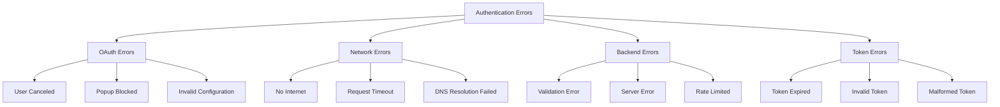

### Error Response Handling

| Error Type            | Detection Method           | User Message                                    | Technical Action               | Retry Strategy          |
| --------------------- | -------------------------- | ----------------------------------------------- | ------------------------------ | ----------------------- |
| Google OAuth Canceled | No credential in response  | "Sign-in was canceled"                          | Return to login page           | Allow immediate retry   |
| Popup Blocked         | popup_blocked_by_browser   | "Please allow popups for this site"             | Show instruction               | Manual retry            |
| Network Error         | Request fails, no response | "Connection error. Please check your internet." | Queue request                  | Auto-retry with backoff |
| Invalid Google Token  | Backend returns 401        | "Authentication failed. Please try again."      | Clear storage, return to login | Allow immediate retry   |
| Backend Unavailable   | 5xx status code            | "Service temporarily unavailable"               | Log error                      | Auto-retry with limit   |
| Token Expired         | 401 from API               | Silent (background refresh)                     | Trigger refresh flow           | One automatic retry     |
| Refresh Failed        | Refresh endpoint 401       | "Session expired. Please log in again."         | Clear storage, redirect        | Manual retry            |
| Rate Limit Exceeded   | 429 status code            | "Too many requests. Please wait."               | Implement backoff              | Retry after delay       |
| Invalid Email Format  | Client-side validation     | "Invalid email address"                         | Prevent submission             | Immediate correction    |

### Error Recovery Workflows

**Network Error Recovery:**

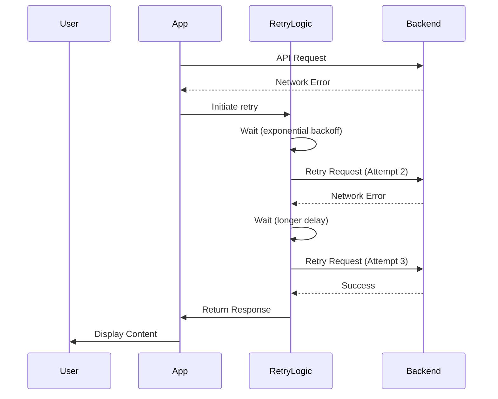

**Token Refresh Failure Recovery:**

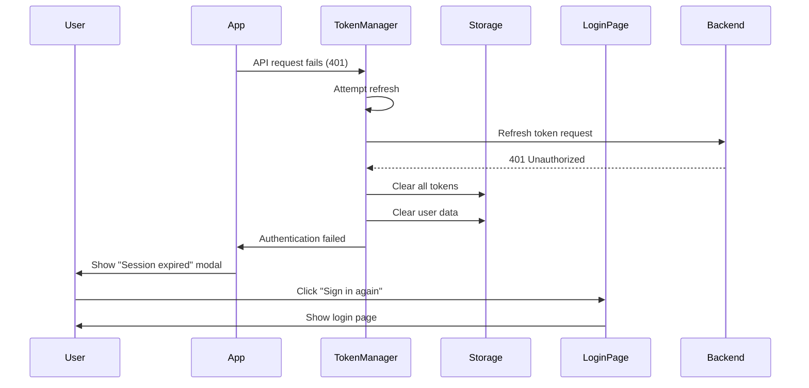

## Integration with Existing Application

### Layout Integration

The authentication system integrates with the existing Next.js application layout structure, which utilizes SidebarProvider and AppSidebar components.

**Integration Strategy:**

- AuthProvider wraps the existing layout hierarchy
- Authentication state made available to all components
- Sidebar navigation items conditionally rendered based on auth state
- User profile section in sidebar displays authenticated user info
- Logout functionality integrated into sidebar dropdown menu

**Layout Hierarchy:**

Following the existing `app/layout.tsx` structure:

```
RootLayout (app/layout.tsx)
├── <html lang="en">
│   └── <body className={geistSans.variable geistMono.variable antialiased}>
│       └── AuthProvider (new - app/_components/AuthProvider.tsx)
│           └── SidebarProvider (existing - from components/ui/sidebar)
│               ├── AppSidebar (enhanced - app/_components/Sidebar.tsx)
│               │   ├── SidebarHeader
│               │   │   └── NavTrack Branding
│               │   ├── SidebarContent
│               │   │   └── Navigation Items (Activity Tracker, Leaves, Comp-Off)
│               │   └── SidebarFooter
│               │       └── User Profile Dropdown (enhanced with auth)
│               │           ├── Avatar (Google profile picture)
│               │           ├── User Info (name, email from AUTH)
│               │           └── Logout Menu Item (new)
│               └── SidebarInset
│                   └── {children} (Page Content)
```

### Navigation Enhancement

**Sidebar User Section Enhancement:**

The existing `app/_components/Sidebar.tsx` contains a user dropdown in the `SidebarFooter`. This will be enhanced with real authentication data.

**Current Implementation to Enhance:**

- Replace hardcoded user data with authenticated user from context
- Update Avatar to use Google profile picture from `AUTH.avatar`
- Update user name from `AUTH.name`
- Update user email from `AUTH.email`
- Add authentication check before rendering dropdown
- Enhance "Log out" menu item with actual logout functionality

**Enhanced User Data Flow:**

```
AuthProvider Context
└── AUTH localStorage data
    ├── name → SidebarFooter user name display
    ├── email → SidebarFooter user email display
    └── avatar → Avatar component src
```

**Menu Items Visibility (in DropdownMenuContent):**

| Menu Item      | Current State | Visibility Rule    | Action                                                     |
| -------------- | ------------- | ------------------ | ---------------------------------------------------------- |
| Upgrade to Pro | Existing      | Authenticated only | Navigate to upgrade page                                   |
| Account        | Existing      | Authenticated only | Navigate to account settings                               |
| Billing        | Existing      | Authenticated only | Navigate to billing                                        |
| Notifications  | Existing      | Authenticated only | Navigate to notifications                                  |
| Log out        | Existing      | Authenticated only | Call logout handler, clear tokens, redirect to /auth/login |

**Navigation Items (in SidebarContent):**

Existing navigation items remain as-is but pages will be protected:

- Activity Tracker (/tracker) - Protected route
- Leaves submenu - Protected routes
  - Leave Application (/leaves/application)
  - Leave History (/leaves/history)
- Comp-Off Request (/compoff) - Protected route

### Routing Strategy

**New Routes:**

| Route          | Purpose                            | Protection                         | Component     |
| -------------- | ---------------------------------- | ---------------------------------- | ------------- |
| /auth/login    | Login page with Google OAuth       | Public (redirect if authenticated) | LoginPage     |
| /auth/callback | OAuth callback handler (if needed) | Public                             | OAuthCallback |

**Modified Routes:**

Existing routes will be wrapped with route protection:

- /dashboard - Add authentication requirement
- /tracker - Add authentication requirement
- /leaves/\* - Add authentication requirement
- /compoff - Add authentication requirement

### Root Route (/) Behavior

| User State      | Action                      | Implementation                              |
| --------------- | --------------------------- | ------------------------------------------- |
| Authenticated   | Display main dashboard page | Current app/page.tsx with dashboard content |
| Unauthenticated | Redirect to /auth/login     | Auth check in page component or middleware  |

**Note:** The root route (/) currently displays dashboard content and should be treated as a protected route or redirect to /dashboard.

## Testing Strategy

### Unit Testing Scope

**Components to Test:**

- GoogleLoginButton: Rendering, click handlers, state management
- AuthProvider: Context value provision, state updates
- ProtectedRoute: Auth checks, redirection logic
- Login page: Component rendering, user interactions

**Services to Test:**

- AuthService: All public methods, error handling
- TokenService: Token storage, retrieval, validation
- APIClient: Request/response interceptors, retry logic

**Test Coverage Targets:**

- Component coverage: 80%+
- Service coverage: 90%+
- Critical paths: 100%

### Integration Testing Scope

**Test Scenarios:**

| Test Scenario                     | Test Steps                                             | Expected Outcome                               | Assertions                               |
| --------------------------------- | ------------------------------------------------------ | ---------------------------------------------- | ---------------------------------------- |
| Successful Login Flow             | Click Google button → Complete OAuth → Verify redirect | User authenticated and redirected to dashboard | Tokens stored, user data available       |
| Failed Login - Invalid Token      | Mock invalid Google token → Submit                     | Error message displayed                        | No tokens stored, user remains on login  |
| Failed Login - Backend Error      | Mock backend 500 error → Submit                        | Error message displayed                        | Appropriate error handling, retry option |
| Token Refresh Success             | Make API call with expired token → Verify refresh      | Request succeeds after refresh                 | New tokens stored, request completed     |
| Token Refresh Failure             | Mock refresh endpoint failure → Verify redirect        | User redirected to login                       | All tokens cleared                       |
| Protected Route - Authenticated   | Navigate to /dashboard when authenticated              | Dashboard displayed                            | Content loaded successfully              |
| Protected Route - Unauthenticated | Navigate to /dashboard when not authenticated          | Redirected to login                            | Return URL preserved                     |
| Logout Flow                       | Click logout → Verify state                            | User logged out, redirected to login           | All tokens cleared                       |

### End-to-End Testing Scope

**User Journey Tests:**

1. **Complete Authentication Journey:**

   - Navigate to application
   - Click Google Sign-In
   - Complete Google OAuth flow
   - Verify redirect to dashboard
   - Navigate to protected routes
   - Verify content loads
   - Logout
   - Verify redirect to login

2. **Session Persistence Journey:**

   - Login successfully
   - Close browser
   - Reopen browser
   - Navigate to application
   - Verify still authenticated
   - Verify can access protected routes

3. **Token Expiration Journey:**

   - Login successfully
   - Wait for token expiration (or mock)
   - Make API request
   - Verify automatic refresh
   - Verify request succeeds
   - Continue using application

4. **Error Recovery Journey:**
   - Attempt login with network disabled
   - Verify error message
   - Enable network
   - Retry login
   - Verify success

### Mocking Strategy

**External Dependencies to Mock:**

| Dependency               | Mock Implementation             | Purpose                                 |
| ------------------------ | ------------------------------- | --------------------------------------- |
| Google Identity Services | Mock OAuth response object      | Test OAuth handling without real Google |
| Backend API endpoints    | Mock successful/error responses | Test API integration logic              |
| LocalStorage             | In-memory mock storage          | Test storage operations                 |
| JWT decode library       | Mock decoded token structure    | Test token processing                   |
| Network requests         | Mock fetch/axios responses      | Test network error handling             |

## Configuration Requirements

### Google OAuth Configuration

**Google Cloud Console Setup Requirements:**

1. Create OAuth 2.0 Client ID
2. Configure authorized JavaScript origins
3. Configure authorized redirect URIs
4. Obtain Client ID
5. Configure OAuth consent screen

**Configuration Parameters:**

| Parameter          | Description                    | Example Value                                  | Environment Variable               |
| ------------------ | ------------------------------ | ---------------------------------------------- | ---------------------------------- |
| Client ID          | Google OAuth client identifier | 123456789-abc.apps.googleusercontent.com       | NEXT_PUBLIC_GOOGLE_CLIENT_ID       |
| Authorized Origins | Allowed domains for OAuth      | http://localhost:3000, https://app.example.com | N/A (configured in Google Console) |
| Redirect URIs      | OAuth callback URLs            | http://localhost:3000/auth/callback            | N/A (configured in Google Console) |
| Scopes             | Requested user permissions     | email, profile                                 | N/A (configured in code)           |

### Environment Variables

**Frontend Environment Variables:**

| Variable Name                  | Description            | Required | Default        | Example                                  |
| ------------------------------ | ---------------------- | -------- | -------------- | ---------------------------------------- |
| NEXT_PUBLIC_GOOGLE_CLIENT_ID   | Google OAuth client ID | Yes      | None           | 123456789-abc.apps.googleusercontent.com |
| NEXT_PUBLIC_API_BASE_URL       | Backend API base URL   | Yes      | None           | https://api.example.com                  |
| NEXT_PUBLIC_OAUTH_REDIRECT_URI | OAuth callback URL     | No       | /auth/callback | /auth/callback                           |

**Backend Environment Variables:**

| Variable Name      | Description                               | Required | Default | Example                                  |
| ------------------ | ----------------------------------------- | -------- | ------- | ---------------------------------------- |
| GOOGLE_CLIENT_ID   | Google OAuth client ID (for verification) | Yes      | None    | 123456789-abc.apps.googleusercontent.com |
| JWT_SECRET         | Secret for signing access tokens          | Yes      | None    | your-secret-key                          |
| JWT_ACCESS_EXPIRY  | Access token expiration time              | No       | 15m     | 30m                                      |
| JWT_REFRESH_EXPIRY | Refresh token expiration time             | No       | 7d      | 30d                                      |

### Dependencies to Install

**Frontend Dependencies:**

| Package             | Version | Purpose                             |
| ------------------- | ------- | ----------------------------------- |
| jwt-decode          | ^4.0.0  | Decode Google ID tokens client-side |
| @react-oauth/google | ^0.12.0 | Google OAuth React integration      |
| axios               | ^1.6.0  | HTTP client for API requests        |

**Installation Command:**

```
pnpm add jwt-decode @react-oauth/google axios
```

**TypeScript Type Definitions:**

| Package           | Version | Purpose                         |
| ----------------- | ------- | ------------------------------- |
| @types/jwt-decode | Latest  | TypeScript types for jwt-decode |

## Implementation Phases

### Phase 1: Foundation Setup

**Objectives:**

- Install and configure required dependencies
- Set up environment variables
- Create basic authentication service structure
- Initialize Google OAuth library

**Deliverables:**

- Dependencies installed via pnpm
- Environment variables configured
- AuthService skeleton created
- Google OAuth initialized on app load

**Success Criteria:**

- Application builds without errors
- Google OAuth library loads successfully
- Environment variables accessible in code

### Phase 2: Google OAuth Integration

**Objectives:**

- Create login page with Google Sign-In button
- Implement OAuth callback handling
- Extract and decode Google ID token
- Handle OAuth success and error scenarios

**Deliverables:**

- Login page component
- GoogleLoginButton component
- Token extraction logic
- Error handling for OAuth flow

**Success Criteria:**

- Google Sign-In button renders correctly
- OAuth flow completes successfully
- ID token extracted and decoded
- User email retrieved from token

### Phase 3: Backend Authentication

**Objectives:**

- Implement API client configuration
- Create backend login integration
- Handle authentication response
- Store tokens in localStorage

**Deliverables:**

- Configured API client
- Login API integration
- Token storage logic
- User data persistence

**Success Criteria:**

- Login request sent to backend successfully
- Tokens received and stored
- User data accessible application-wide
- Error responses handled appropriately

### Phase 4: Token Management

**Objectives:**

- Implement token refresh mechanism
- Create request/response interceptors
- Handle token expiration
- Automatic token refresh on 401 errors

**Deliverables:**

- Token refresh service
- API client interceptors
- Automatic refresh logic
- Retry mechanism for failed requests

**Success Criteria:**

- Expired tokens refreshed automatically
- API requests succeed after refresh
- User experience remains seamless
- Failed refresh triggers logout

### Phase 5: Route Protection

**Objectives:**

- Create authentication context
- Implement protected route wrapper
- Add route guards to existing routes
- Handle unauthorized access

**Deliverables:**

- AuthProvider context component
- ProtectedRoute wrapper component
- Updated route configuration
- Redirect logic for unauthorized users

**Success Criteria:**

- Protected routes inaccessible without authentication
- Unauthenticated users redirected to login
- Return URL preserved and used after login
- Authenticated users can access all protected routes

### Phase 6: UI Integration & Styling

**Objectives:**

- Enhance Sidebar.tsx with real user information
- Add logout functionality to existing dropdown
- Style login page with existing design system
- Implement loading and error states using existing patterns
- Ensure consistent styling across all components

**Deliverables:**

- Enhanced app/\_components/Sidebar.tsx with auth context integration
- Logout handler integrated into existing "Log out" menu item
- Styled app/auth/login/page.tsx using existing CSS variables and classes
- GoogleLoginButton component using Button from components/ui/button.tsx
- Loading states using existing spinner patterns
- Error messages styled with existing color scheme

**Styling Checklist:**

- Apply `rounded-base` (5px) for all rounded corners
- Use `border-2 border-border` for consistent borders
- Apply `shadow-shadow` (4px 4px 0px 0px) for card shadows
- Use `bg-background` and `bg-secondary-background` appropriately
- Apply `text-foreground` for text colors
- Use `bg-main text-main-foreground` for primary buttons
- Follow existing spacing scale (gap-2, px-4, py-2, etc.)
- Use `font-heading` for headings and `font-base` for body text
- Maintain hover effects with translate-x/y for shadow animation

**Success Criteria:**

- User profile displays Google data correctly in sidebar
- Logout clears all tokens and redirects to /auth/login
- Login page matches existing design aesthetic
- All components use existing button, avatar, and UI components
- Loading states provide visual feedback
- Error messages are clear and styled consistently

### Phase 7: Testing & Refinement

**Objectives:**

- Write unit tests for critical components
- Implement integration tests
- Conduct end-to-end testing
- Fix bugs and refine UX

**Deliverables:**

- Unit test suite
- Integration test suite
- E2E test scenarios
- Bug fixes and improvements

**Success Criteria:**

- 80%+ code coverage achieved
- All critical paths tested
- No major bugs in production
- Smooth user experience validated

## Monitoring and Observability

### Authentication Metrics

**Key Metrics to Track:**

| Metric               | Description                             | Tracking Method                        | Alert Threshold       |
| -------------------- | --------------------------------------- | -------------------------------------- | --------------------- |
| Login Success Rate   | Percentage of successful logins         | Log successful logins / total attempts | < 95%                 |
| Login Failure Rate   | Percentage of failed logins             | Log failed logins / total attempts     | > 5%                  |
| Token Refresh Rate   | Frequency of token refresh operations   | Count refresh requests                 | Unusual spike         |
| Session Duration     | Average time between login and logout   | Calculate from timestamps              | N/A (monitoring only) |
| OAuth Error Rate     | Google OAuth failures                   | Log OAuth errors / attempts            | > 2%                  |
| Backend Auth Latency | Time to complete backend authentication | Measure API response time              | > 2 seconds           |

### Error Logging

**Events to Log:**

| Event                 | Severity | Information to Capture                | Purpose                           |
| --------------------- | -------- | ------------------------------------- | --------------------------------- |
| OAuth Initiation      | Info     | Timestamp, user action                | Track authentication attempts     |
| OAuth Success         | Info     | User email, timestamp                 | Track successful authentications  |
| OAuth Failure         | Warning  | Error type, error message, timestamp  | Debug authentication issues       |
| Backend Login Request | Info     | Email, timestamp                      | Track backend requests            |
| Backend Login Success | Info     | User ID, timestamp                    | Confirm successful authentication |
| Backend Login Failure | Error    | Status code, error message, timestamp | Debug backend issues              |
| Token Refresh Success | Info     | Timestamp                             | Monitor refresh frequency         |
| Token Refresh Failure | Error    | Error message, timestamp              | Debug token issues                |
| Session Expired       | Warning  | User ID, timestamp                    | Track session management          |
| Logout                | Info     | User ID, timestamp                    | Track user activity               |

### Performance Monitoring

**Performance Indicators:**

| Indicator                 | Target      | Measurement Method                      | Optimization Strategy        |
| ------------------------- | ----------- | --------------------------------------- | ---------------------------- |
| OAuth Flow Duration       | < 3 seconds | Time from button click to token receipt | Optimize popup handling      |
| Login API Response Time   | < 1 second  | Measure backend request duration        | Backend optimization         |
| Token Storage Time        | < 100ms     | Measure localStorage operations         | Minimize data stored         |
| Page Load (Authenticated) | < 2 seconds | Measure time to interactive             | Code splitting, lazy loading |
| Token Refresh Time        | < 500ms     | Measure refresh endpoint response       | Backend caching              |

## Accessibility Considerations

### WCAG Compliance

**Compliance Target:** WCAG 2.1 Level AA

**Key Requirements:**

| Requirement           | Implementation                                   | Validation Method          |
| --------------------- | ------------------------------------------------ | -------------------------- |
| Keyboard Navigation   | All interactive elements accessible via keyboard | Manual keyboard testing    |
| Focus Indicators      | Visible focus states on all interactive elements | Visual inspection          |
| Screen Reader Support | Proper ARIA labels and semantic HTML             | Screen reader testing      |
| Color Contrast        | 4.5:1 minimum contrast ratio                     | Automated contrast checker |
| Alternative Text      | Descriptive alt text for images and icons        | Code review                |
| Error Identification  | Clear error messages and instructions            | Usability testing          |

### Assistive Technology Support

**Login Page Accessibility:**

- Google Sign-In button has descriptive aria-label
- Error messages announced to screen readers
- Loading states communicated via aria-live regions
- Focus management during OAuth flow
- High contrast mode support

**Navigation Accessibility:**

- Sidebar navigation keyboard accessible
- User profile dropdown keyboard operable
- Logout button clearly labeled
- Skip to main content link available

## Future Enhancements

### Potential Improvements

| Enhancement                   | Description                                  | Priority | Effort | Impact |
| ----------------------------- | -------------------------------------------- | -------- | ------ | ------ |
| Multi-Factor Authentication   | Add optional 2FA for enhanced security       | Medium   | High   | High   |
| Remember Me Feature           | Extended session duration option             | Low      | Low    | Medium |
| Social Login Options          | Add Microsoft, GitHub, etc.                  | Medium   | Medium | Medium |
| Biometric Authentication      | Face ID, Touch ID support                    | Low      | High   | Medium |
| Session Management Dashboard  | View and revoke active sessions              | Low      | Medium | Low    |
| JWT Token in HTTPOnly Cookies | Move tokens to cookies for better security   | High     | Medium | High   |
| Token Rotation Policy         | Implement refresh token rotation             | High     | Medium | High   |
| OAuth State Parameter         | Add CSRF protection to OAuth flow            | High     | Low    | High   |
| Audit Logging                 | Comprehensive authentication event logging   | Medium   | Medium | Medium |
| Rate Limiting                 | Client-side rate limiting for login attempts | Medium   | Low    | Medium |

### Scalability Considerations

**Current Limitations:**

- LocalStorage has 5-10MB size limit
- Client-side token refresh may cause race conditions with multiple requests
- No centralized session management

**Scalability Improvements:**

- Implement token refresh queue to prevent multiple simultaneous refresh requests
- Consider server-side session management for multi-device support
- Implement token revocation mechanism
- Add session synchronization across browser tabs
- Consider Redis-based session storage on backend
