# Sidebar Implementation Verification and Page Scaffold Design

## Overview

This design addresses the systematic verification and implementation of the AppSidebar component across all application routes, ensuring consistent navigation behavior and user experience. The design focuses on establishing a unified layout pattern that wraps all pages with the SidebarProvider component, creating placeholder pages for all navigation links defined in the sidebar, and maintaining responsive behavior across desktop and mobile viewports.

### Current State Analysis

The application currently has:

- A fully functional AppSidebar component with navigation items
- SidebarProvider implementation on the root page only
- Incomplete page structure - missing pages for declared navigation links
- Inconsistent layout patterns across existing pages

### Target Navigation Structure

Based on the AppSidebar navigation definition, the following routes are required:

| Route Path          | Navigation Title  | Parent Item       | Status                   |
| ------------------- | ----------------- | ----------------- | ------------------------ |
| /                   | Dashboard         | None              | Exists (with sidebar)    |
| /tracker            | Activity Tracker  | None              | Exists (without sidebar) |
| /leaves/application | Leave Application | Leave Application | Missing                  |
| /leaves/history     | Leave History     | Leave Application | Missing                  |
| /compoff            | Comp-Off Request  | None              | Missing                  |

## Architecture

### Layout Structure Strategy

The application will adopt a two-tier layout architecture to ensure sidebar consistency across all routes:

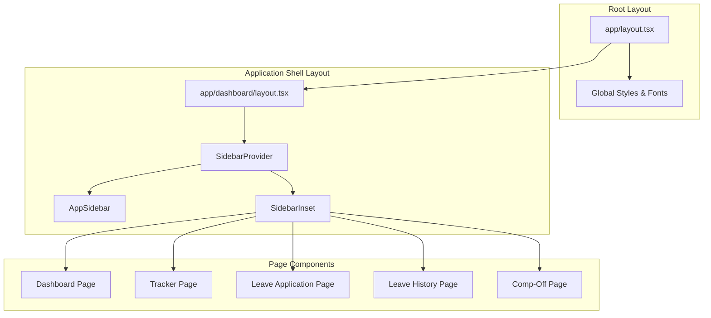

**Layout Hierarchy Decision:**

Two architectural approaches are viable:

1. **Root Layout Approach**: Apply SidebarProvider in `app/layout.tsx`

   - Ensures sidebar on all routes automatically
   - Simpler maintenance
   - Chosen for this implementation

2. **Route Group Approach**: Create `(dashboard)` route group with dedicated layout
   - Allows routes without sidebar if needed in future
   - More complex file structure
   - Better for mixed layout requirements

**Selected Approach**: Root Layout implementation for consistent sidebar presence across all routes.

### Component Relationship Model

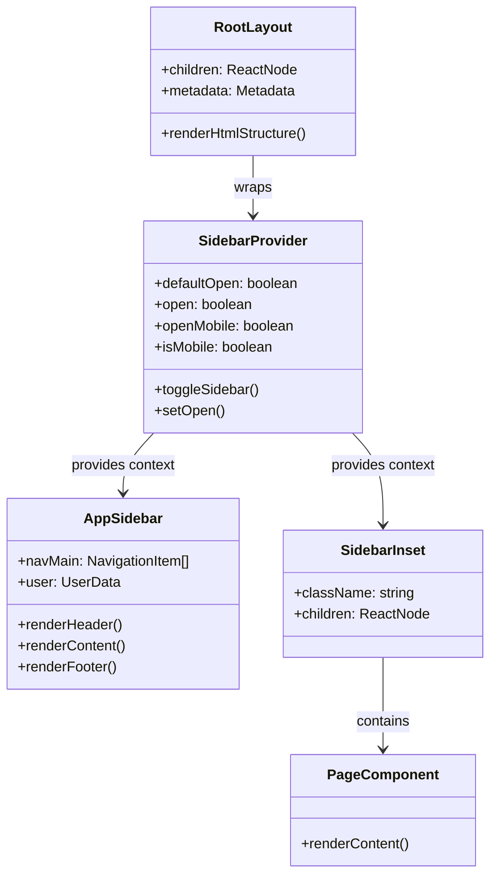

### State Management Flow

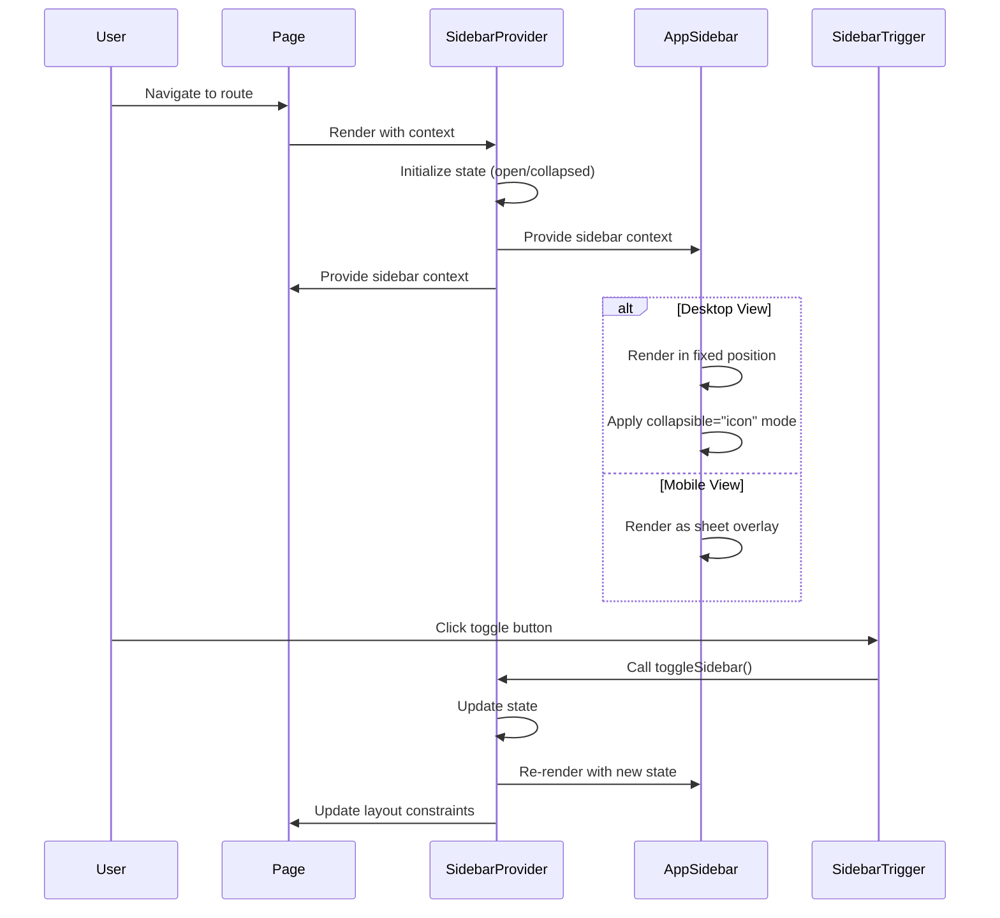

## Page Structure Definition

### Common Page Layout Pattern

All pages will follow a consistent structural pattern to ensure uniform user experience:

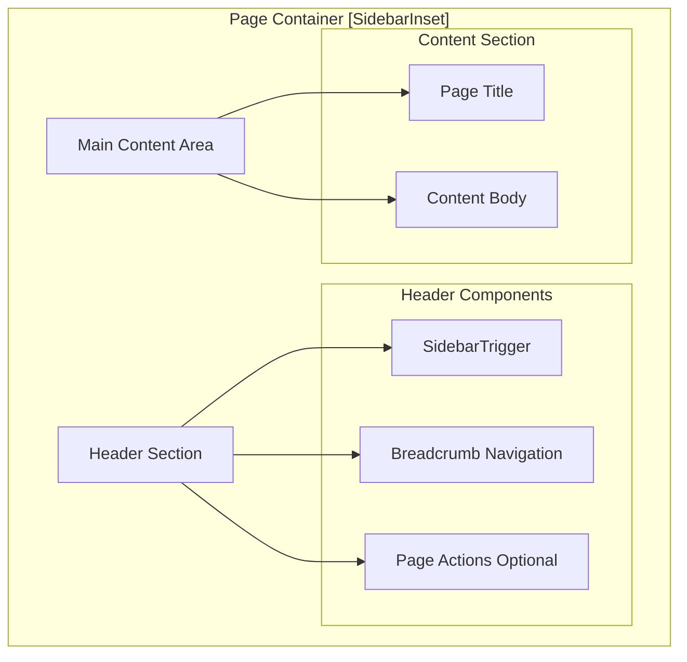

### Page Component Specifications

#### Dashboard Page (/)

**Purpose**: Primary landing page displaying activity overview and key metrics

**Layout Elements**:

- Header with breadcrumb showing current location
- Grid layout for metric cards (3 columns on desktop)
- Main content area for detailed information

**Breadcrumb Path**: Dashboard

#### Activity Tracker Page (/tracker)

**Purpose**: Time tracking interface for daily activity logging

**Layout Elements**:

- Header with breadcrumb
- Form or interface for activity entry
- Activity list or timeline view

**Breadcrumb Path**: Dashboard > Activity Tracker

#### Leave Application Page (/leaves/application)

**Purpose**: Form interface for submitting leave requests

**Layout Elements**:

- Header with breadcrumb
- Leave application form
- Submission actions

**Breadcrumb Path**: Dashboard > Leave Application > Apply

#### Leave History Page (/leaves/history)

**Purpose**: Historical view of submitted leave requests and their status

**Layout Elements**:

- Header with breadcrumb
- Table or list of leave records
- Filter and search capabilities

**Breadcrumb Path**: Dashboard > Leave Application > History

#### Comp-Off Request Page (/compoff)

**Purpose**: Interface for requesting compensatory time off

**Layout Elements**:

- Header with breadcrumb
- Comp-off request form
- Pending requests display

**Breadcrumb Path**: Dashboard > Comp-Off Request

## Page Template Structure

### Standard Page Composition

Each page will consist of the following architectural layers:

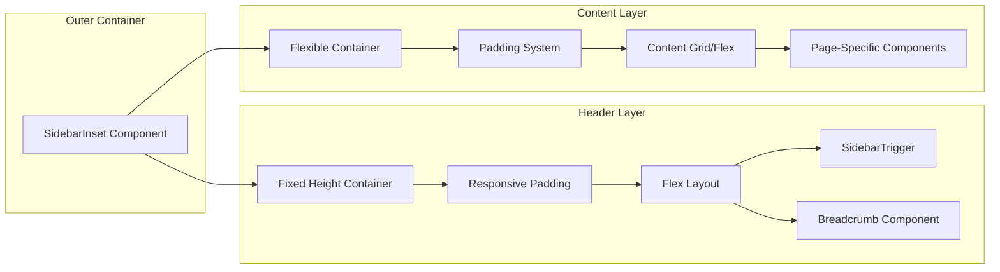

### Header Configuration

**Fixed Dimensions**:

- Height: 4rem (16 units) standard, 3rem (12 units) when sidebar collapsed to icon
- Transition: Smooth ease-linear animation for height changes

**Content Organization**:

- Left section: SidebarTrigger with negative left margin adjustment
- Center/Right section: Breadcrumb navigation
- Optional right section: Page-specific action buttons

### Content Area Configuration

**Layout Properties**:

- Flex display with column direction
- Flex-grow enabled for vertical expansion
- Gap spacing: 1rem (4 units) between child elements
- Padding: 1rem (4 units) on all sides, zero top padding

**Responsive Behavior**:

- Grid layouts adapt from multi-column to single column on mobile
- Minimum height constraints prevent layout collapse
- Content maintains readability at all viewport sizes

## Navigation Integration

### Breadcrumb Navigation Strategy

Breadcrumbs provide contextual awareness of the user's location within the application hierarchy.

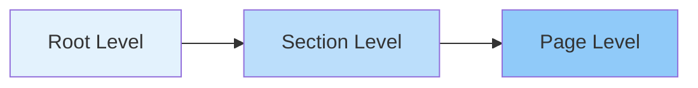

**Breadcrumb Definitions**:

| Page Route          | Breadcrumb Trail                        |
| ------------------- | --------------------------------------- |
| /                   | Dashboard                               |
| /tracker            | Dashboard → Activity Tracker            |
| /leaves/application | Dashboard → Leave Application → Apply   |
| /leaves/history     | Dashboard → Leave Application → History |
| /compoff            | Dashboard → Comp-Off Request            |

**Implementation Pattern**:

Each breadcrumb trail consists of:

1. **BreadcrumbList**: Container for breadcrumb items
2. **BreadcrumbItem**: Individual breadcrumb node
3. **BreadcrumbLink**: Clickable ancestor links
4. **BreadcrumbPage**: Current page (non-clickable)
5. **BreadcrumbSeparator**: Visual separator between items

### Sidebar Navigation Item Behavior

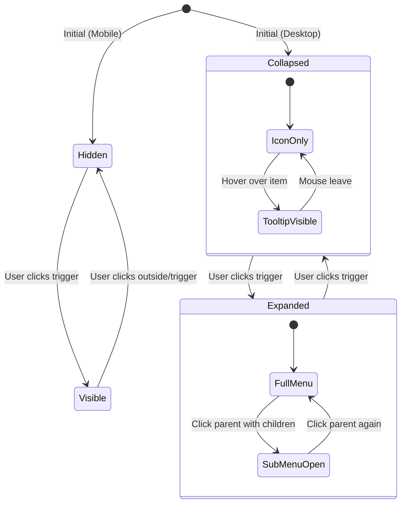

**Navigation Item Types**:

1. **Simple Navigation Item**:

   - Direct link to single page
   - Icon and label visible when expanded
   - Icon only with tooltip when collapsed
   - Examples: Dashboard, Activity Tracker, Comp-Off Request

2. **Collapsible Navigation Item**:
   - Parent item with child sub-items
   - Chevron indicator for expand/collapse state
   - Sub-menu revealed on expansion
   - Example: Leave Application (with Apply and History sub-items)

### Active State Management

The sidebar must visually indicate the current active route to provide user orientation.

**Active State Indicators**:

- Background color change to primary theme color
- Text color adjustment for contrast
- Border outline for emphasis
- Maintained across page navigations

**Active State Logic**:

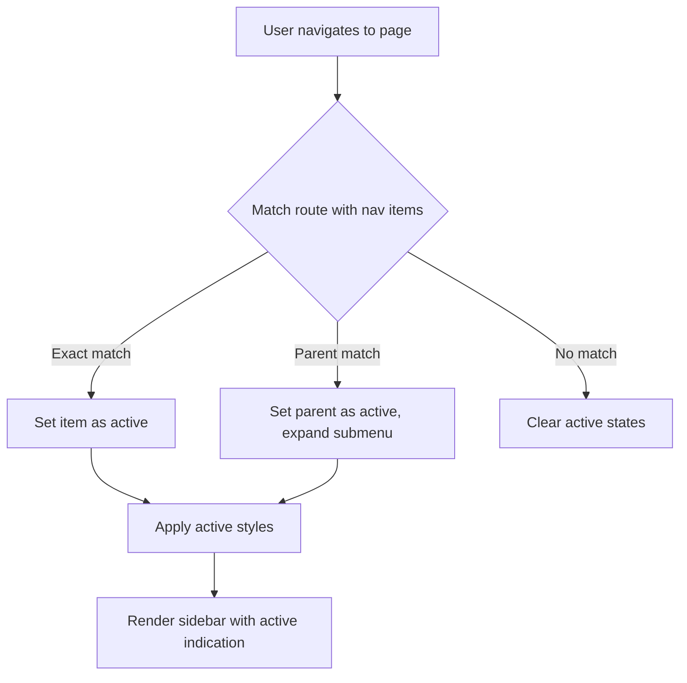

## Responsive Design Considerations

### Viewport Breakpoints

The sidebar system responds to viewport width using the following breakpoint strategy:

| Breakpoint     | Width Range | Sidebar Behavior                   |
| -------------- | ----------- | ---------------------------------- |
| Mobile         | < 768px     | Sheet overlay, hidden by default   |
| Tablet/Desktop | ≥ 768px     | Fixed sidebar, collapsible to icon |

### Mobile Interaction Pattern

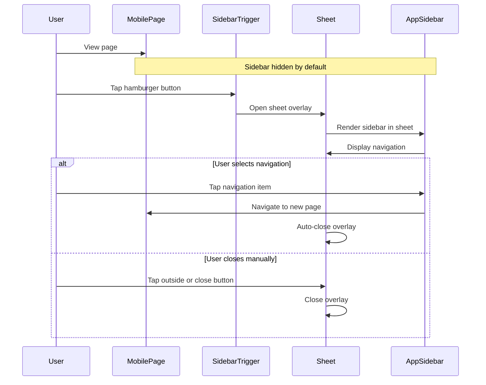

### Desktop Interaction Pattern

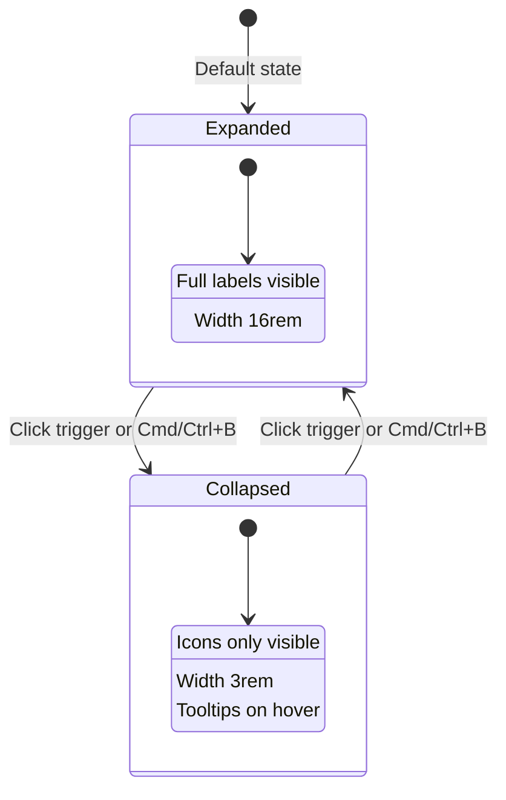

### Layout Adaptation

**Sidebar Width Transitions**:

- Expanded: 16rem (256px)
- Collapsed: 3rem (48px)
- Mobile Sheet: 18rem (288px)
- Transition duration: 200ms ease-linear

**Content Area Adjustments**:

- Content automatically reflows when sidebar state changes
- No content clipping or overlap during transitions
- Maintained readability at all sidebar states

## Implementation Requirements

### Root Layout Modification

The `app/layout.tsx` file must be restructured to wrap all child content with the SidebarProvider and establish the application shell.

**Required Changes**:

1. Import SidebarProvider component
2. Import AppSidebar component
3. Import SidebarInset component
4. Import SidebarTrigger component (for mobile accessibility)
5. Wrap children with SidebarProvider → AppSidebar + SidebarInset hierarchy

**Layout Structure After Modification**:

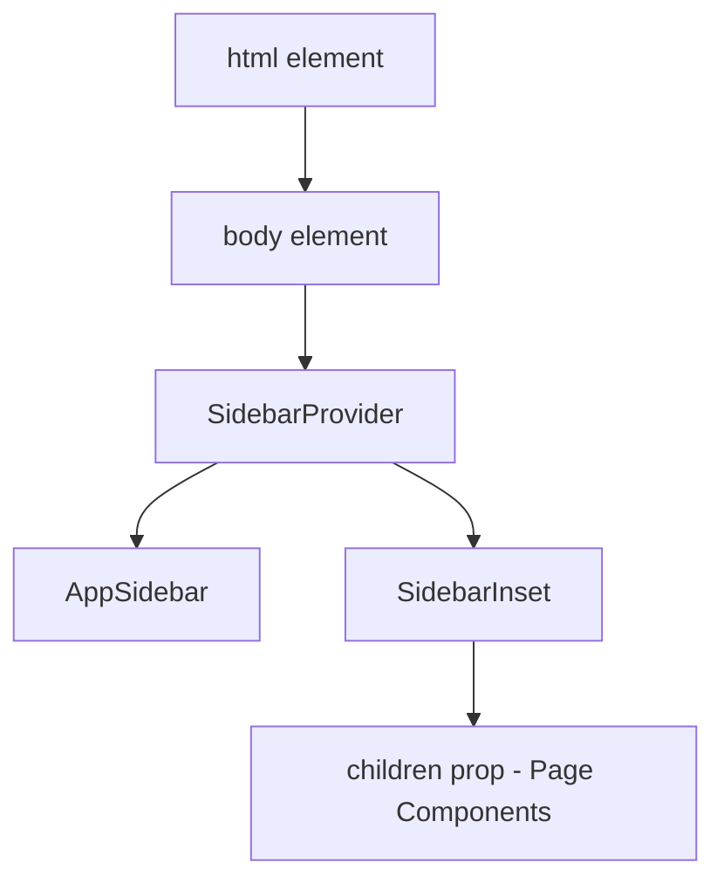

### Missing Page Creation

All pages must be created with consistent structure and placeholder content.

#### Page: /leaves/application

**File Location**: `app/leaves/application/page.tsx`

**Content Requirements**:

- Page component export
- SidebarInset wrapper
- Header section with SidebarTrigger
- Breadcrumb: Dashboard → Leave Application → Apply
- Placeholder text indicating "Leave Application Page"
- Grid or card layout prepared for form elements

#### Page: /leaves/history

**File Location**: `app/leaves/history/page.tsx`

**Content Requirements**:

- Page component export
- SidebarInset wrapper
- Header section with SidebarTrigger
- Breadcrumb: Dashboard → Leave Application → History
- Placeholder text indicating "Leave History Page"
- Table or list layout prepared for historical records

#### Page: /compoff

**File Location**: `app/compoff/page.tsx`

**Content Requirements**:

- Page component export
- SidebarInset wrapper
- Header section with SidebarTrigger
- Breadcrumb: Dashboard → Comp-Off Request
- Placeholder text indicating "Comp-Off Request Page"
- Form layout prepared for comp-off requests

### Existing Page Updates

#### Update: /tracker page

**File Location**: `app/tracker/page.tsx`

**Required Modifications**:

1. Import SidebarInset component
2. Import SidebarTrigger component
3. Import Breadcrumb components
4. Wrap existing content with SidebarInset
5. Add header section with SidebarTrigger
6. Add breadcrumb navigation
7. Move existing content to main content area

#### Update: /dashboard page (if different from root)

**File Location**: `app/dashboard/page.tsx`

**Required Modifications**:

1. Verify SidebarInset wrapper
2. Verify header with SidebarTrigger
3. Update breadcrumb if needed
4. Ensure consistent layout pattern

## Verification Checklist

### Structural Verification

The following verification steps ensure complete and correct implementation:

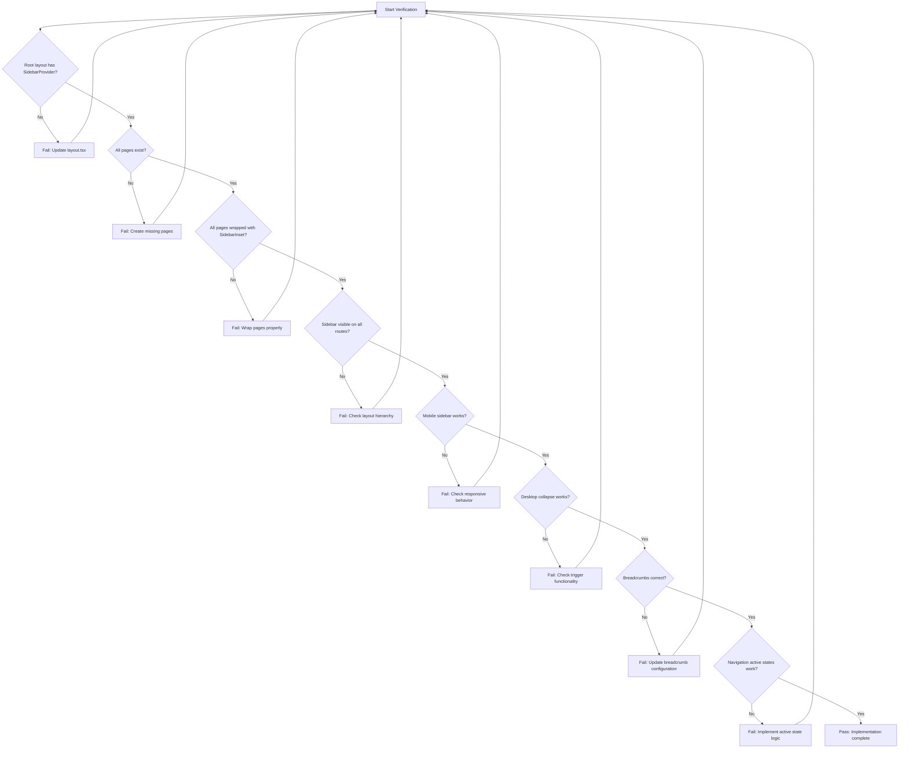

### Functional Testing Matrix

| Test Case                           | Expected Behavior                                           | Success Criteria                               |
| ----------------------------------- | ----------------------------------------------------------- | ---------------------------------------------- |
| Navigate to /                       | Sidebar visible, Dashboard active                           | Sidebar present, correct active state          |
| Navigate to /tracker                | Sidebar visible, Activity Tracker active                    | Sidebar present, correct active state          |
| Navigate to /leaves/application     | Sidebar visible, Leave Application expanded, Apply active   | Sidebar present, parent expanded, child active |
| Navigate to /leaves/history         | Sidebar visible, Leave Application expanded, History active | Sidebar present, parent expanded, child active |
| Navigate to /compoff                | Sidebar visible, Comp-Off active                            | Sidebar present, correct active state          |
| Click SidebarTrigger (Desktop)      | Sidebar toggles expanded/collapsed                          | Smooth transition, content adjusts             |
| Click SidebarTrigger (Mobile)       | Sidebar sheet opens/closes                                  | Overlay appears/disappears                     |
| Press Cmd/Ctrl+B (Desktop)          | Sidebar toggles                                             | Same as trigger click                          |
| Hover over collapsed item (Desktop) | Tooltip appears                                             | Tooltip shows item label                       |
| Click collapsible parent            | Sub-menu expands/collapses                                  | Chevron rotates, sub-items appear              |
| Click sub-menu item                 | Navigates to page, parent stays expanded                    | Correct navigation, state preserved            |
| Resize from desktop to mobile       | Sidebar transitions to sheet mode                           | No layout breaks, proper mode switch           |
| Resize from mobile to desktop       | Sidebar transitions to fixed mode                           | No layout breaks, proper mode switch           |

### Visual Consistency Verification

**Elements to Verify**:

1. Header height consistent across all pages
2. Content padding uniform across all pages
3. Breadcrumb styling matches on all pages
4. Sidebar trigger position identical on all pages
5. Active navigation states clearly visible
6. Hover states functional on all interactive elements
7. Focus states visible for keyboard navigation
8. Color scheme consistent with design system

### Accessibility Verification

**Requirements**:

1. Keyboard navigation functional (Tab, Enter, Escape)
2. Screen reader announcements for sidebar state changes
3. ARIA labels present on interactive elements
4. Focus management during sidebar open/close
5. Skip links available for keyboard users
6. Sufficient color contrast ratios maintained
7. Tooltip content accessible via keyboard
8. Mobile sheet properly labeled for assistive technology

## Navigation Data Structure

### Current Navigation Configuration

The navigation structure is defined in the AppSidebar component's data object:

```typescript
const data = {
  user: {
    name: string,
    email: string,
    avatar: string,
  },
  navMain: [
    {
      title: string,
      url: string,
      icon: LucideIcon,
      isActive: boolean,
      items: [
        {
          title: string,
          url: string,
        },
      ],
    },
  ],
};
```

### Navigation Item Rendering Logic

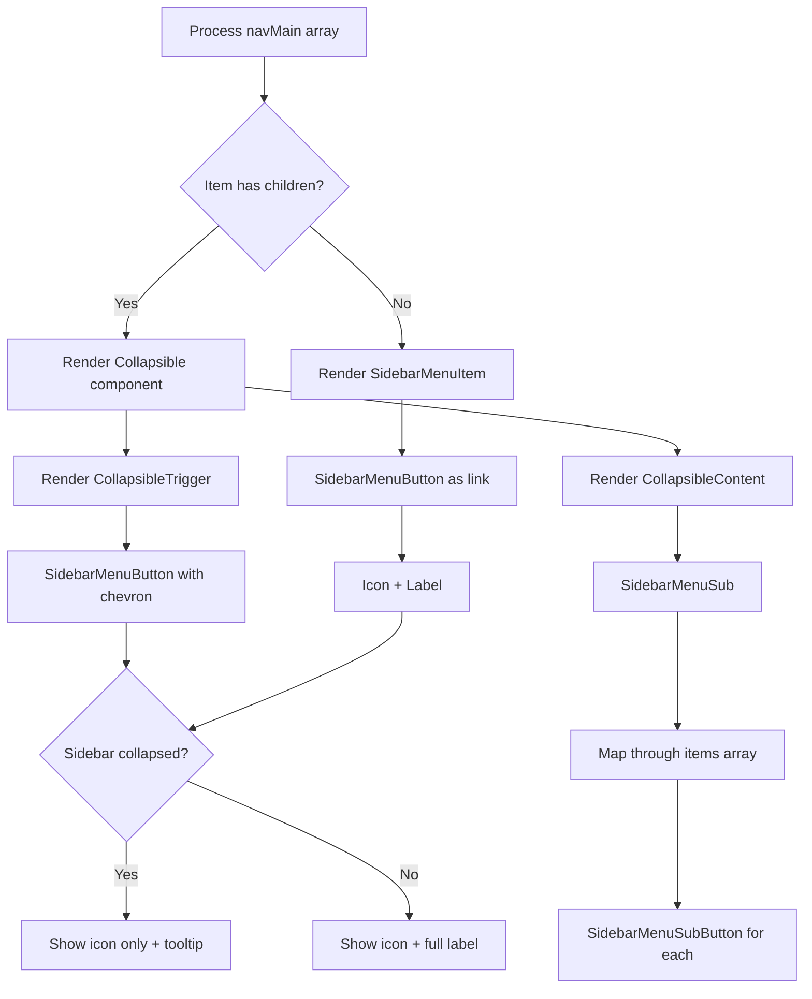

### Active State Detection Strategy

For proper active state indication, the navigation system should detect the current route and match it against navigation items.

**Route Matching Logic**:

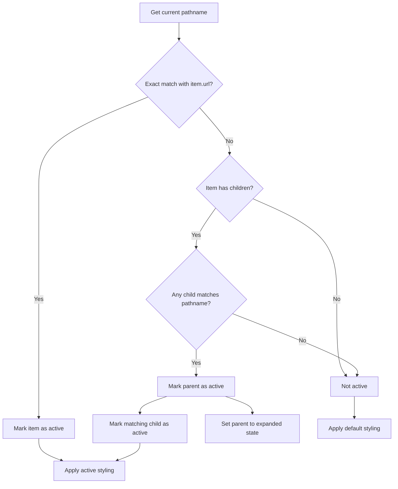

**Implementation Note**: The current AppSidebar implementation uses static `isActive` property. For dynamic active state detection, integration with Next.js `usePathname()` hook is recommended in future iterations.

## Integration Points

### Theme System Integration

The sidebar components must respect the application's theme system:

**CSS Custom Properties Used**:

- `--sidebar-width`: 16rem
- `--sidebar-width-icon`: 3rem
- `--sidebar-width-mobile`: 18rem
- Background colors from theme palette
- Border colors from theme palette
- Text colors from theme palette

### Font System Integration

**Typography Requirements**:

- Sidebar labels use base font (Geist Sans)
- Breadcrumb uses base font
- Page content uses base font
- Consistent font weights across navigation elements

### Routing System Integration

**Next.js App Router Considerations**:

- All page files must export default function component
- File-based routing determines URL structure
- Nested folders create nested routes
- `page.tsx` files define route endpoints

**Navigation Links**:

- Use anchor tags (`<a>`) for navigation within SidebarMenuButton
- Leverage Next.js automatic prefetching
- No client-side state required for navigation
- Browser history managed automatically

## Edge Cases and Constraints

### Nested Route Handling

**Scenario**: User navigates to a deep nested route not explicitly defined in sidebar

**Resolution Strategy**:

- Sidebar remains visible and functional
- No active state shown if route not in navigation
- Breadcrumb should still provide context if possible
- User can navigate via sidebar to defined routes

### Sidebar State Persistence

**Current Implementation**: Cookie-based persistence

**Behavior**:

- Sidebar state (expanded/collapsed) saved to cookie
- Cookie name: `sidebar_state`
- Cookie max age: 7 days (604800 seconds)
- State persists across browser sessions
- State persists across route changes

### Route Transition Behavior

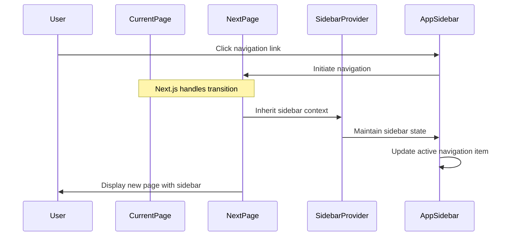

**State Preservation**:

- Sidebar open/closed state preserved during navigation
- Active navigation item updates based on new route
- Collapsible menu states may reset or persist based on implementation choice
- Mobile sheet closes on navigation (standard mobile UX pattern)

### Performance Considerations

**Optimization Strategies**:

- SidebarProvider context memoization prevents unnecessary re-renders
- Navigation item rendering optimized with React keys
- Transition animations use CSS transforms for GPU acceleration
- Mobile sheet uses React Portal for optimal rendering
- Lazy loading not required for navigation (critical UI element)

### Browser Compatibility

**Target Support**:

- Modern browsers supporting CSS custom properties
- Browsers supporting Flexbox and Grid layouts
- Touch event support for mobile interactions
- Keyboard event support for accessibility

**Graceful Degradation**:

- Sidebar remains functional without CSS transitions
- Navigation remains accessible without JavaScript
- Basic layout preserved in older browsers
