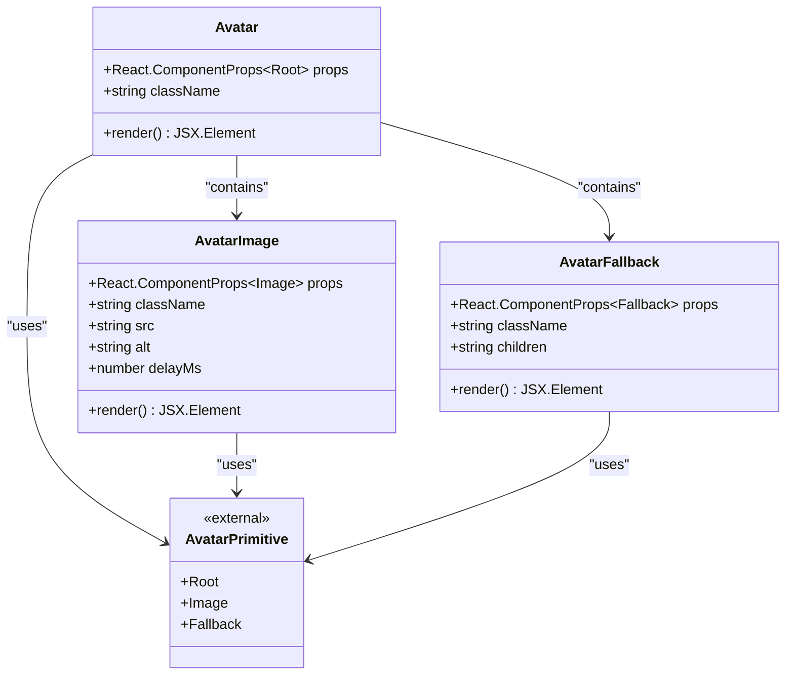
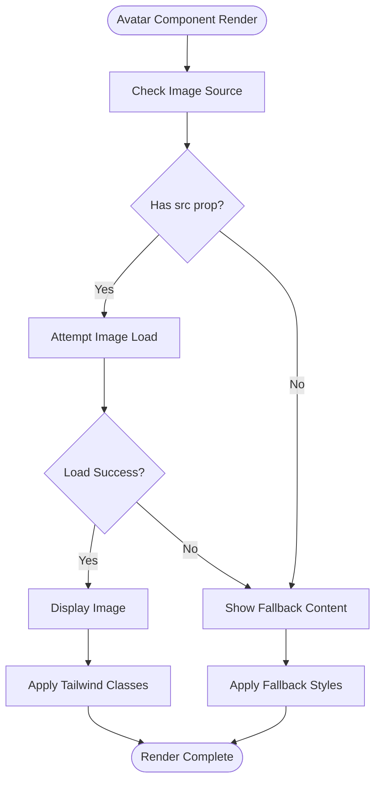

# Avatar Component API Documentation

<cite>
**Referenced Files in This Document**
- [components/ui/avatar.tsx](file://components/ui/avatar.tsx)
- [lib/utils.ts](file://lib/utils.ts)
- [app/_components/Sidebar.tsx](file://app/_components/Sidebar.tsx)
- [package.json](file://package.json)
- [components.json](file://components.json)
</cite>

## Table of Contents
1. [Introduction](#introduction)
2. [Component Overview](#component-overview)
3. [Core Components](#core-components)
4. [Props Reference](#props-reference)
5. [Implementation Details](#implementation-details)
6. [Usage Examples](#usage-examples)
7. [Integration Patterns](#integration-patterns)
8. [Accessibility Features](#accessibility-features)
9. [TypeScript Interfaces](#typescript-interfaces)
10. [Performance Considerations](#performance-considerations)
11. [Troubleshooting Guide](#troubleshooting-guide)
12. [Conclusion](#conclusion)

## Introduction

The Avatar component is a sophisticated UI primitive built on top of Radix UI's Avatar system, designed specifically for displaying user profiles and avatars in the activity-tracker application. This component provides a robust foundation for handling image loading, fallback scenarios, and accessibility compliance while integrating seamlessly with Tailwind CSS utilities.

The Avatar system consists of three interconnected components: `Avatar` (root container), `AvatarImage` (image element), and `AvatarFallback` (fallback content). Together, they create a complete avatar solution that handles various edge cases including missing images, loading delays, and accessibility requirements.

## Component Overview

The Avatar component system follows a hierarchical structure where each component serves a specific purpose:



**Diagram sources**
- [components/ui/avatar.tsx](file://components/ui/avatar.tsx#L1-L55)

**Section sources**
- [components/ui/avatar.tsx](file://components/ui/avatar.tsx#L1-L55)

## Core Components

### Avatar Root Component

The `Avatar` component serves as the primary container and wrapper for the entire avatar system. It establishes the fundamental styling and structure for avatar displays.

**Key Features:**
- Fixed size of 10x10 units (typically translates to 40x40px)
- Circular shape with rounded corners
- Overflow hidden to contain child elements
- Outline border for focus states
- Data slot attribute for testing and styling identification

### AvatarImage Component

The `AvatarImage` component handles the actual image display and loading logic. It inherits all standard HTML image attributes while adding specialized behavior for avatar contexts.

**Key Features:**
- Aspect ratio containment for square images
- Full container sizing
- Automatic fallback triggering on load failure
- Delayed loading support for performance optimization

### AvatarFallback Component

The `AvatarFallback` component provides graceful degradation when images fail to load or are not provided. It ensures users always see meaningful content.

**Key Features:**
- Centered content alignment
- Background color for contrast
- Text color and typography inheritance
- Automatic activation when image fails to load

**Section sources**
- [components/ui/avatar.tsx](file://components/ui/avatar.tsx#L9-L55)

## Props Reference

### Avatar Component Props

| Prop | Type | Required | Default | Description |
|------|------|----------|---------|-------------|
| `className` | `string` | No | `undefined` | Additional CSS classes for customization |

### AvatarImage Component Props

| Prop | Type | Required | Default | Description |
|------|------|----------|---------|-------------|
| `className` | `string` | No | `undefined` | Additional CSS classes for customization |
| `src` | `string` | Yes | - | Image URL source |
| `alt` | `string` | Yes | - | Alternative text for accessibility |
| `delayMs` | `number` | No | `0` | Loading delay in milliseconds |
| `onLoad` | `React.EventHandler<React.SyntheticEvent<HTMLImageElement>>` | No | `undefined` | Load completion handler |
| `onError` | `React.EventHandler<React.SyntheticEvent<HTMLImageElement>>` | No | `undefined` | Error handler for failed loads |

### AvatarFallback Component Props

| Prop | Type | Required | Default | Description |
|------|------|----------|---------|-------------|
| `className` | `string` | No | `undefined` | Additional CSS classes for customization |
| `children` | `React.ReactNode` | Yes | - | Fallback content (text, icons, etc.) |

**Section sources**
- [components/ui/avatar.tsx](file://components/ui/avatar.tsx#L1-L55)

## Implementation Details

### Rendering Behavior

The Avatar component system implements a sophisticated rendering pipeline that handles multiple scenarios:



**Diagram sources**
- [components/ui/avatar.tsx](file://components/ui/avatar.tsx#L20-L35)

### Fallback Logic

The fallback mechanism operates automatically when:
- Image source is not provided
- Image fails to load (network error, invalid URL)
- Image takes longer than specified delay to load
- Image loading is interrupted

The fallback content becomes visible immediately when these conditions occur, ensuring users always see meaningful content.

### Style Integration

The Avatar components leverage the `cn` utility function for seamless Tailwind CSS integration:

```typescript
// Example style composition
className={cn(
  "relative flex size-10 shrink-0 overflow-hidden rounded-full outline-2 outline-border",
  className,
)}
```

**Section sources**
- [components/ui/avatar.tsx](file://components/ui/avatar.tsx#L13-L17)
- [lib/utils.ts](file://lib/utils.ts#L1-L7)

## Usage Examples

### Basic Avatar with Image

```typescript
import { Avatar, AvatarImage, AvatarFallback } from '@/components/ui/avatar'

function UserProfile() {
  return (
    <Avatar>
      <AvatarImage 
        src="https://github.com/user.png" 
        alt="User Profile Picture" 
      />
      <AvatarFallback>U</AvatarFallback>
    </Avatar>
  )
}
```

### Avatar with Delay and Error Handling

```typescript
import { Avatar, AvatarImage, AvatarFallback } from '@/components/ui/avatar'

function UserProfileWithDelay() {
  return (
    <Avatar>
      <AvatarImage 
        src="https://github.com/user.png" 
        alt="User Profile Picture"
        delayMs={300}
        onError={(e) => console.log('Image failed to load', e)}
      />
      <AvatarFallback>User</AvatarFallback>
    </Avatar>
  )
}
```

### Avatar with Dynamic Content

```typescript
import { Avatar, AvatarImage, AvatarFallback } from '@/components/ui/avatar'

interface UserAvatarProps {
  user: {
    name: string
    avatarUrl?: string
  }
}

function UserAvatar({ user }: UserAvatarProps) {
  const initials = user.name
    .split(' ')
    .map(n => n[0])
    .join('')
    .toUpperCase()

  return (
    <Avatar>
      <AvatarImage 
        src={user.avatarUrl}
        alt={`${user.name}'s profile picture`}
      />
      <AvatarFallback>{initials}</AvatarFallback>
    </Avatar>
  )
}
```

**Section sources**
- [app/_components/Sidebar.tsx](file://app/_components/Sidebar.tsx#L150-L160)

## Integration Patterns

### Sidebar Integration

The Avatar component integrates seamlessly with the application's Sidebar component:

```typescript
// From Sidebar.tsx - Avatar integration pattern
<DropdownMenuTrigger asChild>
  <SidebarMenuButton size="lg">
    <Avatar className="h-8 w-8">
      <AvatarImage
        src="https://github.com/shadcn.png?size=40"
        alt="CN"
      />
      <AvatarFallback>CN</AvatarFallback>
    </Avatar>
    <div className="grid flex-1 text-left text-sm leading-tight">
      <span className="truncate font-heading">{data.user.name}</span>
      <span className="truncate text-xs">{data.user.email}</span>
    </div>
  </SidebarMenuButton>
</DropdownMenuTrigger>
```

### Dropdown Menu Integration

The Avatar component works harmoniously with DropdownMenu for user profile interactions:

```typescript
<DropdownMenu>
  <DropdownMenuTrigger asChild>
    <button>
      <Avatar>
        <AvatarImage src="/user-avatar.jpg" alt="User" />
        <AvatarFallback>U</AvatarFallback>
      </Avatar>
    </button>
  </DropdownMenuTrigger>
  <DropdownMenuContent>
    {/* Menu items */}
  </DropdownMenuContent>
</DropdownMenu>
```

**Section sources**
- [app/_components/Sidebar.tsx](file://app/_components/Sidebar.tsx#L140-L180)

## Accessibility Features

### Image Alt Text Handling

The Avatar component system enforces proper accessibility through:

1. **Required Alt Text**: The `AvatarImage` component requires an `alt` prop to describe the image content
2. **Fallback Content**: The `AvatarFallback` component provides meaningful text alternatives
3. **ARIA Attributes**: Inherits accessibility features from Radix UI primitives

### Keyboard Navigation

The Avatar component maintains keyboard navigation compatibility through:
- Proper focus management
- Tab order preservation
- Screen reader announcements

### Color Contrast

The fallback component ensures adequate color contrast:
- Background color: `secondary-background`
- Text color: `text-foreground`
- Font weight: `font-base` for readability

**Section sources**
- [components/ui/avatar.tsx](file://components/ui/avatar.tsx#L20-L35)

## TypeScript Interfaces

### Core Component Interfaces

```typescript
// Avatar Root Component
interface AvatarProps extends React.ComponentProps<typeof AvatarPrimitive.Root> {
  className?: string
}

// AvatarImage Component  
interface AvatarImageProps extends React.ComponentProps<typeof AvatarPrimitive.Image> {
  className?: string
  src: string
  alt: string
  delayMs?: number
}

// AvatarFallback Component
interface AvatarFallbackProps extends React.ComponentProps<typeof AvatarPrimitive.Fallback> {
  className?: string
  children: React.ReactNode
}
```

### Extended Interfaces

The components inherit from Radix UI's primitive interfaces, which include:

```typescript
// From @radix-ui/react-avatar
interface RootProps extends React.HTMLAttributes<HTMLSpanElement> {
  // Radix UI root props
}

interface ImageProps extends React.ImgHTMLAttributes<HTMLImageElement> {
  // Standard image props plus Radix UI extensions
}

interface FallbackProps extends React.HTMLAttributes<HTMLSpanElement> {
  // Radix UI fallback props
}
```

**Section sources**
- [components/ui/avatar.tsx](file://components/ui/avatar.tsx#L9-L45)

## Performance Considerations

### Image Loading Optimization

1. **Lazy Loading**: Images can be loaded lazily to improve initial page performance
2. **Progressive Enhancement**: Fallback content appears immediately while images load
3. **Memory Management**: Automatic cleanup of failed image requests

### Bundle Size Impact

The Avatar component has minimal bundle impact:
- Dependencies: `@radix-ui/react-avatar` (~2KB gzipped)
- Utilities: `clsx` and `tailwind-merge` (~1KB gzipped)
- Component: ~1KB gzipped

### Best Practices

1. **Use Appropriate Sizes**: Choose image sizes that match the display requirements
2. **Implement Caching**: Leverage browser caching for frequently used avatars
3. **Consider WebP**: Use modern image formats for better compression

## Troubleshooting Guide

### Common Issues and Solutions

#### Image Not Displaying

**Problem**: Avatar shows fallback content instead of image
**Solution**: 
- Verify image URL is correct and accessible
- Check network connectivity
- Ensure CORS permissions are configured

#### Fallback Content Not Appearing

**Problem**: Avatar remains empty when image fails
**Solution**:
- Confirm `AvatarFallback` component is present
- Check for JavaScript errors preventing fallback activation
- Verify image loading events are firing correctly

#### Styling Conflicts

**Problem**: Avatar styles not applying correctly
**Solution**:
- Ensure Tailwind CSS classes are properly configured
- Check for conflicting CSS rules
- Verify `cn` utility is functioning correctly

#### Accessibility Warnings

**Problem**: Screen readers not announcing avatar content
**Solution**:
- Add descriptive `alt` text to `AvatarImage`
- Ensure `AvatarFallback` provides meaningful content
- Test with screen reader software

### Debugging Tools

1. **React DevTools**: Inspect component props and state
2. **Browser DevTools**: Monitor network requests and console errors
3. **Accessibility Audit**: Use Lighthouse or axe-core for accessibility testing

**Section sources**
- [components/ui/avatar.tsx](file://components/ui/avatar.tsx#L20-L35)

## Conclusion

The Avatar component system provides a robust, accessible, and performant solution for displaying user avatars in the activity-tracker application. Its integration with Radix UI primitives ensures consistent behavior across the application while leveraging Tailwind CSS for flexible styling.

Key strengths of the implementation include:
- **Accessibility First**: Built-in accessibility features and ARIA compliance
- **Performance Optimized**: Efficient image loading and fallback mechanisms
- **Developer Friendly**: Clear TypeScript interfaces and intuitive API
- **Flexible Design**: Seamless integration with existing UI components

The component system demonstrates best practices in React component design, offering developers a reliable foundation for building user interfaces that prioritize both functionality and user experience.