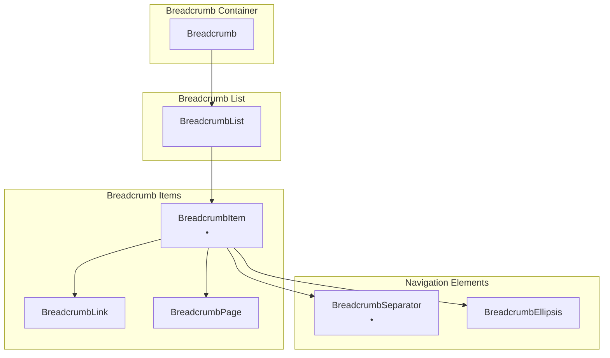

# Breadcrumb Component API Documentation

<cite>
**Referenced Files in This Document**
- [breadcrumb.tsx](file://components/ui/breadcrumb.tsx)
- [utils.ts](file://lib/utils.ts)
- [globals.css](file://app/globals.css)
- [page.tsx](file://app/page.tsx)
- [layout.tsx](file://app/layout.tsx)
- [package.json](file://package.json)
</cite>

## Table of Contents
1. [Introduction](#introduction)
2. [Component Architecture](#component-architecture)
3. [Core Components](#core-components)
4. [Props Reference](#props-reference)
5. [Usage Examples](#usage-examples)
6. [Accessibility Features](#accessibility-features)
7. [Styling and Theming](#styling-and-theming)
8. [Advanced Usage Patterns](#advanced-usage-patterns)
9. [TypeScript Signatures](#typescript-signatures)
10. [Best Practices](#best-practices)

## Introduction

The Breadcrumb component is a navigation aid that helps users understand their current location within an application's hierarchy. Built with React and Tailwind CSS, it provides semantic HTML structure, accessibility features, and responsive design capabilities. The component follows modern web standards and integrates seamlessly with Next.js applications.

The breadcrumb system consists of seven interconnected components that work together to create a complete navigation trail. Each component serves a specific purpose in the breadcrumb hierarchy while maintaining consistent styling and behavior patterns.

## Component Architecture

The Breadcrumb system is built around a hierarchical structure where each component has a specific role in creating a navigable path:



**Diagram sources**
- [breadcrumb.tsx](file://components/ui/breadcrumb.tsx#L9-L107)

**Section sources**
- [breadcrumb.tsx](file://components/ui/breadcrumb.tsx#L1-L107)

## Core Components

### Breadcrumb (Container)

The main container component that wraps the entire breadcrumb navigation system. It provides semantic HTML structure and accessibility attributes.

```typescript
function Breadcrumb({ ...props }: React.ComponentProps<"nav">) {
  return <nav data-slot="breadcrumb" aria-label="breadcrumb" {...props} />
}
```

**Key Features:**
- Semantic `<nav>` element with `aria-label="breadcrumb"`
- Inherits all native HTML attributes from the `nav` element
- Acts as the root container for breadcrumb components

### BreadcrumbList (List Container)

The ordered list container that holds all breadcrumb items and manages spacing and layout.

```typescript
function BreadcrumbList({ className, ...props }: React.ComponentProps<"ol">) {
  return (
    <ol
      data-slot="breadcrumb-list"
      className={cn(
        "flex flex-wrap items-center gap-1.5 text-sm font-base break-words text-foreground sm:gap-2.5",
        className,
      )}
      {...props}
    />
  )
}
```

**Key Features:**
- Uses Flexbox for responsive wrapping
- Automatic gap adjustment based on screen size
- Text styling with `text-sm` and `font-base`
- Break-word behavior for long URLs

### BreadcrumbItem (Individual Item)

The individual item container that groups related breadcrumb elements.

```typescript
function BreadcrumbItem({ className, ...props }: React.ComponentProps<"li">) {
  return (
    <li
      data-slot="breadcrumb-item"
      className={cn("inline-flex items-center gap-1.5", className)}
      {...props}
    />
  )
}
```

**Key Features:**
- Inline-flex display for horizontal alignment
- Consistent gap spacing between child elements
- Flexible sizing for various content types

### BreadcrumbLink (Interactive Link)

The clickable link component that allows navigation to parent pages.

```typescript
function BreadcrumbLink({
  asChild,
  className,
  ...props
}: React.ComponentProps<"a"> & {
  asChild?: boolean
}) {
  const Comp = asChild ? Slot : "a"
  return <Comp data-slot="breadcrumb-link" className={cn(className)} {...props} />
}
```

**Key Features:**
- Supports Radix UI's `asChild` pattern for composition
- Renders either an `<a>` tag or a slot component
- Maintains consistent styling across different render targets

### BreadcrumbPage (Current Page Indicator)

The non-interactive element that displays the current page name.

```typescript
function BreadcrumbPage({ className, ...props }: React.ComponentProps<"span">) {
  return (
    <span
      data-slot="breadcrumb-page"
      role="link"
      aria-disabled="true"
      aria-current="page"
      className={cn(className)}
      {...props}
    />
  )
}
```

**Key Features:**
- Uses `<span>` for semantic correctness
- ARIA attributes for screen reader support
- Indicates current page with `aria-current="page"`

### BreadcrumbSeparator (Visual Separator)

The visual separator component that appears between breadcrumb items.

```typescript
function BreadcrumbSeparator({
  children,
  className,
  ...props
}: React.ComponentProps<"li">) {
  return (
    <li
      data-slot="breadcrumb-separator"
      role="presentation"
      aria-hidden="true"
      className={cn("[&>svg]:size-3.5", className)}
      {...props}
    >
      {children ?? <ChevronRight />}
    </li>
  )
}
```

**Key Features:**
- Uses `ChevronRight` icon by default
- Supports custom icons through children prop
- Hidden from screen readers with `aria-hidden="true"`
- Responsive sizing with `size-3.5`

### BreadcrumbEllipsis (Overflow Indicator)

The ellipsis component that indicates hidden breadcrumb items.

```typescript
function BreadcrumbEllipsis({
  className,
  ...props
}: React.ComponentProps<"span">) {
  return (
    <span
      data-slot="breadcrumb-ellipsis"
      role="presentation"
      aria-hidden="true"
      className={cn("flex size-9 items-center justify-center", className)}
      {...props}
    >
      <MoreHorizontal className="size-4" />
      <span className="sr-only">More</span>
    </span>
  )
}
```

**Key Features:**
- Circular indicator with `size-9` dimensions
- Uses `MoreHorizontal` icon for visual indication
- Screen reader text for accessibility
- Hidden from assistive technologies

**Section sources**
- [breadcrumb.tsx](file://components/ui/breadcrumb.tsx#L9-L107)

## Props Reference

### Breadcrumb Component Props

| Prop | Type | Default | Description |
|------|------|---------|-------------|
| `className` | `string` | - | Additional CSS classes for styling |
| `...rest` | `React.HTMLAttributes<HTMLElement>` | - | All native HTML attributes |

### BreadcrumbList Component Props

| Prop | Type | Default | Description |
|------|------|---------|-------------|
| `className` | `string` | - | Additional CSS classes for styling |
| `...rest` | `React.HTMLAttributes<ol>` | - | All native HTML attributes |

### BreadcrumbItem Component Props

| Prop | Type | Default | Description |
|------|------|---------|-------------|
| `className` | `string` | - | Additional CSS classes for styling |
| `...rest` | `React.HTMLAttributes<li>` | - | All native HTML attributes |

### BreadcrumbLink Component Props

| Prop | Type | Default | Description |
|------|------|---------|-------------|
| `className` | `string` | - | Additional CSS classes for styling |
| `asChild` | `boolean` | `false` | Whether to render as child component |
| `href` | `string` | - | URL for navigation |
| `...rest` | `React.AnchorHTMLAttributes<HTMLAnchorElement>` | - | All native anchor attributes |

### BreadcrumbPage Component Props

| Prop | Type | Default | Description |
|------|------|---------|-------------|
| `className` | `string` | - | Additional CSS classes for styling |
| `...rest` | `React.HTMLAttributes<span>` | - | All native HTML attributes |

### BreadcrumbSeparator Component Props

| Prop | Type | Default | Description |
|------|------|---------|-------------|
| `className` | `string` | - | Additional CSS classes for styling |
| `children` | `React.ReactNode` | `<ChevronRight />` | Custom separator content |
| `...rest` | `React.HTMLAttributes<li>` | - | All native HTML attributes |

### BreadcrumbEllipsis Component Props

| Prop | Type | Default | Description |
|------|------|---------|-------------|
| `className` | `string` | - | Additional CSS classes for styling |
| `...rest` | `React.HTMLAttributes<span>` | - | All native HTML attributes |

**Section sources**
- [breadcrumb.tsx](file://components/ui/breadcrumb.tsx#L11-L97)

## Usage Examples

### Basic Hierarchical Navigation

```typescript
<Breadcrumb>
  <BreadcrumbList>
    <BreadcrumbItem>
      <BreadcrumbLink href="/">Home</BreadcrumbLink>
    </BreadcrumbItem>
    <BreadcrumbSeparator />
    <BreadcrumbItem>
      <BreadcrumbLink href="/products">Products</BreadcrumbLink>
    </BreadcrumbItem>
    <BreadcrumbSeparator />
    <BreadcrumbItem>
      <BreadcrumbPage>Laptops</BreadcrumbPage>
    </BreadcrumbItem>
  </BreadcrumbList>
</Breadcrumb>
```

### Responsive Design with Conditional Separators

```typescript
<Breadcrumb>
  <BreadcrumbList>
    <BreadcrumbItem className="hidden md:block">
      <BreadcrumbLink href="#">Building Your Application</BreadcrumbLink>
    </BreadcrumbItem>
    <BreadcrumbSeparator className="hidden md:block" />
    <BreadcrumbItem>
      <BreadcrumbPage>Data Fetching</BreadcrumbPage>
    </BreadcrumbItem>
  </BreadcrumbList>
</Breadcrumb>
```

### Dynamic Route Integration with Next.js

```typescript
interface BreadcrumbProps {
  segments: string[];
}

export function DynamicBreadcrumb({ segments }: BreadcrumbProps) {
  return (
    <Breadcrumb>
      <BreadcrumbList>
        {segments.map((segment, index) => (
          <React.Fragment key={index}>
            <BreadcrumbItem>
              {index === segments.length - 1 ? (
                <BreadcrumbPage>{segment}</BreadcrumbPage>
              ) : (
                <BreadcrumbLink href={`/category/${segment}`}>
                  {segment}
                </BreadcrumbLink>
              )}
            </BreadcrumbItem>
            {index < segments.length - 1 && (
              <BreadcrumbSeparator />
            )}
          </React.Fragment>
        ))}
      </BreadcrumbList>
    </Breadcrumb>
  );
}
```

### Advanced Usage with Internationalization

```typescript
import { useTranslations } from 'next-intl';

export function I18nBreadcrumb() {
  const t = useTranslations('navigation');
  
  return (
    <Breadcrumb>
      <BreadcrumbList>
        <BreadcrumbItem>
          <BreadcrumbLink href="/">{t('home')}</BreadcrumbLink>
        </BreadcrumbItem>
        <BreadcrumbSeparator />
        <BreadcrumbItem>
          <BreadcrumbLink href="/products">{t('products')}</BreadcrumbLink>
        </BreadcrumbItem>
        <BreadcrumbSeparator />
        <BreadcrumbItem>
          <BreadcrumbPage>{t('current')}</BreadcrumbPage>
        </BreadcrumbItem>
      </BreadcrumbList>
    </Breadcrumb>
  );
}
```

### Custom Separator Implementation

```typescript
<Breadcrumb>
  <BreadcrumbList>
    <BreadcrumbItem>
      <BreadcrumbLink href="/">🏠 Home</BreadcrumbLink>
    </BreadcrumbItem>
    <BreadcrumbSeparator>
      <span className="text-gray-400">/</span>
    </BreadcrumbSeparator>
    <BreadcrumbItem>
      <BreadcrumbLink href="/products">🛒 Products</BreadcrumbLink>
    </BreadcrumbSeparator>
    <BreadcrumbSeparator>
      <span className="text-gray-400">/</span>
    </BreadcrumbSeparator>
    <BreadcrumbItem>
      <BreadcrumbPage>🖥️ Laptops</BreadcrumbPage>
    </BreadcrumbItem>
  </BreadcrumbList>
</Breadcrumb>
```

**Section sources**
- [page.tsx](file://app/page.tsx#L24-L36)

## Accessibility Features

The Breadcrumb component is designed with comprehensive accessibility support:

### ARIA Attributes and Roles

- **Breadcrumb Container**: `aria-label="breadcrumb"` identifies the navigation landmark
- **BreadcrumbPage**: `role="link"`, `aria-disabled="true"`, `aria-current="page"` indicates current page
- **BreadcrumbSeparator**: `role="presentation"`, `aria-hidden="true"` hides from assistive technologies
- **BreadcrumbEllipsis**: `role="presentation"`, `aria-hidden="true"` with `sr-only` text for screen readers

### Keyboard Navigation

- Breadcrumb links are focusable and navigable via keyboard
- Current page indicator receives focus but is not interactive
- Ellipsis indicators are not focusable

### Screen Reader Support

- Semantic HTML structure with appropriate tags
- Descriptive labels for navigation landmarks
- Alternative text for visual separators
- Proper heading hierarchy maintenance

### Color Contrast and Visibility

The component uses theme-aware color variables:
- `text-foreground` for primary text
- `border` for visual separation
- Dark mode support through CSS custom properties

**Section sources**
- [breadcrumb.tsx](file://components/ui/breadcrumb.tsx#L10-L50)

## Styling and Theming

### Tailwind CSS Integration

The component leverages Tailwind CSS for consistent styling:

```typescript
// BreadcrumbList styling
"flex flex-wrap items-center gap-1.5 text-sm font-base break-words text-foreground sm:gap-2.5"

// BreadcrumbSeparator styling
"[&>svg]:size-3.5"

// BreadcrumbEllipsis styling
"flex size-9 items-center justify-center"
```

### Theme Variables

The component respects the application's theme system:

```css
:root {
  --foreground: oklch(0% 0 0);
  --background: oklch(93.46% 0.0305 255.11);
  --border: oklch(0% 0 0);
}

.dark {
  --foreground: oklch(92.49% 0 0);
  --background: oklch(29.23% 0.0626 270.49);
}
```

### Responsive Behavior

- Mobile-first design with `md:` breakpoints
- Automatic gap adjustment based on screen size
- Text wrapping for long URLs
- Icon scaling for different viewport sizes

**Section sources**
- [breadcrumb.tsx](file://components/ui/breadcrumb.tsx#L15-L20)
- [globals.css](file://app/globals.css#L1-L73)

## Advanced Usage Patterns

### Route Segment Processing

```typescript
import { usePathname } from 'next/navigation';

export function AutoBreadcrumb() {
  const pathname = usePathname();
  const segments = pathname.split('/').filter(Boolean);
  
  return (
    <Breadcrumb>
      <BreadcrumbList>
        {segments.map((segment, index) => {
          const href = '/' + segments.slice(0, index + 1).join('/');
          const isLast = index === segments.length - 1;
          
          return (
            <React.Fragment key={segment}>
              <BreadcrumbItem>
                {isLast ? (
                  <BreadcrumbPage>{segment}</BreadcrumbPage>
                ) : (
                  <BreadcrumbLink href={href}>{segment}</BreadcrumbLink>
                )}
              </BreadcrumbItem>
              {!isLast && <BreadcrumbSeparator />}
            </React.Fragment>
          );
        })}
      </BreadcrumbList>
    </Breadcrumb>
  );
}
```

### Dynamic Separator Insertion

```typescript
function BreadcrumbWithAutoSeparators({ children }: { children: React.ReactNode }) {
  const childrenArray = React.Children.toArray(children);
  
  return (
    <Breadcrumb>
      <BreadcrumbList>
        {childrenArray.map((child, index) => (
          <React.Fragment key={index}>
            {child}
            {index < childrenArray.length - 1 && <BreadcrumbSeparator />}
          </React.Fragment>
        ))}
      </BreadcrumbList>
    </Breadcrumb>
  );
}
```

### Custom Render Functions

```typescript
interface BreadcrumbItemConfig {
  label: string;
  href?: string;
  icon?: React.ReactNode;
}

function renderCustomBreadcrumb(items: BreadcrumbItemConfig[]) {
  return (
    <Breadcrumb>
      <BreadcrumbList>
        {items.map((item, index) => (
          <BreadcrumbItem key={index}>
            {item.href ? (
              <BreadcrumbLink href={item.href}>
                {item.icon}
                <span>{item.label}</span>
              </BreadcrumbLink>
            ) : (
              <BreadcrumbPage>
                {item.icon}
                <span>{item.label}</span>
              </BreadcrumbPage>
            )}
          </BreadcrumbItem>
        ))}
      </BreadcrumbList>
    </Breadcrumb>
  );
}
```

## TypeScript Signatures

### Core Component Interfaces

```typescript
// Breadcrumb
interface BreadcrumbProps extends React.HTMLAttributes<HTMLElement> {
  className?: string;
}

// BreadcrumbList
interface BreadcrumbListProps extends React.HTMLAttributes<HTMLOListElement> {
  className?: string;
}

// BreadcrumbItem
interface BreadcrumbItemProps extends React.HTMLAttributes<HTMLLIElement> {
  className?: string;
}

// BreadcrumbLink
interface BreadcrumbLinkProps extends React.AnchorHTMLAttributes<HTMLAnchorElement> {
  className?: string;
  asChild?: boolean;
}

// BreadcrumbPage
interface BreadcrumbPageProps extends React.HTMLAttributes<HTMLSpanElement> {
  className?: string;
}

// BreadcrumbSeparator
interface BreadcrumbSeparatorProps extends React.HTMLAttributes<HTMLLIElement> {
  className?: string;
  children?: React.ReactNode;
}

// BreadcrumbEllipsis
interface BreadcrumbEllipsisProps extends React.HTMLAttributes<HTMLSpanElement> {
  className?: string;
}
```

### Utility Types

```typescript
// Enhanced props with common patterns
type BreadcrumbCommonProps = {
  className?: string;
  children?: React.ReactNode;
};

// Component union type for type-safe composition
type BreadcrumbComponent = 
  | typeof Breadcrumb
  | typeof BreadcrumbList
  | typeof BreadcrumbItem
  | typeof BreadcrumbLink
  | typeof BreadcrumbPage
  | typeof BreadcrumbSeparator
  | typeof BreadcrumbEllipsis;
```

**Section sources**
- [breadcrumb.tsx](file://components/ui/breadcrumb.tsx#L9-L97)

## Best Practices

### Component Composition

1. **Always use the full hierarchy**: Wrap `BreadcrumbList` inside `Breadcrumb`
2. **Maintain order**: Place `BreadcrumbPage` last in the list
3. **Consistent separators**: Use `BreadcrumbSeparator` between items
4. **Semantic markup**: Use `BreadcrumbLink` for navigable items, `BreadcrumbPage` for current page

### Performance Optimization

1. **Minimize re-renders**: Use `React.memo` for complex breadcrumb components
2. **Efficient key usage**: Use meaningful keys in loops
3. **Conditional rendering**: Hide separators conditionally for mobile views

### Accessibility Guidelines

1. **Descriptive labels**: Use meaningful text for navigation items
2. **Logical order**: Arrange items from home to current page
3. **Screen reader support**: Test with assistive technologies
4. **Keyboard navigation**: Ensure all interactive elements are keyboard accessible

### Styling Recommendations

1. **Theme consistency**: Use CSS custom properties for colors
2. **Responsive design**: Test on various screen sizes
3. **Icon usage**: Provide fallback text for visual indicators
4. **Color contrast**: Maintain sufficient contrast ratios

### Integration Patterns

1. **Next.js compatibility**: Works seamlessly with App Router
2. **Dynamic routing**: Integrate with route segment processing
3. **Internationalization**: Support multiple languages
4. **State management**: Coordinate with application state

**Section sources**
- [breadcrumb.tsx](file://components/ui/breadcrumb.tsx#L1-L107)