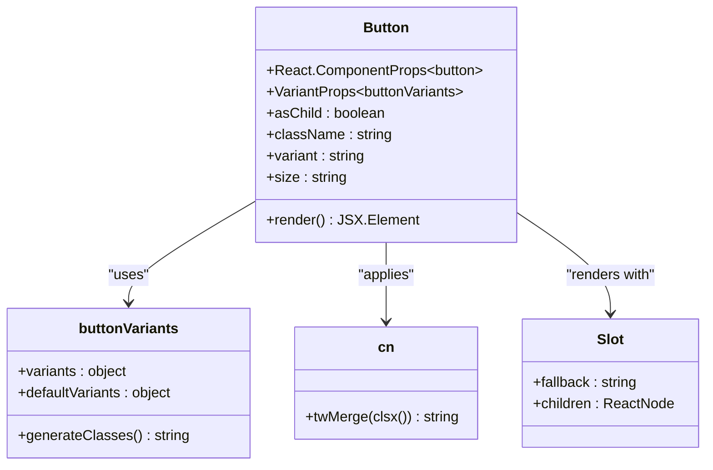
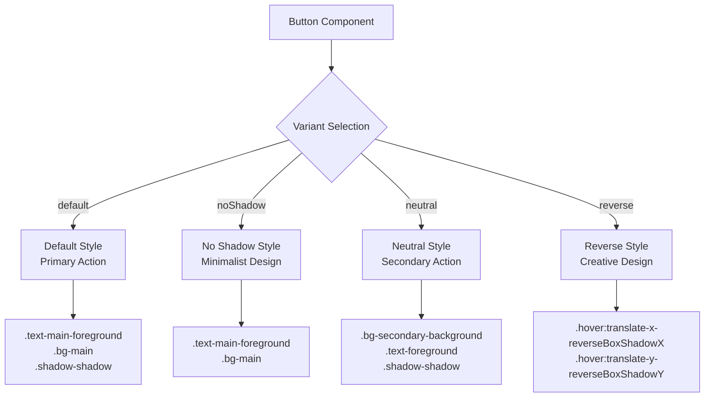
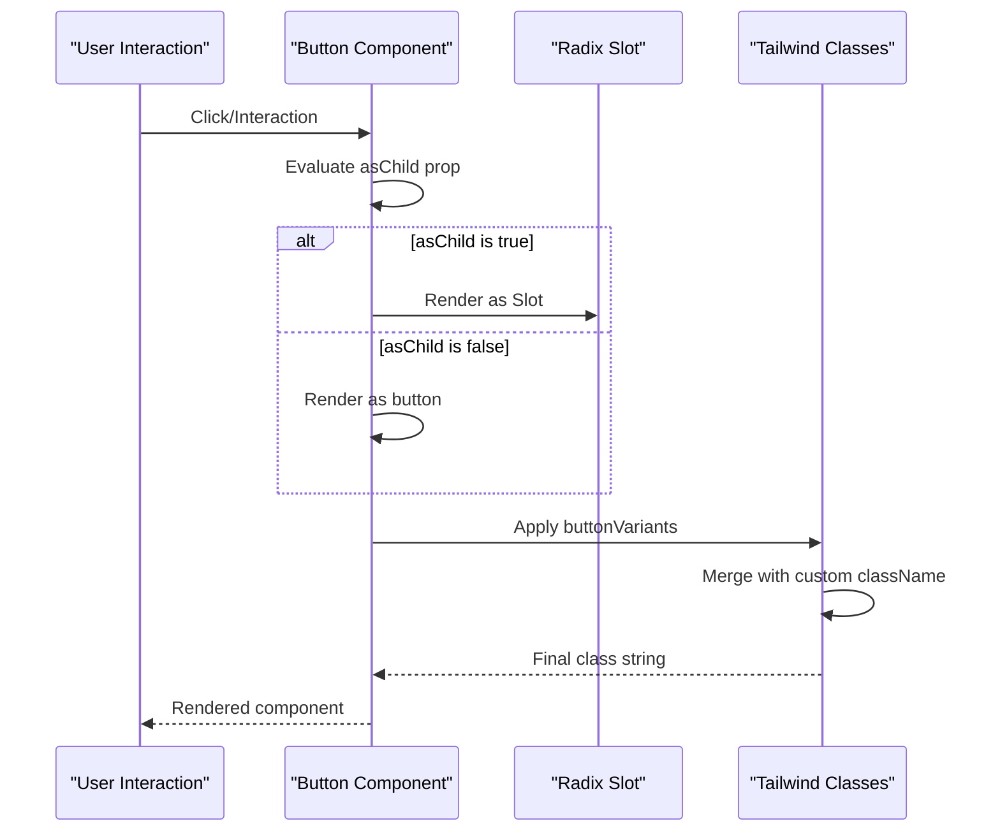

# Button Component API

<cite>
**Referenced Files in This Document**
- [components/ui/button.tsx](file://components/ui/button.tsx)
- [lib/utils.ts](file://lib/utils.ts)
- [app/globals.css](file://app/globals.css)
- [package.json](file://package.json)
</cite>

## Table of Contents
1. [Introduction](#introduction)
2. [Component Overview](#component-overview)
3. [TypeScript Interfaces](#typescript-interfaces)
4. [Props Reference](#props-reference)
5. [Variant System](#variant-system)
6. [Size Variants](#size-variants)
7. [Implementation Details](#implementation-details)
8. [Integration Examples](#integration-examples)
9. [Accessibility Features](#accessibility-features)
10. [Performance Considerations](#performance-considerations)
11. [Best Practices](#best-practices)
12. [Troubleshooting](#troubleshooting)

## Introduction

The Button component is a foundational UI element in the activity-tracker application, built using Radix UI primitives and enhanced with Tailwind CSS for consistent styling. It provides a flexible foundation for interactive elements with support for various visual variants, sizes, and accessibility features.

This component serves as the primary action element throughout the application, offering a unified interface for user interactions while maintaining design consistency across different contexts.

## Component Overview

The Button component is implemented as a highly configurable wrapper around Radix UI's Slot primitive, providing flexibility in rendering while maintaining semantic HTML structure. It leverages the class-variance-authority library for sophisticated variant management and integrates seamlessly with Tailwind CSS utilities.



**Diagram sources**
- [components/ui/button.tsx](file://components/ui/button.tsx#L1-L57)

**Section sources**
- [components/ui/button.tsx](file://components/ui/button.tsx#L1-L57)

## TypeScript Interfaces

The Button component exposes a comprehensive TypeScript interface that ensures type safety across the application:

```typescript
interface ButtonProps extends React.ComponentProps<"button"> {
  variant?: "default" | "noShadow" | "neutral" | "reverse"
  size?: "default" | "sm" | "lg" | "icon"
  asChild?: boolean
  className?: string
}
```

### Variant Unions

The component defines specific union types for variants and sizes:

```typescript
type ButtonVariant = "default" | "noShadow" | "neutral" | "reverse"
type ButtonSize = "default" | "sm" | "lg" | "icon"
```

**Section sources**
- [components/ui/button.tsx](file://components/ui/button.tsx#L30-L45)

## Props Reference

### Core Props

| Prop | Type | Default | Description |
|------|------|---------|-------------|
| `variant` | `ButtonVariant` | `"default"` | Controls visual appearance and styling |
| `size` | `ButtonSize` | `"default"` | Defines button dimensions and spacing |
| `asChild` | `boolean` | `false` | Renders as child element instead of button |
| `className` | `string` | `undefined` | Additional CSS classes for customization |

### Event Handlers

The component inherits all standard button event handlers:

- `onClick`: Triggered when the button is clicked
- `onMouseDown`: Triggered when mouse button is pressed
- `onKeyDown`: Triggered when key is pressed
- `onFocus`: Triggered when button receives focus
- `onBlur`: Triggered when button loses focus

### Accessibility Props

Standard ARIA attributes are automatically handled:

- `aria-disabled`: Applied when button is disabled
- `role`: Automatically set to "button" when asChild is false
- `tabIndex`: Managed for keyboard navigation

**Section sources**
- [components/ui/button.tsx](file://components/ui/button.tsx#L30-L45)

## Variant System

The Button component supports four distinct visual variants, each designed for specific use cases and contexts within the application.

### Default Variant

The primary button style with shadow effects and hover animations:

```css
default: "text-main-foreground bg-main border-2 border-border shadow-shadow hover:translate-x-boxShadowX hover:translate-y-boxShadowY hover:shadow-none"
```

Features:
- Primary action emphasis
- Shadow effects with hover animations
- Standard color scheme
- Interactive feedback on hover

### No Shadow Variant

A minimalist button style without shadow effects:

```css
noShadow: "text-main-foreground bg-main border-2 border-border"
```

Features:
- Clean, flat appearance
- Reduced visual weight
- Suitable for subtle actions
- Consistent with modern design trends

### Neutral Variant

A secondary button style with neutral background:

```css
neutral: "bg-secondary-background text-foreground border-2 border-border shadow-shadow hover:translate-x-boxShadowX hover:translate-y-boxShadowY hover:shadow-none"
```

Features:
- Secondary action indication
- Neutral color palette
- Subtle shadow effects
- Balanced visual hierarchy

### Reverse Variant

A button style with reversed shadow direction:

```css
reverse: "text-main-foreground bg-main border-2 border-border hover:translate-x-reverseBoxShadowX hover:translate-y-reverseBoxShadowY hover:shadow-shadow"
```

Features:
- Unique visual distinction
- Reversed shadow direction
- Creative design option
- Suitable for special contexts



**Diagram sources**
- [components/ui/button.tsx](file://components/ui/button.tsx#L13-L23)

**Section sources**
- [components/ui/button.tsx](file://components/ui/button.tsx#L13-L23)

## Size Variants

The Button component offers four size options to accommodate different layout requirements and user preferences.

### Size Definitions

| Size | Height | Padding | Icon Size | Usage Context |
|------|--------|---------|-----------|---------------|
| `default` | `h-10` | `px-4 py-2` | N/A | Standard actions |
| `sm` | `h-9` | `px-3` | N/A | Compact layouts |
| `lg` | `h-11` | `px-8` | N/A | Emphasized actions |
| `icon` | `size-10` | N/A | `size-4` | Icon-only buttons |

### Implementation Details

Each size variant applies specific CSS classes to control dimensions and spacing:

```typescript
size: {
  default: "h-10 px-4 py-2",
  sm: "h-9 px-3",
  lg: "h-11 px-8",
  icon: "size-10",
}
```

Icon size is specifically controlled for SVG elements within the button:

```css
[_svg]:size-4
```

**Section sources**
- [components/ui/button.tsx](file://components/ui/button.tsx#L24-L27)

## Implementation Details

### Radix UI Integration

The Button component leverages Radix UI's Slot primitive for maximum flexibility:

```typescript
const Comp = asChild ? Slot : "button"
```

This design allows the Button to render as either a native button element or as a child component, enabling composition with other UI elements.

### Tailwind CSS Integration

The component uses a sophisticated utility class system through the `cn` function:

```typescript
import { cn } from "@/lib/utils"

// Usage in component
className={cn(buttonVariants({ variant, size, className }))}
```

The `cn` function combines clsx and tailwind-merge for optimal class merging:

```typescript
export function cn(...inputs: ClassValue[]) {
  return twMerge(clsx(inputs))
}
```

### Focus Management

The component includes comprehensive focus management for accessibility:

```css
focus-visible:outline-hidden
focus-visible:ring-2
focus-visible:ring-black
focus-visible:ring-offset-2
```

### Disabled State Handling

Automatic disabled state styling ensures consistent user experience:

```css
disabled:pointer-events-none
disabled:opacity-50
```



**Diagram sources**
- [components/ui/button.tsx](file://components/ui/button.tsx#L47-L55)

**Section sources**
- [components/ui/button.tsx](file://components/ui/button.tsx#L1-L57)
- [lib/utils.ts](file://lib/utils.ts#L1-L7)

## Integration Examples

### Basic Usage

```typescript
import { Button } from "@/components/ui/button"

// Primary action
<Button variant="default">Click Me</Button>

// Secondary action
<Button variant="neutral">Cancel</Button>
```

### Size Variations

```typescript
// Different sizes
<Button size="default">Default</Button>
<Button size="sm">Small</Button>
<Button size="lg">Large</Button>
<Button size="icon">
  <Icon />
</Button>
```

### As Child Pattern

```typescript
// Render as link
<Button asChild>
  <a href="/dashboard">Go to Dashboard</a>
</Button>

// Render as form submit
<Button asChild>
  <button type="submit">Save Changes</button>
</Button>
```

### Loading State Implementation

While the Button component itself doesn't include loading state, it can be easily integrated:

```typescript
import { useState } from "react"
import { Button } from "@/components/ui/button"

function SaveButton() {
  const [isLoading, setIsLoading] = useState(false)
  
  const handleClick = async () => {
    setIsLoading(true)
    // Perform save operation
    await saveData()
    setIsLoading(false)
  }
  
  return (
    <Button 
      onClick={handleClick} 
      disabled={isLoading}
      variant={isLoading ? "neutral" : "default"}
    >
      {isLoading ? "Saving..." : "Save Changes"}
    </Button>
  )
}
```

### Lucide Icons Integration

Although Lucide icons aren't directly imported in the current codebase, here's how they would integrate:

```typescript
import { Button } from "@/components/ui/button"
import { Plus, Trash2 } from "lucide-react"

// Icon with text
<Button variant="default" size="sm">
  <Plus className="mr-2" />
  Add Item
</Button>

// Icon only
<Button variant="neutral" size="icon">
  <Trash2 />
</Button>
```

**Section sources**
- [components/ui/button.tsx](file://components/ui/button.tsx#L47-L55)

## Accessibility Features

### Keyboard Navigation

The Button component supports full keyboard navigation:

- **Tab**: Navigate to button
- **Enter/Space**: Activate button
- **Focus indicators**: Visible focus rings for keyboard users

### Screen Reader Support

```typescript
// Automatic role assignment
data-slot="button"
```

The `data-slot` attribute helps screen readers identify the component's purpose.

### Disabled State Accessibility

```css
disabled:pointer-events-none
disabled:opacity-50
```

Properly handles disabled state with appropriate visual and interaction feedback.

### Focus Management

```css
focus-visible:outline-hidden
focus-visible:ring-2
focus-visible:ring-black
focus-visible:ring-offset-2
```

Provides clear focus indicators for keyboard navigation while maintaining visual consistency.

**Section sources**
- [components/ui/button.tsx](file://components/ui/button.tsx#L10-L11)

## Performance Considerations

### Rendering Optimization

The Button component is designed for efficient rendering:

- **Pure Component**: Stateless functional component with minimal re-renders
- **Prop Drilling**: Minimal props passed to reduce unnecessary updates
- **CSS-in-JS**: Compiled CSS classes for optimal runtime performance

### Memory Management

```typescript
// Efficient variant calculation
className={cn(buttonVariants({ variant, size, className }))}
```

The component uses the `cn` utility to efficiently merge classes without memory leaks.

### Event Handler Optimization

For frequently rendered buttons, consider memoizing event handlers:

```typescript
import { useCallback } from "react"

function OptimizedButton() {
  const handleClick = useCallback((event: React.MouseEvent) => {
    // Handle click
  }, [])
  
  return <Button onClick={handleClick}>Click Me</Button>
}
```

### Bundle Size Impact

The component has minimal bundle impact due to:

- **Tree Shaking**: Individual variant classes are tree-shaken
- **Lazy Loading**: CSS classes are loaded on demand
- **Efficient Imports**: Minimal external dependencies

**Section sources**
- [components/ui/button.tsx](file://components/ui/button.tsx#L47-L55)

## Best Practices

### Variant Selection Guidelines

1. **Primary Actions**: Use `variant="default"`
2. **Secondary Actions**: Use `variant="neutral"`
3. **Minimalist Design**: Use `variant="noShadow"`
4. **Creative Contexts**: Use `variant="reverse"`

### Size Selection Guidelines

1. **Standard Layouts**: Use `size="default"`
2. **Compact Spaces**: Use `size="sm"`
3. **Emphasized Actions**: Use `size="lg"`
4. **Icon Buttons**: Use `size="icon"`

### Event Handler Patterns

```typescript
// Good: Memoized handlers
const handleClick = useCallback(() => {
  console.log("Button clicked")
}, [])

// Good: Async handlers
const handleAsyncClick = useCallback(async () => {
  try {
    await performAsyncOperation()
  } catch (error) {
    handleError(error)
  }
}, [])

// Avoid: Inline handlers in render
// Bad: Causes re-renders on every render
<Button onClick={() => console.log("Clicked")}>Click Me</Button>
```

### Accessibility Best Practices

1. **Meaningful Text**: Always include descriptive text
2. **Logical Order**: Place buttons in logical tab order
3. **Consistent Behavior**: Maintain consistent click behavior
4. **Visual Feedback**: Provide clear visual states

### Performance Optimization

1. **Memoization**: Use `useCallback` for event handlers
2. **Conditional Rendering**: Avoid unnecessary renders
3. **CSS Optimization**: Leverage Tailwind's JIT compilation
4. **Bundle Splitting**: Consider lazy loading heavy components

## Troubleshooting

### Common Issues

#### Button Not Responding to Clicks

**Problem**: Button appears clickable but doesn't trigger events.

**Solution**: Check for disabled state and event handler binding:

```typescript
// Ensure onClick is properly bound
<Button onClick={handleClick}>Click Me</Button>

// Check for disabled prop
<Button onClick={handleClick} disabled={false}>Click Me</Button>
```

#### Variant Styles Not Applying

**Problem**: Custom variant styles are not appearing.

**Solution**: Verify Tailwind CSS configuration and class precedence:

```typescript
// Correct class application
<Button variant="default" className="custom-class">Text</Button>

// Check for conflicting global styles
```

#### Focus Ring Issues

**Problem**: Focus rings appear incorrectly or inconsistently.

**Solution**: Ensure proper focus management:

```typescript
// Default focus styles should work automatically
<Button>Focusable Button</Button>

// Custom focus styles if needed
<Button className="[&:focus]:ring-4">Custom Focus</Button>
```

#### As Child Rendering Problems

**Problem**: `asChild` prop doesn't render expected child element.

**Solution**: Verify child element compatibility:

```typescript
// Correct usage
<Button asChild>
  <a href="/link">Link Text</a>
</Button>

// Ensure child accepts all button props
```

### Debugging Tips

1. **Inspect Generated Classes**: Use browser dev tools to inspect applied classes
2. **Check Console Errors**: Look for JavaScript errors affecting button functionality
3. **Verify Dependencies**: Ensure all required packages are installed
4. **Test Accessibility**: Use screen readers and keyboard navigation to test accessibility

### Performance Issues

If experiencing performance problems:

1. **Profile Rendering**: Use React DevTools Profiler
2. **Check Re-renders**: Monitor component update frequency
3. **Optimize Props**: Minimize prop passing and object creation
4. **Consider Memoization**: Use `React.memo` for parent components

**Section sources**
- [components/ui/button.tsx](file://components/ui/button.tsx#L47-L55)