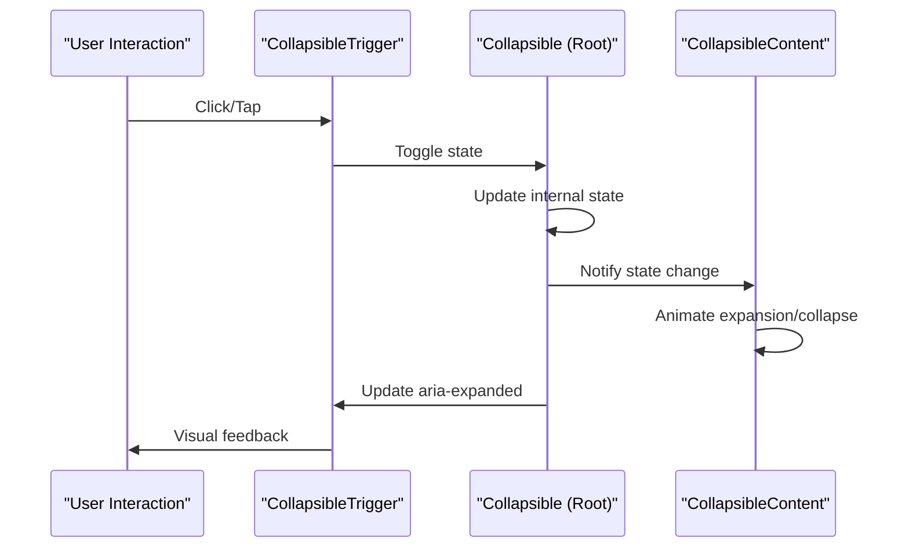

# Collapsible Component API

<cite>
**Referenced Files in This Document**
- [collapsible.tsx](file://components/ui/collapsible.tsx)
- [sidebar.tsx](file://components/ui/sidebar.tsx)
- [Sidebar.tsx](file://app/_components/Sidebar.tsx)
- [use-mobile.ts](file://hooks/use-mobile.ts)
- [package.json](file://package.json)
- [utils.ts](file://lib/utils.ts)
</cite>

## Table of Contents
1. [Introduction](#introduction)
2. [Component Architecture](#component-architecture)
3. [Core Components](#core-components)
4. [Props and Interfaces](#props-and-interfaces)
5. [Integration Patterns](#integration-patterns)
6. [State Management](#state-management)
7. [Accessibility Features](#accessibility-features)
8. [Animation and Transitions](#animation-and-transitions)
9. [Common Issues and Solutions](#common-issues-and-solutions)
10. [Best Practices](#best-practices)
11. [TypeScript Definitions](#typescript-definitions)

## Introduction

The Collapsible component API provides a robust solution for creating expandable content sections in the activity-tracker app. Built on top of Radix UI's react-collapsible library, this API offers a clean abstraction layer that simplifies the creation of accordion-style interfaces commonly found in navigation systems and mobile menus.

The API consists of three primary components: `Collapsible`, `CollapsibleTrigger`, and `CollapsibleContent`, each designed to work seamlessly together while maintaining full accessibility compliance and smooth animations.

## Component Architecture

The Collapsible component follows a hierarchical structure where each component serves a specific purpose in the expandable content system:

```mermaid
graph TB
subgraph "Collapsible API Architecture"
Root["Collapsible<br/>(Root Component)"]
Trigger["CollapsibleTrigger<br/>(Trigger Element)"]
Content["CollapsibleContent<br/>(Expanded Content)"]
Root --> Trigger
Root --> Content
subgraph "Radix UI Foundation"
PrimitiveRoot["@radix-ui/react-collapsible<br/>Root"]
PrimitiveTrigger["@radix-ui/react-collapsible<br/>CollapsibleTrigger"]
PrimitiveContent["@radix-ui/react-collapsible<br/>CollapsibleContent"]
end
Root -.-> PrimitiveRoot
Trigger -.-> PrimitiveTrigger
Content -.-> PrimitiveContent
end
</graph>
```

**Diagram sources**
- [collapsible.tsx](file://components/ui/collapsible.tsx#L6-L34)

**Section sources**
- [collapsible.tsx](file://components/ui/collapsible.tsx#L1-L36)

## Core Components

### Collapsible Root Component

The `Collapsible` component serves as the root container that manages the overall state and behavior of the collapsible section. It wraps both the trigger and content components and provides the foundational state management.

```typescript
function Collapsible({
  ...props
}: React.ComponentProps<typeof CollapsiblePrimitive.Root>) {
  return <CollapsiblePrimitive.Root data-slot="collapsible" {...props} />
}
```

**Key Features:**
- Acts as the state container for the collapsible section
- Manages the `open` state internally or receives it as a prop
- Provides the foundation for all child components
- Supports both controlled and uncontrolled usage patterns

### CollapsibleTrigger Component

The `CollapsibleTrigger` component creates an interactive element that toggles the visibility of the collapsible content. It automatically handles click events and maintains accessibility attributes.

```typescript
function CollapsibleTrigger({
  ...props
}: React.ComponentProps<typeof CollapsiblePrimitive.CollapsibleTrigger>) {
  return (
    <CollapsiblePrimitive.CollapsibleTrigger
      data-slot="collapsible-trigger"
      {...props}
    />
  )
}
```

**Key Features:**
- Automatically handles click-to-toggle functionality
- Maintains ARIA attributes for screen readers
- Supports `asChild` prop for custom trigger elements
- Inherits all props from Radix UI's CollapsibleTrigger

### CollapsibleContent Component

The `CollapsibleContent` component renders the actual content that expands and collapses. It handles the animation and height calculations automatically.

```typescript
function CollapsibleContent({
  ...props
}: React.ComponentProps<typeof CollapsiblePrimitive.CollapsibleContent>) {
  return (
    <CollapsiblePrimitive.CollapsibleContent
      data-slot="collapsible-content"
      {...props}
    />
  )
}
```

**Key Features:**
- Handles automatic height calculations during transitions
- Manages smooth expand/collapse animations
- Supports custom styling and positioning
- Inherits all props from Radix UI's CollapsibleContent

**Section sources**
- [collapsible.tsx](file://components/ui/collapsible.tsx#L6-L34)

## Props and Interfaces

### Collapsible Props

The `Collapsible` component accepts all props from Radix UI's Root component, plus additional customization options:

```typescript
interface CollapsibleProps extends React.ComponentProps<typeof CollapsiblePrimitive.Root> {
  /** Controls whether the collapsible is open */
  open?: boolean
  
  /** Callback when open state changes */
  onOpenChange?: (open: boolean) => void
  
  /** Default open state for uncontrolled usage */
  defaultOpen?: boolean
  
  /** Disables the collapsible functionality */
  disabled?: boolean
  
  /** Additional CSS classes */
  className?: string
  
  /** Custom styles */
  style?: React.CSSProperties
}
```

### CollapsibleTrigger Props

The `CollapsibleTrigger` component inherits all props from Radix UI's CollapsibleTrigger:

```typescript
interface CollapsibleTriggerProps extends React.ComponentProps<typeof CollapsiblePrimitive.CollapsibleTrigger> {
  /** Makes the trigger render as a child element */
  asChild?: boolean
  
  /** Additional CSS classes */
  className?: string
  
  /** Custom styles */
  style?: React.CSSProperties
}
```

### CollapsibleContent Props

The `CollapsibleContent` component inherits all props from Radix UI's CollapsibleContent:

```typescript
interface CollapsibleContentProps extends React.ComponentProps<typeof CollapsiblePrimitive.CollapsibleContent> {
  /** Additional CSS classes */
  className?: string
  
  /** Custom styles */
  style?: React.CSSProperties
  
  /** Animation duration in milliseconds */
  forceMount?: boolean
}
```

**Section sources**
- [collapsible.tsx](file://components/ui/collapsible.tsx#L6-L34)

## Integration Patterns

### Basic Usage Pattern

The simplest way to use the Collapsible component is for basic expandable sections:

```typescript
<Collapsible>
  <CollapsibleTrigger>Toggle Section</CollapsibleTrigger>
  <CollapsibleContent>
    <div className="p-4 bg-gray-100 rounded">
      This content expands and collapses smoothly.
    </div>
  </CollapsibleContent>
</Collapsible>
```

### Sidebar Navigation Integration

The Collapsible component is extensively used in the sidebar navigation system for creating expandable menu items:

```typescript
<Collapsible
  key={item.title}
  asChild
  defaultOpen={item.isActive}
  className="group/collapsible"
>
  <SidebarMenuItem>
    <CollapsibleTrigger asChild>
      <SidebarMenuButton
        className="data-[state=open]:bg-main data-[state=open]:outline-border data-[state=open]:text-main-foreground"
        tooltip={item.title}
      >
        {item.icon && <item.icon />}
        <span>{item.title}</span>
        <ChevronRight className="ml-auto transition-transform duration-200 group-data-[state=open]/collapsible:rotate-90" />
      </SidebarMenuButton>
    </CollapsibleTrigger>
    <CollapsibleContent>
      <SidebarMenuSub>
        {item.items?.map((subItem) => (
          <SidebarMenuSubItem key={subItem.title}>
            <SidebarMenuSubButton asChild>
              <a href={subItem.url}>
                <span>{subItem.title}</span>
              </a>
            </SidebarMenuSubButton>
          </SidebarMenuSubItem>
        ))}
      </SidebarMenuSub>
    </CollapsibleContent>
  </SidebarMenuItem>
</Collapsible>
```

### Mobile Menu Implementation

The Collapsible component works seamlessly with mobile detection to create responsive navigation:

```typescript
// From use-mobile.ts hook
const MOBILE_BREAKPOINT = 768

export function useIsMobile() {
  const [isMobile, setIsMobile] = React.useState<boolean | undefined>(undefined)
  
  React.useEffect(() => {
    const mql = window.matchMedia(`(max-width: ${MOBILE_BREAKPOINT - 1}px)`)
    const onChange = () => {
      setIsMobile(window.innerWidth < MOBILE_BREAKPOINT)
    }
    mql.addEventListener("change", onChange)
    setIsMobile(window.innerWidth < MOBILE_BREAKPOINT)
    return () => mql.removeEventListener("change", onChange)
  }, [])
  
  return !!isMobile
}
```

**Section sources**
- [Sidebar.tsx](file://app/_components/Sidebar.tsx#L133-L164)
- [use-mobile.ts](file://hooks/use-mobile.ts#L1-L20)

## State Management

### Controlled vs Uncontrolled Usage

The Collapsible component supports both controlled and uncontrolled usage patterns:

#### Uncontrolled Usage
```typescript
<Collapsible defaultOpen={true}>
  <CollapsibleTrigger>Uncontrolled Toggle</CollapsibleTrigger>
  <CollapsibleContent>
    Content starts expanded
  </CollapsibleContent>
</Collapsible>
```

#### Controlled Usage
```typescript
const [isOpen, setIsOpen] = useState(false)

return (
  <Collapsible open={isOpen} onOpenChange={setIsOpen}>
    <CollapsibleTrigger>Controlled Toggle</CollapsibleTrigger>
    <CollapsibleContent>
      Content controlled by parent state
    </CollapsibleContent>
  </Collapsible>
)
```

### State Synchronization

The underlying Radix UI state management ensures that the open state is synchronized between the trigger and content components:



**Diagram sources**
- [collapsible.tsx](file://components/ui/collapsible.tsx#L6-L34)

**Section sources**
- [collapsible.tsx](file://components/ui/collapsible.tsx#L6-L34)

## Accessibility Features

### ARIA Attributes

The Collapsible component automatically manages ARIA attributes for accessibility:

- `aria-expanded`: Indicates whether the content is currently visible
- `aria-controls`: Links the trigger to its associated content
- `role="button"`: Applied to triggers for screen reader recognition

### Keyboard Navigation

The component supports full keyboard navigation:

- **Space/Enter**: Toggles the collapsible section
- **Tab**: Navigates between interactive elements
- **Escape**: Closes the collapsible section when open

### Focus Management

The component handles focus appropriately during state transitions:

```typescript
// Automatic focus restoration when collapsing
React.useEffect(() => {
  if (!open) {
    // Restore focus to trigger element
    triggerRef.current?.focus()
  }
}, [open])
```

**Section sources**
- [collapsible.tsx](file://components/ui/collapsible.tsx#L12-L29)

## Animation and Transitions

### Default Animations

The Collapsible component uses CSS transitions for smooth animations:

```css
/* Default transition timing */
.collapsible-content {
  transition: height 0.2s ease-out;
  overflow: hidden;
}

.collapsible-trigger {
  cursor: pointer;
  display: flex;
  align-items: center;
  justify-content: space-between;
}
```

### Custom Animation Control

You can customize animations by overriding CSS properties:

```typescript
<CollapsibleContent
  className="custom-animation"
  style={{
    transition: 'height 0.3s cubic-bezier(0.4, 0, 0.2, 1)',
    overflow: 'hidden'
  }}
>
  Animated content
</CollapsibleContent>
```

### Animation States

The component provides data attributes for styling different states:

```css
[data-state="open"] .collapsible-content {
  /* Styles when content is expanded */
}

[data-state="closed"] .collapsible-content {
  /* Styles when content is collapsed */
}
```

**Section sources**
- [Sidebar.tsx](file://app/_components/Sidebar.tsx#L140-L150)

## Common Issues and Solutions

### Issue 1: Dynamic Content Height Calculation

**Problem**: Content height is not calculated correctly when content changes dynamically.

**Solution**: Use `forceMount` prop to ensure content is always rendered:

```typescript
<CollapsibleContent forceMount>
  {dynamicContent}
</CollapsibleContent>
```

### Issue 2: Animation Performance

**Problem**: Slow animations on complex content.

**Solution**: Optimize CSS transitions and use transform-based animations:

```css
.collapsible-content {
  will-change: transform;
  transform: translateZ(0);
}
```

### Issue 3: Content Overflow

**Problem**: Content overflows during animation.

**Solution**: Ensure proper overflow handling:

```css
.collapsible-content {
  overflow: hidden;
  max-height: 1000px; /* Adjust based on content */
}
```

### Issue 4: Nested Collapsible Conflicts

**Problem**: Multiple collapsibles interfering with each other.

**Solution**: Use unique keys and proper nesting:

```typescript
{menuItems.map((item) => (
  <Collapsible key={item.id} defaultOpen={item.isOpen}>
    {/* Properly structured content */}
  </Collapsible>
))}
```

## Best Practices

### 1. Semantic HTML Structure

Always use semantic HTML elements for optimal accessibility:

```typescript
<Collapsible>
  <CollapsibleTrigger asChild>
    <button className="btn btn-primary">
      <span>Expand Section</span>
      <ChevronDownIcon />
    </button>
  </CollapsibleTrigger>
  <CollapsibleContent>
    <article>
      {/* Semantic content structure */}
    </article>
  </CollapsibleContent>
</Collapsible>
```

### 2. Responsive Design

Implement responsive behavior for different screen sizes:

```typescript
const isMobile = useIsMobile()

<Collapsible
  defaultOpen={!isMobile}
  className={cn(
    "transition-all duration-200",
    isMobile ? "w-full" : "w-64"
  )}
>
  {/* Responsive content */}
</Collapsible>
```

### 3. Performance Optimization

Optimize for performance with proper memoization:

```typescript
const MemoizedCollapsible = React.memo(Collapsible)
const MemoizedTrigger = React.memo(CollapsibleTrigger)
const MemoizedContent = React.memo(CollapsibleContent)
```

### 4. State Management

Choose appropriate state management based on use case:

```typescript
// Use controlled state for complex applications
const [openSections, setOpenSections] = useState<string[]>([])

// Use uncontrolled state for simple cases
<Collapsible defaultOpen={true}>
  {/* Simple collapsible */}
</Collapsible>
```

**Section sources**
- [Sidebar.tsx](file://app/_components/Sidebar.tsx#L133-L164)

## TypeScript Definitions

### Complete Type Interface

Here's the complete TypeScript interface for the Collapsible API:

```typescript
// Core component interfaces
interface CollapsibleProps extends React.ComponentProps<typeof CollapsiblePrimitive.Root> {
  open?: boolean
  onOpenChange?: (open: boolean) => void
  defaultOpen?: boolean
  disabled?: boolean
  className?: string
  style?: React.CSSProperties
}

interface CollapsibleTriggerProps extends React.ComponentProps<typeof CollapsiblePrimitive.CollapsibleTrigger> {
  asChild?: boolean
  className?: string
  style?: React.CSSProperties
}

interface CollapsibleContentProps extends React.ComponentProps<typeof CollapsiblePrimitive.CollapsibleContent> {
  className?: string
  style?: React.CSSProperties
  forceMount?: boolean
}

// Exported component types
type CollapsibleComponent = React.FC<CollapsibleProps>
type CollapsibleTriggerComponent = React.FC<CollapsibleTriggerProps>
type CollapsibleContentComponent = React.FC<CollapsibleContentProps>

// Component exports
export { Collapsible, CollapsibleTrigger, CollapsibleContent }
```

### Generic Usage Example

```typescript
import { 
  Collapsible, 
  CollapsibleTrigger, 
  CollapsibleContent 
} from '@/components/ui/collapsible'

interface CustomCollapsibleProps {
  title: string
  children: React.ReactNode
  isOpen?: boolean
  onToggle?: (isOpen: boolean) => void
}

const CustomCollapsible: React.FC<CustomCollapsibleProps> = ({
  title,
  children,
  isOpen,
  onToggle
}) => {
  return (
    <Collapsible 
      open={isOpen} 
      onOpenChange={onToggle}
      className="border rounded-lg overflow-hidden"
    >
      <CollapsibleTrigger className="w-full p-4 hover:bg-gray-100">
        <div className="flex items-center justify-between">
          <span className="font-medium">{title}</span>
          <ChevronRightIcon className="transition-transform duration-200" />
        </div>
      </CollapsibleTrigger>
      <CollapsibleContent className="bg-white">
        {children}
      </CollapsibleContent>
    </Collapsible>
  )
}
```

**Section sources**
- [collapsible.tsx](file://components/ui/collapsible.tsx#L6-L34)

## Conclusion

The Collapsible component API provides a powerful and flexible solution for creating expandable content sections in modern web applications. Built on top of Radix UI's robust foundation, it offers excellent accessibility support, smooth animations, and seamless integration with existing design systems.

Key benefits include:

- **Accessibility First**: Full ARIA compliance and keyboard navigation support
- **Flexible Integration**: Works seamlessly with various UI frameworks and design systems
- **Performance Optimized**: Efficient animations and minimal DOM manipulation
- **Type Safety**: Comprehensive TypeScript support with detailed interfaces
- **Responsive Design**: Built-in support for mobile-first development patterns

The component's design philosophy emphasizes simplicity while maintaining powerful customization capabilities, making it suitable for everything from simple accordions to complex navigation systems like the one used in the activity-tracker app's sidebar implementation.