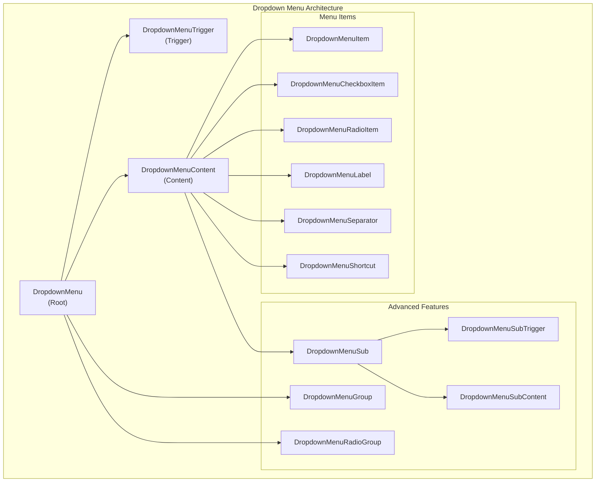
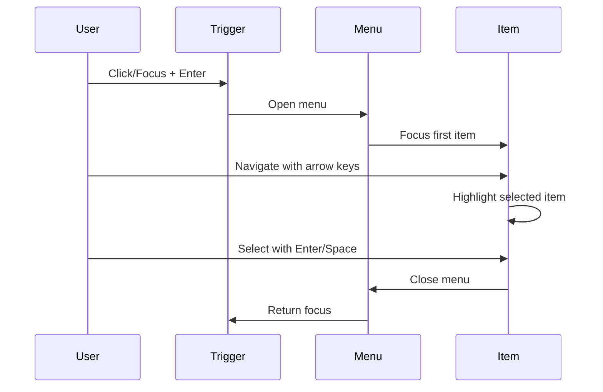

# Dropdown Menu Component API

<cite>
**Referenced Files in This Document**
- [components/ui/dropdown-menu.tsx](file://components/ui/dropdown-menu.tsx)
- [lib/utils.ts](file://lib/utils.ts)
- [package.json](file://package.json)
- [app/_components/Sidebar.tsx](file://app/_components/Sidebar.tsx)
- [tsconfig.json](file://tsconfig.json)
</cite>

## Table of Contents
1. [Introduction](#introduction)
2. [Component Architecture](#component-architecture)
3. [Core Components](#core-components)
4. [Props Reference](#props-reference)
5. [Accessibility Features](#accessibility-features)
6. [Usage Examples](#usage-examples)
7. [TypeScript Interfaces](#typescript-interfaces)
8. [Styling System](#styling-system)
9. [Common Issues and Solutions](#common-issues-and-solutions)
10. [Best Practices](#best-practices)

## Introduction

The Dropdown Menu component is a comprehensive UI component built on top of Radix UI primitives, designed for contextual actions and navigation within the activity-tracker application. This component provides a robust foundation for creating accessible dropdown menus with extensive customization capabilities while maintaining consistent styling across the application.

The component leverages Radix UI's headless architecture, offering maximum flexibility while ensuring accessibility compliance through built-in ARIA roles and keyboard navigation support. It integrates seamlessly with the Tailwind CSS design system and provides TypeScript support for enhanced developer experience.

## Component Architecture

The Dropdown Menu follows a hierarchical structure based on Radix UI's primitive components, providing a clean separation of concerns and maximum flexibility for customization.



**Diagram sources**
- [components/ui/dropdown-menu.tsx](file://components/ui/dropdown-menu.tsx#L1-L240)

**Section sources**
- [components/ui/dropdown-menu.tsx](file://components/ui/dropdown-menu.tsx#L1-L240)

## Core Components

### DropdownMenu (Root)

The root component that manages the overall state and context of the dropdown menu. It wraps all other components and provides the foundational context for the menu system.

```typescript
function DropdownMenu({
  ...props
}: React.ComponentProps<typeof DropdownMenuPrimitive.Root>) {
  return <DropdownMenuPrimitive.Root data-slot="dropdown-menu" {...props} />
}
```

**Key Features:**
- Manages global dropdown state
- Provides context to child components
- Handles opening/closing logic
- Supports controlled/uncontrolled usage

### DropdownMenuTrigger

The trigger element that activates the dropdown menu when clicked or focused.

```typescript
function DropdownMenuTrigger({
  ...props
}: React.ComponentProps<typeof DropdownMenuPrimitive.Trigger>) {
  return (
    <DropdownMenuPrimitive.Trigger
      data-slot="dropdown-menu-trigger"
      {...props}
    />
  )
}
```

**Key Features:**
- Can be wrapped around any interactive element
- Supports `asChild` prop for custom trigger components
- Inherits accessibility attributes from Radix UI
- Works with keyboard navigation

### DropdownMenuContent

The container that holds all menu items and provides positioning and animation capabilities.

```typescript
function DropdownMenuContent({
  className,
  sideOffset = 4,
  ...props
}: React.ComponentProps<typeof DropdownMenuPrimitive.Content>) {
  return (
    <DropdownMenuPrimitive.Portal>
      <DropdownMenuPrimitive.Content
        data-slot="dropdown-menu-content"
        sideOffset={sideOffset}
        className={cn(/* styling */)}
        {...props}
      />
    </DropdownMenuPrimitive.Portal>
  )
}
```

**Key Features:**
- Automatic positioning with collision detection
- Configurable side offset for spacing
- Built-in animations for smooth transitions
- Portal rendering for proper z-index stacking

**Section sources**
- [components/ui/dropdown-menu.tsx](file://components/ui/dropdown-menu.tsx#L10-L105)

## Props Reference

### DropdownMenu Props

| Prop | Type | Default | Description |
|------|------|---------|-------------|
| `open` | `boolean` | `undefined` | Controls the open state (optional) |
| `onOpenChange` | `(open: boolean) => void` | `undefined` | Callback for state changes |
| `defaultOpen` | `boolean` | `false` | Initial open state |
| `dir` | `'ltr' \| 'rtl'` | `'ltr'` | Text direction |
| `modal` | `boolean` | `true` | Modal behavior |

### DropdownMenuTrigger Props

| Prop | Type | Default | Description |
|------|------|---------|-------------|
| `disabled` | `boolean` | `false` | Disables the trigger |
| `asChild` | `boolean` | `false` | Renders children instead of wrapper |
| `onClick` | `React.MouseEventHandler` | `undefined` | Click handler |
| `onKeyDown` | `React.KeyboardEventHandler` | `undefined` | Keyboard handler |

### DropdownMenuContent Props

| Prop | Type | Default | Description |
|------|------|---------|-------------|
| `className` | `string` | `undefined` | Additional CSS classes |
| `side` | `'top' \| 'right' \| 'bottom' \| 'left'` | `'bottom'` | Position relative to trigger |
| `align` | `'start' \| 'center' \| 'end'` | `'center'` | Alignment along the opposite axis |
| `sideOffset` | `number` | `4` | Distance from trigger in pixels |
| `alignOffset` | `number` | `0` | Offset alignment in pixels |
| `avoidCollisions` | `boolean` | `true` | Enable collision detection |
| `collisionBoundary` | `Element \| null` | `document.body` | Boundary for collision detection |
| `collisionPadding` | `number \| Partial<Record<'top' \| 'right' \| 'bottom' \| 'left', number>>` | `0` | Padding for collision detection |

### Event Handling

The component provides comprehensive event handling capabilities:

```typescript
// Basic open/close handling
const handleOpenChange = (open: boolean) => {
  console.log('Menu is now', open ? 'open' : 'closed');
};

// Item selection handling
const handleItemClick = (event: React.MouseEvent) => {
  // Prevent default if needed
  event.preventDefault();
  // Handle item action
};
```

**Section sources**
- [components/ui/dropdown-menu.tsx](file://components/ui/dropdown-menu.tsx#L85-L105)

## Accessibility Features

The Dropdown Menu component is built with accessibility as a core principle, leveraging Radix UI's built-in accessibility features:

### ARIA Roles and Attributes

- **Menu Role**: Applied to the content container
- **Menuitem Role**: Applied to individual menu items
- **Menuitemcheckbox Role**: Applied to checkbox items
- **Menuitemradio Role**: Applied to radio items
- **Menubar Role**: Applied when used in menubars
- **Haspopup Attribute**: Indicates interactive content

### Focus Management



**Diagram sources**
- [components/ui/dropdown-menu.tsx](file://components/ui/dropdown-menu.tsx#L107-L123)

### Keyboard Navigation

- **Arrow Keys**: Navigate between menu items
- **Enter/Space**: Activate selected menu item
- **Escape**: Close menu and return focus
- **Tab**: Move to next focusable element
- **Shift+Tab**: Move to previous focusable element
- **Home/End**: Jump to first/last item

### Screen Reader Support

- **Live Regions**: Announce menu state changes
- **Descriptive Labels**: Clear labeling for assistive technologies
- **Role Descriptions**: Proper role announcements
- **State Indicators**: Visual indicators for disabled/enabled states

**Section sources**
- [components/ui/dropdown-menu.tsx](file://components/ui/dropdown-menu.tsx#L107-L123)

## Usage Examples

### Basic User Profile Menu

```typescript
import {
  DropdownMenu,
  DropdownMenuTrigger,
  DropdownMenuContent,
  DropdownMenuItem,
  DropdownMenuSeparator,
  Avatar,
  AvatarImage,
  AvatarFallback
} from '@/components/ui/dropdown-menu';

export function UserProfileMenu() {
  return (
    <DropdownMenu>
      <DropdownMenuTrigger asChild>
        <button className="flex items-center space-x-2">
          <Avatar>
            <AvatarImage src="https://github.com/user.png" />
            <AvatarFallback>U</AvatarFallback>
          </Avatar>
          <span>User Name</span>
        </button>
      </DropdownMenuTrigger>
      
      <DropdownMenuContent className="w-56" align="end">
        <div className="flex flex-col space-y-2 p-2">
          <div className="flex items-center space-x-2">
            <Avatar>
              <AvatarImage src="https://github.com/user.png" />
              <AvatarFallback>U</AvatarFallback>
            </Avatar>
            <div>
              <div className="font-medium">User Name</div>
              <div className="text-sm text-gray-500">user@example.com</div>
            </div>
          </div>
          
          <DropdownMenuSeparator />
          
          <DropdownMenuItem>
            <SettingsIcon className="mr-2 h-4 w-4" />
            <span>Settings</span>
          </DropdownMenuItem>
          
          <DropdownMenuItem>
            <CreditCardIcon className="mr-2 h-4 w-4" />
            <span>Billing</span>
          </DropdownMenuItem>
          
          <DropdownMenuItem>
            <LogOutIcon className="mr-2 h-4 w-4" />
            <span>Log out</span>
          </DropdownMenuItem>
        </div>
      </DropdownMenuContent>
    </DropdownMenu>
  );
}
```

### Context Actions Menu

```typescript
interface ActivityItem {
  id: string;
  title: string;
  completed: boolean;
}

export function ActivityContextMenu({ activity }: { activity: ActivityItem }) {
  const [completed, setCompleted] = useState(activity.completed);
  
  return (
    <DropdownMenu>
      <DropdownMenuTrigger asChild>
        <button className="p-1 hover:bg-gray-100 rounded">
          <EllipsisVerticalIcon className="h-4 w-4" />
        </button>
      </DropdownMenuTrigger>
      
      <DropdownMenuContent align="end">
        <DropdownMenuItem onClick={() => {/* Edit activity */}}>
          <EditIcon className="mr-2 h-4 w-4" />
          <span>Edit</span>
        </DropdownMenuItem>
        
        <DropdownMenuItem 
          onClick={() => {/* Delete activity */}}
          className="text-red-600 hover:text-red-600 hover:bg-red-50"
        >
          <TrashIcon className="mr-2 h-4 w-4" />
          <span>Delete</span>
        </DropdownMenuItem>
        
        <DropdownMenuSeparator />
        
        <DropdownMenuCheckboxItem
          checked={completed}
          onCheckedChange={(checked) => {
            setCompleted(checked);
            // Update activity completion status
          }}
        >
          <CheckIcon className="mr-2 h-4 w-4" />
          <span>Mark as Completed</span>
        </DropdownMenuCheckboxItem>
      </DropdownMenuContent>
    </DropdownMenu>
  );
}
```

### Nested Menu Structure

```typescript
export function AdvancedOptionsMenu() {
  return (
    <DropdownMenu>
      <DropdownMenuTrigger asChild>
        <button className="p-2 hover:bg-gray-100 rounded">
          <SettingsIcon className="h-5 w-5" />
        </button>
      </DropdownMenuTrigger>
      
      <DropdownMenuContent className="w-64">
        <DropdownMenuItem>
          <UserIcon className="mr-2 h-4 w-4" />
          <span>User Preferences</span>
        </DropdownMenuItem>
        
        <DropdownMenuSub>
          <DropdownMenuSubTrigger>
            <LayoutIcon className="mr-2 h-4 w-4" />
            <span>Interface Settings</span>
          </DropdownMenuSubTrigger>
          <DropdownMenuSubContent>
            <DropdownMenuItem>
              <SunIcon className="mr-2 h-4 w-4" />
              <span>Light Mode</span>
            </DropdownMenuItem>
            <DropdownMenuItem>
              <MoonIcon className="mr-2 h-4 w-4" />
              <span>Dark Mode</span>
            </DropdownMenuItem>
            <DropdownMenuSeparator />
            <DropdownMenuItem>
              <GridIcon className="mr-2 h-4 w-4" />
              <span>Compact View</span>
            </DropdownMenuItem>
          </DropdownMenuSubContent>
        </DropdownMenuSub>
        
        <DropdownMenuSeparator />
        
        <DropdownMenuGroup>
          <DropdownMenuLabel>Quick Actions</DropdownMenuLabel>
          <DropdownMenuItem>
            <PlusIcon className="mr-2 h-4 w-4" />
            <span>New Activity</span>
          </DropdownMenuItem>
          <DropdownMenuItem>
            <CalendarIcon className="mr-2 h-4 w-4" />
            <span>Schedule Meeting</span>
          </DropdownMenuItem>
        </DropdownMenuGroup>
      </DropdownMenuContent>
    </DropdownMenu>
  );
}
```

**Section sources**
- [app/_components/Sidebar.tsx](file://app/_components/Sidebar.tsx#L186-L269)

## TypeScript Interfaces

### Core Component Interfaces

```typescript
// DropdownMenu interface
interface DropdownMenuProps {
  open?: boolean;
  onOpenChange?: (open: boolean) => void;
  defaultOpen?: boolean;
  dir?: 'ltr' | 'rtl';
  modal?: boolean;
}

// DropdownMenuTrigger interface
interface DropdownMenuTriggerProps {
  disabled?: boolean;
  asChild?: boolean;
  onClick?: React.MouseEventHandler<HTMLButtonElement>;
  onKeyDown?: React.KeyboardEventHandler<HTMLButtonElement>;
}

// DropdownMenuContent interface
interface DropdownMenuContentProps {
  className?: string;
  side?: 'top' | 'right' | 'bottom' | 'left';
  align?: 'start' | 'center' | 'end';
  sideOffset?: number;
  alignOffset?: number;
  avoidCollisions?: boolean;
  collisionBoundary?: Element | null;
  collisionPadding?: number | Record<'top' | 'right' | 'bottom' | 'left', number>;
}

// Individual item interfaces
interface DropdownMenuItemProps {
  className?: string;
  inset?: boolean;
  disabled?: boolean;
  onSelect?: (event: Event) => void;
}

interface DropdownMenuCheckboxItemProps {
  className?: string;
  checked?: boolean | 'indeterminate';
  onCheckedChange?: (checked: boolean) => void;
  disabled?: boolean;
  onSelect?: (event: Event) => void;
}

interface DropdownMenuRadioItemProps {
  className?: string;
  value: string;
  disabled?: boolean;
  onSelect?: (event: Event) => void;
}
```

### Utility Types

```typescript
// Enhanced component props with slot data
interface DropdownMenuSlotProps<T> {
  className?: string;
  'data-slot'?: string;
  'data-inset'?: boolean;
  'data-state'?: 'open' | 'closed';
}

// Event handling types
interface DropdownMenuEventHandlers {
  onClick?: React.MouseEventHandler<HTMLDivElement>;
  onKeyDown?: React.KeyboardEventHandler<HTMLDivElement>;
  onFocus?: React.FocusEventHandler<HTMLDivElement>;
  onBlur?: React.FocusEventHandler<HTMLDivElement>;
}
```

**Section sources**
- [components/ui/dropdown-menu.tsx](file://components/ui/dropdown-menu.tsx#L1-L240)

## Styling System

The component uses a sophisticated styling system built on Tailwind CSS with custom utility functions:

### Design Tokens

```typescript
// Color tokens
interface ColorTokens {
  main: string;           // Background color
  foreground: string;     // Text color
  border: string;         // Border color
  accent: string;         // Accent color
}

// Spacing tokens
interface SpacingTokens {
  base: string;           // Base spacing unit
  sm: string;             // Small spacing
  md: string;             // Medium spacing
  lg: string;             // Large spacing
}

// Typography tokens
interface TypographyTokens {
  base: string;           // Base font size
  heading: string;        // Heading font weight
  small: string;          // Small text size
}
```

### Animation System

```typescript
// Animation classes for different states
const animationClasses = {
  // Open animations
  fadeIn: 'data-[state=open]:fade-in-0',
  zoomIn: 'data-[state=open]:zoom-in-95',
  slideInTop: 'data-[side=bottom]:slide-in-from-top-2',
  
  // Close animations
  fadeOut: 'data-[state=closed]:fade-out-0',
  zoomOut: 'data-[state=closed]:zoom-out-95',
  slideOutBottom: 'data-[side=bottom]:slide-out-to-top-2'
};
```

### Responsive Behavior

```typescript
// Breakpoint-aware styling
const responsiveClasses = {
  mobile: 'sm:hidden',
  desktop: 'hidden sm:block',
  triggerWidth: 'w-[--radix-dropdown-menu-trigger-width]',
  minWidth: 'min-w-56'
};
```

**Section sources**
- [components/ui/dropdown-menu.tsx](file://components/ui/dropdown-menu.tsx#L85-L105)
- [lib/utils.ts](file://lib/utils.ts#L1-L7)

## Common Issues and Solutions

### Z-Index Conflicts

**Problem**: Dropdown menu appears behind other elements due to z-index stacking issues.

**Solution**: The component uses a consistent z-index of `z-50` and renders inside a portal to ensure proper stacking context.

```typescript
// Ensure proper z-index in parent containers
<div className="relative z-40">
  <DropdownMenu>
    {/* Content will appear above this container */}
  </DropdownMenu>
</div>
```

### Positioning in Fixed Containers

**Problem**: Menu positioning breaks when used inside fixed or sticky containers.

**Solution**: Use the `collisionPadding` prop to adjust positioning boundaries.

```typescript
<DropdownMenuContent
  collisionPadding={{
    top: 16,
    right: 16,
    bottom: 16,
    left: 16
  }}
/>
```

### Scroll Behavior

**Problem**: Menu scrolls with the page when used in scrollable containers.

**Solution**: The portal rendering ensures the menu stays positioned relative to the viewport.

### Focus Management

**Problem**: Focus gets trapped or lost when closing the menu.

**Solution**: Radix UI automatically handles focus restoration to the trigger element.

### Performance Optimization

**Problem**: Large menus cause performance issues.

**Solution**: Use virtualization for long lists and lazy loading for dynamic content.

```typescript
// Optimize large menus
<DropdownMenuContent className="max-h-96 overflow-y-auto">
  {/* Virtualized content */}
</DropdownMenuContent>
```

## Best Practices

### Accessibility Guidelines

1. **Always provide meaningful labels** for menu items
2. **Use appropriate iconography** with clear meaning
3. **Maintain logical tab order** for keyboard navigation
4. **Provide visual feedback** for focus and hover states
5. **Test with screen readers** regularly

### Performance Optimization

1. **Lazy load menu content** when possible
2. **Use portals** for optimal rendering performance
3. **Minimize DOM depth** in menu structures
4. **Debounce resize events** for collision detection

### State Management

1. **Use controlled components** when state needs external coordination
2. **Implement proper cleanup** for event listeners
3. **Handle concurrent updates** safely
4. **Persist user preferences** across sessions

### Design Consistency

1. **Follow established design patterns** for similar contexts
2. **Maintain visual hierarchy** across different menu types
3. **Use consistent spacing** and sizing
4. **Apply theme colors** appropriately

### Testing Strategies

1. **Write unit tests** for component behavior
2. **Test keyboard navigation** thoroughly
3. **Verify accessibility compliance** with automated tools
4. **Conduct user testing** with diverse audiences

**Section sources**
- [components/ui/dropdown-menu.tsx](file://components/ui/dropdown-menu.tsx#L1-L240)