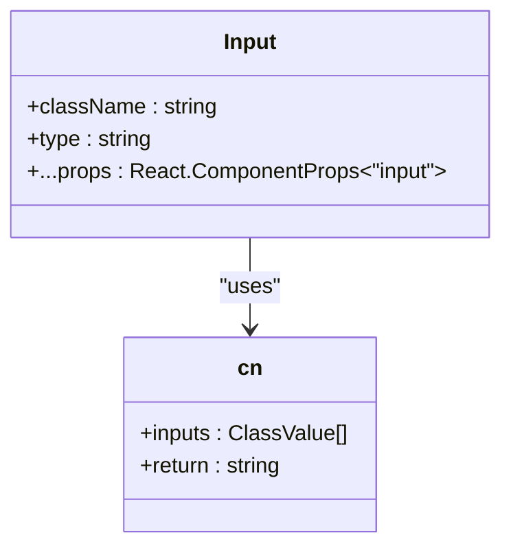
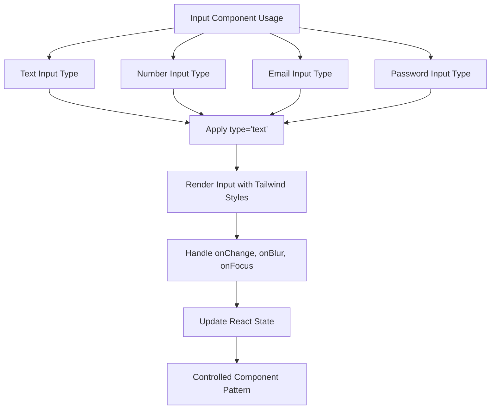

# Input Component API

<cite>
**Referenced Files in This Document**   
- [input.tsx](file://components/ui/input.tsx)
- [utils.ts](file://lib/utils.ts)
- [globals.css](file://app/globals.css)
- [components.json](file://components.json)
</cite>

## Table of Contents
1. [Introduction](#introduction)
2. [Core Props](#core-props)
3. [Styling and Tailwind CSS Integration](#styling-and-tailwind-css-integration)
4. [Event Handling and Controlled Components](#event-handling-and-controlled-components)
5. [Accessibility Implementation](#accessibility-implementation)
6. [TypeScript Interface Definition](#typescript-interface-definition)
7. [Usage Examples](#usage-examples)
8. [Integration with Form Libraries](#integration-with-form-libraries)
9. [Error State Management](#error-state-management)
10. [Conclusion](#conclusion)

## Introduction
The Input component in the activity-tracker application is a reusable UI primitive designed for user data entry across various forms and interfaces. Built using React and integrated with Radix UI design principles, this component provides a consistent, accessible, and styled input field that supports all native HTML input attributes while enabling extensibility through Tailwind CSS classes. The component leverages the `cn` utility for conditional class merging and follows headless UI patterns by exposing low-level props for maximum flexibility.

**Section sources**
- [input.tsx](file://components/ui/input.tsx#L1-L18)

## Core Props
The Input component accepts standard HTML input attributes as props, with specific handling for key properties:

- **type**: Specifies the input type (text, number, email, password, etc.)
- **placeholder**: Defines placeholder text displayed when input is empty
- **disabled**: When true, disables the input and applies visual styling for disabled state
- **required**: Indicates the field is mandatory for form submission
- **className**: Allows additional CSS classes to be merged with the default styling

The component uses React's `ComponentProps<"input">` type to automatically support all native HTML input attributes, ensuring full compatibility with standard form behaviors and browser features.

**Section sources**
- [input.tsx](file://components/ui/input.tsx#L4-L6)

## Styling and Tailwind CSS Integration
The Input component's visual appearance is defined through Tailwind CSS classes merged using the `cn` utility function from `@/lib/utils`. The base styling includes:

- Fixed height of 10 units with full width
- Rounded borders with custom radius defined in CSS variables
- Border width of 2 pixels with color from the `--border` CSS variable
- Background using the `--secondary-background` color
- Text styling with size, font weight, and foreground color
- Focus styles with visible ring and offset
- Disabled state styling with reduced opacity and cursor indication

The `cn` function combines default styles with any provided `className` prop, enabling customization while maintaining consistent base appearance.

**Diagram sources**
- [input.tsx](file://components/ui/input.tsx#L4-L15)
- [utils.ts](file://lib/utils.ts#L3-L5)

## Event Handling and Controlled Components
The Input component fully supports React's controlled component pattern through standard event handlers:

- **onChange**: Triggered when input value changes, receives synthetic event with updated value
- **onBlur**: Fired when input loses focus, useful for validation timing
- **onFocus**: Activated when input receives focus, can trigger UI enhancements

The component spreads all props directly to the underlying HTML input element, automatically supporting these and other event handlers without explicit implementation. This enables integration with state management patterns using React's useState hook or external state libraries.

**Section sources**
- [input.tsx](file://components/ui/input.tsx#L10-L18)

## Accessibility Implementation
The Input component adheres to accessibility best practices through several key features:

- Proper label association via htmlFor/id pairing in parent form components
- ARIA attribute support through the spread props pattern
- Visible focus indicators with high-contrast ring
- Screen reader compatibility with semantic HTML input element
- Proper contrast ratios between text and background colors
- Keyboard navigation support through standard tab flow

The component's design ensures compatibility with assistive technologies while maintaining visual consistency across different input states.

**Section sources**
- [input.tsx](file://components/ui/input.tsx#L7-L18)
- [globals.css](file://app/globals.css#L1-L73)

## TypeScript Interface Definition
The Input component utilizes React's built-in type definitions rather than a custom interface, leveraging `React.ComponentProps<"input">` to inherit all properties from the native HTML input element. This approach provides:

- Complete type safety for all standard input attributes
- Automatic TypeScript IntelliSense in development environments
- Validation of prop types at compile time
- Support for all input modes and attributes without manual interface updates

This typing strategy ensures the component remains compatible with evolving HTML standards while providing robust developer experience.

**Section sources**
- [input.tsx](file://components/ui/input.tsx#L4)

## Usage Examples
The Input component can be used in various scenarios with different input types:

### Text Input
Standard text entry for names, descriptions, and general text content.

### Number Input
Numeric data entry with type="number" for quantities, values, and calculations.

### Email Input
Email address entry with type="email" for user contact information.

### Password Input
Secure password entry with type="password" and masked characters.

Each example demonstrates the component's ability to handle different input types while maintaining consistent styling and behavior.

**Diagram sources**
- [input.tsx](file://components/ui/input.tsx#L4-L18)

## Integration with Form Libraries
The Input component seamlessly integrates with popular React form libraries such as React Hook Form, Formik, and Final Form. Its design supports:

- Uncontrolled mode with ref forwarding (though not explicitly implemented)
- Controlled mode with value and onChange props
- Validation state management through className overrides
- Error message association through aria-describedby
- Form submission handling via standard form events

The component's simplicity and adherence to native HTML patterns make it compatible with various form management approaches without requiring library-specific adaptations.

**Section sources**
- [input.tsx](file://components/ui/input.tsx#L4-L18)

## Error State Management
While the base Input component does not include explicit error state handling, it supports error visualization through:

- External className overrides for error styling
- Integration with parent form components that manage validation state
- ARIA attributes like aria-invalid to indicate error state to assistive technologies
- Placeholder and label modifications based on validation results

Error states can be visually represented by adding custom classes that modify the border color, add icons, or display error messages adjacent to the input field.

**Section sources**
- [input.tsx](file://components/ui/input.tsx#L10-L15)

## Conclusion
The Input component in the activity-tracker application provides a robust, accessible, and stylistically consistent solution for user data entry. By leveraging React's component model, Tailwind CSS for styling, and native HTML input attributes, it offers a flexible foundation for form development. The component's design prioritizes simplicity, type safety, and accessibility while enabling extensive customization through standard web development patterns. Its integration with the broader UI component library ensures visual consistency across the application, making it a reliable choice for various data input scenarios.