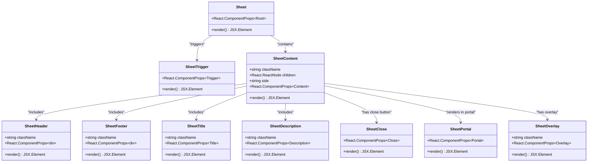
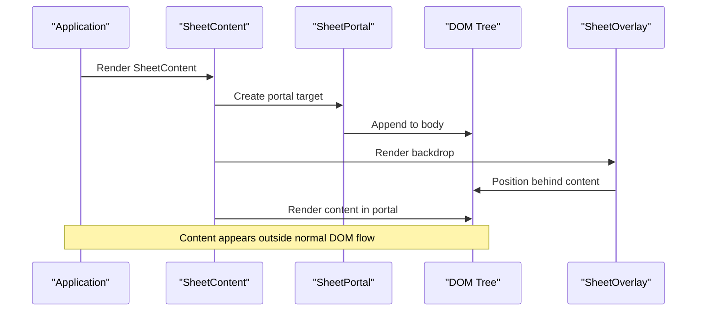

# Sheet Component API Documentation

<cite>
**Referenced Files in This Document**
- [components/ui/sheet.tsx](file://components/ui/sheet.tsx)
- [lib/utils.ts](file://lib/utils.ts)
- [hooks/use-mobile.ts](file://hooks/use-mobile.ts)
- [app/_components/Sidebar.tsx](file://app/_components/Sidebar.tsx)
- [app/globals.css](file://app/globals.css)
</cite>

## Table of Contents
1. [Introduction](#introduction)
2. [Component Architecture](#component-architecture)
3. [Core Components](#core-components)
4. [Props Reference](#props-reference)
5. [Accessibility Features](#accessibility-features)
6. [Usage Examples](#usage-examples)
7. [Integration with Radix UI](#integration-with-radix-ui)
8. [Styling and Theming](#styling-and-theming)
9. [Common Issues and Solutions](#common-issues-and-solutions)
10. [Best Practices](#best-practices)

## Introduction

The Sheet component is a modal drawer designed for mobile navigation and side panels in the activity-tracker app. Built on top of Radix UI's Dialog primitive, it provides a flexible and accessible solution for displaying content in a sliding panel that appears from one of four directions (left, right, top, bottom).

The component follows modern web accessibility standards and integrates seamlessly with the app's responsive design system, automatically adapting to mobile and desktop views through the use-mobile hook.

## Component Architecture

The Sheet component is structured as a composition of several specialized components, each serving a specific purpose in the modal drawer system:



**Diagram sources**
- [components/ui/sheet.tsx](file://components/ui/sheet.tsx#L9-L142)

**Section sources**
- [components/ui/sheet.tsx](file://components/ui/sheet.tsx#L1-L143)

## Core Components

### Sheet Root Component

The main Sheet component serves as the root container and state manager for the modal drawer. It wraps the Radix UI Dialog Root component and provides the foundational context for all child components.

```typescript
function Sheet({ ...props }: React.ComponentProps<typeof SheetPrimitive.Root>) {
  return <SheetPrimitive.Root data-slot="sheet" {...props} />
}
```

### Sheet Trigger Component

The trigger component activates the Sheet when clicked, serving as the entry point for user interaction.

```typescript
function SheetTrigger({
  ...props
}: React.ComponentProps<typeof SheetPrimitive.Trigger>) {
  return <SheetPrimitive.Trigger data-slot="sheet-trigger" {...props} />
}
```

### Sheet Close Component

The close component provides a way to dismiss the Sheet programmatically or through user interaction.

```typescript
function SheetClose({
  ...props
}: React.ComponentProps<typeof SheetPrimitive.Close>) {
  return <SheetPrimitive.Close data-slot="sheet-close" {...props} />
}
```

### Sheet Content Component

The content component defines the main container for Sheet content, supporting multiple positioning sides and responsive design.

**Key Features:**
- **Side Positioning**: Supports "top", "bottom", "left", and "right" positions
- **Responsive Width**: Automatically adjusts width based on screen size
- **Animation System**: Uses CSS animations for smooth transitions
- **Portal Rendering**: Renders content outside the DOM tree for proper stacking context

**Section sources**
- [components/ui/sheet.tsx](file://components/ui/sheet.tsx#L9-L74)

## Props Reference

### Sheet Component Props

```typescript
interface SheetProps extends React.ComponentProps<typeof SheetPrimitive.Root> {
  // Inherits all props from Radix UI Dialog Root
  open?: boolean
  onOpenChange?: (open: boolean) => void
  defaultOpen?: boolean
}
```

### SheetContent Component Props

```typescript
interface SheetContentProps extends React.ComponentProps<typeof SheetPrimitive.Content> {
  className?: string
  children?: React.ReactNode
  side?: "top" | "bottom" | "left" | "right"
}
```

### Additional Component Props

Each component inherits appropriate props from their Radix UI counterparts:

- **SheetHeader**: Standard div props
- **SheetFooter**: Standard div props  
- **SheetTitle**: Inherits from SheetPrimitive.Title
- **SheetDescription**: Inherits from SheetPrimitive.Description
- **SheetOverlay**: Inherits from SheetPrimitive.Overlay
- **SheetPortal**: Inherits from SheetPrimitive.Portal

**Section sources**
- [components/ui/sheet.tsx](file://components/ui/sheet.tsx#L50-L74)

## Accessibility Features

The Sheet component implements comprehensive accessibility features following WCAG guidelines:

### Focus Management

- **Focus Trapping**: Automatically traps focus within the Sheet when opened
- **Initial Focus**: Sets focus to the first interactive element or close button
- **Focus Restoration**: Returns focus to the triggering element when closed

### Keyboard Navigation

- **Escape Key**: Dismisses the Sheet when pressed
- **Tab Navigation**: Proper tab order within Sheet content
- **Arrow Keys**: Respects native browser behavior for arrow key navigation

### ARIA Attributes

```typescript
// Automatic ARIA attributes applied by Radix UI
<SheetPrimitive.Content
  role="dialog"
  aria-modal="true"
  aria-labelledby="sheet-title"
  aria-describedby="sheet-description"
/>
```

### Screen Reader Support

- **Semantic Structure**: Uses appropriate HTML elements and ARIA roles
- **Descriptive Labels**: Provides meaningful titles and descriptions
- **Live Regions**: Announces state changes to assistive technologies

**Section sources**
- [components/ui/sheet.tsx](file://components/ui/sheet.tsx#L65-L74)

## Usage Examples

### Basic Mobile Sidebar Implementation

```typescript
import { Sheet, SheetContent, SheetTrigger } from '@/components/ui/sheet'
import { MenuIcon } from 'lucide-react'

export function MobileSidebar() {
  return (
    <Sheet>
      <SheetTrigger>
        <MenuIcon className="h-6 w-6" />
      </SheetTrigger>
      <SheetContent side="left">
        <SheetHeader>
          <SheetTitle>Navigation Menu</SheetTitle>
          <SheetDescription>Access all app features</SheetDescription>
        </SheetHeader>
        <nav className="flex flex-col gap-4 mt-6">
          {/* Navigation items */}
        </nav>
        <SheetFooter className="mt-8">
          <button className="w-full bg-primary text-primary-foreground">
            Sign Out
          </button>
        </SheetFooter>
      </SheetContent>
    </Sheet>
  )
}
```

### Form Overlay Example

```typescript
import { useState } from 'react'
import { 
  Sheet, SheetContent, SheetTrigger, 
  SheetHeader, SheetTitle, SheetDescription,
  SheetFooter, SheetClose 
} from '@/components/ui/sheet'
import { Button } from '@/components/ui/button'
import { Input } from '@/components/ui/input'

export function AddTaskSheet() {
  const [taskName, setTaskName] = useState('')
  
  return (
    <Sheet>
      <SheetTrigger asChild>
        <Button>Add Task</Button>
      </SheetTrigger>
      <SheetContent side="right" className="sm:max-w-lg">
        <SheetHeader>
          <SheetTitle>Create New Task</SheetTitle>
          <SheetDescription>
            Enter task details below
          </SheetDescription>
        </SheetHeader>
        
        <div className="space-y-4 py-6">
          <Input
            placeholder="Task name"
            value={taskName}
            onChange={(e) => setTaskName(e.target.value)}
          />
          {/* Additional form fields */}
        </div>
        
        <SheetFooter>
          <SheetClose asChild>
            <Button variant="outline">Cancel</Button>
          </SheetClose>
          <Button onClick={() => {/* Save task */}}>Save</Button>
        </SheetFooter>
      </SheetContent>
    </Sheet>
  )
}
```

### Responsive Implementation with useMobile Hook

```typescript
import { useIsMobile } from '@/hooks/use-mobile'

export function ResponsiveSheet() {
  const isMobile = useIsMobile()
  
  return (
    <Sheet>
      <SheetTrigger asChild>
        <Button>Open Menu</Button>
      </SheetTrigger>
      <SheetContent 
        side={isMobile ? 'left' : 'right'}
        className={isMobile ? 'w-full' : ''}
      >
        {/* Sheet content */}
      </SheetContent>
    </Sheet>
  )
}
```

**Section sources**
- [app/_components/Sidebar.tsx](file://app/_components/Sidebar.tsx#L1-L270)
- [hooks/use-mobile.ts](file://hooks/use-mobile.ts#L1-L20)

## Integration with Radix UI

The Sheet component is built on top of Radix UI's Dialog primitive, leveraging its robust foundation while adding custom styling and behavior:

### Portal Rendering System



**Diagram sources**
- [components/ui/sheet.tsx](file://components/ui/sheet.tsx#L45-L74)

### Animation System

The component uses Radix UI's built-in animation system combined with Tailwind CSS classes:

```typescript
className={cn(
  "bg-background data-[state=open]:animate-in data-[state=closed]:animate-out",
  "fixed z-50 flex flex-col gap-4 border-2 border-border",
  "transition ease-in-out data-[state=closed]:duration-300 data-[state=open]:duration-500",
  // Side-specific animations
  side === "right" && "data-[state=closed]:slide-out-to-right data-[state=open]:slide-in-from-right",
  side === "left" && "data-[state=closed]:slide-out-to-left data-[state=open]:slide-in-from-left",
  side === "top" && "data-[state=closed]:slide-out-to-top data-[state=open]:slide-in-from-top",
  side === "bottom" && "data-[state=closed]:slide-out-to-bottom data-[state=open]:slide-in-from-bottom",
)}
```

**Section sources**
- [components/ui/sheet.tsx](file://components/ui/sheet.tsx#L59-L74)

## Styling and Theming

### Design Token System

The component integrates with the app's design system using CSS custom properties:

```css
:root {
  --background: oklch(93.46% 0.0305 255.11);
  --secondary-background: oklch(100% 0 0);
  --foreground: oklch(0% 0 0);
  --border: oklch(0% 0 0);
  --overlay: oklch(0% 0 0 / 0.8);
}

.dark {
  --background: oklch(29.23% 0.0626 270.49);
  --foreground: oklch(92.49% 0 0);
  --border: oklch(0% 0 0);
}
```

### Responsive Breakpoints

The component adapts to different screen sizes using Tailwind CSS utilities:

- **Mobile**: Full height, full width (3/4 viewport)
- **Desktop**: Max width of sm (640px), reduced padding
- **Customizable**: Allows overriding default sizing through className prop

### Animation Duration Control

Different animation durations are applied based on state:

- **Open Animation**: 500ms for smooth entrance
- **Close Animation**: 300ms for quick exit
- **Transition Timing**: Ease-in-out for natural feel

**Section sources**
- [app/globals.css](file://app/globals.css#L1-L74)
- [components/ui/sheet.tsx](file://components/ui/sheet.tsx#L60-L70)

## Common Issues and Solutions

### Scroll Lock Behavior

**Issue**: Body scrolling continues when Sheet is open
**Solution**: Radix UI Dialog automatically handles scroll locking, but ensure proper portal rendering:

```typescript
// Correct implementation
<SheetContent>
  <SheetPortal>
    <SheetOverlay />
    <SheetPrimitive.Content>
      {/* Content here */}
    </SheetPrimitive.Content>
  </SheetPortal>
</SheetContent>
```

### Nested Sheet Behavior

**Issue**: Multiple Sheets opening simultaneously
**Solution**: Use controlled state management and proper z-index handling:

```typescript
const [isOpen, setIsOpen] = useState(false)

return (
  <Sheet open={isOpen} onOpenChange={setIsOpen}>
    {/* Nested sheets should use separate state */}
  </Sheet>
)
```

### Focus Management Issues

**Issue**: Focus trapped incorrectly or lost
**Solution**: Ensure proper focus restoration and initial focus setting:

```typescript
// Add focus trap for complex forms
<SheetContent>
  <SheetPrimitive.Content 
    autoFocus={true}
    onOpenAutoFocus={(e) => e.preventDefault()}
  >
    {/* Form elements will receive focus */}
  </SheetPrimitive.Content>
</SheetContent>
```

### Performance Optimization

**Issue**: Slow animations or poor performance
**Solution**: Optimize animation properties and reduce unnecessary re-renders:

```typescript
// Use React.memo for complex content
const OptimizedContent = React.memo(({ children }) => children)

<SheetContent>
  <OptimizedContent>
    {/* Expensive rendering here */}
  </OptimizedContent>
</SheetContent>
```

## Best Practices

### Controlled State Management

Always use controlled state for production applications:

```typescript
// Good: Controlled state
const [isOpen, setIsOpen] = useState(false)
return <Sheet open={isOpen} onOpenChange={setIsOpen} />

// Avoid: Uncontrolled state
<Sheet /> {/* Will use internal state */}
```

### Responsive Design Patterns

Leverage the use-mobile hook for adaptive behavior:

```typescript
import { useIsMobile } from '@/hooks/use-mobile'

function AdaptiveSheet() {
  const isMobile = useIsMobile()
  
  return (
    <Sheet>
      <SheetTrigger asChild>
        <Button>Open</Button>
      </SheetTrigger>
      <SheetContent side={isMobile ? 'left' : 'right'}>
        {/* Responsive content */}
      </SheetContent>
    </Sheet>
  )
}
```

### Accessibility Compliance

Ensure all interactive elements are accessible:

```typescript
<SheetContent>
  <SheetHeader>
    <SheetTitle id="sheet-title">Modal Title</SheetTitle>
    <SheetDescription id="sheet-description">
      Descriptive text for screen readers
    </SheetDescription>
  </SheetHeader>
  
  {/* Use proper semantic markup */}
  <nav role="navigation" aria-label="Main navigation">
    {/* Navigation links */}
  </nav>
  
  <SheetFooter>
    <SheetClose asChild>
      <button aria-label="Close modal">Cancel</button>
    </SheetClose>
  </SheetFooter>
</SheetContent>
```

### Performance Considerations

- **Lazy Loading**: Load heavy content only when Sheet opens
- **Memory Management**: Clean up event listeners and timers
- **Bundle Size**: Import only necessary Sheet components

```typescript
// Lazy load content
const [contentLoaded, setContentLoaded] = useState(false)

<Sheet onOpenChange={(open) => !open || setContentLoaded(true)}>
  <SheetContent>
    {contentLoaded && <HeavyContent />}
  </SheetContent>
</Sheet>
```

The Sheet component provides a robust, accessible, and performant solution for modal drawers in the activity-tracker app. Its integration with Radix UI ensures reliability while the custom styling and responsive design make it suitable for modern web applications.