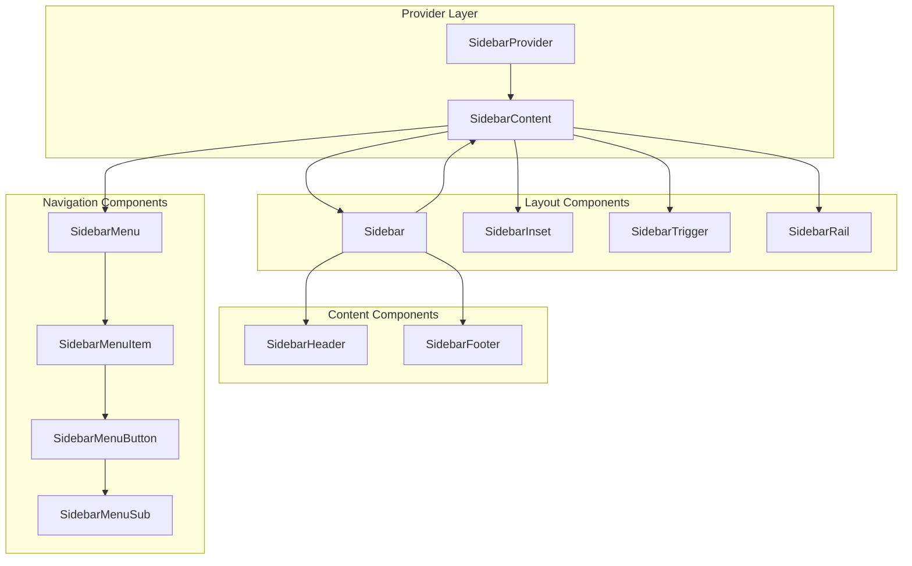

# Sidebar Component API

<cite>
**Referenced Files in This Document**
- [components/ui/sidebar.tsx](file://components/ui/sidebar.tsx)
- [app/_components/Sidebar.tsx](file://app/_components/Sidebar.tsx)
- [hooks/use-mobile.ts](file://hooks/use-mobile.ts)
- [components/ui/collapsible.tsx](file://components/ui/collapsible.tsx)
- [components/ui/tooltip.tsx](file://components/ui/tooltip.tsx)
- [app/page.tsx](file://app/page.tsx)
- [app/layout.tsx](file://app/layout.tsx)
</cite>

## Table of Contents
1. [Introduction](#introduction)
2. [Core Architecture](#core-architecture)
3. [SidebarProvider and Context](#sidebarprovider-and-context)
4. [Main Components](#main-components)
5. [Navigation Components](#navigation-components)
6. [Interactive Components](#interactive-components)
7. [Responsive Behavior](#responsive-behavior)
8. [Accessibility Features](#accessibility-features)
9. [TypeScript Interfaces](#typescript-interfaces)
10. [Usage Examples](#usage-examples)
11. [Advanced Patterns](#advanced-patterns)
12. [Troubleshooting](#troubleshooting)

## Introduction

The Sidebar component system is a comprehensive navigation solution designed for the activity-tracker application. It provides a flexible, responsive sidebar layout with support for desktop and mobile devices, collapsible behavior, and extensive customization options. The system is built with accessibility in mind and integrates seamlessly with Next.js applications.

The sidebar architecture consists of multiple interconnected components that work together to create a cohesive navigation experience. At its core, the system uses React Context for state management and provides a provider component to wrap the entire application or specific sections requiring sidebar functionality.

## Core Architecture

The Sidebar system follows a hierarchical component structure with centralized state management through React Context. The architecture enables both controlled and uncontrolled behavior while maintaining accessibility standards.



**Diagram sources**
- [components/ui/sidebar.tsx](file://components/ui/sidebar.tsx#L46-L133)
- [components/ui/sidebar.tsx](file://components/ui/sidebar.tsx#L135-L221)

**Section sources**
- [components/ui/sidebar.tsx](file://components/ui/sidebar.tsx#L1-L133)
- [app/_components/Sidebar.tsx](file://app/_components/Sidebar.tsx#L1-L50)

## SidebarProvider and Context

The `SidebarProvider` serves as the central state manager for the entire sidebar system. It maintains the global state and provides context to all child components through React Context API.

### SidebarProvider Props

```typescript
interface SidebarProviderProps {
  defaultOpen?: boolean;
  open?: boolean;
  onOpenChange?: (open: boolean) => void;
  className?: string;
  style?: React.CSSProperties;
  children: React.ReactNode;
}
```

### Key Features

- **State Management**: Centralized state for sidebar visibility across the application
- **Cookie Persistence**: Automatically saves sidebar state to cookies for persistence
- **Keyboard Shortcuts**: Built-in keyboard shortcut (`Ctrl/Cmd + B`) to toggle sidebar
- **Responsive Detection**: Integrates with mobile detection hook for adaptive behavior

### Context Properties

The `SidebarContext` provides the following properties to child components:

```typescript
interface SidebarContextProps {
  state: "expanded" | "collapsed";
  open: boolean;
  setOpen: (open: boolean) => void;
  openMobile: boolean;
  setOpenMobile: (open: boolean) => void;
  isMobile: boolean;
  toggleSidebar: () => void;
}
```

**Section sources**
- [components/ui/sidebar.tsx](file://components/ui/sidebar.tsx#L46-L133)
- [hooks/use-mobile.ts](file://hooks/use-mobile.ts#L1-L20)

## Main Components

### Sidebar

The main container component that handles layout, responsiveness, and variant styling.

```typescript
interface SidebarProps {
  side?: "left" | "right";
  variant?: "sidebar" | "floating" | "inset";
  collapsible?: "offcanvas" | "icon" | "none";
  className?: string;
  children: React.ReactNode;
}
```

#### Variants and Behaviors

- **sidebar**: Standard sidebar with fixed positioning
- **floating**: Sidebar with floating appearance and shadow
- **inset**: Sidebar inset within content area with rounded corners
- **offcanvas**: Full-screen overlay on mobile
- **icon**: Icon-only mode for collapsed state
- **none**: Static, non-collapsible sidebar

### SidebarInset

Provides the main content area that adjusts its position based on sidebar state.

```typescript
interface SidebarInsetProps {
  className?: string;
  children: React.ReactNode;
}
```

### SidebarTrigger

A button component that toggles the sidebar state.

```typescript
interface SidebarTriggerProps {
  className?: string;
  onClick?: (event: React.MouseEvent<HTMLButtonElement>) => void;
}
```

### SidebarRail

A draggable rail that allows users to resize the sidebar on desktop.

```typescript
interface SidebarRailProps {
  className?: string;
  onClick?: (event: React.MouseEvent<HTMLButtonElement>) => void;
}
```

**Section sources**
- [components/ui/sidebar.tsx](file://components/ui/sidebar.tsx#L135-L293)

## Navigation Components

### SidebarHeader, SidebarContent, SidebarFooter

Container components for organizing sidebar content:

```typescript
interface SidebarHeaderProps {
  className?: string;
  children: React.ReactNode;
}

interface SidebarContentProps {
  className?: string;
  children: React.ReactNode;
}

interface SidebarFooterProps {
  className?: string;
  children: React.ReactNode;
}
```

### SidebarMenu and SidebarMenuItem

Components for building navigation menus:

```typescript
interface SidebarMenuProps {
  className?: string;
  children: React.ReactNode;
}

interface SidebarMenuItemProps {
  className?: string;
  children: React.ReactNode;
}
```

### SidebarMenuButton

The primary interactive element for navigation items.

```typescript
interface SidebarMenuButtonProps {
  asChild?: boolean;
  isActive?: boolean;
  size?: "default" | "sm" | "lg";
  tooltip?: string | React.ComponentProps<typeof TooltipContent>;
  className?: string;
  children: React.ReactNode;
}
```

#### Size Variants

- **default**: Standard height (2rem)
- **sm**: Small height (1.75rem)
- **lg**: Large height (3rem)

#### Tooltip Behavior

The tooltip appears automatically when:
- Sidebar is in collapsed state
- Not on mobile devices
- Tooltip prop is provided

**Section sources**
- [components/ui/sidebar.tsx](file://components/ui/sidebar.tsx#L295-L473)

## Interactive Components

### SidebarGroup, SidebarGroupLabel, SidebarGroupContent

Components for grouping related menu items:

```typescript
interface SidebarGroupProps {
  className?: string;
  children: React.ReactNode;
}

interface SidebarGroupLabelProps {
  className?: string;
  asChild?: boolean;
  children: React.ReactNode;
}

interface SidebarGroupContentProps {
  className?: string;
  children: React.ReactNode;
}
```

### SidebarMenuAction

Interactive actions associated with menu items:

```typescript
interface SidebarMenuActionProps {
  className?: string;
  asChild?: boolean;
  showOnHover?: boolean;
  children: React.ReactNode;
}
```

### SidebarMenuSub, SidebarMenuSubItem, SidebarMenuSubButton

Components for nested menu structures:

```typescript
interface SidebarMenuSubProps {
  className?: string;
  children: React.ReactNode;
}

interface SidebarMenuSubButtonProps {
  asChild?: boolean;
  size?: "sm" | "md";
  isActive?: boolean;
  className?: string;
  children: React.ReactNode;
}
```

**Section sources**
- [components/ui/sidebar.tsx](file://components/ui/sidebar.tsx#L373-L714)

## Responsive Behavior

The sidebar system automatically adapts to different screen sizes using the `useIsMobile` hook and CSS media queries.

### Desktop Behavior

- Fixed positioning with smooth transitions
- Collapsible rail for resizing
- Hover effects and tooltips
- Keyboard shortcuts enabled

### Mobile Behavior

- Offcanvas overlay with slide animation
- Full-width content area
- Touch-friendly interaction areas
- Automatic close on navigation

### Breakpoint Configuration

```typescript
const MOBILE_BREAKPOINT = 768;
```

**Section sources**
- [hooks/use-mobile.ts](file://hooks/use-mobile.ts#L1-L20)
- [components/ui/sidebar.tsx](file://components/ui/sidebar.tsx#L175-L221)

## Accessibility Features

The sidebar system incorporates numerous accessibility features:

### ARIA Landmarks

- Proper role assignment for navigation regions
- Semantic HTML structure
- Screen reader support for interactive elements

### Keyboard Navigation

- Tab order maintained for logical navigation
- Enter/Space key support for interactive elements
- Escape key closes mobile overlays
- Focus management during state changes

### Screen Reader Support

- Descriptive labels for interactive elements
- Live regions for state changes
- Alternative text for icons and images

### Focus Management

- Automatic focus restoration
- Focus trapping for modal states
- Clear focus indicators

**Section sources**
- [components/ui/sidebar.tsx](file://components/ui/sidebar.tsx#L240-L293)

## TypeScript Interfaces

### Core Interfaces

```typescript
// SidebarProvider context
interface SidebarContextProps {
  state: "expanded" | "collapsed";
  open: boolean;
  setOpen: (open: boolean) => void;
  openMobile: boolean;
  setOpenMobile: (open: boolean) => void;
  isMobile: boolean;
  toggleSidebar: () => void;
}

// Sidebar component props
interface SidebarProps {
  side?: "left" | "right";
  variant?: "sidebar" | "floating" | "inset";
  collapsible?: "offcanvas" | "icon" | "none";
  className?: string;
  children: React.ReactNode;
}

// SidebarMenuButton props
interface SidebarMenuButtonProps {
  asChild?: boolean;
  isActive?: boolean;
  size?: "default" | "sm" | "lg";
  tooltip?: string | React.ComponentProps<typeof TooltipContent>;
  className?: string;
  children: React.ReactNode;
}
```

### Utility Types

The system uses several utility types for enhanced type safety:

- **VariantProps**: For component variants using class-variance-authority
- **Slot**: From radix-ui/react-slot for composition flexibility
- **CSSProperties**: For inline style management

**Section sources**
- [components/ui/sidebar.tsx](file://components/ui/sidebar.tsx#L25-L45)

## Usage Examples

### Basic Implementation

```tsx
import { SidebarProvider, Sidebar, SidebarInset, SidebarTrigger } from '@/components/ui/sidebar';
import { AppSidebar } from './_components/Sidebar';

export default function Layout() {
  return (
    <SidebarProvider>
      <AppSidebar />
      <SidebarInset>
        <header>
          <SidebarTrigger />
          {/* Page content */}
        </header>
      </SidebarInset>
    </SidebarProvider>
  );
}
```

### Controlled Sidebar

```tsx
import { useState } from 'react';
import { SidebarProvider, Sidebar, SidebarInset } from '@/components/ui/sidebar';

export default function ControlledSidebar() {
  const [isOpen, setIsOpen] = useState(true);
  
  return (
    <SidebarProvider open={isOpen} onOpenChange={setIsOpen}>
      <Sidebar />
      <SidebarInset>
        {/* Content */}
      </SidebarInset>
    </SidebarProvider>
  );
}
```

### Custom Menu Implementation

```tsx
import { 
  Sidebar, 
  SidebarContent, 
  SidebarGroup, 
  SidebarGroupLabel, 
  SidebarMenu, 
  SidebarMenuItem, 
  SidebarMenuButton 
} from '@/components/ui/sidebar';

export function CustomSidebar() {
  return (
    <Sidebar>
      <SidebarContent>
        <SidebarGroup>
          <SidebarGroupLabel>Navigation</SidebarGroupLabel>
          <SidebarMenu>
            <SidebarMenuItem>
              <SidebarMenuButton>
                <span>Home</span>
              </SidebarMenuButton>
            </SidebarMenuItem>
          </SidebarMenu>
        </SidebarGroup>
      </SidebarContent>
    </Sidebar>
  );
}
```

**Section sources**
- [app/page.tsx](file://app/page.tsx#L1-L52)
- [app/_components/Sidebar.tsx](file://app/_components/Sidebar.tsx#L111-L171)

## Advanced Patterns

### Nested Menu Structure

```tsx
import { 
  Collapsible,
  CollapsibleTrigger,
  CollapsibleContent 
} from '@/components/ui/collapsible';

export function NestedSidebarMenu() {
  return (
    <SidebarMenu>
      <Collapsible>
        <CollapsibleTrigger>
          <SidebarMenuButton>
            Parent Item
          </SidebarMenuButton>
        </CollapsibleTrigger>
        <CollapsibleContent>
          <SidebarMenuSub>
            <SidebarMenuSubItem>
              <SidebarMenuSubButton>
                Child Item
              </SidebarMenuSubButton>
            </SidebarMenuSubItem>
          </SidebarMenuSub>
        </CollapsibleContent>
      </Collapsible>
    </SidebarMenu>
  );
}
```

### Dynamic Menu Generation

```tsx
interface MenuItem {
  title: string;
  url: string;
  icon?: React.ComponentType;
  items?: MenuItem[];
}

export function DynamicSidebar({ menuItems }: { menuItems: MenuItem[] }) {
  return (
    <SidebarMenu>
      {menuItems.map((item) => (
        <SidebarMenuItem key={item.title}>
          {item.items ? (
            <Collapsible>
              <CollapsibleTrigger>
                <SidebarMenuButton>
                  {item.icon && <item.icon />}
                  <span>{item.title}</span>
                </SidebarMenuButton>
              </CollapsibleTrigger>
              <CollapsibleContent>
                <SidebarMenuSub>
                  {item.items.map((subItem) => (
                    <SidebarMenuSubItem key={subItem.title}>
                      <SidebarMenuSubButton asChild>
                        <a href={subItem.url}>{subItem.title}</a>
                      </SidebarMenuSubButton>
                    </SidebarMenuSubItem>
                  ))}
                </SidebarMenuSub>
              </CollapsibleContent>
            </Collapsible>
          ) : (
            <SidebarMenuButton asChild>
              <a href={item.url}>
                {item.icon && <item.icon />}
                <span>{item.title}</span>
              </a>
            </SidebarMenuButton>
          )}
        </SidebarMenuItem>
      ))}
    </SidebarMenu>
  );
}
```

### Custom Variants and Styling

```tsx
export function StyledSidebar() {
  return (
    <Sidebar 
      variant="floating"
      collapsible="icon"
      className="bg-gray-900 text-white"
    >
      {/* Sidebar content */}
    </Sidebar>
  );
}
```

**Section sources**
- [app/_components/Sidebar.tsx](file://app/_components/Sidebar.tsx#L111-L204)
- [components/ui/collapsible.tsx](file://components/ui/collapsible.tsx#L1-L36)

## Troubleshooting

### Common Issues

#### Context Not Found Error

**Problem**: `useSidebar must be used within a SidebarProvider.`

**Solution**: Ensure all sidebar components are wrapped within a `SidebarProvider`:

```tsx
// ❌ Incorrect
<Sidebar />

// ✅ Correct
<SidebarProvider>
  <Sidebar />
</SidebarProvider>
```

#### State Not Persisting

**Problem**: Sidebar state resets on page reload.

**Solution**: Verify cookie permissions and ensure `document.cookie` is accessible.

#### Mobile Detection Issues

**Problem**: Sidebar doesn't switch to mobile mode.

**Solution**: Check viewport meta tag and ensure `useIsMobile` hook is properly configured.

### Performance Optimization

- Use `React.memo` for static sidebar content
- Implement lazy loading for large menu structures
- Optimize CSS transitions for smooth animations
- Consider virtualization for extensive lists

### Browser Compatibility

- Supports modern browsers with CSS Grid and Flexbox
- Fallbacks for older browser versions
- Progressive enhancement for JavaScript-disabled environments

**Section sources**
- [components/ui/sidebar.tsx](file://components/ui/sidebar.tsx#L46-L50)