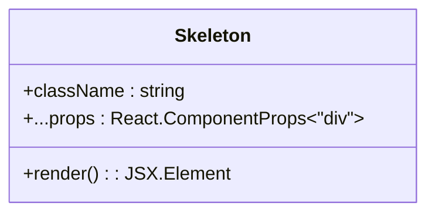
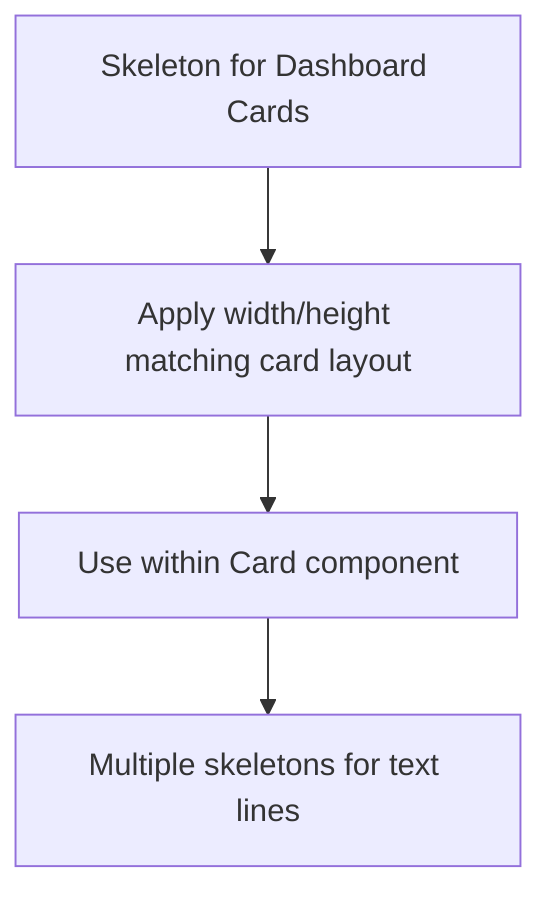
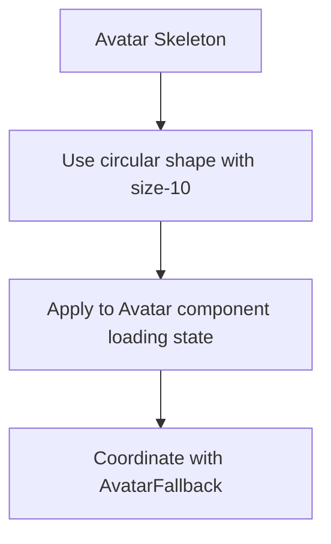
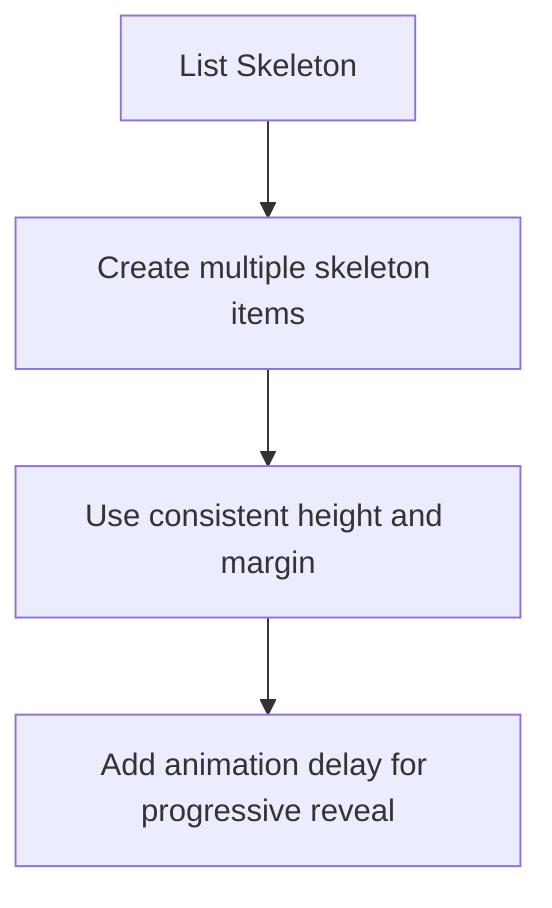
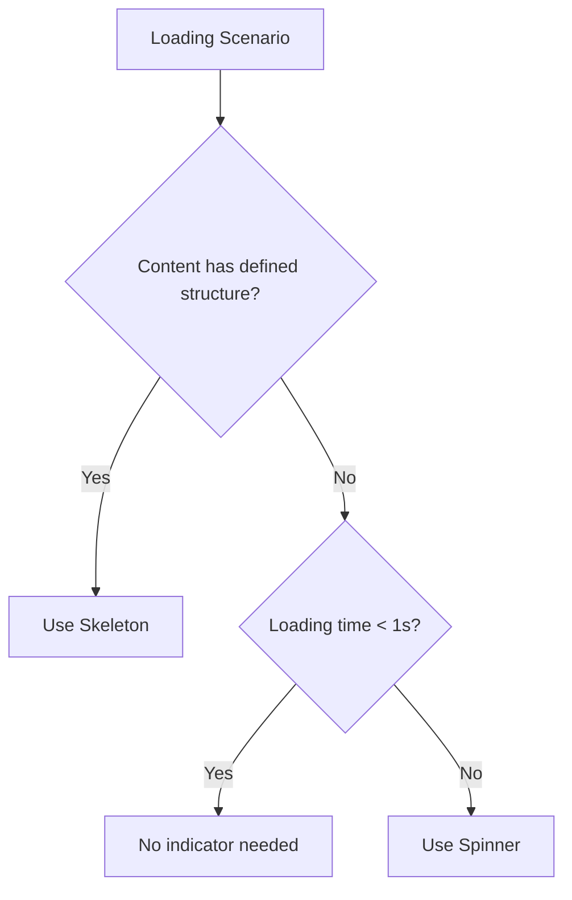
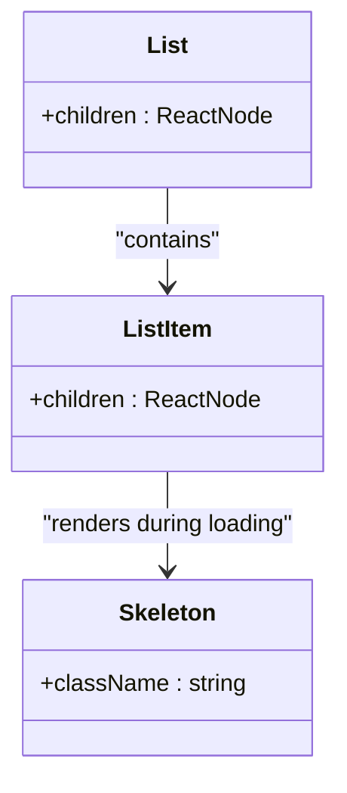

# Skeleton Component API

<cite>
**Referenced Files in This Document**   
- [skeleton.tsx](file://components/ui/skeleton.tsx)
- [utils.ts](file://lib/utils.ts)
- [globals.css](file://app/globals.css)
- [sidebar.tsx](file://components/ui/sidebar.tsx)
</cite>

## Table of Contents
1. [Introduction](#introduction)
2. [Core Implementation](#core-implementation)
3. [Purpose of Skeleton Screens](#purpose-of-skeleton-screens)
4. [Styling and Customization](#styling-and-customization)
5. [Usage Examples](#usage-examples)
6. [Integration with React Suspense](#integration-with-react-suspense)
7. [Accessibility Considerations](#accessibility-considerations)
8. [Best Practices for Loading Indicators](#best-practices-for-loading-indicators)
9. [Composition Patterns](#composition-patterns)
10. [Performance Implications](#performance-implications)

## Introduction
The Skeleton component in the activity-tracker application provides a visual placeholder during data loading states. It enhances perceived performance by giving users immediate feedback about the interface structure before content loads. This documentation details its API, implementation, and best practices for usage across the application.

**Section sources**
- [skeleton.tsx](file://components/ui/skeleton.tsx#L1-L15)

## Core Implementation
The Skeleton component is implemented as a simple div wrapper with built-in Tailwind CSS classes that provide animation and styling. It accepts standard React component props with a focus on className for customization.



**Diagram sources**
- [skeleton.tsx](file://components/ui/skeleton.tsx#L1-L15)

**Section sources**
- [skeleton.tsx](file://components/ui/skeleton.tsx#L1-L15)

## Purpose of Skeleton Screens
Skeleton screens improve perceived performance by rendering a wireframe of the interface before data loads. Unlike spinners that indicate "something is happening," skeleton screens show "something specific is loading" by maintaining the layout structure. This reduces cognitive load and provides a smoother user experience during data fetching operations in the activity-tracker application.

**Section sources**
- [skeleton.tsx](file://components/ui/skeleton.tsx#L1-L15)

## Styling and Customization
The Skeleton component uses Tailwind CSS for styling with the `animate-pulse` class enabling the shimmer effect. The base styles include rounded corners, background color, and border. Developers can customize appearance through the className prop:

- Shape: Modify with Tailwind's `rounded-*` classes
- Size: Control dimensions using `h-*`, `w-*`, or `size-*` utilities
- Color: Override background with `bg-*` classes
- Border: Adjust with `border-*` utilities

The component leverages the `cn()` utility for class merging, ensuring custom classes properly override defaults.

**Section sources**
- [skeleton.tsx](file://components/ui/skeleton.tsx#L1-L15)
- [utils.ts](file://lib/utils.ts#L1-L6)
- [globals.css](file://app/globals.css#L1-L73)

## Usage Examples
### Dashboard Content Placeholder


### Avatar Placeholder


### List Loading States


**Diagram sources**
- [skeleton.tsx](file://components/ui/skeleton.tsx#L1-L15)
- [sidebar.tsx](file://components/ui/sidebar.tsx#L600-L620)

**Section sources**
- [skeleton.tsx](file://components/ui/skeleton.tsx#L1-L15)
- [sidebar.tsx](file://components/ui/sidebar.tsx#L600-L620)

## Integration with React Suspense
The Skeleton component works effectively with React's Suspense and loading boundaries. When wrapped around components that suspend, it provides immediate visual feedback while data loads. The pattern involves:

1. Creating a loading boundary with Suspense
2. Providing Skeleton as the fallback UI
3. Ensuring skeleton dimensions match the eventual content

This approach maintains layout stability and prevents content jumping when data arrives.

**Section sources**
- [skeleton.tsx](file://components/ui/skeleton.tsx#L1-L15)

## Accessibility Considerations
During loading states, accessibility is maintained by:
- Using appropriate ARIA roles and attributes
- Ensuring screen readers announce loading states
- Providing sufficient color contrast
- Maintaining keyboard navigation flow

The skeleton itself should be marked with appropriate ARIA attributes to inform assistive technologies about the loading state, though specific implementation details would depend on the context in which the skeleton is used.

**Section sources**
- [skeleton.tsx](file://components/ui/skeleton.tsx#L1-L15)

## Best Practices for Loading Indicators
### When to Use Skeleton vs Spinners


### Guidelines
- Use skeletons for content with predictable structure (cards, lists, profiles)
- Use spinners for actions without structural context (button clicks, form submissions)
- Avoid skeletons for loading times under 300ms (instant feedback is better)
- Combine skeletons with progress indicators for long-loading content

**Diagram sources**
- [skeleton.tsx](file://components/ui/skeleton.tsx#L1-L15)

**Section sources**
- [skeleton.tsx](file://components/ui/skeleton.tsx#L1-L15)

## Composition Patterns
The Skeleton component is designed for composition with other UI elements:

### With Card Component
```mermaid
classDiagram
class Card {
+children : ReactNode
}
class Skeleton {
+className : string
}
Card --> Skeleton : "uses as placeholder"
note right of Card
Card accepts Skeleton as children
during loading states
end note
```

### With List Items


**Diagram sources**
- [skeleton.tsx](file://components/ui/skeleton.tsx#L1-L15)
- [sidebar.tsx](file://components/ui/sidebar.tsx#L600-L620)

**Section sources**
- [skeleton.tsx](file://components/ui/skeleton.tsx#L1-L15)
- [sidebar.tsx](file://components/ui/sidebar.tsx#L600-L620)

## Performance Implications
While skeleton screens improve perceived performance, animation-heavy implementations can impact actual performance:

- The `animate-pulse` effect uses CSS animations which consume GPU resources
- Multiple simultaneous skeletons can cause jank on lower-end devices
- Complex skeleton layouts increase paint time

Optimization strategies include:
- Limiting the number of concurrent skeletons
- Using simpler animations when possible
- Removing skeletons after content loads (not just hiding)
- Considering static placeholders for less critical loading states

**Section sources**
- [skeleton.tsx](file://components/ui/skeleton.tsx#L1-L15)
- [globals.css](file://app/globals.css#L1-L73)