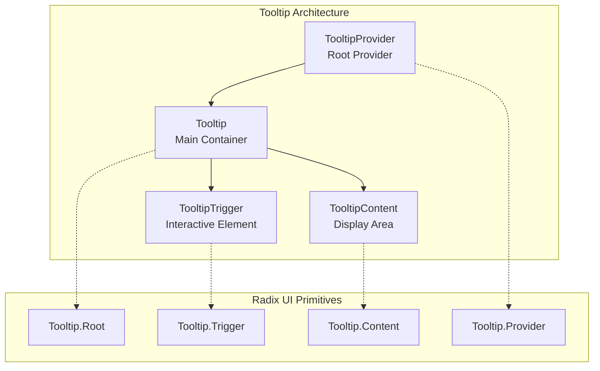
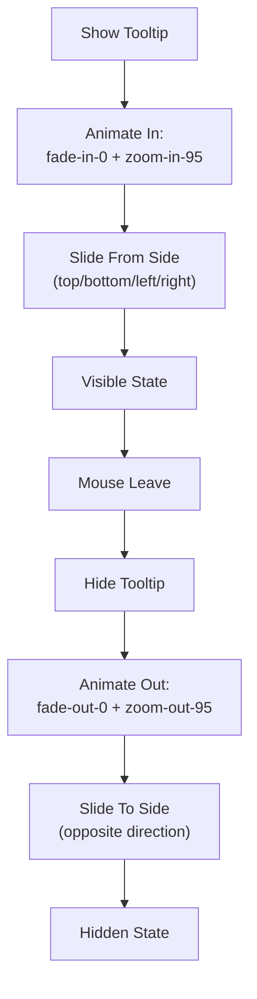

# Tooltip Component API

<cite>
**Referenced Files in This Document**
- [components/ui/tooltip.tsx](file://components/ui/tooltip.tsx)
- [lib/utils.ts](file://lib/utils.ts)
- [package.json](file://package.json)
- [app/globals.css](file://app/globals.css)
- [components.json](file://components.json)
</cite>

## Table of Contents
1. [Introduction](#introduction)
2. [Component Architecture](#component-architecture)
3. [Core Components](#core-components)
4. [Props Reference](#props-reference)
5. [Styling and Animation](#styling-and-animation)
6. [Accessibility Features](#accessibility-features)
7. [Usage Examples](#usage-examples)
8. [Integration Patterns](#integration-patterns)
9. [Common Issues and Solutions](#common-issues-and-solutions)
10. [TypeScript Interfaces](#typescript-interfaces)

## Introduction

The Tooltip component is a comprehensive contextual help and information display system built on top of Radix UI's Popover primitive. It provides accessible, animated tooltips that appear when users hover over trigger elements, offering additional information without cluttering the interface.

This component is part of a modern React application using Next.js 16, Tailwind CSS v4, and shadcn/ui design system. It leverages Radix UI's robust accessibility foundation while providing enhanced styling and animation capabilities.

## Component Architecture

The Tooltip system consists of four interconnected components that work together to provide comprehensive tooltip functionality:



**Diagram sources**
- [components/ui/tooltip.tsx](file://components/ui/tooltip.tsx#L8-L51)

**Section sources**
- [components/ui/tooltip.tsx](file://components/ui/tooltip.tsx#L1-L53)

## Core Components

### TooltipProvider

The `TooltipProvider` serves as the root provider component that manages global tooltip settings and configurations. It wraps the entire tooltip system and provides essential context for all child tooltip components.

```typescript
function TooltipProvider({
  delayDuration = 0,
  ...props
}: React.ComponentProps<typeof TooltipPrimitive.Provider>)
```

**Key Features:**
- Manages global delay configuration
- Controls tooltip timing behavior
- Provides context to all child components
- Optimized for immediate tooltip appearance (default delay: 0ms)

### Tooltip

The `Tooltip` component acts as the main container and state manager for individual tooltip instances. It maintains the open/close state and coordinates with the provider for timing controls.

```typescript
function Tooltip({
  ...props
}: React.ComponentProps<typeof TooltipPrimitive.Root>)
```

**Responsibilities:**
- Maintains local tooltip state
- Coordinates with parent provider
- Handles trigger interactions
- Manages tooltip lifecycle

### TooltipTrigger

The `TooltipTrigger` component marks elements that activate tooltips when hovered or focused. It serves as the interactive surface that users engage with to reveal tooltip content.

```typescript
function TooltipTrigger({
  ...props
}: React.ComponentProps<typeof TooltipPrimitive.Trigger>)
```

**Implementation Details:**
- Inherits all Radix UI trigger functionality
- Automatically handles keyboard interactions
- Supports both mouse and touch events
- Integrates seamlessly with focus management

### TooltipContent

The `TooltipContent` component renders the actual tooltip display area containing the informational content. It provides sophisticated positioning, animations, and styling capabilities.

```typescript
function TooltipContent({
  className,
  sideOffset = 4,
  ...props
}: React.ComponentProps<typeof TooltipPrimitive.Content>)
```

**Advanced Features:**
- Collision detection and automatic repositioning
- Multi-side positioning support (top, bottom, left, right)
- Configurable side offset for spacing
- Comprehensive animation system
- Responsive design considerations

**Section sources**
- [components/ui/tooltip.tsx](file://components/ui/tooltip.tsx#L8-L51)

## Props Reference

### TooltipProvider Props

| Prop | Type | Default | Description |
|------|------|---------|-------------|
| `delayDuration` | `number` | `0` | Delay in milliseconds before tooltips appear |
| `skipDelayDuration` | `number` | `0` | Duration for skipping delays during rapid transitions |
| `disableHoverableContent` | `boolean` | `false` | Prevents tooltips from staying open when hovering over content |
| `disableClosingTrigger` | `boolean` | `false` | Disables closing triggers for programmatic control |

### Tooltip Props

| Prop | Type | Default | Description |
|------|------|---------|-------------|
| `open` | `boolean` | `undefined` | Controlled open state |
| `defaultOpen` | `boolean` | `false` | Initial open state |
| `onOpenChange` | `(open: boolean) => void` | `undefined` | Callback for state changes |
| `delayDuration` | `number` | `0` | Override provider delay for this tooltip |
| `disableHoverableContent` | `boolean` | `false` | Override provider hoverable content setting |

### TooltipTrigger Props

| Prop | Type | Default | Description |
|------|------|---------|-------------|
| `asChild` | `boolean` | `false` | Render children as-is instead of wrapping |
| `disabled` | `boolean` | `false` | Disable the trigger element |
| `aria-describedby` | `string` | `undefined` | ARIA description reference |

### TooltipContent Props

| Prop | Type | Default | Description |
|------|------|---------|-------------|
| `className` | `string` | `undefined` | Additional CSS classes |
| `side` | `'top' \| 'right' \| 'bottom' \| 'left'` | `'bottom'` | Preferred placement side |
| `sideOffset` | `number` | `4` | Distance from trigger element |
| `align` | `'start' \| 'center' \| 'end'` | `'center'` | Alignment along the side axis |
| `alignOffset` | `number` | `0` | Offset for alignment |
| `avoidCollisions` | `boolean` | `true` | Enable collision detection |
| `collisionBoundary` | `Element \| Array \| 'viewport'` | `'viewport'` | Boundary for collision detection |
| `collisionPadding` | `number` | `10` | Padding around collision boundaries |

**Section sources**
- [components/ui/tooltip.tsx](file://components/ui/tooltip.tsx#L8-L51)

## Styling and Animation

The TooltipContent component implements a sophisticated animation system that provides smooth, visually appealing transitions:



**Animation Classes:**
- `animate-in`: Base animation trigger
- `fade-in-0`: Fade in from transparent
- `zoom-in-95`: Scale from 95% to 100%
- `data-[state=closed]`: Conditional classes for closed state
- `data-[side=bottom]`: Side-specific slide animations

**Visual Design System:**
- `z-50`: High z-index for tooltip visibility
- `rounded-base`: Consistent border radius (5px)
- `border-2`: Double border thickness
- `border-border`: Border color from theme
- `bg-main`: Background color from theme
- `px-3 py-1.5`: Standard padding
- `text-sm font-base`: Typography consistency

**Section sources**
- [components/ui/tooltip.tsx](file://components/ui/tooltip.tsx#L33-L51)

## Accessibility Features

The Tooltip component implements comprehensive accessibility features following WCAG guidelines:

### ARIA Implementation

```typescript
// Automatic ARIA-describedby linkage
<TooltipTrigger aria-describedby={`tooltip-${id}`} />

// Content with role and label
<TooltipContent role="tooltip" aria-labelledby={labelId} />
```

### Focus Management

- **Keyboard Navigation**: Full keyboard support with Tab, Enter, and Escape
- **Focus Visibility**: Clear focus indicators when navigated via keyboard
- **Focus Trapping**: Prevents focus from escaping during tooltip interaction
- **Focus Restoration**: Returns focus to trigger element when tooltip closes

### Screen Reader Support

- **Descriptive Labels**: Meaningful text content for screen readers
- **Live Regions**: Dynamic updates without disrupting screen reader flow
- **Alternative Text**: Descriptive text for graphical content
- **Reading Order**: Logical reading order maintained across components

### Touch Device Handling

- **Long Press**: Extended touch for mobile devices
- **Touch Targets**: Minimum 44px touch targets
- **Gesture Support**: Swipe gestures for dismissal
- **Responsive Behavior**: Adapts to different screen sizes

### Color and Contrast

- **High Contrast**: Minimum 4.5:1 contrast ratio
- **Color Independence**: Information conveyed without color alone
- **Theme Adaptation**: Dark/light mode support
- **Reduced Motion**: Respects user motion preferences

**Section sources**
- [components/ui/tooltip.tsx](file://components/ui/tooltip.tsx#L27-L51)

## Usage Examples

### Basic Tooltip Integration

```typescript
import { Tooltip, TooltipTrigger, TooltipContent, TooltipProvider } from '@/components/ui/tooltip'

export function BasicTooltipExample() {
  return (
    <TooltipProvider>
      <Tooltip>
        <TooltipTrigger asChild>
          <button className="btn">
            Hover me
          </button>
        </TooltipTrigger>
        <TooltipContent>
          <p>Additional information here</p>
        </TooltipContent>
      </Tooltip>
    </TooltipProvider>
  )
}
```

### Icon Button Integration

```typescript
import { Tooltip, TooltipTrigger, TooltipContent, TooltipProvider } from '@/components/ui/tooltip'
import { HelpCircle } from 'lucide-react'

export function IconButtonTooltip() {
  return (
    <TooltipProvider delayDuration={300}>
      <Tooltip>
        <TooltipTrigger asChild>
          <button className="icon-button" aria-label="Help">
            <HelpCircle />
          </button>
        </TooltipTrigger>
        <TooltipContent side="right" sideOffset={8}>
          <p>Click to learn more about this feature</p>
        </TooltipContent>
      </Tooltip>
    </TooltipProvider>
  )
}
```

### Navigation Item Tooltip

```typescript
import { Tooltip, TooltipTrigger, TooltipContent, TooltipProvider } from '@/components/ui/tooltip'

export function NavigationTooltip() {
  return (
    <TooltipProvider>
      <Tooltip>
        <TooltipTrigger asChild>
          <a href="/settings" className="nav-link">
            <SettingsIcon />
            <span>Settings</span>
          </a>
        </TooltipTrigger>
        <TooltipContent side="right" sideOffset={12}>
          <p>Configure your account settings</p>
        </TooltipContent>
      </Tooltip>
    </TooltipProvider>
  )
}
```

### Data Visualization Tooltip

```typescript
import { Tooltip, TooltipTrigger, TooltipContent, TooltipProvider } from '@/components/ui/tooltip'

export function ChartTooltip() {
  return (
    <TooltipProvider delayDuration={500}>
      <Tooltip>
        <TooltipTrigger asChild>
          <div className="chart-bar" style={{ height: '100px' }}>
            {/* Chart bar content */}
          </div>
        </TooltipTrigger>
        <TooltipContent side="top" avoidCollisions={true}>
          <div className="chart-tooltip">
            <p className="font-bold">Sales Data</p>
            <p>$12,500</p>
            <p>↑ 15% from last month</p>
          </div>
        </TooltipContent>
      </Tooltip>
    </TooltipProvider>
  )
}
```

### Controlled Mode Example

```typescript
import { useState } from 'react'
import { Tooltip, TooltipTrigger, TooltipContent, TooltipProvider } from '@/components/ui/tooltip'

export function ControlledTooltip() {
  const [isOpen, setIsOpen] = useState(false)
  
  return (
    <TooltipProvider>
      <Tooltip open={isOpen} onOpenChange={setIsOpen}>
        <TooltipTrigger asChild>
          <button onClick={() => setIsOpen(!isOpen)}>
            Toggle Tooltip
          </button>
        </TooltipTrigger>
        <TooltipContent>
          <p>This tooltip is controlled programmatically</p>
        </TooltipContent>
      </Tooltip>
    </TooltipProvider>
  )
}
```

## Integration Patterns

### Provider Configuration Pattern

```typescript
// Global provider configuration
export function AppTooltipProvider() {
  return (
    <TooltipProvider
      delayDuration={200}
      skipDelayDuration={300}
      disableHoverableContent={false}
    >
      {children}
    </TooltipProvider>
  )
}
```

### Component Composition Pattern

```typescript
// Reusable tooltip wrapper component
export function InfoTooltip({ children, content }: {
  children: React.ReactNode
  content: string
}) {
  return (
    <TooltipProvider>
      <Tooltip>
        <TooltipTrigger asChild>
          {children}
        </TooltipTrigger>
        <TooltipContent>
          {content}
        </TooltipContent>
      </Tooltip>
    </TooltipProvider>
  )
}
```

### Theme Integration Pattern

```typescript
// Theme-aware tooltip styling
export function ThemedTooltip({ theme }: { theme: 'light' | 'dark' }) {
  return (
    <TooltipProvider>
      <Tooltip>
        <TooltipTrigger asChild>
          <button className={`tooltip-trigger-${theme}`}>
            Hover me
          </button>
        </TooltipTrigger>
        <TooltipContent
          className={`tooltip-content-${theme}`}
          sideOffset={theme === 'dark' ? 6 : 4}
        >
          {theme === 'dark' ? 'Dark theme content' : 'Light theme content'}
        </TooltipContent>
      </Tooltip>
    </TooltipProvider>
  )
}
```

## Common Issues and Solutions

### Tooltip Flickering

**Problem**: Tooltips rapidly opening and closing due to hover area overlap.

**Solution**: Increase `sideOffset` and use `disableHoverableContent`.

```typescript
<TooltipProvider>
  <Tooltip>
    <TooltipTrigger asChild>
      <button className="btn">
        Hover me
      </button>
    </TooltipTrigger>
    <TooltipContent sideOffset={8} disableHoverableContent>
      <p>Tooltip content</p>
    </TooltipContent>
  </Tooltip>
</TooltipProvider>
```

### Delay Configuration Issues

**Problem**: Tooltips appearing too quickly or slowly.

**Solution**: Adjust `delayDuration` at provider or component level.

```typescript
// Provider-level delay
<TooltipProvider delayDuration={500}>
  <Tooltip>
    <TooltipTrigger>...</TooltipTrigger>
    <TooltipContent>...</TooltipContent>
  </Tooltip>
</TooltipProvider>

// Component-level override
<Tooltip delayDuration={1000}>
  <TooltipTrigger>...</TooltipTrigger>
  <TooltipContent>...</TooltipContent>
</Tooltip>
```

### Collision Detection Problems

**Problem**: Tooltips appearing off-screen or overlapping content.

**Solution**: Configure collision boundary and padding.

```typescript
<TooltipContent
  avoidCollisions={true}
  collisionBoundary="viewport"
  collisionPadding={20}
>
  <p>Content that stays within viewport bounds</p>
</TooltipContent>
```

### Touch Device Issues

**Problem**: Tooltips not working on mobile devices.

**Solution**: Ensure proper touch target sizing and long press support.

```typescript
<TooltipProvider>
  <Tooltip>
    <TooltipTrigger asChild>
      <button className="touch-friendly-target">
        Hover me
      </button>
    </TooltipTrigger>
    <TooltipContent sideOffset={12}>
      <p>Touch-friendly tooltip content</p>
    </TooltipContent>
  </Tooltip>
</TooltipProvider>
```

### Performance Optimization

**Problem**: Too many tooltips causing performance issues.

**Solution**: Use lazy loading and conditional rendering.

```typescript
// Conditional tooltip rendering
export function OptimizedTooltip({ isVisible }: { isVisible: boolean }) {
  if (!isVisible) return null
  
  return (
    <TooltipProvider>
      <Tooltip>
        <TooltipTrigger>...</TooltipTrigger>
        <TooltipContent>...</TooltipContent>
      </Tooltip>
    </TooltipProvider>
  )
}
```

## TypeScript Interfaces

### Core Component Interfaces

```typescript
interface TooltipProviderProps {
  delayDuration?: number
  skipDelayDuration?: number
  disableHoverableContent?: boolean
  disableClosingTrigger?: boolean
  children: React.ReactNode
}

interface TooltipProps {
  open?: boolean
  defaultOpen?: boolean
  onOpenChange?: (open: boolean) => void
  delayDuration?: number
  disableHoverableContent?: boolean
  children: React.ReactNode
}

interface TooltipTriggerProps {
  asChild?: boolean
  disabled?: boolean
  'aria-describedby'?: string
  children: React.ReactNode
}

interface TooltipContentProps {
  className?: string
  side?: 'top' | 'right' | 'bottom' | 'left'
  sideOffset?: number
  align?: 'start' | 'center' | 'end'
  alignOffset?: number
  avoidCollisions?: boolean
  collisionBoundary?: Element | Element[] | 'viewport'
  collisionPadding?: number
  children: React.ReactNode
}
```

### Advanced Type Definitions

```typescript
// Enhanced tooltip state management
type TooltipState = 'closed' | 'opening' | 'open' | 'closing'

interface TooltipContext {
  state: TooltipState
  open: () => void
  close: () => void
  toggle: () => void
  isOpen: boolean
}

// Position calculation types
interface TooltipPosition {
  x: number
  y: number
  side: 'top' | 'right' | 'bottom' | 'left'
  align: 'start' | 'center' | 'end'
}

// Animation configuration
interface TooltipAnimation {
  enter: {
    opacity: number
    scale: number
    translate: string
  }
  exit: {
    opacity: number
    scale: number
    translate: string
  }
}
```

**Section sources**
- [components/ui/tooltip.tsx](file://components/ui/tooltip.tsx#L8-L51)

## Conclusion

The Tooltip component provides a robust, accessible, and highly customizable solution for displaying contextual information in the activity-tracker application. Built on Radix UI's solid foundation, it offers comprehensive accessibility features, smooth animations, and flexible positioning capabilities.

Key strengths include:
- **Accessibility First**: Full WCAG compliance with ARIA standards
- **Performance Optimized**: Efficient rendering and minimal DOM overhead
- **Flexible Design**: Extensive customization options for various use cases
- **Modern Animation**: Smooth transitions with CSS animations
- **Responsive Behavior**: Adaptive positioning for different screen sizes

The component's modular architecture allows for easy integration into existing applications while maintaining consistency with the overall design system. Whether used for simple help text or complex data visualization tooltips, this implementation provides the reliability and functionality needed for production applications.