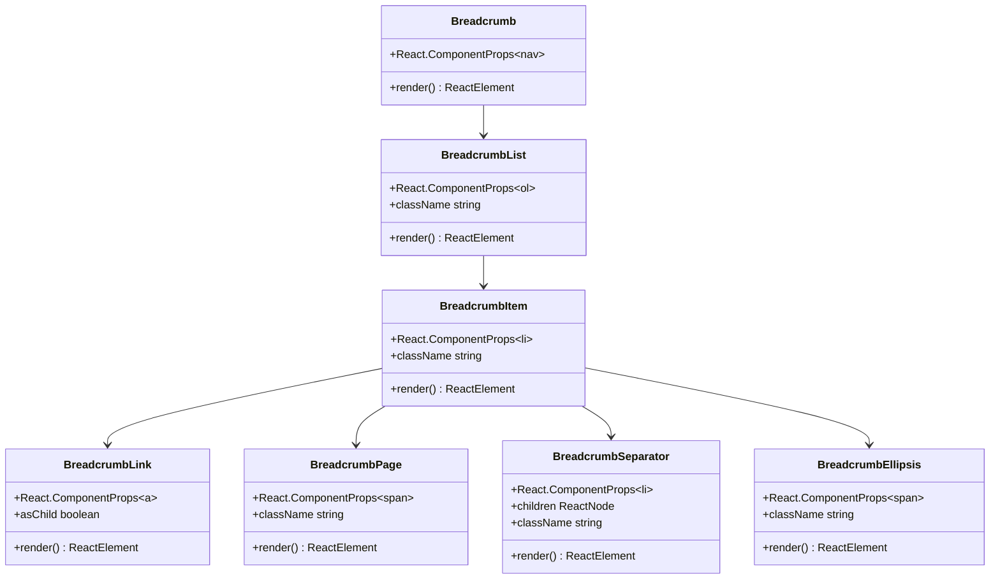
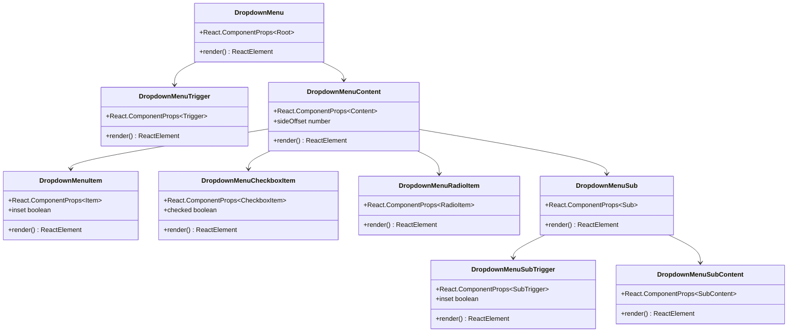
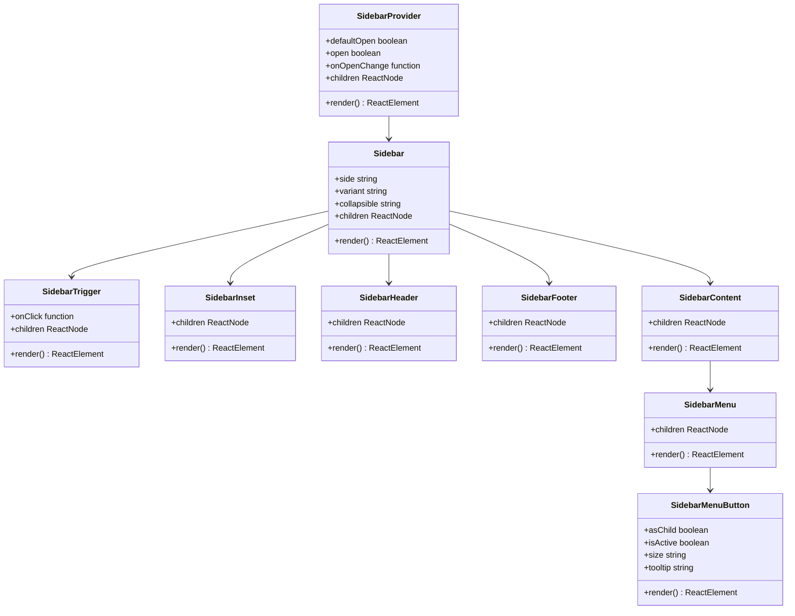
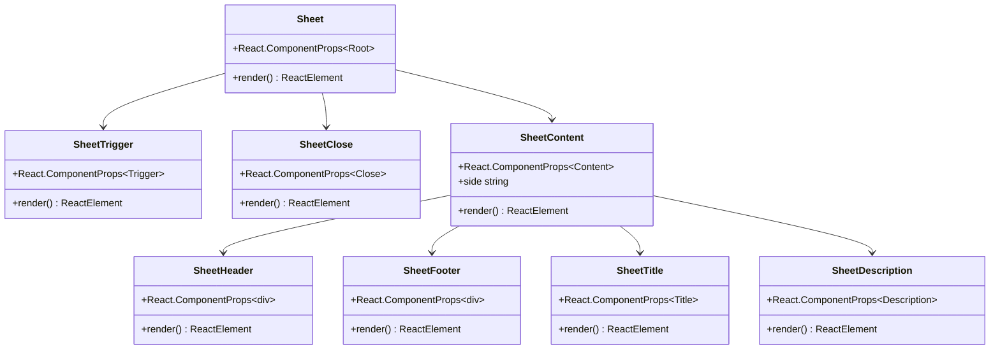

# UI Components API Documentation

<cite>
**Referenced Files in This Document**
- [lib/utils.ts](file://lib/utils.ts)
- [components/ui/button.tsx](file://components/ui/button.tsx)
- [components/ui/input.tsx](file://components/ui/input.tsx)
- [components/ui/breadcrumb.tsx](file://components/ui/breadcrumb.tsx)
- [components/ui/dropdown-menu.tsx](file://components/ui/dropdown-menu.tsx)
- [components/ui/sidebar.tsx](file://components/ui/sidebar.tsx)
- [components/ui/sheet.tsx](file://components/ui/sheet.tsx)
- [components/ui/avatar.tsx](file://components/ui/avatar.tsx)
- [components/ui/collapsible.tsx](file://components/ui/collapsible.tsx)
- [components/ui/skeleton.tsx](file://components/ui/skeleton.tsx)
- [components/ui/tooltip.tsx](file://components/ui/tooltip.tsx)
- [hooks/use-mobile.ts](file://hooks/use-mobile.ts)
- [app/globals.css](file://app/globals.css)
</cite>

## Table of Contents
1. [Introduction](#introduction)
2. [Core Utility Functions](#core-utility-functions)
3. [Button Component](#button-component)
4. [Input Component](#input-component)
5. [Breadcrumb Component](#breadcrumb-component)
6. [Dropdown Menu Component](#dropdown-menu-component)
7. [Sidebar Component](#sidebar-component)
8. [Sheet Component](#sheet-component)
9. [Avatar Component](#avatar-component)
10. [Collapsible Component](#collapsible-component)
11. [Skeleton Component](#skeleton-component)
12. [Tooltip Component](#tooltip-component)
13. [TypeScript Interfaces](#typescript-interfaces)
14. [Accessibility Features](#accessibility-features)
15. [Responsive Behaviors](#responsive-behaviors)
16. [Usage Patterns](#usage-patterns)

## Introduction

The activity-tracker application provides a comprehensive set of UI components built on top of Radix UI primitives and styled with Tailwind CSS. These components are designed with accessibility, responsiveness, and composability in mind, offering a consistent design system across the application.

Each component follows a consistent pattern of using the `cn` utility function for class merging, leveraging Radix UI's accessibility features, and providing extensive customization through props and variants. The components are fully typed with TypeScript and support both controlled and uncontrolled states where applicable.

## Core Utility Functions

### cn Utility Function

The `cn` function serves as the primary utility for merging Tailwind CSS classes with conditional logic and class name transformations.

```typescript
export function cn(...inputs: ClassValue[]) {
  return twMerge(clsx(inputs))
}
```

**Features:**
- **clsx**: Handles conditional class logic and array flattening
- **twMerge**: Resolves Tailwind CSS conflicts intelligently
- **Type Safety**: Fully typed with ClassValue[] parameter
- **Performance**: Optimized for runtime class name generation

**Usage Example:**
```typescript
// Basic usage
className={cn("text-primary", "font-bold", condition && "hidden")}

// With component-specific variants
className={cn(
  "flex items-center gap-2",
  variant === "destructive" && "text-red-500",
  className
)}
```

**Section sources**
- [lib/utils.ts](file://lib/utils.ts#L1-L7)

## Button Component

The Button component provides a versatile button element with multiple variants, sizes, and styling options built on Radix UI's Slot primitive.

### Props Interface

```typescript
interface ButtonProps extends React.ComponentProps<"button"> {
  variant?: "default" | "noShadow" | "neutral" | "reverse"
  size?: "default" | "sm" | "lg" | "icon"
  asChild?: boolean
}
```

### Variants and Sizes

**Variants:**
- `default`: Primary button with shadow effect
- `noShadow`: Button without shadow effects
- `neutral`: Neutral gray button
- `reverse`: Button with reversed shadow direction

**Sizes:**
- `default`: Standard button height (h-10)
- `sm`: Small button height (h-9)
- `lg`: Large button height (h-11)
- `icon`: Icon-only button (size-10)

### Implementation Details

```typescript
function Button({
  className,
  variant,
  size,
  asChild = false,
  ...props
}: ButtonProps) {
  const Comp = asChild ? Slot : "button"
  
  return (
    <Comp
      data-slot="button"
      className={cn(buttonVariants({ variant, size, className }))}
      {...props}
    />
  )
}
```

### Usage Examples

**Basic Button:**
```tsx
<Button>Click Me</Button>
```

**With Variant:**
```tsx
<Button variant="neutral">Neutral Button</Button>
```

**Icon Button with Lucide:**
```tsx
<Button size="icon" asChild>
  <a href="/dashboard">
    <HomeIcon />
  </a>
</Button>
```

**Section sources**
- [components/ui/button.tsx](file://components/ui/button.tsx#L1-L57)

## Input Component

The Input component provides a styled input field with consistent appearance and accessibility features.

### Props Interface

```typescript
interface InputProps extends React.ComponentProps<"input"> {
  // Inherits all HTML input attributes
}
```

### Design Features

- **Focus States**: Proper focus ring with color contrast
- **Disabled States**: Visual indication of disabled state
- **Selection Styling**: Custom selection colors
- **Placeholder Styling**: Subtle placeholder text
- **File Input Support**: Special handling for file inputs

### Implementation Details

```typescript
function Input({ className, type, ...props }: InputProps) {
  return (
    <input
      type={type}
      data-slot="input"
      className={cn(
        "flex h-10 w-full rounded-base border-2 border-border bg-secondary-background selection:bg-main selection:text-main-foreground px-3 py-2 text-sm font-base text-foreground file:border-0 file:bg-transparent file:text-sm file:font-heading placeholder:text-foreground/50 focus-visible:outline-hidden focus-visible:ring-2 focus-visible:ring-black focus-visible:ring-offset-2 disabled:cursor-not-allowed disabled:opacity-50",
        className,
      )}
      {...props}
    />
  )
}
```

### Usage Examples

**Basic Input:**
```tsx
<Input type="email" placeholder="Enter your email" />
```

**Password Input:**
```tsx
<Input type="password" placeholder="Enter password" />
```

**File Input:**
```tsx
<Input type="file" accept="image/*" />
```

**Section sources**
- [components/ui/input.tsx](file://components/ui/input.tsx#L1-L20)

## Breadcrumb Component

The Breadcrumb component provides navigation breadcrumbs with customizable separators and accessibility features.

### Component Structure

The Breadcrumb system consists of multiple interconnected components:



**Diagram sources**
- [components/ui/breadcrumb.tsx](file://components/ui/breadcrumb.tsx#L1-L107)

### Props Interfaces

```typescript
// Individual components inherit from their respective HTML elements
interface BreadcrumbProps extends React.ComponentProps<"nav"> {}
interface BreadcrumbListProps extends React.ComponentProps<"ol"> {}
interface BreadcrumbItemProps extends React.ComponentProps<"li"> {}
interface BreadcrumbLinkProps extends React.ComponentProps<"a"> {
  asChild?: boolean
}
interface BreadcrumbPageProps extends React.ComponentProps<"span"> {}
interface BreadcrumbSeparatorProps extends React.ComponentProps<"li"> {
  children?: React.ReactNode
}
interface BreadcrumbEllipsisProps extends React.ComponentProps<"span"> {}
```

### Separator Customization

The BreadcrumbSeparator component allows customizing the separator character:

```typescript
function BreadcrumbSeparator({
  children,
  className,
  ...props
}: BreadcrumbSeparatorProps) {
  return (
    <li
      data-slot="breadcrumb-separator"
      role="presentation"
      aria-hidden="true"
      className={cn("[&>svg]:size-3.5", className)}
      {...props}
    >
      {children ?? <ChevronRight />}
    </li>
  )
}
```

### Usage Examples

**Basic Breadcrumb:**
```tsx
<Breadcrumb>
  <BreadcrumbList>
    <BreadcrumbItem>
      <BreadcrumbLink href="/">Home</BreadcrumbLink>
    </BreadcrumbItem>
    <BreadcrumbSeparator />
    <BreadcrumbItem>
      <BreadcrumbLink href="/dashboard">Dashboard</BreadcrumbLink>
    </BreadcrumbItem>
    <BreadcrumbSeparator />
    <BreadcrumbItem>
      <BreadcrumbPage>Activity Tracker</BreadcrumbPage>
    </BreadcrumbItem>
  </BreadcrumbList>
</Breadcrumb>
```

**Custom Separator:**
```tsx
<BreadcrumbSeparator>
  <SlashIcon className="size-4" />
</BreadcrumbSeparator>
```

**Section sources**
- [components/ui/breadcrumb.tsx](file://components/ui/breadcrumb.tsx#L1-L107)

## Dropdown Menu Component

The Dropdown Menu component provides a comprehensive menu system built on Radix UI's dropdown primitives with extensive customization options.

### Component Architecture



**Diagram sources**
- [components/ui/dropdown-menu.tsx](file://components/ui/dropdown-menu.tsx#L1-L240)

### Props Interfaces

```typescript
// Core components
interface DropdownMenuProps extends React.ComponentProps<typeof DropdownMenuPrimitive.Root> {}
interface DropdownMenuTriggerProps extends React.ComponentProps<typeof DropdownMenuPrimitive.Trigger> {}
interface DropdownMenuContentProps extends React.ComponentProps<typeof DropdownMenuPrimitive.Content> {
  sideOffset?: number
}

// Item components
interface DropdownMenuItemProps extends React.ComponentProps<typeof DropdownMenuPrimitive.Item> {
  inset?: boolean
}
interface DropdownMenuCheckboxItemProps extends React.ComponentProps<typeof DropdownMenuPrimitive.CheckboxItem> {
  checked?: boolean
}
interface DropdownMenuRadioItemProps extends React.ComponentProps<typeof DropdownMenuPrimitive.RadioItem> {}

// Submenu components
interface DropdownMenuSubTriggerProps extends React.ComponentProps<typeof DropdownMenuPrimitive.SubTrigger> {
  inset?: boolean
}
interface DropdownMenuSubContentProps extends React.ComponentProps<typeof DropdownMenuPrimitive.SubContent> {}
```

### Animation and Transitions

The dropdown menu implements sophisticated animations using Radix UI's animation system:

```typescript
className={cn(
  "z-50 min-w-[8rem] overflow-hidden rounded-base border-2 border-border bg-main p-1 font-base text-main-foreground data-[state=open]:animate-in data-[state=closed]:animate-out data-[state=closed]:fade-out-0 data-[state=open]:fade-in-0 data-[state=closed]:zoom-out-95 data-[state=open]:zoom-in-95 data-[side=bottom]:slide-in-from-top-2 data-[side=left]:slide-in-from-right-2 data-[side=right]:slide-in-from-left-2 data-[side=top]:slide-in-from-bottom-2 origin-(--radix-dropdown-menu-content-transform-origin)",
  className,
)}
```

### Usage Examples

**Basic Dropdown Menu:**
```tsx
<DropdownMenu>
  <DropdownMenuTrigger asChild>
    <Button variant="outline">Open Menu</Button>
  </DropdownMenuTrigger>
  <DropdownMenuContent>
    <DropdownMenuItem>Profile</DropdownMenuItem>
    <DropdownMenuItem>Billing</DropdownMenuItem>
    <DropdownMenuItem>Team</DropdownMenuItem>
    <DropdownMenuItem>Subscription</DropdownMenuItem>
  </DropdownMenuContent>
</DropdownMenu>
```

**Checkbox Menu Item:**
```tsx
<DropdownMenuCheckboxItem
  checked={isChecked}
  onCheckedChange={setChecked}
>
  <DropdownMenuShortcut>⌘T</DropdownMenuShortcut>
</DropdownMenuCheckboxItem>
```

**Section sources**
- [components/ui/dropdown-menu.tsx](file://components/ui/dropdown-menu.tsx#L1-L240)

## Sidebar Component

The Sidebar component provides a comprehensive navigation sidebar with multiple variants, collapsible behavior, and responsive design.

### Component Architecture



**Diagram sources**
- [components/ui/sidebar.tsx](file://components/ui/sidebar.tsx#L1-L716)

### Props Interfaces

```typescript
// SidebarProvider
interface SidebarProviderProps extends React.ComponentProps<"div"> {
  defaultOpen?: boolean
  open?: boolean
  onOpenChange?: (open: boolean) => void
}

// Sidebar
interface SidebarProps extends React.ComponentProps<"div"> {
  side?: "left" | "right"
  variant?: "sidebar" | "floating" | "inset"
  collapsible?: "offcanvas" | "icon" | "none"
}

// SidebarMenuButton
interface SidebarMenuButtonProps extends React.ComponentProps<"button"> {
  asChild?: boolean
  isActive?: boolean
  size?: "default" | "sm" | "lg"
  tooltip?: string | React.ComponentProps<typeof TooltipContent>
}
```

### Collapsible Behavior

The Sidebar supports three collapsible modes:

1. **Offcanvas**: Full-width sidebar that slides out
2. **Icon**: Compact icon-only mode
3. **None**: Fixed sidebar without collapse functionality

### Responsive Design

The Sidebar automatically adapts to mobile devices using the `useIsMobile` hook:

```typescript
const isMobile = useIsMobile()

if (isMobile) {
  return (
    <Sheet open={openMobile} onOpenChange={setOpenMobile}>
      <SheetContent side={side}>
        <div className="flex h-full w-full flex-col">{children}</div>
      </SheetContent>
    </Sheet>
  )
}
```

### Usage Examples

**Basic Sidebar Setup:**
```tsx
<SidebarProvider>
  <Sidebar>
    <SidebarHeader>
      <SidebarMenuButton>
        <HomeIcon />
        <span>App Name</span>
      </SidebarMenuButton>
    </SidebarHeader>
    <SidebarContent>
      <SidebarMenu>
        <SidebarMenuItem>
          <SidebarMenuButton asChild>
            <a href="/dashboard">
              <DashboardIcon />
              <span>Dashboard</span>
            </a>
          </SidebarMenuButton>
        </SidebarMenuItem>
      </SidebarMenu>
    </SidebarContent>
  </Sidebar>
  <SidebarInset>
    <main>Your main content here</main>
  </SidebarInset>
</SidebarProvider>
```

**Collapsible Sidebar:**
```tsx
<Sidebar collapsible="icon">
  <SidebarTrigger />
  <SidebarContent>
    {/* Menu items */}
  </SidebarContent>
</Sidebar>
```

**Section sources**
- [components/ui/sidebar.tsx](file://components/ui/sidebar.tsx#L1-L716)

## Sheet Component

The Sheet component provides a modal overlay system for displaying content in a sliding panel, built on Radix UI's dialog primitives.

### Component Architecture



**Diagram sources**
- [components/ui/sheet.tsx](file://components/ui/sheet.tsx#L1-L143)

### Props Interfaces

```typescript
// Core components
interface SheetProps extends React.ComponentProps<typeof SheetPrimitive.Root> {}
interface SheetTriggerProps extends React.ComponentProps<typeof SheetPrimitive.Trigger> {}
interface SheetCloseProps extends React.ComponentProps<typeof SheetPrimitive.Close> {}

// Content components
interface SheetContentProps extends React.ComponentProps<typeof SheetPrimitive.Content> {
  side?: "top" | "bottom" | "left" | "right"
}

// Header/Footer components
interface SheetHeaderProps extends React.ComponentProps<"div"> {}
interface SheetFooterProps extends React.ComponentProps<"div"> {}

// Title/Description components
interface SheetTitleProps extends React.ComponentProps<typeof SheetPrimitive.Title> {}
interface SheetDescriptionProps extends React.ComponentProps<typeof SheetPrimitive.Description> {}
```

### Side-Specific Animations

The Sheet component provides different slide animations based on the side prop:

```typescript
className={cn(
  "bg-background data-[state=open]:animate-in data-[state=closed]:animate-out data-[state=closed]:fade-out-0 data-[state=open]:fade-in-0",
  side === "right" &&
    "data-[state=closed]:slide-out-to-right data-[state=open]:slide-in-from-right inset-y-0 right-0 h-full w-3/4 border-l sm:max-w-sm",
  side === "left" &&
    "data-[state=closed]:slide-out-to-left data-[state=open]:slide-in-from-left inset-y-0 left-0 h-full w-3/4 border-r sm:max-w-sm",
  side === "top" &&
    "data-[state=closed]:slide-out-to-top data-[state=open]:slide-in-from-top inset-x-0 top-0 h-auto border-b",
  side === "bottom" &&
    "data-[state=closed]:slide-out-to-bottom data-[state=open]:slide-in-from-bottom inset-x-0 bottom-0 h-auto border-t",
  className,
)}
```

### Usage Examples

**Basic Sheet:**
```tsx
<Sheet>
  <SheetTrigger asChild>
    <Button>Open Sheet</Button>
  </SheetTrigger>
  <SheetContent>
    <SheetHeader>
      <SheetTitle>Edit Profile</SheetTitle>
      <SheetDescription>
        Make changes to your profile here. Click save when you're done.
      </SheetDescription>
    </SheetHeader>
    <div className="py-4">
      {/* Form content */}
    </div>
    <SheetFooter>
      <Button type="submit">Save changes</Button>
    </SheetFooter>
  </SheetContent>
</Sheet>
```

**Left-Side Sheet:**
```tsx
<Sheet>
  <SheetTrigger>Open Left Sheet</SheetTrigger>
  <SheetContent side="left">
    <nav>
      {/* Navigation links */}
    </nav>
  </SheetContent>
</Sheet>
```

**Section sources**
- [components/ui/sheet.tsx](file://components/ui/sheet.tsx#L1-L143)

## Avatar Component

The Avatar component provides a circular image display with fallback text, built on Radix UI's avatar primitives.

### Props Interfaces

```typescript
interface AvatarProps extends React.ComponentProps<typeof AvatarPrimitive.Root> {}
interface AvatarImageProps extends React.ComponentProps<typeof AvatarPrimitive.Image> {}
interface AvatarFallbackProps extends React.ComponentProps<typeof AvatarPrimitive.Fallback> {}
```

### Implementation Details

```typescript
function Avatar({ className, ...props }: AvatarProps) {
  return (
    <AvatarPrimitive.Root
      data-slot="avatar"
      className={cn(
        "relative flex size-10 shrink-0 overflow-hidden rounded-full outline-2 outline-border",
        className,
      )}
      {...props}
    />
  )
}

function AvatarImage({ className, ...props }: AvatarImageProps) {
  return (
    <AvatarPrimitive.Image
      data-slot="avatar-image"
      className={cn("aspect-square size-full", className)}
      {...props}
    />
  )
}

function AvatarFallback({ className, ...props }: AvatarFallbackProps) {
  return (
    <AvatarPrimitive.Fallback
      data-slot="avatar-fallback"
      className={cn(
        "flex size-full items-center justify-center rounded-full bg-secondary-background text-foreground font-base",
        className,
      )}
      {...props}
    />
  )
}
```

### Usage Examples

**Basic Avatar:**
```tsx
<Avatar>
  <AvatarImage src="https://github.com/shadcn.png" alt="@shadcn" />
  <AvatarFallback>CN</AvatarFallback>
</Avatar>
```

**Size Variations:**
```tsx
// Larger avatar
<Avatar className="size-16">
  <AvatarImage src="/profile.jpg" />
</Avatar>

// Smaller avatar
<Avatar className="size-8">
  <AvatarImage src="/small-profile.jpg" />
</Avatar>
```

**Section sources**
- [components/ui/avatar.tsx](file://components/ui/avatar.tsx#L1-L55)

## Collapsible Component

The Collapsible component provides expandable/collapsible content areas with smooth transitions.

### Props Interfaces

```typescript
interface CollapsibleProps extends React.ComponentProps<typeof CollapsiblePrimitive.Root> {}
interface CollapsibleTriggerProps extends React.ComponentProps<typeof CollapsiblePrimitive.CollapsibleTrigger> {}
interface CollapsibleContentProps extends React.ComponentProps<typeof CollapsiblePrimitive.CollapsibleContent> {}
```

### Implementation Details

```typescript
function Collapsible({ ...props }: CollapsibleProps) {
  return <CollapsiblePrimitive.Root data-slot="collapsible" {...props} />
}

function CollapsibleTrigger({ ...props }: CollapsibleTriggerProps) {
  return (
    <CollapsiblePrimitive.CollapsibleTrigger
      data-slot="collapsible-trigger"
      {...props}
    />
  )
}

function CollapsibleContent({ ...props }: CollapsibleContentProps) {
  return (
    <CollapsiblePrimitive.CollapsibleContent
      data-slot="collapsible-content"
      {...props}
    />
  )
}
```

### Usage Examples

**Basic Collapsible:**
```tsx
<Collapsible>
  <CollapsibleTrigger>Toggle</CollapsibleTrigger>
  <CollapsibleContent>
    <div className="p-4 bg-gray-100 rounded">
      Collapsible content goes here...
    </div>
  </CollapsibleContent>
</Collapsible>
```

**With Custom Trigger:**
```tsx
<Collapsible>
  <CollapsibleTrigger asChild>
    <Button variant="ghost">
      <ChevronDownIcon />
      Expand/Collapse
    </Button>
  </CollapsibleTrigger>
  <CollapsibleContent>
    {/* Content */}
  </CollapsibleContent>
</Collapsible>
```

**Section sources**
- [components/ui/collapsible.tsx](file://components/ui/collapsible.tsx#L1-L36)

## Skeleton Component

The Skeleton component provides loading state placeholders with animated pulse effects.

### Props Interface

```typescript
interface SkeletonProps extends React.ComponentProps<"div"> {}
```

### Implementation Details

```typescript
function Skeleton({ className, ...props }: SkeletonProps) {
  return (
    <div
      data-slot="skeleton"
      className={cn(
        "animate-pulse rounded-base bg-secondary-background border-2 border-border",
        className,
      )}
      {...props}
    />
  )
}
```

### Usage Examples

**Basic Skeleton:**
```tsx
<Skeleton className="w-full h-10" />
```

**Card Skeleton:**
```tsx
<div className="space-y-4">
  <Skeleton className="h-4 w-3/4" />
  <Skeleton className="h-4 w-1/2" />
  <Skeleton className="h-4 w-5/6" />
</div>
```

**Avatar Skeleton:**
```tsx
<Skeleton className="size-10 rounded-full" />
```

**Section sources**
- [components/ui/skeleton.tsx](file://components/ui/skeleton.tsx#L1-L17)

## Tooltip Component

The Tooltip component provides contextual information on hover or focus, built on Radix UI's tooltip primitives.

### Props Interfaces

```typescript
interface TooltipProviderProps extends React.ComponentProps<typeof TooltipPrimitive.Provider> {
  delayDuration?: number
}

interface TooltipProps extends React.ComponentProps<typeof TooltipPrimitive.Root> {}
interface TooltipTriggerProps extends React.ComponentProps<typeof TooltipPrimitive.Trigger> {}
interface TooltipContentProps extends React.ComponentProps<typeof TooltipPrimitive.Content> {
  sideOffset?: number
}
```

### Provider Configuration

```typescript
function TooltipProvider({
  delayDuration = 0,
  ...props
}: TooltipProviderProps) {
  return (
    <TooltipPrimitive.Provider
      data-slot="tooltip-provider"
      delayDuration={delayDuration}
      {...props}
    />
  )
}
```

### Animation System

Tooltips use Radix UI's animation system with smooth transitions:

```typescript
className={cn(
  "z-50 overflow-hidden rounded-base border-2 border-border bg-main px-3 py-1.5 text-sm font-base text-main-foreground animate-in fade-in-0 zoom-in-95 data-[state=closed]:animate-out data-[state=closed]:fade-out-0 data-[state=closed]:zoom-out-95 data-[side=bottom]:slide-in-from-top-2 data-[side=left]:slide-in-from-right-2 data-[side=right]:slide-in-from-left-2 data-[side=top]:slide-in-from-bottom-2 origin-(--radix-tooltip-content-transform-origin)",
  className,
)}
```

### Usage Examples

**Basic Tooltip:**
```tsx
<TooltipProvider>
  <Tooltip>
    <TooltipTrigger asChild>
      <Button variant="outline">Hover me</Button>
    </TooltipTrigger>
    <TooltipContent>
      <p>This is a tooltip</p>
    </TooltipContent>
  </Tooltip>
</TooltipProvider>
```

**Custom Delay:**
```tsx
<TooltipProvider delayDuration={500}>
  <Tooltip>
    <TooltipTrigger>Longer delay tooltip</TooltipTrigger>
    <TooltipContent>
      <p>This tooltip appears after 500ms</p>
    </TooltipContent>
  </Tooltip>
</TooltipProvider>
```

**Section sources**
- [components/ui/tooltip.tsx](file://components/ui/tooltip.tsx#L1-L53)

## TypeScript Interfaces

### Common Component Props

All components follow a consistent pattern for extending native HTML element props:

```typescript
// Base interface for all components
interface BaseComponentProps<T extends keyof JSX.IntrinsicElements> 
  extends React.ComponentProps<T> {
  className?: string
}

// Component-specific interfaces
interface ButtonProps extends BaseComponentProps<"button"> {
  variant?: "default" | "noShadow" | "neutral" | "reverse"
  size?: "default" | "sm" | "lg" | "icon"
  asChild?: boolean
}

interface InputProps extends BaseComponentProps<"input"> {
  type?: string
}

interface SidebarProps extends BaseComponentProps<"div"> {
  side?: "left" | "right"
  variant?: "sidebar" | "floating" | "inset"
  collapsible?: "offcanvas" | "icon" | "none"
}
```

### Utility Types

```typescript
// Type for cn function inputs
type ClassValue = string | null | undefined | boolean | ClassValue[]

// Variant types for components
type ButtonVariant = "default" | "noShadow" | "neutral" | "reverse"
type ButtonSize = "default" | "sm" | "lg" | "icon"
type InputType = "text" | "email" | "password" | "number" | "file" | string
```

## Accessibility Features

### Radix UI Integration

All components leverage Radix UI primitives for built-in accessibility:

- **Keyboard Navigation**: Full keyboard support for all interactive elements
- **Screen Reader Support**: Proper ARIA labels and roles
- **Focus Management**: Automatic focus trapping and restoration
- **High Contrast**: Color contrast compliance with WCAG guidelines

### Semantic HTML

Components use appropriate HTML elements:

```typescript
// Breadcrumb uses semantic nav and ol elements
<Breadcrumb>
  <BreadcrumbList>
    <BreadcrumbItem>
      <BreadcrumbLink href="/">Home</BreadcrumbLink>
    </BreadcrumbItem>
  </BreadcrumbList>
</Breadcrumb>

// Avatar uses semantic div structure
<Avatar>
  <AvatarImage src="profile.jpg" alt="User profile" />
  <AvatarFallback>User</AvatarFallback>
</Avatar>
```

### Focus Management

Components implement proper focus handling:

```typescript
// Button with focus-visible styles
className={cn(
  "inline-flex items-center justify-center whitespace-nowrap rounded-base text-sm font-base ring-offset-white transition-all gap-2 [&_svg]:pointer-events-none [&_svg]:size-4 [&_svg]:shrink-0 focus-visible:outline-hidden focus-visible:ring-2 focus-visible:ring-black focus-visible:ring-offset-2 disabled:pointer-events-none disabled:opacity-50",
  className,
)}
```

## Responsive Behaviors

### Mobile Detection Hook

The `useIsMobile` hook provides responsive behavior detection:

```typescript
const MOBILE_BREAKPOINT = 768

export function useIsMobile() {
  const [isMobile, setIsMobile] = React.useState<boolean | undefined>(undefined)

  React.useEffect(() => {
    const mql = window.matchMedia(`(max-width: ${MOBILE_BREAKPOINT - 1}px)`)
    const onChange = () => {
      setIsMobile(window.innerWidth < MOBILE_BREAKPOINT)
    }
    mql.addEventListener("change", onChange)
    setIsMobile(window.innerWidth < MOBILE_BREAKPOINT)
    return () => mql.removeEventListener("change", onChange)
  }, [])

  return !!isMobile
}
```

### Responsive Adaptations

**Sidebar Responsiveness:**
```typescript
const isMobile = useIsMobile()

if (isMobile) {
  return (
    <Sheet open={openMobile} onOpenChange={setOpenMobile}>
      <SheetContent side={side}>
        <div className="flex h-full w-full flex-col">{children}</div>
      </SheetContent>
    </Sheet>
  )
}
```

**Sheet Responsiveness:**
```typescript
className={cn(
  "bg-background data-[state=open]:animate-in data-[state=closed]:animate-out data-[state=closed]:fade-out-0 data-[state=open]:fade-in-0",
  side === "right" &&
    "data-[state=closed]:slide-out-to-right data-[state=open]:slide-in-from-right inset-y-0 right-0 h-full w-3/4 border-l sm:max-w-sm",
  side === "left" &&
    "data-[state=closed]:slide-out-to-left data-[state=open]:slide-in-from-left inset-y-0 left-0 h-full w-3/4 border-r sm:max-w-sm",
  side === "top" &&
    "data-[state=closed]:slide-out-to-top data-[state=open]:slide-in-from-top inset-x-0 top-0 h-auto border-b",
  side === "bottom" &&
    "data-[state=closed]:slide-out-to-bottom data-[state=open]:slide-in-from-bottom inset-x-0 bottom-0 h-auto border-t",
  className,
)}
```

**Section sources**
- [hooks/use-mobile.ts](file://hooks/use-mobile.ts#L1-L20)

## Usage Patterns

### Composing Components

**Button with Lucide Icons:**
```tsx
<Button size="icon" asChild>
  <a href="/dashboard">
    <HomeIcon />
  </a>
</Button>
```

**Sidebar Composition:**
```tsx
<SidebarProvider>
  <Sidebar>
    <SidebarHeader>
      <SidebarMenuButton>
        <HomeIcon />
        <span>App Name</span>
      </SidebarMenuButton>
    </SidebarHeader>
    <SidebarContent>
      <SidebarMenu>
        <SidebarMenuItem>
          <SidebarMenuButton asChild>
            <a href="/dashboard">
              <DashboardIcon />
              <span>Dashboard</span>
            </a>
          </SidebarMenuButton>
        </SidebarMenuItem>
      </SidebarMenu>
    </SidebarContent>
  </Sidebar>
  <SidebarInset>
    <main>Your main content here</main>
  </SidebarInset>
</SidebarProvider>
```

**Form Integration:**
```tsx
<form onSubmit={handleSubmit}>
  <div className="space-y-4">
    <Input
      type="email"
      placeholder="Enter your email"
      required
    />
    <Button type="submit" className="w-full">
      Submit
    </Button>
  </div>
</form>
```

### Event Handling Patterns

**Controlled Inputs:**
```tsx
const [value, setValue] = React.useState("")

return (
  <Input
    value={value}
    onChange={(e) => setValue(e.target.value)}
    placeholder="Search..."
  />
)
```

**Custom Event Handlers:**
```tsx
<Button
  onClick={(e) => {
    e.preventDefault()
    console.log("Button clicked")
    // Custom logic
  }}
>
  Custom Action
</Button>
```

### State Management

**Uncontrolled State:**
```tsx
<Collapsible>
  <CollapsibleTrigger>Toggle Content</CollapsibleTrigger>
  <CollapsibleContent>
    {/* Uncontrolled content */}
  </CollapsibleContent>
</Collapsible>
```

**Controlled State:**
```tsx
const [isOpen, setIsOpen] = React.useState(false)

return (
  <Sheet open={isOpen} onOpenChange={setIsOpen}>
    <SheetTrigger>Open Sheet</SheetTrigger>
    <SheetContent>
      {/* Controlled content */}
    </SheetContent>
  </Sheet>
)
```

### Theme Integration

**Tailwind CSS Classes:**
```tsx
<Button className="bg-blue-500 hover:bg-blue-600 text-white">
  Custom Styled Button
</Button>
```

**CSS Variables:**
```tsx
<div
  style={{
    "--sidebar-width": "20rem",
    "--sidebar-width-icon": "3rem",
  } as React.CSSProperties}
>
  <Sidebar />
</div>
```

These components provide a robust foundation for building accessible, responsive, and maintainable user interfaces in the activity-tracker application. Each component is designed with flexibility and extensibility in mind, allowing developers to customize behavior and appearance while maintaining consistency across the application.