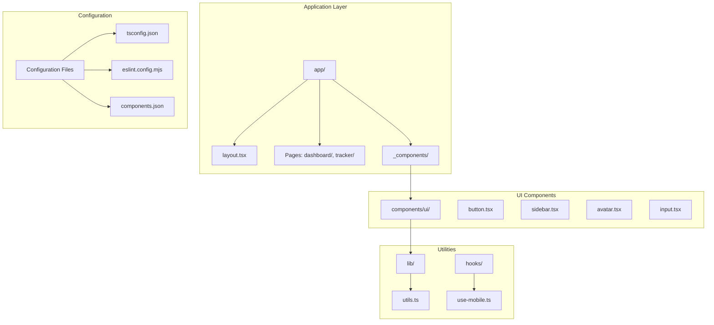
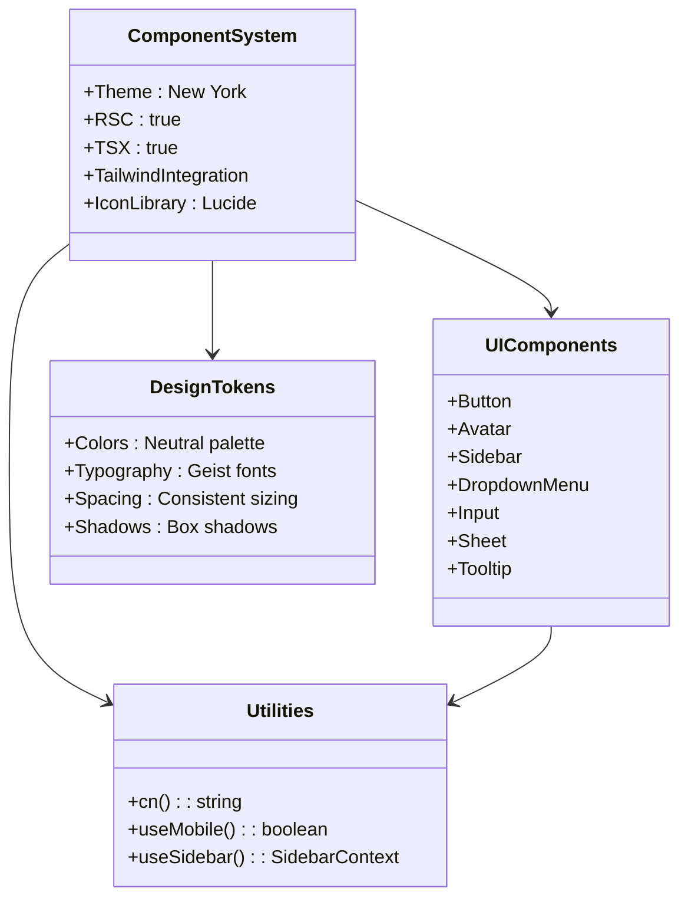

# Contributing Guidelines

<cite>
**Referenced Files in This Document**
- [README.md](file://README.md)
- [package.json](file://package.json)
- [eslint.config.mjs](file://eslint.config.mjs)
- [tsconfig.json](file://tsconfig.json)
- [components.json](file://components.json)
- [app/layout.tsx](file://app/layout.tsx)
- [app/_components/Sidebar.tsx](file://app/_components/Sidebar.tsx)
- [components/ui/button.tsx](file://components/ui/button.tsx)
- [lib/utils.ts](file://lib/utils.ts)
- [hooks/use-mobile.ts](file://hooks/use-mobile.ts)
</cite>

## Table of Contents
1. [Introduction](#introduction)
2. [Development Environment Setup](#development-environment-setup)
3. [Project Structure Overview](#project-structure-overview)
4. [Coding Standards](#coding-standards)
5. [Development Workflow](#development-workflow)
6. [Code Quality Tools](#code-quality-tools)
7. [Component Architecture](#component-architecture)
8. [Branch Management](#branch-management)
9. [Pull Request Process](#pull-request-process)
10. [Documentation Standards](#documentation-standards)
11. [Testing Guidelines](#testing-guidelines)
12. [Best Practices Checklist](#best-practices-checklist)

## Introduction

Welcome to the activity-tracker project! This guide provides comprehensive instructions for contributing to the project, covering development workflows, coding standards, and collaboration practices. The activity-tracker is a modern web application built with Next.js 16, TypeScript, and Tailwind CSS, designed to track daily activities efficiently.

The project follows industry-standard practices for TypeScript development, component-based architecture, and automated code quality enforcement. Contributors should familiarize themselves with these guidelines to ensure smooth collaboration and maintain code quality.

## Development Environment Setup

### Prerequisites

Before contributing to the activity-tracker project, ensure you have the following prerequisites installed:

- **Node.js**: Version 18 or higher
- **pnpm**: Package manager (required, not npm/yarn)
- **Git**: For version control
- **Modern Web Browser**: For development and testing

### Installation Steps

1. **Install pnpm globally** (if not already installed):
   ```bash
   npm install -g pnpm
   ```

2. **Clone the repository**:
   ```bash
   git clone https://github.com/yourusername/activity-tracker.git
   cd activity-tracker
   ```

3. **Install dependencies**:
   ```bash
   pnpm install
   ```

4. **Verify installation**:
   ```bash
   pnpm dev
   ```
   Open http://localhost:3000 to verify the development server is running.

**Section sources**
- [README.md](file://README.md#L1-L37)
- [package.json](file://package.json#L1-L43)

## Project Structure Overview

The activity-tracker follows a well-organized Next.js 16 project structure with clear separation of concerns:



**Diagram sources**
- [app/layout.tsx](file://app/layout.tsx#L1-L35)
- [app/_components/Sidebar.tsx](file://app/_components/Sidebar.tsx#L1-L270)
- [components/ui/button.tsx](file://components/ui/button.tsx#L1-L57)
- [lib/utils.ts](file://lib/utils.ts#L1-L7)

### Directory Structure Explanation

- **`app/`**: Contains Next.js pages and layouts
  - `_components/`: Private components used within the app
  - `dashboard/`: Dashboard page implementation
  - `tracker/`: Activity tracker page implementation
  - `layout.tsx`: Root layout with global styles
  - `page.tsx`: Home page component

- **`components/ui/`**: Reusable UI components following shadcn/ui design system
  - Atomic components (button, input, avatar)
  - Composite components (sidebar, dropdown-menu)
  - Utility components (collapsible, sheet)

- **`lib/`**: Utility functions and shared logic
  - `utils.ts`: Tailwind CSS class merging utility
  - Shared business logic and helpers

- **`hooks/`**: Custom React hooks
  - `use-mobile.ts`: Responsive breakpoint detection

**Section sources**
- [app/layout.tsx](file://app/layout.tsx#L1-L35)
- [lib/utils.ts](file://lib/utils.ts#L1-L7)
- [hooks/use-mobile.ts](file://hooks/use-mobile.ts#L1-L20)

## Coding Standards

### TypeScript Implementation

The project enforces strict TypeScript typing with comprehensive type checking:

```typescript
// Example from button.tsx
interface ButtonProps extends React.ComponentProps<"button"> {
  variant?: "default" | "neutral" | "reverse" | "noShadow";
  size?: "default" | "sm" | "lg" | "icon";
  asChild?: boolean;
}
```

#### Type Checking Rules

- **Strict Mode**: Enabled in `tsconfig.json` for enhanced type safety
- **No Implicit Any**: All variables must have explicit types
- **String Literal Types**: Prefer string literal unions over enums
- **Interface Naming**: Use descriptive interface names with `Props` suffix
- **Generic Constraints**: Apply appropriate constraints for reusable components

#### Component Structure Standards

Components follow a consistent structure:

```typescript
// 1. Imports
import * as React from "react";
import { cva, type VariantProps } from "class-variance-authority";

// 2. Props Interface
interface ComponentNameProps extends React.ComponentProps<"div"> {
  // Component-specific props
}

// 3. Variants Definition (if applicable)
const componentVariants = cva(
  "base-classes",
  {
    variants: {
      variant: {
        // variant definitions
      },
      size: {
        // size definitions
      }
    }
  }
);

// 4. Component Implementation
function ComponentName({
  className,
  variant,
  size,
  ...props
}: ComponentNameProps) {
  // Component logic
}

// 5. Export Statement
export { ComponentName };
```

### Naming Conventions

- **File Names**: Use PascalCase for components (e.g., `Button.tsx`)
- **Variable Names**: Use camelCase for variables and functions
- **Constant Names**: Use UPPER_SNAKE_CASE for constants
- **Type Names**: Use PascalCase for interfaces and types
- **CSS Classes**: Use kebab-case for Tailwind CSS classes

**Section sources**
- [components/ui/button.tsx](file://components/ui/button.tsx#L1-L57)
- [tsconfig.json](file://tsconfig.json#L1-L35)

## Development Workflow

### Dependency Management with pnpm

The project strictly requires pnpm for dependency management:

```json
{
  "scripts": {
    "preinstall": "npx only-allow pnpm",
    "dev": "next dev",
    "build": "next build",
    "start": "next start",
    "lint": "eslint"
  },
  "engines": {
    "npm": "please use pnpm",
    "yarn": "please use pnpm"
  }
}
```

#### Workflow Commands

- **Development**: `pnpm dev` - Starts hot-reloading development server
- **Production Build**: `pnpm build` - Creates optimized production build
- **Production Start**: `pnpm start` - Runs production server
- **Linting**: `pnpm lint` - Runs ESLint for code quality checks

### Component Development Process

1. **Create Component**: Develop new components in `components/ui/`
2. **Test Locally**: Verify functionality in development environment
3. **Add Story**: Create storybook stories if applicable
4. **Write Tests**: Add unit tests for complex logic
5. **Update Documentation**: Document component usage and props

**Section sources**
- [package.json](file://package.json#L1-L43)

## Code Quality Tools

### ESLint Configuration

The project uses a sophisticated ESLint configuration that combines Next.js and TypeScript configurations:

```javascript
import { defineConfig, globalIgnores } from "eslint/config";
import nextVitals from "eslint-config-next/core-web-vitals";
import nextTs from "eslint-config-next/typescript";

const eslintConfig = defineConfig([
  ...nextVitals,
  ...nextTs,
  // Override default ignores
  globalIgnores([
    ".next/**",
    "out/**",
    "build/**",
    "next-env.d.ts",
  ]),
]);
```

#### Linting Rules

- **Next.js Best Practices**: Enforces Next.js-specific conventions
- **TypeScript Integration**: Comprehensive TypeScript linting
- **Code Quality**: Prevents common JavaScript/TypeScript errors
- **Performance**: Optimizes for Core Web Vitals
- **Ignored Files**: Excludes build artifacts and generated files

### TypeScript Configuration

The TypeScript configuration ensures optimal development experience:

```json
{
  "compilerOptions": {
    "target": "ES2017",
    "lib": ["dom", "dom.iterable", "esnext"],
    "strict": true,
    "noEmit": true,
    "jsx": "react-jsx",
    "incremental": true,
    "plugins": [{"name": "next"}],
    "paths": {"@/*": ["./*"]}
  },
  "include": [
    "next-env.d.ts",
    "**/*.ts",
    "**/*.tsx",
    ".next/types/**/*.ts"
  ]
}
```

#### Configuration Highlights

- **Strict Mode**: Enables all strict type checking options
- **Incremental Compilation**: Faster rebuilds during development
- **Next.js Plugin**: Integrates with Next.js build system
- **Path Mapping**: Simplifies imports with `@/*` alias

**Section sources**
- [eslint.config.mjs](file://eslint.config.mjs#L1-L19)
- [tsconfig.json](file://tsconfig.json#L1-L35)

## Component Architecture

### Design System Integration

The project uses shadcn/ui design system with customizations:



**Diagram sources**
- [components.json](file://components.json#L1-L23)
- [components/ui/button.tsx](file://components/ui/button.tsx#L1-L57)
- [lib/utils.ts](file://lib/utils.ts#L1-L7)

### Component Development Guidelines

#### Button Component Example

The button component demonstrates advanced TypeScript and design system integration:

```typescript
// Variant system with class-variance-authority
const buttonVariants = cva(
  "inline-flex items-center justify-center whitespace-nowrap rounded-base text-sm font-base",
  {
    variants: {
      variant: {
        default: "bg-main border-2 border-border",
        neutral: "bg-secondary-background text-foreground",
        reverse: "text-main-foreground bg-main"
      },
      size: {
        default: "h-10 px-4 py-2",
        sm: "h-9 px-3",
        lg: "h-11 px-8"
      }
    }
  }
);
```

#### Component Composition Pattern

Components are designed for composition and reusability:

1. **Atomic Components**: Basic building blocks (button, input)
2. **Composite Components**: Complex components (sidebar, dialog)
3. **Layout Components**: Page structure components
4. **Utility Components**: Helper components (collapsible, sheet)

**Section sources**
- [components/ui/button.tsx](file://components/ui/button.tsx#L1-L57)
- [components.json](file://components.json#L1-L23)

## Branch Management

### Branch Naming Convention

Follow this convention for branch names:

- **Feature Branches**: `feat/description-of-feature`
- **Bug Fixes**: `fix/description-of-fix`
- **Documentation**: `docs/update-description`
- **Refactoring**: `refactor/component-name`
- **Chores**: `chore/update-dependencies`

### Git Workflow

1. **Fork the Repository**: Create your own fork
2. **Create Feature Branch**: Use descriptive branch names
3. **Commit Frequently**: Make small, logical commits
4. **Push Changes**: Regularly push to your fork
5. **Create Pull Request**: Target the main branch

### Commit Message Format

Use conventional commit messages:

```
type(scope): description

- Detailed explanation of changes
- Breaking changes notice
- Issue references
```

Examples:
- `feat(tracker): add activity logging feature`
- `fix(auth): resolve login redirect issue`
- `docs(readme): update installation instructions`

## Pull Request Process

### PR Template Requirements

When creating a pull request, include:

1. **Description**: Clear explanation of changes
2. **Type**: Feature, Bug Fix, Documentation, Refactor
3. **Testing**: Manual testing steps
4. **Screenshots**: Visual changes (if applicable)
5. **Breaking Changes**: List any breaking changes
6. **Related Issues**: Link to related issues

### Code Review Expectations

#### Review Criteria

- **Code Quality**: Adherence to coding standards
- **Type Safety**: Proper TypeScript usage
- **Performance**: No performance regressions
- **Accessibility**: WCAG compliance
- **Security**: No security vulnerabilities
- **Documentation**: Updated documentation

#### Review Process

1. **Automated Checks**: CI/CD pipeline validation
2. **Peer Review**: Team member code review
3. **Manual Testing**: Functional verification
4. **Approval**: Required approvals before merge

### Merge Requirements

- **All Checks Pass**: CI/CD pipeline successful
- **Approved Reviews**: Minimum required approvals
- **Up-to-date**: Latest changes from main branch
- **Clean History**: Squashed or linear history

## Documentation Standards

### Code Documentation

#### Component Documentation

Each component should include:

```typescript
/**
 * Button component for user actions
 * @param {ButtonProps} props - Component props
 * @returns {JSX.Element} Rendered button
 * 
 * @example
 * <Button variant="default" onClick={handleClick}>
 *   Click me
 * </Button>
 */
```

#### Function Documentation

Use JSDoc comments for utility functions:

```typescript
/**
 * Merges Tailwind CSS classes with clsx
 * @param {ClassValue[]} inputs - Array of class values
 * @returns {string} Merged class string
 */
export function cn(...inputs: ClassValue[]): string {
  return twMerge(clsx(inputs));
}
```

### README Updates

When making significant changes, update the README:

- **Installation Instructions**: Updated if dependencies change
- **Usage Examples**: Updated with new features
- **Configuration**: Updated environment variables
- **Deployment**: Updated deployment procedures

**Section sources**
- [lib/utils.ts](file://lib/utils.ts#L1-L7)
- [components/ui/button.tsx](file://components/ui/button.tsx#L1-L57)

## Testing Guidelines

### Current Testing Status

The project currently does not have automated tests configured. However, contributors are encouraged to:

1. **Write Unit Tests**: Test individual components and functions
2. **Integration Tests**: Test component interactions
3. **End-to-End Tests**: Test complete user workflows
4. **Visual Regression Tests**: Test UI consistency

### Testing Best Practices

- **Test Coverage**: Aim for comprehensive coverage
- **Test Organization**: Group related tests logically
- **Mock Dependencies**: Mock external dependencies appropriately
- **Test Data**: Use realistic test data
- **Continuous Integration**: Integrate testing into CI/CD pipeline

### Manual Testing Checklist

Before submitting changes:

1. **Functionality**: Verify all features work correctly
2. **Responsive Design**: Test on various screen sizes
3. **Accessibility**: Check keyboard navigation and screen readers
4. **Performance**: Monitor bundle size and runtime performance
5. **Cross-browser**: Test in different browsers
6. **Internationalization**: Verify text rendering in different languages

## Best Practices Checklist

### Pre-Submission Checklist

- [ ] **Code Quality**: Run `pnpm lint` and fix all issues
- [ ] **Build Success**: Verify `pnpm build` completes successfully
- [ ] **Local Testing**: Test changes locally
- [ ] **Documentation**: Update relevant documentation
- [ ] **Commit Messages**: Use conventional commit format
- [ ] **Branch**: Push to feature branch
- [ ] **PR**: Create descriptive pull request

### Development Best Practices

- **Small Commits**: Make frequent, logical commits
- **Descriptive Names**: Use meaningful variable and function names
- **Type Safety**: Leverage TypeScript for compile-time safety
- **Performance**: Optimize for Core Web Vitals
- **Accessibility**: Follow WCAG guidelines
- **Security**: Avoid exposing sensitive information
- **Maintainability**: Write clean, readable code

### Post-Submission Checklist

- [ ] **Review Feedback**: Address all reviewer comments
- [ ] **CI/CD**: Wait for all automated checks
- [ ] **Testing**: Verify fixes in review environment
- [ ] **Documentation**: Update documentation if needed
- [ ] **Communication**: Respond to team feedback promptly

### Continuous Improvement

- **Stay Updated**: Keep dependencies current
- **Learn Patterns**: Study existing code patterns
- **Share Knowledge**: Help other contributors
- **Suggest Improvements**: Propose process improvements
- **Monitor Performance**: Track application metrics

By following these guidelines, contributors can help maintain the quality and consistency of the activity-tracker project while fostering a collaborative development environment. These standards ensure that the project remains maintainable, scalable, and enjoyable for all contributors.