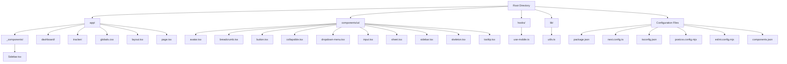

# Getting Started

<cite>
**Referenced Files in This Document**
- [README.md](file://README.md)
- [package.json](file://package.json)
- [next.config.ts](file://next.config.ts)
- [tsconfig.json](file://tsconfig.json)
- [app/page.tsx](file://app/page.tsx)
- [components/ui/button.tsx](file://components/ui/button.tsx)
- [lib/utils.ts](file://lib/utils.ts)
</cite>

## Table of Contents
1. [Introduction](#introduction)
2. [Prerequisites](#prerequisites)
3. [Installation](#installation)
4. [Development Environment Setup](#development-environment-setup)
5. [Running the Development Server](#running-the-development-server)
6. [Project Structure Overview](#project-structure-overview)
7. [Making Changes and Hot Reload](#making-changes-and-hot-reload)
8. [Building for Production](#building-for-production)
9. [Deployment Options](#deployment-options)
10. [Troubleshooting](#troubleshooting)
11. [IDE Setup Recommendations](#ide-setup-recommendations)

## Introduction

Welcome to the Activity Tracker project! This is a modern web application built with Next.js 16, TypeScript, and Tailwind CSS. The project follows the latest Next.js App Router architecture and includes a comprehensive set of UI components built with Radix UI primitives and Tailwind CSS utilities.

This getting started guide will walk you through setting up your development environment, understanding the project structure, and making your first changes to the application. Whether you're a beginner or an experienced developer, this guide provides actionable steps to get you productive quickly.

## Prerequisites

Before you begin, ensure your system meets the following requirements:

### Node.js Version Requirements
- **Node.js**: Version 18.0 or higher (recommended: 20.x LTS)
- **Package Manager**: pnpm (required - enforced by preinstall script)

### Recommended Tools
- **Code Editor**: VS Code, WebStorm, or any modern IDE with TypeScript support
- **Browser**: Latest version of Chrome, Firefox, or Edge
- **Terminal**: Command line interface with Git support

### System Requirements
- **Operating System**: Windows 10+, macOS 10.15+, or Linux (Ubuntu 18.04+)
- **Memory**: Minimum 4GB RAM (8GB+ recommended)
- **Storage**: At least 2GB free disk space

## Installation

### Step 1: Install Dependencies

The project enforces pnpm as the package manager through a preinstall script. Here's how to install everything:

```bash
# Navigate to project directory
cd /path/to/activity-tracker

# Install all dependencies using pnpm
pnpm install
```

**Important Notes:**
- The `preinstall` script in `package.json` prevents installation with npm or yarn
- pnpm provides better performance and disk space utilization compared to traditional package managers
- All dependencies are listed in `package.json` and managed through `pnpm-lock.yaml`

### Step 2: Verify Installation

After installation completes, verify everything is working correctly:

```bash
# Check pnpm version
pnpm --version

# Verify Next.js installation
pnpm dev --help
```

**Section sources**
- [package.json](file://package.json#L1-L43)

## Development Environment Setup

### Understanding the Configuration Files

The project uses several key configuration files that control the development environment:

#### TypeScript Configuration (`tsconfig.json`)
- **TypeScript Version**: 5.x
- **Target**: ES2017
- **Module Resolution**: Bundler
- **Paths**: Configured for `@/*` alias pointing to project root
- **Strict Mode**: Enabled for better type safety

#### Next.js Configuration (`next.config.ts`)
- **Basic Setup**: Currently minimal configuration
- **Extensibility**: Ready for custom Next.js configurations
- **Future Proofing**: Prepared for advanced Next.js features

#### Package Scripts (`package.json`)
- **Development**: `pnpm dev` - Starts development server
- **Production Build**: `pnpm build` - Creates optimized production build
- **Production Start**: `pnpm start` - Runs production build
- **Linting**: `pnpm lint` - Runs ESLint for code quality

**Section sources**
- [tsconfig.json](file://tsconfig.json#L1-L35)
- [next.config.ts](file://next.config.ts#L1-L8)
- [package.json](file://package.json#L5-L10)

## Running the Development Server

### Starting the Development Server

The project uses Next.js's built-in development server with hot reloading capabilities:

```bash
# Start development server with pnpm
pnpm dev
```

### Server Details

- **Default Port**: 3000
- **URL**: http://localhost:3000
- **Hot Reload**: Automatic page refresh when files change
- **Fast Refresh**: Preserves component state during development

### Accessing the Application

Once the server starts, open your browser and navigate to:
```
http://localhost:3000
```

You should see the default Next.js starter page with navigation components.

### Development Features

The development server provides several helpful features:

- **Error Overlay**: Visual error display in the browser
- **Fast Refresh**: Maintains component state during edits
- **Type Checking**: Real-time TypeScript validation
- **Linting**: Code quality checks during development

**Section sources**
- [README.md](file://README.md#L6-L12)

## Project Structure Overview

Understanding the project structure helps you navigate and modify the codebase effectively:



**Diagram sources**
- [README.md](file://README.md#L1-L37)

### Key Directories Explained

#### `/app` - Main Application Layer
- **Layout Management**: Centralized layout configuration
- **Page Routing**: Automatic route generation from file structure
- **Components**: Shared components under `_components/`
- **Pages**: Individual page implementations

#### `/components/ui` - Reusable UI Components
- **Radix UI Integration**: Built with Radix UI primitives
- **Tailwind CSS**: Utility-first styling
- **TypeScript**: Fully typed components
- **Variants**: Configurable component variants

#### `/lib` - Utility Functions
- **Utility Functions**: Shared helper functions
- **CSS Utilities**: Tailwind CSS class merging
- **Type Safety**: Type-safe utility functions

#### `/hooks` - Custom React Hooks
- **Mobile Detection**: Responsive hook utilities
- **Custom Logic**: Reusable component logic

**Section sources**
- [app/page.tsx](file://app/page.tsx#L1-L52)
- [components/ui/button.tsx](file://components/ui/button.tsx#L1-L57)
- [lib/utils.ts](file://lib/utils.ts#L1-L7)

## Making Changes and Hot Reload

### Editing Pages

The project uses Next.js App Router with automatic routing. To modify the homepage:

1. **Locate the Page File**:
   ```bash
   # Open the main page file
   code app/page.tsx
   ```

2. **Modify Content**:
   ```typescript
   // Example modification
   export default function Page() {
     return (
       <div className="p-4">
         <h1 className="text-2xl font-bold">My Modified Activity Tracker</h1>
         {/* Your content here */}
       </div>
     );
   }
   ```

3. **Automatic Updates**:
   - Save changes in your editor
   - Browser automatically refreshes with new content
   - Component state is preserved during development

### Working with UI Components

The project includes a comprehensive set of reusable UI components:

#### Button Component Example
```typescript
// Using the button component
import { Button } from "@/components/ui/button";

<Button variant="default" size="lg">
  Click Me
</Button>
```

#### Utility Functions
```typescript
// Using the utility function
import { cn } from "@/lib/utils";

// Combine Tailwind classes safely
const className = cn(
  "base-class",
  condition && "conditional-class",
  anotherCondition && "another-class"
);
```

### Hot Reload Behavior

- **File Changes**: Automatic browser refresh when `.tsx` files change
- **CSS Changes**: Instant updates without full refresh
- **Component State**: Preserved during development
- **Build Errors**: Displayed in browser overlay

**Section sources**
- [app/page.tsx](file://app/page.tsx#L1-L52)
- [components/ui/button.tsx](file://components/ui/button.tsx#L1-L57)
- [lib/utils.ts](file://lib/utils.ts#L1-L7)

## Building for Production

### Creating a Production Build

When you're ready to deploy your application, create an optimized production build:

```bash
# Build the application for production
pnpm build
```

### Build Process Details

The build process performs several optimizations:

- **Code Splitting**: Automatic chunking for optimal loading
- **Tree Shaking**: Removes unused code
- **Minification**: Reduces file sizes
- **Asset Optimization**: Optimizes images and static assets
- **Type Checking**: Validates TypeScript in production mode

### Production Server

After building, you can start the production server:

```bash
# Start production server
pnpm start
```

**Important Notes:**
- The production server runs on port 3000 by default
- Ensure no other applications are using this port
- Production builds are optimized for performance and bundle size

## Deployment Options

### Vercel Deployment

The project is designed to work seamlessly with Vercel:

1. **Deploy from GitHub/GitLab**:
   - Connect your repository
   - Configure build settings
   - Automatic deployments on push

2. **Manual Deployment**:
   ```bash
   # Install Vercel CLI
   pnpm add -g vercel
   
   # Deploy
   vercel
   ```

### Self-Hosted Deployment

For self-hosted environments:

1. **Build the Application**:
   ```bash
   pnpm build
   ```

2. **Configure Server**:
   - Set up Node.js environment
   - Configure environment variables
   - Set up reverse proxy (Nginx/Apache)

3. **Start Application**:
   ```bash
   NODE_ENV=production pnpm start
   ```

### Environment Variables

Create a `.env.local` file for environment-specific configuration:

```bash
# Example environment variables
NEXT_PUBLIC_API_URL=https://api.example.com
DATABASE_URL=postgresql://localhost:5432/mydb
```

## Troubleshooting

### Common Issues and Solutions

#### Issue 1: Port Already in Use

**Problem**: Port 3000 is occupied by another process.

**Solution**:
```bash
# Find process using port 3000
lsof -i :3000

# Kill the process or change port
pnpm dev --port 3001
```

#### Issue 2: Missing Dependencies

**Problem**: New dependencies not installed.

**Solution**:
```bash
# Install missing dependencies
pnpm add package-name

# Or reinstall all dependencies
pnpm install
```

#### Issue 3: TypeScript Errors

**Problem**: Type checking errors in development.

**Solution**:
```bash
# Check TypeScript configuration
pnpm tsc --noEmit

# Fix type errors in your code
```

#### Issue 4: Build Failures

**Problem**: Production build fails.

**Solution**:
```bash
# Clean build cache
rm -rf .next

# Try building again
pnpm build
```

#### Issue 5: Hot Reload Not Working

**Problem**: Changes not reflecting in browser.

**Solution**:
- Ensure you're saving files in your editor
- Check terminal for compilation errors
- Restart development server if necessary
- Verify file permissions

### Debugging Tips

1. **Enable Verbose Logging**:
   ```bash
   DEBUG=next:* pnpm dev
   ```

2. **Check Network Requests**:
   - Open browser DevTools
   - Monitor Network tab for failed requests
   - Check Console for JavaScript errors

3. **Validate Configuration**:
   ```bash
   # Test TypeScript configuration
   pnpm tsc --noEmit
   
   # Lint your code
   pnpm lint
   ```

### Getting Help

- **Documentation**: Check Next.js official documentation
- **Community**: Join Next.js community forums
- **GitHub Issues**: Report bugs on the project repository
- **Stack Overflow**: Search for similar issues

## IDE Setup Recommendations

### VS Code Configuration

Recommended extensions for optimal development experience:

```json
{
  "recommendations": [
    "bradlc.vscode-tailwindcss",
    "ms-vscode.vscode-typescript-next",
    "esbenp.prettier-vscode",
    "dbaeumer.vscode-eslint"
  ]
}
```

### Configuration Settings

Add these settings to your `.vscode/settings.json`:

```json
{
  "typescript.preferences.importModuleSpecifier": "relative",
  "editor.formatOnSave": true,
  "editor.codeActionsOnSave": {
    "source.fixAll.eslint": true
  },
  "tailwindCSS.includeLanguages": {
    "typescript": "html"
  }
}
```

### Navigation Shortcuts

- **Command Palette**: `Ctrl+Shift+P` (Windows/Linux) or `Cmd+Shift+P` (Mac)
- **Go to File**: `Ctrl+P` (Windows/Linux) or `Cmd+P` (Mac)
- **Find in Files**: `Ctrl+Shift+F` (Windows/Linux) or `Cmd+Shift+F` (Mac)

### Performance Optimization

- **Increase Memory Limit**: Add `--max-old-space-size=4096` to Node.js settings
- **Disable Unnecessary Extensions**: Turn off extensions you don't use
- **Use Workspace Folders**: Open project root as workspace folder

This comprehensive guide provides everything you need to set up and develop the Activity Tracker application. The project is designed to be developer-friendly with modern tooling and best practices built-in. Happy coding!