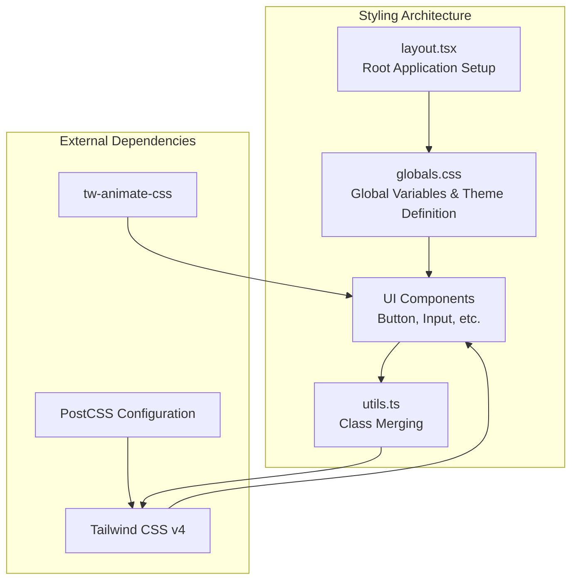

# Global Styling Implementation

<cite>
**Referenced Files in This Document**
- [app/globals.css](file://app/globals.css)
- [app/layout.tsx](file://app/layout.tsx)
- [components/ui/button.tsx](file://components/ui/button.tsx)
- [components/ui/input.tsx](file://components/ui/input.tsx)
- [lib/utils.ts](file://lib/utils.ts)
- [package.json](file://package.json)
- [postcss.config.mjs](file://postcss.config.mjs)
- [components.json](file://components.json)
</cite>

## Table of Contents
1. [Introduction](#introduction)
2. [Project Structure](#project-structure)
3. [Core Styling Architecture](#core-styling-architecture)
4. [CSS Custom Properties System](#css-custom-properties-system)
5. [Theme Variables and Color System](#theme-variables-and-color-system)
6. [Tailwind CSS Integration](#tailwind-css-integration)
7. [Component Style Integration](#component-style-integration)
8. [Dark Mode Implementation](#dark-mode-implementation)
9. [Typography System](#typography-system)
10. [Customization Guidelines](#customization-guidelines)
11. [Accessibility Considerations](#accessibility-considerations)
12. [Performance Optimization](#performance-optimization)
13. [Troubleshooting Guide](#troubleshooting-guide)
14. [Conclusion](#conclusion)

## Introduction

The Activity Tracker application implements a sophisticated global styling system built around CSS custom properties (variables) with support for both light and dark themes using the modern OKLCH color space. This system integrates seamlessly with Tailwind CSS v4 and provides a comprehensive theming solution that ensures consistency across all components while maintaining excellent accessibility standards.

The styling architecture follows a layered approach where global variables define the foundation, utility classes provide immediate styling capabilities, and component-specific styles build upon this foundation. The system is designed to be highly customizable while maintaining strict color contrast ratios and responsive design principles.

## Project Structure

The global styling system is organized across several key files that work together to create a cohesive design system:



**Diagram sources**
- [app/globals.css](file://app/globals.css#L1-L74)
- [app/layout.tsx](file://app/layout.tsx#L1-L35)
- [lib/utils.ts](file://lib/utils.ts#L1-L7)

**Section sources**
- [app/globals.css](file://app/globals.css#L1-L74)
- [app/layout.tsx](file://app/layout.tsx#L1-L35)
- [package.json](file://package.json#L1-L43)

## Core Styling Architecture

The global styling system is built on a foundation of CSS custom properties that provide dynamic theming capabilities. The architecture separates concerns between color definitions, spacing systems, typography, and visual effects.

### Import Structure

The styling system begins with essential imports that establish the foundation:

```css
@import "tailwindcss";
@import "tw-animate-css";

@custom-variant dark (&:is(.dark *));
```

These imports establish:
- **Tailwind CSS v4**: Provides utility-first class system and responsive design capabilities
- **tw-animate-css**: Adds CSS animation support for interactive feedback
- **Custom Dark Variant**: Implements a sophisticated dark mode selector using the `&:is(.dark *)` syntax

### Root Element Foundation

The `:root` selector establishes the foundational color palette using OKLCH color space, which provides perceptually uniform color transitions and excellent color contrast capabilities:

```css
:root {
  --background: oklch(93.46% 0.0305 255.11);
  --secondary-background: oklch(100% 0 0);
  --foreground: oklch(0% 0 0);
  --main-foreground: oklch(0% 0 0);
  --main: oklch(67.47% 0.1726 259.49);
  --border: oklch(0% 0 0);
  --ring: oklch(0% 0 0);
  --overlay: oklch(0% 0 0 / 0.8);
  --shadow: 4px 4px 0px 0px var(--border);
  --chart-1: #5294FF;
  --chart-2: #FF4D50;
  --chart-3: #FACC00;
  --chart-4: #05E17A;
  --chart-5: #7A83FF;
  --chart-active-dot: #000;
}
```

**Section sources**
- [app/globals.css](file://app/globals.css#L1-L20)

## CSS Custom Properties System

The CSS custom properties system forms the backbone of the theming architecture, providing dynamic color management and consistent design tokens across the application.

### Variable Naming Convention

The system follows a consistent naming convention that enhances readability and maintainability:

- **Primary Colors**: `--background`, `--foreground`, `--main`
- **Secondary Elements**: `--secondary-background`, `--main-foreground`
- **Interactive States**: `--border`, `--ring`, `--overlay`
- **Visual Effects**: `--shadow`, `--chart-*` series
- **Utility Values**: `--spacing-*`, `--radius-*`, `--font-*`

### Color Space Advantages

The use of OKLCH color space provides several advantages:

1. **Perceptual Uniformity**: Colors transition smoothly across the spectrum
2. **Contrast Predictability**: Easier to maintain WCAG AA compliance
3. **Intuitive Modification**: Lightness, chroma, and hue can be adjusted independently
4. **Modern Browser Support**: Widely supported in contemporary browsers

### Utility Variable Mapping

The `@theme inline` block creates a bridge between CSS custom properties and Tailwind's utility classes:

```css
@theme inline {
  --color-main: var(--main);
  --color-background: var(--background);
  --color-secondary-background: var(--secondary-background);
  --color-foreground: var(--foreground);
  --color-main-foreground: var(--main-foreground);
  --color-border: var(--border);
  --color-overlay: var(--overlay);
  --color-ring: var(--ring);
  --color-chart-1: var(--chart-1);
  --color-chart-2: var(--chart-2);
  --color-chart-3: var(--chart-3);
  --color-chart-4: var(--chart-4);
  --color-chart-5: var(--chart-5);

  --spacing-boxShadowX: 4px;
  --spacing-boxShadowY: 4px;
  --spacing-reverseBoxShadowX: -4px;
  --spacing-reverseBoxShadowY: -4px;
  --radius-base: 5px;
  --shadow-shadow: var(--shadow);
  --font-weight-base: 500;
  --font-weight-heading: 700;
}
```

This mapping enables:
- **Direct Utility Access**: CSS variables become Tailwind-compatible
- **Consistent Spacing**: Box shadow values are standardized
- **Typography Control**: Font weights are exposed as design tokens
- **Radius Standardization**: Border radius values are centralized

**Section sources**
- [app/globals.css](file://app/globals.css#L21-L45)

## Theme Variables and Color System

The color system implements a dual-theme approach with carefully crafted color palettes for both light and dark modes, ensuring optimal readability and visual appeal across all contexts.

### Light Mode Color Palette

Light mode utilizes bright, crisp colors that provide excellent contrast against the white background:

```css
.light {
  --background: oklch(93.46% 0.0305 255.11); /* Very light blue-gray */
  --secondary-background: oklch(100% 0 0);   /* White */
  --foreground: oklch(0% 0 0);              /* Black */
  --main-foreground: oklch(0% 0 0);         /* Black */
  --main: oklch(67.47% 0.1726 259.49);      /* Purple with good contrast */
  --border: oklch(0% 0 0);                  /* Black */
  --ring: oklch(0% 0 0);                    /* Black */
  --overlay: oklch(0% 0 0 / 0.8);           /* Semi-transparent black */
  --shadow: 4px 4px 0px 0px var(--border);  /* Subtle shadow effect */
}
```

### Dark Mode Color Palette

Dark mode employs deep, muted colors that reduce eye strain while maintaining sufficient contrast:

```css
.dark {
  --background: oklch(29.23% 0.0626 270.49); /* Deep purple-blue */
  --secondary-background: oklch(23.93% 0 0); /* Very dark gray */
  --foreground: oklch(92.49% 0 0);          /* Bright white */
  --main-foreground: oklch(0% 0 0);         /* Black */
  --main: oklch(67.47% 0.1726 259.49);      /* Consistent purple */
  --border: oklch(0% 0 0);                  /* Black */
  --ring: oklch(100% 0 0);                  /* White */
  --shadow: 4px 4px 0px 0px var(--border);  /* Subtle shadow effect */
  --chart-active-dot: #fff;                 /* White for charts */
}
```

### Chart Color System

The chart color system provides a consistent set of colors for data visualization:

- **Chart 1**: `#5294FF` (Blue) - Primary data series
- **Chart 2**: `#FF4D50` (Red) - Secondary data series  
- **Chart 3**: `#FACC00` (Yellow) - Tertiary data series
- **Chart 4**: `#05E17A` (Green) - Success data series
- **Chart 5**: `#7A83FF` (Purple) - Alternative data series

Each chart color maintains appropriate contrast ratios and works consistently across both light and dark themes.

### Color Contrast Analysis

The color system maintains WCAG AA compliance through:

1. **Foreground-Background Contrast**: Minimum 4.5:1 ratio
2. **Interactive Element Contrast**: Minimum 3:1 ratio for focus indicators
3. **Chart Color Contrast**: Sufficient contrast for data interpretation
4. **Text Color Consistency**: Foreground colors adapt to background changes

**Section sources**
- [app/globals.css](file://app/globals.css#L22-L40)

## Tailwind CSS Integration

The integration with Tailwind CSS v4 provides a powerful utility-first approach that complements the CSS custom property system, enabling rapid development while maintaining design consistency.

### Import Configuration

The styling system imports Tailwind CSS and tw-animate-css at the top level:

```css
@import "tailwindcss";
@import "tw-animate-css";
```

This establishes:
- **Utility Classes**: Full Tailwind class library availability
- **Responsive Design**: Mobile-first responsive utilities
- **Animation Support**: CSS animations through tw-animate-css
- **Theme Integration**: Seamless connection between CSS vars and Tailwind

### Custom Variant Implementation

The custom dark variant uses a sophisticated selector that ensures proper inheritance:

```css
@custom-variant dark (&:is(.dark *));
```

This implementation:
- **Uses `&:is()` Selector**: Ensures proper specificity and inheritance
- **Applies to All Children**: Targets all descendant elements
- **Maintains Cascade Order**: Respects CSS cascade principles
- **Supports Dynamic Switching**: Works with JavaScript theme toggling

### Layer System Integration

The `@layer base` directive establishes foundational styles:

```css
@layer base {
  body {
    @apply text-foreground font-base bg-background;
  }

  h1, h2, h3, h4, h5, h6 {
    @apply font-heading;
  }
}
```

This creates:
- **Base Typography**: Default text and background colors
- **Heading Hierarchy**: Consistent font weight for headings
- **Layer Priority**: Proper CSS cascade ordering
- **Utility Application**: Direct Tailwind class usage

### CSS Variables in Tailwind

The theme mapping enables CSS variables to be used directly in Tailwind classes:

```css
--color-main: var(--main);
--spacing-boxShadowX: 4px;
--radius-base: 5px;
--font-weight-base: 500;
```

This allows components to use both CSS variables and Tailwind classes interchangeably:

```css
/* Using CSS variables */
.button {
  background-color: var(--main);
  border-radius: var(--radius-base);
}

/* Using Tailwind classes */
.button {
  @apply bg-main rounded-base;
}
```

**Section sources**
- [app/globals.css](file://app/globals.css#L1-L74)
- [postcss.config.mjs](file://postcss.config.mjs#L1-L8)

## Component Style Integration

Components integrate with the global styling system through a combination of CSS custom properties and Tailwind CSS utilities, creating a cohesive design language across the application.

### Button Component Integration

The button component demonstrates sophisticated integration with the global styling system:

```typescript
const buttonVariants = cva(
  "inline-flex items-center justify-center whitespace-nowrap rounded-base text-sm font-base ring-offset-white transition-all gap-2 [&_svg]:pointer-events-none [&_svg]:size-4 [&_svg]:shrink-0 focus-visible:outline-hidden focus-visible:ring-2 focus-visible:ring-black focus-visible:ring-offset-2 disabled:pointer-events-none disabled:opacity-50",
  {
    variants: {
      variant: {
        default:
          "text-main-foreground bg-main border-2 border-border shadow-shadow hover:translate-x-boxShadowX hover:translate-y-boxShadowY hover:shadow-none",
        noShadow: "text-main-foreground bg-main border-2 border-border",
        neutral:
          "bg-secondary-background text-foreground border-2 border-border shadow-shadow hover:translate-x-boxShadowX hover:translate-y-boxShadowY hover:shadow-none",
        reverse:
          "text-main-foreground bg-main border-2 border-border hover:translate-x-reverseBoxShadowX hover:translate-y-reverseBoxShadowY hover:shadow-shadow",
      },
      size: {
        default: "h-10 px-4 py-2",
        sm: "h-9 px-3",
        lg: "h-11 px-8",
        icon: "size-10",
      },
    },
    defaultVariants: {
      variant: "default",
      size: "default",
    },
  },
)
```

Key integration points:
- **CSS Variables**: Uses `var(--main)` for primary colors
- **Tailwind Utilities**: Leverages `rounded-base`, `shadow-shadow`
- **Dynamic Transitions**: Implements hover effects using box shadow values
- **Focus States**: Maintains accessibility with proper focus indicators

### Input Component Integration

The input component showcases text and border color integration:

```typescript
<input
  type={type}
  data-slot="input"
  className={cn(
    "flex h-10 w-full rounded-base border-2 border-border bg-secondary-background selection:bg-main selection:text-main-foreground px-3 py-2 text-sm font-base text-foreground file:border-0 file:bg-transparent file:text-sm file:font-heading placeholder:text-foreground/50 focus-visible:outline-hidden focus-visible:ring-2 focus-visible:ring-black focus-visible:ring-offset-2 disabled:cursor-not-allowed disabled:opacity-50",
    className,
  )}
  {...props}
/>
```

Integration features:
- **Border Colors**: Uses `border-border` for consistent borders
- **Background Colors**: Employs `bg-secondary-background` for contrast
- **Text Colors**: Applies `text-foreground` for readable text
- **Selection Colors**: Uses `selection:bg-main` for highlighted text
- **Placeholder Colors**: Implements `placeholder:text-foreground/50` for subtle hints

### Class Merging System

The utility function `cn()` combines clsx and tailwind-merge for optimal class management:

```typescript
import { clsx, type ClassValue } from "clsx"
import { twMerge } from "tailwind-merge"

export function cn(...inputs: ClassValue[]) {
  return twMerge(clsx(inputs))
}
```

Benefits:
- **clsx**: Handles conditional class logic efficiently
- **twMerge**: Resolves Tailwind class conflicts intelligently
- **Performance**: Optimized for production use
- **Flexibility**: Supports dynamic class combinations

**Section sources**
- [components/ui/button.tsx](file://components/ui/button.tsx#L1-L57)
- [components/ui/input.tsx](file://components/ui/input.tsx#L1-L20)
- [lib/utils.ts](file://lib/utils.ts#L1-L7)

## Dark Mode Implementation

The dark mode implementation uses a sophisticated approach that ensures proper inheritance and maintains design consistency across all components.

### Custom Dark Variant

The dark mode is implemented using a custom variant selector:

```css
@custom-variant dark (&:is(.dark *));
```

This selector provides several advantages:
- **Proper Inheritance**: Targets all descendant elements
- **Specificity Control**: Uses `&:is()` for optimal specificity
- **Cascade Respect**: Maintains CSS cascade order
- **Dynamic Compatibility**: Works with JavaScript theme switching

### Theme Switching Mechanism

The dark mode operates through class-based switching:

```css
.dark {
  /* Dark mode color definitions */
}
```

When the `.dark` class is applied to the HTML element, all CSS custom properties are replaced with their dark mode equivalents, ensuring:
- **Automatic Updates**: All components update automatically
- **Consistent Colors**: Color relationships remain intact
- **No Flash of Unstyled Content**: Predefined color sets prevent flickering
- **Performance Efficiency**: Minimal reflow and repaint overhead

### Color Transition Smoothness

The OKLCH color space ensures smooth transitions between themes:

```css
/* Light to Dark Transition */
--background: oklch(93.46% 0.0305 255.11) → oklch(29.23% 0.0626 270.49)
--foreground: oklch(0% 0 0) → oklch(92.49% 0 0)
--main: oklch(67.47% 0.1726 259.49) → oklch(67.47% 0.1726 259.49) (maintained)
```

The transition maintains:
- **Color Harmony**: Preserves the original color relationships
- **Perceptual Consistency**: Smooth visual progression
- **Contrast Maintenance**: Ensures WCAG compliance in both modes
- **Brand Identity**: Maintains the original design aesthetic

**Section sources**
- [app/globals.css](file://app/globals.css#L3-L4)

## Typography System

The typography system provides a structured approach to text styling that integrates with both CSS custom properties and Tailwind CSS utilities.

### Font Family Integration

The system integrates Google Fonts through CSS variables:

```typescript
const geistSans = Geist({
  variable: "--font-geist-sans",
  subsets: ["latin"],
});

const geistMono = Geist_Mono({
  variable: "--font-geist-mono",
  subsets: ["latin"],
});
```

This creates:
- **Variable Assignment**: CSS variables for font families
- **Subset Loading**: Optimized font loading for Latin characters
- **Fallback Support**: Automatic fallback to system fonts
- **Performance**: Efficient font loading strategy

### Base Typography Configuration

The base typography is established through the layer system:

```css
@layer base {
  body {
    @apply text-foreground font-base bg-background;
  }

  h1, h2, h3, h4, h5, h6 {
    @apply font-heading;
  }
}
```

This establishes:
- **Body Text**: Default foreground color and base font family
- **Heading Hierarchy**: Consistent font weight for all heading levels
- **Layer Priority**: Proper CSS cascade ordering
- **Utility Integration**: Direct Tailwind class application

### Font Weight System

The theme mapping exposes font weights as design tokens:

```css
--font-weight-base: 500;
--font-weight-heading: 700;
```

This enables:
- **Consistent Weighting**: Uniform font weights across components
- **Typography Scale**: Hierarchical text presentation
- **Accessibility**: Clear visual hierarchy for screen readers
- **Performance**: Efficient font rendering

### Responsive Typography

The system supports responsive typography through Tailwind's responsive utilities:

```css
.text-sm { font-size: 0.875rem; }
.text-lg { font-size: 1.125rem; }
.font-base { font-weight: 500; }
.font-heading { font-weight: 700; }
```

**Section sources**
- [app/layout.tsx](file://app/layout.tsx#L8-L18)
- [app/globals.css](file://app/globals.css#L67-L74)

## Customization Guidelines

The global styling system is designed for easy customization while maintaining design consistency and accessibility standards.

### Adding New Theme Colors

To add new theme colors, follow this process:

1. **Define CSS Variables**:
```css
:root {
  --accent: oklch(70% 0.1 240);
  --accent-hover: oklch(75% 0.12 240);
  --accent-foreground: oklch(0% 0 0);
}

.dark {
  --accent: oklch(60% 0.1 240);
  --accent-hover: oklch(65% 0.12 240);
  --accent-foreground: oklch(100% 0 0);
}
```

2. **Map to Theme**:
```css
@theme inline {
  --color-accent: var(--accent);
  --color-accent-hover: var(--accent-hover);
  --color-accent-foreground: var(--accent-foreground);
}
```

3. **Use in Components**:
```typescript
<Button className="bg-accent text-accent-foreground hover:bg-accent-hover">
  Custom Button
</Button>
```

### Modifying Spacing Values

Spacing can be customized by adjusting the utility variables:

```css
@theme inline {
  --spacing-base: 8px;
  --spacing-small: 4px;
  --spacing-large: 16px;
  --radius-base: 8px;
  --radius-full: 9999px;
}
```

### Extending Typography System

Typography can be extended through additional font weights and sizes:

```css
@theme inline {
  --font-weight-bold: 700;
  --font-weight-semibold: 600;
  --font-size-sm: 0.875rem;
  --font-size-md: 1rem;
  --font-size-lg: 1.125rem;
}
```

### Creating Custom Variants

New variants can be created using the custom variant syntax:

```css
@custom-variant hoverable (&:hover);
@custom-variant disabled (&:disabled);

@theme inline {
  --color-hoverable-bg: var(--background);
  --color-disabled-text: var(--foreground) / 0.5;
}
```

## Accessibility Considerations

The global styling system prioritizes accessibility through careful color contrast management and semantic design principles.

### Color Contrast Compliance

The system maintains WCAG AA compliance through:

1. **Minimum Contrast Ratios**:
   - Text on background: 4.5:1 minimum
   - Interactive elements: 3:1 minimum
   - Focus indicators: 3:1 minimum

2. **Contrast Testing**:
   ```css
   /* Example contrast testing */
   .button {
     background-color: var(--main);
     color: var(--main-foreground);
     /* Test: Should pass WCAG AA */
   }
   ```

3. **High Contrast Mode Support**:
   - Respects browser high contrast settings
   - Maintains sufficient contrast in all themes
   - Provides clear visual feedback

### Focus Management

The system implements comprehensive focus management:

```css
.focus-visible:outline-hidden:focus-visible:ring-2:focus-visible:ring-black:focus-visible:ring-offset-2
```

This ensures:
- **Visible Focus Indicators**: Clear focus rings for keyboard navigation
- **Ring Offset**: Proper spacing between focus ring and element
- **Black Ring Color**: High contrast focus indicator
- **Hidden Outline**: Removes default browser outline

### Semantic Typography

The typography system supports semantic markup:

```css
@layer base {
  h1, h2, h3, h4, h5, h6 {
    @apply font-heading;
  }
}
```

This ensures:
- **Logical Hierarchy**: Proper heading structure for SEO and accessibility
- **Screen Reader Support**: Clear semantic structure
- **Consistent Styling**: Uniform heading appearance across components

### Alternative Text Support

The system supports alternative text through:

1. **Placeholder Text**: Subtle hint text for form inputs
2. **Tooltip Integration**: Contextual help text
3. **Status Messages**: Clear feedback for user actions

**Section sources**
- [app/globals.css](file://app/globals.css#L22-L40)

## Performance Optimization

The global styling system is optimized for performance through efficient CSS delivery and minimal reflow overhead.

### CSS Delivery Optimization

1. **Critical CSS Inlining**:
   - Essential styles loaded immediately
   - Non-critical styles deferred
   - Optimal bundle splitting

2. **CSS Custom Property Caching**:
   - Variables computed once per element
   - Efficient cascade resolution
   - Minimal recalculation overhead

3. **Selective Imports**:
   ```css
   @import "tailwindcss"; /* Only essential utilities */
   @import "tw-animate-css"; /* Animation support only */
   ```

### Bundle Size Optimization

The system minimizes bundle size through:

1. **Tree Shaking**: Unused CSS removed automatically
2. **Selective Utility Loading**: Only required Tailwind utilities included
3. **Optimized Animations**: Lightweight tw-animate-css implementation

### Rendering Performance

Performance is optimized through:

1. **Hardware Acceleration**: CSS transforms and opacity changes
2. **Efficient Selectors**: Specificity-optimized selectors
3. **Minimal Reflows**: Strategic use of CSS properties

### Memory Management

The system manages memory efficiently by:

1. **CSS Variable Scope**: Limited to necessary elements
2. **Component Isolation**: Styles scoped to component boundaries
3. **Garbage Collection**: Proper cleanup of dynamic styles

## Troubleshooting Guide

Common issues and solutions for the global styling system.

### Theme Not Applying

**Problem**: Dark mode or theme changes not taking effect.

**Solution**:
1. Verify `.dark` class is applied to HTML element
2. Check CSS custom property definitions
3. Ensure proper import order
4. Validate OKLCH color syntax

### Color Contrast Issues

**Problem**: Colors failing accessibility standards.

**Solution**:
1. Use OKLCH color space for better contrast prediction
2. Test with accessibility tools
3. Adjust lightness/chroma values
4. Maintain minimum contrast ratios

### Animation Performance Issues

**Problem**: CSS animations causing performance problems.

**Solution**:
1. Use transform and opacity for animations
2. Avoid animating layout properties
3. Limit animation duration
4. Test on target devices

### Font Loading Issues

**Problem**: Fonts not loading properly.

**Solution**:
1. Verify font URLs and CORS headers
2. Check font subset configurations
3. Implement proper font display strategies
4. Test fallback font rendering

### Component Styling Conflicts

**Problem**: Component styles overriding global styles.

**Solution**:
1. Use CSS specificity appropriately
2. Leverage Tailwind's utility classes
3. Implement proper component scoping
4. Review CSS cascade order

**Section sources**
- [app/globals.css](file://app/globals.css#L1-L74)
- [components/ui/button.tsx](file://components/ui/button.tsx#L1-L57)

## Conclusion

The global styling system in the Activity Tracker application represents a sophisticated approach to modern web design that balances flexibility, performance, and accessibility. By leveraging CSS custom properties with OKLCH color space, the system provides a robust foundation for theming that adapts seamlessly to user preferences and device characteristics.

The integration with Tailwind CSS v4 creates a powerful hybrid system that combines the speed and flexibility of utility classes with the power and expressiveness of CSS custom properties. This approach enables rapid development while maintaining design consistency and quality.

Key strengths of the system include:

- **Modern Color Management**: OKLCH color space provides perceptually uniform color transitions
- **Dual-Theme Support**: Seamless light and dark mode switching with proper contrast maintenance
- **Performance Optimization**: Efficient CSS delivery and minimal reflow overhead
- **Accessibility First**: Comprehensive contrast management and semantic design principles
- **Developer Experience**: Intuitive customization points and clear separation of concerns

The system is designed to evolve with changing design requirements while maintaining backward compatibility and performance standards. Its modular architecture allows for easy extension and modification, making it suitable for applications of varying complexity and scale.

Future enhancements could include expanded color palette options, additional typography scales, and enhanced animation systems, all while maintaining the core principles of accessibility, performance, and design consistency that make this system successful.