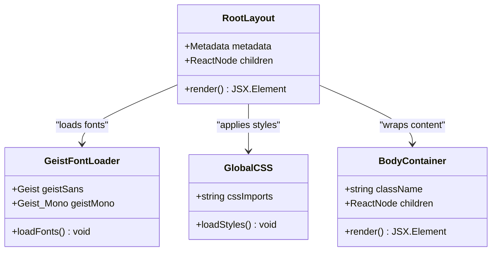
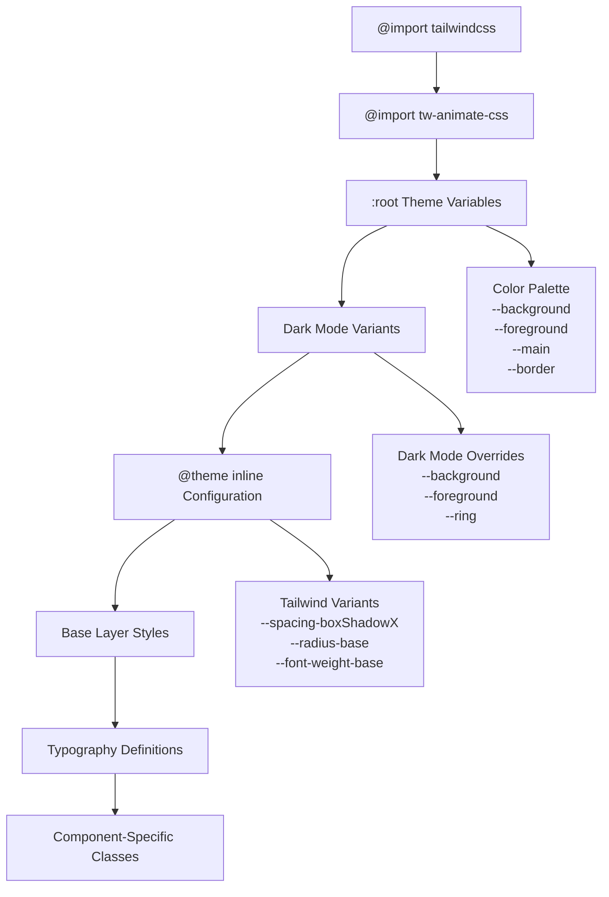
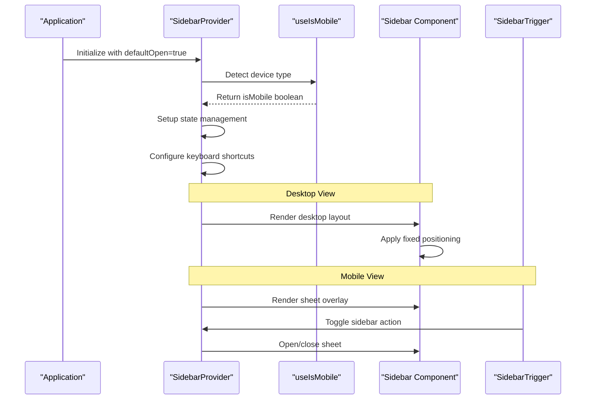
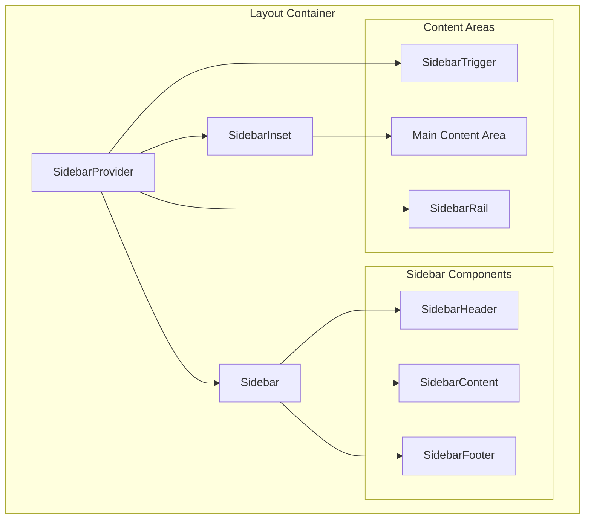
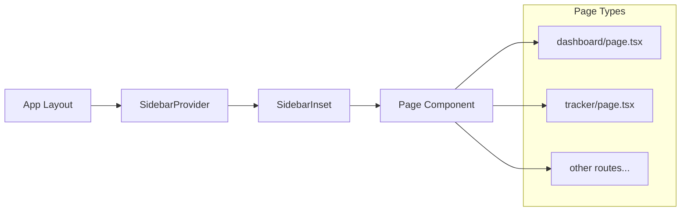
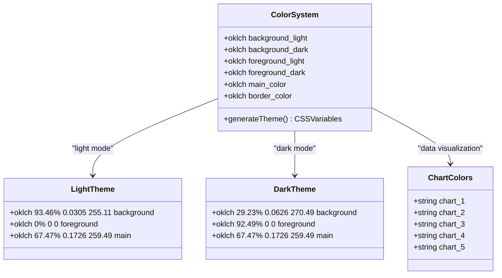
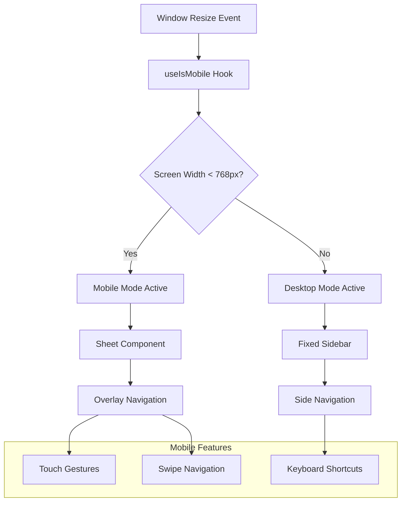

# Layout System

<cite>
**Referenced Files in This Document**
- [app/layout.tsx](file://app/layout.tsx)
- [app/globals.css](file://app/globals.css)
- [components/ui/sidebar.tsx](file://components/ui/sidebar.tsx)
- [hooks/use-mobile.ts](file://hooks/use-mobile.ts)
- [app/_components/Sidebar.tsx](file://app/_components/Sidebar.tsx)
- [app/dashboard/page.tsx](file://app/dashboard/page.tsx)
- [app/tracker/page.tsx](file://app/tracker/page.tsx)
- [package.json](file://package.json)
</cite>

## Table of Contents
1. [Introduction](#introduction)
2. [Root Layout Architecture](#root-layout-architecture)
3. [Global Styling System](#global-styling-system)
4. [Responsive Sidebar Implementation](#responsive-sidebar-implementation)
5. [Layout Composition](#layout-composition)
6. [Theme Variables and Color System](#theme-variables-and-color-system)
7. [Mobile Responsiveness](#mobile-responsiveness)
8. [Customization Points](#customization-points)
9. [Performance Considerations](#performance-considerations)
10. [Troubleshooting Guide](#troubleshooting-guide)
11. [Conclusion](#conclusion)

## Introduction

The activity tracker application employs a sophisticated layout system built on Next.js 16 with a modern design architecture. The layout system is centered around a responsive dashboard structure that seamlessly adapts between desktop and mobile views while maintaining consistent theming and user experience. The system leverages Tailwind CSS v4, Radix UI primitives, and custom React components to create an intuitive navigation interface.

The layout architecture follows a hierarchical structure with the RootLayout serving as the foundation, complemented by a comprehensive sidebar system that supports multiple interaction modes including offcanvas, icon-only, and floating variants. This design ensures optimal usability across different screen sizes while maintaining visual consistency and performance.

## Root Layout Architecture

The RootLayout component serves as the primary container for the entire application, establishing the foundational structure and global configurations. Located in `app/layout.tsx`, this component orchestrates the integration of typography, global styles, and the overall HTML structure.



**Diagram sources**
- [app/layout.tsx](file://app/layout.tsx#L1-L35)

The RootLayout implements a clean, minimal structure that focuses on essential functionality:

```typescript
export default function RootLayout({
  children,
}: Readonly<{
  children: React.ReactNode;
}>) {
  return (
    <html lang="en">
      <body
        className={`${geistSans.variable} ${geistMono.variable} antialiased`}
      >
        {children}
      </body>
    </html>
  );
}
```

This implementation demonstrates several key architectural decisions:

- **Minimal Boilerplate**: The layout maintains a lightweight structure, avoiding unnecessary complexity
- **Type Safety**: Uses TypeScript's `Readonly` wrapper for immutable props
- **Font Loading Strategy**: Integrates Google Fonts (Geist Sans and Geist Mono) with CSS custom property variables for dynamic theming
- **Antialiasing**: Applies `antialiased` class for optimal text rendering across devices

**Section sources**
- [app/layout.tsx](file://app/layout.tsx#L1-L35)

## Global Styling System

The global styling system is managed through `app/globals.css`, which establishes the foundational design tokens, color palette, and typography system. This centralized approach ensures consistency across the entire application while providing flexibility for theme customization.



**Diagram sources**
- [app/globals.css](file://app/globals.css#L1-L74)

The global CSS file implements a comprehensive theming system with the following key features:

### Theme Variable System
The application defines a complete set of CSS custom properties that serve as the foundation for all styling:

```css
:root {
  --background: oklch(93.46% 0.0305 255.11);
  --secondary-background: oklch(100% 0 0);
  --foreground: oklch(0% 0 0);
  --main-foreground: oklch(0% 0 0);
  --main: oklch(67.47% 0.1726 259.49);
  --border: oklch(0% 0 0);
  --ring: oklch(0% 0 0);
  --overlay: oklch(0% 0 0 / 0.8);
  --shadow: 4px 4px 0px 0px var(--border);
}
```

### Dark Mode Support
The system includes comprehensive dark mode support with separate variable sets for enhanced contrast and accessibility:

```css
.dark {
  --background: oklch(29.23% 0.0626 270.49);
  --foreground: oklch(92.49% 0 0);
  --ring: oklch(100% 0 0);
}
```

### Tailwind Integration
The CSS file integrates seamlessly with Tailwind CSS v4 through the `@theme inline` directive, exposing all theme variables as Tailwind utilities:

```css
@theme inline {
  --color-main: var(--main);
  --color-background: var(--background);
  --color-foreground: var(--foreground);
  --color-border: var(--border);
  --radius-base: 5px;
  --font-weight-base: 500;
  --font-weight-heading: 700;
}
```

**Section sources**
- [app/globals.css](file://app/globals.css#L1-L74)

## Responsive Sidebar Implementation

The sidebar system represents the core of the layout architecture, implemented through a sophisticated component hierarchy that supports multiple interaction modes and responsive behavior. The sidebar is built around the `SidebarProvider` component, which manages state and context for the entire sidebar ecosystem.



**Diagram sources**
- [components/ui/sidebar.tsx](file://components/ui/sidebar.tsx#L50-L150)
- [hooks/use-mobile.ts](file://hooks/use-mobile.ts#L1-L20)

### SidebarProvider Architecture

The `SidebarProvider` serves as the central state manager for the sidebar system, implementing sophisticated logic for handling both desktop and mobile interactions:

```typescript
function SidebarProvider({
  defaultOpen = true,
  open: openProp,
  onOpenChange: setOpenProp,
  className,
  style,
  children,
  ...props
}: React.ComponentProps<"div"> & {
  defaultOpen?: boolean
  open?: boolean
  onOpenChange?: (open: boolean) => void
}) {
  const isMobile = useIsMobile()
  const [openMobile, setOpenMobile] = React.useState(false)
  
  // State management logic...
}
```

### Responsive Behavior Patterns

The sidebar implements distinct rendering strategies for different device types:

#### Desktop Implementation
```typescript
if (!isMobile) {
  return (
    <div className="group peer hidden md:block">
      <div data-slot="sidebar-gap" className="w-(--sidebar-width)" />
      <div data-slot="sidebar-container" className="fixed inset-y-0 z-10">
        <div data-sidebar="sidebar" data-slot="sidebar-inner">
          {children}
        </div>
      </div>
    </div>
  )
}
```

#### Mobile Implementation
```typescript
if (isMobile) {
  return (
    <Sheet open={openMobile} onOpenChange={setOpenMobile}>
      <SheetContent 
        className="bg-secondary-background text-foreground w-(--sidebar-width)"
        side={side}
      >
        <div className="flex h-full w-full flex-col">{children}</div>
      </SheetContent>
    </Sheet>
  )
}
```

**Section sources**
- [components/ui/sidebar.tsx](file://components/ui/sidebar.tsx#L50-L200)

## Layout Composition

The layout composition system orchestrates the relationship between the sidebar and main content areas through the `SidebarInset` component. This design pattern creates a clean separation of concerns while maintaining responsive behavior across different screen sizes.



**Diagram sources**
- [components/ui/sidebar.tsx](file://components/ui/sidebar.tsx#L300-L400)

### SidebarInset Implementation

The `SidebarInset` component manages the main content area positioning and styling:

```typescript
function SidebarInset({ className, ...props }: React.ComponentProps<"main">) {
  return (
    <main
      data-slot="sidebar-inset"
      className={cn(
        "bg-secondary-background relative flex w-full flex-1 flex-col",
        "md:peer-data-[variant=inset]:m-2 md:peer-data-[variant=inset]:ml-0",
        "md:peer-data-[variant=inset]:rounded-base md:peer-data-[variant=inset]:shadow-sm",
        "md:peer-data-[variant=inset]:peer-data-[state=collapsed]:ml-2",
        className,
      )}
      {...props}
    />
  )
}
```

### Child Page Rendering

The layout system supports dynamic page rendering through Next.js's file-based routing. Child pages are automatically rendered within the layout structure:



**Diagram sources**
- [app/dashboard/page.tsx](file://app/dashboard/page.tsx#L1-L8)
- [app/tracker/page.tsx](file://app/tracker/page.tsx#L1-L8)

**Section sources**
- [components/ui/sidebar.tsx](file://components/ui/sidebar.tsx#L300-L350)

## Theme Variables and Color System

The application implements a sophisticated color system using OKLCH color space for perceptually uniform color representation. This system provides both light and dark themes with automatic fallbacks and enhanced accessibility.



**Diagram sources**
- [app/globals.css](file://app/globals.css#L5-L35)

### Color Space Advantages

The OKLCH color space offers several advantages over traditional RGB/HSL systems:

- **Perceptual Uniformity**: Colors appear more consistent across different devices and lighting conditions
- **Intuitive Controls**: Luminance, chroma, and hue parameters are more human-readable
- **Better Accessibility**: Automatic contrast calculations for WCAG compliance
- **Smooth Transitions**: Natural color interpolation for animations

### Theme Variable Mapping

The CSS custom properties are mapped to Tailwind CSS utilities for seamless integration:

```css
@theme inline {
  --color-main: var(--main);
  --color-background: var(--background);
  --color-secondary-background: var(--secondary-background);
  --color-foreground: var(--foreground);
  --color-main-foreground: var(--main-foreground);
  --color-border: var(--border);
  --color-overlay: var(--overlay);
  --color-ring: var(--ring);
}
```

**Section sources**
- [app/globals.css](file://app/globals.css#L35-L50)

## Mobile Responsiveness

The mobile responsiveness system is implemented through a combination of media queries, JavaScript detection, and adaptive component rendering. The `useIsMobile` hook serves as the foundation for responsive behavior.



**Diagram sources**
- [hooks/use-mobile.ts](file://hooks/use-mobile.ts#L1-L20)

### Mobile Detection Implementation

The `useIsMobile` hook implements robust mobile detection with real-time updates:

```typescript
const MOBILE_BREAKPOINT = 768

export function useIsMobile() {
  const [isMobile, setIsMobile] = React.useState<boolean | undefined>(undefined)

  React.useEffect(() => {
    const mql = window.matchMedia(`(max-width: ${MOBILE_BREAKPOINT - 1}px)`)
    const onChange = () => {
      setIsMobile(window.innerWidth < MOBILE_BREAKPOINT)
    }
    mql.addEventListener("change", onChange)
    setIsMobile(window.innerWidth < MOBILE_BREAKPOINT)
    return () => mql.removeEventListener("change", onChange)
  }, [])

  return !!isMobile
}
```

### Adaptive Rendering Strategies

The sidebar system implements different rendering strategies based on device type:

#### Desktop Strategy
- Fixed positioning with smooth transitions
- Hover-based expand/collapse functionality
- Keyboard shortcuts for quick access
- Rail-based trigger for collapsed state

#### Mobile Strategy
- Overlay sheet component for full-screen navigation
- Touch-friendly gesture support
- Swipe-to-open/close functionality
- Simplified navigation hierarchy

**Section sources**
- [hooks/use-mobile.ts](file://hooks/use-mobile.ts#L1-L20)

## Customization Points

The layout system provides numerous customization points to adapt the design to specific requirements while maintaining the underlying architecture's integrity.

### Sidebar Width Customization

The sidebar width can be customized through CSS custom properties:

```typescript
const SIDEBAR_WIDTH = "16rem"
const SIDEBAR_WIDTH_MOBILE = "18rem"
const SIDEBAR_WIDTH_ICON = "3rem"
```

To modify the sidebar width, update these constants in the `SidebarProvider` component:

```typescript
// Example: Increase sidebar width to 20rem
const SIDEBAR_WIDTH = "20rem"
const SIDEBAR_WIDTH_MOBILE = "22rem"
const SIDEBAR_WIDTH_ICON = "4rem"
```

### Font Customization

The font system allows easy modification of typography:

```typescript
const geistSans = Geist({
  variable: "--font-geist-sans",
  subsets: ["latin"],
})

const geistMono = Geist_Mono({
  variable: "--font-geist-mono",
  subsets: ["latin"],
})
```

To change fonts, replace the Google Font imports with desired alternatives:

```typescript
// Example: Using Inter font instead of Geist
const inter = Inter({
  variable: "--font-inter",
  subsets: ["latin"],
})
```

### Theme Variable Modification

The color system can be customized by modifying the CSS custom properties:

```css
:root {
  --background: oklch(95% 0.02 255); /* Lighter background */
  --main: oklch(70% 0.2 260); /* Slightly warmer main color */
  --border: oklch(10% 0 0); /* Darker borders for contrast */
}
```

### Component Customization

Individual sidebar components can be customized through their respective props and styling:

```typescript
// Example: Customizing sidebar header
<SidebarHeader className="bg-gradient-to-r from-main to-main/80">
  <SidebarMenu>
    {/* Custom menu items */}
  </SidebarMenu>
</SidebarHeader>
```

## Performance Considerations

The layout system is designed with performance optimization in mind, implementing several strategies to ensure smooth operation across different devices and network conditions.

### Lazy Loading Strategy

The sidebar components implement lazy loading for optimal initial load performance:

- **Conditional Rendering**: Components render only when needed based on device type
- **Code Splitting**: Sidebar components are loaded asynchronously
- **Memory Management**: Proper cleanup of event listeners and subscriptions

### CSS Optimization

The styling system employs several optimization techniques:

- **Critical CSS Extraction**: Essential styles are inlined for faster rendering
- **CSS Custom Properties**: Dynamic theming without runtime computation overhead
- **Tailwind Purging**: Unused CSS is automatically removed in production builds

### State Management Efficiency

The sidebar state management is optimized for performance:

```typescript
const contextValue = React.useMemo<SidebarContextProps>(
  () => ({
    state,
    open,
    setOpen,
    isMobile,
    openMobile,
    setOpenMobile,
    toggleSidebar,
  }),
  [state, open, setOpen, isMobile, openMobile, setOpenMobile, toggleSidebar],
)
```

The `useMemo` hook prevents unnecessary re-renders by memoizing the context value.

## Troubleshooting Guide

Common issues and solutions for the layout system:

### Sidebar Not Responding

**Problem**: Sidebar toggle doesn't work on mobile devices.

**Solution**: Verify that the `useIsMobile` hook is properly detecting the device type:

```typescript
// Debug mobile detection
console.log('Is mobile:', useIsMobile())
```

**Problem**: Sidebar animation is jerky or slow.

**Solution**: Check CSS transitions and ensure hardware acceleration:

```css
.sidebar-transition {
  transform: translateZ(0); /* Force hardware acceleration */
  transition: transform 0.2s ease-out;
}
```

### Typography Issues

**Problem**: Text appears blurry or incorrectly sized.

**Solution**: Verify font loading and CSS custom properties:

```css
/* Ensure fonts are properly loaded */
@supports (font-variation-settings: normal) {
  body {
    font-family: var(--font-geist-sans), sans-serif;
  }
}
```

### Theme Inconsistency

**Problem**: Colors don't match between light and dark modes.

**Solution**: Check CSS custom property precedence:

```css
/* Ensure proper cascade order */
:root {
  --background: white;
}

.dark {
  --background: black;
}
```

**Section sources**
- [components/ui/sidebar.tsx](file://components/ui/sidebar.tsx#L50-L100)
- [hooks/use-mobile.ts](file://hooks/use-mobile.ts#L5-L15)

## Conclusion

The activity tracker's layout system represents a sophisticated implementation of modern web design principles, combining responsive architecture, performance optimization, and developer-friendly customization. The system successfully balances complexity with maintainability, providing a solid foundation for scalable applications.

Key strengths of the implementation include:

- **Modular Architecture**: Clear separation of concerns with reusable components
- **Responsive Design**: Seamless adaptation across desktop and mobile platforms
- **Performance Optimization**: Efficient rendering and state management
- **Accessibility**: Comprehensive keyboard navigation and screen reader support
- **Customization Flexibility**: Extensive customization points without breaking the architecture

The layout system serves as an excellent example of how modern React frameworks can be leveraged to create sophisticated, user-friendly interfaces while maintaining code quality and development velocity. Future enhancements could include additional interaction modes, improved animation systems, and expanded customization capabilities.