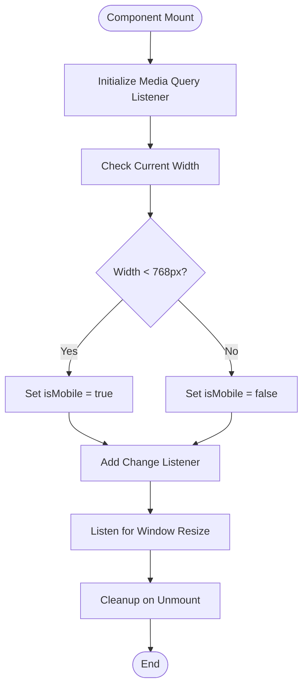
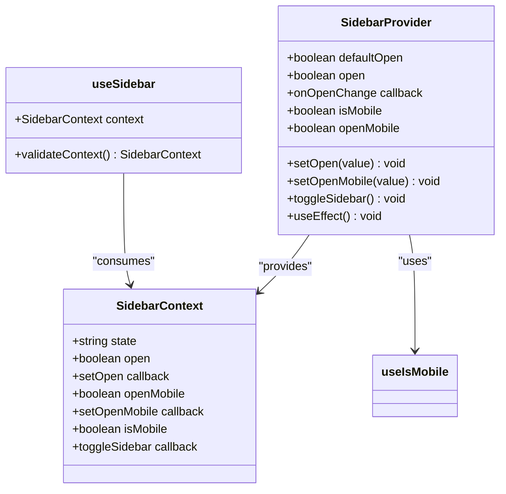
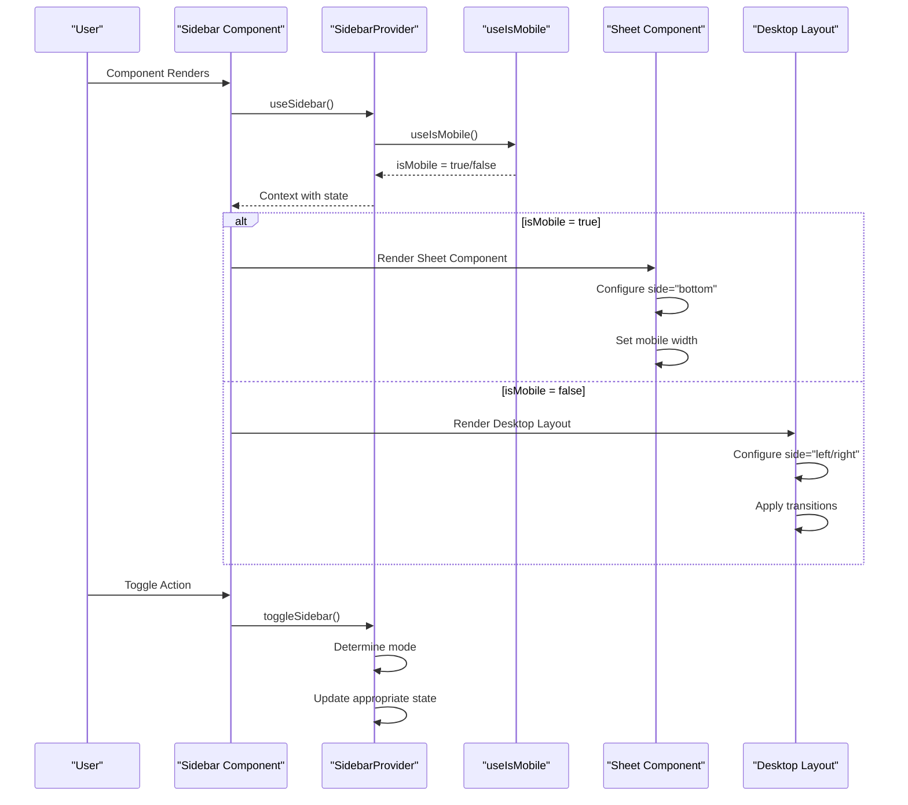
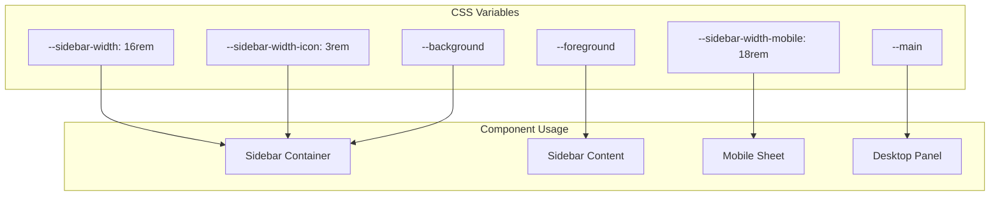
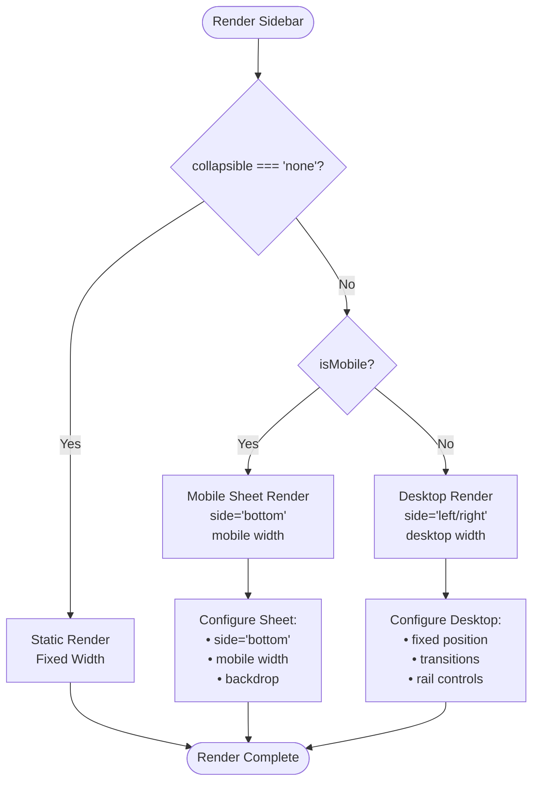

# Responsive Layout Patterns

<cite>
**Referenced Files in This Document**
- [app/layout.tsx](file://app/layout.tsx)
- [app/globals.css](file://app/globals.css)
- [hooks/use-mobile.ts](file://hooks/use-mobile.ts)
- [components/ui/sidebar.tsx](file://components/ui/sidebar.tsx)
- [components/ui/dropdown-menu.tsx](file://components/ui/dropdown-menu.tsx)
- [components/ui/collapsible.tsx](file://components/ui/collapsible.tsx)
- [components/ui/sheet.tsx](file://components/ui/sheet.tsx)
- [lib/utils.ts](file://lib/utils.ts)
- [app/_components/Sidebar.tsx](file://app/_components/Sidebar.tsx)
</cite>

## Table of Contents
1. [Introduction](#introduction)
2. [Mobile Detection System](#mobile-detection-system)
3. [Sidebar Provider Architecture](#sidebar-provider-architecture)
4. [Responsive Sidebar Implementation](#responsive-sidebar-implementation)
5. [CSS Variable System](#css-variable-system)
6. [Conditional Rendering Logic](#conditional-rendering-logic)
7. [Touch Interactions and Gestures](#touch-interactions-and-gestures)
8. [Common Issues and Solutions](#common-issues-and-solutions)
9. [Performance Optimization](#performance-optimization)
10. [Testing Best Practices](#testing-best-practices)
11. [Conclusion](#conclusion)

## Introduction

The application implements a sophisticated responsive layout system that adapts seamlessly to different screen sizes and device types. At its core, the system relies on a centralized `useSidebar` context that manages layout state and provides intelligent responsive behavior through the `SidebarProvider` component.

The responsive layout patterns demonstrate advanced techniques for handling mobile-first design, touch interactions, and adaptive UI components. The system intelligently switches between desktop and mobile interfaces while maintaining consistent functionality and user experience across all devices.

## Mobile Detection System

The foundation of the responsive layout system is the `useIsMobile` hook, which provides real-time detection of mobile devices based on viewport width.



**Diagram sources**
- [hooks/use-mobile.ts](file://hooks/use-mobile.ts#L1-L20)

The mobile detection system uses a media query listener that monitors window resize events and updates the mobile state accordingly. The breakpoint is set at 768 pixels, which corresponds to the tablet-to-desktop threshold commonly used in responsive design.

**Section sources**
- [hooks/use-mobile.ts](file://hooks/use-mobile.ts#L1-L20)

## Sidebar Provider Architecture

The `SidebarProvider` serves as the central orchestrator for all sidebar-related state management and responsive behavior. It maintains separate state for desktop and mobile interfaces while providing a unified API for child components.



**Diagram sources**
- [components/ui/sidebar.tsx](file://components/ui/sidebar.tsx#L46-L92)

The provider manages several key aspects of the responsive layout:

### State Management
- **Desktop State**: Controlled by `open` prop and internal state
- **Mobile State**: Managed separately through `openMobile` for modal behavior
- **Combined State**: Determined by `isMobile` flag that switches between interfaces

### Responsive Behavior
- Automatic detection of device type
- Separate open/close logic for mobile and desktop
- Cookie persistence for desktop state across sessions

**Section sources**
- [components/ui/sidebar.tsx](file://components/ui/sidebar.tsx#L46-L92)

## Responsive Sidebar Implementation

The sidebar component demonstrates sophisticated responsive behavior that adapts to different screen sizes and interaction patterns.



**Diagram sources**
- [components/ui/sidebar.tsx](file://components/ui/sidebar.tsx#L175-L245)

### Desktop Layout (≥768px)
For desktop devices, the sidebar renders as a fixed panel with smooth transitions:

- **Positioning**: Fixed position with configurable side (`left` or `right`)
- **Width**: CSS variable `--sidebar-width` (16rem)
- **Collapsible**: Supports offcanvas, icon, and none modes
- **Transitions**: Smooth width and position animations

### Mobile Layout (<768px)
For mobile devices, the sidebar transforms into a modal sheet:

- **Positioning**: Bottom sheet overlay (`side="bottom"`)
- **Width**: Reduced width `--sidebar-width-mobile` (18rem)
- **Behavior**: Modal presentation with backdrop
- **Touch Targets**: Increased hit areas for better touch interaction

**Section sources**
- [components/ui/sidebar.tsx](file://components/ui/sidebar.tsx#L175-L245)

## CSS Variable System

The layout system utilizes a comprehensive CSS variable architecture that enables flexible and maintainable responsive design.



**Diagram sources**
- [components/ui/sidebar.tsx](file://components/ui/sidebar.tsx#L131-L184)

### Variable Definitions
The CSS variable system defines several key measurements:

- **Sidebar Widths**: `--sidebar-width` (16rem), `--sidebar-width-mobile` (18rem), `--sidebar-width-icon` (3rem)
- **Color Scheme**: Background, foreground, main colors with dark mode support
- **Spacing**: Box shadows, borders, and spacing variables
- **Typography**: Font weights and family variables

### Dynamic Variable Assignment
Variables are dynamically assigned through inline styles:

```typescript
style={{
  "--sidebar-width": SIDEBAR_WIDTH,
  "--sidebar-width-icon": SIDEBAR_WIDTH_ICON,
  ...style,
} as React.CSSProperties}
```

This approach ensures that responsive variables are properly scoped and can be easily overridden or modified.

**Section sources**
- [components/ui/sidebar.tsx](file://components/ui/sidebar.tsx#L131-L184)

## Conditional Rendering Logic

The conditional rendering system intelligently switches between desktop and mobile interfaces based on the detected device type.



**Diagram sources**
- [components/ui/sidebar.tsx](file://components/ui/sidebar.tsx#L175-L245)

### Desktop-Specific Features
- **Rail Controls**: Expand/collapse handles for sidebar
- **Smooth Transitions**: Width and position animations
- **Keyboard Shortcuts**: Toggle with keyboard shortcuts
- **Cookie Persistence**: State saved across sessions

### Mobile-Specific Features
- **Modal Presentation**: Full-screen overlay
- **Bottom Positioning**: Natural mobile interaction
- **Touch-Friendly**: Larger touch targets
- **Gesture Support**: Swipe gestures for dismissal

**Section sources**
- [components/ui/sidebar.tsx](file://components/ui/sidebar.tsx#L175-L245)

## Touch Interactions and Gestures

The mobile interface implements comprehensive touch interaction support for optimal mobile experience.

```mermaid
stateDiagram-v2
[*] --> Closed
Closed --> Open : Tap/Slide
Open --> Closed : Tap Outside<br/>Swipe Down<br/>Back Button
state Open {
[*] --> Expanded
Expanded --> Collapsed : Collapse Gesture
Collapsed --> Expanded : Expand Gesture
state Expanded {
note right of Expanded : Full sidebar visible<br/>All navigation options available
}
state Collapsed {
note right of Collapsed : Icon-only mode<br/>Quick access to main functions
}
}
state Closed {
note right of Closed : Sidebar hidden<br/>Full screen content
}
```

### Touch Target Optimization
The mobile interface increases touch target sizes for better usability:

```css
/* Increased hit area for mobile */
after:absolute after:-inset-2 md:after:hidden
```

This creates a larger invisible touch area around interactive elements, making them easier to tap on mobile devices.

### Gesture Recognition
- **Swipe Down**: Dismiss mobile sidebar
- **Tap Outside**: Close modal overlay
- **Long Press**: Context menu actions
- **Pan Gestures**: Navigation between pages

**Section sources**
- [components/ui/sidebar.tsx](file://components/ui/sidebar.tsx#L421-L473)

## Common Issues and Solutions

### Mobile Menu Closing Behavior
**Issue**: Mobile menus don't close consistently on touch devices.

**Solution**: The system uses a combination of backdrop clicks and swipe gestures for dismissal:

```typescript
<Sheet open={openMobile} onOpenChange={setOpenMobile}>
  {/* Sheet content with close button */}
</Sheet>
```

### Touch Target Sizing
**Issue**: Small touch targets make mobile interaction difficult.

**Solution**: The system implements increased hit areas:

```css
/* Increases the hit area of the button on mobile */
after:absolute after:-inset-2 md:after:hidden
```

### Orientation Changes
**Issue**: Layout doesn't adapt immediately to orientation changes.

**Solution**: The mobile detection system listens for window resize events:

```typescript
const mql = window.matchMedia(`(max-width: ${MOBILE_BREAKPOINT - 1}px)`)
const onChange = () => {
  setIsMobile(window.innerWidth < MOBILE_BREAKPOINT)
}
mql.addEventListener("change", onChange)
```

### State Synchronization
**Issue**: Desktop and mobile states become desynchronized.

**Solution**: The provider maintains separate state management:

```typescript
const toggleSidebar = React.useCallback(() => {
  return isMobile ? setOpenMobile((open) => !open) : setOpen((open) => !open)
}, [isMobile, setOpen, setOpenMobile])
```

**Section sources**
- [hooks/use-mobile.ts](file://hooks/use-mobile.ts#L1-L20)
- [components/ui/sidebar.tsx](file://components/ui/sidebar.tsx#L46-L92)

## Performance Optimization

### Efficient State Updates
The responsive layout system minimizes unnecessary re-renders through careful state management:

- **Memoized Context Values**: Uses `React.useMemo` for expensive calculations
- **Callback Functions**: Prevents unnecessary prop updates
- **Conditional Rendering**: Only renders necessary components

### Optimized CSS Transitions
CSS transitions are optimized for performance:

```css
transition-[width] duration-200 ease-linear
```

This ensures smooth animations without excessive CPU usage during layout changes.

### Lazy Loading
Components are conditionally rendered based on device type, reducing initial bundle size and improving load times.

### Memory Management
The mobile detection system properly cleans up event listeners to prevent memory leaks:

```typescript
return () => mql.removeEventListener("change", onChange)
```

**Section sources**
- [components/ui/sidebar.tsx](file://components/ui/sidebar.tsx#L46-L92)

## Testing Best Practices

### Device Breakpoint Testing
Test the layout at various breakpoints to ensure proper behavior:

- **Mobile**: ≤768px width
- **Tablet**: 768px-1024px width
- **Desktop**: ≥1024px width

### Touch Interaction Testing
Verify touch interactions work correctly:

- **Tap Targets**: Test all interactive elements
- **Gestures**: Verify swipe and pan gestures
- **Orientation**: Test landscape/portrait switching

### Cross-Browser Compatibility
Ensure consistent behavior across browsers:

- **Chrome**: Primary testing browser
- **Firefox**: Secondary testing browser
- **Safari**: Mobile Safari testing
- **Edge**: Windows browser testing

### Accessibility Testing
Validate accessibility compliance:

- **Keyboard Navigation**: Test all functionality with keyboard
- **Screen Readers**: Verify proper ARIA labeling
- **Color Contrast**: Ensure adequate contrast ratios
- **Focus Management**: Test focus indicators and navigation

## Conclusion

The responsive layout patterns implemented in this application demonstrate advanced techniques for creating adaptive user interfaces that work seamlessly across all device types. The system's architecture separates concerns effectively, with clear separation between mobile detection, state management, and component rendering.

Key strengths of the implementation include:

- **Intelligent Device Detection**: Real-time mobile detection with automatic adaptation
- **Separate State Management**: Distinct handling of desktop and mobile interfaces
- **Flexible CSS Variables**: Maintainable and scalable styling system
- **Touch Optimization**: Enhanced mobile interaction experience
- **Performance Awareness**: Optimized rendering and state management

The modular design allows for easy extension and customization while maintaining the core responsive behavior. The system provides a solid foundation for building complex, responsive applications that deliver excellent user experiences across all devices.

Future enhancements could include additional gesture support, improved animation timing, and expanded accessibility features. The current implementation provides a robust starting point for responsive design patterns that can be adapted to various application requirements.