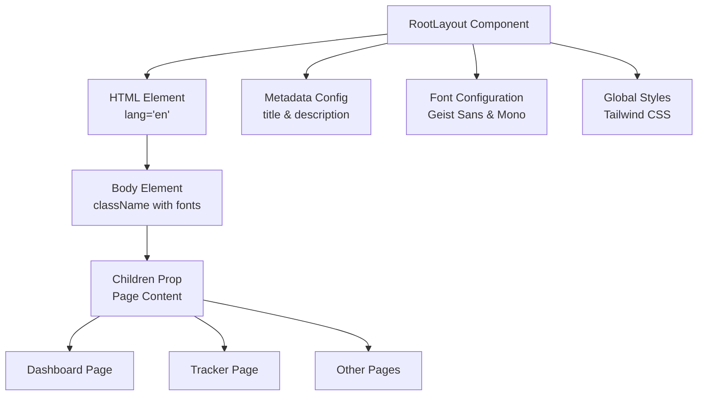
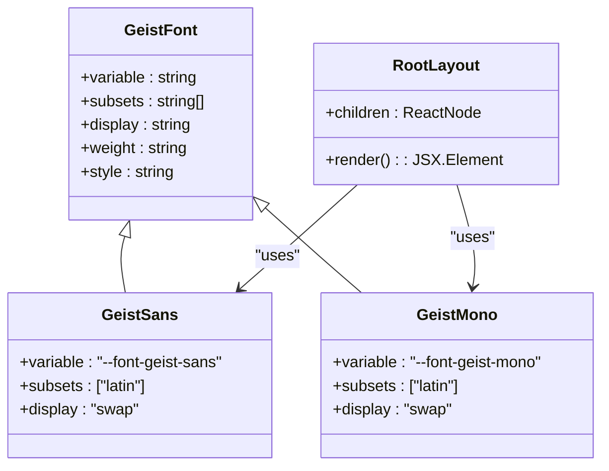
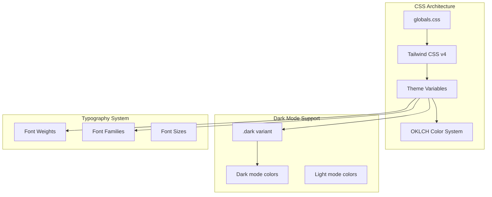
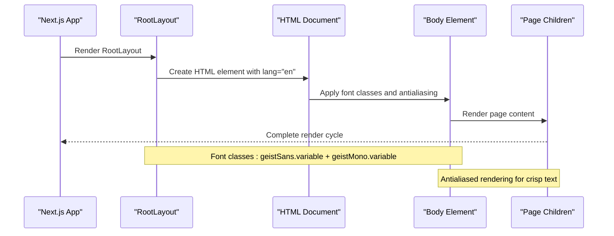
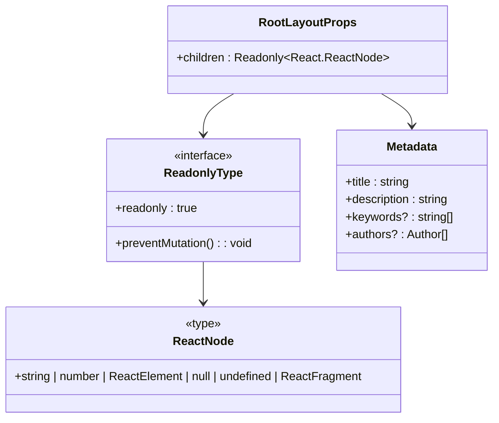
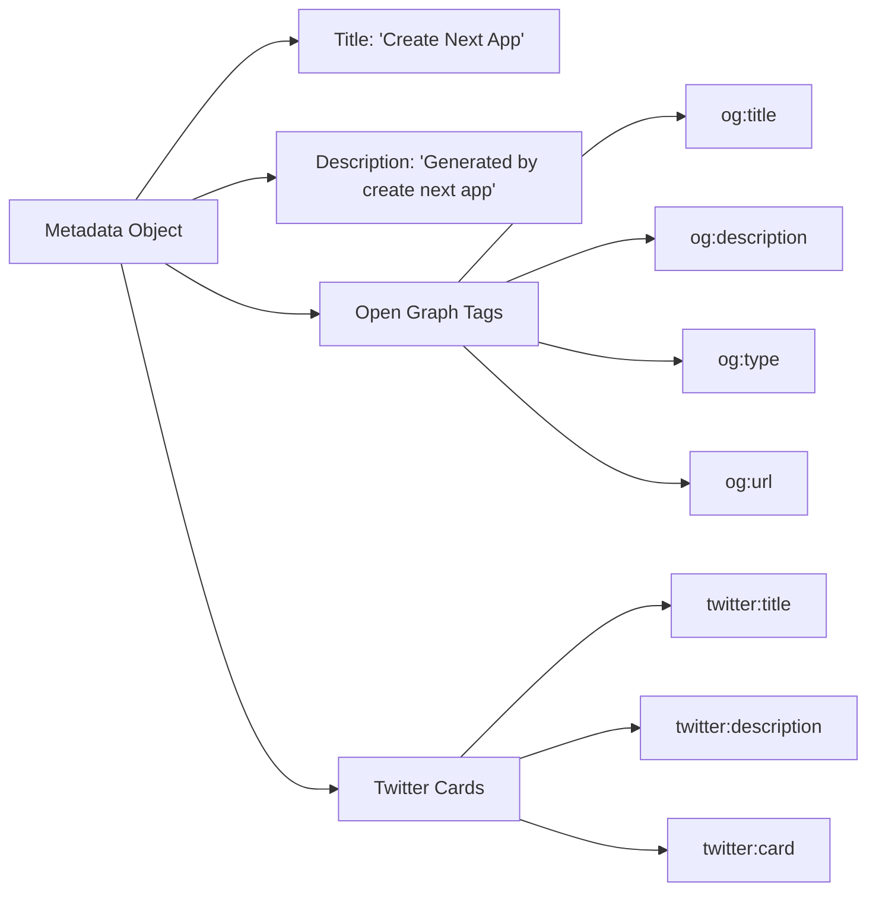

# Root Layout Architecture

<cite>
**Referenced Files in This Document**
- [app/layout.tsx](file://app/layout.tsx)
- [app/globals.css](file://app/globals.css)
- [package.json](file://package.json)
- [next.config.ts](file://next.config.ts)
- [lib/utils.ts](file://lib/utils.ts)
- [components.json](file://components.json)
</cite>

## Table of Contents
1. [Introduction](#introduction)
2. [Root Layout Structure](#root-layout-structure)
3. [Font Configuration and Optimization](#font-configuration-and-optimization)
4. [CSS Architecture and Theming](#css-architecture-and-theming)
5. [Layout Implementation Details](#layout-implementation-details)
6. [TypeScript Type Safety](#typescript-type-safety)
7. [Metadata Configuration](#metadata-configuration)
8. [Customization Points](#customization-points)
9. [Best Practices](#best-practices)
10. [Troubleshooting](#troubleshooting)

## Introduction

The RootLayout component in Next.js serves as the foundational wrapper for the entire application, acting as the primary container for all pages and components. This component is crucial for establishing global styles, fonts, metadata, and providing a consistent structure across the application. In this modern Next.js 16 application, the RootLayout demonstrates best practices for font optimization, CSS-in-JS integration, and type safety while maintaining excellent SEO capabilities.

The layout follows the App Router architecture introduced in Next.js 13+, providing a server-side rendering foundation with client-side hydration capabilities. It integrates seamlessly with Tailwind CSS v4, Shadcn UI components, and advanced font loading strategies to deliver optimal performance and user experience.

## Root Layout Structure

The RootLayout component is implemented as a functional component that receives children props and returns a structured HTML document. The component serves as the entry point for all pages in the application, ensuring consistent rendering patterns and shared resources.



**Diagram sources**
- [app/layout.tsx](file://app/layout.tsx#L1-L35)

The layout structure follows a hierarchical pattern where the RootLayout wraps the entire application, providing essential HTML structure, font loading, and CSS foundation. The children prop allows individual pages to render within this consistent framework.

**Section sources**
- [app/layout.tsx](file://app/layout.tsx#L18-L35)

## Font Configuration and Optimization

The application implements Next.js font optimization through the Google Fonts integration, specifically utilizing Geist and Geist Mono variable fonts. This approach provides several advantages including automatic font preloading, subset optimization, and CSS variable integration for dynamic font selection.



**Diagram sources**
- [app/layout.tsx](file://app/layout.tsx#L6-L15)

The font configuration utilizes variable fonts that support multiple weights and styles, enabling efficient loading and dynamic font switching. The `--font-geist-sans` and `--font-geist-mono` CSS variables are automatically generated and applied to the body element, allowing for consistent typography across the application.

Key font optimization features include:
- **Subset Loading**: Only Latin character subsets are loaded initially
- **Variable Font Support**: Single font file serving multiple weights/styles
- **CSS Variable Integration**: Dynamic font family assignment through CSS custom properties
- **Performance Optimization**: Automatic font preloading and display swapping

**Section sources**
- [app/layout.tsx](file://app/layout.tsx#L6-L15)

## CSS Architecture and Theming

The application employs a sophisticated CSS architecture built on Tailwind CSS v4 with custom color systems and theme variables. The globals.css file establishes a comprehensive theming system using OKLCH color space for improved color perception and accessibility.



**Diagram sources**
- [app/globals.css](file://app/globals.css#L1-L74)

The CSS architecture implements a dual-color system with light and dark modes, utilizing OKLCH color space for superior color accuracy and accessibility. The theme variables enable dynamic color switching and consistent styling across components.

**Section sources**
- [app/globals.css](file://app/globals.css#L1-L74)

## Layout Implementation Details

The RootLayout implementation demonstrates modern React patterns with strict type safety and optimal performance characteristics. The component uses the `Readonly` type wrapper to ensure immutability of the children prop, preventing accidental modifications during rendering.



**Diagram sources**
- [app/layout.tsx](file://app/layout.tsx#L18-L35)

The layout implementation prioritizes performance through:
- **Static Rendering**: RootLayout renders at build time
- **Font Optimization**: Preloaded fonts with minimal flash
- **CSS Optimization**: Tree-shaken styles with utility-first approach
- **Type Safety**: Strict TypeScript typing for props and metadata

**Section sources**
- [app/layout.tsx](file://app/layout.tsx#L18-L35)

## TypeScript Type Safety

The RootLayout component implements robust type safety using TypeScript's advanced features. The `Readonly` wrapper ensures that the children prop remains immutable throughout the rendering process, preventing potential bugs from accidental mutations.



**Diagram sources**
- [app/layout.tsx](file://app/layout.tsx#L18-L20)

The type system provides several benefits:
- **Compile-time Safety**: Prevents runtime errors from prop mutations
- **Developer Experience**: Clear contract definition for component usage
- **Code Quality**: Encourages defensive programming practices
- **Refactoring Support**: Safe code modifications with type checking

**Section sources**
- [app/layout.tsx](file://app/layout.tsx#L18-L20)

## Metadata Configuration

The RootLayout defines essential metadata for SEO optimization and browser tab representation. The metadata configuration follows Open Graph and Twitter Card standards, ensuring optimal social media sharing and search engine visibility.



**Diagram sources**
- [app/layout.tsx](file://app/layout.tsx#L16-L17)

The metadata configuration provides:
- **SEO Optimization**: Structured data for search engines
- **Social Media Sharing**: Optimized preview cards
- **Browser Tab Information**: Consistent title display
- **Progressive Web App Support**: Manifest integration capabilities

**Section sources**
- [app/layout.tsx](file://app/layout.tsx#L16-L17)

## Customization Points

The RootLayout component provides several strategic customization points for extending functionality and adapting to specific project requirements. These customization opportunities allow developers to enhance the layout with global providers, analytics integration, and additional styling configurations.

### Global Providers Integration

```typescript
// Example: Adding Redux Provider
export default function RootLayout({
  children,
}: Readonly<{
  children: React.ReactNode;
}>) {
  return (
    <html lang="en">
      <body className={`${geistSans.variable} ${geistMono.variable} antialiased`}>
        <Provider store={store}>
          {children}
        </Provider>
      </body>
    </html>
  );
}
```

### Analytics Script Integration

```typescript
// Example: Adding Google Analytics
export default function RootLayout({
  children,
}: Readonly<{
  children: React.ReactNode;
}>) {
  return (
    <html lang="en">
      <head>
        <script async src="https://www.googletagmanager.com/gtag/js?id=G-XXXXXXXXXX" />
        <script dangerouslySetInnerHTML={{
          __html: `
            window.dataLayer = window.dataLayer || [];
            function gtag(){dataLayer.push(arguments);}
            gtag('js', new Date());
            gtag('config', 'G-XXXXXXXXXX');
          `,
        }} />
      </head>
      <body className={`${geistSans.variable} ${geistMono.variable} antialiased`}>
        {children}
      </body>
    </html>
  );
}
```

### Additional Customization Options

1. **Internationalization**: Add locale-specific configurations
2. **Error Boundaries**: Wrap children with error handling
3. **Suspense Boundaries**: Implement loading states
4. **Context Providers**: Add authentication or state management
5. **Third-party Integrations**: Embed external libraries or APIs

## Best Practices

The RootLayout implementation follows established best practices for Next.js applications, emphasizing performance, accessibility, and maintainability. These practices ensure optimal user experience and developer productivity.

### Performance Optimization

- **Font Preloading**: Utilize Next.js font optimization for faster loading
- **CSS Optimization**: Leverage Tailwind's tree-shaking capabilities
- **Bundle Splitting**: Separate vendor and application bundles
- **Image Optimization**: Implement responsive image loading strategies

### Accessibility Standards

- **Semantic HTML**: Proper use of HTML5 elements and attributes
- **ARIA Support**: Enhanced screen reader compatibility
- **Keyboard Navigation**: Full keyboard accessibility
- **Color Contrast**: WCAG-compliant color combinations

### Development Workflow

- **Type Safety**: Comprehensive TypeScript integration
- **Code Organization**: Modular component structure
- **Testing Strategy**: Unit and integration testing approaches
- **Documentation**: Clear code comments and architectural decisions

## Troubleshooting

Common issues with the RootLayout component and their solutions help developers quickly resolve problems and maintain application stability.

### Font Loading Issues

**Problem**: Fonts not displaying correctly or causing layout shifts
**Solution**: Verify font configuration and CSS variable assignments
```typescript
// Ensure proper font variable usage
<body className={`${geistSans.variable} ${geistMono.variable} antialiased`}>
```

### Metadata Problems

**Problem**: Social media previews not displaying correctly
**Solution**: Verify metadata object structure and Open Graph tags
```typescript
export const metadata: Metadata = {
  title: "Application Title",
  description: "Application Description",
  // Add Open Graph and Twitter Card properties
};
```

### Type Errors

**Problem**: TypeScript compilation errors with children prop
**Solution**: Ensure proper Readonly wrapping and ReactNode typing
```typescript
export default function RootLayout({
  children,
}: Readonly<{
  children: React.ReactNode;
}>) {
  // Implementation
}
```

### CSS Conflicts

**Problem**: Styles not applying or conflicting with global styles
**Solution**: Review CSS specificity and Tailwind configuration
```css
/* Ensure proper CSS variable precedence */
:root {
  --font-geist-sans: 'Geist Sans Variable';
  --font-geist-mono: 'Geist Mono Variable';
}
```

**Section sources**
- [app/layout.tsx](file://app/layout.tsx#L1-L35)
- [app/globals.css](file://app/globals.css#L1-L74)