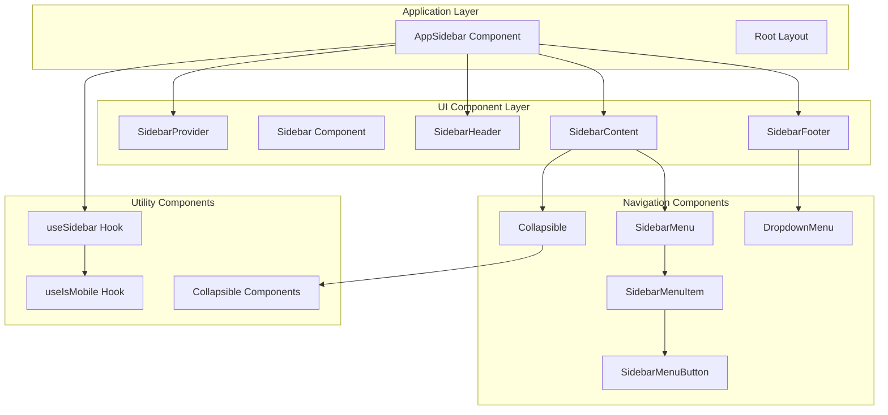
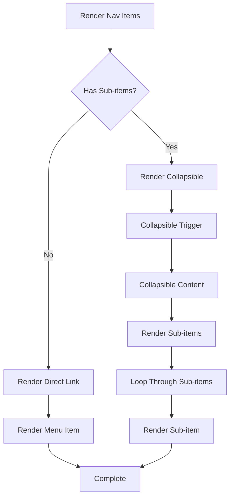
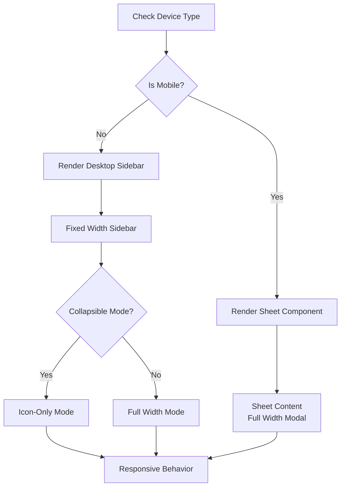

# Sidebar Layout System

<cite>
**Referenced Files in This Document**
- [app/_components/Sidebar.tsx](file://app/_components/Sidebar.tsx)
- [components/ui/sidebar.tsx](file://components/ui/sidebar.tsx)
- [hooks/use-mobile.ts](file://hooks/use-mobile.ts)
- [components/ui/collapsible.tsx](file://components/ui/collapsible.tsx)
- [components/ui/dropdown-menu.tsx](file://components/ui/dropdown-menu.tsx)
- [components/ui/avatar.tsx](file://components/ui/avatar.tsx)
- [app/globals.css](file://app/globals.css)
</cite>

## Table of Contents
1. [Introduction](#introduction)
2. [System Architecture](#system-architecture)
3. [Core Components](#core-components)
4. [Navigation Data Structure](#navigation-data-structure)
5. [Dynamic Rendering Patterns](#dynamic-rendering-patterns)
6. [Context Management](#context-management)
7. [Responsive Behavior](#responsive-behavior)
8. [Customization Guide](#customization-guide)
9. [Accessibility Features](#accessibility-features)
10. [Performance Considerations](#performance-considerations)
11. [Troubleshooting](#troubleshooting)
12. [Conclusion](#conclusion)

## Introduction

The Sidebar layout system is a comprehensive navigation solution built with React and Next.js, designed to provide intuitive and responsive navigation experiences across desktop and mobile devices. The system leverages a modular architecture with reusable UI components, context-based state management, and dynamic rendering capabilities to deliver a seamless user interface.

The implementation centers around the `AppSidebar` component in `Sidebar.tsx`, which orchestrates the navigation interface using specialized UI components like `SidebarHeader`, `SidebarContent`, and `SidebarFooter`. The system integrates deeply with the `SidebarProvider` context to manage state and provide responsive behavior across different device types.

## System Architecture

The Sidebar layout system follows a hierarchical component architecture with clear separation of concerns:



**Diagram sources**
- [app/_components/Sidebar.tsx](file://app/_components/Sidebar.tsx#L1-L270)
- [components/ui/sidebar.tsx](file://components/ui/sidebar.tsx#L1-L716)

The architecture emphasizes modularity and reusability, with each component serving a specific purpose in the overall navigation system. The `SidebarProvider` manages global state, while individual components handle specific UI responsibilities.

**Section sources**
- [app/_components/Sidebar.tsx](file://app/_components/Sidebar.tsx#L1-L270)
- [components/ui/sidebar.tsx](file://components/ui/sidebar.tsx#L46-L184)

## Core Components

### AppSidebar Component

The `AppSidebar` serves as the primary container component that orchestrates the entire navigation interface. It receives props from the parent `Sidebar` component and manages the composition of different sidebar sections.

```typescript
export function AppSidebar({ ...props }: React.ComponentProps<typeof Sidebar>) {
  const { isMobile } = useSidebar();
  
  return (
    <Sidebar collapsible="icon" {...props}>
      {/* Sidebar sections */}
    </Sidebar>
  );
}
```

The component utilizes the `useSidebar` hook to access the current device state and apply appropriate responsive behavior. The `collapsible="icon"` prop enables icon-only mode for collapsed states, enhancing mobile usability.

### Sidebar Sections

The sidebar is divided into three main sections, each serving distinct purposes:

#### SidebarHeader
Contains the application branding and logo information:
- Application name and subtitle
- Logo display with iconography
- Responsive typography adjustments

#### SidebarContent
Hosts the main navigation menu with support for hierarchical structures:
- Primary navigation items
- Submenu support for grouped items
- Collapsible functionality for nested menus

#### SidebarFooter
Provides user-related functionality and account management:
- User avatar display
- Dropdown menu for account actions
- Responsive positioning based on device type

**Section sources**
- [app/_components/Sidebar.tsx](file://app/_components/Sidebar.tsx#L85-L270)

## Navigation Data Structure

The navigation system uses a structured data format defined in the `data` constant within `AppSidebar`. This structure supports both flat and hierarchical navigation patterns:

```typescript
const data = {
  user: {
    name: "shadcn",
    email: "m@example.com",
    avatar: "/avatars/shadcn.jpg",
  },
  
  navMain: [
    {
      title: "Dashboard",
      url: "/",
      icon: SquareTerminal,
      isActive: true,
    },
    {
      title: "Activity Tracker",
      url: "/tracker",
      icon: Bot,
    },
    {
      title: "Leave Application",
      url: "/leaves",
      icon: BookOpen,
      items: [
        {
          title: "Leave Application",
          url: "/leaves/application",
        },
        {
          title: "Leave History",
          url: "/leaves/history",
        },
      ],
    },
    {
      title: "Comp-Off Request",
      url: "/compoff",
      icon: Settings2,
    },
  ],
};
```

### Data Structure Components

#### User Profile Data
- **name**: Display name for the user
- **email**: Email address for identification
- **avatar**: Path to user avatar image

#### Navigation Items
Each navigation item supports the following properties:
- **title**: Display text for the menu item
- **url**: Target URL for navigation
- **icon**: Lucide React icon component reference
- **isActive**: Boolean flag for active state indication
- **items**: Array of submenu items for hierarchical navigation

**Section sources**
- [app/_components/Sidebar.tsx](file://app/_components/Sidebar.tsx#L65-L109)

## Dynamic Rendering Patterns

The sidebar implements sophisticated dynamic rendering patterns to handle different navigation scenarios and device states:

### Conditional Menu Item Rendering



**Diagram sources**
- [app/_components/Sidebar.tsx](file://app/_components/Sidebar.tsx#L125-L171)

### Collapsible Menu Implementation

The system uses Radix UI's `Collapsible` primitive to create expandable menu sections:

```typescript
{data.navMain.map((item) =>
  item.items && item.items.length > 0 ? (
    <Collapsible
      key={item.title}
      asChild
      defaultOpen={item.isActive}
      className="group/collapsible"
    >
      <SidebarMenuItem>
        <CollapsibleTrigger asChild>
          <SidebarMenuButton tooltip={item.title}>
            {item.icon && <item.icon />}
            <span>{item.title}</span>
            <ChevronRight className="ml-auto transition-transform duration-200" />
          </SidebarMenuButton>
        </CollapsibleTrigger>
        <CollapsibleContent>
          <SidebarMenuSub>
            {item.items?.map((subItem) => (
              <SidebarMenuSubItem key={subItem.title}>
                <SidebarMenuSubButton asChild>
                  <a href={subItem.url}>
                    <span>{subItem.title}</span>
                  </a>
                </SidebarMenuSubButton>
              </SidebarMenuSubItem>
            ))}
          </SidebarMenuSub>
        </CollapsibleContent>
      </SidebarMenuItem>
    </Collapsible>
  ) : (
    <SidebarMenuItem key={item.title}>
      <SidebarMenuButton asChild tooltip={item.title}>
        <a href={item.url}>
          {item.icon && <item.icon />}
          <span>{item.title}</span>
        </a>
      </SidebarMenuButton>
    </SidebarMenuItem>
  )
)}
```

### Icon-Based Collapsing

The system supports icon-only collapsing modes for improved mobile usability:

```typescript
<Sidebar collapsible="icon" {...props}>
  {/* Sidebar content */}
</Sidebar>
```

This configuration reduces the sidebar width to icon-only mode when collapsed, optimizing screen real estate on mobile devices.

**Section sources**
- [app/_components/Sidebar.tsx](file://app/_components/Sidebar.tsx#L125-L171)

## Context Management

The sidebar system relies heavily on React context for state management and cross-component communication:

### SidebarProvider Implementation

```typescript
function SidebarProvider({
  defaultOpen = true,
  open: openProp,
  onOpenChange: setOpenProp,
  className,
  style,
  children,
  ...props
}: React.ComponentProps<"div"> & {
  defaultOpen?: boolean
  open?: boolean
  onOpenChange?: (open: boolean) => void
}) {
  const isMobile = useIsMobile();
  const [openMobile, setOpenMobile] = React.useState(false);
  
  const [_open, _setOpen] = React.useState(defaultOpen);
  const open = openProp ?? _open;
  const setOpen = React.useCallback(
    (value: boolean | ((value: boolean) => boolean)) => {
      const openState = typeof value === "function" ? value(open) : value;
      if (setOpenProp) {
        setOpenProp(openState);
      } else {
        _setOpen(openState);
      }
      
      // Persist state in cookies
      document.cookie = `${SIDEBAR_COOKIE_NAME}=${openState}; path=/; max-age=${SIDEBAR_COOKIE_MAX_AGE}`;
    },
    [setOpenProp, open],
  );
  
  const toggleSidebar = React.useCallback(() => {
    return isMobile ? setOpenMobile((open) => !open) : setOpen((open) => !open);
  }, [isMobile, setOpen, setOpenMobile]);
  
  const contextValue = React.useMemo<SidebarContextProps>(() => ({
    state,
    open,
    setOpen,
    isMobile,
    openMobile,
    setOpenMobile,
    toggleSidebar,
  }), [state, open, setOpen, isMobile, openMobile, setOpenMobile, toggleSidebar]);
  
  return (
    <SidebarContext.Provider value={contextValue}>
      {/* Provider content */}
    </SidebarContext.Provider>
  );
}
```

### useSidebar Hook

The `useSidebar` hook provides centralized access to sidebar state and functionality:

```typescript
function useSidebar() {
  const context = React.useContext(SidebarContext);
  if (!context) {
    throw new Error("useSidebar must be used within a SidebarProvider.");
  }
  return context;
}
```

### State Properties

The context provides several key state properties:

- **state**: Current state ("expanded" | "collapsed")
- **open**: Boolean indicating expanded state
- **setOpen**: Function to update expansion state
- **isMobile**: Boolean indicating mobile device detection
- **openMobile**: Mobile-specific expansion state
- **setOpenMobile**: Mobile-specific state setter
- **toggleSidebar**: Universal toggle function

**Section sources**
- [components/ui/sidebar.tsx](file://components/ui/sidebar.tsx#L46-L184)

## Responsive Behavior

The sidebar system implements comprehensive responsive behavior through the `useIsMobile` hook and adaptive rendering logic:

### Mobile Detection

```typescript
const MOBILE_BREAKPOINT = 768;

export function useIsMobile() {
  const [isMobile, setIsMobile] = React.useState<boolean | undefined>(undefined);

  React.useEffect(() => {
    const mql = window.matchMedia(`(max-width: ${MOBILE_BREAKPOINT - 1}px)`);
    const onChange = () => {
      setIsMobile(window.innerWidth < MOBILE_BREAKPOINT);
    };
    mql.addEventListener("change", onChange);
    setIsMobile(window.innerWidth < MOBILE_BREAKPOINT);
    return () => mql.removeEventListener("change", onChange);
  }, []);

  return !!isMobile;
}
```

### Adaptive Rendering

The system adapts its rendering strategy based on device type:



**Diagram sources**
- [components/ui/sidebar.tsx](file://components/ui/sidebar.tsx#L144-L184)
- [hooks/use-mobile.ts](file://hooks/use-mobile.ts#L1-L20)

### Keyboard Shortcuts

The system includes accessibility-enhancing keyboard shortcuts:

```typescript
React.useEffect(() => {
  const handleKeyDown = (event: KeyboardEvent) => {
    if (
      event.key === SIDEBAR_KEYBOARD_SHORTCUT &&
      (event.metaKey || event.ctrlKey)
    ) {
      event.preventDefault();
      toggleSidebar();
    }
  };

  window.addEventListener("keydown", handleKeyDown);
  return () => window.removeEventListener("keydown", handleKeyDown);
}, [toggleSidebar]);
```

**Section sources**
- [hooks/use-mobile.ts](file://hooks/use-mobile.ts#L1-L20)
- [components/ui/sidebar.tsx](file://components/ui/sidebar.tsx#L100-L120)

## Customization Guide

### Modifying Navigation Items

To customize the navigation menu, modify the `navMain` array in the `data` constant:

```typescript
const data = {
  navMain: [
    // Add new primary menu items
    {
      title: "New Feature",
      url: "/new-feature",
      icon: NewIconComponent,
      isActive: false,
    },
    
    // Modify existing items
    {
      title: "Existing Feature",
      url: "/existing",
      icon: UpdatedIconComponent,
      isActive: true,
    },
    
    // Add submenu items
    {
      title: "Settings",
      url: "/settings",
      icon: SettingsIcon,
      items: [
        {
          title: "Profile",
          url: "/settings/profile",
        },
        {
          title: "Preferences",
          url: "/settings/preferences",
        },
      ],
    },
  ],
};
```

### Adding New Menu Sections

Extend the navigation structure by adding new categories:

```typescript
const data = {
  navMain: [
    // ... existing items
    
    // New section with multiple items
    {
      title: "Reports",
      icon: ChartIcon,
      items: [
        {
          title: "Monthly Report",
          url: "/reports/monthly",
        },
        {
          title: "Yearly Report",
          url: "/reports/yearly",
        },
        {
          title: "Export Data",
          url: "/reports/export",
        },
      ],
    },
  ],
};
```

### Customizing User Dropdown Menu

Modify the user dropdown menu by adjusting the `DropdownMenuContent` section:

```typescript
<DropdownMenuContent
  className="w-[--radix-dropdown-menu-trigger-width] min-w-56"
  side={isMobile ? "bottom" : "right"}
  align="end"
  sideOffset={4}
>
  <DropdownMenuLabel className="p-0 font-base">
    {/* User profile display */}
  </DropdownMenuLabel>
  <DropdownMenuSeparator />
  <DropdownMenuGroup>
    {/* Account actions */}
    <DropdownMenuItem>
      <Sparkles />
      Upgrade to Pro
    </DropdownMenuItem>
  </DropdownMenuGroup>
  <DropdownMenuSeparator />
  <DropdownMenuGroup>
    {/* Additional actions */}
    <DropdownMenuItem>
      <BadgeCheck />
      Account
    </DropdownMenuItem>
    <DropdownMenuItem>
      <CreditCard />
      Billing
    </DropdownMenuItem>
    <DropdownMenuItem>
      <Bell />
      Notifications
    </DropdownMenuItem>
  </DropdownMenuGroup>
  <DropdownMenuSeparator />
  <DropdownMenuItem>
    <LogOut />
    Log out
  </DropdownMenuItem>
</DropdownMenuContent>
```

### Styling Customization

Override default styles using Tailwind CSS classes:

```typescript
<SidebarMenuButton
  className="data-[state=open]:bg-main data-[state=open]:outline-border data-[state=open]:text-main-foreground"
  tooltip={item.title}
>
  {item.icon && <item.icon />}
  <span>{item.title}</span>
</SidebarMenuButton>
```

### Adding Custom Icons

Import and use custom Lucide React icons:

```typescript
import { CustomIcon } from "lucide-react";

const data = {
  navMain: [
    {
      title: "Custom Feature",
      url: "/custom",
      icon: CustomIcon, // Use imported icon
    },
  ],
};
```

## Accessibility Features

The sidebar system incorporates numerous accessibility features to ensure inclusive user experiences:

### Keyboard Navigation

- **Toggle Shortcut**: `Ctrl/Cmd + B` toggles sidebar visibility
- **Focus Management**: Proper focus handling for interactive elements
- **Screen Reader Support**: Semantic HTML structure with ARIA labels

### Screen Reader Compatibility

```typescript
<Button
  data-sidebar="trigger"
  variant="noShadow"
  size="icon"
  onClick={toggleSidebar}
>
  <PanelLeftIcon />
  <span className="sr-only">Toggle Sidebar</span>
</Button>
```

### Focus Management

The system maintains proper focus order and provides visual indicators for focused elements:

```typescript
<Tooltip>
  <TooltipTrigger asChild>{button}</TooltipTrigger>
  <TooltipContent
    side="right"
    align="center"
    hidden={state !== "collapsed" || isMobile}
    {...tooltip}
  />
</Tooltip>
```

### Color Contrast

The system uses accessible color combinations with proper contrast ratios:

```css
:root {
  --main: oklch(67.47% 0.1726 259.49);
  --main-foreground: oklch(0% 0 0);
  --border: oklch(0% 0 0);
}
```

**Section sources**
- [components/ui/sidebar.tsx](file://components/ui/sidebar.tsx#L100-L120)
- [app/_components/Sidebar.tsx](file://app/_components/Sidebar.tsx#L200-L220)

## Performance Considerations

### Lazy Loading

The sidebar implements efficient rendering strategies:

- **Conditional Rendering**: Only render submenus when expanded
- **Memoization**: Use `React.memo` for expensive components
- **Virtual Scrolling**: Consider for large navigation lists

### Bundle Optimization

- **Tree Shaking**: Import only necessary components
- **Code Splitting**: Separate sidebar logic from main application
- **Icon Optimization**: Use SVG icons efficiently

### Memory Management

```typescript
// Efficient state updates
const setOpen = React.useCallback(
  (value: boolean | ((value: boolean) => boolean)) => {
    const openState = typeof value === "function" ? value(open) : value;
    if (setOpenProp) {
      setOpenProp(openState);
    } else {
      _setOpen(openState);
    }
  },
  [setOpenProp, open],
);
```

### Rendering Optimization

- **Collapsible Optimization**: Only render content when expanded
- **Conditional Props**: Use conditional props to minimize DOM nodes
- **CSS Variables**: Leverage CSS custom properties for dynamic styling

## Troubleshooting

### Common Issues and Solutions

#### Sidebar Not Responding to State Changes

**Problem**: Sidebar state changes don't reflect in the UI.

**Solution**: Ensure `SidebarProvider` wraps the application and `useSidebar` is used correctly:

```typescript
// Correct usage
<SidebarProvider>
  <AppSidebar />
</SidebarProvider>
```

#### Mobile View Not Working

**Problem**: Sidebar doesn't collapse on mobile devices.

**Solution**: Verify `useIsMobile` hook is functioning and responsive breakpoints are set:

```typescript
const isMobile = useIsMobile(); // Should return true on mobile
```

#### Navigation Items Not Displaying

**Problem**: Custom navigation items don't appear in the sidebar.

**Solution**: Check data structure and ensure proper icon imports:

```typescript
// Verify data structure
const data = {
  navMain: [
    {
      title: "Test",
      url: "/test",
      icon: TestIcon, // Ensure icon is imported
    },
  ],
};
```

#### Context Error

**Problem**: `useSidebar must be used within a SidebarProvider.` error.

**Solution**: Wrap components with `SidebarProvider`:

```typescript
<SidebarProvider>
  <AppSidebar />
</SidebarProvider>
```

### Debugging Tips

1. **Console Logging**: Add logs to track state changes
2. **React DevTools**: Inspect component tree and context values
3. **Network Tab**: Verify asset loading for icons and images
4. **Performance Tab**: Monitor rendering performance

**Section sources**
- [components/ui/sidebar.tsx](file://components/ui/sidebar.tsx#L46-L50)

## Conclusion

The Sidebar layout system provides a robust, flexible, and accessible navigation solution for modern web applications. Its modular architecture, comprehensive responsive behavior, and extensive customization options make it suitable for a wide range of use cases.

Key strengths of the system include:

- **Modular Design**: Clear separation of concerns with reusable components
- **Responsive Adaptation**: Seamless behavior across desktop and mobile devices
- **Accessibility**: Built-in accessibility features and keyboard navigation
- **Extensibility**: Easy customization through data structures and styling
- **Performance**: Optimized rendering and efficient state management

The system's integration with React context and Next.js ecosystem ensures optimal performance and developer experience. Whether implementing simple navigation or complex hierarchical structures, the Sidebar layout system provides the foundation for creating intuitive and user-friendly navigation interfaces.

Future enhancements could include advanced filtering capabilities, search functionality, and integration with external authentication systems. The solid architectural foundation makes such extensions straightforward to implement while maintaining backward compatibility and system integrity.