# Breadcrumb Navigation

<cite>
**Referenced Files in This Document**   
- [breadcrumb.tsx](file://components/ui/breadcrumb.tsx)
- [page.tsx](file://app/page.tsx)
- [utils.ts](file://lib/utils.ts)
</cite>

## Table of Contents
1. [Introduction](#introduction)
2. [Core Components](#core-components)
3. [Architecture Overview](#architecture-overview)
4. [Detailed Component Analysis](#detailed-component-analysis)
5. [Accessibility Features](#accessibility-features)
6. [Styling and Customization](#styling-and-customization)
7. [Common Issues and Solutions](#common-issues-and-solutions)
8. [Usage Examples](#usage-examples)
9. [Conclusion](#conclusion)

## Introduction
The Breadcrumb Navigation system provides hierarchical context within the application, helping users understand their location in the site structure. Built using Radix UI's Slot pattern and semantic HTML elements, this implementation ensures both accessibility and flexibility. The system uses a combination of `nav`, `ol`, `li`, and other semantic elements to create a meaningful navigation trail that enhances user experience across different device sizes.

**Section sources**
- [breadcrumb.tsx](file://components/ui/breadcrumb.tsx#L1-L107)

## Core Components
The Breadcrumb system consists of several key components that work together to create a cohesive navigation experience:
- **Breadcrumb**: The root container using `<nav>` element
- **BreadcrumbList**: Ordered list container using `<ol>`
- **BreadcrumbItem**: Individual list items using `<li>`
- **BreadcrumbLink**: Navigational links using `<a>` or Slot
- **BreadcrumbPage**: Current page indicator using ``
- **BreadcrumbSeparator**: Visual separators with ChevronRight icon
- **BreadcrumbEllipsis**: Overflow indicator with MoreHorizontal icon

These components follow a compositional pattern that allows flexible arrangement while maintaining semantic correctness and accessibility standards.

**Section sources**
- [breadcrumb.tsx](file://components/ui/breadcrumb.tsx#L1-L107)

## Architecture Overview
The Breadcrumb system follows a hierarchical component architecture that maps directly to semantic HTML structure:

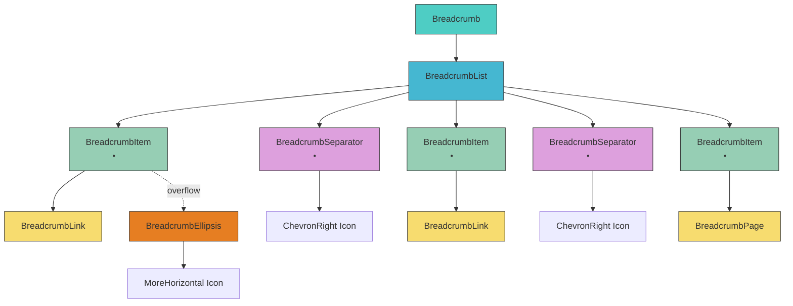

**Diagram sources**
- [breadcrumb.tsx](file://components/ui/breadcrumb.tsx#L1-L107)

## Detailed Component Analysis

### Breadcrumb Root Component
The Breadcrumb component serves as the root container for the entire navigation system, implementing proper accessibility semantics:

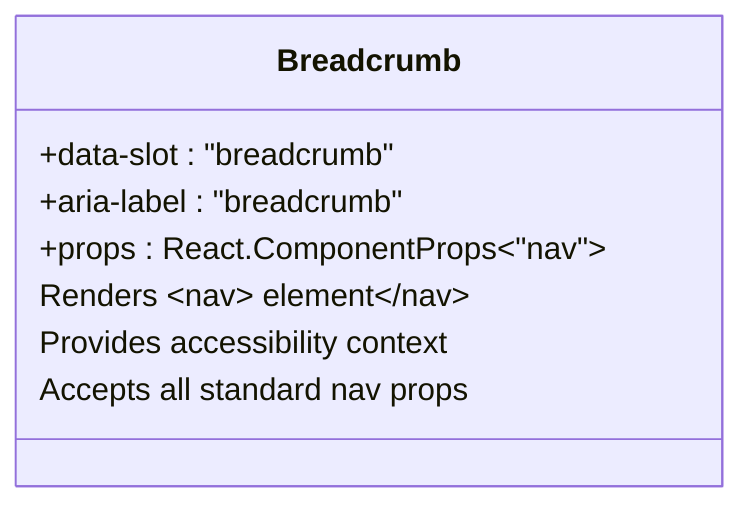

**Diagram sources**
- [breadcrumb.tsx](file://components/ui/breadcrumb.tsx#L7-L9)

### BreadcrumbList Component
The BreadcrumbList component creates the ordered list structure that contains all breadcrumb items:

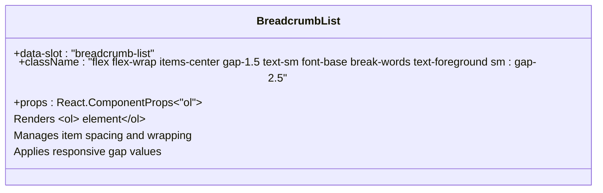

**Diagram sources**
- [breadcrumb.tsx](file://components/ui/breadcrumb.tsx#L11-L19)

### BreadcrumbItem Component
The BreadcrumbItem component represents individual items in the breadcrumb trail:

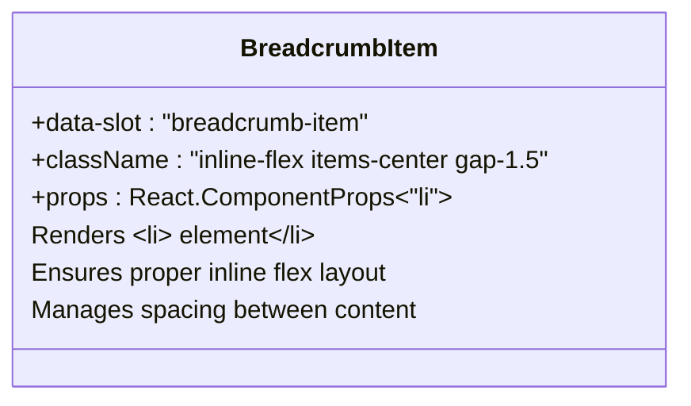

**Diagram sources**
- [breadcrumb.tsx](file://components/ui/breadcrumb.tsx#L21-L28)

### BreadcrumbLink Component
The BreadcrumbLink component implements the Radix UI Slot pattern for flexible composition:

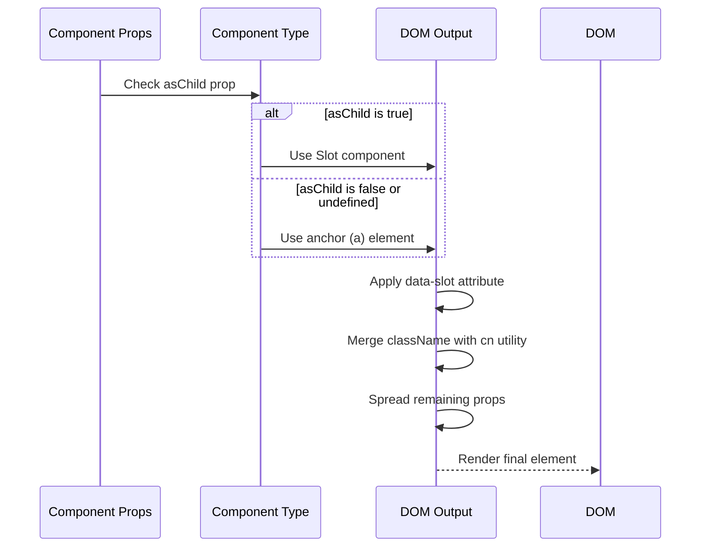

**Diagram sources**
- [breadcrumb.tsx](file://components/ui/breadcrumb.tsx#L30-L40)

### BreadcrumbPage Component
The BreadcrumbPage component identifies the current page in the navigation hierarchy:

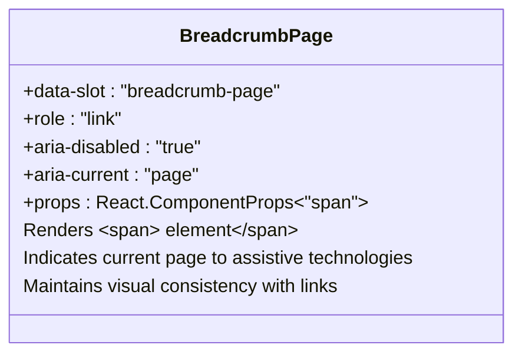

**Diagram sources**
- [breadcrumb.tsx](file://components/ui/breadcrumb.tsx#L42-L53)

### BreadcrumbSeparator Component
The BreadcrumbSeparator component automatically renders visual separators between breadcrumb items:

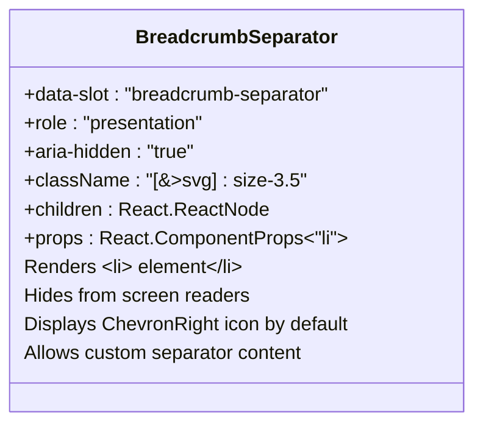

**Diagram sources**
- [breadcrumb.tsx](file://components/ui/breadcrumb.tsx#L55-L67)

### BreadcrumbEllipsis Component
The BreadcrumbEllipsis component handles overflow situations in constrained spaces:

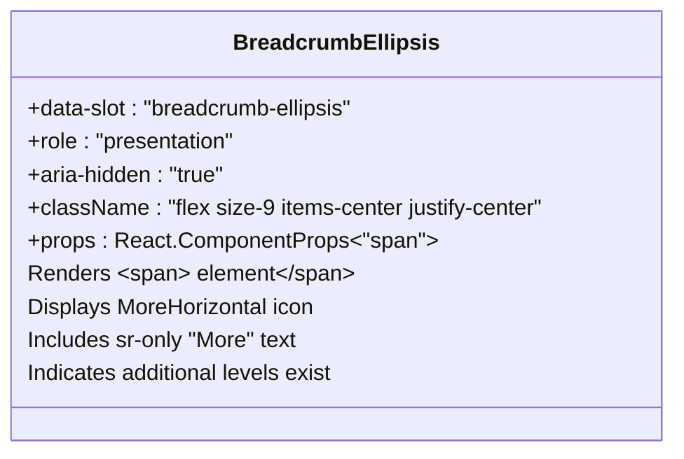

**Diagram sources**
- [breadcrumb.tsx](file://components/ui/breadcrumb.tsx#L69-L82)

## Accessibility Features
The Breadcrumb system implements comprehensive accessibility features to ensure usability for all users:

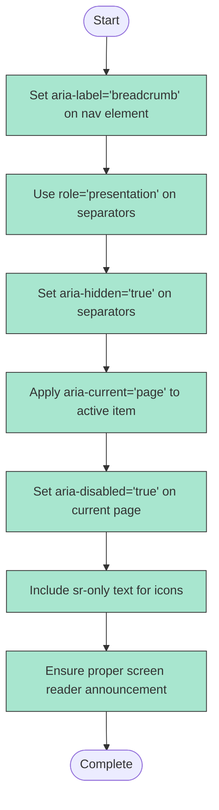

The implementation ensures that screen readers properly announce the breadcrumb navigation context, identify the current page, and skip decorative elements like separators. The `sr-only` class provides textual context for icon-only elements, enhancing accessibility without affecting visual design.

**Section sources**
- [breadcrumb.tsx](file://components/ui/breadcrumb.tsx#L7-L107)

## Styling and Customization
The Breadcrumb system uses the `cn` utility for className merging, enabling flexible customization while maintaining base styles:

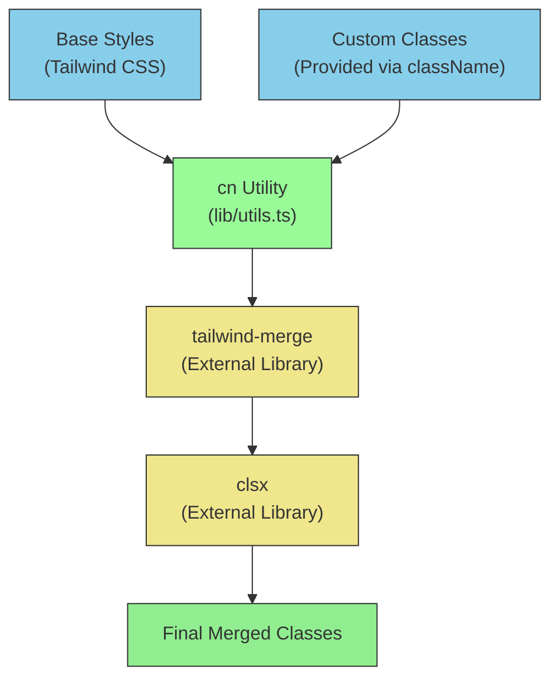

The `data-slot` attributes provide styling hooks for theme authors, allowing targeted CSS customization without relying on fragile class names. This approach enables consistent styling across the component library while supporting project-specific design requirements.

**Section sources**
- [breadcrumb.tsx](file://components/ui/breadcrumb.tsx#L1-L107)
- [utils.ts](file://lib/utils.ts#L1-L7)

## Common Issues and Solutions
Several common issues can arise when implementing breadcrumb navigation, along with their solutions:

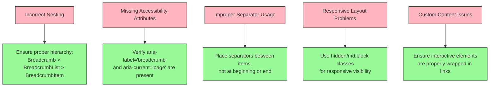

The implementation in `page.tsx` demonstrates proper usage with responsive handling, showing how to hide certain items on smaller screens while maintaining accessibility and functionality.

**Section sources**
- [breadcrumb.tsx](file://components/ui/breadcrumb.tsx#L1-L107)
- [page.tsx](file://app/page.tsx#L16-L50)

## Usage Examples
The Breadcrumb system can be composed in various ways to meet different navigation requirements:

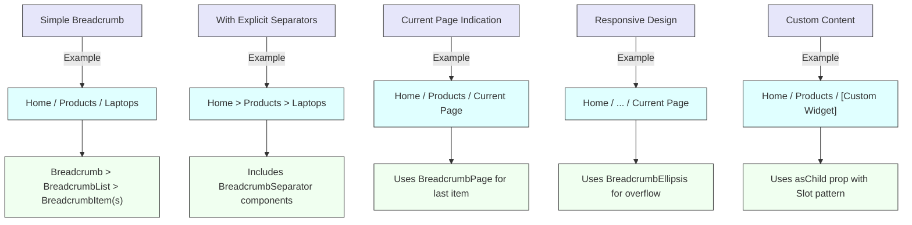

The example in `page.tsx` demonstrates a practical implementation with conditional rendering for different screen sizes, showing how to create a responsive breadcrumb trail that adapts to available space.

**Section sources**
- [page.tsx](file://app/page.tsx#L16-L50)
- [breadcrumb.tsx](file://components/ui/breadcrumb.tsx#L1-L107)

## Conclusion
The Breadcrumb Navigation system provides a robust, accessible, and flexible solution for hierarchical navigation within the application. By leveraging semantic HTML, the Radix UI Slot pattern, and comprehensive accessibility features, it ensures a consistent user experience across different devices and assistive technologies. The component architecture allows for easy customization through className merging and `data-slot` attributes, while maintaining proper separation of concerns. Developers can confidently implement breadcrumb navigation that meets both functional requirements and accessibility standards, enhancing the overall user experience of the application.