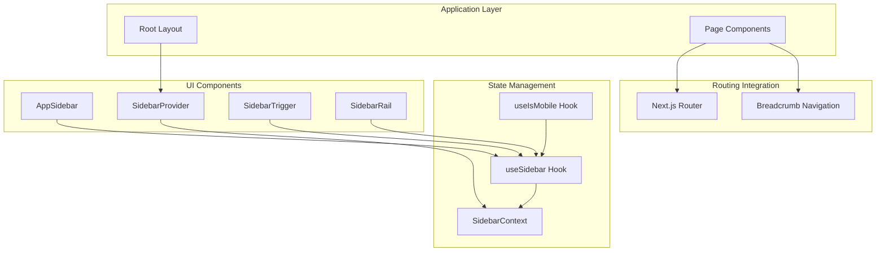
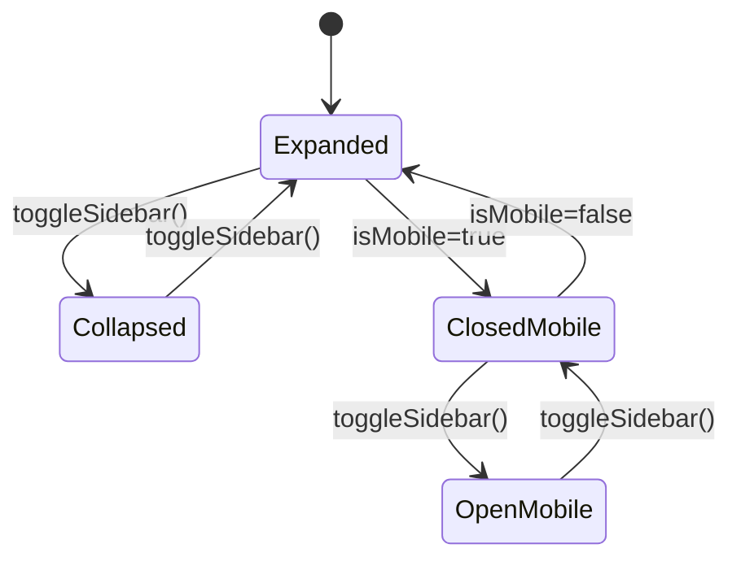
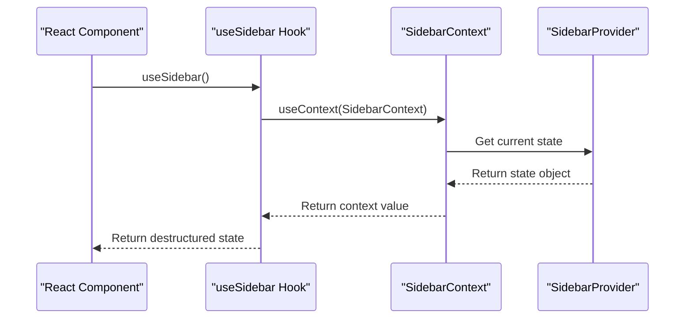
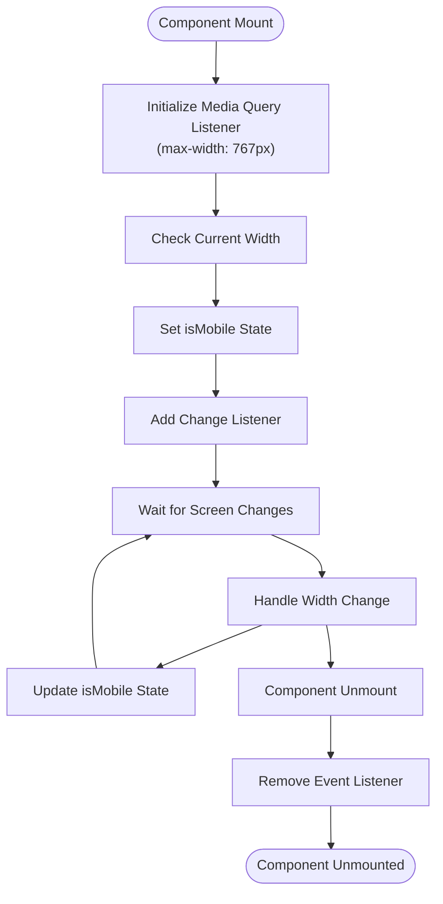
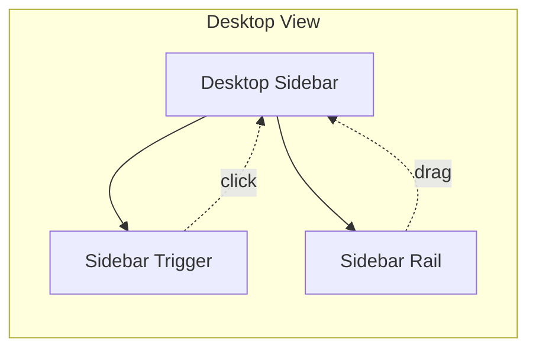
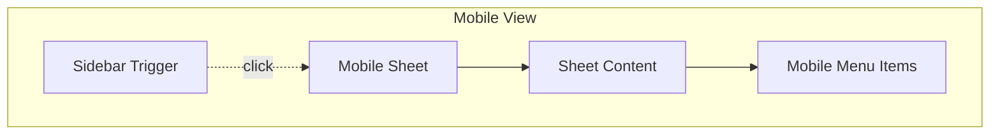
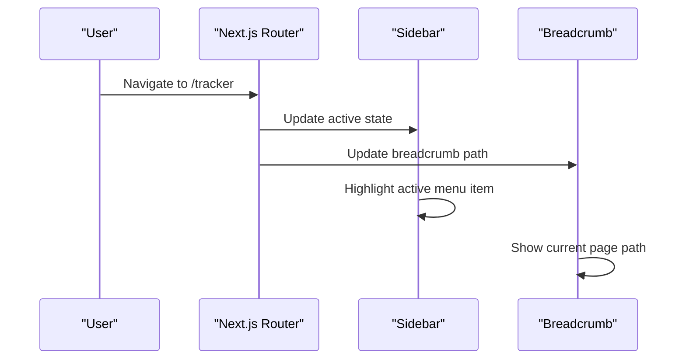
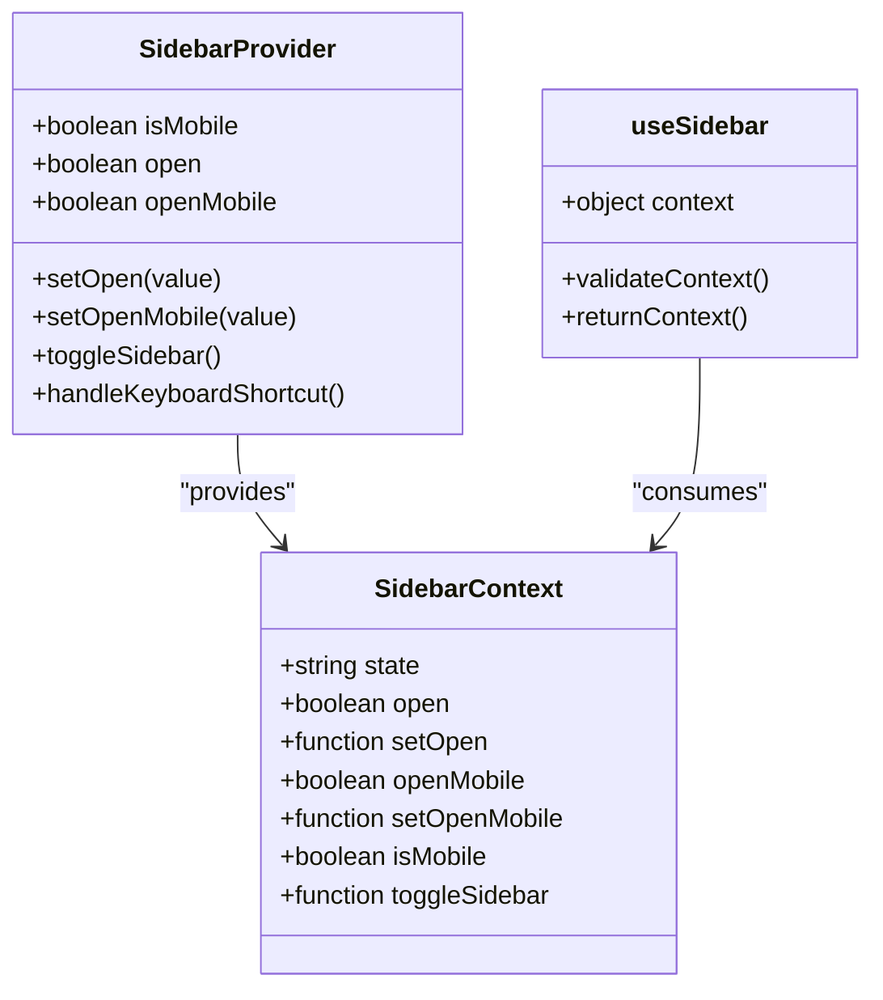
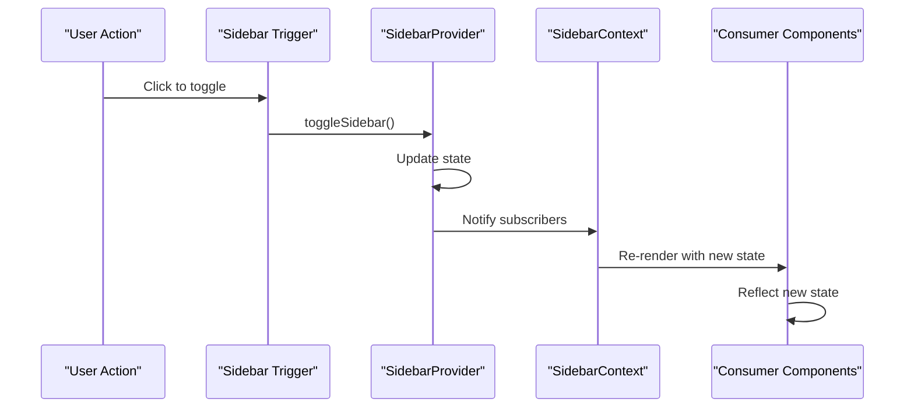
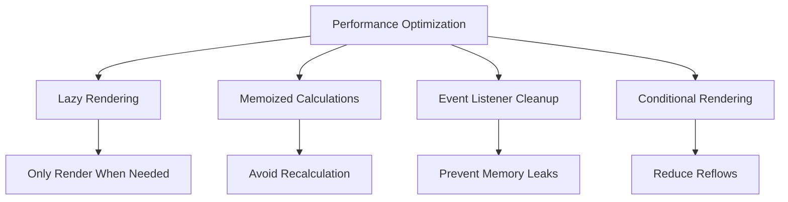

# Navigation State Management

<cite>
**Referenced Files in This Document**
- [app/layout.tsx](file://app/layout.tsx)
- [app/globals.css](file://app/globals.css)
- [app/page.tsx](file://app/page.tsx)
- [app/_components/Sidebar.tsx](file://app/_components/Sidebar.tsx)
- [components/ui/sidebar.tsx](file://components/ui/sidebar.tsx)
- [hooks/use-mobile.ts](file://hooks/use-mobile.ts)
- [components/ui/breadcrumb.tsx](file://components/ui/breadcrumb.tsx)
</cite>

## Table of Contents
1. [Introduction](#introduction)
2. [Architecture Overview](#architecture-overview)
3. [Sidebar Context Provider](#sidebar-context-provider)
4. [useSidebar Hook Implementation](#usesidebar-hook-implementation)
5. [Mobile Detection System](#mobile-detection-system)
6. [Responsive Behavior](#responsive-behavior)
7. [URL Routing Integration](#url-routing-integration)
8. [State Synchronization](#state-synchronization)
9. [Performance Considerations](#performance-considerations)
10. [Common Issues and Solutions](#common-issues-and-solutions)
11. [Best Practices](#best-practices)
12. [Conclusion](#conclusion)

## Introduction

The Navigation State Management system in this Next.js application provides comprehensive state management for sidebar navigation across all components. Built on React's Context API, it offers global state management for sidebar open/collapsed states, mobile detection, and responsive behavior coordination. The system seamlessly integrates with Next.js App Router's URL routing to maintain visual navigation state consistency.

The architecture follows modern React patterns with a centralized state management approach that ensures consistent behavior across desktop and mobile devices. The system automatically adapts to screen size changes and maintains state persistence through cookies.

## Architecture Overview

The navigation state management system consists of several interconnected components that work together to provide seamless sidebar functionality:



**Diagram sources**
- [app/layout.tsx](file://app/layout.tsx#L1-L35)
- [components/ui/sidebar.tsx](file://components/ui/sidebar.tsx#L1-L200)
- [app/page.tsx](file://app/page.tsx#L1-L52)

**Section sources**
- [components/ui/sidebar.tsx](file://components/ui/sidebar.tsx#L1-L200)
- [app/page.tsx](file://app/page.tsx#L1-L52)

## Sidebar Context Provider

The `SidebarProvider` component serves as the central state manager for all sidebar-related functionality. It creates a context that holds the current state and provides methods to modify it.

### Core State Properties

The `SidebarContextProps` interface defines the essential state properties:

```typescript
type SidebarContextProps = {
  state: "expanded" | "collapsed"
  open: boolean
  setOpen: (open: boolean) => void
  openMobile: boolean
  setOpenMobile: (open: boolean) => void
  isMobile: boolean
  toggleSidebar: () => void
}
```

### State Management Implementation

The provider manages both desktop and mobile states independently:



**Diagram sources**
- [components/ui/sidebar.tsx](file://components/ui/sidebar.tsx#L40-L120)

### Cookie Persistence

The system automatically persists the sidebar state using cookies:

```javascript
// Sets the cookie to keep the sidebar state
document.cookie = `${SIDEBAR_COOKIE_NAME}=${openState}; path=/; max-age=${SIDEBAR_COOKIE_MAX_AGE}`
```

**Section sources**
- [components/ui/sidebar.tsx](file://components/ui/sidebar.tsx#L25-L120)

## useSidebar Hook Implementation

The `useSidebar` hook provides convenient access to the sidebar context throughout the application. It encapsulates the complexity of context consumption and provides a clean API for components.

### Hook Functionality



**Diagram sources**
- [components/ui/sidebar.tsx](file://components/ui/sidebar.tsx#L35-L45)

### Available State Variables

Components consuming the hook receive the following state variables:

- `isMobile`: Boolean indicating if the current device is mobile
- `isOpen`: Current open state of the sidebar
- `isCollapsed`: Current collapsed state of the sidebar
- `openMobile`: Mobile-specific open state
- `toggleSidebar`: Function to toggle sidebar state
- `setOpen`: Function to set sidebar state programmatically

### Usage Examples

```typescript
// Basic state access
const { isMobile, isOpen } = useSidebar();

// State manipulation
const { toggleSidebar } = useSidebar();
<button onClick={toggleSidebar}>Toggle Sidebar</button>;

// Conditional rendering based on state
const { isMobile, state } = useSidebar();
if (isMobile) {
  return <MobileSidebar />;
} else {
  return <DesktopSidebar expanded={state === 'expanded'} />;
}
```

**Section sources**
- [components/ui/sidebar.tsx](file://components/ui/sidebar.tsx#L35-L45)
- [app/_components/Sidebar.tsx](file://app/_components/Sidebar.tsx#L70-L80)

## Mobile Detection System

The mobile detection system uses the `useIsMobile` hook to monitor screen size changes and provide responsive behavior. This hook leverages the native `window.matchMedia` API for accurate device detection.

### Implementation Details



**Diagram sources**
- [hooks/use-mobile.ts](file://hooks/use-mobile.ts#L1-L20)

### Breakpoint Configuration

The system uses a 768px breakpoint to distinguish between mobile and desktop devices:

```typescript
const MOBILE_BREAKPOINT = 768;

export function useIsMobile() {
  const [isMobile, setIsMobile] = React.useState<boolean | undefined>(undefined);
  
  React.useEffect(() => {
    const mql = window.matchMedia(`(max-width: ${MOBILE_BREAKPOINT - 1}px)`);
    const onChange = () => {
      setIsMobile(window.innerWidth < MOBILE_BREAKPOINT);
    };
    
    mql.addEventListener("change", onChange);
    setIsMobile(window.innerWidth < MOBILE_BREAKPOINT);
    
    return () => mql.removeEventListener("change", onChange);
  }, []);
  
  return !!isMobile;
}
```

### Responsive Behavior

The mobile detection affects multiple aspects of the navigation system:

- **Sidebar Positioning**: Dropdown menus appear at the bottom on mobile
- **Navigation Menu**: Mobile menu adapts to touch-friendly interactions
- **Layout Adaptation**: Content area adjusts to accommodate mobile sidebar

**Section sources**
- [hooks/use-mobile.ts](file://hooks/use-mobile.ts#L1-L20)
- [app/_components/Sidebar.tsx](file://app/_components/Sidebar.tsx#L200-L220)

## Responsive Behavior

The responsive behavior system coordinates between desktop and mobile views, ensuring optimal user experience across all devices.

### Desktop Behavior

On desktop devices, the sidebar operates with traditional expand/collapse functionality:



**Diagram sources**
- [components/ui/sidebar.tsx](file://components/ui/sidebar.tsx#L150-L200)

### Mobile Behavior

On mobile devices, the sidebar transforms into a sheet-based interface:



**Diagram sources**
- [components/ui/sidebar.tsx](file://components/ui/sidebar.tsx#L180-L200)

### Positioning Adaptation

The system automatically adjusts menu positioning based on device type:

```typescript
// Dropdown menu positioning based on device
side={isMobile ? "bottom" : "right"}

// Mobile-specific styling
className={`[--sidebar-width:${SIDEBAR_WIDTH_MOBILE}]`}
```

**Section sources**
- [components/ui/sidebar.tsx](file://components/ui/sidebar.tsx#L180-L200)
- [app/_components/Sidebar.tsx](file://app/_components/Sidebar.tsx#L200-L220)

## URL Routing Integration

The navigation state management system integrates seamlessly with Next.js App Router's URL routing to maintain visual navigation state consistency.

### Route-Based Active States

The sidebar navigation system uses URL-based active state detection:

```typescript
// Sample navigation data with URL-based activation
const data = {
  navMain: [
    {
      title: "Dashboard",
      url: "/",
      icon: SquareTerminal,
      isActive: true, // Current route
    },
    {
      title: "Activity Tracker",
      url: "/tracker",
      icon: Bot,
    },
  ],
};
```

### Breadcrumb Integration

The breadcrumb system works in conjunction with the sidebar to provide contextual navigation:



**Diagram sources**
- [app/page.tsx](file://app/page.tsx#L15-L35)

### Navigation State Synchronization

The system ensures that navigation state remains synchronized across all components:

- **Active Link Highlighting**: Menu items reflect current route
- **Breadcrumb Updates**: Navigation breadcrumbs update automatically
- **State Persistence**: User preferences persist across page reloads

**Section sources**
- [app/page.tsx](file://app/page.tsx#L15-L35)
- [app/_components/Sidebar.tsx](file://app/_components/Sidebar.tsx#L70-L150)

## State Synchronization

The state synchronization mechanism ensures that all components remain in sync with the current sidebar state, preventing desynchronization issues.

### Centralized State Management



**Diagram sources**
- [components/ui/sidebar.tsx](file://components/ui/sidebar.tsx#L40-L120)

### State Update Propagation

When state changes occur, they propagate through the component tree:



**Diagram sources**
- [components/ui/sidebar.tsx](file://components/ui/sidebar.tsx#L70-L90)

### Consistency Guarantees

The system provides several guarantees for state consistency:

- **Atomic Updates**: State changes are atomic and immediate
- **Immediate Propagation**: Changes propagate to all consumers instantly
- **Memory Efficiency**: Only affected components re-render
- **Error Prevention**: Context validation prevents runtime errors

**Section sources**
- [components/ui/sidebar.tsx](file://components/ui/sidebar.tsx#L40-L120)

## Performance Considerations

The navigation state management system is designed with performance optimization in mind, minimizing unnecessary re-renders and memory usage.

### Efficient State Updates

The system uses several optimization techniques:

```typescript
// useMemo for expensive calculations
const contextValue = React.useMemo<SidebarContextProps>(
  () => ({
    state,
    open,
    setOpen,
    isMobile,
    openMobile,
    setOpenMobile,
    toggleSidebar,
  }),
  [state, open, setOpen, isMobile, openMobile, setOpenMobile, toggleSidebar],
);
```

### Memory Management

- **Event Listener Cleanup**: Proper cleanup of media query listeners
- **Conditional Rendering**: Components render only when necessary
- **Lazy Loading**: Context consumers only subscribe when needed

### Optimization Strategies



### Best Practices for Performance

1. **Minimize Context Subscriptions**: Only consume necessary state properties
2. **Use Shallow Comparisons**: Ensure props are shallow compared for optimal re-rendering
3. **Batch State Updates**: Group related state changes when possible
4. **Optimize Media Queries**: Use efficient media query patterns

**Section sources**
- [components/ui/sidebar.tsx](file://components/ui/sidebar.tsx#L90-L120)
- [hooks/use-mobile.ts](file://hooks/use-mobile.ts#L10-L20)

## Common Issues and Solutions

This section addresses common problems encountered when working with the navigation state management system and provides practical solutions.

### State Desynchronization

**Problem**: Components show inconsistent state despite global state updates.

**Solution**: Ensure all components use the `useSidebar` hook correctly:

```typescript
// Incorrect - accessing context directly
const context = React.useContext(SidebarContext); // May cause issues

// Correct - using the hook
const { isMobile, isOpen } = useSidebar(); // Safe and reliable
```

### Mobile Detection Failures

**Problem**: Mobile detection doesn't work correctly on initial load.

**Solution**: The `useIsMobile` hook initializes asynchronously:

```typescript
// Handle loading state
const isMobile = useIsMobile();
if (isMobile === undefined) {
  return <LoadingSpinner />; // Show loading state until detection completes
}
```

### Memory Leaks

**Problem**: Event listeners not properly cleaned up causing memory leaks.

**Solution**: The system automatically handles cleanup:

```typescript
React.useEffect(() => {
  const mql = window.matchMedia(`(max-width: ${MOBILE_BREAKPOINT - 1}px)`);
  const onChange = () => {
    setIsMobile(window.innerWidth < MOBILE_BREAKPOINT);
  };
  
  mql.addEventListener("change", onChange);
  // Automatic cleanup via useEffect return function
  return () => mql.removeEventListener("change", onChange);
}, []);
```

### Performance Issues

**Problem**: Excessive re-renders causing performance degradation.

**Solution**: Use appropriate optimization techniques:

```typescript
// Use React.memo for expensive components
const OptimizedSidebar = React.memo(AppSidebar);

// Use useCallback for callback functions
const toggleHandler = React.useCallback(() => {
  toggleSidebar();
}, [toggleSidebar]);
```

### Cookie Persistence Issues

**Problem**: Sidebar state not persisting across sessions.

**Solution**: Verify cookie settings and browser support:

```typescript
// Check if cookies are enabled
if (navigator.cookieEnabled) {
  // Cookie-based persistence will work
} else {
  // Fallback to localStorage or other persistence
}
```

**Section sources**
- [components/ui/sidebar.tsx](file://components/ui/sidebar.tsx#L40-L50)
- [hooks/use-mobile.ts](file://hooks/use-mobile.ts#L10-L20)

## Best Practices

Following these best practices ensures optimal performance and maintainability of the navigation state management system.

### Component Design Guidelines

1. **Consistent State Access**: Always use the `useSidebar` hook for state access
2. **Proper Context Validation**: Never access context directly without validation
3. **Efficient Rendering**: Use appropriate memoization and conditional rendering
4. **Error Handling**: Implement graceful fallbacks for edge cases

### Code Organization

```typescript
// Good: Clear separation of concerns
export function AppSidebar() {
  const { isMobile, isOpen } = useSidebar();
  
  if (isMobile) {
    return <MobileSidebar />;
  }
  
  return <DesktopSidebar expanded={isOpen} />;
}

// Bad: Mixing concerns and violating separation of concerns
export function AppSidebar() {
  const [isMobile] = React.useState(window.innerWidth < 768);
  const [isOpen] = React.useState(true);
  
  // Complex logic that should be handled elsewhere
}
```

### Testing Strategies

1. **Unit Testing**: Test individual hooks and components in isolation
2. **Integration Testing**: Test state propagation across component boundaries
3. **E2E Testing**: Test complete user workflows involving navigation
4. **Accessibility Testing**: Ensure keyboard navigation works correctly

### Maintenance Tips

1. **Regular Audits**: Periodically review state management patterns
2. **Documentation Updates**: Keep documentation aligned with implementation
3. **Performance Monitoring**: Monitor bundle size and runtime performance
4. **Browser Compatibility**: Test across supported browsers and devices

## Conclusion

The Navigation State Management system provides a robust, scalable solution for managing sidebar navigation across desktop and mobile devices. By leveraging React's Context API and modern web technologies, it delivers seamless user experiences while maintaining code quality and performance.

Key strengths of the system include:

- **Centralized State Management**: Single source of truth for sidebar state
- **Responsive Design**: Automatic adaptation to different screen sizes
- **Performance Optimization**: Efficient rendering and minimal re-renders
- **Developer Experience**: Clean APIs and comprehensive documentation
- **Accessibility**: Full keyboard navigation support
- **Persistence**: State survives page reloads through cookies

The system successfully integrates with Next.js App Router's URL routing, ensuring that navigation state remains consistent across route changes. The modular architecture allows for easy extension and customization while maintaining backward compatibility.

Future enhancements could include advanced animation systems, gesture-based controls for mobile devices, and enhanced accessibility features. The solid foundation provided by the current implementation makes such improvements straightforward to implement.