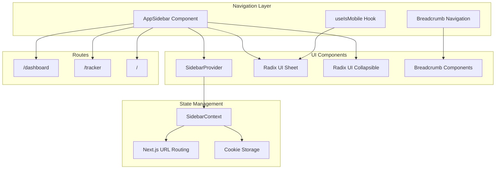
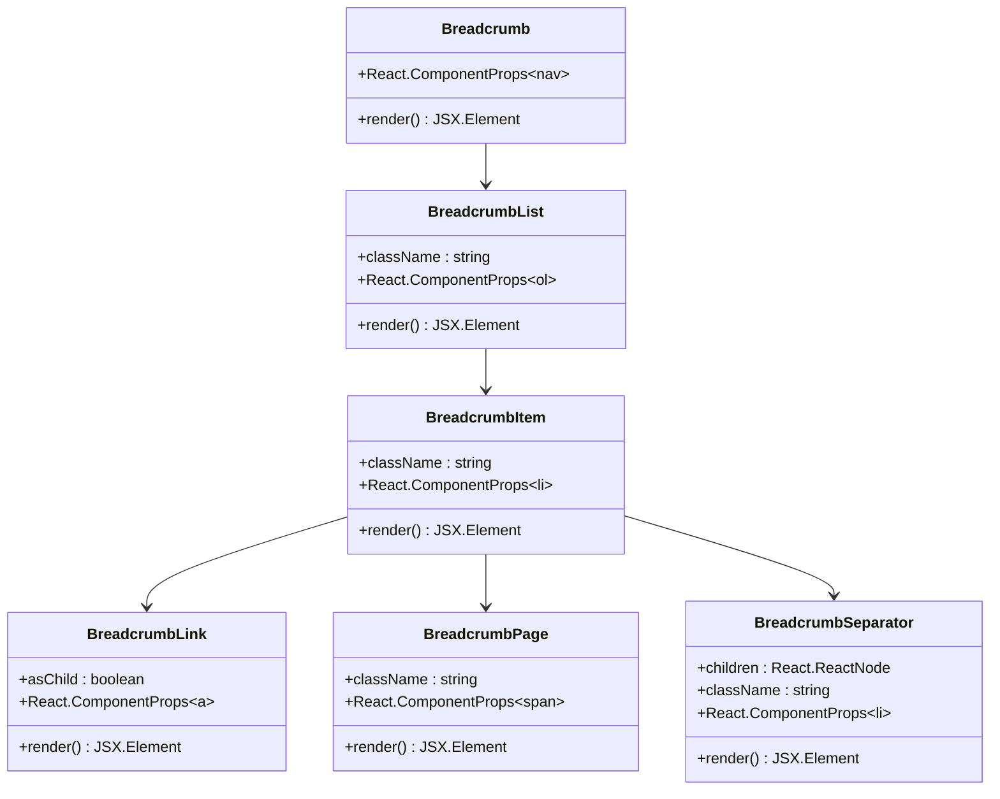
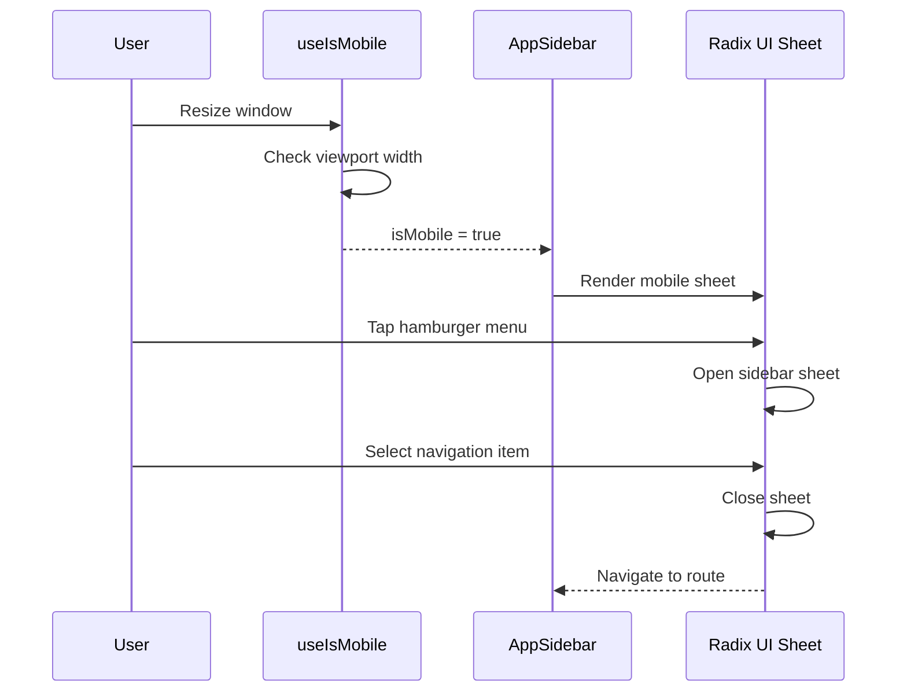
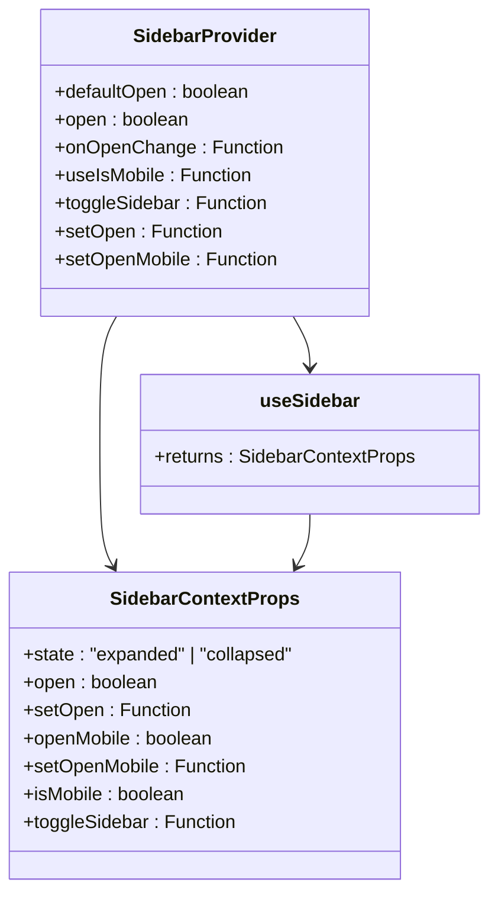
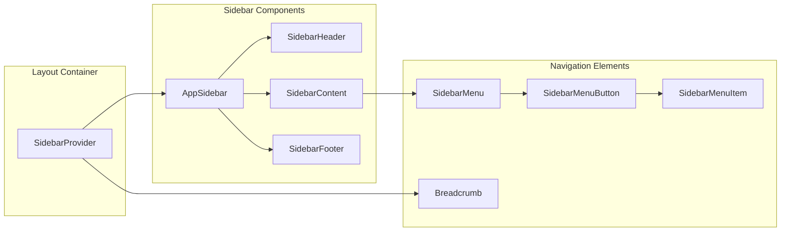

# Navigation System

<cite>
**Referenced Files in This Document**
- [app/_components/Sidebar.tsx](file://app/_components/Sidebar.tsx)
- [components/ui/breadcrumb.tsx](file://components/ui/breadcrumb.tsx)
- [components/ui/sidebar.tsx](file://components/ui/sidebar.tsx)
- [hooks/use-mobile.ts](file://hooks/use-mobile.ts)
- [components/ui/sheet.tsx](file://components/ui/sheet.tsx)
- [components/ui/collapsible.tsx](file://components/ui/collapsible.tsx)
- [app/page.tsx](file://app/page.tsx)
- [app/layout.tsx](file://app/layout.tsx)
- [app/dashboard/page.tsx](file://app/dashboard/page.tsx)
- [app/tracker/page.tsx](file://app/tracker/page.tsx)
- [app/globals.css](file://app/globals.css)
</cite>

## Table of Contents
1. [Introduction](#introduction)
2. [System Architecture](#system-architecture)
3. [AppSidebar Component](#appsidebar-component)
4. [Breadcrumb Navigation](#breadcrumb-navigation)
5. [Mobile-Specific Behavior](#mobile-specific-behavior)
6. [Navigation State Management](#navigation-state-management)
7. [Integration Patterns](#integration-patterns)
8. [Adding New Navigation Items](#adding-new-navigation-items)
9. [Styling and Theming](#styling-and-theming)
10. [Best Practices](#best-practices)

## Introduction

The navigation system in this activity tracker application is built around a dual navigation approach combining a sophisticated sidebar component with breadcrumb navigation. This system provides seamless navigation between key application areas while maintaining responsive behavior across different device sizes.

The navigation architecture leverages Radix UI primitives for accessibility and composability, implementing both desktop and mobile-first approaches. The system manages navigation state through Next.js App Router's URL routing mechanism, synchronized with a centralized SidebarContext that controls the sidebar's open/collapsed state.

## System Architecture

The navigation system consists of several interconnected components that work together to provide a cohesive user experience:



**Diagram sources**
- [app/_components/Sidebar.tsx](file://app/_components/Sidebar.tsx#L1-L270)
- [components/ui/sidebar.tsx](file://components/ui/sidebar.tsx#L1-L716)
- [hooks/use-mobile.ts](file://hooks/use-mobile.ts#L1-L20)

## AppSidebar Component

The `AppSidebar` component serves as the primary navigation interface, providing access to the application's main routes through a collapsible sidebar structure. Built on top of Radix UI's Sheet and Collapsible components, it offers both desktop and mobile navigation experiences.

### Core Features

The sidebar implements several key features:

**Route-Based Navigation**: The sidebar automatically generates navigation links based on predefined route configurations. Currently supporting `/`, `/dashboard`, and `/tracker` routes.

**Collapsible Structure**: Uses Radix UI's Collapsible component to create expandable menu groups, allowing for hierarchical navigation organization.

**Responsive Design**: Adapts its behavior based on screen size, switching between full-width desktop navigation and mobile sheet-based navigation.

**User Profile Integration**: Includes a dropdown menu with user account actions and profile information.

### Navigation Item Configuration

The sidebar uses a structured data model for navigation items:

```typescript
interface NavItem {
  title: string;
  url: string;
  icon?: React.ComponentType;
  isActive?: boolean;
  items?: SubNavItem[];
}

interface SubNavItem {
  title: string;
  url: string;
}
```

The current configuration includes:

- **Dashboard**: Primary route (`/`) with square terminal icon
- **Activity Tracker**: Secondary route (`/tracker`) with bot icon
- **Leave Application**: Expandable group with sub-items for application and history
- **Comp-Off Request**: Standalone route (`/compoff`) with settings icon

### Active Link Styling

The sidebar implements visual feedback for active links through the `isActive` property and contextual styling:

```typescript
<SidebarMenuButton
  asChild
  className="data-[state=open]:bg-main data-[state=open]:outline-border data-[state=open]:text-main-foreground"
  tooltip={item.title}
>
  <a href={item.url}>
    {item.icon && <item.icon />}
    <span>{item.title}</span>
  </a>
</SidebarMenuButton>
```

**Section sources**
- [app/_components/Sidebar.tsx](file://app/_components/Sidebar.tsx#L45-L85)
- [app/_components/Sidebar.tsx](file://app/_components/Sidebar.tsx#L120-L180)

## Breadcrumb Navigation

The breadcrumb system provides hierarchical context within the application, helping users understand their current location and navigate back through the application structure.

### Component Structure

The breadcrumb implementation follows a modular approach using Radix UI primitives:



**Diagram sources**
- [components/ui/breadcrumb.tsx](file://components/ui/breadcrumb.tsx#L1-L107)

### Hierarchical Context

The breadcrumb system displays the current page's position within the application hierarchy. For example, in the main page:

```jsx
<Breadcrumb>
  <BreadcrumbList>
    <BreadcrumbItem className="hidden md:block">
      <BreadcrumbLink href="#">Building Your Application</BreadcrumbLink>
    </BreadcrumbItem>
    <BreadcrumbSeparator className="hidden md:block" />
    <BreadcrumbItem>
      <BreadcrumbPage>Data Fetching</BreadcrumbPage>
    </BreadcrumbItem>
  </BreadcrumbList>
</Breadcrumb>
```

This creates a visual representation of the navigation path, with separators and appropriate spacing for different screen sizes.

### Responsive Behavior

The breadcrumb adapts its display based on screen size:
- Desktop: Shows full breadcrumb trail with separators
- Mobile: Hides breadcrumb items for better space utilization

**Section sources**
- [components/ui/breadcrumb.tsx](file://components/ui/breadcrumb.tsx#L1-L107)
- [app/page.tsx](file://app/page.tsx#L15-L25)

## Mobile-Specific Behavior

The navigation system includes sophisticated mobile-specific behavior through the `useIsMobile` hook and Radix UI's Sheet component.

### Mobile Detection

The `useIsMobile` hook provides responsive breakpoint detection:

```typescript
const MOBILE_BREAKPOINT = 768

export function useIsMobile() {
  const [isMobile, setIsMobile] = React.useState<boolean | undefined>(undefined)

  React.useEffect(() => {
    const mql = window.matchMedia(`(max-width: ${MOBILE_BREAKPOINT - 1}px)`)
    const onChange = () => {
      setIsMobile(window.innerWidth < MOBILE_BREAKPOINT)
    }
    mql.addEventListener("change", onChange)
    setIsMobile(window.innerWidth < MOBILE_BREAKPOINT)
    return () => mql.removeEventListener("change", onChange)
  }, [])

  return !!isMobile
}
```

### Mobile Navigation Implementation

When the application detects a mobile viewport, it switches to a sheet-based navigation approach:



**Diagram sources**
- [hooks/use-mobile.ts](file://hooks/use-mobile.ts#L1-L20)
- [components/ui/sidebar.tsx](file://components/ui/sidebar.tsx#L150-L180)

### Mobile-Specific Features

- **Sheet Overlay**: Full-screen overlay with slide animation
- **Touch-Friendly**: Larger touch targets and gesture support
- **Orientation Awareness**: Different positioning based on device orientation
- **Keyboard Shortcuts**: Accessible keyboard navigation

**Section sources**
- [hooks/use-mobile.ts](file://hooks/use-mobile.ts#L1-L20)
- [components/ui/sidebar.tsx](file://components/ui/sidebar.tsx#L150-L180)

## Navigation State Management

The navigation system uses a centralized state management approach through the SidebarContext, which synchronizes with Next.js URL routing.

### SidebarContext Architecture



**Diagram sources**
- [components/ui/sidebar.tsx](file://components/ui/sidebar.tsx#L30-L40)
- [components/ui/sidebar.tsx](file://components/ui/sidebar.tsx#L50-L120)

### State Synchronization

The sidebar maintains state synchronization through several mechanisms:

**URL Routing Integration**: Navigation changes trigger URL updates, which are reflected in the sidebar's active state.

**Cookie Persistence**: The sidebar state is persisted across sessions using cookies, ensuring users maintain their preferred view.

**Real-time Updates**: Changes to the sidebar state are immediately reflected in the UI and synchronized with other components.

### State Properties

The SidebarContext provides the following state properties:

- `state`: Current state ("expanded" or "collapsed")
- `open`: Boolean indicating whether sidebar is open
- `openMobile`: Boolean for mobile-specific state
- `isMobile`: Boolean indicating current device type
- `toggleSidebar`: Function to toggle sidebar state

**Section sources**
- [components/ui/sidebar.tsx](file://components/ui/sidebar.tsx#L30-L40)
- [components/ui/sidebar.tsx](file://components/ui/sidebar.tsx#L50-L120)

## Integration Patterns

The navigation system integrates seamlessly with the rest of the application through established patterns and conventions.

### Layout Integration

The navigation components integrate with the application layout through the SidebarProvider:

```jsx
<SidebarProvider>
  <AppSidebar />
  <SidebarInset>
    <header className="flex h-16 shrink-0 items-center gap-2">
      <div className="flex items-center gap-2 px-4">
        <SidebarTrigger className="-ml-1" />
        <Breadcrumb>
          {/* Breadcrumb content */}
        </Breadcrumb>
      </div>
    </header>
    <div className="flex flex-1 flex-col gap-4 p-4 pt-0">
      {/* Main content */}
    </div>
  </SidebarInset>
</SidebarProvider>
```

### Component Composition

The navigation system follows a composition-based architecture:



**Diagram sources**
- [app/page.tsx](file://app/page.tsx#L10-L30)
- [app/_components/Sidebar.tsx](file://app/_components/Sidebar.tsx#L85-L120)

### Route Integration

The navigation system works seamlessly with Next.js App Router:

- **Automatic Route Discovery**: Navigation items correspond to existing routes
- **Dynamic URL Generation**: Links are generated based on route configuration
- **Active State Management**: Current route is highlighted automatically

**Section sources**
- [app/page.tsx](file://app/page.tsx#L10-L30)
- [app/_components/Sidebar.tsx](file://app/_components/Sidebar.tsx#L45-L85)

## Adding New Navigation Items

The navigation system is designed for easy extension, allowing developers to add new navigation items following established patterns.

### Step-by-Step Process

1. **Update Navigation Data**: Add new items to the `data.navMain` array in `AppSidebar.tsx`

```typescript
const data = {
  navMain: [
    // Existing items...
    {
      title: "New Feature",
      url: "/new-feature",
      icon: NewFeatureIcon,
    },
    {
      title: "Settings",
      url: "/settings",
      icon: SettingsIcon,
      items: [
        {
          title: "Profile",
          url: "/settings/profile",
        },
        {
          title: "Preferences",
          url: "/settings/preferences",
        },
      ],
    },
  ],
};
```

2. **Create Route Component**: Implement the corresponding page component in the `app` directory

```typescript
// app/new-feature/page.tsx
import React from "react";

function NewFeaturePage() {
  return <div>New Feature Content</div>;
}

export default NewFeaturePage;
```

3. **Add Icon Import**: Import the appropriate Lucide icon component

```typescript
import { NewFeatureIcon } from "lucide-react";
```

4. **Style Integration**: Ensure proper styling through Tailwind classes and theme variables

### Best Practices for New Items

- **Consistent Naming**: Use clear, descriptive names for navigation items
- **Proper Icons**: Choose appropriate Lucide icons that represent functionality
- **Logical Grouping**: Place related items together in the navigation structure
- **Accessibility**: Ensure proper ARIA labels and keyboard navigation support

## Styling and Theming

The navigation system leverages a comprehensive theming system that ensures consistent visual design across all components.

### Color System

The application uses a modern color system with OKLCH color space:

```css
:root {
  --background: oklch(93.46% 0.0305 255.11);
  --secondary-background: oklch(100% 0 0);
  --foreground: oklch(0% 0 0);
  --main-foreground: oklch(0% 0 0);
  --main: oklch(67.47% 0.1726 259.49);
  --border: oklch(0% 0 0);
  --ring: oklch(0% 0 0);
  --overlay: oklch(0% 0 0 / 0.8);
}
```

### Theme Variables

The system defines comprehensive theme variables for consistent styling:

- **Primary Colors**: Main brand colors and accent colors
- **Background Colors**: Base backgrounds and secondary backgrounds
- **Text Colors**: Foreground text and interactive text
- **Border Colors**: Element borders and dividers
- **Shadow Effects**: Box shadows and overlay effects

### Responsive Typography

The navigation system includes responsive typography that adjusts based on screen size:

```css
.text-sm {
  font-size: 0.875rem;
  line-height: 1.25rem;
}

.text-base {
  font-size: 1rem;
  line-height: 1.5rem;
}

@media (min-width: 768px) {
  .text-sm {
    font-size: 0.875rem;
    line-height: 1.25rem;
  }
}
```

**Section sources**
- [app/globals.css](file://app/globals.css#L1-L74)

## Best Practices

### Performance Optimization

- **Lazy Loading**: Navigation components are lazy-loaded to improve initial page load times
- **Code Splitting**: Separate bundles for navigation and content components
- **Memory Management**: Proper cleanup of event listeners and subscriptions

### Accessibility Standards

- **Keyboard Navigation**: Full keyboard support for all navigation elements
- **Screen Reader Support**: Proper ARIA labels and roles for assistive technologies
- **Focus Management**: Logical focus order and visible focus indicators

### Mobile Optimization

- **Touch Targets**: Minimum 44px touch targets for mobile interactions
- **Gesture Support**: Swipe gestures for navigation on touch devices
- **Performance**: Optimized animations and transitions for smooth mobile experience

### Security Considerations

- **Route Validation**: Proper validation of navigation URLs
- **CSRF Protection**: Secure cross-site request forgery protection
- **XSS Prevention**: Proper sanitization of navigation content

### Testing Strategies

- **Unit Tests**: Individual component testing for navigation elements
- **Integration Tests**: End-to-end testing of navigation flows
- **Accessibility Tests**: Automated accessibility testing for compliance

The navigation system provides a robust foundation for application navigation, combining modern web development practices with accessibility standards and performance optimization. Its modular architecture allows for easy maintenance and extension while maintaining consistency across the application.