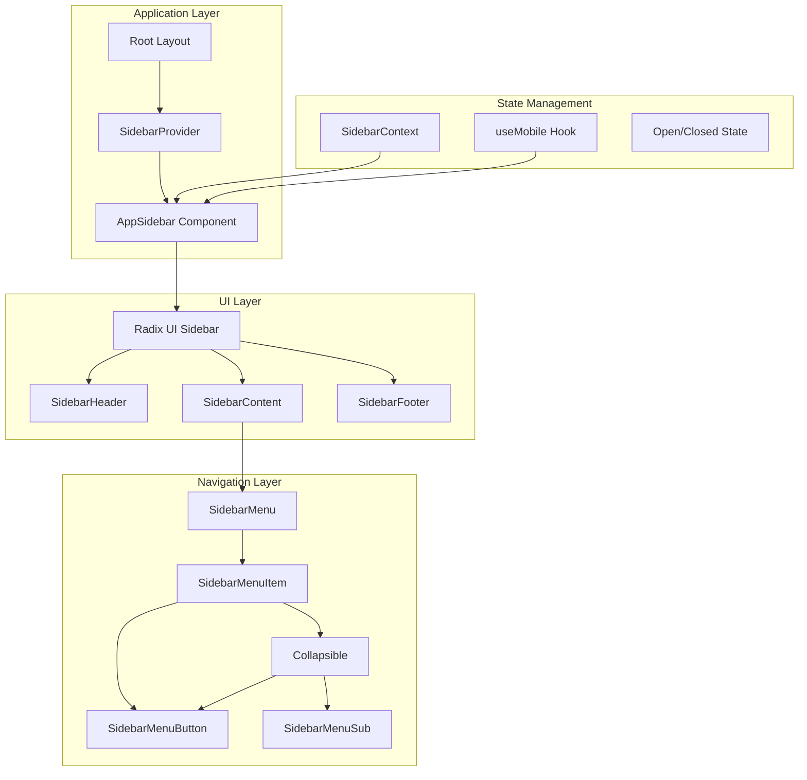
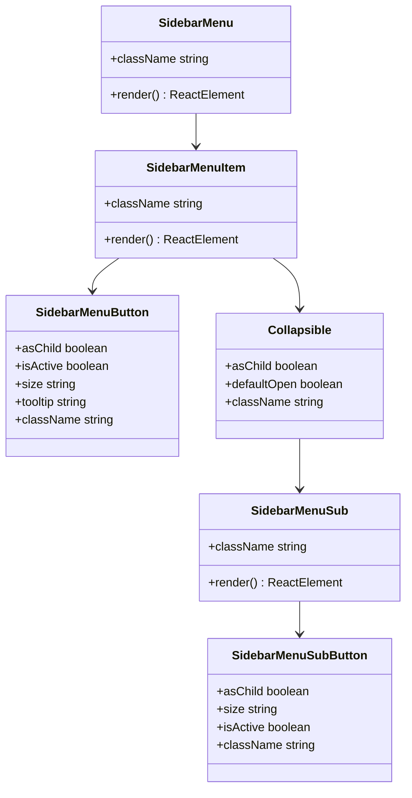
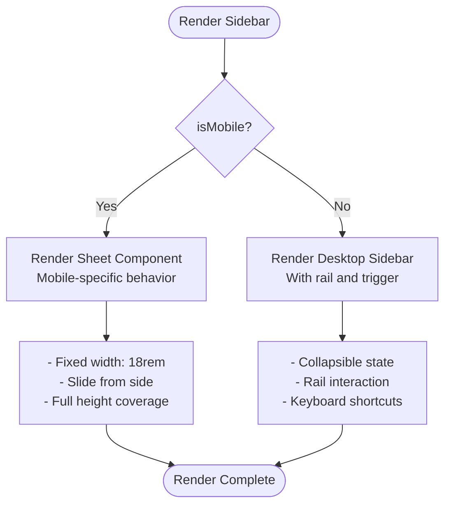

# Sidebar Navigation Component Implementation

<cite>
**Referenced Files in This Document**
- [app/_components/Sidebar.tsx](file://app/_components/Sidebar.tsx)
- [components/ui/sidebar.tsx](file://components/ui/sidebar.tsx)
- [hooks/use-mobile.ts](file://hooks/use-mobile.ts)
- [app/layout.tsx](file://app/layout.tsx)
- [app/page.tsx](file://app/page.tsx)
- [app/dashboard/page.tsx](file://app/dashboard/page.tsx)
- [app/tracker/page.tsx](file://app/tracker/page.tsx)
- [app/globals.css](file://app/globals.css)
</cite>

## Table of Contents
1. [Introduction](#introduction)
2. [Architecture Overview](#architecture-overview)
3. [Core Components](#core-components)
4. [Navigation Structure](#navigation-structure)
5. [State Management](#state-management)
6. [Responsive Behavior](#responsive-behavior)
7. [Styling and Theming](#styling-and-theming)
8. [Implementation Details](#implementation-details)
9. [Common Issues and Solutions](#common-issues-and-solutions)
10. [Best Practices](#best-practices)

## Introduction

The Sidebar Navigation component is a sophisticated primary navigation system built using Radix UI's Sidebar primitives. It provides intuitive navigation between key application routes including `/`, `/dashboard`, and `/tracker`. The implementation demonstrates advanced React patterns including context management, component composition, and responsive design principles.

The sidebar serves as the central hub for user navigation, featuring collapsible sections, nested menu items, and adaptive behavior for different screen sizes. It integrates seamlessly with the application's routing system while maintaining accessibility standards and modern design aesthetics.

## Architecture Overview

The sidebar architecture follows a hierarchical component structure with clear separation of concerns:



**Diagram sources**
- [app/_components/Sidebar.tsx](file://app/_components/Sidebar.tsx#L1-L270)
- [components/ui/sidebar.tsx](file://components/ui/sidebar.tsx#L1-L716)

## Core Components

### AppSidebar Component

The `AppSidebar` component serves as the main container and orchestrator for the navigation system. It encapsulates the entire sidebar functionality and manages the integration between different UI primitives.

```typescript
export function AppSidebar({ ...props }: React.ComponentProps<typeof Sidebar>) {
  const { isMobile } = useSidebar();
  
  return (
    <Sidebar collapsible="icon" {...props}>
      {/* Header, Content, Footer sections */}
    </Sidebar>
  );
}
```

The component leverages the `useSidebar()` hook to access contextual state and provides the `isMobile` flag for responsive behavior determination.

### SidebarProvider

The `SidebarProvider` establishes the global state context for the sidebar, managing open/closed states and mobile/desktop adaptations:

```typescript
function SidebarProvider({
  defaultOpen = true,
  open: openProp,
  onOpenChange: setOpenProp,
  className,
  style,
  children,
  ...props
}: React.ComponentProps<"div"> & {
  defaultOpen?: boolean;
  open?: boolean;
  onOpenChange?: (open: boolean) => void;
}) {
  const isMobile = useIsMobile();
  const [openMobile, setOpenMobile] = React.useState(false);
  
  // State management logic...
}
```

**Section sources**
- [app/_components/Sidebar.tsx](file://app/_components/Sidebar.tsx#L75-L270)
- [components/ui/sidebar.tsx](file://components/ui/sidebar.tsx#L55-L131)

## Navigation Structure

The navigation system is built around a structured menu hierarchy using specialized components:

### Navigation Data Structure

The sidebar uses a declarative data structure to define navigation items:

```typescript
const data = {
  navMain: [
    {
      title: "Dashboard",
      url: "/",
      icon: SquareTerminal,
      isActive: true,
    },
    {
      title: "Activity Tracker",
      url: "/tracker",
      icon: Bot,
    },
    {
      title: "Leave Application",
      url: "/leaves",
      icon: BookOpen,
      items: [
        {
          title: "Leave Application",
          url: "/leaves/application",
        },
        {
          title: "Leave History",
          url: "/leaves/history",
        },
      ],
    },
    {
      title: "Comp-Off Request",
      url: "/compoff",
      icon: Settings2,
    },
  ],
};
```

### Menu Components Hierarchy



**Diagram sources**
- [components/ui/sidebar.tsx](file://components/ui/sidebar.tsx#L445-L473)
- [components/ui/sidebar.tsx](file://components/ui/sidebar.tsx#L630-L677)

### Dynamic Menu Rendering

The sidebar dynamically renders menu items based on the data structure:

```typescript
{data.navMain.map((item) =>
  item.items && item.items.length > 0 ? (
    <Collapsible
      key={item.title}
      asChild
      defaultOpen={item.isActive}
      className="group/collapsible"
    >
      {/* Collapsible menu with sub-items */}
    </Collapsible>
  ) : (
    <SidebarMenuItem key={item.title}>
      <SidebarMenuButton asChild>
        <a href={item.url}>
          {item.icon && <item.icon />}
          <span>{item.title}</span>
        </a>
      </SidebarMenuButton>
    </SidebarMenuItem>
  )
)}
```

**Section sources**
- [app/_components/Sidebar.tsx](file://app/_components/Sidebar.tsx#L111-L171)

## State Management

### SidebarContext

The sidebar state management relies on a custom React context that provides centralized state access:

```typescript
type SidebarContextProps = {
  state: "expanded" | "collapsed";
  open: boolean;
  setOpen: (open: boolean) => void;
  openMobile: boolean;
  setOpenMobile: (open: boolean) => void;
  isMobile: boolean;
  toggleSidebar: () => void;
}

const SidebarContext = React.createContext<SidebarContextProps | null>(null);

function useSidebar() {
  const context = React.useContext(SidebarContext);
  if (!context) {
    throw new Error("useSidebar must be used within a SidebarProvider.");
  }
  return context;
}
```

### State Synchronization

The provider manages state synchronization across different components:

```typescript
const [_open, _setOpen] = React.useState(defaultOpen);
const open = openProp ?? _open;
const setOpen = React.useCallback(
  (value: boolean | ((value: boolean) => boolean)) => {
    const openState = typeof value === "function" ? value(open) : value;
    if (setOpenProp) {
      setOpenProp(openState);
    } else {
      _setOpen(openState);
    }
    // Persist state to cookies
    document.cookie = `${SIDEBAR_COOKIE_NAME}=${openState}; path=/; max-age=${SIDEBAR_COOKIE_MAX_AGE}`;
  },
  [setOpenProp, open],
);
```

**Section sources**
- [components/ui/sidebar.tsx](file://components/ui/sidebar.tsx#L35-L54)
- [components/ui/sidebar.tsx](file://components/ui/sidebar.tsx#L75-L105)

## Responsive Behavior

### Mobile Detection

The sidebar implements responsive behavior through a dedicated mobile detection hook:

```typescript
const MOBILE_BREAKPOINT = 768;

export function useIsMobile() {
  const [isMobile, setIsMobile] = React.useState<boolean | undefined>(undefined);

  React.useEffect(() => {
    const mql = window.matchMedia(`(max-width: ${MOBILE_BREAKPOINT - 1}px)`);
    const onChange = () => {
      setIsMobile(window.innerWidth < MOBILE_BREAKPOINT);
    };
    mql.addEventListener("change", onChange);
    setIsMobile(window.innerWidth < MOBILE_BREAKPOINT);
    return () => mql.removeEventListener("change", onChange);
  }, []);

  return !!isMobile;
}
```

### Adaptive Rendering

The sidebar adapts its rendering based on device type:



**Diagram sources**
- [components/ui/sidebar.tsx](file://components/ui/sidebar.tsx#L145-L240)

### Dropdown Positioning

The sidebar adjusts dropdown positioning based on mobile state:

```typescript
<DropdownMenuContent
  className="w-[--radix-dropdown-menu-trigger-width] min-w-56"
  side={isMobile ? "bottom" : "right"}
  align="end"
  sideOffset={4}
>
```

**Section sources**
- [hooks/use-mobile.ts](file://hooks/use-mobile.ts#L1-L20)
- [app/_components/Sidebar.tsx](file://app/_components/Sidebar.tsx#L200-L210)

## Styling and Theming

### Tailwind CSS Integration

The sidebar leverages Tailwind CSS for responsive styling with data attributes:

```typescript
<SidebarMenuButton
  className="data-[state=open]:bg-main data-[state=open]:outline-border data-[state=open]:text-main-foreground"
  tooltip={item.title}
/>
```

### Color System

The application uses a comprehensive color system defined in CSS custom properties:

```css
:root {
  --background: oklch(93.46% 0.0305 255.11);
  --secondary-background: oklch(100% 0 0);
  --foreground: oklch(0% 0 0);
  --main-foreground: oklch(0% 0 0);
  --main: oklch(67.47% 0.1726 259.49);
  --border: oklch(0% 0 0);
  --ring: oklch(0% 0 0);
}
```

### Conditional Styling

The sidebar implements conditional styling based on state:

```mermaid
stateDiagram-v2
[*] --> Expanded
Expanded --> Collapsed : Toggle
Collapsed --> Expanded : Toggle
state Expanded {
[*] --> FullWidth
FullWidth --> ShowIcons
ShowIcons --> ShowLabels
}
state Collapsed {
[*] --> IconOnly
IconOnly --> HiddenLabels
HiddenLabels --> Tooltips
}
Expanded : Width : 16rem
Expanded : Icons + Labels
Expanded : Hover States
Collapsed : Width : 3rem
Collapsed : Icon Only
Collapsed : Tooltips
```

**Diagram sources**
- [components/ui/sidebar.tsx](file://components/ui/sidebar.tsx#L145-L240)

**Section sources**
- [app/globals.css](file://app/globals.css#L1-L74)
- [app/_components/Sidebar.tsx](file://app/_components/Sidebar.tsx#L143-L150)

## Implementation Details

### Collapsible Sections

Nested navigation items use the `Collapsible` component for expandable sections:

```typescript
<Collapsible
  key={item.title}
  asChild
  defaultOpen={item.isActive}
  className="group/collapsible"
>
  <SidebarMenuItem>
    <CollapsibleTrigger asChild>
      <SidebarMenuButton
        className="data-[state=open]:bg-main data-[state=open]:outline-border data-[state=open]:text-main-foreground"
        tooltip={item.title}
      >
        {item.icon && <item.icon />}
        <span>{item.title}</span>
        <ChevronRight className="ml-auto transition-transform duration-200 group-data-[state=open]/collapsible:rotate-90" />
      </SidebarMenuButton>
    </CollapsibleTrigger>
    <CollapsibleContent>
      <SidebarMenuSub>
        {item.items?.map((subItem) => (
          <SidebarMenuSubItem key={subItem.title}>
            <SidebarMenuSubButton asChild>
              <a href={subItem.url}>
                <span>{subItem.title}</span>
              </a>
            </SidebarMenuSubButton>
          </SidebarMenuSubItem>
        ))}
      </SidebarMenuSub>
    </CollapsibleContent>
  </SidebarMenuItem>
</Collapsible>
```

### Active Link Styling

Active links are styled using data attributes and Tailwind conditional classes:

```typescript
<SidebarMenuButton
  asChild
  className="data-[state=open]:bg-main data-[state=open]:outline-border data-[state=open]:text-main-foreground"
  tooltip={item.title}
>
  <a href={item.url}>
    {item.icon && <item.icon />}
    <span>{item.title}</span>
  </a>
</SidebarMenuButton>
```

### Keyboard Shortcuts

The sidebar implements keyboard shortcuts for accessibility:

```typescript
React.useEffect(() => {
  const handleKeyDown = (event: KeyboardEvent) => {
    if (
      event.key === SIDEBAR_KEYBOARD_SHORTCUT &&
      (event.metaKey || event.ctrlKey)
    ) {
      event.preventDefault();
      toggleSidebar();
    }
  };

  window.addEventListener("keydown", handleKeyDown);
  return () => window.removeEventListener("keydown", handleKeyDown);
}, [toggleSidebar]);
```

**Section sources**
- [app/_components/Sidebar.tsx](file://app/_components/Sidebar.tsx#L111-L171)
- [components/ui/sidebar.tsx](file://components/ui/sidebar.tsx#L107-L131)

## Common Issues and Solutions

### Issue 1: Incorrect URL Routing

**Problem**: Navigation links not working correctly or redirecting to wrong pages.

**Solution**: Verify URL paths match Next.js route structure and use proper anchor tags:

```typescript
// Correct implementation
<a href={item.url}>
  {item.icon && <item.icon />}
  <span>{item.title}</span>
</a>

// Avoid direct React Router usage
// <Link href={item.url}>...</Link> // Not compatible with Next.js
```

### Issue 2: State Synchronization Problems

**Problem**: Sidebar state not persisting across page reloads or sessions.

**Solution**: Ensure proper cookie management and state initialization:

```typescript
// Cookie persistence is handled automatically
document.cookie = `${SIDEBAR_COOKIE_NAME}=${openState}; path=/; max-age=${SIDEBAR_COOKIE_MAX_AGE}`;

// Initialize with proper defaults
<SidebarProvider defaultOpen={true}>
```

### Issue 3: Mobile Responsiveness Issues

**Problem**: Sidebar not adapting properly on mobile devices.

**Solution**: Verify mobile detection and responsive breakpoints:

```typescript
// Ensure mobile hook is properly implemented
const isMobile = useIsMobile();

// Check CSS media queries
@media (max-width: 767px) {
  /* Mobile styles */
}
```

### Issue 4: Styling Conflicts

**Problem**: Custom styles overriding sidebar styles or vice versa.

**Solution**: Use proper CSS specificity and Tailwind utilities:

```typescript
// Use data attributes for specificity
.data-[state=open]:bg-main

// Leverage Tailwind's data attribute support
.group-data-[collapsible=icon]:hidden
```

## Best Practices

### Component Composition

1. **Use Semantic Components**: Always use the provided Radix UI components rather than creating custom implementations
2. **Leverage Props**: Utilize component props for customization instead of hardcoding values
3. **Maintain Hierarchy**: Follow the established component hierarchy for consistent behavior

### State Management

1. **Centralized State**: Use the `SidebarProvider` for global state management
2. **Context Usage**: Access state through `useSidebar()` hook rather than prop drilling
3. **Cookie Persistence**: Implement state persistence for better user experience

### Accessibility

1. **Keyboard Navigation**: Ensure all interactive elements are keyboard accessible
2. **Screen Readers**: Use appropriate ARIA labels and roles
3. **Focus Management**: Implement proper focus handling for collapsible sections

### Performance

1. **Conditional Rendering**: Use conditional rendering for expensive components
2. **Memoization**: Memoize expensive calculations and component renders
3. **Lazy Loading**: Consider lazy loading for large navigation datasets

### Testing

1. **Unit Tests**: Test individual components in isolation
2. **Integration Tests**: Test component interactions and state changes
3. **Accessibility Tests**: Verify compliance with accessibility standards

The Sidebar Navigation component demonstrates modern React development practices with comprehensive state management, responsive design, and accessibility features. By following the documented patterns and best practices, developers can effectively maintain and extend this navigation system for their applications.