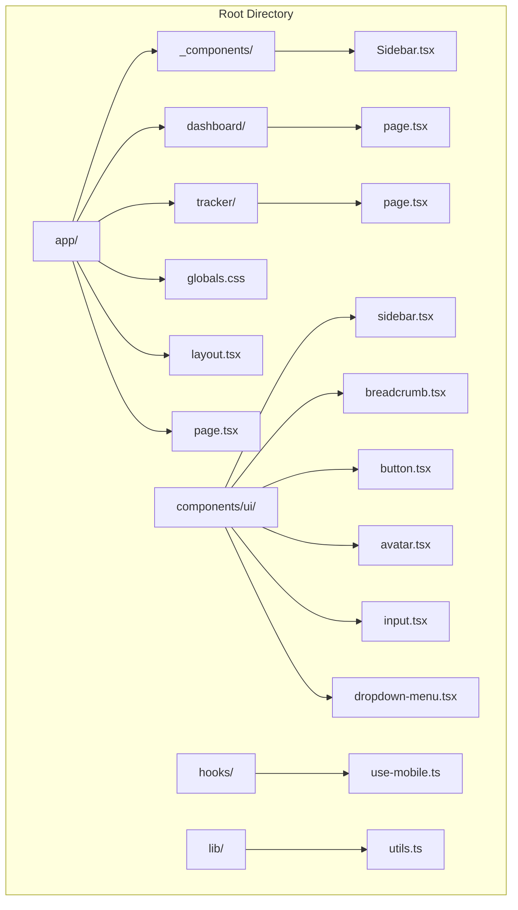
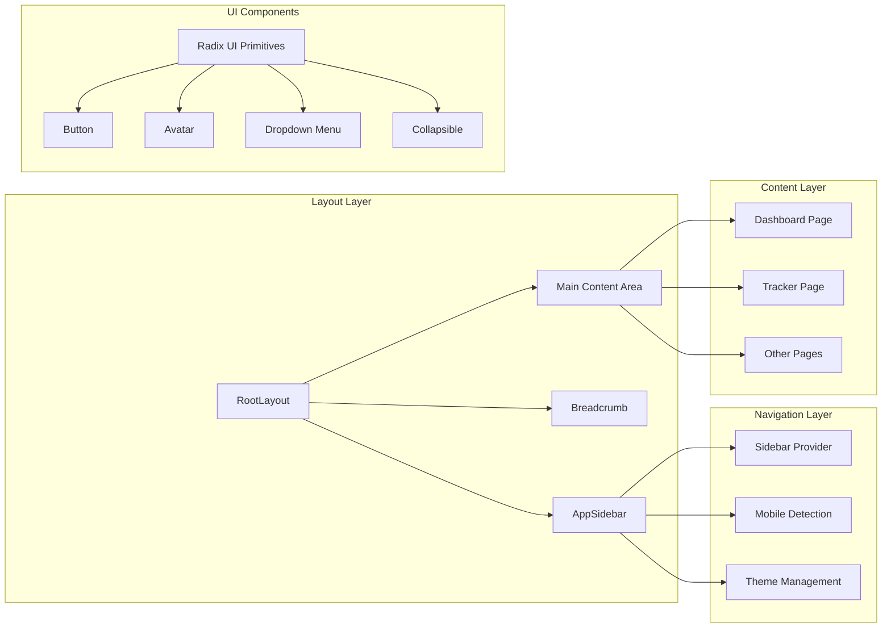
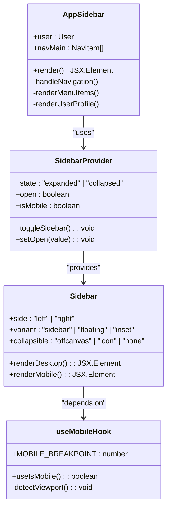
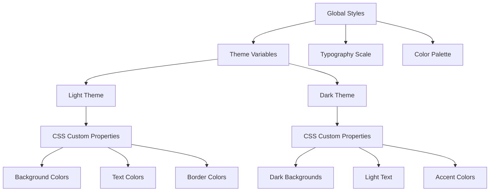

# Project Overview

<cite>
**Referenced Files in This Document**
- [README.md](file://README.md)
- [package.json](file://package.json)
- [app/layout.tsx](file://app/layout.tsx)
- [app/_components/Sidebar.tsx](file://app/_components/Sidebar.tsx)
- [hooks/use-mobile.ts](file://hooks/use-mobile.ts)
- [components/ui/sidebar.tsx](file://components/ui/sidebar.tsx)
- [app/dashboard/page.tsx](file://app/dashboard/page.tsx)
- [app/tracker/page.tsx](file://app/tracker/page.tsx)
- [app/globals.css](file://app/globals.css)
- [components/ui/breadcrumb.tsx](file://components/ui/breadcrumb.tsx)
- [lib/utils.ts](file://lib/utils.ts)
</cite>

## Table of Contents
1. [Introduction](#introduction)
2. [Project Structure](#project-structure)
3. [Core Technologies](#core-technologies)
4. [Application Architecture](#application-architecture)
5. [Key Features](#key-features)
6. [Component Analysis](#component-analysis)
7. [Responsive Design](#responsive-design)
8. [Styling System](#styling-system)
9. [Development Setup](#development-setup)
10. [Target Audience](#target-audience)

## Introduction

The Activity Tracker is a modern web application built with Next.js 16, React 19, and Tailwind CSS, designed as a comprehensive frontend dashboard for tracking user activities. This application serves as a practical example for frontend developers building dashboard-based applications, showcasing contemporary web development patterns and best practices.

The primary goal of this project is to provide an intuitive, responsive interface that enables users to efficiently track and monitor their daily activities through a well-structured navigation system featuring a sidebar and breadcrumb components. The application supports both light and dark themes, ensuring optimal user experience across different environments.

## Project Structure

The application follows a clean, modular architecture organized around the Next.js App Router structure:



**Diagram sources**
- [app/layout.tsx](file://app/layout.tsx#L1-L35)
- [app/_components/Sidebar.tsx](file://app/_components/Sidebar.tsx#L1-L270)
- [components/ui/sidebar.tsx](file://components/ui/sidebar.tsx#L1-L716)

**Section sources**
- [package.json](file://package.json#L1-L43)
- [app/layout.tsx](file://app/layout.tsx#L1-L35)

## Core Technologies

### Next.js 16
The application leverages Next.js 16 as its foundational framework, providing:

- **App Router**: Modern routing system with file-based routing
- **React Server Components**: Enhanced performance through server-side rendering
- **Automatic Optimizations**: Built-in image optimization and font loading
- **TypeScript Support**: Full type safety across the application

### React 19
Utilizes the latest React version with:

- **Enhanced Developer Experience**: Improved debugging and performance
- **Server Components**: Seamless integration with Next.js App Router
- **New Hooks**: Access to latest React features and improvements

### Tailwind CSS v4
Modern styling solution with:

- **Utility-First Approach**: Rapid development with atomic CSS classes
- **Dark Mode Support**: Built-in theme switching capabilities
- **Customizable Design System**: Flexible color schemes and typography
- **Performance Optimized**: Purging unused styles for production builds

**Section sources**
- [package.json](file://package.json#L10-L25)
- [app/globals.css](file://app/globals.css#L1-L74)

## Application Architecture

The application follows a component-based architecture with clear separation of concerns:



**Diagram sources**
- [app/layout.tsx](file://app/layout.tsx#L15-L35)
- [app/_components/Sidebar.tsx](file://app/_components/Sidebar.tsx#L1-L270)
- [components/ui/sidebar.tsx](file://components/ui/sidebar.tsx#L1-L716)

The architecture emphasizes:

- **Modular Design**: Clear separation between layout, navigation, and content
- **Reusability**: Shared components across the application
- **Accessibility**: Built-in support for screen readers and keyboard navigation
- **Performance**: Optimized bundle sizes and efficient rendering

**Section sources**
- [app/layout.tsx](file://app/layout.tsx#L1-L35)
- [components/ui/sidebar.tsx](file://components/ui/sidebar.tsx#L1-L100)

## Key Features

### Dashboard Navigation System
The application provides a sophisticated navigation system centered around the sidebar component:

- **Hierarchical Menu Structure**: Organized navigation with expandable sections
- **Active State Management**: Visual indicators for current page and sections
- **Responsive Behavior**: Adaptive layout for different screen sizes
- **Keyboard Shortcuts**: Bypass navigation with Ctrl/Cmd+B

### Activity Tracking Interface
The tracker page serves as the primary interface for monitoring user activities:

- **Real-time Updates**: Dynamic content display for activity tracking
- **Progress Monitoring**: Visual representation of activity completion
- **Historical Data**: Access to past activity records
- **Filtering Options**: Customizable views for different activity types

### Responsive Layout
The application adapts seamlessly across devices:

- **Mobile-First Design**: Optimized experience for smaller screens
- **Touch-Friendly Interactions**: Large touch targets and gestures
- **Adaptive Typography**: Scalable text for different viewport sizes
- **Flexible Grid System**: Responsive grid layouts for content organization

**Section sources**
- [app/_components/Sidebar.tsx](file://app/_components/Sidebar.tsx#L80-L150)
- [hooks/use-mobile.ts](file://hooks/use-mobile.ts#L1-L20)

## Component Analysis

### Sidebar Component Architecture

The sidebar implementation demonstrates advanced React patterns and accessibility features:



**Diagram sources**
- [app/_components/Sidebar.tsx](file://app/_components/Sidebar.tsx#L100-L270)
- [components/ui/sidebar.tsx](file://components/ui/sidebar.tsx#L50-L150)
- [hooks/use-mobile.ts](file://hooks/use-mobile.ts#L1-L20)

### Theme System Implementation

The application features a sophisticated theme system supporting both light and dark modes:

- **CSS Custom Properties**: Centralized color management through variables
- **Automatic Detection**: Browser preference-based theme selection
- **User Preference Persistence**: Cookie-based theme storage
- **Smooth Transitions**: Animated theme switching with CSS transitions

### Breadcrumb Navigation

The breadcrumb component provides contextual navigation:

- **Semantic HTML**: Proper ARIA labels and roles for accessibility
- **Dynamic Generation**: Automatic breadcrumb creation from route structure
- **Overflow Handling**: Ellipsis display for long navigation chains
- **Interactive Elements**: Clickable links with proper focus management

**Section sources**
- [app/_components/Sidebar.tsx](file://app/_components/Sidebar.tsx#L1-L270)
- [components/ui/sidebar.tsx](file://components/ui/sidebar.tsx#L1-L200)
- [components/ui/breadcrumb.tsx](file://components/ui/breadcrumb.tsx#L1-L107)

## Responsive Design

The application implements a comprehensive responsive design strategy:

### Mobile Detection System
The `useIsMobile` hook provides precise viewport detection:

```typescript
const MOBILE_BREAKPOINT = 768
export function useIsMobile() {
  const [isMobile, setIsMobile] = React.useState<boolean | undefined>(undefined)
  // Event listener for viewport changes
  const onChange = () => {
    setIsMobile(window.innerWidth < MOBILE_BREAKPOINT)
  }
}
```

### Adaptive Layout Patterns
- **Mobile-First Approach**: Base styles optimized for small screens
- **Progressive Enhancement**: Additional features for larger viewports
- **Flexible Grid System**: CSS Grid and Flexbox for responsive layouts
- **Touch-Optimized Interactions**: Appropriate spacing and gesture support

### Cross-Device Compatibility
- **Touch Devices**: Optimized touch targets and gestures
- **Desktop Browsers**: Mouse-friendly interactions and keyboard shortcuts
- **Screen Readers**: Comprehensive ARIA support and semantic markup
- **High Contrast Modes**: Accessibility compliance for users with visual impairments

**Section sources**
- [hooks/use-mobile.ts](file://hooks/use-mobile.ts#L1-L20)
- [components/ui/sidebar.tsx](file://components/ui/sidebar.tsx#L100-L200)

## Styling System

### Tailwind CSS Integration
The application leverages Tailwind CSS v4 for rapid development and consistent styling:



**Diagram sources**
- [app/globals.css](file://app/globals.css#L1-L74)
- [lib/utils.ts](file://lib/utils.ts#L1-L7)

### Utility Classes and Composition
The styling system emphasizes utility-first development:

- **Atomic Classes**: Small, reusable CSS classes
- **Composition Patterns**: Building complex designs from simple utilities
- **Responsive Variants**: Breakpoint-specific styling with `sm:`, `md:`, `lg:`
- **State Variants**: Hover, focus, and active state management

### Color System
The application implements a comprehensive color system:

- **Primary Palette**: Main brand colors with semantic meanings
- **Secondary Palette**: Supporting colors for backgrounds and accents
- **Neutral Palette**: Grayscale variations for text and borders
- **Chart Colors**: Specific colors for data visualization

**Section sources**
- [app/globals.css](file://app/globals.css#L1-L74)
- [lib/utils.ts](file://lib/utils.ts#L1-L7)

## Development Setup

### Prerequisites
- **Node.js**: Version 18 or higher
- **Package Manager**: pnpm recommended (configured in package.json)
- **IDE**: VS Code with recommended extensions

### Installation Steps
```bash
# Clone the repository
git clone [repository-url]

# Navigate to project directory
cd activity-tracker

# Install dependencies
pnpm install

# Start development server
pnpm dev

# Open browser at http://localhost:3000
```

### Build and Deployment
```bash
# Production build
pnpm build

# Start production server
pnpm start

# Run linting
pnpm lint
```

**Section sources**
- [README.md](file://README.md#L1-L37)
- [package.json](file://package.json#L1-L43)

## Target Audience

### Primary Users
- **Frontend Developers**: Seeking examples of modern dashboard implementations
- **React Developers**: Interested in Next.js App Router patterns
- **UI/UX Designers**: Looking for responsive design inspiration
- **Product Managers**: Evaluating dashboard-based application architectures

### Skill Level Considerations
- **Beginners**: Can understand basic component structure and navigation patterns
- **Intermediate**: Can leverage the codebase for learning advanced React patterns
- **Advanced**: Can customize and extend the application for specific use cases

### Learning Outcomes
By studying this project, developers will gain insights into:

- **Modern Web Development**: Latest frameworks and libraries
- **Component Architecture**: Best practices for reusable UI components
- **Responsive Design**: Practical implementation of mobile-first principles
- **Accessibility**: Built-in accessibility features and ARIA support
- **Performance Optimization**: Efficient rendering and bundle optimization

This documentation provides a comprehensive overview of the Activity Tracker application, highlighting its architectural decisions, technical implementation, and educational value for frontend developers seeking to build modern dashboard applications.