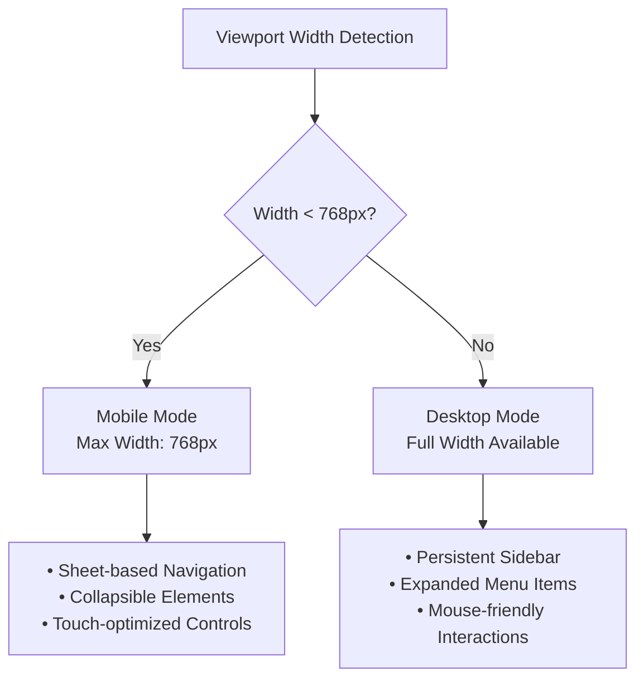
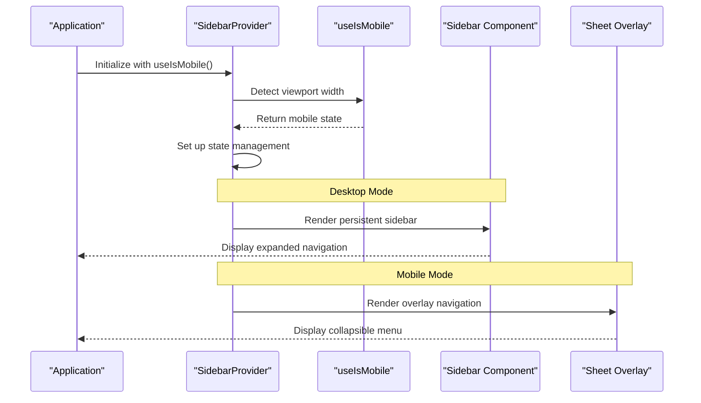
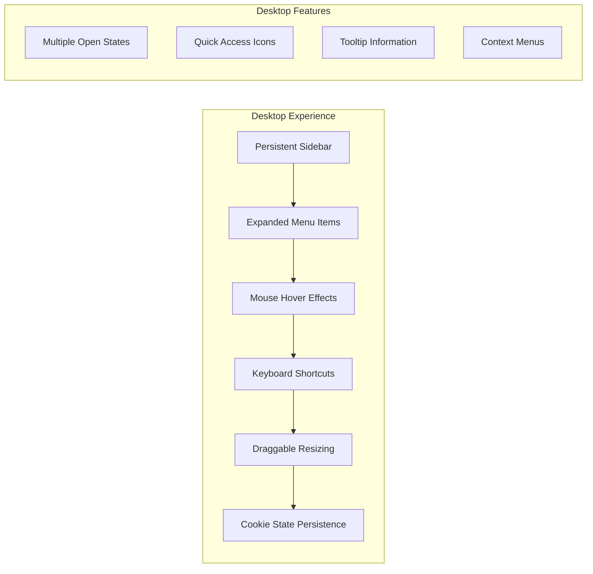
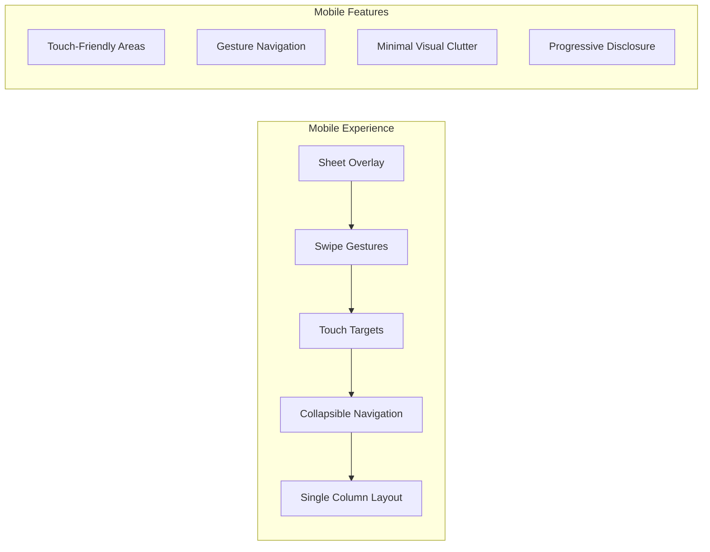

# Responsive Design Implementation

<cite>
**Referenced Files in This Document**
- [hooks/use-mobile.ts](file://hooks/use-mobile.ts)
- [components/ui/sidebar.tsx](file://components/ui/sidebar.tsx)
- [components/ui/sheet.tsx](file://components/ui/sheet.tsx)
- [components/ui/collapsible.tsx](file://components/ui/collapsible.tsx)
- [app/_components/Sidebar.tsx](file://app/_components/Sidebar.tsx)
- [app/layout.tsx](file://app/layout.tsx)
- [app/globals.css](file://app/globals.css)
</cite>

## Table of Contents
1. [Introduction](#introduction)
2. [Mobile Detection Hook](#mobile-detection-hook)
3. [Breakpoint Strategy](#breakpoint-strategy)
4. [Sidebar Responsive Behavior](#sidebar-responsive-behavior)
5. [Mobile vs Desktop Interactions](#mobile-vs-desktop-interactions)
6. [Performance Optimizations](#performance-optimizations)
7. [Extending Responsive Behavior](#extending-responsive-behavior)
8. [CSS Architecture](#css-architecture)
9. [Best Practices](#best-practices)
10. [Troubleshooting](#troubleshooting)

## Introduction

The activity tracker application implements a sophisticated responsive design system centered around the `useIsMobile` custom hook. This hook leverages modern browser capabilities to detect viewport width and automatically adapt the user interface between mobile and desktop layouts. The implementation follows a mobile-first approach with intelligent breakpoint detection at 768px, ensuring optimal user experience across all device sizes.

The responsive design system is built on several key principles: minimal re-renders through efficient media query handling, seamless transitions between mobile and desktop modes, and consistent behavior across all UI components. This architecture enables developers to create components that automatically adapt to different screen sizes without manual breakpoint management.

## Mobile Detection Hook

The foundation of the responsive design system lies in the `useIsMobile` custom hook, which provides real-time viewport detection using the native `window.matchMedia` API.

```typescript
const MOBILE_BREAKPOINT = 768

export function useIsMobile() {
  const [isMobile, setIsMobile] = React.useState<boolean | undefined>(undefined)

  React.useEffect(() => {
    const mql = window.matchMedia(`(max-width: ${MOBILE_BREAKPOINT - 1}px)`)
    const onChange = () => {
      setIsMobile(window.innerWidth < MOBILE_BREAKPOINT)
    }
    mql.addEventListener("change", onChange)
    setIsMobile(window.innerWidth < MOBILE_BREAKPOINT)
    return () => mql.removeEventListener("change", onChange)
  }, [])

  return !!isMobile
}
```

### Implementation Details

The hook employs several advanced techniques for reliable mobile detection:

**Initial State Management**: The hook starts with an undefined state to handle server-side rendering scenarios gracefully. This prevents hydration mismatches when the application renders on the client side.

**Efficient Media Query Setup**: Instead of using CSS media queries, the hook creates a native matchMedia query that responds to viewport changes. This approach offers better performance and more reliable updates compared to CSS-based solutions.

**Automatic Cleanup**: The effect properly cleans up event listeners to prevent memory leaks and ensure the hook behaves predictably during component unmounting.

**Immediate Evaluation**: On initial mount, the hook immediately evaluates the current viewport width, providing instant feedback to components that depend on the mobile state.

**Section sources**
- [hooks/use-mobile.ts](file://hooks/use-mobile.ts#L1-L20)

## Breakpoint Strategy

The application uses a carefully chosen breakpoint strategy centered around 768px, which aligns with common industry standards for distinguishing between mobile and tablet devices versus desktop computers.

### Breakpoint Configuration



### Responsive Width Variables

The system defines specific width constants for different contexts:

- **SIDEBAR_WIDTH**: 16rem - Full desktop sidebar width
- **SIDEBAR_WIDTH_MOBILE**: 18rem - Extended mobile sidebar width
- **SIDEBAR_WIDTH_ICON**: 3rem - Icon-only mobile mode width

These values are managed through CSS custom properties, allowing for easy customization and consistent sizing across the application.

**Section sources**
- [components/ui/sidebar.tsx](file://components/ui/sidebar.tsx#L20-L22)

## Sidebar Responsive Behavior

The sidebar component demonstrates sophisticated responsive behavior through the `SidebarProvider` and `Sidebar` components, which intelligently adapt based on the detected device type.



### Desktop Implementation

In desktop mode, the sidebar maintains a persistent presence with expanded menu items and traditional mouse interactions:

```typescript
if (isMobile) {
  return (
    <Sheet open={openMobile} onOpenChange={setOpenMobile} {...props}>
      <SheetContent
        data-sidebar="sidebar"
        data-slot="sidebar"
        data-mobile="true"
        className="bg-secondary-background text-foreground w-(--sidebar-width) p-0 [&>button]:hidden"
        style={{
          "--sidebar-width": SIDEBAR_WIDTH_MOBILE,
        } as React.CSSProperties}
        side={side}
      >
        <div className="flex h-full w-full flex-col">{children}</div>
      </SheetContent>
    </Sheet>
  )
}
```

### Mobile Implementation

Mobile mode utilizes a Sheet overlay component that provides touch-optimized navigation:

- **Touch-Friendly Gestures**: Swipe gestures for opening and closing the sidebar
- **Reduced Cognitive Load**: Simplified navigation with fewer visual elements
- **Optimized Touch Targets**: Larger interactive areas for finger-friendly navigation
- **Contextual Information**: Clear visual indicators for current state and actions

**Section sources**
- [components/ui/sidebar.tsx](file://components/ui/sidebar.tsx#L175-L195)

## Mobile vs Desktop Interactions

The responsive design system provides distinct interaction patterns optimized for each platform, ensuring intuitive user experiences regardless of device type.

### Desktop Interaction Patterns

Desktop users benefit from persistent sidebar access with rich interaction capabilities:



**Desktop-Specific Features**:
- **Persistent Sidebar**: Always visible alongside main content
- **Expanded Menu Items**: Full text and icons for easy identification
- **Mouse Hover Effects**: Visual feedback for interactive elements
- **Keyboard Shortcuts**: B key for quick sidebar toggling
- **Draggable Resizing**: Manual width adjustment capability
- **State Persistence**: Cookie-based remembered preferences

### Mobile Interaction Patterns

Mobile users experience a streamlined, touch-optimized interface:



**Mobile-Specific Features**:
- **Sheet Overlay**: Modal navigation that covers the main content
- **Touch Gestures**: Swipe to open/close navigation
- **Large Touch Targets**: Minimum 44px touch areas for accessibility
- **Collapsible Elements**: Expandable menu items to save space
- **Progressive Disclosure**: Show/hide functionality for complex menus

**Section sources**
- [components/ui/sidebar.tsx](file://components/ui/sidebar.tsx#L175-L221)
- [components/ui/sheet.tsx](file://components/ui/sheet.tsx#L40-L70)

## Performance Optimizations

The responsive design implementation incorporates several performance optimizations to minimize re-renders and maximize efficiency.

### Efficient Media Query Handling

The `useIsMobile` hook optimizes performance through strategic use of the matchMedia API:

```typescript
React.useEffect(() => {
  const mql = window.matchMedia(`(max-width: ${MOBILE_BREAKPOINT - 1}px)`)
  const onChange = () => {
    setIsMobile(window.innerWidth < MOBILE_BREAKPOINT)
  }
  mql.addEventListener("change", onChange)
  setIsMobile(window.innerWidth < MOBILE_BREAKPOINT)
  return () => mql.removeEventListener("change", onChange)
}, [])
```

**Performance Benefits**:
- **Native Browser Optimization**: Leverages browser-level media query performance
- **Minimal Re-renders**: Only triggers updates when viewport crosses breakpoints
- **Memory Efficiency**: Proper cleanup prevents memory leaks
- **Server-Side Compatibility**: Handles SSR scenarios gracefully

### State Management Optimization

The sidebar provider uses React's `useMemo` to prevent unnecessary recalculations:

```typescript
const contextValue = React.useMemo<SidebarContextProps>(
  () => ({
    state,
    open,
    setOpen,
    isMobile,
    openMobile,
    setOpenMobile,
    toggleSidebar,
  }),
  [state, open, setOpen, isMobile, openMobile, setOpenMobile, toggleSidebar],
)
```

This memoization ensures that the context value remains stable unless explicitly changed, preventing downstream components from unnecessarily re-rendering.

### CSS Custom Properties

The system leverages CSS custom properties for dynamic styling:

```css
--sidebar-width: 16rem;
--sidebar-width-icon: 3rem;
```

These properties enable efficient style updates without requiring JavaScript intervention for basic layout changes.

**Section sources**
- [hooks/use-mobile.ts](file://hooks/use-mobile.ts#L6-L16)
- [components/ui/sidebar.tsx](file://components/ui/sidebar.tsx#L105-L115)

## Extending Responsive Behavior

The responsive design architecture provides a solid foundation for extending similar behavior to new components throughout the application.

### Creating Responsive Components

To implement responsive behavior in new components, follow this pattern:

```typescript
// 1. Import the mobile detection hook
import { useIsMobile } from '@/hooks/use-mobile'

// 2. Create a responsive component wrapper
function ResponsiveComponent({ children }: { children: React.ReactNode }) {
  const isMobile = useIsMobile()
  
  if (isMobile) {
    return <MobileView>{children}</MobileView>
  }
  
  return <DesktopView>{children}</DesktopView>
}

// 3. Implement platform-specific views
function MobileView({ children }: { children: React.ReactNode }) {
  return (
    <div className="mobile-container">
      {/* Mobile-optimized layout */}
    </div>
  )
}

function DesktopView({ children }: { children: React.ReactNode }) {
  return (
    <div className="desktop-container">
      {/* Desktop-optimized layout */}
    </div>
  )
}
```

### Best Practices for Extension

When extending responsive behavior:

1. **Consistent Breakpoints**: Use the established 768px breakpoint for consistency
2. **Mobile-First Design**: Start with mobile styles and enhance for desktop
3. **Touch Optimization**: Ensure all interactive elements meet minimum 44px touch targets
4. **Performance Awareness**: Minimize re-renders by using appropriate memoization
5. **Accessibility Compliance**: Maintain keyboard navigation and screen reader support

### Example: Adding Responsive Navigation

```typescript
function ResponsiveNavigation() {
  const isMobile = useIsMobile()
  
  return (
    <nav className="navigation">
      {isMobile ? (
        <MobileNavigation />
      ) : (
        <DesktopNavigation />
      )}
    </nav>
  )
}
```

## CSS Architecture

The responsive design system integrates seamlessly with the application's CSS architecture, utilizing Tailwind CSS utilities combined with custom CSS properties for maximum flexibility.

### Color System Integration

The responsive components leverage the application's color system:

```css
:root {
  --background: oklch(93.46% 0.0305 255.11);
  --secondary-background: oklch(100% 0 0);
  --foreground: oklch(0% 0 0);
  --main: oklch(67.47% 0.1726 259.49);
  --border: oklch(0% 0 0);
  --overlay: oklch(0% 0 0 / 0.8);
}
```

### Tailwind CSS Integration

Components utilize Tailwind's responsive prefix system:

```typescript
className={cn(
  "bg-secondary-background text-foreground flex h-full w-(--sidebar-width) flex-col",
  "md:hidden", // Hidden on medium screens and up
  "sm:block", // Visible on small screens and up
  className,
)}
```

### CSS Custom Properties

Dynamic styling uses CSS custom properties for runtime adjustments:

```typescript
style={{
  "--sidebar-width": SIDEBAR_WIDTH_MOBILE,
} as React.CSSProperties}
```

**Section sources**
- [app/globals.css](file://app/globals.css#L1-L74)
- [components/ui/sidebar.tsx](file://components/ui/sidebar.tsx#L185-L195)

## Best Practices

### Development Guidelines

1. **Hook Usage**: Always use `useIsMobile` for responsive decisions rather than hardcoding breakpoints
2. **Component Design**: Create components that automatically adapt to their environment
3. **Testing Strategy**: Test responsive behavior across multiple viewport sizes
4. **Performance Monitoring**: Monitor re-render counts and optimize accordingly
5. **Accessibility**: Ensure all responsive components maintain full accessibility support

### Testing Recommendations

```typescript
// Example test setup for responsive components
describe('ResponsiveComponent', () => {
  it('renders mobile view on small screens', () => {
    window.innerWidth = 767
    window.dispatchEvent(new Event('resize'))
    
    render(<ResponsiveComponent />)
    expect(screen.getByTestId('mobile-view')).toBeInTheDocument()
  })
  
  it('renders desktop view on large screens', () => {
    window.innerWidth = 768
    window.dispatchEvent(new Event('resize'))
    
    render(<ResponsiveComponent />)
    expect(screen.getByTestId('desktop-view')).toBeInTheDocument()
  })
})
```

### Maintenance Considerations

- **Breakpoint Updates**: Coordinate with design team when adjusting breakpoints
- **Performance Impact**: Monitor bundle size and runtime performance
- **Browser Compatibility**: Test across supported browsers and versions
- **Device Testing**: Verify behavior on various physical devices

## Troubleshooting

### Common Issues and Solutions

**Issue**: Components not responding to viewport changes
**Solution**: Ensure `useIsMobile` is properly imported and used in the component tree

**Issue**: Memory leaks from media query listeners
**Solution**: Verify that effects properly clean up event listeners

**Issue**: Hydration mismatches in SSR environments
**Solution**: Use the undefined initial state pattern in `useIsMobile`

**Issue**: Performance degradation with frequent re-renders
**Solution**: Implement proper memoization and use `useMemo` for expensive calculations

### Debugging Tools

```typescript
// Add logging to track mobile state changes
export function useIsMobile() {
  const [isMobile, setIsMobile] = React.useState<boolean | undefined>(undefined)

  React.useEffect(() => {
    const mql = window.matchMedia(`(max-width: ${MOBILE_BREAKPOINT - 1}px)`)
    const onChange = () => {
      const result = window.innerWidth < MOBILE_BREAKPOINT
      console.log('Mobile state changed:', result)
      setIsMobile(result)
    }
    // ... rest of implementation
  }, [])

  return !!isMobile
}
```

### Performance Monitoring

Monitor key metrics to ensure responsive behavior performs well:

- **Re-render Count**: Track how often components re-render during viewport changes
- **Bundle Size**: Monitor the impact of responsive components on overall bundle size
- **Runtime Performance**: Measure the overhead of mobile detection and state management
- **Memory Usage**: Ensure proper cleanup prevents memory leaks

The responsive design implementation provides a robust, scalable foundation for building adaptive user interfaces. By leveraging modern web technologies and following established patterns, the system delivers excellent performance while maintaining developer productivity and user experience quality.