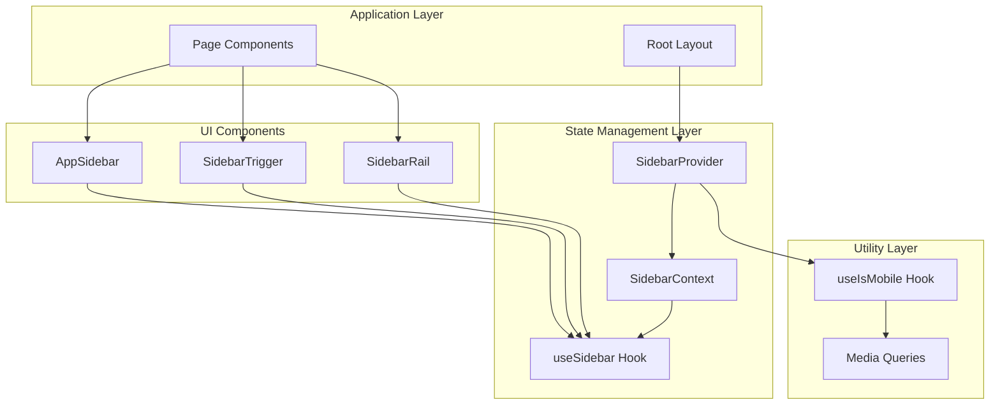
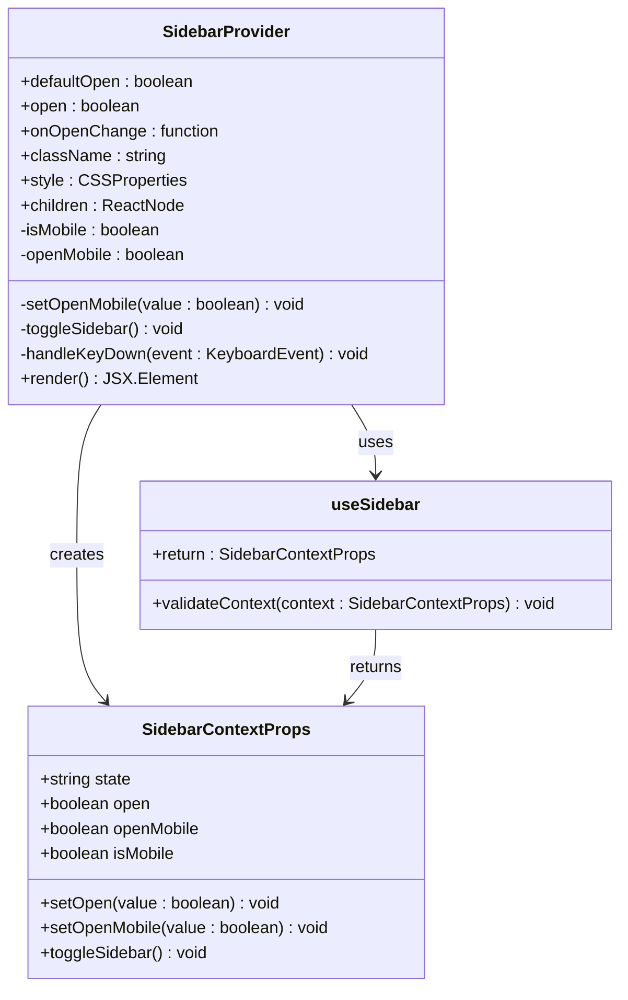
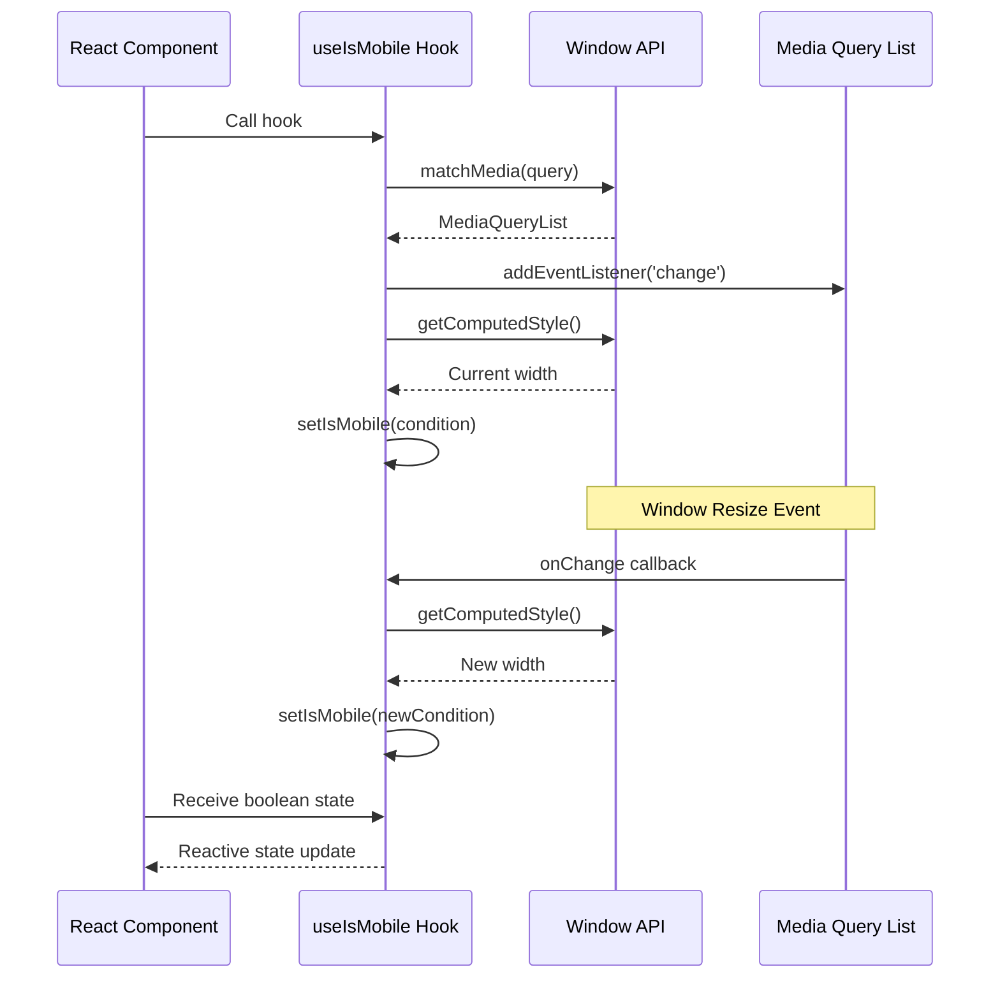
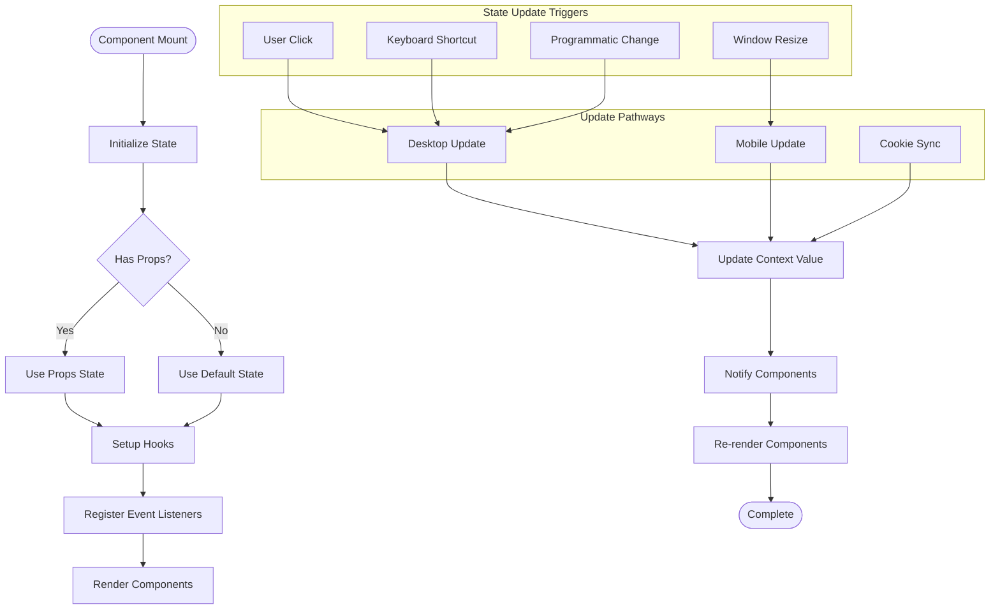
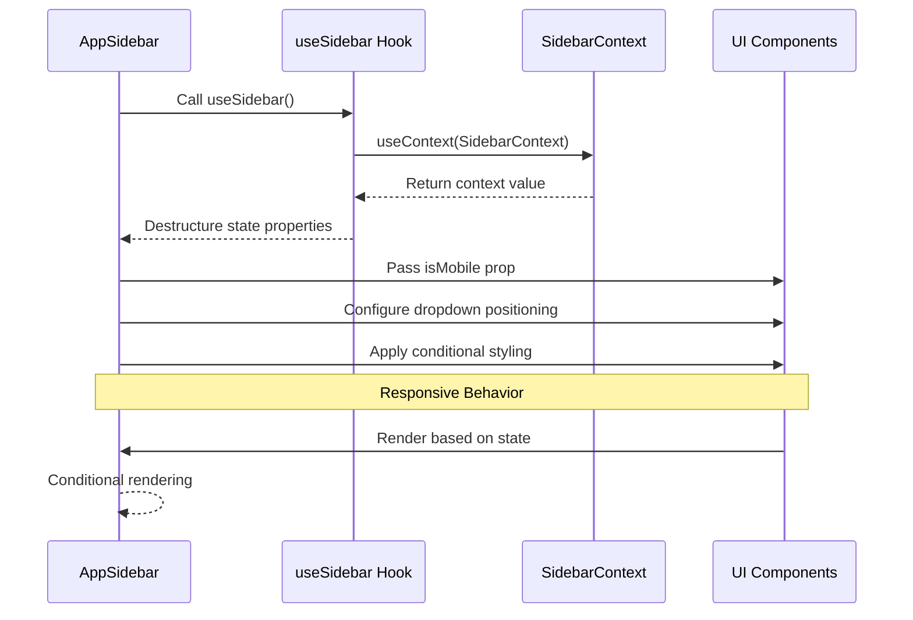

# State Management

<cite>
**Referenced Files in This Document**
- [hooks/use-mobile.ts](file://hooks/use-mobile.ts)
- [components/ui/sidebar.tsx](file://components/ui/sidebar.tsx)
- [app/_components/Sidebar.tsx](file://app/_components/Sidebar.tsx)
- [app/page.tsx](file://app/page.tsx)
- [app/layout.tsx](file://app/layout.tsx)
</cite>

## Table of Contents
1. [Introduction](#introduction)
2. [React Context Architecture](#react-context-architecture)
3. [SidebarContext Implementation](#sidebarcontext-implementation)
4. [Custom Hook Pattern](#custom-hook-pattern)
5. [State Flow and Updates](#state-flow-and-updates)
6. [Component Integration](#component-integration)
7. [Performance Considerations](#performance-considerations)
8. [Limitations and Best Practices](#limitations-and-best-practices)
9. [Conclusion](#conclusion)

## Introduction

This application demonstrates sophisticated state management patterns using React's Context API to handle global sidebar state across components. The implementation showcases how to effectively manage complex state like sidebar visibility, mobile detection, and responsive behavior through a centralized context provider system.

The state management architecture revolves around three key components: the `SidebarContext` for global state sharing, the `SidebarProvider` for state encapsulation and updates, and the `useIsMobile` custom hook for reactive media query detection. This pattern enables efficient state synchronization across the entire application while maintaining clean separation of concerns.

## React Context Architecture

The application employs a hierarchical context architecture where the `SidebarContext` serves as the primary state container, encapsulating all sidebar-related state and actions. This design follows React's recommended patterns for global state management, providing a single source of truth for sidebar behavior throughout the application.



**Diagram sources**
- [components/ui/sidebar.tsx](file://components/ui/sidebar.tsx#L30-L45)
- [hooks/use-mobile.ts](file://hooks/use-mobile.ts#L1-L20)

The context architecture ensures that all components requiring sidebar state can access it through the `useSidebar` hook, eliminating prop drilling and maintaining consistent state across the application lifecycle.

**Section sources**
- [components/ui/sidebar.tsx](file://components/ui/sidebar.tsx#L30-L45)
- [app/page.tsx](file://app/page.tsx#L1-L52)

## SidebarContext Implementation

The `SidebarContext` is implemented as a React context that provides a comprehensive state object containing all sidebar-related properties and methods. This context serves as the central hub for sidebar state management, offering both controlled and uncontrolled state patterns.



**Diagram sources**
- [components/ui/sidebar.tsx](file://components/ui/sidebar.tsx#L20-L35)
- [components/ui/sidebar.tsx](file://components/ui/sidebar.tsx#L46-L92)

The context implementation includes several sophisticated features:

### State Properties
- **state**: Indicates whether the sidebar is expanded or collapsed
- **open**: Boolean flag controlling sidebar visibility
- **openMobile**: Separate state for mobile sidebar visibility
- **isMobile**: Reactive detection of mobile viewport
- **toggleSidebar**: Unified toggle function for both desktop and mobile

### State Management Methods
- **setOpen**: Handles state updates with cookie persistence
- **setOpenMobile**: Mobile-specific state management
- **toggleSidebar**: Intelligent toggle based on device type

**Section sources**
- [components/ui/sidebar.tsx](file://components/ui/sidebar.tsx#L20-L35)
- [components/ui/sidebar.tsx](file://components/ui/sidebar.tsx#L46-L92)

## Custom Hook Pattern

The `useIsMobile` custom hook demonstrates an elegant abstraction pattern for media query detection. This hook encapsulates the complexity of window resize handling and provides a simple boolean interface for components to react to viewport changes.



**Diagram sources**
- [hooks/use-mobile.ts](file://hooks/use-mobile.ts#L1-L20)

### Hook Implementation Details

The `useIsMobile` hook implements several key patterns:

1. **Initialization**: Sets initial state based on current viewport width
2. **Event Listener**: Registers change listener for responsive updates
3. **Cleanup**: Properly removes event listeners to prevent memory leaks
4. **Reactivity**: Provides immediate feedback on viewport changes

```typescript
const MOBILE_BREAKPOINT = 768

export function useIsMobile() {
  const [isMobile, setIsMobile] = React.useState<boolean | undefined>(undefined)

  React.useEffect(() => {
    const mql = window.matchMedia(`(max-width: ${MOBILE_BREAKPOINT - 1}px)`)
    const onChange = () => {
      setIsMobile(window.innerWidth < MOBILE_BREAKPOINT)
    }
    mql.addEventListener("change", onChange)
    setIsMobile(window.innerWidth < MOBILE_BREAKPOINT)
    return () => mql.removeEventListener("change", onChange)
  }, [])

  return !!isMobile
}
```

**Section sources**
- [hooks/use-mobile.ts](file://hooks/use-mobile.ts#L1-L20)

## State Flow and Updates

The state management system implements a sophisticated flow that handles updates from multiple sources including user interactions, window events, and programmatic changes. This flow ensures consistent state across all components while maintaining optimal performance.



**Diagram sources**
- [components/ui/sidebar.tsx](file://components/ui/sidebar.tsx#L50-L92)

### Update Mechanisms

The system handles state updates through multiple pathways:

1. **Direct Updates**: Components call setter functions directly
2. **Event-Driven Updates**: Window resize and keyboard events trigger updates
3. **Cookie Persistence**: State changes are persisted to cookies for session continuity
4. **Controlled/Uncontrolled**: Supports both controlled and uncontrolled state patterns

**Section sources**
- [components/ui/sidebar.tsx](file://components/ui/sidebar.tsx#L50-L92)

## Component Integration

The integration of the state management system with UI components demonstrates practical usage patterns that maximize the benefits of the context architecture while maintaining clean component interfaces.

### AppSidebar Integration

The `AppSidebar` component showcases how to consume context state efficiently:



**Diagram sources**
- [app/_components/Sidebar.tsx](file://app/_components/Sidebar.tsx#L100-L120)

### Key Integration Patterns

The `AppSidebar` component demonstrates several integration patterns:

1. **Selective State Consumption**: Only consumes necessary state properties
2. **Responsive Rendering**: Adapts UI based on mobile detection
3. **Conditional Logic**: Implements different behaviors for mobile vs desktop
4. **Styling Integration**: Uses state for dynamic styling decisions

```typescript
export function AppSidebar({ ...props }: React.ComponentProps<typeof Sidebar>) {
  const { isMobile } = useSidebar();

  return (
    <Sidebar collapsible="icon" {...props}>
      {/* Header content */}
      <SidebarFooter>
        <DropdownMenu>
          <DropdownMenuTrigger asChild>
            <SidebarMenuButton
              size="lg"
              className="overflow-visible"
            >
              {/* Avatar and user info */}
            </SidebarMenuButton>
          </DropdownMenuTrigger>
          <DropdownMenuContent
            side={isMobile ? "bottom" : "right"}
            align="end"
            sideOffset={4}
          >
            {/* Menu items */}
          </DropdownMenuContent>
        </DropdownMenu>
      </SidebarFooter>
    </Sidebar>
  );
}
```

**Section sources**
- [app/_components/Sidebar.tsx](file://app/_components/Sidebar.tsx#L100-L120)

## Performance Considerations

The state management implementation incorporates several performance optimization strategies to ensure efficient rendering and minimal re-renders across the application.

### Memoization Strategy

The `SidebarProvider` uses `React.useMemo` to prevent unnecessary re-renders by memoizing the context value:

```typescript
const contextValue = React.useMemo<SidebarContextProps>(
  () => ({
    state,
    open,
    setOpen,
    isMobile,
    openMobile,
    setOpenMobile,
    toggleSidebar,
  }),
  [state, open, setOpen, isMobile, openMobile, setOpenMobile, toggleSidebar],
)
```

This memoization strategy ensures that:
- Context consumers only receive new values when actual state changes occur
- Components that depend on specific state properties don't re-render unnecessarily
- The context provider maintains optimal performance under frequent state updates

### Event Listener Optimization

The implementation optimizes event listeners through several techniques:

1. **Conditional Registration**: Event listeners are only registered when necessary
2. **Cleanup Functions**: Proper cleanup prevents memory leaks and redundant listeners
3. **Debounced Updates**: Window resize events are handled efficiently
4. **Keyboard Shortcuts**: Global shortcuts are managed with minimal overhead

### Rendering Efficiency

The system promotes efficient rendering through:

- **Selective Prop Drilling**: Only essential state properties are passed to child components
- **Conditional Rendering**: Components render conditionally based on state
- **CSS State Classes**: Uses CSS state classes for styling instead of JavaScript logic
- **Component Splitting**: Large components are split into smaller, focused pieces

**Section sources**
- [components/ui/sidebar.tsx](file://components/ui/sidebar.tsx#L80-L92)

## Limitations and Best Practices

While the current implementation provides robust state management capabilities, there are several limitations and best practices to consider for large-scale applications.

### Current Limitations

1. **Single Context Scope**: The current implementation is scoped to the sidebar context only
2. **Limited State Granularity**: All sidebar state is bundled into a single context
3. **Memory Management**: While cleanup is implemented, complex state hierarchies may require additional memory management
4. **Testing Complexity**: Context-based state can be challenging to test in isolation

### Recommended Optimizations

#### For Large-Scale Applications

1. **Context Splitting**: Consider splitting the sidebar context into smaller, focused contexts
2. **State Normalization**: Normalize state structure for better scalability
3. **Immutable Updates**: Implement immutable state updates for better change detection
4. **Selective Subscriptions**: Allow components to subscribe to specific state slices

#### Performance Enhancements

1. **Lazy Loading**: Implement lazy loading for context providers when appropriate
2. **State Persistence**: Add debounced state persistence for better performance
3. **Batch Updates**: Batch multiple state updates to reduce re-render cycles
4. **Virtualized Lists**: Use virtualization for large lists within the sidebar

#### Testing Strategies

1. **Mock Context Providers**: Create mock context providers for testing
2. **Context Wrappers**: Implement wrapper components for isolated testing
3. **State Reset Utilities**: Provide utilities for resetting context state during tests
4. **Snapshot Testing**: Use snapshot testing for context consumer components

### Best Practices

1. **Consistent Naming**: Maintain consistent naming conventions across context providers
2. **Error Boundaries**: Implement error boundaries around context consumers
3. **Documentation**: Document context interfaces and usage patterns thoroughly
4. **Type Safety**: Leverage TypeScript for strong typing across the context system

## Conclusion

The state management implementation in this application demonstrates a sophisticated approach to handling global sidebar state using React's Context API. The architecture successfully balances simplicity with functionality, providing a clean and maintainable solution for complex state management needs.

The key strengths of this implementation include:

- **Centralized State Management**: Single source of truth for sidebar state across the application
- **Responsive Design Integration**: Seamless integration with responsive design patterns
- **Performance Optimization**: Strategic use of memoization and efficient event handling
- **Developer Experience**: Clean APIs and intuitive patterns for component integration

While the current implementation serves the application's needs effectively, the modular architecture allows for easy expansion and optimization as requirements evolve. The patterns demonstrated here provide a solid foundation for building scalable state management systems in React applications.

Future enhancements could focus on expanding the context system to handle additional application-wide state, implementing advanced caching mechanisms, and adding comprehensive testing infrastructure to ensure reliability and maintainability.