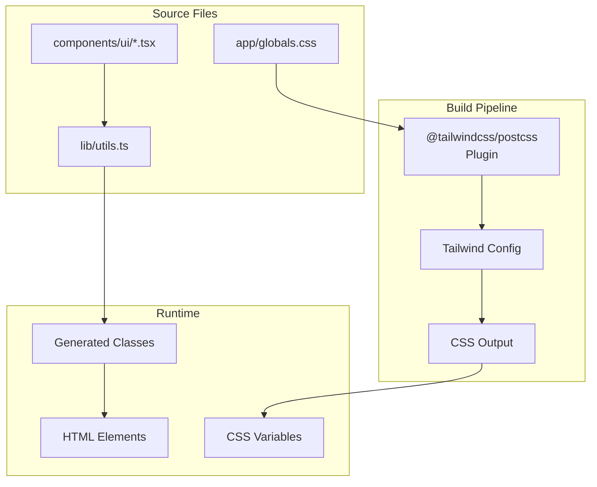
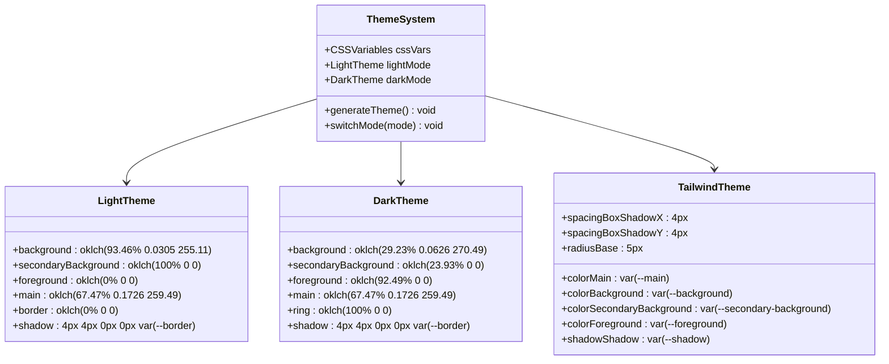
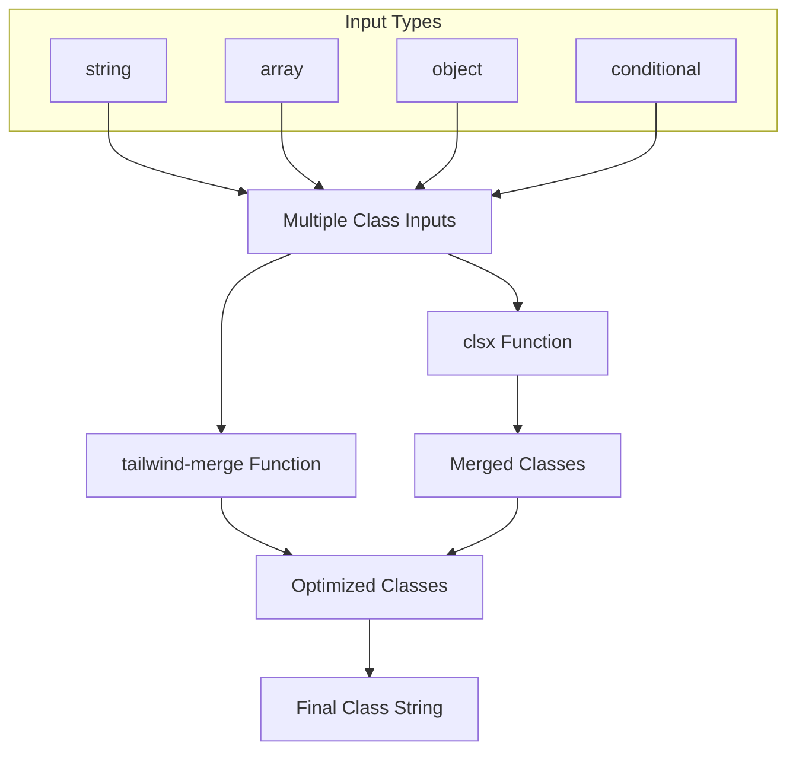
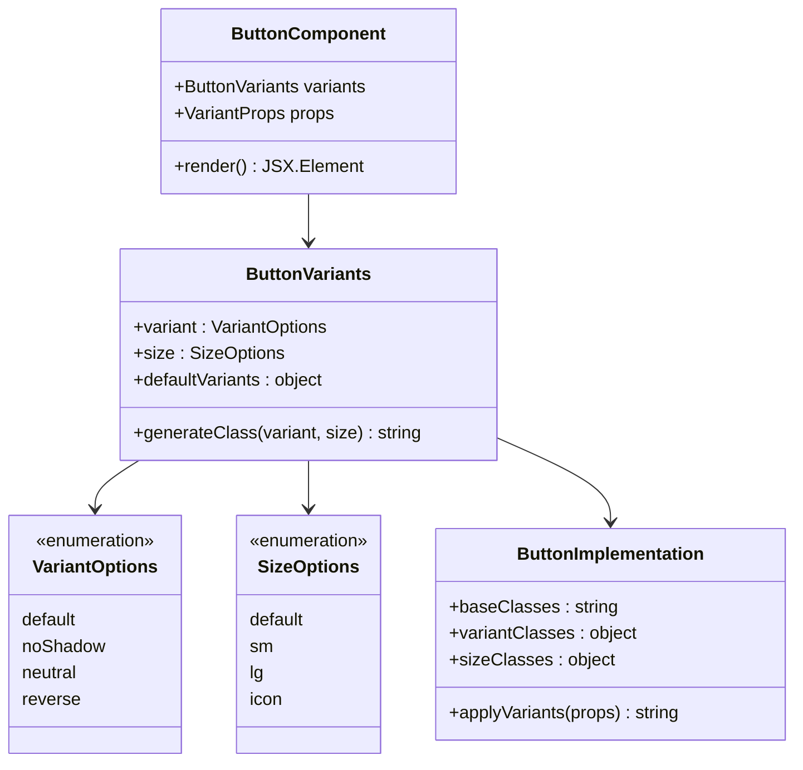
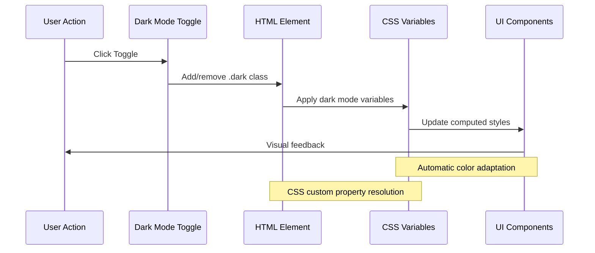
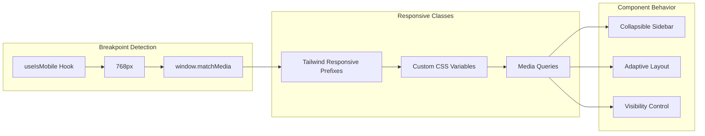

# Styling Strategy

<cite>
**Referenced Files in This Document**
- [app/globals.css](file://app/globals.css)
- [lib/utils.ts](file://lib/utils.ts)
- [components/ui/button.tsx](file://components/ui/button.tsx)
- [components/ui/input.tsx](file://components/ui/input.tsx)
- [app/layout.tsx](file://app/layout.tsx)
- [package.json](file://package.json)
- [postcss.config.mjs](file://postcss.config.mjs)
- [components.json](file://components.json)
</cite>

## Table of Contents
1. [Introduction](#introduction)
2. [Tailwind CSS Architecture](#tailwind-css-architecture)
3. [CSS Variables and Theming](#css-variables-and-theming)
4. [Utility Functions](#utility-functions)
5. [Component Variants with Class-Variance-Authority](#component-variants-with-class-variance-authority)
6. [Dark Mode Implementation](#dark-mode-implementation)
7. [Responsive Design Patterns](#responsive-design-patterns)
8. [Extending the Design System](#extending-the-design-system)
9. [Best Practices](#best-practices)
10. [Troubleshooting](#troubleshooting)

## Introduction

This Next.js application employs a sophisticated styling architecture built around Tailwind CSS v4, featuring a comprehensive theming system with CSS custom properties, class-variance-authority for component variants, and utility-first development patterns. The design system emphasizes maintainability, composability, and accessibility while providing seamless dark mode support through class-based toggling.

The styling strategy combines modern CSS features with TypeScript integration, creating a robust foundation for building scalable user interfaces. The architecture leverages CSSOKLCH color spaces for perceptually uniform color theming and implements a layered approach to CSS organization that separates concerns between base styles, components, and utilities.

## Tailwind CSS Architecture

The application utilizes Tailwind CSS v4 with a custom PostCSS configuration that integrates seamlessly with Next.js. The architecture follows a layered approach where base styles are defined in `globals.css`, component-specific styles are managed through the component library, and utility classes provide atomic styling capabilities.



**Diagram sources**
- [postcss.config.mjs](file://postcss.config.mjs#L1-L7)
- [app/globals.css](file://app/globals.css#L1-L2)

The PostCSS configuration enables automatic CSS generation through the Tailwind plugin, while the globals.css file serves as the primary stylesheet that imports Tailwind directives and defines custom themes.

**Section sources**
- [postcss.config.mjs](file://postcss.config.mjs#L1-L7)
- [app/globals.css](file://app/globals.css#L1-L2)
- [components.json](file://components.json#L1-L22)

## CSS Variables and Theming

The application implements a comprehensive theming system using CSS custom properties with OKLCH color spaces for perceptually uniform color transitions. The theme is defined in the `:root` selector and extended into the Tailwind theme configuration.



**Diagram sources**
- [app/globals.css](file://app/globals.css#L5-L38)
- [app/globals.css](file://app/globals.css#L40-L73)

The theme system provides several key benefits:

### Color Space Advantages
- **Perceptual Uniformity**: OKLCH color space ensures color transitions appear smooth and consistent across modes
- **Accessibility**: Automatic color contrast adjustments between light and dark modes
- **Maintainability**: Single source of truth for all color values

### Variable Definitions
The CSS variables define semantic color roles that adapt between light and dark modes:

```css
/* Light Mode */
--background: oklch(93.46% 0.0305 255.11)
--foreground: oklch(0% 0 0)
--main: oklch(67.47% 0.1726 259.49)

/* Dark Mode */
--background: oklch(29.23% 0.0626 270.49)
--foreground: oklch(92.49% 0 0)
--main: oklch(67.47% 0.1726 259.49)
```

### Typography and Spacing Variables
The theme extends beyond colors to include typography weights, spacing values, and shadow configurations:

- **Font Weights**: Base (500) and Heading (700) weights
- **Spacing**: Box shadow offsets (-4px, 4px) for interactive effects
- **Radius**: Consistent border radius (5px) across components
- **Shadows**: Directional shadow effects for depth perception

**Section sources**
- [app/globals.css](file://app/globals.css#L5-L73)

## Utility Functions

The application implements a sophisticated utility function system centered around the `cn` function from `lib/utils.ts`. This function combines clsx and tailwind-merge for optimal class merging with precedence handling.



**Diagram sources**
- [lib/utils.ts](file://lib/utils.ts#L1-L6)

### Implementation Details

The `cn` function serves as the central utility for class composition:

```typescript
import { clsx, type ClassValue } from "clsx"
import { twMerge } from "tailwind-merge"

export function cn(...inputs: ClassValue[]) {
  return twMerge(clsx(inputs))
}
```

### Benefits of the Approach

1. **Type Safety**: Full TypeScript support with ClassValue union type
2. **Conflict Resolution**: tailwind-merge automatically resolves conflicting classes
3. **Conditional Logic**: clsx handles conditional class application elegantly
4. **Performance**: Efficient merging with minimal DOM manipulation

### Usage Patterns

The utility function enables sophisticated class composition patterns:

```typescript
// Basic usage
className={cn("text-lg font-bold", className)}

// Conditional classes
className={cn(
  "p-4 rounded-lg",
  isLoading && "animate-pulse",
  isError && "border-red-500"
)}

// Object syntax for conditionals
className={cn({
  "bg-blue-500": isActive,
  "bg-gray-200": !isActive,
  "text-white": true,
})}
```

**Section sources**
- [lib/utils.ts](file://lib/utils.ts#L1-L6)

## Component Variants with Class-Variance-Authority

The application leverages class-variance-authority (CVA) for creating composable component variants with predictable class combinations. This approach provides type safety and maintains consistency across component implementations.



**Diagram sources**
- [components/ui/button.tsx](file://components/ui/button.tsx#L10-L29)

### Button Component Example

The Button component demonstrates the CVA pattern with comprehensive variant definitions:

```typescript
const buttonVariants = cva(
  "inline-flex items-center justify-center whitespace-nowrap rounded-base text-sm font-base ring-offset-white transition-all gap-2",
  {
    variants: {
      variant: {
        default:
          "text-main-foreground bg-main border-2 border-border shadow-shadow hover:translate-x-boxShadowX hover:translate-y-boxShadowY hover:shadow-none",
        noShadow: "text-main-foreground bg-main border-2 border-border",
        neutral:
          "bg-secondary-background text-foreground border-2 border-border shadow-shadow hover:translate-x-boxShadowX hover:translate-y-boxShadowY hover:shadow-none",
        reverse:
          "text-main-foreground bg-main border-2 border-border hover:translate-x-reverseBoxShadowX hover:translate-y-reverseBoxShadowY hover:shadow-shadow",
      },
      size: {
        default: "h-10 px-4 py-2",
        sm: "h-9 px-3",
        lg: "h-11 px-8",
        icon: "size-10",
      },
    },
    defaultVariants: {
      variant: "default",
      size: "default",
    },
  },
)
```

### Variant Composition Benefits

1. **Predictable Class Names**: Consistent naming patterns across variants
2. **Type Safety**: Compile-time validation of variant combinations
3. **Maintainability**: Centralized variant definitions
4. **Composability**: Easy combination of multiple variants

### Component Implementation Pattern

Components using CVA follow a standardized pattern:

```typescript
function Button({
  className,
  variant,
  size,
  asChild = false,
  ...props
}: React.ComponentProps<"button"> & VariantProps<typeof buttonVariants>) {
  const Comp = asChild ? Slot : "button"
  
  return (
    <Comp
      data-slot="button"
      className={cn(buttonVariants({ variant, size, className }))}
      {...props}
    />
  )
}
```

**Section sources**
- [components/ui/button.tsx](file://components/ui/button.tsx#L1-L56)

## Dark Mode Implementation

The application implements dark mode through class-based toggling on the HTML element, leveraging CSS custom properties that automatically adapt between light and dark themes.



**Diagram sources**
- [app/globals.css](file://app/globals.css#L2-L4)
- [app/globals.css](file://app/globals.css#L39-L41)

### Implementation Details

The dark mode system operates through several key mechanisms:

#### CSS Custom Properties
The theme variables automatically switch between light and dark values:

```css
:root {
  --background: oklch(93.46% 0.0305 255.11); /* Light mode */
  --foreground: oklch(0% 0 0);
  --main: oklch(67.47% 0.1726 259.49);
}

.dark {
  --background: oklch(29.23% 0.0626 270.49); /* Dark mode */
  --foreground: oklch(92.49% 0 0);
  --main: oklch(67.47% 0.1726 259.49);
}
```

#### Class-Based Toggling
The `.dark` class is applied to the HTML element to trigger theme switching:

```typescript
// Example toggle implementation
function toggleDarkMode() {
  document.documentElement.classList.toggle('dark')
}
```

#### Automatic Adaptation
UI components automatically adapt to the current theme through CSS custom properties:

```css
/* Components use theme variables */
.button {
  background-color: var(--main);
  color: var(--main-foreground);
  border-color: var(--border);
}
```

### Responsive Dark Mode

The system supports various dark mode detection strategies:

1. **User Preference**: Respects browser/system dark mode settings
2. **Manual Toggle**: User-controlled theme switching
3. **Time-Based**: Automatic switching based on local time
4. **Hybrid**: Combines multiple detection methods

**Section sources**
- [app/globals.css](file://app/globals.css#L2-L4)
- [app/globals.css](file://app/globals.css#L5-L38)

## Responsive Design Patterns

The application implements responsive design through a combination of CSS custom properties, Tailwind's responsive prefixes, and JavaScript-based breakpoint detection.



**Diagram sources**
- [hooks/use-mobile.ts](file://hooks/use-mobile.ts#L1-L18)
- [components/ui/sidebar.tsx](file://components/ui/sidebar.tsx#L46-L92)

### Mobile Detection System

The application includes a dedicated hook for mobile device detection:

```typescript
const MOBILE_BREAKPOINT = 768

export function useIsMobile() {
  const [isMobile, setIsMobile] = React.useState<boolean | undefined>(undefined)

  React.useEffect(() => {
    const mql = window.matchMedia(`(max-width: ${MOBILE_BREAKPOINT - 1}px)`)
    const onChange = () => {
      setIsMobile(window.innerWidth < MOBILE_BREAKPOINT)
    }
    mql.addEventListener("change", onChange)
    setIsMobile(window.innerWidth < MOBILE_BREAKPOINT)
    return () => mql.removeEventListener("change", onChange)
  }, [])

  return !!isMobile
}
```

### Responsive Component Patterns

Components adapt their behavior based on screen size:

1. **Collapsible Navigation**: Switches between expanded and collapsed states
2. **Adaptive Layouts**: Adjusts spacing and sizing for different screen sizes
3. **Visibility Controls**: Shows/hides elements based on viewport width
4. **Touch-Friendly Interactions**: Larger touch targets on mobile devices

### CSS Custom Property Adaptation

Responsive design leverages CSS custom properties for consistent behavior:

```css
/* Base spacing values */
--spacing-boxShadowX: 4px;
--spacing-boxShadowY: 4px;

/* Responsive adjustments */
@media (max-width: 768px) {
  --spacing-boxShadowX: 2px;
  --spacing-boxShadowY: 2px;
}
```

**Section sources**
- [hooks/use-mobile.ts](file://hooks/use-mobile.ts#L1-L18)

## Extending the Design System

The application provides multiple pathways for extending the design system with new utility classes and custom components while maintaining consistency and type safety.

### Adding New Utility Classes

To add new utility classes, follow these patterns:

#### 1. Extend CSS Variables
Add new color variables or spacing values to the theme:

```css
:root {
  --color-accent: oklch(70% 0.1 240);
  --spacing-gutter: 1rem;
  --transition-duration: 200ms;
}
```

#### 2. Update Tailwind Theme
Extend the Tailwind theme configuration:

```javascript
@theme inline {
  --color-accent: var(--accent);
  --spacing-gutter: var(--gutter);
  --transition-duration: var(--duration);
}
```

#### 3. Create Utility Components
Build reusable components using the established patterns:

```typescript
function Card({
  className,
  children,
  ...props
}: React.HTMLAttributes<HTMLDivElement>) {
  return (
    <div
      className={cn(
        "rounded-lg border-2 border-border bg-secondary-background p-6 shadow-shadow",
        className
      )}
      {...props}
    >
      {children}
    </div>
  )
}
```

### Creating Custom Components

Follow the established component patterns for consistency:

#### Component Template
```typescript
import { cva, type VariantProps } from "class-variance-authority"
import { cn } from "@/lib/utils"

const componentVariants = cva(
  "base-styles",
  {
    variants: {
      variant: {
        default: "variant-default-styles",
        secondary: "variant-secondary-styles",
      },
      size: {
        sm: "size-sm-styles",
        md: "size-md-styles",
      },
    },
    defaultVariants: {
      variant: "default",
      size: "md",
    },
  },
)

function Component({
  className,
  variant,
  size,
  ...props
}: React.ComponentProps<"div"> & VariantProps<typeof componentVariants>) {
  return (
    <div
      className={cn(componentVariants({ variant, size, className }))}
      {...props}
    />
  )
}

export { Component, componentVariants }
```

### Best Practices for Extension

1. **Consistency**: Follow existing naming conventions and patterns
2. **Type Safety**: Leverage TypeScript interfaces and type guards
3. **Accessibility**: Include ARIA attributes and keyboard navigation
4. **Performance**: Minimize unnecessary re-renders and DOM manipulations
5. **Documentation**: Provide clear usage examples and prop descriptions

## Best Practices

### Class Composition Guidelines

1. **Prefer Utility Classes**: Use Tailwind's utility classes over custom CSS when possible
2. **Use Semantic Names**: Choose descriptive class names that convey purpose
3. **Avoid Over-nesting**: Keep class compositions flat and readable
4. **Leverage CSS Variables**: Use theme variables for consistent styling

### Component Development Standards

1. **TypeScript Integration**: Always use proper TypeScript interfaces
2. **CVA Usage**: Implement variants with class-variance-authority
3. **Utility Functions**: Use the `cn` function for class composition
4. **Slot Pattern**: Support the Radix UI slot pattern for flexibility

### Performance Optimization

1. **Tree Shaking**: Enable PurgeCSS to remove unused styles
2. **Critical CSS**: Inline essential styles for above-the-fold content
3. **Lazy Loading**: Load non-critical styles asynchronously
4. **Bundle Splitting**: Separate styles from JavaScript bundles

### Accessibility Considerations

1. **Focus Management**: Ensure proper focus indicators and keyboard navigation
2. **Color Contrast**: Maintain WCAG AA compliance for color combinations
3. **Screen Reader Support**: Use appropriate ARIA attributes and semantic HTML
4. **Motion Preferences**: Respect reduced motion preferences

## Troubleshooting

### Common Issues and Solutions

#### 1. Styles Not Applying
**Problem**: Custom classes aren't appearing in the final CSS output.

**Solution**: 
- Verify Tailwind's purge configuration includes your component files
- Check for CSS specificity conflicts
- Ensure CSS custom properties are properly defined

#### 2. Dark Mode Not Working
**Problem**: Dark mode toggle isn't changing the theme.

**Solution**:
- Confirm the `.dark` class is being applied to the HTML element
- Verify CSS custom properties are defined for both light and dark modes
- Check for CSS cascade conflicts

#### 3. Type Errors with CVA
**Problem**: TypeScript errors when using class-variance-authority variants.

**Solution**:
- Ensure VariantProps is imported from the correct module
- Verify variant definitions match the component props interface
- Check for proper type inference in component implementations

#### 4. Performance Issues
**Problem**: Slow CSS generation or large bundle sizes.

**Solution**:
- Enable CSS compression in your build process
- Use CSS custom properties efficiently
- Implement critical CSS extraction for above-the-fold content

### Debugging Tools

1. **Browser DevTools**: Inspect computed styles and CSS custom properties
2. **Tailwind Debugger**: Use the Tailwind CSS extension for VS Code
3. **CSS Custom Properties Panel**: Monitor variable values in the browser
4. **Performance Profiling**: Use Chrome DevTools to identify rendering bottlenecks

### Maintenance Guidelines

1. **Regular Updates**: Keep dependencies updated for security and performance
2. **Code Reviews**: Review styling changes for consistency and accessibility
3. **Testing**: Implement visual regression testing for theme changes
4. **Documentation**: Maintain up-to-date component documentation