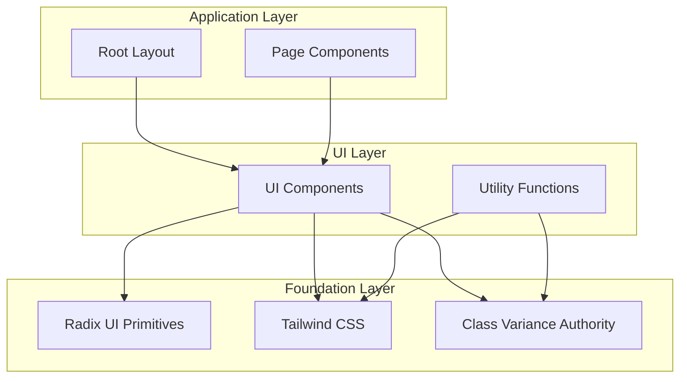

# Technology Stack & Dependencies

<cite>
**Referenced Files in This Document**
- [package.json](file://package.json)
- [next.config.ts](file://next.config.ts)
- [tsconfig.json](file://tsconfig.json)
- [postcss.config.mjs](file://postcss.config.mjs)
- [eslint.config.mjs](file://eslint.config.mjs)
- [app/globals.css](file://app/globals.css)
- [lib/utils.ts](file://lib/utils.ts)
- [components.json](file://components.json)
- [app/layout.tsx](file://app/layout.tsx)
- [components/ui/button.tsx](file://components/ui/button.tsx)
- [components/ui/input.tsx](file://components/ui/input.tsx)
- [components/ui/avatar.tsx](file://components/ui/avatar.tsx)
- [components/ui/sidebar.tsx](file://components/ui/sidebar.tsx)
- [README.md](file://README.md)
</cite>

## Table of Contents
1. [Introduction](#introduction)
2. [Core Framework Technologies](#core-framework-technologies)
3. [UI Component Library Architecture](#ui-component-library-architecture)
4. [Styling System](#styling-system)
5. [Development Tools](#development-tools)
6. [Version Compatibility](#version-compatibility)
7. [Integration Patterns](#integration-patterns)
8. [Why These Technologies Were Chosen](#why-these-technologies-were-chosen)
9. [Project Structure Impact](#project-structure-impact)
10. [Performance Considerations](#performance-considerations)

## Introduction

The Activity Tracker application is built on a modern React ecosystem that combines cutting-edge frameworks with utility-first styling approaches. This technology stack represents a contemporary approach to web development, emphasizing developer productivity, accessibility, and maintainability while delivering exceptional user experiences.

The application leverages Next.js 16 with App Router for its advanced routing capabilities and server components, React 19 for its latest rendering optimizations, and Tailwind CSS for its utility-first approach to styling. This combination creates a robust foundation that balances flexibility with performance and developer experience.

## Core Framework Technologies

### Next.js 16 with App Router

Next.js 16 serves as the backbone of this application, providing a comprehensive framework for building modern web applications. The adoption of App Router represents a significant evolution in Next.js architecture, offering improved performance, better SEO capabilities, and enhanced developer experience.

**Key Features Implemented:**
- **Server Components**: Leverage React 19's streaming capabilities for optimal performance
- **App Directory Structure**: Organized routing and layout management
- **Streaming SSR**: Enhanced user experience through progressive content loading
- **Route Handlers**: Built-in API route support within the app directory

**Implementation Details:**
The application utilizes Next.js 16's latest features, including automatic font optimization with Geist fonts and built-in image optimization. The framework's TypeScript support is fully configured with strict mode enabled, ensuring type safety across the entire codebase.

### React 19

React 19 brings significant improvements to the rendering engine, particularly in server-side rendering and streaming capabilities. The application takes advantage of these enhancements through Next.js 16's integration.

**Benefits Leveraged:**
- **Improved Streaming**: Faster initial page loads through progressive content delivery
- **Enhanced Server Components**: Better integration with Next.js App Router
- **Optimized Rendering**: Reduced bundle sizes and improved hydration performance

### TypeScript Configuration

The TypeScript setup is optimized for modern development practices:

```typescript
// Key compiler options from tsconfig.json
{
  "target": "ES2017",
  "lib": ["dom", "dom.iterable", "esnext"],
  "strict": true,
  "jsx": "react-jsx",
  "plugins": [{"name": "next"}],
  "paths": {"@/*": ["./*"]}
}
```

**Section sources**
- [package.json](file://package.json#L1-L43)
- [tsconfig.json](file://tsconfig.json#L1-L35)
- [next.config.ts](file://next.config.ts#L1-L8)

## UI Component Library Architecture

### Radix UI Primitives

Radix UI provides a collection of unstyled, accessible primitives that form the foundation of the component library. This choice emphasizes accessibility and customization flexibility over pre-styled components.

**Core Components Utilized:**
- **Avatar**: Accessible user profile display with fallback mechanisms
- **Collapsible**: Expandable content areas with smooth transitions
- **Dialog**: Modal overlay system with proper focus management
- **Dropdown Menu**: Contextual menus with keyboard navigation
- **Slot**: Flexible component composition utility
- **Tooltip**: Interactive help text with positioning logic

**Accessibility Benefits:**
- Full ARIA compliance with semantic markup
- Keyboard navigation support
- Screen reader compatibility
- Focus management and trap handling

### Component Variance Authority (CVA)

CVA enables sophisticated component variant systems with type-safe class combinations. This library is extensively used throughout the UI components to manage different visual states and sizes.

**Implementation Example:**
```typescript
const buttonVariants = cva(
  "inline-flex items-center justify-center whitespace-nowrap rounded-base text-sm font-base",
  {
    variants: {
      variant: {
        default: "bg-main border-2 border-border",
        neutral: "bg-secondary-background text-foreground",
        reverse: "bg-main border-2 border-border hover:translate-x-reverseBoxShadowX"
      },
      size: {
        default: "h-10 px-4 py-2",
        sm: "h-9 px-3",
        lg: "h-11 px-8"
      }
    }
  }
)
```

### Conditional Class Logic

The application uses two complementary libraries for managing conditional classes:

**clsx**: Provides clean conditional class concatenation
**tailwind-merge**: Resolves Tailwind CSS class conflicts intelligently

**Utility Implementation:**
```typescript
import { clsx, type ClassValue } from "clsx"
import { twMerge } from "tailwind-merge"

export function cn(...inputs: ClassValue[]) {
  return twMerge(clsx(inputs))
}
```

**Section sources**
- [package.json](file://package.json#L14-L22)
- [lib/utils.ts](file://lib/utils.ts#L1-L7)
- [components/ui/button.tsx](file://components/ui/button.tsx#L1-L57)

## Styling System

### Tailwind CSS v4

Tailwind CSS v4 represents the latest evolution of the utility-first CSS framework, offering enhanced performance and developer experience improvements.

**Key Features Implemented:**
- **Theme Variables**: Customizable design tokens through CSS custom properties
- **Dark Mode Support**: Automatic dark mode with color scheme detection
- **Animation Utilities**: Built-in animation classes with CSS animations
- **Modern Syntax**: Improved selector specificity and performance

**Custom Theme Configuration:**
The application defines a comprehensive color palette using OKLCH color space for perceptually uniform color scaling:

```css
:root {
  --background: oklch(93.46% 0.0305 255.11);
  --secondary-background: oklch(100% 0 0);
  --foreground: oklch(0% 0 0);
  --main: oklch(67.47% 0.1726 259.49);
  --border: oklch(0% 0 0);
  --ring: oklch(0% 0 0);
}
```

### Utility-First Approach

The styling philosophy emphasizes atomic utility classes over custom CSS, enabling rapid development and consistent design implementation.

**Design Token System:**
- **Spacing**: Consistent sizing scale with `--spacing-*` variables
- **Typography**: Font weight and family variables (`--font-weight-base`, `--font-geist-sans`)
- **Colors**: Semantic color variables with light/dark mode support
- **Shadows**: Box shadow utilities with directional offsets
- **Transitions**: Smooth motion design with CSS transitions

### PostCSS Integration

PostCSS configuration integrates seamlessly with Tailwind CSS v4:

```javascript
const config = {
  plugins: {
    "@tailwindcss/postcss": {},
  },
};
```

**Section sources**
- [app/globals.css](file://app/globals.css#L1-L74)
- [postcss.config.mjs](file://postcss.config.mjs#L1-L8)
- [components.json](file://components.json#L1-L23)

## Development Tools

### ESLint Configuration

The application uses ESLint 9 with Next.js-specific configurations for optimal TypeScript support and modern JavaScript practices.

**Configuration Highlights:**
- **Next.js Core Web Vitals**: Performance monitoring integration
- **TypeScript Support**: Full TypeScript linting with strict mode
- **Custom Ignores**: Excludes build artifacts and generated files
- **Modern Standards**: Enforces ES2017+ syntax and best practices

**Custom Configuration:**
```javascript
import { defineConfig, globalIgnores } from "eslint/config";
import nextVitals from "eslint-config-next/core-web-vitals";
import nextTs from "eslint-config-next/typescript";

const eslintConfig = defineConfig([
  ...nextVitals,
  ...nextTs,
  globalIgnores([".next/**", "out/**", "build/**"])
]);
```

### Package Management

**pnpm Adoption:**
The project enforces pnpm as the primary package manager through preinstall scripts:

```json
{
  "scripts": {
    "preinstall": "npx only-allow pnpm"
  },
  "engines": {
    "npm": "please use pnpm",
    "yarn": "please use pnpm"
  }
}
```

**Benefits of pnpm:**
- **Disk Space Efficiency**: Shared dependency storage reduces installation size
- **Performance**: Faster install times and better caching
- **Consistency**: Deterministic installations across environments

### TypeScript Integration

**Advanced TypeScript Features:**
- **Strict Mode**: Comprehensive type checking with `strict: true`
- **Next.js Plugin**: Automatic type generation for routes and assets
- **Path Mapping**: `@/*` alias for cleaner imports
- **Incremental Compilation**: Faster rebuilds during development

**Section sources**
- [eslint.config.mjs](file://eslint.config.mjs#L1-L19)
- [package.json](file://package.json#L4-L12)
- [tsconfig.json](file://tsconfig.json#L1-L35)

## Version Compatibility

### Framework Synchronization

The technology stack demonstrates careful version alignment to ensure optimal compatibility:

**Framework Versions:**
- **Next.js**: 16.0.0 (latest stable)
- **React**: 19.2.0 (latest stable)
- **React DOM**: 19.2.0 (matching React version)
- **TypeScript**: 5.x (latest stable)

**Library Compatibility:**
- **Radix UI**: Latest versions with React 19 compatibility
- **Tailwind CSS**: v4 with PostCSS integration
- **Lucide React**: Icon library with SVG optimization
- **CVA & clsx**: Utility libraries with TypeScript support

### Migration Considerations

**Upgrade Path:**
- **Next.js 15 → 16**: Minimal breaking changes expected
- **React 18 → 19**: Server components and streaming improvements
- **Tailwind CSS 3 → 4**: New theme syntax and performance improvements

**Backward Compatibility:**
- All dependencies support React 19
- TypeScript 5 maintains backward compatibility
- No major breaking changes anticipated in minor updates

## Integration Patterns

### Component Composition Pattern

The application follows a layered component architecture:



**Diagram sources**
- [components/ui/button.tsx](file://components/ui/button.tsx#L1-L57)
- [components/ui/sidebar.tsx](file://components/ui/sidebar.tsx#L1-L716)
- [lib/utils.ts](file://lib/utils.ts#L1-L7)

### Design System Integration

**Component Design Principles:**
- **Atomic Design**: Small, reusable components
- **Composition Over Inheritance**: Flexible component composition
- **Type Safety**: Full TypeScript integration
- **Accessibility First**: Built-in ARIA support

**Implementation Pattern:**
```typescript
// Universal pattern across UI components
function ComponentName({ className, ...props }: ComponentProps) {
  return (
    <Element
      data-slot="component-name"
      className={cn(componentVariants({ variant, size, className }))}
      {...props}
    />
  )
}
```

### State Management Integration

**Client-Side State:**
- **useContext**: Sidebar state management
- **useState**: Local component state
- **useCallback**: Optimized event handlers

**Server Components:**
- **Static Generation**: Pre-rendered pages
- **Streaming**: Progressive content delivery
- **Server Actions**: Form submission optimization

**Section sources**
- [components/ui/sidebar.tsx](file://components/ui/sidebar.tsx#L40-L80)
- [components/ui/avatar.tsx](file://components/ui/avatar.tsx#L1-L55)

## Why These Technologies Were Chosen

### Developer Experience

**Rapid Development:**
- **Utility-First CSS**: Eliminates custom CSS writing
- **TypeScript**: Enhanced IDE support and refactoring
- **Auto-Imports**: Automatic dependency resolution
- **Hot Reload**: Instant feedback during development

**Maintainability:**
- **Consistent Architecture**: Predictable component patterns
- **Type Safety**: Reduced runtime errors
- **Modular Design**: Easy component reuse and testing
- **Documentation**: Self-documenting component APIs

### Performance Optimization

**Bundle Size Reduction:**
- **Tree Shaking**: Dead code elimination
- **Code Splitting**: Lazy-loaded components
- **Image Optimization**: Built-in responsive images
- **Font Optimization**: Automatic font subset loading

**Runtime Performance:**
- **Server Components**: Reduced client-side JavaScript
- **Streaming**: Progressive page rendering
- **Caching**: Intelligent cache invalidation
- **CDN Integration**: Global content distribution

### Accessibility and Inclusivity

**Built-In Accessibility:**
- **ARIA Compliance**: Semantic markup and roles
- **Keyboard Navigation**: Full keyboard support
- **Screen Reader Support**: Proper labeling and announcements
- **Focus Management**: Logical focus order

**Universal Design:**
- **Dark Mode**: Color scheme adaptation
- **High Contrast**: Text readability enhancement
- **Touch Targets**: Adequate touch area sizing
- **Motion Preferences**: Reduced motion support

## Project Structure Impact

### Directory Organization

**Logical Separation:**
- **app/**: Next.js App Router pages and layouts
- **components/ui/**: Reusable UI components
- **hooks/**: Custom React hooks
- **lib/**: Utility functions and helpers

**File Naming Conventions:**
- **PascalCase**: Component files (Button.tsx, Sidebar.tsx)
- **camelCase**: Hook files (useMobile.ts)
- **kebab-case**: Utility files (utils.ts)

### Import Resolution

**Path Aliases:**
```typescript
// tsconfig.json
{
  "paths": {
    "@/*": ["./*"]
  }
}
```

**Benefits:**
- **Clean Imports**: Shorter, more readable import statements
- **Refactoring Friendly**: Easier component movement
- **Avoid Relative Paths**: Reduces path complexity
- **Team Collaboration**: Consistent import patterns

### Build Optimization

**Next.js Optimizations:**
- **Automatic Code Splitting**: Route-based bundling
- **Asset Optimization**: Image and font compression
- **SSR/SSG**: Static site generation for performance
- **Prerendering**: Pre-built HTML for SEO

**Section sources**
- [tsconfig.json](file://tsconfig.json#L25-L27)
- [app/layout.tsx](file://app/layout.tsx#L1-L35)

## Performance Considerations

### Bundle Analysis

**Optimization Strategies:**
- **Dynamic Imports**: Lazy loading of heavy components
- **Tree Shaking**: Elimination of unused code
- **Code Splitting**: Route-based chunking
- **Asset Optimization**: Compressed images and fonts

### Runtime Performance

**Client-Side Optimization:**
- **React 19 Streaming**: Progressive component rendering
- **Server Components**: Reduced client-side JavaScript
- **Suspense Boundaries**: Graceful loading states
- **Memoization**: Preventing unnecessary re-renders

### Network Performance

**CDN Integration:**
- **Global Distribution**: Fast content delivery worldwide
- **Edge Computing**: Proximity-based processing
- **Cache Optimization**: Intelligent cache strategies
- **Compression**: Automatic asset compression

### Memory Management

**Efficient Resource Usage:**
- **Component Lifecycle**: Proper cleanup and unmounting
- **Event Listener Management**: Preventing memory leaks
- **State Optimization**: Minimal state updates
- **Image Optimization**: Efficient image loading and caching

### Monitoring and Analytics

**Performance Tracking:**
- **Core Web Vitals**: LCP, FID, CLS monitoring
- **Bundle Analysis**: Size tracking and optimization
- **Runtime Metrics**: Memory and CPU usage
- **User Experience**: Interaction and engagement tracking