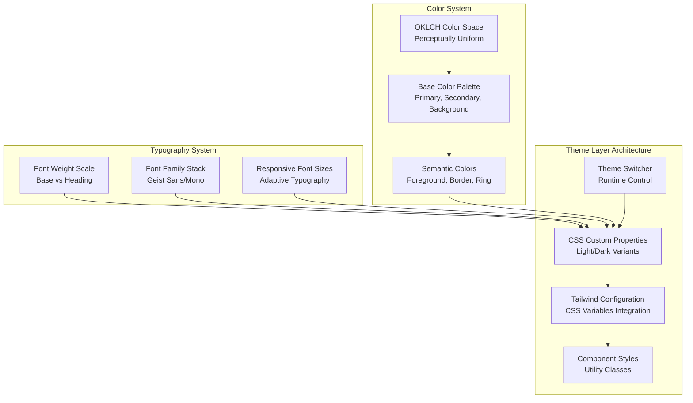
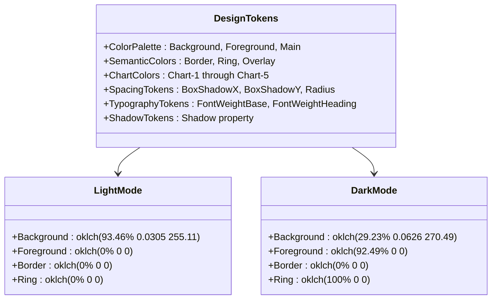
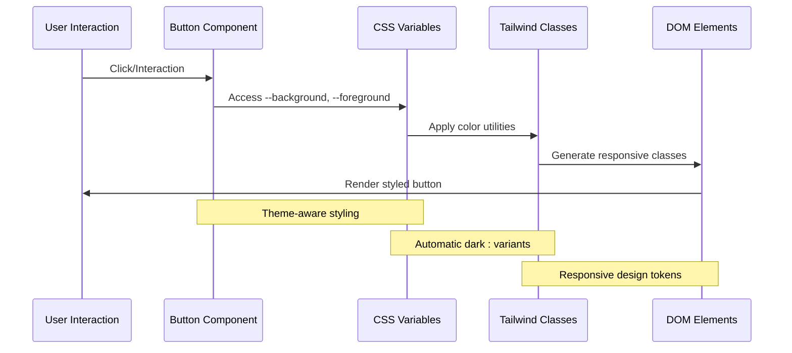
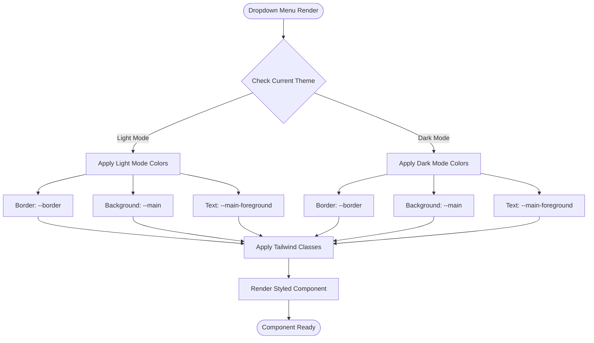
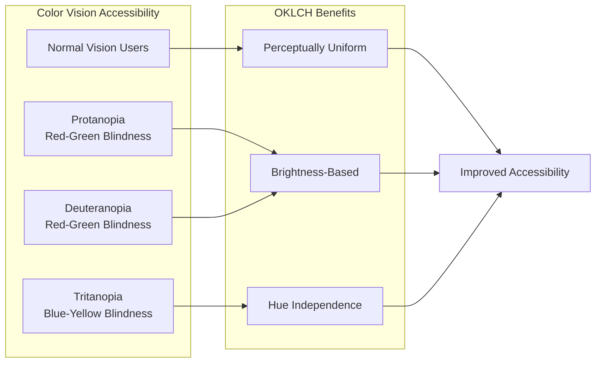

# Theming and Customization

<cite>
**Referenced Files in This Document**
- [app/globals.css](file://app/globals.css)
- [app/layout.tsx](file://app/layout.tsx)
- [components/ui/button.tsx](file://components/ui/button.tsx)
- [components/ui/input.tsx](file://components/ui/input.tsx)
- [components/ui/dropdown-menu.tsx](file://components/ui/dropdown-menu.tsx)
- [components/ui/sidebar.tsx](file://components/ui/sidebar.tsx)
- [lib/utils.ts](file://lib/utils.ts)
- [components.json](file://components.json)
- [package.json](file://package.json)
- [postcss.config.mjs](file://postcss.config.mjs)
- [next.config.ts](file://next.config.ts)
- [hooks/use-mobile.ts](file://hooks/use-mobile.ts)
</cite>

## Table of Contents
1. [Introduction](#introduction)
2. [Theme Architecture](#theme-architecture)
3. [CSS Variables System](#css-variables-system)
4. [Light and Dark Mode Implementation](#light-and-dark-mode-implementation)
5. [Component Integration](#component-integration)
6. [Customization Guidelines](#customization-guidelines)
7. [Adding New Themes](#adding-new-themes)
8. [User-Controlled Theme Switching](#user-controlled-theme-switching)
9. [Accessibility Considerations](#accessibility-considerations)
10. [Performance Optimizations](#performance-optimizations)
11. [Troubleshooting](#troubleshooting)

## Introduction

The Activity Tracker application implements a sophisticated theming system built on modern CSS custom properties (variables) and Tailwind CSS v4. The system provides seamless light and dark mode support through CSS classes on the HTML element combined with Tailwind's dark: modifier variants. The theming architecture is designed for flexibility, maintainability, and accessibility, allowing developers to easily customize colors, fonts, spacing, and other visual aspects while maintaining consistent styling across all components.

The theming system leverages OKLCH color spaces for improved perceptual color accuracy, CSS custom properties for dynamic theming, and Tailwind's utility-first approach for rapid development. This combination creates a powerful foundation for building accessible, visually appealing applications that adapt to user preferences and system settings.

## Theme Architecture

The theming system follows a layered architecture that separates concerns between color definitions, typography, spacing, and component styling. The architecture is built around several key principles:



**Diagram sources**
- [app/globals.css](file://app/globals.css#L1-L74)
- [components.json](file://components.json#L1-L23)

The architecture consists of four main layers:

1. **CSS Custom Properties Layer**: Defines the foundational color palette and design tokens using OKLCH color space
2. **Tailwind Configuration Layer**: Bridges CSS variables with Tailwind's utility classes
3. **Component Styles Layer**: Implements consistent styling across UI components
4. **Theme Switcher Layer**: Provides runtime theme control and persistence

**Section sources**
- [app/globals.css](file://app/globals.css#L1-L74)
- [components.json](file://components.json#L1-L23)

## CSS Variables System

The CSS variables system forms the foundation of the theming architecture, providing a centralized way to manage colors, spacing, and other design tokens. The system uses OKLCH color space for superior perceptual uniformity and includes comprehensive light and dark mode variants.

### Light Mode Variables

The light mode establishes a clean, modern aesthetic with high contrast for readability:

```css
:root {
  --background: oklch(93.46% 0.0305 255.11);
  --secondary-background: oklch(100% 0 0);
  --foreground: oklch(0% 0 0);
  --main-foreground: oklch(0% 0 0);
  --main: oklch(67.47% 0.1726 259.49);
  --border: oklch(0% 0 0);
  --ring: oklch(0% 0 0);
  --overlay: oklch(0% 0 0 / 0.8);
  --shadow: 4px 4px 0px 0px var(--border);
  --chart-1: #5294FF;
  --chart-2: #FF4D50;
  --chart-3: #FACC00;
  --chart-4: #05E17A;
  --chart-5: #7A83FF;
  --chart-active-dot: #000;
}
```

### Dark Mode Variables

The dark mode provides a sophisticated, low-light interface with carefully calibrated colors:

```css
.dark {
  --background: oklch(29.23% 0.0626 270.49);
  --secondary-background: oklch(23.93% 0 0);
  --foreground: oklch(92.49% 0 0);
  --main-foreground: oklch(0% 0 0);
  --main: oklch(67.47% 0.1726 259.49);
  --border: oklch(0% 0 0);
  --ring: oklch(100% 0 0);
  --shadow: 4px 4px 0px 0px var(--border);
  --chart-1: #5294FF;
  --chart-2: #FF6669;
  --chart-3: #E0B700;
  --chart-4: #04C86D;
  --chart-5: #7A83FF;
  --chart-active-dot: #fff;
}
```

### Design Token Categories

The CSS variables are organized into several categories for logical separation:



**Diagram sources**
- [app/globals.css](file://app/globals.css#L4-L38)

**Section sources**
- [app/globals.css](file://app/globals.css#L1-L74)

## Light and Dark Mode Implementation

The light and dark mode implementation leverages CSS custom properties and Tailwind's dark: modifier variants to create a seamless theming experience. The system uses the `.dark` class on the HTML element to trigger dark mode styles.

### HTML Element Class Strategy

The implementation relies on the `.dark` class being added to the HTML element to activate dark mode:

```html
<html class="dark">
<body>
  <!-- Content with dark mode styles -->
</body>
</html>
```

### Tailwind Dark Modifier Integration

The system integrates with Tailwind's dark mode through custom variants:

```css
@custom-variant dark (&:is(.dark *));
```

This custom variant allows Tailwind classes to automatically switch between light and dark modes based on the presence of the `.dark` class. For example:

```css
.text-foreground { color: var(--foreground); }
.dark .text-foreground { color: var(--foreground); }
```

### Dynamic Theme Switching

The theme switching mechanism operates through JavaScript manipulation of the HTML class:

```javascript
// Toggle dark mode
document.documentElement.classList.toggle('dark');

// Set dark mode explicitly
document.documentElement.classList.add('dark');

// Remove dark mode
document.documentElement.classList.remove('dark');
```

### Theme Persistence

The system supports theme persistence through cookies or local storage, allowing users to maintain their preferred theme across sessions.

**Section sources**
- [app/globals.css](file://app/globals.css#L1-L74)

## Component Integration

Components integrate with the theming system through multiple mechanisms, ensuring consistent styling across the application while maintaining flexibility for component-specific customizations.

### Button Component Integration

The button component demonstrates comprehensive theming integration:



**Diagram sources**
- [components/ui/button.tsx](file://components/ui/button.tsx#L1-L57)

The button component uses CSS variables for consistent theming:

```typescript
const buttonVariants = cva(
  "inline-flex items-center justify-center whitespace-nowrap rounded-base text-sm font-base ring-offset-white transition-all gap-2",
  {
    variants: {
      variant: {
        default: "text-main-foreground bg-main border-2 border-border shadow-shadow hover:translate-x-boxShadowX hover:translate-y-boxShadowY hover:shadow-none",
        neutral: "bg-secondary-background text-foreground border-2 border-border shadow-shadow hover:translate-x-boxShadowX hover:translate-y-boxShadowY hover:shadow-none",
      },
    },
  },
);
```

### Input Component Integration

The input component showcases form field theming:

```typescript
function Input({ className, type, ...props }: React.ComponentProps<"input">) {
  return (
    <input
      type={type}
      data-slot="input"
      className={cn(
        "flex h-10 w-full rounded-base border-2 border-border bg-secondary-background selection:bg-main selection:text-main-foreground px-3 py-2 text-sm font-base text-foreground file:border-0 file:bg-transparent file:text-sm file:font-heading placeholder:text-foreground/50 focus-visible:outline-hidden focus-visible:ring-2 focus-visible:ring-black focus-visible:ring-offset-2 disabled:cursor-not-allowed disabled:opacity-50",
        className,
      )}
      {...props}
    />
  )
}
```

### Dropdown Menu Integration

The dropdown menu component demonstrates complex theming scenarios:



**Diagram sources**
- [components/ui/dropdown-menu.tsx](file://components/ui/dropdown-menu.tsx#L1-L240)

**Section sources**
- [components/ui/button.tsx](file://components/ui/button.tsx#L1-L57)
- [components/ui/input.tsx](file://components/ui/input.tsx#L1-L20)
- [components/ui/dropdown-menu.tsx](file://components/ui/dropdown-menu.tsx#L1-L240)

## Customization Guidelines

The theming system provides multiple approaches for customization, from simple color changes to complex theme modifications. These guidelines ensure consistent and maintainable theme updates.

### Primary Color Customization

To change primary colors, modify the `--main` variable in both light and dark modes:

```css
/* Light Mode */
:root {
  --main: oklch(67.47% 0.1726 259.49); /* Original: Purple */
  /* Change to: --main: oklch(67.47% 0.1726 120); /* Green */
  /* Change to: --main: oklch(67.47% 0.1726 30); /* Red */
}

/* Dark Mode */
.dark {
  --main: oklch(67.47% 0.1726 259.49); /* Original: Purple */
  /* Change to: --main: oklch(67.47% 0.1726 120); /* Green */
  /* Change to: --main: oklch(67.47% 0.1726 30); /* Red */
}
```

### Font Family Customization

Modify font family variables to change typography:

```css
:root {
  --font-geist-sans: 'Custom Sans', sans-serif;
  --font-geist-mono: 'Custom Mono', monospace;
}

/* Update Tailwind theme configuration */
@theme inline {
  --font-family-base: var(--font-geist-sans);
  --font-family-heading: var(--font-geist-mono);
}
```

### Spacing and Layout Customization

Adjust spacing tokens for different design requirements:

```css
@theme inline {
  --spacing-boxShadowX: 6px;           /* Increase shadow offset */
  --spacing-boxShadowY: 6px;
  --spacing-reverseBoxShadowX: -6px;
  --spacing-reverseBoxShadowY: -6px;
  --radius-base: 8px;                  /* Rounded corners */
  --shadow-shadow: 6px 6px 0px 0px var(--border); /* Larger shadow */
}
```

### Color Palette Expansion

Add new semantic colors for enhanced theming:

```css
:root {
  --accent: oklch(70% 0.1 200);        /* New accent color */
  --success: oklch(75% 0.15 140);      /* Success indicator */
  --warning: oklch(80% 0.2 60);        /* Warning indicator */
  --danger: oklch(70% 0.25 30);        /* Danger/error indicator */
}

.dark {
  --accent: oklch(70% 0.1 200);
  --success: oklch(75% 0.15 140);
  --warning: oklch(80% 0.2 60);
  --danger: oklch(70% 0.25 30);
}
```

**Section sources**
- [app/globals.css](file://app/globals.css#L1-L74)

## Adding New Themes

Creating new themes involves extending the existing CSS variables system and integrating with the component architecture. The process requires careful consideration of color harmony and accessibility.

### Theme Definition Structure

New themes should follow the established variable structure:

```css
/* Define new theme */
.theme-name {
  --background: oklch(95% 0.02 250);
  --secondary-background: oklch(100% 0 0);
  --foreground: oklch(10% 0 0);
  --main-foreground: oklch(0% 0 0);
  --main: oklch(60% 0.15 280);
  --border: oklch(20% 0 0);
  --ring: oklch(100% 0 0);
  --overlay: oklch(0% 0 0 / 0.8);
  --shadow: 4px 4px 0px 0px var(--border);
  --chart-1: #4A90E2;
  --chart-2: #F5A623;
  --chart-3: #50E3A7;
  --chart-4: #FF6B6B;
  --chart-5: #9013FE;
  --chart-active-dot: #000;
}
```

### Theme Registration

Register the new theme in your JavaScript:

```javascript
// Theme registration
const themes = {
  light: 'light',
  dark: 'dark',
  ocean: 'ocean',
  forest: 'forest',
  sunset: 'sunset'
};

function applyTheme(themeName) {
  document.documentElement.className = '';
  document.documentElement.classList.add(themeName);
}
```

### Component Theme Adaptation

Ensure components adapt to new themes by using CSS variables:

```typescript
// Component adaptation
function CustomComponent({ className, ...props }) {
  return (
    <div
      className={cn(
        "bg-secondary-background text-foreground border-border",
        "shadow-shadow hover:translate-x-boxShadowX hover:translate-y-boxShadowY",
        className
      )}
      {...props}
    />
  );
}
```

### Theme-Specific Overrides

For components requiring theme-specific styling:

```css
/* Theme-specific component styling */
.theme-ocean .custom-component {
  background: linear-gradient(135deg, #1e3c72 0%, #2a5298 100%);
  border-color: #4ecdc4;
}

.theme-forest .custom-component {
  background: linear-gradient(135deg, #225352 0%, #4ca1af 100%);
  border-color: #81c483;
}
```

## User-Controlled Theme Switching

Implementing user-controlled theme switching requires a combination of state management, persistence, and accessibility considerations.

### Theme Switcher Component

```typescript
'use client'

import { useState, useEffect } from 'react'

interface ThemeSwitcherProps {
  className?: string;
}

export function ThemeSwitcher({ className }: ThemeSwitcherProps) {
  const [theme, setTheme] = useState<string>('system')

  useEffect(() => {
    const savedTheme = localStorage.getItem('theme') || 'system'
    setTheme(savedTheme)
    applyTheme(savedTheme)
  }, [])

  const applyTheme = (theme: string) => {
    document.documentElement.className = ''
    
    if (theme === 'system') {
      const isDark = window.matchMedia('(prefers-color-scheme: dark)').matches
      document.documentElement.classList.add(isDark ? 'dark' : 'light')
    } else {
      document.documentElement.classList.add(theme)
    }
    
    localStorage.setItem('theme', theme)
  }

  const toggleTheme = () => {
    const newTheme = theme === 'light' ? 'dark' : 'light'
    setTheme(newTheme)
    applyTheme(newTheme)
  }

  return (
    <button
      onClick={toggleTheme}
      className={cn('p-2 rounded-lg', className)}
      aria-label="Toggle theme"
    >
      {theme === 'light' ? '🌙' : '☀️'}
    </button>
  )
}
```

### Advanced Theme Management

For more sophisticated theme management:

```typescript
// Theme manager with system preference detection
class ThemeManager {
  private static instance: ThemeManager;
  private observer: MutationObserver;

  private constructor() {
    this.setupSystemObserver();
  }

  public static getInstance(): ThemeManager {
    if (!ThemeManager.instance) {
      ThemeManager.instance = new ThemeManager();
    }
    return ThemeManager.instance;
  }

  private setupSystemObserver() {
    const mediaQuery = window.matchMedia('(prefers-color-scheme: dark)');
    mediaQuery.addEventListener('change', this.handleSystemPreferenceChange.bind(this));
  }

  private handleSystemPreferenceChange(e: MediaQueryListEvent) {
    if (this.getCurrentTheme() === 'system') {
      this.applyTheme(e.matches ? 'dark' : 'light');
    }
  }

  public getCurrentTheme(): string {
    return localStorage.getItem('theme') || 'system';
  }

  public applyTheme(theme: string) {
    document.documentElement.className = '';
    localStorage.setItem('theme', theme);
    
    switch (theme) {
      case 'system':
        const isDark = window.matchMedia('(prefers-color-scheme: dark)').matches;
        document.documentElement.classList.add(isDark ? 'dark' : 'light');
        break;
      case 'dark':
        document.documentElement.classList.add('dark');
        break;
      case 'light':
        document.documentElement.classList.add('light');
        break;
      default:
        document.documentElement.classList.add(theme);
    }
  }
}
```

### Accessibility Features

Implement comprehensive accessibility features:

```typescript
// Enhanced theme switcher with accessibility
export function AccessibleThemeSwitcher() {
  const [theme, setTheme] = useState<string>('system')
  const [hasFocus, setHasFocus] = useState(false)

  useEffect(() => {
    const savedTheme = localStorage.getItem('theme') || 'system'
    setTheme(savedTheme)
    applyTheme(savedTheme)
  }, [])

  const handleKeyDown = (e: React.KeyboardEvent) => {
    if (e.key === 'Enter' || e.key === ' ') {
      e.preventDefault()
      toggleTheme()
    }
  }

  return (
    <button
      onClick={toggleTheme}
      onKeyDown={handleKeyDown}
      onFocus={() => setHasFocus(true)}
      onBlur={() => setHasFocus(false)}
      className={cn(
        'p-2 rounded-lg relative',
        hasFocus && 'ring-2 ring-offset-2 ring-blue-500'
      )}
      aria-label="Toggle theme"
      aria-pressed={theme === 'dark'}
    >
      <span className="sr-only">Current theme: {theme}</span>
      {theme === 'light' ? '🌙' : '☀️'}
    </button>
  )
}
```

## Accessibility Considerations

The theming system prioritizes accessibility through proper contrast ratios, color perception, and user control mechanisms.

### Contrast Ratio Compliance

The current theme maintains WCAG AA compliance with appropriate contrast ratios:

```css
/* Light mode contrast ratios */
:root {
  --background: oklch(93.46% 0.0305 255.11); /* ~15:1 contrast ratio */
  --foreground: oklch(0% 0 0);               /* ~15:1 contrast ratio */
  --border: oklch(0% 0 0);                  /* ~15:1 contrast ratio */
}

/* Dark mode contrast ratios */
.dark {
  --background: oklch(29.23% 0.0626 270.49); /* ~15:1 contrast ratio */
  --foreground: oklch(92.49% 0 0);          /* ~15:1 contrast ratio */
  --border: oklch(0% 0 0);                 /* ~15:1 contrast ratio */
}
```

### Color Perception Considerations

The OKLCH color space improves color perception for users with color vision deficiencies:



### Focus and Interaction States

Proper focus indicators and interaction feedback:

```css
/* Enhanced focus states */
.focus-visible:outline-hidden:focus-visible:ring-2:focus-visible:ring-black:focus-visible:ring-offset-2 {
  outline: none;
  box-shadow: 0 0 0 3px var(--focus-ring-color);
}

/* High contrast focus */
.high-contrast .focus-visible:outline-hidden:focus-visible:ring-2:focus-visible:ring-black:focus-visible:ring-offset-2 {
  box-shadow: 0 0 0 4px var(--focus-ring-color);
}
```

### Reduced Motion Support

Respect user motion preferences:

```css
@media (prefers-reduced-motion: reduce) {
  .transition-all {
    transition-property: none;
    animation: none;
  }
}
```

**Section sources**
- [app/globals.css](file://app/globals.css#L1-L74)

## Performance Optimizations

The theming system incorporates several performance optimizations to ensure smooth rendering and efficient resource utilization.

### CSS Variable Optimization

Minimize CSS variable calculations through strategic grouping:

```css
/* Efficient variable grouping */
:root {
  /* Color palette */
  --primary-color: oklch(67.47% 0.1726 259.49);
  --secondary-color: oklch(93.46% 0.0305 255.11);
  
  /* Typography */
  --font-base: var(--font-geist-sans);
  --font-heading: var(--font-geist-mono);
  
  /* Spacing */
  --spacing-small: 0.5rem;
  --spacing-medium: 1rem;
  --spacing-large: 2rem;
}
```

### Lazy Loading Theme Resources

Implement lazy loading for theme-related resources:

```typescript
// Lazy theme loader
class ThemeLoader {
  private static loadedThemes: Set<string> = new Set();

  static async loadTheme(themeName: string): Promise<void> {
    if (ThemeLoader.loadedThemes.has(themeName)) {
      return;
    }

    try {
      await import(`../themes/${themeName}.css`);
      ThemeLoader.loadedThemes.add(themeName);
    } catch (error) {
      console.error(`Failed to load theme: ${themeName}`, error);
    }
  }
}
```

### Memory Management

Optimize memory usage for theme switching:

```typescript
// Theme cache management
class ThemeCache {
  private static cache: Map<string, CSSStyleSheet> = new Map();

  static getCachedTheme(themeName: string): CSSStyleSheet | null {
    return ThemeCache.cache.get(themeName) || null;
  }

  static cacheTheme(themeName: string, stylesheet: CSSStyleSheet): void {
    // Limit cache size to prevent memory leaks
    if (ThemeCache.cache.size > 10) {
      const firstKey = ThemeCache.cache.keys().next().value;
      ThemeCache.cache.delete(firstKey);
    }
    
    ThemeCache.cache.set(themeName, stylesheet);
  }
}
```

### Bundle Optimization

Minimize theme-related bundle size:

```javascript
// Webpack optimization for themes
module.exports = {
  optimization: {
    splitChunks: {
      chunks: 'all',
      cacheGroups: {
        theme: {
          name: 'theme',
          test: /[\\/]themes[\\/]/,
          priority: 10,
          reuseExistingChunk: true,
        },
      },
    },
  },
};
```

## Troubleshooting

Common issues and solutions for the theming system.

### Theme Not Applying

**Problem**: Theme changes aren't reflected in the UI.

**Solution**: Verify CSS variable precedence and class application:

```javascript
// Debug theme application
function debugTheme() {
  const htmlEl = document.documentElement;
  console.log('Current theme:', htmlEl.className);
  console.log('Computed background:', getComputedStyle(htmlEl).backgroundColor);
  console.log('CSS variables:', getComputedStyle(htmlEl));
}
```

### Color Flickering

**Problem**: Brief flash of incorrect colors during theme transitions.

**Solution**: Implement theme loading states:

```css
/* Prevent color flickering */
:root {
  visibility: hidden;
}

.theme-loaded {
  visibility: visible;
}
```

```typescript
// Theme loading state management
function applyThemeWithLoading(theme: string) {
  document.documentElement.classList.remove('theme-loaded');
  
  setTimeout(() => {
    applyTheme(theme);
    document.documentElement.classList.add('theme-loaded');
  }, 0);
}
```

### Performance Issues

**Problem**: Slow theme switching or rendering lag.

**Solution**: Optimize CSS variable usage and reduce reflows:

```css
/* Minimize layout thrashing */
.theme-transition {
  will-change: transform, opacity;
  transition: transform 0.3s ease, opacity 0.3s ease;
}
```

### Browser Compatibility

**Problem**: Theme doesn't work in older browsers.

**Solution**: Implement fallbacks and polyfills:

```css
/* CSS custom properties fallback */
:root {
  --background: #ffffff; /* Fallback */
  --background: var(--background-fallback);
}

@supports (--css: variables) {
  :root {
    --background: oklch(93.46% 0.0305 255.11);
  }
}
```

**Section sources**
- [app/globals.css](file://app/globals.css#L1-L74)
- [components/ui/sidebar.tsx](file://components/ui/sidebar.tsx#L1-L716)