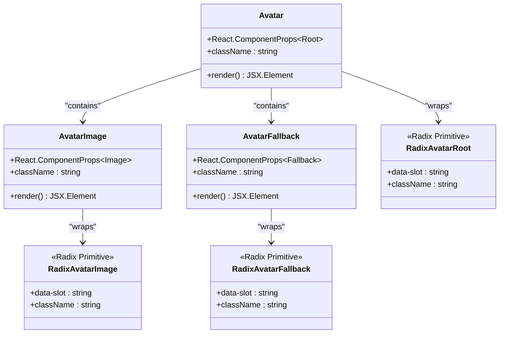

# Avatar Component Documentation

<cite>
**Referenced Files in This Document**
- [components/ui/avatar.tsx](file://components/ui/avatar.tsx)
- [lib/utils.ts](file://lib/utils.ts)
- [app/_components/Sidebar.tsx](file://app/_components/Sidebar.tsx)
- [app/globals.css](file://app/globals.css)
- [components.json](file://components.json)
- [package.json](file://package.json)
</cite>

## Table of Contents
1. [Introduction](#introduction)
2. [Component Architecture](#component-architecture)
3. [Core Implementation](#core-implementation)
4. [Props and Configuration](#props-and-configuration)
5. [Usage Examples](#usage-examples)
6. [Styling and Theme Integration](#styling-and-theme-integration)
7. [Accessibility Guidelines](#accessibility-guidelines)
8. [Performance Considerations](#performance-considerations)
9. [Integration Patterns](#integration-patterns)
10. [Troubleshooting Guide](#troubleshooting-guide)
11. [Best Practices](#best-practices)

## Introduction

The Avatar component is a sophisticated user interface element designed for displaying user profile images in the activity-tracker application. Built using Radix UI primitives with Tailwind CSS for responsive sizing and theme consistency, this component provides a robust solution for handling user avatars with built-in fallback mechanisms and accessibility support.

The component follows modern React patterns with TypeScript support, leveraging the power of Radix UI's atomic design principles while maintaining seamless integration with Tailwind CSS utilities for consistent theming across the application.

## Component Architecture

The Avatar component consists of three primary parts, each serving a specific purpose in the overall avatar display system:



**Diagram sources**
- [components/ui/avatar.tsx](file://components/ui/avatar.tsx#L8-L54)

**Section sources**
- [components/ui/avatar.tsx](file://components/ui/avatar.tsx#L1-L55)

## Core Implementation

The Avatar component is implemented as a composition of three distinct React components, each wrapping Radix UI primitives with Tailwind CSS styling:

### Base Avatar Component

The main `Avatar` component serves as the container, providing the fundamental structure and styling:

```typescript
function Avatar({
  className,
  ...props
}: React.ComponentProps<typeof AvatarPrimitive.Root>) {
  return (
    <AvatarPrimitive.Root
      data-slot="avatar"
      className={cn(
        "relative flex size-10 shrink-0 overflow-hidden rounded-full outline-2 outline-border",
        className,
      )}
      {...props}
    />
  )
}
```

### Avatar Image Component

The `AvatarImage` component handles the actual image display with responsive sizing:

```typescript
function AvatarImage({
  className,
  ...props
}: React.ComponentProps<typeof AvatarPrimitive.Image>) {
  return (
    <AvatarPrimitive.Image
      data-slot="avatar-image"
      className={cn("aspect-square size-full", className)}
      {...props}
    />
  )
}
```

### Avatar Fallback Component

The `AvatarFallback` component provides a styled fallback when the image fails to load or isn't available:

```typescript
function AvatarFallback({
  className,
  ...props
}: React.ComponentProps<typeof AvatarPrimitive.Fallback>) {
  return (
    <AvatarPrimitive.Fallback
      data-slot="avatar-fallback"
      className={cn(
        "flex size-full items-center justify-center rounded-full bg-secondary-background text-foreground font-base",
        className,
      )}
      {...props}
    />
  )
}
```

**Section sources**
- [components/ui/avatar.tsx](file://components/ui/avatar.tsx#L8-L54)

## Props and Configuration

### Core Props

The Avatar component accepts all standard props supported by Radix UI's Avatar primitives, with additional flexibility through the `className` prop for custom styling.

#### Size Variants

While the default implementation uses a fixed size of `size-10` (40px), the component can be easily customized for different sizes through Tailwind CSS classes:

```typescript
// Default size (40px)
<Avatar className="size-10">

// Small size (32px)
<Avatar className="size-8">

// Large size (48px)
<Avatar className="size-12">

// Extra large size (64px)
<Avatar className="size-16">
```

#### Alternative Size Classes

The component supports various size configurations through Tailwind CSS utilities:

- `size-8` (32px)
- `size-10` (40px) - default
- `size-12` (48px)
- `size-16` (64px)

### Data Attributes

Each component includes specific `data-slot` attributes for testing and accessibility:

- `Avatar`: `data-slot="avatar"`
- `AvatarImage`: `data-slot="avatar-image"`
- `AvatarFallback`: `data-slot="avatar-fallback"`

**Section sources**
- [components/ui/avatar.tsx](file://components/ui/avatar.tsx#L16-L48)

## Usage Examples

### Basic Implementation

The simplest usage involves providing both image and fallback content:

```typescript
<Avatar>
  <AvatarImage src="/avatars/user.jpg" alt="User Profile" />
  <AvatarFallback>JD</AvatarFallback>
</Avatar>
```

### Integration with User Data

In the activity-tracker application, the Avatar component is commonly used with user data objects:

```typescript
// From AppSidebar component
<Avatar className="h-8 w-8">
  <AvatarImage
    src="https://github.com/shadcn.png?size=40"
    alt="CN"
  />
  <AvatarFallback>CN</AvatarFallback>
</Avatar>
```

### Responsive Sizing

The component can be adapted for different contexts with appropriate sizing:

```typescript
// Large avatar in header
<Avatar className="size-16">
  <AvatarImage src={user.avatarUrl} alt={`${user.name}'s avatar`} />
  <AvatarFallback>{getInitials(user.name)}</AvatarFallback>
</Avatar>

// Small avatar in menu
<Avatar className="size-8">
  <AvatarImage src={user.avatarUrl} alt={`${user.name}'s avatar`} />
  <AvatarFallback>{getInitials(user.name)}</AvatarFallback>
</Avatar>
```

**Section sources**
- [app/_components/Sidebar.tsx](file://app/_components/Sidebar.tsx#L185-L200)

## Styling and Theme Integration

### Class Merging Utility

The component utilizes the `cn` utility function from the `@/lib/utils` module, which combines `clsx` and `tailwind-merge` for intelligent class merging:

```typescript
import { cn } from "@/lib/utils"

// The cn function definition
import { clsx, type ClassValue } from "clsx"
import { twMerge } from "tailwind-merge"

export function cn(...inputs: ClassValue[]) {
  return twMerge(clsx(inputs))
}
```

### Theme Variables

The component integrates seamlessly with the application's theme system through CSS custom properties:

```css
:root {
  --background: oklch(93.46% 0.0305 255.11);
  --secondary-background: oklch(100% 0 0);
  --foreground: oklch(0% 0 0);
  --border: oklch(0% 0 0);
}

.dark {
  --background: oklch(29.23% 0.0626 270.49);
  --secondary-background: oklch(23.93% 0 0);
  --foreground: oklch(92.49% 0 0);
}
```

### Tailwind CSS Integration

The component leverages Tailwind CSS utilities for responsive design and consistent theming:

```typescript
// Container styling
"relative flex size-10 shrink-0 overflow-hidden rounded-full outline-2 outline-border"

// Image styling  
"aspect-square size-full"

// Fallback styling
"flex size-full items-center justify-center rounded-full bg-secondary-background text-foreground font-base"
```

**Section sources**
- [components/ui/avatar.tsx](file://components/ui/avatar.tsx#L16-L48)
- [lib/utils.ts](file://lib/utils.ts#L1-L7)
- [app/globals.css](file://app/globals.css#L1-L73)

## Accessibility Guidelines

### Alt Text Requirements

Proper alt text is crucial for accessibility and should describe the avatar's purpose rather than just the image content:

```typescript
// Good: Descriptive alt text
<AvatarImage src="/avatars/user.jpg" alt="John Doe's profile picture" />

// Good: Initials-based alt text
<AvatarImage src="/avatars/user.jpg" alt="User profile" />

// Avoid: Generic alt text
<AvatarImage src="/avatars/user.jpg" alt="" />
```

### ARIA Roles and States

The component automatically inherits accessibility features from Radix UI primitives:

- **Role**: Automatically managed by Radix UI
- **State**: Inherits from parent container
- **Focus Management**: Handled by Radix UI focus management

### Semantic HTML Structure

The component maintains semantic HTML structure through proper nesting:

```html
<!-- Proper semantic structure -->
<div role="img" aria-label="User Profile">
  
  <div>Fallback Content</div>
</div>
```

## Performance Considerations

### Lazy Loading Strategies

For optimal performance, consider implementing lazy loading for avatars in lists or grids:

```typescript
// Using native lazy loading
<AvatarImage 
  src="/avatars/user.jpg" 
  alt="User Profile" 
  loading="lazy"
/>

// Conditional rendering for performance
{hasAvatar ? (
  <AvatarImage src={avatarUrl} alt={`${userName}'s avatar`} />
) : (
  <AvatarFallback>{getInitials(userName)}</AvatarFallback>
)}
```

### Image Optimization

The component works well with Next.js image optimization:

```typescript
import Image from 'next/image'

// Optimized avatar with Next.js Image
<Avatar>
  <AvatarImage 
    src={imageSrc} 
    alt="User Profile"
    width={40}
    height={40}
  />
  <AvatarFallback>JD</AvatarFallback>
</Avatar>
```

### Caching Strategies

Implement appropriate caching headers for avatar images:

```typescript
// Server-side caching headers
export async function GET() {
  return new Response(imageBuffer, {
    headers: {
      'Cache-Control': 'public, max-age=31536000, immutable',
      'Content-Type': 'image/jpeg'
    }
  })
}
```

## Integration Patterns

### Import Syntax

The Avatar component follows the standardized import pattern used throughout the application:

```typescript
// Standard import
import { Avatar, AvatarImage, AvatarFallback } from '@/components/ui/avatar'

// Usage in components
<Avatar>
  <AvatarImage src="/avatars/user.jpg" alt="User Profile" />
  <AvatarFallback>JD</AvatarFallback>
</Avatar>
```

### User Data Integration

Common patterns for integrating with user data objects:

```typescript
interface UserData {
  id: string
  name: string
  email: string
  avatarUrl?: string
}

function UserAvatar({ user }: { user: UserData }) {
  const initials = user.name
    .split(' ')
    .map(n => n[0])
    .join('')
    .toUpperCase()

  return (
    <Avatar>
      {user.avatarUrl ? (
        <AvatarImage src={user.avatarUrl} alt={`${user.name}'s avatar`} />
      ) : null}
      <AvatarFallback>{initials}</AvatarFallback>
    </Avatar>
  )
}
```

**Section sources**
- [app/_components/Sidebar.tsx](file://app/_components/Sidebar.tsx#L185-L200)

## Troubleshooting Guide

### Common Issues and Solutions

#### Broken Image Sources

When image sources fail to load, the fallback component activates automatically:

```typescript
// Problem: Broken image URL
<AvatarImage src="https://example.com/broken.jpg" alt="User" />

// Solution: Provide fallback
<Avatar>
  <AvatarImage src="https://example.com/broken.jpg" alt="User" />
  <AvatarFallback>U</AvatarFallback>
</Avatar>
```

#### Size Inconsistency

Ensure consistent sizing across different contexts:

```typescript
// Problem: Inconsistent sizes
<Avatar className="size-8" /> {/* Small */}
<Avatar className="size-12" /> {/* Large */}

// Solution: Use consistent sizing
const avatarSize = 'size-10' // Define globally
<Avatar className={avatarSize} />
```

#### Theme Integration Issues

Verify that theme variables are properly configured:

```typescript
// Check theme variables are defined
:root {
  --secondary-background: var(--background);
  --foreground: var(--foreground);
}

// Verify CSS custom properties are loaded
body {
  @apply text-foreground bg-background;
}
```

### Debugging Tips

1. **Inspect Data Attributes**: Use browser dev tools to check `data-slot` attributes
2. **Verify Class Names**: Ensure Tailwind classes are properly generated
3. **Test Fallback**: Temporarily break image URLs to verify fallback behavior
4. **Check Theme Variables**: Verify CSS custom properties are accessible

## Best Practices

### Component Composition

Follow the recommended composition pattern:

```typescript
// Recommended pattern
<Avatar>
  <AvatarImage src={imageUrl} alt={altText} />
  <AvatarFallback>{fallbackContent}</AvatarFallback>
</Avatar>
```

### Performance Optimization

1. **Lazy Load Images**: Use native lazy loading for off-screen avatars
2. **Optimize Image Sizes**: Serve appropriately sized images
3. **Implement Caching**: Set appropriate cache headers
4. **Use WebP Format**: Prefer WebP for better compression

### Accessibility Standards

1. **Descriptive Alt Text**: Always provide meaningful alt text
2. **Fallback Content**: Ensure readable fallback content
3. **Keyboard Navigation**: Leverage Radix UI's built-in focus management
4. **Screen Reader Support**: Rely on semantic HTML structure

### Theme Consistency

1. **Use Theme Variables**: Leverage CSS custom properties for consistency
2. **Tailwind Integration**: Utilize Tailwind CSS for responsive design
3. **Consistent Sizing**: Maintain consistent size scales across components
4. **Color Accessibility**: Ensure sufficient contrast ratios in fallback backgrounds

The Avatar component demonstrates excellent practices in modern React development, combining accessibility, performance, and maintainability through thoughtful design and implementation. Its integration with Radix UI and Tailwind CSS creates a powerful foundation for building accessible and performant user interfaces.