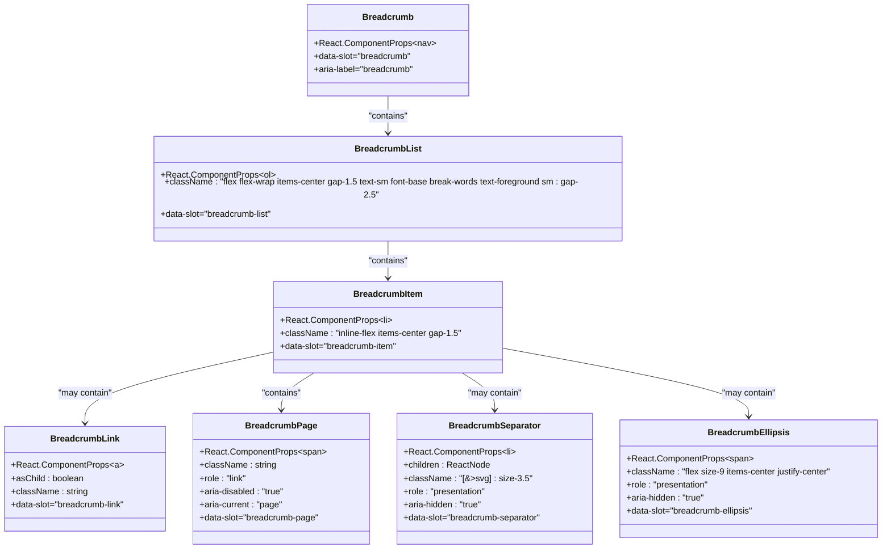
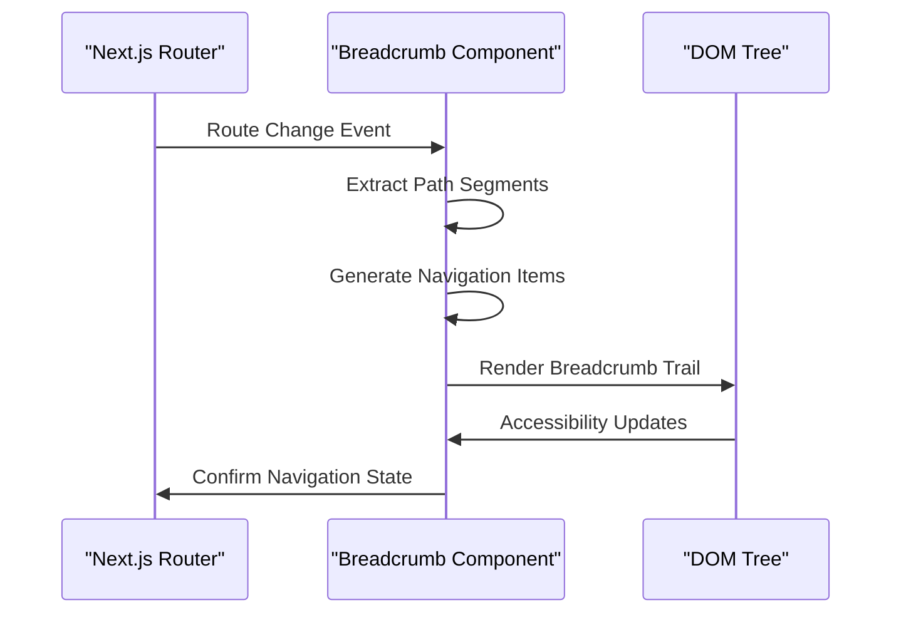
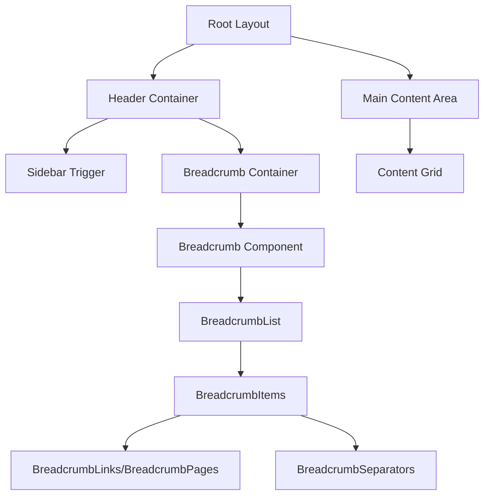

# Breadcrumb Navigation Component

<cite>
**Referenced Files in This Document**
- [components/ui/breadcrumb.tsx](file://components/ui/breadcrumb.tsx)
- [app/page.tsx](file://app/page.tsx)
- [app/layout.tsx](file://app/layout.tsx)
- [app/globals.css](file://app/globals.css)
- [lib/utils.ts](file://lib/utils.ts)
- [components.json](file://components.json)
- [package.json](file://package.json)
- [app/_components/Sidebar.tsx](file://app/_components/Sidebar.tsx)
</cite>

## Table of Contents
1. [Introduction](#introduction)
2. [Component Architecture](#component-architecture)
3. [Core Components](#core-components)
4. [Integration with Next.js App Router](#integration-with-nextjs-app-router)
5. [Styling and Accessibility](#styling-and-accessibility)
6. [Responsive Behavior](#responsive-behavior)
7. [Implementation Examples](#implementation-examples)
8. [Best Practices](#best-practices)
9. [Common Implementation Errors](#common-implementation-errors)
10. [SEO and Internationalization](#seo-and-internationalization)
11. [Troubleshooting Guide](#troubleshooting-guide)
12. [Conclusion](#conclusion)

## Introduction

The Breadcrumb navigation component is a semantic HTML-based navigation element designed to show hierarchical page location within the activity-tracker app. Built using React and styled with Tailwind CSS, it provides an intuitive way for users to understand their current position within the application's navigation structure.

The component follows modern web standards by utilizing semantic HTML elements (`nav`, `ol`, `li`, `a`, `span`) and adheres to accessibility guidelines with proper ARIA attributes. It integrates seamlessly with Next.js App Router to dynamically reflect the current route path while maintaining optimal performance and user experience.

## Component Architecture

The Breadcrumb component consists of six primary subcomponents, each serving a specific purpose in the navigation hierarchy:



**Diagram sources**
- [components/ui/breadcrumb.tsx](file://components/ui/breadcrumb.tsx#L1-L107)

**Section sources**
- [components/ui/breadcrumb.tsx](file://components/ui/breadcrumb.tsx#L1-L107)

## Core Components

### Breadcrumb Container

The main `Breadcrumb` component serves as the container for the entire navigation trail. It uses semantic HTML `nav` element with appropriate ARIA labeling:

```typescript
function Breadcrumb({ ...props }: React.ComponentProps<"nav">) {
  return <nav data-slot="breadcrumb" aria-label="breadcrumb" {...props} />
}
```

Key characteristics:
- Uses `nav` element for semantic meaning
- Includes `aria-label="breadcrumb"` for screen reader support
- Passes through all native HTML attributes
- Provides data-slot identification for testing

### BreadcrumbList

The `BreadcrumbList` component renders the navigation trail as an ordered list (`ol`) with responsive spacing:

```typescript
function BreadcrumbList({ className, ...props }: React.ComponentProps<"ol">) {
  return (
    <ol
      data-slot="breadcrumb-list"
      className={cn(
        "flex flex-wrap items-center gap-1.5 text-sm font-base break-words text-foreground sm:gap-2.5",
        className,
      )}
      {...props}
    />
  )
}
```

Features:
- Flexbox layout for wrapping on smaller screens
- Responsive gap sizing (1.5 units on mobile, 2.5 units on desktop)
- Text wrapping for long URLs
- Semantic `ol` element for proper list structure

### BreadcrumbItem

Individual navigation items are rendered as list items (`li`) with consistent spacing:

```typescript
function BreadcrumbItem({ className, ...props }: React.ComponentProps<"li">) {
  return (
    <li
      data-slot="breadcrumb-item"
      className={cn("inline-flex items-center gap-1.5", className)}
      {...props}
    />
  )
}
```

Characteristics:
- Inline-flex display for horizontal alignment
- Consistent gap spacing between elements
- Flexible content positioning

### BreadcrumbLink

The `BreadcrumbLink` component provides navigation links with conditional rendering:

```typescript
function BreadcrumbLink({
  asChild,
  className,
  ...props
}: React.ComponentProps<"a"> & {
  asChild?: boolean
}) {
  const Comp = asChild ? Slot : "a"

  return (
    <Comp data-slot="breadcrumb-link" className={cn(className)} {...props} />
  )
}
```

Advanced features:
- Supports Radix UI's `Slot` component for composition
- Conditional rendering based on `asChild` prop
- Maintains link semantics for SEO and accessibility

### BreadcrumbPage

The current page indicator uses a span element with special accessibility treatment:

```typescript
function BreadcrumbPage({ className, ...props }: React.ComponentProps<"span">) {
  return (
    <span
      data-slot="breadcrumb-page"
      role="link"
      aria-disabled="true"
      aria-current="page"
      className={cn(className)}
      {...props}
    />
  )
}
```

Accessibility features:
- Role set to "link" for consistent keyboard navigation
- `aria-disabled="true"` prevents interactive behavior
- `aria-current="page"` identifies the current page
- Semantic span element for non-navigable content

### BreadcrumbSeparator

Separators visually distinguish navigation steps:

```typescript
function BreadcrumbSeparator({
  children,
  className,
  ...props
}: React.ComponentProps<"li">) {
  return (
    <li
      data-slot="breadcrumb-separator"
      role="presentation"
      aria-hidden="true"
      className={cn("[&>svg]:size-3.5", className)}
      {...props}
    >
      {children ?? <ChevronRight />}
    </li>
  )
}
```

Visual elements:
- Uses Lucide's ChevronRight icon by default
- Configurable through children prop
- Hidden from assistive technologies
- Properly sized SVG icons

### BreadcrumbEllipsis

Provides overflow indication for deeply nested paths:

```typescript
function BreadcrumbEllipsis({
  className,
  ...props
}: React.ComponentProps<"span">) {
  return (
    <span
      data-slot="breadcrumb-ellipsis"
      role="presentation"
      aria-hidden="true"
      className={cn("flex size-9 items-center justify-center", className)}
      {...props}
    >
      <MoreHorizontal className="size-4" />
      <span className="sr-only">More</span>
    </span>
  )
}
```

Features:
- Circular container for visual consistency
- MoreHorizontal icon for overflow indication
- Screen reader text for accessibility
- Hidden from assistive technologies

**Section sources**
- [components/ui/breadcrumb.tsx](file://components/ui/breadcrumb.tsx#L1-L107)

## Integration with Next.js App Router

The Breadcrumb component integrates seamlessly with Next.js App Router through dynamic route detection and automatic path generation. While the current implementation doesn't automatically generate breadcrumbs from routes, it's designed to work with the router's capabilities.

### Dynamic Route Integration

The component works best when combined with Next.js's routing system:

```typescript
// Example integration pattern
import Link from 'next/link';
import { usePathname } from 'next/navigation';

function DynamicBreadcrumb() {
  const pathname = usePathname();
  const pathSegments = pathname.split('/').filter(Boolean);
  
  return (
    <Breadcrumb>
      <BreadcrumbList>
        {pathSegments.map((segment, index) => (
          <BreadcrumbItem key={index}>
            {index === pathSegments.length - 1 ? (
              <BreadcrumbPage>{segment}</BreadcrumbPage>
            ) : (
              <BreadcrumbLink href={`/${pathSegments.slice(0, index + 1).join('/')}`}>
                {segment}
              </BreadcrumbLink>
            )}
            {index < pathSegments.length - 1 && <BreadcrumbSeparator />}
          </BreadcrumbItem>
        ))}
      </BreadcrumbList>
    </Breadcrumb>
  );
}
```

### Automatic Path Generation

The component can be enhanced to automatically generate breadcrumbs based on the current route:



**Diagram sources**
- [app/page.tsx](file://app/page.tsx#L1-L52)

**Section sources**
- [app/page.tsx](file://app/page.tsx#L1-L52)

## Styling and Accessibility

### Tailwind CSS Integration

The component leverages Tailwind CSS for responsive and theme-aware styling:

```typescript
// Core styling from BreadcrumbList
className={cn(
  "flex flex-wrap items-center gap-1.5 text-sm font-base break-words text-foreground sm:gap-2.5",
  className,
)}
```

Styling characteristics:
- Responsive gap sizing (mobile: 1.5, desktop: 2.5)
- Text wrapping for long URLs
- Foreground color inheritance
- Font base weight for readability

### Color Scheme Integration

The component adapts to the application's color scheme defined in `globals.css`:

```css
:root {
  --background: oklch(93.46% 0.0305 255.11);
  --foreground: oklch(0% 0 0);
  --main: oklch(67.47% 0.1726 259.49);
  --border: oklch(0% 0 0);
}

.dark {
  --background: oklch(29.23% 0.0626 270.49);
  --foreground: oklch(92.49% 0 0);
  --main: oklch(67.47% 0.1726 259.49);
}
```

### Accessibility Features

The component implements comprehensive accessibility features:

1. **ARIA Labels and Roles**:
   - `aria-label="breadcrumb"` on container
   - `role="link"` on current page indicators
   - `aria-current="page"` for current page identification
   - `aria-disabled="true"` on non-interactive elements

2. **Keyboard Navigation**:
   - Links are focusable and navigable via keyboard
   - Current page is announced appropriately
   - Logical tab order maintained

3. **Screen Reader Support**:
   - Proper heading hierarchy
   - Descriptive labels for interactive elements
   - Hidden elements marked with `aria-hidden="true"`

4. **Semantic HTML**:
   - Use of `nav`, `ol`, `li`, `a`, and `span` elements
   - Proper list structure for navigation
   - Meaningful element selection

**Section sources**
- [components/ui/breadcrumb.tsx](file://components/ui/breadcrumb.tsx#L1-L107)
- [app/globals.css](file://app/globals.css#L1-L74)

## Responsive Behavior

### Mobile-First Design

The component implements responsive behavior through Tailwind's breakpoint system:

```typescript
// Responsive gap sizing
className={cn(
  "flex flex-wrap items-center gap-1.5 text-sm font-base break-words text-foreground sm:gap-2.5",
  className,
)}
```

Responsive features:
- **Mobile (default)**: 1.5 unit gaps, compact layout
- **Desktop (sm+)**: 2.5 unit gaps, expanded spacing
- **Text Wrapping**: Prevents horizontal overflow
- **Flex Wrap**: Automatically wraps to multiple lines when needed

### Touch Target Sizing

The component ensures adequate touch targets for mobile devices:

```typescript
// Ellipsis touch target sizing
className={cn("flex size-9 items-center justify-center", className)}
```

Touch target considerations:
- Minimum 44px touch target size
- Adequate spacing around interactive elements
- Clear visual feedback for touch interactions

### Breakpoint-Specific Elements

Some elements can be conditionally rendered based on screen size:

```typescript
// Example usage with responsive visibility
<BreadcrumbItem className="hidden md:block">
  <BreadcrumbLink href="#">Building Your Application</BreadcrumbLink>
</BreadcrumbItem>
<BreadcrumbSeparator className="hidden md:block" />
```

**Section sources**
- [components/ui/breadcrumb.tsx](file://components/ui/breadcrumb.tsx#L15-L25)
- [app/page.tsx](file://app/page.tsx#L18-L22)

## Implementation Examples

### Basic Usage Pattern

The simplest implementation demonstrates the component's structure:

```typescript
import {
  Breadcrumb,
  BreadcrumbItem,
  BreadcrumbLink,
  BreadcrumbList,
  BreadcrumbPage,
  BreadcrumbSeparator,
} from "@/components/ui/breadcrumb";

export default function Page() {
  return (
    <Breadcrumb>
      <BreadcrumbList>
        <BreadcrumbItem>
          <BreadcrumbLink href="#">Home</BreadcrumbLink>
        </BreadcrumbItem>
        <BreadcrumbSeparator />
        <BreadcrumbItem>
          <BreadcrumbLink href="/dashboard">Dashboard</BreadcrumbLink>
        </BreadcrumbItem>
        <BreadcrumbSeparator />
        <BreadcrumbItem>
          <BreadcrumbPage>Tracker</BreadcrumbPage>
        </BreadcrumbItem>
      </BreadcrumbList>
    </Breadcrumb>
  );
}
```

### Advanced Integration Example

A more sophisticated implementation with dynamic content:

```typescript
import {
  Breadcrumb,
  BreadcrumbItem,
  BreadcrumbLink,
  BreadcrumbList,
  BreadcrumbPage,
  BreadcrumbSeparator,
  BreadcrumbEllipsis,
} from "@/components/ui/breadcrumb";

function ComplexBreadcrumb() {
  const navigationItems = [
    { label: "Home", href: "/" },
    { label: "Projects", href: "/projects" },
    { label: "Team", href: "/projects/team" },
    { label: "Members", href: "/projects/team/members" },
    { label: "John Doe", href: "/projects/team/members/john-doe" },
  ];

  return (
    <Breadcrumb>
      <BreadcrumbList>
        {navigationItems.map((item, index) => (
          <>
            {index > 2 && index < navigationItems.length - 1 && (
              <BreadcrumbItem>
                <BreadcrumbEllipsis />
              </BreadcrumbItem>
            )}
            {index >= 3 && index < navigationItems.length - 1 ? null : (
              <BreadcrumbItem>
                {index === navigationItems.length - 1 ? (
                  <BreadcrumbPage>{item.label}</BreadcrumbPage>
                ) : (
                  <BreadcrumbLink href={item.href}>{item.label}</BreadcrumbLink>
                )}
              </BreadcrumbItem>
            )}
            {index < navigationItems.length - 1 && (
              <BreadcrumbSeparator />
            )}
          </>
        ))}
      </BreadcrumbList>
    </Breadcrumb>
  );
}
```

### Layout Integration

The breadcrumb integrates naturally with the application layout:



**Diagram sources**
- [app/page.tsx](file://app/page.tsx#L15-L25)

**Section sources**
- [app/page.tsx](file://app/page.tsx#L1-L52)

## Best Practices

### Import and Usage Patterns

Import the breadcrumb component using the standardized path:

```typescript
import {
  Breadcrumb,
  BreadcrumbItem,
  BreadcrumbLink,
  BreadcrumbList,
  BreadcrumbPage,
  BreadcrumbSeparator,
} from "@/components/ui/breadcrumb";
```

### Placement Guidelines

1. **Primary Location**: Place breadcrumbs near the top of the page, below the header
2. **Consistency**: Use breadcrumbs consistently across all pages
3. **Context**: Ensure breadcrumbs provide meaningful context about the current page
4. **Hierarchy**: Maintain logical navigation hierarchy

### Update Frequency

1. **Route Changes**: Update breadcrumbs when the user navigates to a new route
2. **Dynamic Content**: Refresh breadcrumbs when content changes significantly
3. **State Changes**: Update breadcrumbs for major state transitions
4. **Debouncing**: Avoid excessive updates during rapid navigation

### Performance Considerations

1. **Conditional Rendering**: Use `asChild` prop for efficient composition
2. **Memoization**: Memoize breadcrumb generation for complex paths
3. **Lazy Loading**: Load breadcrumb data asynchronously when needed
4. **Optimization**: Minimize DOM nodes for deeply nested paths

### Code Organization

1. **Component Structure**: Maintain clear separation of concerns
2. **Type Safety**: Use TypeScript for robust development
3. **Testing**: Implement comprehensive unit tests
4. **Documentation**: Document complex breadcrumb logic

**Section sources**
- [components/ui/breadcrumb.tsx](file://components/ui/breadcrumb.tsx#L1-L107)

## Common Implementation Errors

### Incorrect Separator Rendering

**Problem**: Separators appear incorrectly or inconsistently

```typescript
// ❌ Wrong - inconsistent separator usage
<BreadcrumbItem>
  <BreadcrumbLink href="/">Home</BreadcrumbLink>
</BreadcrumbItem>
<BreadcrumbItem>
  <BreadcrumbPage>Dashboard</BreadcrumbPage>
</BreadcrumbItem>
```

**Solution**: Always use `BreadcrumbSeparator` between items

```typescript
// ✅ Correct - consistent separator usage
<BreadcrumbItem>
  <BreadcrumbLink href="/">Home</BreadcrumbLink>
</BreadcrumbSeparator>
<BreadcrumbItem>
  <BreadcrumbPage>Dashboard</BreadcrumbPage>
</BreadcrumbSeparator>
```

### Missing Accessibility Attributes

**Problem**: Insufficient accessibility for screen readers

```typescript
// ❌ Wrong - missing accessibility features
<BreadcrumbPage>{currentPage}</BreadcrumbPage>
```

**Solution**: Include proper ARIA attributes

```typescript
// ✅ Correct - full accessibility support
<BreadcrumbPage
  role="link"
  aria-disabled="true"
  aria-current="page"
>
  {currentPage}
</BreadcrumbPage>
```

### Improper Semantic HTML

**Problem**: Using non-semantic elements for navigation

```typescript
// ❌ Wrong - semantic misuse
<div className="breadcrumb">
  <a href="/">Home</a>
  <span>/</span>
  <span>Current Page</span>
</div>
```

**Solution**: Use semantic HTML elements

```typescript
// ✅ Correct - semantic structure
<Breadcrumb>
  <BreadcrumbList>
    <BreadcrumbItem>
      <BreadcrumbLink href="/">Home</BreadcrumbLink>
    </BreadcrumbItem>
    <BreadcrumbSeparator />
    <BreadcrumbItem>
      <BreadcrumbPage>Current Page</BreadcrumbPage>
    </BreadcrumbItem>
  </BreadcrumbList>
</Breadcrumb>
```

### Hardcoded Paths

**Problem**: Static, hardcoded breadcrumb paths

```typescript
// ❌ Wrong - inflexible implementation
<Breadcrumb>
  <BreadcrumbList>
    <BreadcrumbItem><BreadcrumbLink href="/">Home</BreadcrumbLink></BreadcrumbItem>
    <BreadcrumbSeparator />
    <BreadcrumbItem><BreadcrumbLink href="/dashboard">Dashboard</BreadcrumbLink></BreadcrumbItem>
    <BreadcrumbSeparator />
    <BreadcrumbItem><BreadcrumbPage>Tracker</BreadcrumbPage></BreadcrumbItem>
  </BreadcrumbList>
</Breadcrumb>
```

**Solution**: Use dynamic path generation

```typescript
// ✅ Correct - dynamic breadcrumb generation
function DynamicBreadcrumb({ currentPath }) {
  const segments = currentPath.split('/').filter(Boolean);
  
  return (
    <Breadcrumb>
      <BreadcrumbList>
        {segments.map((segment, index) => (
          <BreadcrumbItem key={index}>
            {index === segments.length - 1 ? (
              <BreadcrumbPage>{segment}</BreadcrumbPage>
            ) : (
              <BreadcrumbLink href={`/${segments.slice(0, index + 1).join('/')}`}>
                {segment}
              </BreadcrumbLink>
            )}
            {index < segments.length - 1 && <BreadcrumbSeparator />}
          </BreadcrumbItem>
        ))}
      </BreadcrumbList>
    </Breadcrumb>
  );
}
```

**Section sources**
- [components/ui/breadcrumb.tsx](file://components/ui/breadcrumb.tsx#L1-L107)

## SEO and Internationalization

### SEO Benefits

The breadcrumb component provides significant SEO advantages:

1. **Structured Navigation**: Helps search engines understand site structure
2. **Internal Linking**: Creates valuable internal linking opportunities
3. **Rich Snippets**: Enables breadcrumb structured data markup
4. **Improved Click-Through Rates**: Enhances user trust and engagement

### Structured Data Implementation

Add structured data for enhanced SEO:

```typescript
function BreadcrumbWithSchema({ currentPage, breadcrumbs }) {
  const schema = {
    "@context": "https://schema.org",
    "@type": "BreadcrumbList",
    itemListElement: breadcrumbs.map((item, index) => ({
      "@type": "ListItem",
      position: index + 1,
      name: item.name,
      item: item.url,
    })),
  };

  return (
    <>
      <script type="application/ld+json">
        {JSON.stringify(schema)}
      </script>
      <Breadcrumb>
        {/* Breadcrumb implementation */}
      </Breadcrumb>
    </>
  );
}
```

### Internationalization Support

The component supports internationalization through:

1. **Text Direction**: Works with RTL languages
2. **Localization**: Supports translated labels
3. **Date/Time Formats**: Adapts to regional conventions
4. **Cultural Adaptations**: Respects local navigation patterns

### Multi-Language Implementation

```typescript
import { useTranslations } from 'next-intl';

function LocalizedBreadcrumb() {
  const t = useTranslations('Breadcrumb');
  
  return (
    <Breadcrumb>
      <BreadcrumbList>
        <BreadcrumbItem>
          <BreadcrumbLink href="/">{t('home')}</BreadcrumbLink>
        </BreadcrumbItem>
        <BreadcrumbSeparator />
        <BreadcrumbItem>
          <BreadcrumbPage>{t('current')}</BreadcrumbPage>
        </BreadcrumbItem>
      </BreadcrumbList>
    </Breadcrumb>
  );
}
```

## Troubleshooting Guide

### Common Issues and Solutions

#### Issue: Breadcrumbs Not Appearing

**Symptoms**: Breadcrumb component renders but shows no content

**Causes**:
- Missing child components
- Incorrect import statements
- CSS conflicts

**Solutions**:
1. Verify all required subcomponents are imported
2. Check component hierarchy structure
3. Review CSS specificity conflicts

#### Issue: Broken Navigation Links

**Symptoms**: Breadcrumb links don't navigate correctly

**Causes**:
- Incorrect href attributes
- Missing Link component integration
- Router configuration issues

**Solutions**:
1. Use Next.js Link component for client-side navigation
2. Verify href paths match existing routes
3. Test navigation in different environments

#### Issue: Accessibility Violations

**Symptoms**: Screen reader issues or keyboard navigation problems

**Causes**:
- Missing ARIA attributes
- Incorrect role assignments
- Focus management issues

**Solutions**:
1. Add required ARIA attributes
2. Verify role assignments
3. Test with screen readers and keyboard navigation

#### Issue: Responsive Layout Problems

**Symptoms**: Breadcrumbs display incorrectly on mobile devices

**Causes**:
- CSS conflicts with breakpoints
- Missing responsive classes
- Content overflow issues

**Solutions**:
1. Review responsive breakpoint classes
2. Test on various device sizes
3. Implement proper text wrapping

### Debugging Tools

1. **Browser DevTools**: Inspect element structure and styles
2. **Accessibility Audit**: Use Lighthouse or axe for accessibility testing
3. **Console Logging**: Add debug logs for dynamic content
4. **Network Tab**: Monitor route changes and data loading

### Performance Monitoring

Monitor breadcrumb performance using:

1. **Lighthouse Scores**: Track Core Web Vitals
2. **Bundle Analysis**: Monitor component bundle size
3. **Runtime Performance**: Measure render times
4. **Memory Usage**: Track memory leaks in dynamic breadcrumbs

**Section sources**
- [components/ui/breadcrumb.tsx](file://components/ui/breadcrumb.tsx#L1-L107)

## Conclusion

The Breadcrumb navigation component represents a well-architected solution for hierarchical navigation in the activity-tracker app. Its modular design, semantic HTML foundation, and comprehensive accessibility features make it a robust choice for modern web applications.

Key strengths of the implementation include:

- **Modular Architecture**: Clean separation of concerns with six distinct subcomponents
- **Semantic HTML**: Proper use of navigation elements for SEO and accessibility
- **Responsive Design**: Adaptive layout for all screen sizes
- **Accessibility Compliance**: Full ARIA support and keyboard navigation
- **Tailwind Integration**: Seamless styling with theme-aware design
- **Composition Flexibility**: Support for advanced use cases through Radix UI Slot

The component's integration with Next.js App Router provides a solid foundation for dynamic breadcrumb generation, while its extensible design allows for future enhancements such as automatic route detection and advanced filtering capabilities.

For developers implementing breadcrumbs in similar applications, this component serves as an excellent reference for building accessible, performant, and user-friendly navigation experiences. The comprehensive documentation and examples provided here enable teams to leverage the component effectively while maintaining best practices for web development.

Future enhancements could include automatic route parsing, dynamic ellipsis handling for deeply nested paths, and enhanced internationalization support. The current implementation provides a strong foundation for these improvements while maintaining backward compatibility and performance standards.