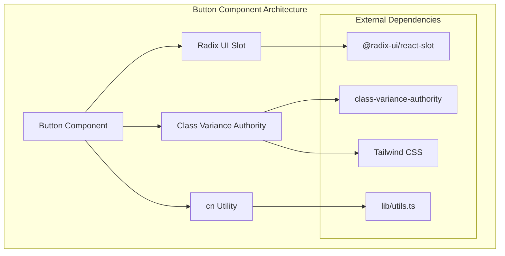
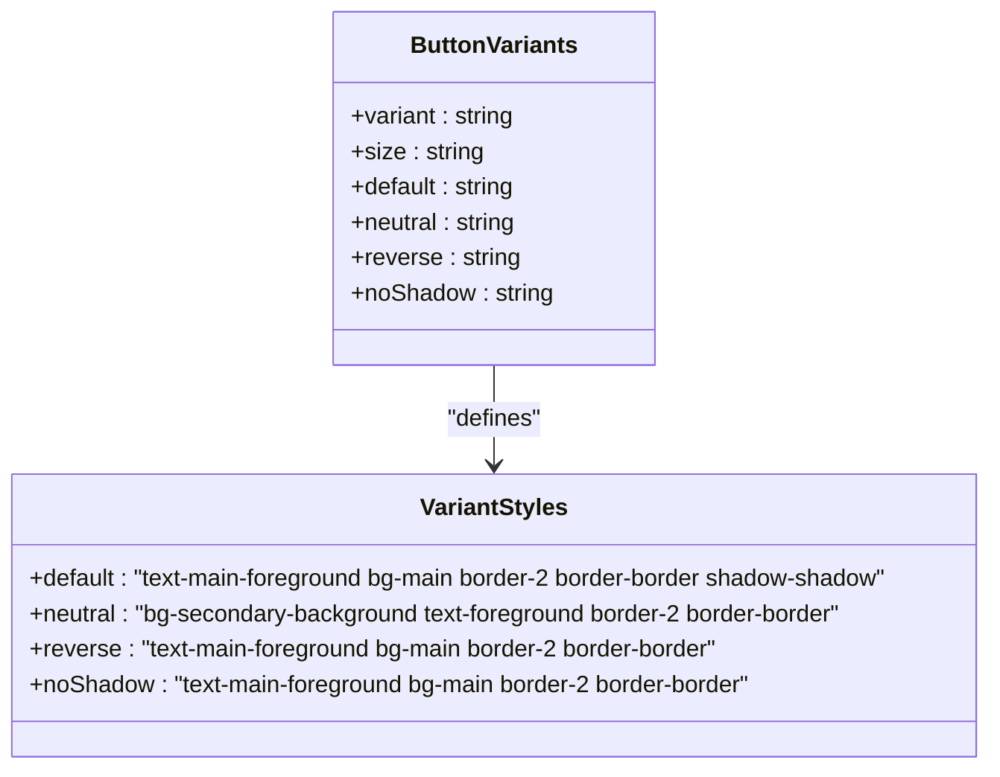
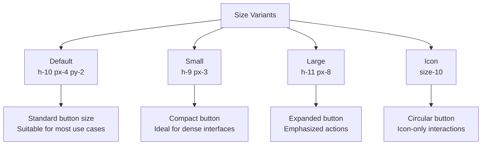

# Button UI Component Documentation

<cite>
**Referenced Files in This Document**
- [components/ui/button.tsx](file://components/ui/button.tsx)
- [lib/utils.ts](file://lib/utils.ts)
- [components/ui/sidebar.tsx](file://components/ui/sidebar.tsx)
- [app/globals.css](file://app/globals.css)
- [package.json](file://package.json)
</cite>

## Table of Contents
1. [Introduction](#introduction)
2. [Component Architecture](#component-architecture)
3. [Core Implementation](#core-implementation)
4. [Variant System](#variant-system)
5. [Size Variants](#size-variants)
6. [Styling Architecture](#styling-architecture)
7. [Usage Examples](#usage-examples)
8. [Accessibility Features](#accessibility-features)
9. [Theme Integration](#theme-integration)
10. [Performance Considerations](#performance-considerations)
11. [Common Issues and Solutions](#common-issues-and-solutions)
12. [Best Practices](#best-practices)

## Introduction

The Button component is a sophisticated, highly customizable UI element built as a styled wrapper around Radix UI primitives using Tailwind CSS utility classes. It serves as the foundation for interactive elements throughout the activity-tracker application, providing consistent styling, accessibility features, and theme support across different contexts.

This component demonstrates advanced React patterns including composition with Radix UI's Slot primitive, dynamic variant styling with class-variance-authority, and seamless integration with modern CSS frameworks. The Button acts as a versatile building block that can be adapted for various use cases while maintaining design system consistency.

## Component Architecture

The Button component follows a modular architecture that separates concerns between styling, behavior, and accessibility. It leverages several key technologies to achieve its functionality:



**Diagram sources**
- [components/ui/button.tsx](file://components/ui/button.tsx#L1-L57)
- [lib/utils.ts](file://lib/utils.ts#L1-L7)

**Section sources**
- [components/ui/button.tsx](file://components/ui/button.tsx#L1-L57)
- [package.json](file://package.json#L15-L25)

## Core Implementation

The Button component is implemented as a functional React component that accepts various props and renders either a native HTML button or a custom slot element based on the `asChild` prop. The core implementation demonstrates several advanced patterns:

```typescript
function Button({
  className,
  variant,
  size,
  asChild = false,
  ...props
}: React.ComponentProps<"button"> & 
  VariantProps<typeof buttonVariants> & {
    asChild?: boolean
  }) {
  const Comp = asChild ? Slot : "button"

  return (
    <Comp
      data-slot="button"
      className={cn(buttonVariants({ variant, size, className }))}
      {...props}
    />
  )
}
```

### Key Implementation Features

1. **Slot Composition**: Uses Radix UI's Slot primitive to enable flexible rendering as either a native button or a custom element
2. **Type Safety**: Leverages TypeScript generics and `VariantProps` for type-safe variant handling
3. **Prop Forwarding**: Spreads all remaining props to the underlying element
4. **Data Attributes**: Includes `data-slot` attributes for testing and styling isolation

**Section sources**
- [components/ui/button.tsx](file://components/ui/button.tsx#L34-L55)

## Variant System

The Button component supports a comprehensive variant system that allows for extensive customization of appearance and behavior. The variant system is powered by class-variance-authority and defines distinct visual styles for different contexts:



**Diagram sources**
- [components/ui/button.tsx](file://components/ui/button.tsx#L11-L28)

### Available Variants

#### Default Variant
- **Purpose**: Primary action buttons
- **Style**: Solid color with subtle shadow effect
- **Use Cases**: Submit buttons, primary actions

#### Neutral Variant
- **Purpose**: Secondary actions with subdued appearance
- **Style**: Background with border, no shadow
- **Use Cases**: Secondary actions, neutral controls

#### Reverse Variant
- **Purpose**: Buttons with reversed shadow direction
- **Style**: Shadow appears in opposite direction
- **Use Cases**: Specialized interface elements

#### No Shadow Variant
- **Purpose**: Minimal styling for subtle integration
- **Style**: Flat appearance with borders
- **Use Cases**: Interface elements requiring minimal emphasis

**Section sources**
- [components/ui/button.tsx](file://components/ui/button.tsx#L11-L28)

## Size Variants

The Button component provides four distinct size variants to accommodate different interface contexts and user preferences:



**Diagram sources**
- [components/ui/button.tsx](file://components/ui/button.tsx#L29-L33)

Each size variant maintains consistent proportions and spacing while adapting to the specific visual requirements of different contexts. The size system ensures predictable layouts and maintains visual hierarchy across the application.

**Section sources**
- [components/ui/button.tsx](file://components/ui/button.tsx#L29-L33)

## Styling Architecture

The Button component integrates multiple styling approaches to achieve comprehensive design flexibility:

### Base Styles
The component establishes foundational styles through class-variance-authority that define core behaviors:

```typescript
const buttonVariants = cva(
  "inline-flex items-center justify-center whitespace-nowrap rounded-base text-sm font-base ring-offset-white transition-all gap-2",
  {
    variants: {
      variant: {
        default: "text-main-foreground bg-main border-2 border-border shadow-shadow hover:translate-x-boxShadowX hover:translate-y-boxShadowY hover:shadow-none",
        neutral: "bg-secondary-background text-foreground border-2 border-border shadow-shadow hover:translate-x-boxShadowX hover:translate-y-boxShadowY hover:shadow-none",
        reverse: "text-main-foreground bg-main border-2 border-border hover:translate-x-reverseBoxShadowX hover:translate-y-reverseBoxShadowY hover:shadow-shadow",
        noShadow: "text-main-foreground bg-main border-2 border-border",
      },
      size: {
        default: "h-10 px-4 py-2",
        sm: "h-9 px-3",
        lg: "h-11 px-8",
        icon: "size-10",
      },
    },
    defaultVariants: {
      variant: "default",
      size: "default",
    },
  },
)
```

### Advanced Styling Features

1. **Focus Management**: Implements custom focus styles with `focus-visible:outline-hidden` and `focus-visible:ring-2`
2. **Disabled States**: Automatic handling of disabled states with `disabled:pointer-events-none` and `disabled:opacity-50`
3. **Hover Effects**: Sophisticated shadow animations with `hover:translate-x` and `hover:translate-y` transformations
4. **SVG Integration**: Special handling for SVG elements within buttons with `gap-2` and `pointer-events-none`

### Utility Class Merging

The component uses a sophisticated utility class merging system through the `cn` function:

```typescript
export function cn(...inputs: ClassValue[]) {
  return twMerge(clsx(inputs))
}
```

This approach combines clsx for conditional class application with tailwind-merge for conflict resolution, ensuring optimal CSS output.

**Section sources**
- [components/ui/button.tsx](file://components/ui/button.tsx#L11-L28)
- [lib/utils.ts](file://lib/utils.ts#L1-L7)

## Usage Examples

The Button component is extensively used throughout the activity-tracker application, particularly in the sidebar navigation system. Here are practical examples of its implementation:

### Basic Usage
```typescript
import { Button } from "@/components/ui/button"

// Standard button
<Button>Click Me</Button>

// Button with variant
<Button variant="neutral">Secondary Action</Button>

// Button with size
<Button size="lg">Large Action</Button>
```

### Navigation Context
The Button component is prominently used in the sidebar trigger functionality:

```typescript
function SidebarTrigger({
  className,
  onClick,
  ...props
}: React.ComponentProps<typeof Button>) {
  const { toggleSidebar } = useSidebar()

  return (
    <Button
      data-sidebar="trigger"
      data-slot="sidebar-trigger"
      variant="noShadow"
      size="icon"
      className={cn("size-7", className)}
      onClick={(event) => {
        onClick?.(event)
        toggleSidebar()
      }}
      {...props}
    >
      <PanelLeftIcon />
      <span className="sr-only">Toggle Sidebar</span>
    </Button>
  )
}
```

### Form Integration
The Button component seamlessly integrates with form elements and validation systems, providing consistent styling across different interaction contexts.

**Section sources**
- [components/ui/sidebar.tsx](file://components/ui/sidebar.tsx#L258-L280)
- [components/ui/button.tsx](file://components/ui/button.tsx#L34-L55)

## Accessibility Features

The Button component incorporates comprehensive accessibility features to ensure usability across diverse user needs:

### Keyboard Navigation
- **Tab Order**: Properly integrated into the browser's tab order
- **Focus Management**: Clear focus indicators with custom ring styles
- **Keyboard Activation**: Full support for Enter and Space key activation

### Screen Reader Support
- **Semantic HTML**: Renders as appropriate semantic elements
- **ARIA Attributes**: Automatic inclusion of relevant ARIA attributes
- **Alternative Text**: Support for screen reader-only text via `sr-only` classes

### Focus Management
The component implements sophisticated focus management:

```typescript
"focus-visible:outline-hidden focus-visible:ring-2 focus-visible:ring-black focus-visible:ring-offset-2"
```

This ensures:
- Hidden outlines for visual focus indicators
- Prominent rings for keyboard navigation
- Proper offset for focus rings

### Disabled State Handling
Automatic handling of disabled states with:
- `disabled:pointer-events-none`: Prevents interaction
- `disabled:opacity-50`: Visual indication of disabled state
- Maintained focus behavior for accessibility compliance

**Section sources**
- [components/ui/button.tsx](file://components/ui/button.tsx#L11-L12)

## Theme Integration

The Button component is designed to work seamlessly with the application's theming system, supporting both light and dark modes:

### CSS Custom Properties
The component utilizes CSS custom properties for theme-aware styling:

```css
:root {
  --background: oklch(93.46% 0.0305 255.11);
  --secondary-background: oklch(100% 0 0);
  --foreground: oklch(0% 0 0);
  --main-foreground: oklch(0% 0 0);
  --main: oklch(67.47% 0.1726 259.49);
  --border: oklch(0% 0 0);
  --shadow: 4px 4px 0px 0px var(--border);
}

.dark {
  --background: oklch(29.23% 0.0626 270.49);
  --secondary-background: oklch(23.93% 0 0);
  --foreground: oklch(92.49% 0 0);
  --main-foreground: oklch(0% 0 0);
  --main: oklch(67.47% 0.1726 259.49);
}
```

### Responsive Behavior
The component adapts to different screen sizes and contexts:
- **Mobile Optimization**: Touch-friendly sizing and spacing
- **Desktop Enhancement**: Additional padding and visual affordances
- **Context Awareness**: Adapts to parent container constraints

**Section sources**
- [app/globals.css](file://app/globals.css#L1-L73)

## Performance Considerations

The Button component is optimized for performance across several dimensions:

### Rendering Efficiency
- **Minimal Re-renders**: Uses stable default variants to prevent unnecessary updates
- **Efficient Prop Passing**: Optimized prop forwarding reduces overhead
- **Conditional Rendering**: Smart handling of `asChild` prop avoids unnecessary DOM nodes

### Bundle Size Optimization
- **Tree Shaking**: Individual variant exports allow for selective imports
- **Utility Class Deduplication**: Tailwind merge prevents duplicate CSS classes
- **Minimal Dependencies**: Lightweight dependency footprint

### Memory Management
- **Event Handler Optimization**: Efficient event handler binding
- **Focus Management**: Proper cleanup of focus-related state
- **SVG Handling**: Optimized SVG element processing

### Best Practices for Performance
1. **Avoid Dynamic Variants**: Use static variants when possible
2. **Minimize Prop Changes**: Reduce unnecessary prop updates
3. **Optimize Event Handlers**: Use memoization for complex handlers
4. **Lazy Loading**: Consider lazy loading for infrequently used variants

## Common Issues and Solutions

### Incorrect Rendering When Disabled
**Problem**: Buttons may appear incorrectly styled when disabled
**Solution**: Ensure proper use of `disabled` prop and verify CSS specificity

```typescript
// Correct usage
<Button disabled>Disabled Button</Button>

// Verify CSS precedence
.disabled:opacity-50 {
  opacity: 0.5 !important;
}
```

### Loading State Integration
**Problem**: Difficulty integrating loading states with button functionality
**Solution**: Use controlled state management with loading indicators

```typescript
const [isLoading, setIsLoading] = useState(false)

<Button 
  disabled={isLoading}
  onClick={() => {
    setIsLoading(true)
    // Perform async operation
    setTimeout(() => setIsLoading(false), 2000)
  }}
>
  {isLoading ? 'Loading...' : 'Submit'}
</Button>
```

### Theme Consistency Issues
**Problem**: Buttons may not properly reflect theme changes
**Solution**: Ensure CSS custom properties are properly defined and accessed

```css
/* Verify theme property availability */
:root {
  --main: oklch(67.47% 0.1726 259.49);
}

/* Use theme-aware classes */
.bg-main {
  background-color: var(--main);
}
```

### SVG Integration Problems
**Problem**: SVG elements within buttons may not render correctly
**Solution**: Apply proper sizing and pointer events handling

```typescript
<Button>
  <svg className="size-4 shrink-0" />
  Text Content
</Button>
```

## Best Practices

### Import Patterns
Always use the path alias for consistent imports:

```typescript
import { Button } from "@/components/ui/button"
```

### Variant Selection
Choose variants based on contextual importance:
- **Primary Actions**: Use `variant="default"`
- **Secondary Actions**: Use `variant="neutral"`
- **Interface Elements**: Use `variant="noShadow"`

### Size Appropriateness
Select sizes based on context:
- **Standard Interfaces**: Use `size="default"`
- **Compact Layouts**: Use `size="sm"`
- **Emphasized Actions**: Use `size="lg"`
- **Icon-only**: Use `size="icon"`

### Accessibility Guidelines
Follow these accessibility guidelines:
- Always provide meaningful text content
- Use appropriate variants for context
- Test with keyboard navigation
- Verify screen reader compatibility

### Performance Optimization
Implement these performance optimizations:
- Use stable default variants
- Minimize prop changes
- Optimize event handlers
- Consider virtualization for lists

### Testing Strategies
Implement comprehensive testing:
- Unit tests for variant combinations
- Accessibility tests with screen readers
- Cross-browser compatibility testing
- Mobile responsiveness verification

The Button component represents a sophisticated approach to UI component design, combining modern React patterns with advanced styling techniques. Its modular architecture, comprehensive variant system, and robust accessibility features make it a reliable foundation for interactive elements throughout the activity-tracker application.