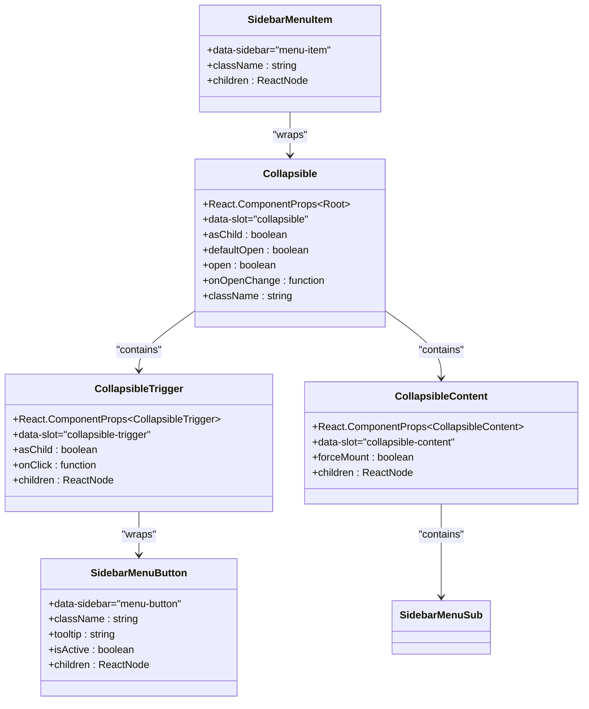
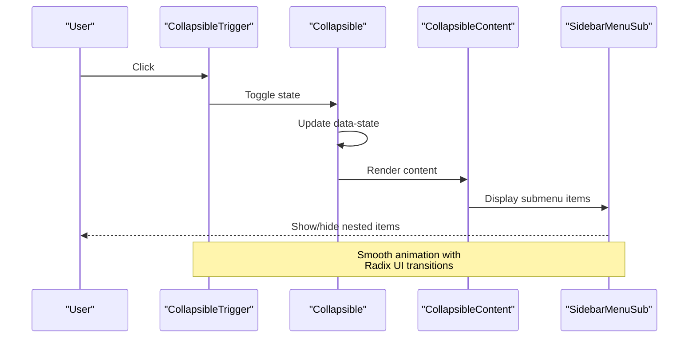
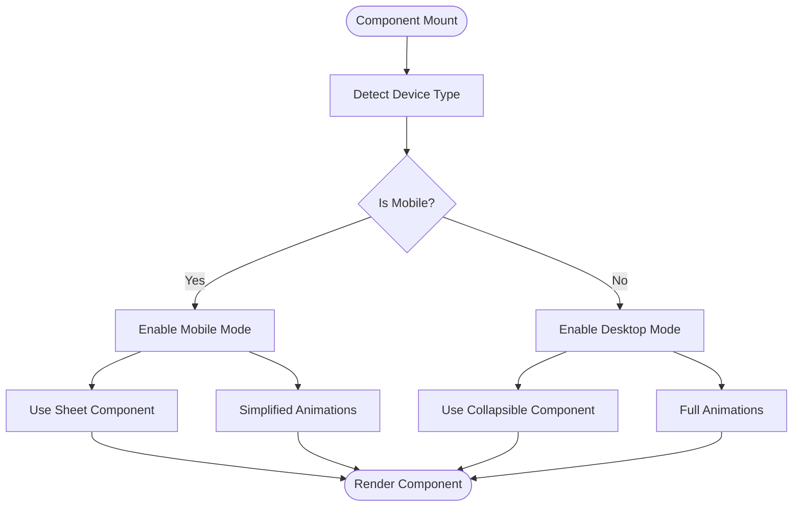

# Collapsible Component Documentation

<cite>
**Referenced Files in This Document**
- [components/ui/collapsible.tsx](file://components/ui/collapsible.tsx)
- [app/_components/Sidebar.tsx](file://app/_components/Sidebar.tsx)
- [components/ui/sidebar.tsx](file://components/ui/sidebar.tsx)
- [hooks/use-mobile.ts](file://hooks/use-mobile.ts)
- [lib/utils.ts](file://lib/utils.ts)
- [package.json](file://package.json)
</cite>

## Table of Contents
1. [Introduction](#introduction)
2. [Component Architecture](#component-architecture)
3. [Implementation Details](#implementation-details)
4. [Integration with Sidebar System](#integration-with-sidebar-system)
5. [Props and Configuration](#props-and-configuration)
6. [Accessibility Features](#accessibility-features)
7. [Mobile Responsiveness](#mobile-responsiveness)
8. [Performance Optimization](#performance-optimization)
9. [Usage Examples](#usage-examples)
10. [Common Issues and Solutions](#common-issues-and-solutions)
11. [Best Practices](#best-practices)

## Introduction

The Collapsible component is a fundamental UI element in the activity-tracker app that enables expandable content sections within the sidebar navigation system. Built on top of Radix UI's Collapsible primitives and styled with Tailwind CSS, this component provides smooth animations and proper accessibility support for managing nested navigation items.

The component serves as a core building block for creating hierarchical menu structures where parent items can expand to reveal child items, commonly seen in admin dashboards and navigation systems. Its implementation demonstrates modern React patterns including composition, context providers, and accessibility-first design principles.

## Component Architecture

The Collapsible system consists of three primary components that work together to create expandable sections:



**Diagram sources**
- [components/ui/collapsible.tsx](file://components/ui/collapsible.tsx#L1-L36)
- [app/_components/Sidebar.tsx](file://app/_components/Sidebar.tsx#L85-L170)

**Section sources**
- [components/ui/collapsible.tsx](file://components/ui/collapsible.tsx#L1-L36)
- [components/ui/sidebar.tsx](file://components/ui/sidebar.tsx#L450-L500)

## Implementation Details

### Core Component Structure

The Collapsible component is implemented as a thin wrapper around Radix UI's Collapsible primitives, providing a clean and accessible interface:

```typescript
// Core Collapsible implementation
function Collapsible({
  ...props
}: React.ComponentProps<typeof CollapsiblePrimitive.Root>) {
  return <CollapsiblePrimitive.Root data-slot="collapsible" {...props} />
}

function CollapsibleTrigger({
  ...props
}: React.ComponentProps<typeof CollapsiblePrimitive.CollapsibleTrigger>) {
  return (
    <CollapsiblePrimitive.CollapsibleTrigger
      data-slot="collapsible-trigger"
      {...props}
    />
  )
}

function CollapsibleContent({
  ...props
}: React.ComponentProps<typeof CollapsiblePrimitive.CollapsibleContent>) {
  return (
    <CollapsiblePrimitive.CollapsibleContent
      data-slot="collapsible-content"
      {...props}
    />
  )
}
```

### Animation States and Transitions

The component leverages Radix UI's built-in animation system, which provides smooth height transitions and proper ARIA state management. The animation states are controlled through CSS classes and data attributes:

- **Expanded State**: `data-state="open"` - Content is visible
- **Collapsed State**: `data-state="closed"` - Content is hidden
- **Transition Classes**: Applied during animation phases

### Tailwind CSS Integration

The component integrates seamlessly with Tailwind CSS through strategic data attributes and slot naming conventions:

```css
/* Example Tailwind integration */
.group-data-[state=open]/collapsible:rotate-90
.data-[state=open]:bg-main
.data-[state=open]:outline-border
```

**Section sources**
- [components/ui/collapsible.tsx](file://components/ui/collapsible.tsx#L1-L36)

## Integration with Sidebar System

The Collapsible component is deeply integrated with the sidebar system to create hierarchical navigation menus. This integration demonstrates advanced React patterns including context consumption and component composition.

### Sidebar Navigation Pattern



**Diagram sources**
- [app/_components/Sidebar.tsx](file://app/_components/Sidebar.tsx#L85-L170)
- [components/ui/sidebar.tsx](file://components/ui/sidebar.tsx#L450-L550)

### Nested Menu Implementation

The sidebar demonstrates how Collapsible works with nested navigation items:

```typescript
// Example from Sidebar.tsx
{data.navMain.map((item) =>
  item.items && item.items.length > 0 ? (
    <Collapsible
      key={item.title}
      asChild
      defaultOpen={item.isActive}
      className="group/collapsible"
    >
      <SidebarMenuItem>
        <CollapsibleTrigger asChild>
          <SidebarMenuButton
            className="data-[state=open]:bg-main data-[state=open]:outline-border data-[state=open]:text-main-foreground"
            tooltip={item.title}
          >
            {item.icon && <item.icon />}
            <span>{item.title}</span>
            <ChevronRight className="ml-auto transition-transform duration-200 group-data-[state=open]/collapsible:rotate-90" />
          </SidebarMenuButton>
        </CollapsibleTrigger>
        <CollapsibleContent>
          <SidebarMenuSub>
            {item.items?.map((subItem) => (
              <SidebarMenuSubItem key={subItem.title}>
                <SidebarMenuSubButton asChild>
                  <a href={subItem.url}>
                    <span>{subItem.title}</span>
                  </a>
                </SidebarMenuSubButton>
              </SidebarMenuSubItem>
            ))}
          </SidebarMenuSub>
        </CollapsibleContent>
      </SidebarMenuItem>
    </Collapsible>
  ) : (
    // Single-level menu item
  )
)}
```

**Section sources**
- [app/_components/Sidebar.tsx](file://app/_components/Sidebar.tsx#L85-L170)

## Props and Configuration

### Core Props

The Collapsible component accepts several key props that control its behavior:

| Prop | Type | Description | Default |
|------|------|-------------|---------|
| `open` | `boolean` | Controls the expanded/collapsed state | `false` |
| `defaultOpen` | `boolean` | Initial expanded state | `false` |
| `onOpenChange` | `(open: boolean) => void` | Callback for state changes | `undefined` |
| `asChild` | `boolean` | Renders children as single child | `false` |
| `className` | `string` | Additional CSS classes | `undefined` |

### Advanced Configuration Options

```typescript
// Example configuration
<Collapsible
  asChild
  defaultOpen={true}
  className="group/collapsible"
  onOpenChange={(isOpen) => {
    console.log('State changed:', isOpen);
    // Persist state to localStorage or backend
  }}
>
  {/* Content */}
</Collapsible>
```

### State Management Integration

The component integrates with the sidebar's state management system through the `useSidebar` hook, allowing for coordinated behavior across the navigation system.

**Section sources**
- [components/ui/collapsible.tsx](file://components/ui/collapsible.tsx#L1-L36)
- [app/_components/Sidebar.tsx](file://app/_components/Sidebar.tsx#L85-L95)

## Accessibility Features

The Collapsible component implements comprehensive accessibility features following WCAG guidelines and ARIA specifications.

### ARIA Attributes

```html
<!-- Generated markup structure -->
<div data-slot="collapsible" data-state="closed">
  <button 
    data-slot="collapsible-trigger" 
    aria-expanded="false" 
    aria-controls="collapsible-content-id"
  >
    <!-- Trigger content -->
  </button>
  <div 
    data-slot="collapsible-content" 
    role="region" 
    aria-labelledby="trigger-id"
    hidden="true"
  >
    <!-- Collapsible content -->
  </div>
</div>
```

### Focus Management

The component automatically manages focus when expanding and collapsing:

- **Focus Trapping**: Prevents focus from escaping the collapsed content
- **Keyboard Navigation**: Supports Enter/Space keys for activation
- **Tab Order**: Maintains logical tab order within expandable sections

### Screen Reader Support

- **Live Regions**: Announces state changes to screen readers
- **Descriptive Labels**: Provides meaningful labels for interactive elements
- **Progressive Enhancement**: Works without JavaScript for basic functionality

**Section sources**
- [components/ui/collapsible.tsx](file://components/ui/collapsible.tsx#L1-L36)

## Mobile Responsiveness

The Collapsible component works seamlessly with the mobile detection system to adapt behavior for different screen sizes.

### Mobile Detection Integration

```typescript
// From use-mobile.ts
const MOBILE_BREAKPOINT = 768

export function useIsMobile() {
  const [isMobile, setIsMobile] = React.useState<boolean | undefined>(undefined)

  React.useEffect(() => {
    const mql = window.matchMedia(`(max-width: ${MOBILE_BREAKPOINT - 1}px)`)
    const onChange = () => {
      setIsMobile(window.innerWidth < MOBILE_BREAKPOINT)
    }
    mql.addEventListener("change", onChange)
    setIsMobile(window.innerWidth < MOBILE_BREAKPOINT)
    return () => mql.removeEventListener("change", onChange)
  }, [])

  return !!isMobile
}
```

### Responsive Behavior



**Diagram sources**
- [hooks/use-mobile.ts](file://hooks/use-mobile.ts#L1-L20)
- [components/ui/sidebar.tsx](file://components/ui/sidebar.tsx#L175-L221)

### Mobile-Specific Adaptations

- **Touch-Friendly Targets**: Larger touch targets for mobile devices
- **Gesture Support**: Swipe gestures for expansion/collapse
- **Reduced Animations**: Simplified animations for better performance
- **Full-Screen Layout**: Uses Sheet component for mobile navigation

**Section sources**
- [hooks/use-mobile.ts](file://hooks/use-mobile.ts#L1-L20)
- [components/ui/sidebar.tsx](file://components/ui/sidebar.tsx#L175-L221)

## Performance Optimization

The Collapsible component implements several performance optimization strategies to ensure smooth user experiences.

### Rendering Optimization

```typescript
// Memoized components prevent unnecessary re-renders
const Collapsible = React.memo(function Collapsible(props) {
  return <CollapsiblePrimitive.Root {...props} />;
});

// Lazy loading for content
function CollapsibleContent({ forceMount, ...props }: Props) {
  return forceMount ? (
    <CollapsiblePrimitive.CollapsibleContent {...props} />
  ) : (
    <CollapsiblePrimitive.CollapsibleContent forceMount={false} {...props} />
  );
}
```

### Memory Management

- **Event Listener Cleanup**: Proper cleanup of media query listeners
- **State Persistence**: Efficient state management to avoid memory leaks
- **Conditional Rendering**: Only renders content when expanded

### Bundle Size Optimization

The component is designed to minimize bundle size impact:

- **Tree Shaking**: Individual exports allow for selective imports
- **Minimal Dependencies**: Relies only on Radix UI primitives
- **Efficient CSS**: Tailwind classes are scoped and optimized

**Section sources**
- [components/ui/collapsible.tsx](file://components/ui/collapsible.tsx#L1-L36)

## Usage Examples

### Basic Implementation

```typescript
import { Collapsible, CollapsibleTrigger, CollapsibleContent } from '@/components/ui/collapsible'

export function BasicCollapsibleExample() {
  return (
    <Collapsible className="w-[350px]" defaultOpen>
      <CollapsibleTrigger className="text-sm font-medium hover:underline">
        Can I use this in my project?
      </CollapsibleTrigger>
      <CollapsibleContent>
        <div className="space-y-2">
          <p className="text-muted-foreground">
            Yes, this component is MIT licensed and free to use in personal and commercial projects.
          </p>
        </div>
      </CollapsibleContent>
    </Collapsible>
  )
}
```

### Advanced Sidebar Integration

```typescript
// From Sidebar.tsx - Production implementation
<Collapsible
  key={item.title}
  asChild
  defaultOpen={item.isActive}
  className="group/collapsible"
>
  <SidebarMenuItem>
    <CollapsibleTrigger asChild>
      <SidebarMenuButton
        className="data-[state=open]:bg-main data-[state=open]:outline-border data-[state=open]:text-main-foreground"
        tooltip={item.title}
      >
        {item.icon && <item.icon />}
        <span>{item.title}</span>
        <ChevronRight className="ml-auto transition-transform duration-200 group-data-[state=open]/collapsible:rotate-90" />
      </SidebarMenuButton>
    </CollapsibleTrigger>
    <CollapsibleContent>
      <SidebarMenuSub>
        {item.items?.map((subItem) => (
          <SidebarMenuSubItem key={subItem.title}>
            <SidebarMenuSubButton asChild>
              <a href={subItem.url}>
                <span>{subItem.title}</span>
              </a>
            </SidebarMenuSubButton>
          </SidebarMenuSubItem>
        ))}
      </SidebarMenuSub>
    </CollapsibleContent>
  </SidebarMenuItem>
</Collapsible>
```

### Composition Patterns

```typescript
// Example of composing with other UI elements
export function CollapsibleWithActions() {
  return (
    <Collapsible className="w-[350px]">
      <div className="flex items-center justify-between space-x-4">
        <h4 className="text-sm font-semibold">
          @peduarte starred 3 repositories
        </h4>
        <CollapsibleTrigger asChild>
          <Button variant="ghost" size="sm" className="w-9 p-0">
            <ChevronsUpDown className="h-4 w-4" />
            <span className="sr-only">Toggle</span>
          </Button>
        </CollapsibleTrigger>
      </div>
      <CollapsibleContent className="space-y-2">
        <div className="rounded-md border px-4 py-3 font-mono text-sm">
          @radix-ui/primitives
        </div>
        <div className="rounded-md border px-4 py-3 font-mono text-sm">
          @radix-ui/colors
        </div>
        <div className="rounded-md border px-4 py-3 font-mono text-sm">
          @stitches/react
        </div>
      </CollapsibleContent>
    </Collapsible>
  )
}
```

**Section sources**
- [app/_components/Sidebar.tsx](file://app/_components/Sidebar.tsx#L85-L170)

## Common Issues and Solutions

### Issue 1: Abrupt Height Transitions

**Problem**: Content jumps abruptly when expanding/collapsing.

**Solution**: Ensure proper CSS transitions are applied:

```css
/* Add to global styles */
[data-state='closed'] > [data-slot='collapsible-content'] {
  opacity: 0;
  transform: translateY(-10px);
  transition: opacity 0.2s ease-out, transform 0.2s ease-out;
}

[data-state='open'] > [data-slot='collapsible-content'] {
  opacity: 1;
  transform: translateY(0);
  transition: opacity 0.3s ease-in, transform 0.3s ease-in;
}
```

### Issue 2: Incorrect Open State Persistence

**Problem**: Expanded state doesn't persist across page reloads.

**Solution**: Implement state persistence:

```typescript
import { useState, useEffect } from 'react'

export function PersistentCollapsible({ defaultOpen = false, children }) {
  const [isOpen, setIsOpen] = useState(defaultOpen)
  
  useEffect(() => {
    // Load saved state
    const savedState = localStorage.getItem('collapsible-state')
    if (savedState !== null) {
      setIsOpen(JSON.parse(savedState))
    }
  }, [])
  
  useEffect(() => {
    // Save state
    localStorage.setItem('collapsible-state', JSON.stringify(isOpen))
  }, [isOpen])
  
  return (
    <Collapsible open={isOpen} onOpenChange={setIsOpen}>
      {children}
    </Collapsible>
  )
}
```

### Issue 3: Performance Issues with Large Content

**Problem**: Slow rendering with large amounts of content.

**Solution**: Implement virtual scrolling or lazy loading:

```typescript
function CollapsibleWithLazyLoading() {
  const [isLoaded, setIsLoaded] = useState(false)
  
  return (
    <Collapsible onOpenChange={(open) => {
      if (open && !isLoaded) {
        setIsLoaded(true)
      }
    }}>
      <CollapsibleTrigger>Load Content</CollapsibleTrigger>
      <CollapsibleContent>
        {isLoaded && <LargeContent />}
      </CollapsibleContent>
    </Collapsible>
  )
}
```

### Issue 4: Focus Management Problems

**Problem**: Focus gets lost when collapsing content.

**Solution**: Implement proper focus management:

```typescript
import { useRef } from 'react'

function CollapsibleWithFocusManagement() {
  const triggerRef = useRef<HTMLButtonElement>(null)
  
  return (
    <Collapsible 
      onOpenChange={(open) => {
        if (!open && triggerRef.current) {
          triggerRef.current.focus()
        }
      }}
    >
      <CollapsibleTrigger ref={triggerRef}>Toggle</CollapsibleTrigger>
      <CollapsibleContent>
        {/* Content */}
      </CollapsibleContent>
    </Collapsible>
  )
}
```

## Best Practices

### 1. Semantic HTML Structure

Always use semantic HTML elements and proper ARIA attributes:

```typescript
// Good practice
<Collapsible>
  <CollapsibleTrigger asChild>
    <button aria-expanded={isOpen}>
      <span>Expand/Collapse</span>
    </button>
  </CollapsibleTrigger>
  <CollapsibleContent>
    <div role="region" aria-labelledby="trigger-id">
      {/* Content */}
    </div>
  </CollapsibleContent>
</Collapsible>
```

### 2. Performance Considerations

- Use `asChild` prop when wrapping existing components
- Implement lazy loading for heavy content
- Avoid unnecessary re-renders with proper memoization
- Use `forceMount` sparingly for performance reasons

### 3. Accessibility Guidelines

- Always provide meaningful labels and descriptions
- Ensure keyboard navigation works properly
- Test with screen readers and assistive technologies
- Follow WCAG 2.1 AA guidelines

### 4. Styling Conventions

- Use Tailwind CSS data attributes for state-based styling
- Implement consistent transition durations
- Maintain color contrast ratios
- Provide visual feedback for interactive states

### 5. Testing Strategies

- Test with various screen sizes and devices
- Verify keyboard navigation and focus management
- Test with screen readers and voice control
- Validate ARIA attributes and roles

**Section sources**
- [components/ui/collapsible.tsx](file://components/ui/collapsible.tsx#L1-L36)
- [app/_components/Sidebar.tsx](file://app/_components/Sidebar.tsx#L85-L170)