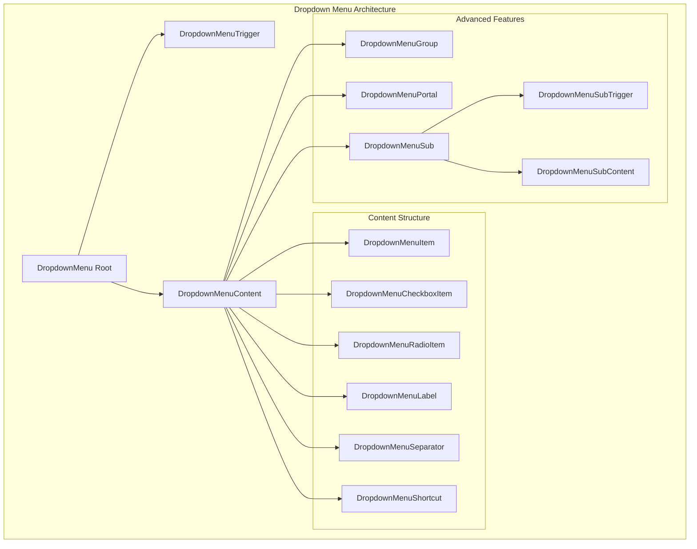
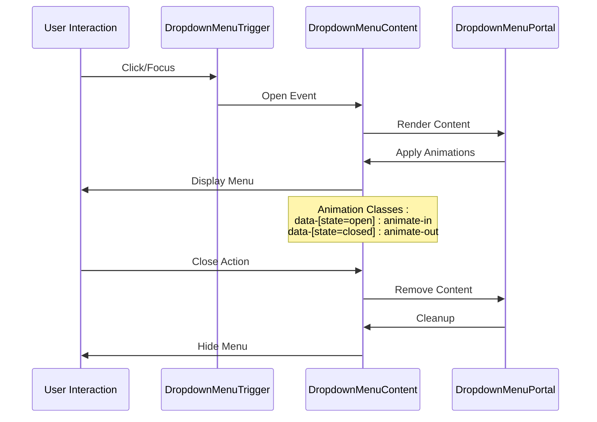
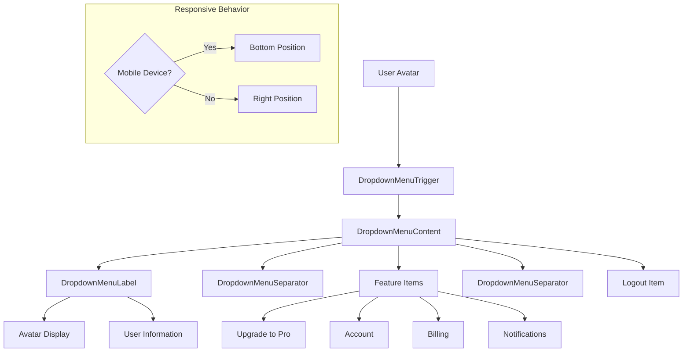

# Dropdown Menu Component

<cite>
**Referenced Files in This Document**
- [components/ui/dropdown-menu.tsx](file://components/ui/dropdown-menu.tsx)
- [app/_components/Sidebar.tsx](file://app/_components/Sidebar.tsx)
- [hooks/use-mobile.ts](file://hooks/use-mobile.ts)
- [lib/utils.ts](file://lib/utils/utils.ts)
- [app/globals.css](file://app/globals.css)
- [components.json](file://components.json)
</cite>

## Table of Contents
1. [Introduction](#introduction)
2. [Component Architecture](#component-architecture)
3. [Core Subcomponents](#core-subcomponents)
4. [Implementation Details](#implementation-details)
5. [Accessibility Features](#accessibility-features)
6. [Responsive Design](#responsive-design)
7. [Integration Patterns](#integration-patterns)
8. [Usage Examples](#usage-examples)
9. [Troubleshooting Guide](#troubleshooting-guide)
10. [Best Practices](#best-practices)

## Introduction

The Dropdown Menu component is a sophisticated contextual menu system built using Radix UI's primitives with custom Tailwind CSS styling. It provides an accessible, responsive, and visually consistent menu solution for the activity-tracker interface. The component follows modern web standards for accessibility while maintaining seamless integration with the application's design system.

Built on top of Radix UI's robust foundation, the Dropdown Menu offers reliable state management, keyboard navigation, and screen reader compatibility. The implementation leverages Tailwind's utility-first approach combined with custom CSS variables for consistent theming across light and dark modes.

## Component Architecture

The Dropdown Menu system consists of multiple interconnected primitives that work together to create a cohesive menu experience. Each primitive serves a specific purpose in the overall architecture, from triggering the menu to managing content positioning and user interactions.



**Diagram sources**
- [components/ui/dropdown-menu.tsx](file://components/ui/dropdown-menu.tsx#L1-L240)

**Section sources**
- [components/ui/dropdown-menu.tsx](file://components/ui/dropdown-menu.tsx#L1-L240)

## Core Subcomponents

### DropdownMenuRoot

The root component that manages the overall state and context of the dropdown menu. It wraps all child components and provides the foundational context for the entire menu system.

```typescript
function DropdownMenu({
  ...props
}: React.ComponentProps<typeof DropdownMenuPrimitive.Root>) {
  return <DropdownMenuPrimitive.Root data-slot="dropdown-menu" {...props} />
}
```

### DropdownMenuTrigger

The trigger element that activates the dropdown menu when clicked or focused. It serves as the primary entry point for users to access the menu content.

```typescript
function DropdownMenuTrigger({
  ...props
}: React.ComponentProps<typeof DropdownMenuPrimitive.Trigger>) {
  return (
    <DropdownMenuPrimitive.Trigger
      data-slot="dropdown-menu-trigger"
      {...props}
    />
  )
}
```

### DropdownMenuContent

The container that holds all menu items and manages positioning, animations, and visibility states. It includes sophisticated animation systems and responsive behavior.

```typescript
function DropdownMenuContent({
  className,
  sideOffset = 4,
  ...props
}: React.ComponentProps<typeof DropdownMenuPrimitive.Content>) {
  return (
    <DropdownMenuPrimitive.Portal>
      <DropdownMenuPrimitive.Content
        data-slot="dropdown-menu-content"
        sideOffset={sideOffset}
        className={cn(
          "z-50 min-w-[8rem] overflow-hidden rounded-base border-2 border-border bg-main p-1 font-base text-main-foreground data-[state=open]:animate-in data-[state=closed]:animate-out data-[state=closed]:fade-out-0 data-[state=open]:fade-in-0 data-[state=closed]:zoom-out-95 data-[state=open]:zoom-in-95 data-[side=bottom]:slide-in-from-top-2 data-[side=left]:slide-in-from-right-2 data-[side=right]:slide-in-from-left-2 data-[side=top]:slide-in-from-bottom-2 origin-(--radix-dropdown-menu-content-transform-origin)",
          className,
        )}
        {...props}
      />
    </DropdownMenuPrimitive.Portal>
  )
}
```

**Section sources**
- [components/ui/dropdown-menu.tsx](file://components/ui/dropdown-menu.tsx#L10-L100)

## Implementation Details

### Animation System

The component implements a sophisticated animation system using Radix UI's built-in animations combined with custom Tailwind classes. The animations provide smooth transitions for opening and closing states while maintaining performance.



**Diagram sources**
- [components/ui/dropdown-menu.tsx](file://components/ui/dropdown-menu.tsx#L60-L85)

### Styling Architecture

The component uses a hybrid approach combining Tailwind CSS utilities with custom CSS variables for consistent theming. The styling system ensures visual consistency across different themes and responsive breakpoints.

Key styling features include:
- **Border System**: 2px border width with transparent borders for focus states
- **Animation Framework**: Custom slide-in/out animations with configurable timing
- **Responsive Spacing**: Adaptive padding and margin calculations
- **Theme Integration**: CSS variables for background, foreground, and border colors

### Custom Props and Extensions

Each subcomponent supports custom props for enhanced functionality:

```typescript
// Inset support for nested menus
function DropdownMenuItem({
  className,
  inset,
  ...props
}: React.ComponentProps<typeof DropdownMenuPrimitive.Item> & {
  inset?: boolean
}) {
  return (
    <DropdownMenuPrimitive.Item
      data-slot="dropdown-menu-item"
      data-inset={inset}
      className={cn(
        "relative gap-2 [&_svg]:pointer-events-none [&_svg]:w-4 [&_svg]:h-4 [&_svg]:shrink-0 flex cursor-default select-none items-center rounded-base border-2 border-transparent data-[inset=true]:pl-8 bg-main px-2 py-1.5 text-sm font-base outline-hidden transition-colors focus:border-border data-disabled:pointer-events-none data-disabled:opacity-50",
        className,
      )}
      {...props}
    />
  )
}
```

**Section sources**
- [components/ui/dropdown-menu.tsx](file://components/ui/dropdown-menu.tsx#L85-L120)

## Accessibility Features

### Focus Management

The component implements comprehensive focus management to ensure keyboard navigation works seamlessly. Focus is properly managed during open/close states, and focus traps prevent users from navigating outside the menu.

### Screen Reader Compatibility

All components include appropriate ARIA attributes and semantic HTML structure for optimal screen reader support:

- **Role Attributes**: Proper ARIA roles for menu containers and items
- **Labeling**: Descriptive labels for interactive elements
- **Keyboard Navigation**: Full support for arrow keys, Enter, Escape, and Tab
- **State Announcements**: Dynamic announcements for menu state changes

### Keyboard Navigation

The component supports full keyboard navigation with intuitive key combinations:

- **Arrow Keys**: Navigate between menu items
- **Enter/Space**: Activate selected menu item
- **Escape**: Close the menu
- **Tab**: Move focus to next focusable element
- **Shift+Tab**: Move focus to previous focusable element

## Responsive Design

### Mobile Detection

The component integrates with the `useIsMobile` hook to provide adaptive behavior for different screen sizes. The mobile detection system uses CSS media queries to determine responsive breakpoints.

```typescript
export function useIsMobile() {
  const [isMobile, setIsMobile] = React.useState<boolean | undefined>(undefined)

  React.useEffect(() => {
    const mql = window.matchMedia(`(max-width: ${MOBILE_BREAKPOINT - 1}px)`)
    const onChange = () => {
      setIsMobile(window.innerWidth < MOBILE_BREAKPOINT)
    }
    mql.addEventListener("change", onChange)
    setIsMobile(window.innerWidth < MOBILE_BREAKPOINT)
    return () => mql.removeEventListener("change", onChange)
  }, [])

  return !!isMobile
}
```

### Responsive Behavior

On mobile devices, the component adapts its positioning and behavior:

- **Side Positioning**: Menus appear at the bottom instead of the right side
- **Touch-Friendly**: Larger touch targets and gesture support
- **Reduced Animations**: Simplified animations for better performance
- **Full-Screen Overlay**: Expanded overlay for better touch coverage

**Section sources**
- [hooks/use-mobile.ts](file://hooks/use-mobile.ts#L1-L20)

## Integration Patterns

### Global State Integration

The component integrates with the application's global state through the SidebarContext, allowing for coordinated behavior across different UI components. This integration enables shared state management for sidebar collapse/expand functionality.

### Theme System Integration

The component seamlessly integrates with the application's theme system, utilizing CSS custom properties for consistent theming across light and dark modes. The theme system provides automatic color adaptation and maintains visual consistency.

### Import Structure

Proper import usage follows the established pattern:

```typescript
import {
  DropdownMenu,
  DropdownMenuTrigger,
  DropdownMenuContent,
  DropdownMenuItem,
  DropdownMenuCheckboxItem,
  DropdownMenuRadioItem,
  DropdownMenuLabel,
  DropdownMenuSeparator,
  DropdownMenuShortcut,
  DropdownMenuGroup,
  DropdownMenuPortal,
  DropdownMenuSub,
  DropdownMenuSubContent,
  DropdownMenuSubTrigger,
  DropdownMenuRadioGroup,
} from "@/components/ui/dropdown-menu"
```

**Section sources**
- [components/ui/dropdown-menu.tsx](file://components/ui/dropdown-menu.tsx#L220-L240)

## Usage Examples

### Basic Implementation

Here's a fundamental implementation of the dropdown menu:

```typescript
<DropdownMenu>
  <DropdownMenuTrigger>Open Menu</DropdownMenuTrigger>
  <DropdownMenuContent>
    <DropdownMenuItem>Item 1</DropdownMenuItem>
    <DropdownMenuItem>Item 2</DropdownMenuItem>
    <DropdownMenuSeparator />
    <DropdownMenuItem>Item 3</DropdownMenuItem>
  </DropdownMenuContent>
</DropdownMenu>
```

### Advanced Implementation with Icons

The component supports rich content with icons and custom styling:

```typescript
<DropdownMenu>
  <DropdownMenuTrigger asChild>
    <button className="flex items-center gap-2">
      <Avatar />
      <span>User Name</span>
      <ChevronsUpDown />
    </button>
  </DropdownMenuTrigger>
  <DropdownMenuContent
    className="w-[--radix-dropdown-menu-trigger-width] min-w-56"
    side={isMobile ? "bottom" : "right"}
    align="end"
    sideOffset={4}
  >
    <DropdownMenuLabel>
      <div className="flex items-center gap-2">
        <Avatar />
        <div>
          <span>John Doe</span>
          <span className="text-sm text-muted">john@example.com</span>
        </div>
      </div>
    </DropdownMenuLabel>
    <DropdownMenuSeparator />
    <DropdownMenuItem>
      <SettingsIcon /> Settings
    </DropdownMenuItem>
    <DropdownMenuItem>
      <HelpIcon /> Help
    </DropdownMenuItem>
    <DropdownMenuSeparator />
    <DropdownMenuItem>
      <LogoutIcon /> Logout
    </DropdownMenuItem>
  </DropdownMenuContent>
</DropdownMenu>
```

### Real-World Example: User Profile Menu

The most prominent implementation of the dropdown menu appears in the sidebar user profile section:



**Diagram sources**
- [app/_components/Sidebar.tsx](file://app/_components/Sidebar.tsx#L180-L270)

**Section sources**
- [app/_components/Sidebar.tsx](file://app/_components/Sidebar.tsx#L180-L270)

## Troubleshooting Guide

### Positioning Issues

**Problem**: Menu content appears in the wrong position or overlaps with other elements.

**Solutions**:
1. **Check Z-Index Values**: Ensure the content has sufficient z-index (currently set to 50)
2. **Verify Portal Placement**: Confirm the DropdownMenuPortal is wrapping the content
3. **Adjust Side Offset**: Modify the `sideOffset` prop for better positioning
4. **Inspect Parent Containers**: Check for CSS transforms or clipping that might affect positioning

### Animation Conflicts

**Problem**: Animations appear janky or conflict with other CSS transitions.

**Solutions**:
1. **Review Animation Classes**: Verify Tailwind animation classes aren't conflicting
2. **Check CSS Variables**: Ensure `--radix-dropdown-menu-content-transform-origin` is properly defined
3. **Optimize Performance**: Reduce complex animations on mobile devices
4. **Test Browser Compatibility**: Verify animations work across target browsers

### Focus Management Issues

**Problem**: Keyboard navigation doesn't work or focus gets trapped incorrectly.

**Solutions**:
1. **Verify Focus Trapping**: Ensure focus is properly managed during open/close
2. **Check Tab Order**: Review tab order for logical navigation flow
3. **Test Screen Readers**: Validate ARIA attributes and screen reader announcements
4. **Handle Edge Cases**: Test focus restoration when closing menus

### Responsive Breakpoint Problems

**Problem**: Menu behaves incorrectly on mobile devices.

**Solutions**:
1. **Verify Hook Integration**: Ensure `useIsMobile` is properly imported and used
2. **Check Media Queries**: Validate CSS media queries for breakpoint detection
3. **Test Touch Interactions**: Verify touch-friendly behavior on mobile devices
4. **Adjust Positioning**: Use `side="bottom"` for mobile layouts

### Styling Conflicts

**Problem**: Custom styles override or conflict with component styling.

**Solutions**:
1. **Review CSS Specificity**: Check for overly specific selectors overriding component styles
2. **Use Utility Classes**: Leverage Tailwind utility classes instead of custom CSS
3. **Check CSS Variables**: Ensure theme variables are properly defined
4. **Inspect Import Order**: Verify proper import order for CSS loading

## Best Practices

### Performance Optimization

1. **Lazy Rendering**: Use portals to render content only when needed
2. **Conditional Rendering**: Implement conditional rendering for expensive content
3. **Debounce Resize Events**: Optimize mobile detection for better performance
4. **Minimize Re-renders**: Use React.memo for static menu items

### Accessibility Guidelines

1. **Semantic HTML**: Use appropriate HTML elements for menu structure
2. **ARIA Attributes**: Include required ARIA attributes for screen reader support
3. **Keyboard Navigation**: Ensure full keyboard accessibility
4. **Focus Management**: Implement proper focus trapping and restoration

### Design Consistency

1. **Theme Integration**: Use CSS variables for consistent theming
2. **Spacing Standards**: Follow established spacing guidelines (8px grid system)
3. **Typography Scale**: Maintain consistent typography hierarchy
4. **Color Contrast**: Ensure adequate color contrast ratios

### Code Organization

1. **Component Structure**: Maintain clear separation of concerns
2. **Prop Types**: Define clear prop interfaces for type safety
3. **Documentation**: Include comprehensive prop documentation
4. **Testing**: Implement comprehensive testing for accessibility and functionality

The Dropdown Menu component represents a sophisticated implementation of modern web UI patterns, combining accessibility, performance, and design consistency. Its modular architecture allows for flexible customization while maintaining reliability and ease of use across the application.