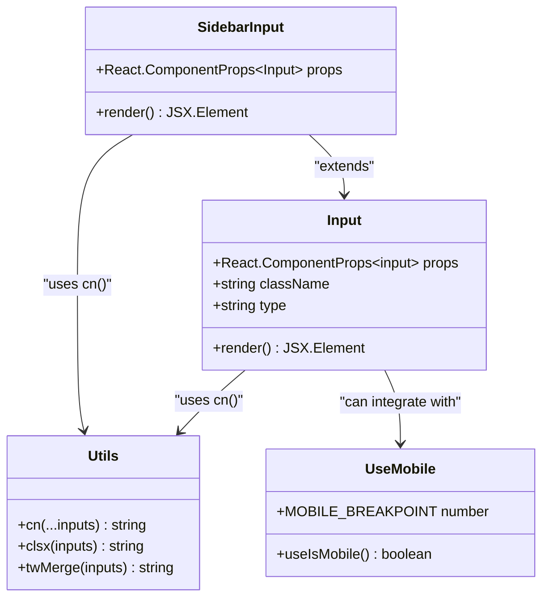

# Input UI Component

<cite>
**Referenced Files in This Document**
- [components/ui/input.tsx](file://components/ui/input.tsx)
- [lib/utils.ts](file://lib/utils.ts)
- [hooks/use-mobile.ts](file://hooks/use-mobile.ts)
- [components/ui/sidebar.tsx](file://components/ui/sidebar.tsx)
- [app/globals.css](file://app/globals.css)
- [components.json](file://components.json)
- [package.json](file://package.json)
</cite>

## Table of Contents
1. [Introduction](#introduction)
2. [Component Architecture](#component-architecture)
3. [Core Implementation](#core-implementation)
4. [Styling System](#styling-system)
5. [Integration Patterns](#integration-patterns)
6. [Accessibility Features](#accessibility-features)
7. [Responsive Design](#responsive-design)
8. [Usage Examples](#usage-examples)
9. [Troubleshooting Guide](#troubleshooting-guide)
10. [Best Practices](#best-practices)

## Introduction

The Input UI component is a controlled form input element designed with Tailwind CSS and built on Radix UI principles. It serves as a foundational form element within the activity-tracker application, providing consistent styling, accessibility features, and responsive behavior across different screen sizes.

This component follows modern React patterns and integrates seamlessly with the application's design system, offering developers a reliable and accessible input field solution for various form scenarios.

## Component Architecture

The Input component is structured as a lightweight wrapper around the native HTML input element, enhanced with Tailwind CSS styling and Radix UI compatibility features.



**Diagram sources**
- [components/ui/input.tsx](file://components/ui/input.tsx#L1-L20)
- [lib/utils.ts](file://lib/utils.ts#L1-L7)
- [hooks/use-mobile.ts](file://hooks/use-mobile.ts#L1-L20)
- [components/ui/sidebar.tsx](file://components/ui/sidebar.tsx#L320-L330)

**Section sources**
- [components/ui/input.tsx](file://components/ui/input.tsx#L1-L20)
- [lib/utils.ts](file://lib/utils.ts#L1-L7)

## Core Implementation

The Input component is implemented as a functional component that accepts standard HTML input attributes while providing enhanced styling capabilities through the Tailwind CSS framework.

### Component Definition

```typescript
function Input({ className, type, ...props }: React.ComponentProps<"input">) {
  return (
    <input
      type={type}
      data-slot="input"
      className={cn(
        "flex h-10 w-full rounded-base border-2 border-border bg-secondary-background selection:bg-main selection:text-main-foreground px-3 py-2 text-sm font-base text-foreground file:border-0 file:bg-transparent file:text-sm file:font-heading placeholder:text-foreground/50 focus-visible:outline-hidden focus-visible:ring-2 focus-visible:ring-black focus-visible:ring-offset-2 disabled:cursor-not-allowed disabled:opacity-50",
        className,
      )}
      {...props}
    />
  )
}
```

### Key Features

1. **Type Safety**: Uses `React.ComponentProps<"input">` for full TypeScript support
2. **Data Attributes**: Includes `data-slot="input"` for testing and styling identification
3. **Conditional Styling**: Integrates with the `cn()` utility function for dynamic class combinations
4. **Native Input Behavior**: Preserves all standard input functionality

**Section sources**
- [components/ui/input.tsx](file://components/ui/input.tsx#L1-L20)

## Styling System

The Input component leverages a sophisticated styling system combining Tailwind CSS utilities with custom design tokens and the `cn()` utility function.

### Tailwind CSS Classes

The component applies the following core styling classes:

```typescript
"flex h-10 w-full rounded-base border-2 border-border bg-secondary-background selection:bg-main selection:text-main-foreground px-3 py-2 text-sm font-base text-foreground file:border-0 file:bg-transparent file:text-sm file:font-heading placeholder:text-foreground/50 focus-visible:outline-hidden focus-visible:ring-2 focus-visible:ring-black focus-visible:ring-offset-2 disabled:cursor-not-allowed disabled:opacity-50"
```

### Design Token Integration

The styling system utilizes CSS custom properties defined in the global stylesheet:

- `--background`: Base background color
- `--secondary-background`: Secondary background for input fields
- `--foreground`: Text color
- `--main`: Accent color for selections and focus rings
- `--border`: Border color

### Utility Function Integration

The `cn()` function from `lib/utils.ts` combines multiple class inputs:

```typescript
export function cn(...inputs: ClassValue[]) {
  return twMerge(clsx(inputs))
}
```

This function uses:
- `clsx`: Combines conditional classes
- `twMerge`: Resolves Tailwind CSS conflicts

**Section sources**
- [components/ui/input.tsx](file://components/ui/input.tsx#L8-L16)
- [lib/utils.ts](file://lib/utils.ts#L1-L7)
- [app/globals.css](file://app/globals.css#L1-L73)

## Integration Patterns

The Input component demonstrates several integration patterns within the activity-tracker application.

### Basic Import Pattern

```typescript
import { Input } from "@/components/ui/input"
```

### Sidebar Integration

The component is extended for sidebar contexts through the `SidebarInput` wrapper:

```typescript
function SidebarInput({
  className,
  ...props
}: React.ComponentProps<typeof Input>) {
  return (
    <Input
      data-slot="sidebar-input"
      data-sidebar="input"
      className={cn(
        "bg-secondary-background h-8 w-full shadow-none",
        className,
      )}
      {...props}
    />
  )
}
```

### Form Integration

The component works seamlessly with React forms and controlled/uncontrolled input patterns:

```typescript
// Controlled input example
const [value, setValue] = useState("")
return <Input value={value} onChange={(e) => setValue(e.target.value)} />

// Uncontrolled input example
return <Input defaultValue="initial value" />
```

**Section sources**
- [components/ui/input.tsx](file://components/ui/input.tsx#L1-L20)
- [components/ui/sidebar.tsx](file://components/ui/sidebar.tsx#L320-L330)

## Accessibility Features

The Input component incorporates comprehensive accessibility features to ensure usability for all users.

### Semantic HTML Structure

- Uses native HTML `<input>` element
- Maintains proper semantic markup
- Supports keyboard navigation natively

### Focus Management

```typescript
focus-visible:outline-hidden
focus-visible:ring-2
focus-visible:ring-black
focus-visible:ring-offset-2
```

### Disabled State Support

```typescript
disabled:cursor-not-allowed
disabled:opacity-50
```

### Screen Reader Compatibility

- Proper label association through `htmlFor` attribute
- Native input semantics preserved
- Clear visual indicators for focus and disabled states

### Placeholder Text

```typescript
placeholder:text-foreground/50
```

The placeholder text maintains sufficient contrast and is semi-transparent for better visual hierarchy.

**Section sources**
- [components/ui/input.tsx](file://components/ui/input.tsx#L11-L15)

## Responsive Design

The Input component adapts to different screen sizes through integration with the responsive design system.

### Mobile Detection Hook

The `useIsMobile` hook provides responsive behavior detection:

```typescript
const MOBILE_BREAKPOINT = 768

export function useIsMobile() {
  const [isMobile, setIsMobile] = React.useState<boolean | undefined>(undefined)

  React.useEffect(() => {
    const mql = window.matchMedia(`(max-width: ${MOBILE_BREAKPOINT - 1}px)`)
    const onChange = () => {
      setIsMobile(window.innerWidth < MOBILE_BREAKPOINT)
    }
    mql.addEventListener("change", onChange)
    setIsMobile(window.innerWidth < MOBILE_BREAKPOINT)
    return () => mql.removeEventListener("change", onChange)
  }, [])

  return !!isMobile
}
```

### Responsive Behavior

While the Input component itself doesn't directly implement responsive sizing, it works with the design system to adapt to different contexts:

- Consistent height (`h-10`) across devices
- Flexible width (`w-full`) for container-based layouts
- Touch-friendly target sizes for mobile devices

### Breakpoint Integration

The component integrates with the application's breakpoint system through:

- CSS custom properties for consistent spacing
- Flexible width calculations
- Adaptive padding and margin values

**Section sources**
- [hooks/use-mobile.ts](file://hooks/use-mobile.ts#L1-L20)

## Usage Examples

### Basic Input Field

```typescript
import { Input } from "@/components/ui/input"

function BasicExample() {
  return (
    <div className="space-y-2">
      <label htmlFor="basic-input">Basic Input</label>
      <Input id="basic-input" placeholder="Enter text..." />
    </div>
  )
}
```

### Password Input

```typescript
function PasswordExample() {
  return (
    <div className="space-y-2">
      <label htmlFor="password-input">Password</label>
      <Input 
        id="password-input" 
        type="password" 
        placeholder="Enter password..."
      />
    </div>
  )
}
```

### Disabled Input

```typescript
function DisabledExample() {
  return (
    <div className="space-y-2">
      <label htmlFor="disabled-input">Disabled Input</label>
      <Input 
        id="disabled-input" 
        type="text" 
        placeholder="Cannot edit" 
        disabled 
      />
    </div>
  )
}
```

### Input with Event Handlers

```typescript
function EventHandlerExample() {
  const [value, setValue] = useState("")
  
  return (
    <div className="space-y-2">
      <label htmlFor="event-input">Event Handler Input</label>
      <Input 
        id="event-input"
        value={value}
        onChange={(e) => setValue(e.target.value)}
        onFocus={() => console.log("Focused")}
        onBlur={() => console.log("Blurred")}
        placeholder="Type something..."
      />
    </div>
  )
}
```

### Integration with Forms

```typescript
function FormExample() {
  const handleSubmit = (e: React.FormEvent) => {
    e.preventDefault()
    // Handle form submission
  }

  return (
    <form onSubmit={handleSubmit} className="space-y-4 max-w-md">
      <div className="space-y-2">
        <label htmlFor="name">Name</label>
        <Input 
          id="name"
          type="text"
          required
          placeholder="Enter your name"
        />
      </div>
      
      <div className="space-y-2">
        <label htmlFor="email">Email</label>
        <Input 
          id="email"
          type="email"
          required
          placeholder="Enter your email"
        />
      </div>
      
      <button type="submit" className="btn-primary">
        Submit
      </button>
    </form>
  )
}
```

## Troubleshooting Guide

### Common Issues and Solutions

#### Issue 1: Uncontrolled to Controlled Transition Warning

**Problem**: React warning about changing from uncontrolled to controlled input.

**Solution**:
```typescript
// ❌ Problematic
const [value, setValue] = useState("")
return <Input value={value} /> // No onChange handler

// ✅ Solution
const [value, setValue] = useState("")
return <Input 
  value={value} 
  onChange={(e) => setValue(e.target.value)} 
/>
```

#### Issue 2: Styling Conflicts

**Problem**: Custom styles overriding component styles.

**Solution**:
```typescript
// ✅ Correct approach
<Input className="custom-class" />

// Instead of
<Input className="!important custom-class" />
```

#### Issue 3: Focus Ring Visibility

**Problem**: Focus ring not visible or inconsistent.

**Solution**: Ensure proper focus styling is maintained:
```typescript
// ✅ Maintain focus styles
className={cn(
  "focus-visible:outline-hidden focus-visible:ring-2 focus-visible:ring-black focus-visible:ring-offset-2",
  className
)}
```

#### Issue 4: Disabled State Not Working

**Problem**: Disabled state not applying correctly.

**Solution**: Verify CSS custom properties are defined:
```css
:root {
  --border: oklch(0% 0 0);
  --secondary-background: oklch(100% 0 0);
}
```

#### Issue 5: Placeholder Text Color

**Problem**: Placeholder text not visible enough.

**Solution**: Adjust placeholder color in global CSS:
```css
/* Global CSS */
input::placeholder {
  color: var(--foreground) / 50%;
}
```

### Debugging Tips

1. **Inspect Data Attributes**: Use browser dev tools to check `data-slot="input"`
2. **Verify CSS Variables**: Ensure custom properties are defined
3. **Test Focus States**: Use keyboard navigation to verify focus rings
4. **Check Disabled States**: Test both visual and functional disabled states
5. **Validate Accessibility**: Use screen readers to test input functionality

**Section sources**
- [components/ui/input.tsx](file://components/ui/input.tsx#L1-L20)

## Best Practices

### Component Usage Guidelines

1. **Always Include Labels**: Associate inputs with labels using `htmlFor` attribute
2. **Use Semantic Types**: Leverage appropriate input types (text, email, password, etc.)
3. **Implement Validation**: Combine with form validation libraries for robust input handling
4. **Maintain Consistency**: Use the component consistently across the application
5. **Consider Accessibility**: Test with screen readers and keyboard navigation

### Performance Optimization

1. **Minimize Re-renders**: Use controlled inputs appropriately to avoid unnecessary re-renders
2. **Optimize Event Handlers**: Memoize expensive event handler functions
3. **Lazy Loading**: Consider lazy loading heavy input components when possible

### Design System Integration

1. **Follow Design Tokens**: Use CSS custom properties for consistent theming
2. **Respect Breakpoints**: Design layouts that work across all screen sizes
3. **Maintain Visual Hierarchy**: Use appropriate sizing and spacing
4. **Ensure Contrast**: Maintain WCAG AA compliance for text and backgrounds

### Testing Strategies

1. **Unit Tests**: Test component rendering and prop handling
2. **Accessibility Tests**: Use automated tools to verify accessibility compliance
3. **Cross-Browser Testing**: Test across different browsers and devices
4. **User Testing**: Conduct usability testing with real users

### Maintenance Guidelines

1. **Keep Dependencies Updated**: Regularly update Tailwind CSS and related packages
2. **Monitor Performance**: Track bundle size and runtime performance
3. **Document Changes**: Maintain documentation for any custom modifications
4. **Version Control**: Use semantic versioning for component releases

**Section sources**
- [components/ui/input.tsx](file://components/ui/input.tsx#L1-L20)
- [app/globals.css](file://app/globals.css#L1-L73)
- [components.json](file://components.json#L1-L23)