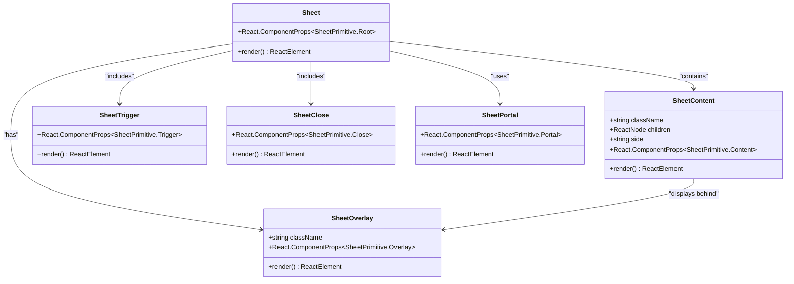
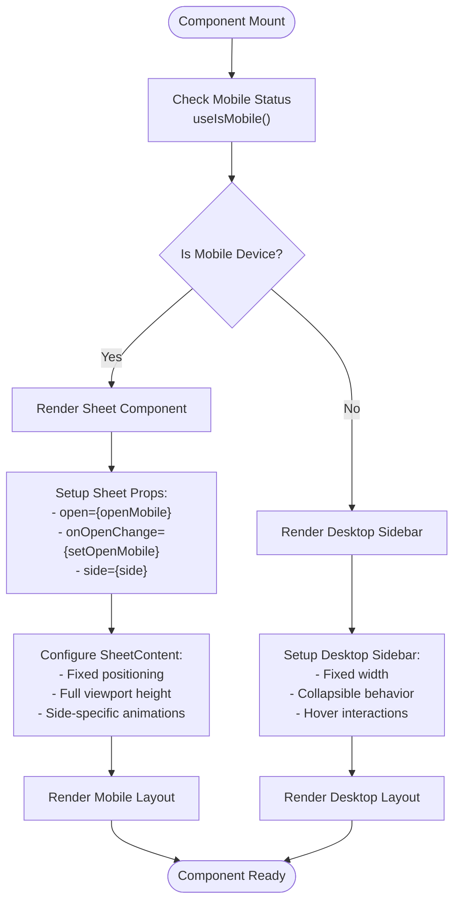

# Sheet Component Documentation

<cite>
**Referenced Files in This Document**
- [components/ui/sheet.tsx](file://components/ui/sheet.tsx)
- [hooks/use-mobile.ts](file://hooks/use-mobile.ts)
- [components/ui/sidebar.tsx](file://components/ui/sidebar.tsx)
- [app/_components/Sidebar.tsx](file://app/_components/Sidebar.tsx)
- [lib/utils.ts](file://lib/utils.ts)
- [components.json](file://components.json)
- [app/globals.css](file://app/globals.css)
</cite>

## Table of Contents
1. [Introduction](#introduction)
2. [Component Architecture](#component-architecture)
3. [Core Implementation](#core-implementation)
4. [Responsive Behavior](#responsive-behavior)
5. [Accessibility Features](#accessibility-features)
6. [Styling and Animation](#styling-and-animation)
7. [Integration Patterns](#integration-patterns)
8. [Performance Considerations](#performance-considerations)
9. [Common Issues and Solutions](#common-issues-and-solutions)
10. [Best Practices](#best-practices)

## Introduction

The Sheet component is a mobile-friendly side panel implementation designed for navigation and form inputs in the activity-tracker application. Built on Radix UI's Dialog primitives, it provides a sliding panel interface that adapts seamlessly between desktop and mobile experiences. The component leverages Tailwind CSS for styling and integrates with the application's responsive design system through the `useIsMobile` hook.

This component serves as a crucial bridge between traditional desktop navigation patterns and modern mobile-first design approaches, offering intuitive touch gestures and keyboard navigation while maintaining accessibility standards.

## Component Architecture

The Sheet component follows a composite pattern built around Radix UI's Dialog primitives, providing a robust foundation for modal-like interactions with enhanced mobile support.



**Diagram sources**
- [components/ui/sheet.tsx](file://components/ui/sheet.tsx#L10-L142)

**Section sources**
- [components/ui/sheet.tsx](file://components/ui/sheet.tsx#L1-L143)

## Core Implementation

The Sheet component consists of seven primary sub-components, each serving a specific role in the overall dialog architecture:

### Base Sheet Container

The main `Sheet` component acts as a wrapper around Radix UI's `SheetPrimitive.Root`, providing the foundational context for all sheet-related functionality:

```typescript
function Sheet({ ...props }: React.ComponentProps<typeof SheetPrimitive.Root>) {
  return <SheetPrimitive.Root data-slot="sheet" {...props} />
}
```

### Content Management

The `SheetContent` component is the most sophisticated part of the implementation, handling positioning, animation, and responsive behavior:

```typescript
function SheetContent({
  className,
  children,
  side = "right",
  ...props
}: React.ComponentProps<typeof SheetPrimitive.Content> & {
  side?: "top" | "bottom" | "left" | "right"
}) {
  return (
    <SheetPortal>
      <SheetOverlay />
      <SheetPrimitive.Content
        data-slot="sheet-content"
        className={cn(
          "bg-background data-[state=open]:animate-in data-[state=closed]:animate-out fixed z-50 flex flex-col gap-4 border-2 border-border transition ease-in-out data-[state=closed]:duration-300 data-[state=open]:duration-500",
          side === "right" &&
            "data-[state=closed]:slide-out-to-right data-[state=open]:slide-in-from-right inset-y-0 right-0 h-full w-3/4 border-l sm:max-w-sm",
          side === "left" &&
            "data-[state=closed]:slide-out-to-left data-[state=open]:slide-in-from-left inset-y-0 left-0 h-full w-3/4 border-r sm:max-w-sm",
          side === "top" &&
            "data-[state=closed]:slide-out-to-top data-[state=open]:slide-in-from-top inset-x-0 top-0 h-auto border-b",
          side === "bottom" &&
            "data-[state=closed]:slide-out-to-bottom data-[state=open]:slide-in-from-bottom inset-x-0 bottom-0 h-auto border-t",
          className,
        )}
        {...props}
      >
        {children}
        <SheetPrimitive.Close className="absolute right-4 top-4 rounded-base ring-offset-white focus:outline-none focus:ring-2 focus:ring-ring focus:ring-offset-2 disabled:pointer-events-none">
          <X className="h-4 w-4" />
          <span className="sr-only">Close</span>
        </SheetPrimitive.Close>
      </SheetPrimitive.Content>
    </SheetPortal>
  )
}
```

### Overlay System

The overlay component manages backdrop appearance with fade animations and z-index positioning:

```typescript
function SheetOverlay({
  className,
  ...props
}: React.ComponentProps<typeof SheetPrimitive.Overlay>) {
  return (
    <SheetPrimitive.Overlay
      data-slot="sheet-overlay"
      className={cn(
        "data-[state=open]:animate-in data-[state=closed]:animate-out data-[state=closed]:fade-out-0 data-[state=open]:fade-in-0 fixed inset-0 z-50 bg-overlay",
        className,
      )}
      {...props}
    />
  )
}
```

**Section sources**
- [components/ui/sheet.tsx](file://components/ui/sheet.tsx#L10-L74)

## Responsive Behavior

The Sheet component integrates seamlessly with the application's responsive design system through the `useIsMobile` hook, enabling automatic adaptation between desktop sidebar and mobile sheet interfaces.



**Diagram sources**
- [hooks/use-mobile.ts](file://hooks/use-mobile.ts#L1-L20)
- [components/ui/sidebar.tsx](file://components/ui/sidebar.tsx#L175-L200)

The responsive behavior is implemented in the sidebar component, which conditionally renders either a Sheet or a traditional sidebar based on device detection:

```typescript
if (isMobile) {
  return (
    <Sheet open={openMobile} onOpenChange={setOpenMobile} {...props}>
      <SheetContent
        data-sidebar="sidebar"
        data-slot="sidebar"
        data-mobile="true"
        className="bg-secondary-background text-foreground w-(--sidebar-width) p-0 [&>button]:hidden"
        style={{
          "--sidebar-width": SIDEBAR_WIDTH_MOBILE,
        } as React.CSSProperties}
        side={side}
      >
        <SheetHeader className="sr-only">
          <SheetTitle>Sidebar</SheetTitle>
          <SheetDescription>Displays the mobile sidebar.</SheetDescription>
        </SheetHeader>
        <div className="flex h-full w-full flex-col">{children}</div>
      </SheetContent>
    </Sheet>
  )
}
```

**Section sources**
- [hooks/use-mobile.ts](file://hooks/use-mobile.ts#L1-L20)
- [components/ui/sidebar.tsx](file://components/ui/sidebar.tsx#L175-L200)

## Accessibility Features

The Sheet component implements comprehensive accessibility features to ensure usability across all devices and assistive technologies.

### Focus Management

The component automatically manages focus trapping within the sheet content, preventing focus from escaping to background elements:

- **Focus Trapping**: Radix UI's built-in focus management ensures keyboard navigation remains within the sheet
- **Escape Key Handling**: Pressing Escape closes the sheet and returns focus to the trigger element
- **Initial Focus**: The first interactive element receives focus when the sheet opens

### Screen Reader Support

```typescript
<SheetHeader className="sr-only">
  <SheetTitle>Sidebar</SheetTitle>
  <SheetDescription>Displays the mobile sidebar.</SheetDescription>
</SheetHeader>
```

The sheet includes semantic markup for screen readers:
- **Hidden Headers**: Semantic headers marked with `sr-only` class for screen readers only
- **Descriptive Titles**: Clear, descriptive titles for sheet content
- **Alternative Text**: Hidden close buttons with meaningful `sr-only` text

### Keyboard Navigation

- **Tab Navigation**: Proper tab order through interactive elements
- **Arrow Keys**: Support for arrow keys in appropriate contexts
- **Enter/Space**: Activation of interactive elements

### Touch Accessibility

- **Large Touch Targets**: Buttons meet minimum touch target sizes
- **Gesture Support**: Compatible with native touch gestures
- **Visual Feedback**: Clear visual indicators for touch interactions

**Section sources**
- [components/ui/sheet.tsx](file://components/ui/sheet.tsx#L185-L195)

## Styling and Animation

The Sheet component utilizes Tailwind CSS for responsive styling and implements sophisticated animation systems for smooth transitions.

### Animation System

The component employs a dual-animation approach combining fade and slide effects:

```typescript
className={cn(
  "bg-background data-[state=open]:animate-in data-[state=closed]:animate-out fixed z-50 flex flex-col gap-4 border-2 border-border transition ease-in-out data-[state=closed]:duration-300 data-[state=open]:duration-500",
  side === "right" &&
    "data-[state=closed]:slide-out-to-right data-[state=open]:slide-in-from-right inset-y-0 right-0 h-full w-3/4 border-l sm:max-w-sm",
  side === "left" &&
    "data-[state=closed]:slide-out-to-left data-[state=open]:slide-in-from-left inset-y-0 left-0 h-full w-3/4 border-r sm:max-w-sm",
  side === "top" &&
    "data-[state=closed]:slide-out-to-top data-[state=open]:slide-in-from-top inset-x-0 top-0 h-auto border-b",
  side === "bottom" &&
    "data-[state=closed]:slide-out-to-bottom data-[state=open]:slide-in-from-bottom inset-x-0 bottom-0 h-auto border-t",
  className,
)}
```

### Animation Properties

- **Fade Transitions**: Cross-fade between overlay states
- **Slide Animations**: Directional slide effects based on position
- **Timing Functions**: Smooth easing curves for natural feel
- **Duration Control**: Different durations for opening and closing

### Responsive Sizing

```typescript
// Mobile-specific sizing
"w-3/4 sm:max-w-sm"  // Takes 75% of viewport width on mobile, max 320px on desktop

// Position-specific sizing
"top-0 h-auto"       // Top sheets adjust height automatically
"inset-y-0 h-full"   // Side sheets fill vertical space
```

### Color System Integration

The component integrates with the application's color system:

```css
:root {
  --background: oklch(93.46% 0.0305 255.11);
  --secondary-background: oklch(100% 0 0);
  --foreground: oklch(0% 0 0);
  --border: oklch(0% 0 0);
  --overlay: oklch(0% 0 0 / 0.8);
}
```

**Section sources**
- [components/ui/sheet.tsx](file://components/ui/sheet.tsx#L41-L74)
- [app/globals.css](file://app/globals.css#L1-L74)

## Integration Patterns

The Sheet component demonstrates several integration patterns that facilitate seamless usage within the application ecosystem.

### Import Pattern

Components are imported using the standardized alias system:

```typescript
import {
  Sheet,
  SheetContent,
  SheetHeader,
  SheetTitle,
  SheetDescription,
  SheetTrigger,
  SheetClose,
  SheetOverlay,
  SheetPortal,
  SheetFooter
} from "@/components/ui/sheet"
```

### Composition with Header Controls

The component supports flexible composition patterns:

```typescript
<Sheet>
  <SheetTrigger asChild>
    <Button variant="outline">
      Open Sheet
    </Button>
  </SheetTrigger>
  <SheetContent>
    <SheetHeader>
      <SheetTitle>Navigation Menu</SheetTitle>
      <SheetDescription>
        Access all application features from here.
      </SheetDescription>
    </SheetHeader>
    <nav className="flex flex-col gap-4">
      {/* Navigation items */}
    </nav>
    <SheetFooter>
      <SheetClose asChild>
        <Button variant="outline">
          Close
        </Button>
      </SheetClose>
    </SheetFooter>
  </SheetContent>
</Sheet>
```

### Form Integration

The Sheet component works seamlessly with form elements:

```typescript
<SheetContent>
  <form onSubmit={handleSubmit}>
    <SheetHeader>
      <SheetTitle>Create New Task</SheetTitle>
    </SheetHeader>
    <div className="space-y-4 py-4">
      <Input placeholder="Task title" />
      <Textarea placeholder="Task description" />
    </div>
    <SheetFooter>
      <SheetClose asChild>
        <Button type="button" variant="outline">
          Cancel
        </Button>
      </SheetClose>
      <Button type="submit">
        Save Changes
      </Button>
    </SheetFooter>
  </form>
</SheetContent>
```

**Section sources**
- [components/ui/sheet.tsx](file://components/ui/sheet.tsx#L1-L143)

## Performance Considerations

The Sheet component is optimized for performance across various scenarios, particularly focusing on mobile device capabilities.

### Animation Performance

- **Hardware Acceleration**: CSS transforms utilize GPU acceleration
- **Efficient Transitions**: Minimal property animations reduce repaint overhead
- **Frame Rate Optimization**: Smooth 60fps animations through proper timing

### Memory Management

- **Conditional Rendering**: Sheet content only mounted when visible
- **Event Cleanup**: Automatic cleanup of event listeners
- **State Optimization**: Efficient state updates prevent unnecessary re-renders

### Bundle Size Optimization

- **Tree Shaking**: Individual component exports minimize bundle impact
- **Lazy Loading**: Content loaded only when needed
- **Minimal Dependencies**: Lightweight implementation with few external dependencies

### Best Practices for Performance

1. **Avoid Heavy Content**: Keep sheet content lightweight
2. **Optimize Images**: Use appropriately sized images for mobile
3. **Minimize JavaScript**: Reduce complex logic in sheet content
4. **Use Virtualization**: For long lists, implement virtual scrolling

## Common Issues and Solutions

### Backdrop Layering Conflicts

**Issue**: Sheet overlay appearing behind other elements or not covering entire viewport.

**Solution**: Ensure proper z-index stacking and fixed positioning:

```typescript
// Correct overlay styling
className={cn(
  "data-[state=open]:animate-in data-[state=closed]:animate-out data-[state=closed]:fade-out-0 data-[state=open]:fade-in-0 fixed inset-0 z-50 bg-overlay",
  className,
)}
```

### Touch Gesture Interference

**Issue**: Native scroll interactions conflicting with sheet gestures.

**Solution**: Implement proper touch event handling:

```typescript
// Prevent touch propagation
onTouchMove={(e) => e.stopPropagation()}
```

### Animation Jank During Transitions

**Issue**: Stuttering or delayed animations during sheet transitions.

**Solution**: Optimize animation properties:

```typescript
// Smooth transition timing
transition ease-in-out data-[state=closed]:duration-300 data-[state=open]:duration-500
```

### Focus Management Issues

**Issue**: Focus escaping or getting trapped incorrectly.

**Solution**: Verify focus trap implementation:

```typescript
// Ensure proper focus management
<SheetPrimitive.Content
  data-slot="sheet-content"
  className="focus:outline-none"
  {...props}
/>
```

## Best Practices

### Usage Guidelines

1. **Appropriate Use Cases**:
   - Navigation menus
   - Filters and settings panels
   - Quick actions and shortcuts
   - Form inputs and data entry

2. **Content Organization**:
   - Group related actions together
   - Use clear, descriptive labels
   - Maintain consistent spacing and alignment

3. **Responsive Design**:
   - Test on various screen sizes
   - Ensure touch targets are accessible
   - Consider landscape vs. portrait orientations

### Development Standards

1. **Code Quality**:
   - Use TypeScript for type safety
   - Implement proper prop validation
   - Follow consistent naming conventions

2. **Testing**:
   - Test accessibility features
   - Verify responsive behavior
   - Check cross-browser compatibility

3. **Documentation**:
   - Maintain clear component documentation
   - Provide usage examples
   - Include accessibility guidelines

### Maintenance Tips

1. **Version Management**:
   - Keep dependencies updated
   - Monitor breaking changes
   - Test thoroughly after updates

2. **Performance Monitoring**:
   - Track animation performance
   - Monitor bundle size impact
   - Optimize based on analytics

3. **User Experience**:
   - Gather user feedback
   - Conduct usability testing
   - Iterate based on insights