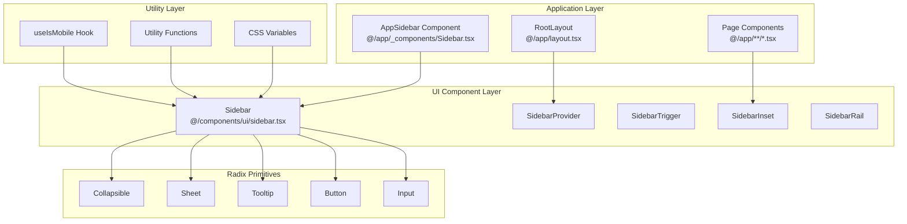
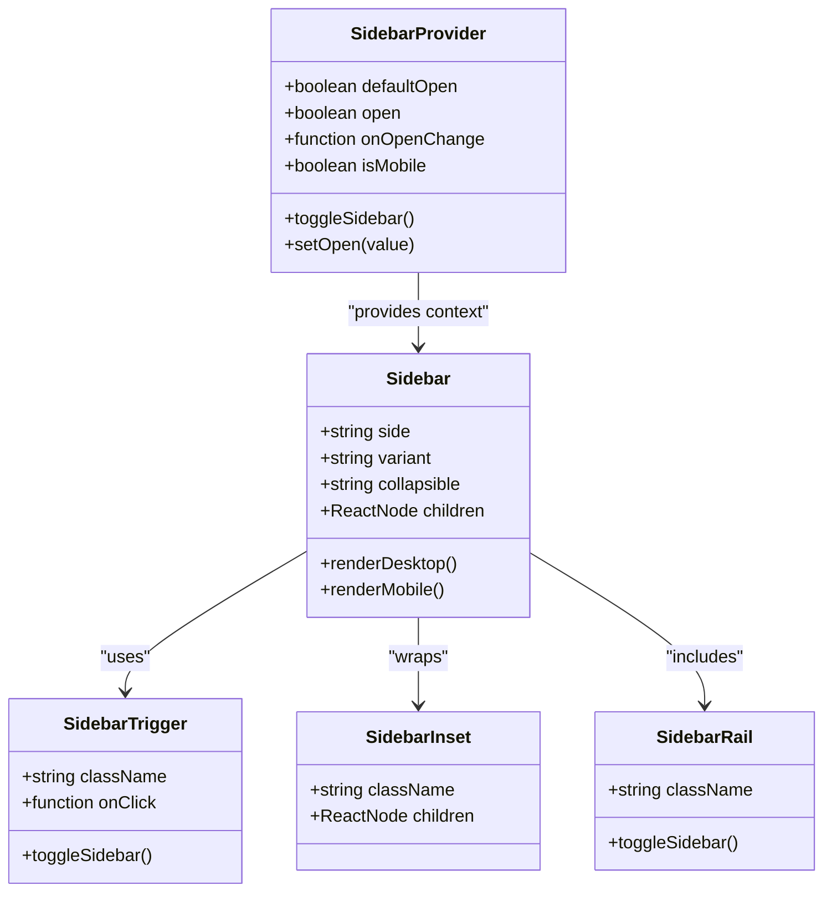
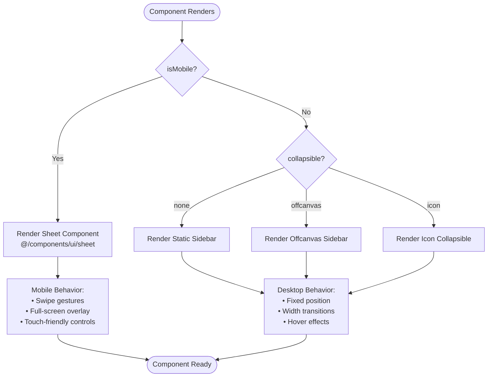
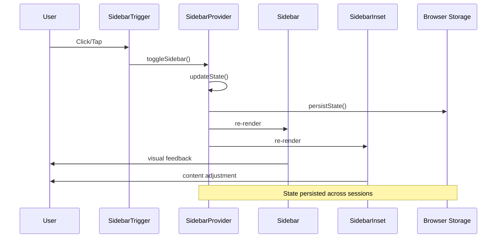

# Sidebar Component System

<cite>
**Referenced Files in This Document**
- [app/_components/Sidebar.tsx](file://app/_components/Sidebar.tsx)
- [components/ui/sidebar.tsx](file://components/ui/sidebar.tsx)
- [hooks/use-mobile.ts](file://hooks/use-mobile.ts)
- [app/page.tsx](file://app/page.tsx)
- [app/layout.tsx](file://app/layout.tsx)
- [components/ui/breadcrumb.tsx](file://components/ui/breadcrumb.tsx)
- [lib/utils.ts](file://lib/utils.ts)
</cite>

## Table of Contents
1. [Introduction](#introduction)
2. [System Architecture](#system-architecture)
3. [Core Components](#core-components)
4. [Dual-Layer Design](#dual-layer-design)
5. [Responsive Behavior](#responsive-behavior)
6. [State Management](#state-management)
7. [Integration Patterns](#integration-patterns)
8. [Accessibility Features](#accessibility-features)
9. [Performance Optimization](#performance-optimization)
10. [Common Issues & Solutions](#common-issues--solutions)
11. [Best Practices](#best-practices)
12. [Troubleshooting Guide](#troubleshooting-guide)

## Introduction

The Sidebar component system in the activity-tracker app provides a sophisticated navigation solution built on a dual-layer architecture. This system combines low-level UI primitives from Radix with application-specific wrappers to deliver a comprehensive navigation experience that adapts seamlessly across desktop and mobile devices.

The system is designed around three core principles: **responsiveness**, **accessibility**, and **extensibility**. It automatically transforms from a traditional sidebar on desktop devices to a Sheet component on mobile, ensuring optimal user experience across all screen sizes.

## System Architecture

The Sidebar system follows a layered architecture pattern that separates concerns between low-level UI components and application-specific implementations.



**Diagram sources**
- [components/ui/sidebar.tsx](file://components/ui/sidebar.tsx#L1-L716)
- [app/_components/Sidebar.tsx](file://app/_components/Sidebar.tsx#L1-L270)
- [hooks/use-mobile.ts](file://hooks/use-mobile.ts#L1-L20)

## Core Components

The Sidebar system consists of several interconnected components, each serving a specific purpose in the overall navigation architecture.

### SidebarProvider

The `SidebarProvider` serves as the central state manager for the entire sidebar system. It maintains the global state and coordinates behavior across all sidebar components.

```typescript
function SidebarProvider({
  defaultOpen = true,
  open: openProp,
  onOpenChange: setOpenProp,
  className,
  style,
  children,
  ...props
}: React.ComponentProps<"div"> & {
  defaultOpen?: boolean
  open?: boolean
  onOpenChange?: (open: boolean) => void
})
```

**Key Responsibilities:**
- Manages global sidebar state (expanded/collapsed)
- Handles mobile/desktop detection
- Provides state persistence via cookies
- Implements keyboard shortcuts
- Coordinates with child components through context

### Sidebar Component

The `Sidebar` component renders the actual sidebar container with responsive behavior and multiple variants.

```typescript
function Sidebar({
  side = "left",
  variant = "sidebar",
  collapsible = "offcanvas",
  className,
  children,
  ...props
}: React.ComponentProps<"div"> & {
  side?: "left" | "right"
  variant?: "sidebar" | "floating" | "inset"
  collapsible?: "offcanvas" | "icon" | "none"
})
```

**Section sources**
- [components/ui/sidebar.tsx](file://components/ui/sidebar.tsx#L67-L184)

## Dual-Layer Design

The Sidebar system employs a dual-layer architecture that separates low-level UI primitives from application-specific implementations.

### Low-Level UI Components

The base layer consists of Radix primitives and utility components that provide fundamental functionality:



**Diagram sources**
- [components/ui/sidebar.tsx](file://components/ui/sidebar.tsx#L67-L376)

### Application-Specific Wrapper

The `AppSidebar` component provides application-specific navigation logic and styling:

```typescript
export function AppSidebar({ ...props }: React.ComponentProps<typeof Sidebar>) {
  const { isMobile } = useSidebar();
  
  return (
    <Sidebar collapsible="icon" {...props}>
      <SidebarHeader>
        {/* Navigation header */}
      </SidebarHeader>
      <SidebarContent>
        {/* Navigation menu */}
      </SidebarContent>
      <SidebarFooter>
        {/* User actions */}
      </SidebarFooter>
      <SidebarRail />
    </Sidebar>
  );
}
```

**Section sources**
- [app/_components/Sidebar.tsx](file://app/_components/Sidebar.tsx#L75-L270)

## Responsive Behavior

The Sidebar system implements sophisticated responsive behavior through the `useIsMobile` hook and conditional rendering logic.

### Mobile Detection

```typescript
const MOBILE_BREAKPOINT = 768;

export function useIsMobile() {
  const [isMobile, setIsMobile] = React.useState<boolean | undefined>(undefined);

  React.useEffect(() => {
    const mql = window.matchMedia(`(max-width: ${MOBILE_BREAKPOINT - 1}px)`);
    const onChange = () => {
      setIsMobile(window.innerWidth < MOBILE_BREAKPOINT);
    };
    mql.addEventListener("change", onChange);
    setIsMobile(window.innerWidth < MOBILE_BREAKPOINT);
    return () => mql.removeEventListener("change", onChange);
  }, []);

  return !!isMobile;
}
```

### Responsive Rendering Strategy



**Diagram sources**
- [components/ui/sidebar.tsx](file://components/ui/sidebar.tsx#L150-L245)
- [hooks/use-mobile.ts](file://hooks/use-mobile.ts#L1-L20)

**Section sources**
- [hooks/use-mobile.ts](file://hooks/use-mobile.ts#L1-L20)
- [components/ui/sidebar.tsx](file://components/ui/sidebar.tsx#L150-L245)

## State Management

The Sidebar system implements a sophisticated state management system using React Context and local storage persistence.

### Context-Based State

```typescript
type SidebarContextProps = {
  state: "expanded" | "collapsed"
  open: boolean
  setOpen: (open: boolean) => void
  openMobile: boolean
  setOpenMobile: (open: boolean) => void
  isMobile: boolean
  toggleSidebar: () => void
}
```

### State Persistence

The system automatically persists sidebar state across browser sessions using cookies:

```typescript
const SIDEBAR_COOKIE_NAME = "sidebar_state";
const SIDEBAR_COOKIE_MAX_AGE = 60 * 60 * 24 * 7; // 7 days

const setOpen = React.useCallback(
  (value: boolean | ((value: boolean) => boolean)) => {
    const openState = typeof value === "function" ? value(open) : value;
    if (setOpenProp) {
      setOpenProp(openState);
    } else {
      _setOpen(openState);
    }
    
    // Persist state to cookie
    document.cookie = `${SIDEBAR_COOKIE_NAME}=${openState}; path=/; max-age=${SIDEBAR_COOKIE_MAX_AGE}`;
  },
  [setOpenProp, open],
);
```

### Keyboard Shortcuts

The system provides accessibility-enhanced keyboard shortcuts:

```typescript
const SIDEBAR_KEYBOARD_SHORTCUT = "b";

React.useEffect(() => {
  const handleKeyDown = (event: KeyboardEvent) => {
    if (
      event.key === SIDEBAR_KEYBOARD_SHORTCUT &&
      (event.metaKey || event.ctrlKey)
    ) {
      event.preventDefault();
      toggleSidebar();
    }
  };

  window.addEventListener("keydown", handleKeyDown);
  return () => window.removeEventListener("keydown", handleKeyDown);
}, [toggleSidebar]);
```

**Section sources**
- [components/ui/sidebar.tsx](file://components/ui/sidebar.tsx#L25-L92)

## Integration Patterns

The Sidebar system integrates seamlessly with other components through well-defined patterns and APIs.

### RootLayout Integration

```typescript
export default function RootLayout({
  children,
}: Readonly<{
  children: React.ReactNode;
}>) {
  return (
    <html lang="en">
      <body className={`${geistSans.variable} ${geistMono.variable} antialiased`}>
        {children}
      </body>
    </html>
  );
}
```

### Page Component Integration

```typescript
export default function Page() {
  return (
    <SidebarProvider>
      <AppSidebar />
      <SidebarInset>
        <header className="flex h-16 shrink-0 items-center gap-2">
          <div className="flex items-center gap-2 px-4">
            <SidebarTrigger className="-ml-1" />
            <Breadcrumb>
              <BreadcrumbList>
                <BreadcrumbItem className="hidden md:block">
                  <BreadcrumbLink href="#">Building Your Application</BreadcrumbLink>
                </BreadcrumbItem>
                <BreadcrumbSeparator className="hidden md:block" />
                <BreadcrumbItem>
                  <BreadcrumbPage>Data Fetching</BreadcrumbPage>
                </BreadcrumbItem>
              </BreadcrumbList>
            </Breadcrumb>
          </div>
        </header>
        <div className="flex flex-1 flex-col gap-4 p-4 pt-0">
          {/* Page content */}
        </div>
      </SidebarInset>
    </SidebarProvider>
  );
}
```

### Component Interaction Flow



**Diagram sources**
- [components/ui/sidebar.tsx](file://components/ui/sidebar.tsx#L85-L92)
- [app/page.tsx](file://app/page.tsx#L15-L45)

**Section sources**
- [app/layout.tsx](file://app/layout.tsx#L1-L35)
- [app/page.tsx](file://app/page.tsx#L1-L52)

## Accessibility Features

The Sidebar system implements comprehensive accessibility features to ensure usability for all users.

### Keyboard Navigation

- **Toggle Shortcut**: `Ctrl/Cmd + B` toggles sidebar visibility
- **Focus Management**: Proper focus order and trap management
- **Screen Reader Support**: ARIA labels and roles

### Screen Reader Support

```typescript
// SidebarTrigger accessibility
<Button
  data-sidebar="trigger"
  data-slot="sidebar-trigger"
  variant="noShadow"
  size="icon"
  className={cn("size-7", className)}
  onClick={(event) => {
    onClick?.(event);
    toggleSidebar();
  }}
>
  <PanelLeftIcon />
  <span className="sr-only">Toggle Sidebar</span>
</Button>

// SidebarRail accessibility
<button
  data-sidebar="rail"
  data-slot="sidebar-rail"
  aria-label="Toggle Sidebar"
  tabIndex={-1}
  onClick={toggleSidebar}
  title="Toggle Sidebar"
  className={cn("absolute inset-y-0 z-20 hidden w-4", className)}
/>
```

### Focus Management

The system ensures proper focus management during state transitions:

- Focus restoration when sidebar closes
- Logical focus order for keyboard navigation
- Visual focus indicators maintained

### Color Contrast and Visibility

The sidebar maintains WCAG AA compliance for color contrast ratios and provides visual cues for state changes.

**Section sources**
- [components/ui/sidebar.tsx](file://components/ui/sidebar.tsx#L258-L293)

## Performance Optimization

The Sidebar system implements several performance optimization strategies to ensure smooth operation.

### Memoization Strategies

```typescript
// Context value memoization
const contextValue = React.useMemo<SidebarContextProps>(
  () => ({
    state,
    open,
    setOpen,
    isMobile,
    openMobile,
    setOpenMobile,
    toggleSidebar,
  }),
  [state, open, setOpen, isMobile, openMobile, setOpenMobile, toggleSidebar],
);

// Width calculation memoization
const width = React.useMemo(() => {
  return `${Math.floor(Math.random() * 40) + 50}%`;
}, []);
```

### Conditional Rendering

The system uses conditional rendering to minimize DOM overhead:

```typescript
// Only render collapsible content when needed
{item.items && item.items.length > 0 ? (
  <Collapsible
    key={item.title}
    asChild
    defaultOpen={item.isActive}
    className="group/collapsible"
  >
    {/* Collapsible content */}
  </Collapsible>
) : (
  <SidebarMenuItem key={item.title}>
    {/* Non-collapsible content */}
  </SidebarMenuItem>
)}
```

### CSS Variable Optimization

The system uses CSS custom properties for efficient styling:

```typescript
style={{
  "--sidebar-width": SIDEBAR_WIDTH,
  "--sidebar-width-icon": SIDEBAR_WIDTH_ICON,
  ...style,
} as React.CSSProperties}
```

**Section sources**
- [components/ui/sidebar.tsx](file://components/ui/sidebar.tsx#L100-L130)
- [app/_components/Sidebar.tsx](file://app/_components/Sidebar.tsx#L115-L170)

## Common Issues & Solutions

### State Persistence Across Reloads

**Problem**: Sidebar state resets on page reload despite cookie persistence.

**Solution**: Verify cookie settings and browser privacy configurations:

```typescript
// Ensure cookies are enabled and not blocked
document.cookie = `${SIDEBAR_COOKIE_NAME}=${openState}; path=/; max-age=${SIDEBAR_COOKIE_MAX_AGE}`;

// Debug cookie retrieval
console.log(document.cookie);
```

### Animation Glitches

**Problem**: Sidebar animations appear jerky or inconsistent.

**Solution**: Optimize CSS transitions and ensure proper timing:

```css
/* Ensure smooth transitions */
transition: width 0.2s ease-in-out, left 0.2s ease-in-out;
will-change: width, left;
```

### Z-Index Stacking Problems

**Problem**: Sidebar overlaps or underlaps other components unexpectedly.

**Solution**: Review z-index hierarchy and positioning:

```typescript
// Correct z-index placement
<div
  data-slot="sidebar-container"
  className={cn(
    "fixed inset-y-0 z-10 hidden h-svh w-(--sidebar-width)",
    // Higher z-index for overlay elements
    "z-50",
  )}
>
```

### Mobile Transformation Issues

**Problem**: Sidebar fails to transform to Sheet on mobile devices.

**Solution**: Verify media query breakpoints and responsive logic:

```typescript
// Ensure breakpoint matches useIsMobile
const MOBILE_BREAKPOINT = 768;
const isMobile = window.innerWidth < MOBILE_BREAKPOINT;
```

## Best Practices

### Proper Imports

Always import from the designated UI library path:

```typescript
import {
  SidebarProvider,
  Sidebar,
  SidebarTrigger,
  SidebarInset,
  SidebarRail,
} from "@/components/ui/sidebar";
```

### Configuration Best Practices

```typescript
// Recommended AppSidebar configuration
export function AppSidebar({ ...props }: React.ComponentProps<typeof Sidebar>) {
  return (
    <Sidebar 
      collapsible="icon" 
      variant="sidebar"
      side="left"
      {...props}
    >
      {/* Content */}
    </Sidebar>
  );
}
```

### State Management Guidelines

- Use controlled vs uncontrolled state appropriately
- Implement proper cleanup in useEffect hooks
- Handle edge cases for SSR environments

### Styling Conventions

- Leverage Tailwind classes for consistent styling
- Use CSS custom properties for theme variables
- Maintain consistent spacing and sizing scales

## Troubleshooting Guide

### Debugging State Issues

1. **Enable React DevTools**: Monitor SidebarProvider context updates
2. **Console Logging**: Add debug logs to track state changes
3. **Network Tab**: Verify cookie persistence in browser storage

### Performance Monitoring

1. **Lighthouse Audit**: Run accessibility and performance audits
2. **React Profiler**: Identify expensive re-renders
3. **CSS Performance**: Monitor transition performance

### Common Error Messages

**"useSidebar must be used within a SidebarProvider"**
- Solution: Wrap component tree with SidebarProvider

**"Cannot read property 'toggleSidebar' of undefined"**
- Solution: Verify proper component nesting and context availability

**"Media query listener not firing"**
- Solution: Check browser compatibility and event listener registration

### Testing Strategies

1. **Unit Tests**: Test individual component functionality
2. **Integration Tests**: Verify component interactions
3. **E2E Tests**: Test complete user workflows
4. **Accessibility Tests**: Automated and manual testing

The Sidebar component system provides a robust foundation for navigation in modern web applications. Its dual-layer architecture, comprehensive accessibility features, and performance optimizations make it suitable for production use while maintaining flexibility for customization and extension.