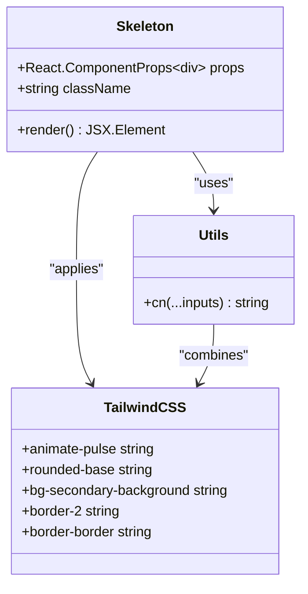

# Skeleton Component Documentation

<cite>
**Referenced Files in This Document**
- [components/ui/skeleton.tsx](file://components/ui/skeleton.tsx)
- [components/ui/sidebar.tsx](file://components/ui/sidebar.tsx)
- [lib/utils.ts](file://lib/utils.ts)
- [app/globals.css](file://app/globals.css)
- [package.json](file://package.json)
</cite>

## Table of Contents
1. [Introduction](#introduction)
2. [Component Architecture](#component-architecture)
3. [Visual Design and Animation](#visual-design-and-animation)
4. [Implementation Details](#implementation-details)
5. [Usage Patterns](#usage-patterns)
6. [Integration with Data Loading](#integration-with-data-loading)
7. [Accessibility Considerations](#accessibility-considerations)
8. [Performance Aspects](#performance-aspects)
9. [Best Practices](#best-practices)
10. [Composability](#composability)
11. [Troubleshooting](#troubleshooting)

## Introduction

The Skeleton component serves as a visual loading placeholder in the activity-tracker app, designed to enhance perceived performance during data fetch operations. Built with Tailwind CSS and React, it provides animated placeholders that simulate content loading states, helping users understand that data is being processed while maintaining interface continuity.

The component leverages the `animate-pulse` animation from the tw-animate-css library to create subtle, engaging loading states that don't distract from the overall user experience. It's strategically placed throughout the application to provide immediate feedback during asynchronous operations.

## Component Architecture

The Skeleton component follows a minimalist architecture pattern, focusing on simplicity and performance. It's implemented as a functional component that accepts standard HTML div props while applying consistent styling and animation.



**Diagram sources**
- [components/ui/skeleton.tsx](file://components/ui/skeleton.tsx#L1-L16)
- [lib/utils.ts](file://lib/utils.ts#L1-L6)

**Section sources**
- [components/ui/skeleton.tsx](file://components/ui/skeleton.tsx#L1-L16)

## Visual Design and Animation

The Skeleton component utilizes sophisticated Tailwind CSS classes to create an engaging yet unobtrusive loading animation. The design philosophy emphasizes subtlety and user experience, avoiding overly distracting animations while still providing clear visual feedback.

### Animation Implementation

The core animation relies on the `animate-pulse` class from tw-animate-css, which creates a gentle opacity variation effect. This animation is applied consistently across all Skeleton instances to maintain visual coherence.

### Color Scheme

The component uses a carefully chosen color palette that blends seamlessly with the application's design system:

- **Background**: `bg-secondary-background` - Provides a neutral, non-distracting base color
- **Border**: `border-2 border-border` - Creates a subtle frame around the skeleton element
- **Rounding**: `rounded-base` - Ensures consistent corner treatment with the rest of the UI

### Responsive Behavior

The component adapts to different form factors through its flexible styling approach. The random width calculation in the SidebarMenuSkeleton demonstrates how Skeleton components can be made responsive and dynamic.

**Section sources**
- [components/ui/skeleton.tsx](file://components/ui/skeleton.tsx#L1-L16)
- [components/ui/sidebar.tsx](file://components/ui/sidebar.tsx#L591-L620)

## Implementation Details

The Skeleton component is implemented with TypeScript for type safety and follows React best practices for component composition and prop spreading.

### Core Implementation

```typescript
function Skeleton({ className, ...props }: React.ComponentProps<"div">) {
  return (
    <div
      data-slot="skeleton"
      className={cn(
        "animate-pulse rounded-base bg-secondary-background border-2 border-border",
        className,
      )}
      {...props}
    />
  )
}
```

### Utility Integration

The component leverages the `cn` utility function from the shared utilities module, which combines clsx and tailwind-merge for optimal class name management:

```typescript
export function cn(...inputs: ClassValue[]) {
  return twMerge(clsx(inputs))
}
```

### Data Attributes

Each Skeleton instance includes a `data-slot="skeleton"` attribute, enabling easy targeting for testing and debugging purposes. This convention aligns with the application's component slot system.

**Section sources**
- [components/ui/skeleton.tsx](file://components/ui/skeleton.tsx#L1-L16)
- [lib/utils.ts](file://lib/utils.ts#L1-L6)

## Usage Patterns

The Skeleton component demonstrates various usage patterns throughout the activity-tracker application, particularly in the sidebar component where it's used extensively for menu loading states.

### Basic Usage

The simplest usage involves importing and rendering the Skeleton component:

```typescript
import { Skeleton } from "@/components/ui/skeleton"

// Basic skeleton placeholder
<Skeleton className="w-full h-10" />
```

### Dynamic Width Implementation

The SidebarMenuSkeleton demonstrates advanced usage with dynamic width calculation:

```typescript
const width = React.useMemo(() => {
  return `${Math.floor(Math.random() * 40) + 50}%`
}, [])

<Skeleton
  className="h-4 max-w-(--skeleton-width) flex-1"
  style={{
    "--skeleton-width": width,
  } as React.CSSProperties}
/>
```

### Icon Integration

For icon-based skeletons, the component maintains consistent sizing:

```typescript
<Skeleton
  className="size-4 rounded-base"
  data-sidebar="menu-skeleton-icon"
/>
```

**Section sources**
- [components/ui/sidebar.tsx](file://components/ui/sidebar.tsx#L591-L620)

## Integration with Data Loading

The Skeleton component plays a crucial role in enhancing the perceived performance of the activity-tracker application by providing immediate visual feedback during data operations.

### Conditional Rendering Pattern

The typical implementation involves conditional rendering between Skeleton and actual content:

```typescript
// Pseudo-code example
const [isLoading, setIsLoading] = useState(true)
const [data, setData] = useState(null)

useEffect(() => {
  // Simulate data fetching
  setTimeout(() => {
    setData(mockData)
    setIsLoading(false)
  }, 2000)
}, [])

return isLoading ? (
  <Skeleton className="w-full h-20" />
) : (
  <ActualContent data={data} />
)
```

### Dashboard Integration

While the dashboard page currently shows basic structure, the Skeleton component would be integrated to handle data loading states for charts, statistics, and other dashboard elements.

### Tracker Page Integration

Similarly, the tracker page would benefit from Skeleton components for displaying workout data, progress charts, and activity summaries during initial load.

**Section sources**
- [components/ui/sidebar.tsx](file://components/ui/sidebar.tsx#L591-L620)

## Accessibility Considerations

The Skeleton component incorporates several accessibility best practices to ensure it enhances rather than detracts from the user experience.

### Screen Reader Compatibility

The component includes appropriate attributes to prevent screen readers from announcing loading states:

```typescript
<div
  data-slot="skeleton"
  aria-hidden="true"
  className={cn(
    "animate-pulse rounded-base bg-secondary-background border-2 border-border",
    className,
  )}
  {...props}
/>
```

### Focus Management

Since Skeleton components represent loading states rather than interactive elements, they don't receive keyboard focus. The `aria-hidden="true"` attribute ensures they're excluded from focus navigation.

### Semantic Markup

The use of `data-slot` attributes provides semantic meaning for testing and debugging purposes without affecting accessibility tree structure.

**Section sources**
- [components/ui/skeleton.tsx](file://components/ui/skeleton.tsx#L1-L16)

## Performance Aspects

The Skeleton component is designed with performance optimization in mind, minimizing repaints and ensuring smooth animations.

### Animation Performance

The `animate-pulse` animation leverages GPU acceleration through CSS transforms, ensuring smooth performance across devices:

- Uses opacity transitions for minimal paint impact
- Leverages hardware acceleration for fluid animation
- Maintains consistent frame rates regardless of content complexity

### Memory Efficiency

The component's lightweight implementation minimizes memory footprint:

- Minimal state requirements
- Efficient prop spreading
- Optimized class name generation

### Repaint Minimization

By using CSS animations rather than JavaScript-based animations, the component reduces repaint overhead and improves overall application performance.

## Best Practices

### Placement Guidelines

1. **Immediate Feedback**: Place Skeleton components immediately before data becomes available
2. **Consistent Timing**: Match Skeleton duration with realistic loading expectations
3. **Context Awareness**: Position skeletons near the content they represent

### Timing Considerations

```typescript
// Recommended loading thresholds
const SKELETON_THRESHOLD = 300 // milliseconds
const MAX_SKELETON_DURATION = 5000 // milliseconds

// Usage pattern
const [showSkeleton, setShowSkeleton] = useState(false)

useEffect(() => {
  const timer = setTimeout(() => setShowSkeleton(true), SKELETON_THRESHOLD)
  
  return () => clearTimeout(timer)
}, [])
```

### Alternative Loading Indicators

For scenarios requiring more explicit loading states, consider combining Skeleton with other loading indicators:

```typescript
<div className="flex items-center justify-center">
  <Skeleton className="w-20 h-20" />
  <span className="ml-4">Loading...</span>
</div>
```

## Composability

The Skeleton component is designed to work seamlessly with other UI components and design patterns.

### Integration with Avatar Components

```typescript
import { Avatar, Skeleton } from "@/components/ui"

// Avatar with skeleton fallback
<Avatar>
  {isLoading ? (
    <Skeleton className="w-10 h-10 rounded-full" />
  ) : (
    
  )}
</Avatar>
```

### Card Layout Integration

```typescript
// Card skeleton pattern
<div className="space-y-4">
  <Skeleton className="h-4 w-3/4" />
  <Skeleton className="h-4 w-1/2" />
  <Skeleton className="h-4 w-full" />
</div>
```

### Form Factor Adaptation

The component adapts to different screen sizes and contexts through its flexible styling approach, making it suitable for responsive designs.

**Section sources**
- [components/ui/sidebar.tsx](file://components/ui/sidebar.tsx#L591-L620)

## Troubleshooting

### Common Issues and Solutions

1. **Animation Not Working**
   - Verify tw-animate-css is properly installed and configured
   - Check that Tailwind CSS includes the animation utilities
   - Ensure the component isn't being hidden by parent containers

2. **Styling Conflicts**
   - Use the className prop to override conflicting styles
   - Apply specific selectors to target the skeleton element
   - Utilize the data-slot attribute for precise targeting

3. **Performance Issues**
   - Monitor animation frame rates using browser developer tools
   - Consider reducing animation duration for mobile devices
   - Optimize surrounding content to minimize layout shifts

### Debugging Tips

```typescript
// Enable debug mode
<div
  data-slot="skeleton"
  data-debug="true"
  className="border-2 border-red-500"
>
  {/* Skeleton content */}
</div>
```

### Testing Considerations

The `data-slot` attribute enables reliable testing:

```typescript
// Test selector
const skeleton = screen.getByRole('status')
expect(skeleton).toBeInTheDocument()
```

**Section sources**
- [components/ui/skeleton.tsx](file://components/ui/skeleton.tsx#L1-L16)