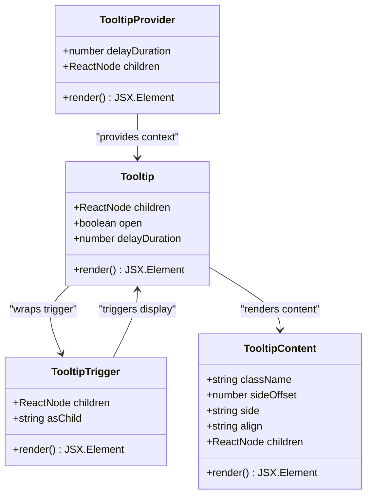

# Tooltip Component Documentation

<cite>
**Referenced Files in This Document**
- [components/ui/tooltip.tsx](file://components/ui/tooltip.tsx)
- [app/globals.css](file://app/globals.css)
- [lib/utils.ts](file://lib/utils.ts)
- [app/_components/Sidebar.tsx](file://app/_components/Sidebar.tsx)
- [components/ui/sidebar.tsx](file://components/ui/sidebar.tsx)
- [hooks/use-mobile.ts](file://hooks/use-mobile.ts)
- [package.json](file://package.json)
- [components.json](file://components.json)
</cite>

## Table of Contents
1. [Introduction](#introduction)
2. [Component Architecture](#component-architecture)
3. [Core Implementation](#core-implementation)
4. [Configuration Options](#configuration-options)
5. [Integration Examples](#integration-examples)
6. [Responsive Behavior](#responsive-behavior)
7. [Accessibility Features](#accessibility-features)
8. [Styling and Theming](#styling-and-theming)
9. [Performance Considerations](#performance-considerations)
10. [Troubleshooting Guide](#troubleshooting-guide)
11. [Best Practices](#best-practices)

## Introduction

The Tooltip component is a sophisticated user interface element designed to enhance user experience by providing contextual help text that appears when users hover over or focus on interactive elements. Built using Radix UI's robust tooltip primitives and styled with Tailwind CSS, this component offers comprehensive accessibility support, responsive behavior, and seamless integration with modern web applications.

The component follows a provider-pattern architecture that ensures consistent behavior across the application while maintaining flexibility for customization. It leverages the power of Radix UI's atomic components to deliver reliable, performant, and accessible tooltip functionality.

## Component Architecture

The Tooltip system consists of four primary components that work together to create a cohesive user experience:



**Diagram sources**
- [components/ui/tooltip.tsx](file://components/ui/tooltip.tsx#L8-L52)

**Section sources**
- [components/ui/tooltip.tsx](file://components/ui/tooltip.tsx#L1-L52)

## Core Implementation

### Provider Component

The `TooltipProvider` serves as the root configuration component that establishes global tooltip settings:

```typescript
function TooltipProvider({
  delayDuration = 0,
  ...props
}: React.ComponentProps<typeof TooltipPrimitive.Provider>) {
  return (
    <TooltipPrimitive.Provider
      data-slot="tooltip-provider"
      delayDuration={delayDuration}
      {...props}
    />
  )
}
```

Key features:
- **Delay Configuration**: Controls the time delay before tooltips appear (default: 0ms)
- **Global Settings**: Applies consistent behavior across all tooltips in the application
- **Radix Integration**: Extends Radix UI's native Provider component

### Root Component

The `Tooltip` component wraps the entire tooltip logic:

```typescript
function Tooltip({
  ...props
}: React.ComponentProps<typeof TooltipPrimitive.Root>) {
  return <TooltipPrimitive.Root data-slot="tooltip" {...props} />
}
```

### Trigger Component

The `TooltipTrigger` defines interactive elements that activate tooltips:

```typescript
function TooltipTrigger({
  ...props
}: React.ComponentProps<typeof TooltipPrimitive.Trigger>) {
  return <TooltipPrimitive.Trigger data-slot="tooltip-trigger" {...props} />
}
```

### Content Component

The `TooltipContent` renders the actual tooltip bubble with advanced styling and animations:

```typescript
function TooltipContent({
  className,
  sideOffset = 4,
  ...props
}: React.ComponentProps<typeof TooltipPrimitive.Content>) {
  return (
    <TooltipPrimitive.Content
      data-slot="tooltip-content"
      sideOffset={sideOffset}
      className={cn(
        "z-50 overflow-hidden rounded-base border-2 border-border bg-main px-3 py-1.5 text-sm font-base text-main-foreground animate-in fade-in-0 zoom-in-95 data-[state=closed]:animate-out data-[state=closed]:fade-out-0 data-[state=closed]:zoom-out-95 data-[side=bottom]:slide-in-from-top-2 data-[side=left]:slide-in-from-right-2 data-[side=right]:slide-in-from-left-2 data-[side=top]:slide-in-from-bottom-2 origin-(--radix-tooltip-content-transform-origin)",
        className,
      )}
      {...props}
    />
  )
}
```

**Section sources**
- [components/ui/tooltip.tsx](file://components/ui/tooltip.tsx#L8-L52)

## Configuration Options

### Delay Duration

Control tooltip appearance timing through the `delayDuration` prop:

```typescript
// No delay (immediate display)
<TooltipProvider delayDuration={0} />

// Short delay (100ms)
<TooltipProvider delayDuration={100} />

// Long delay (500ms)
<TooltipProvider delayDuration={500} />
```

### Side Placement Options

Configure tooltip positioning relative to the trigger element:

```typescript
// Top placement (default)
<TooltipContent side="top" />

// Bottom placement
<TooltipContent side="bottom" />

// Left placement
<TooltipContent side="left" />

// Right placement
<TooltipContent side="right" />
```

### Side Offset

Adjust the distance between the tooltip and trigger element:

```typescript
// Default offset (4px)
<TooltipContent sideOffset={4} />

// Reduced offset (2px)
<TooltipContent sideOffset={2} />

// Increased offset (8px)
<TooltipContent sideOffset={8} />
```

### Disable Conditions

Tooltips automatically handle various disable scenarios:

```typescript
// Hidden on mobile devices
<TooltipContent hidden={isMobile} />

// Conditional visibility
<TooltipContent hidden={!shouldShowTooltip} />
```

**Section sources**
- [components/ui/tooltip.tsx](file://components/ui/tooltip.tsx#L25-L35)

## Integration Examples

### Basic Usage Pattern

The most common pattern involves wrapping interactive elements with tooltip functionality:

```typescript
import { Tooltip, TooltipTrigger, TooltipContent, TooltipProvider } from '@/components/ui/tooltip'

function InteractiveButton() {
  return (
    <TooltipProvider>
      <Tooltip>
        <TooltipTrigger asChild>
          <button className="btn">
            <SettingsIcon />
          </button>
        </TooltipTrigger>
        <TooltipContent>
          Configure settings
        </TooltipContent>
      </Tooltip>
    </TooltipProvider>
  )
}
```

### Dashboard Integration Example

From the Sidebar component, we can see practical tooltip usage in a real-world context:

```typescript
// Tooltip integration in navigation menu
<SidebarMenuButton
  className="data-[state=open]:bg-main data-[state=open]:outline-border data-[state=open]:text-main-foreground"
  tooltip={item.title}
>
  {item.icon && <item.icon />}
  <span>{item.title}</span>
</SidebarMenuButton>
```

### Advanced Configuration

```typescript
// Multi-line tooltip with custom styling
<Tooltip>
  <TooltipTrigger asChild>
    <IconButton>
      <InfoIcon />
    </IconButton>
  </TooltipTrigger>
  <TooltipContent 
    side="right" 
    sideOffset={8}
    className="max-w-sm"
  >
    <div className="space-y-1">
      <h4 className="font-semibold">Advanced Feature</h4>
      <p className="text-sm text-muted-foreground">
        This feature provides additional functionality for power users.
      </p>
    </div>
  </TooltipContent>
</Tooltip>
```

**Section sources**
- [app/_components/Sidebar.tsx](file://app/_components/Sidebar.tsx#L143-L170)
- [components/ui/sidebar.tsx](file://components/ui/sidebar.tsx#L515-L530)

## Responsive Behavior

### Mobile Detection

The component integrates with a responsive hook to adapt behavior on touch devices:

```typescript
const MOBILE_BREAKPOINT = 768

export function useIsMobile() {
  const [isMobile, setIsMobile] = React.useState<boolean | undefined>(undefined)

  React.useEffect(() => {
    const mql = window.matchMedia(`(max-width: ${MOBILE_BREAKPOINT - 1}px)`)
    const onChange = () => {
      setIsMobile(window.innerWidth < MOBILE_BREAKPOINT)
    }
    mql.addEventListener("change", onChange)
    setIsMobile(window.innerWidth < MOBILE_BREAKPOINT)
    return () => mql.removeEventListener("change", onChange)
  }, [])

  return !!isMobile
}
```

### Touch Device Adaptations

On mobile devices, tooltips are automatically hidden to prevent interference with touch interactions:

```typescript
// Automatic hiding on mobile
<TooltipContent
  side="right"
  align="center"
  hidden={state !== "collapsed" || isMobile}
  {...tooltip}
/>
```

### Breakpoint Management

The system uses a consistent breakpoint strategy:

- **Mobile**: Width ≤ 767px
- **Desktop**: Width ≥ 768px
- **Touch-friendly**: Automatic adaptation for touch devices

**Section sources**
- [hooks/use-mobile.ts](file://hooks/use-mobile.ts#L1-L19)
- [components/ui/sidebar.tsx](file://components/ui/sidebar.tsx#L520-L530)

## Accessibility Features

### Screen Reader Support

The component leverages Radix UI's built-in accessibility features:

- **ARIA Labels**: Automatic ARIA label generation
- **Focus Management**: Proper focus handling for keyboard navigation
- **Screen Reader Announcements**: Timely announcements when tooltips appear

### Keyboard Navigation

Complete keyboard support for users who rely on keyboard navigation:

```typescript
// Focusable elements receive tooltip activation
<button tabIndex={0}>Interactive Element</button>

// Keyboard shortcuts work naturally
// Tab → Arrow keys → Enter/Space
```

### Semantic HTML Structure

The component maintains semantic HTML structure:

```html
<!-- Generated structure -->
<div role="tooltip" id="tooltip-1">
  <button aria-describedby="tooltip-1">...</button>
</div>
```

### Color Contrast Compliance

The styling ensures adequate color contrast ratios for accessibility:

- **Background**: `bg-main` (varies by theme)
- **Text**: `text-main-foreground` (varies by theme)
- **Border**: `border-border` (varies by theme)

**Section sources**
- [components/ui/tooltip.tsx](file://components/ui/tooltip.tsx#L35-L52)

## Styling and Theming

### Tailwind CSS Integration

The component uses Tailwind CSS for consistent styling:

```typescript
className={cn(
  "z-50 overflow-hidden rounded-base border-2 border-border bg-main px-3 py-1.5 text-sm font-base text-main-foreground animate-in fade-in-0 zoom-in-95 data-[state=closed]:animate-out data-[state=closed]:fade-out-0 data-[state=closed]:zoom-out-95 data-[side=bottom]:slide-in-from-top-2 data-[side=left]:slide-in-from-right-2 data-[side=right]:slide-in-from-left-2 data-[side=top]:slide-in-from-bottom-2 origin-(--radix-tooltip-content-transform-origin)",
  className,
)}
```

### Animation System

Sophisticated animation system using CSS transitions:

- **Fade In**: Smooth opacity transition
- **Zoom In**: Scale animation for depth perception
- **Slide Direction**: Directional slide based on placement
- **State Transitions**: Closed state animations

### Theme Variables

The component respects the application's theme system:

```css
:root {
  --background: oklch(93.46% 0.0305 255.11);
  --main: oklch(67.47% 0.1726 259.49);
  --border: oklch(0% 0 0);
  --main-foreground: oklch(0% 0 0);
}
```

### Dark Mode Support

Full dark mode compatibility through CSS custom properties:

```css
.dark {
  --background: oklch(29.23% 0.0626 270.49);
  --main: oklch(67.47% 0.1726 259.49);
  --border: oklch(0% 0 0);
  --main-foreground: oklch(0% 0 0);
}
```

**Section sources**
- [app/globals.css](file://app/globals.css#L1-L73)
- [components/ui/tooltip.tsx](file://components/ui/tooltip.tsx#L35-L52)

## Performance Considerations

### Lazy Loading

Tooltips are rendered conditionally to optimize performance:

```typescript
// Render only when needed
{tooltip && (
  <Tooltip>
    <TooltipTrigger asChild>{button}</TooltipTrigger>
    <TooltipContent {...tooltip} />
  </Tooltip>
)}
```

### Memory Management

Proper cleanup of event listeners and subscriptions:

```typescript
React.useEffect(() => {
  const mql = window.matchMedia(`(max-width: ${MOBILE_BREAKPOINT - 1}px)`)
  const onChange = () => {
    setIsMobile(window.innerWidth < MOBILE_BREAKPOINT)
  }
  mql.addEventListener("change", onChange)
  return () => mql.removeEventListener("change", onChange)
}, [])
```

### Bundle Size Optimization

Minimal bundle impact through selective imports:

```typescript
import * as TooltipPrimitive from "@radix-ui/react-tooltip"
import * as React from "react"
import { cn } from "@/lib/utils"
```

### Rendering Performance

Efficient rendering through optimized CSS classes:

- **CSS Custom Properties**: Dynamic styling without re-rendering
- **Conditional Rendering**: Only render when necessary
- **Optimized Animations**: Hardware-accelerated CSS transitions

**Section sources**
- [hooks/use-mobile.ts](file://hooks/use-mobile.ts#L7-L17)
- [components/ui/sidebar.tsx](file://components/ui/sidebar.tsx#L515-L530)

## Troubleshooting Guide

### Visibility Issues

**Problem**: Tooltip not appearing when hovering
**Solution**: 
1. Verify TooltipProvider is wrapped around the component tree
2. Check that delayDuration is set appropriately
3. Ensure the trigger element is not disabled or hidden

```typescript
// Correct setup
<TooltipProvider delayDuration={100}>
  <Tooltip>
    <TooltipTrigger asChild>
      <button>Hover me</button>
    </TooltipTrigger>
    <TooltipContent>Help text</TooltipContent>
  </Tooltip>
</TooltipProvider>
```

### Clipping Problems

**Problem**: Tooltip content gets clipped in overflow containers
**Solution**: Use `position: fixed` or adjust container overflow settings

```typescript
// Container with overflow handling
<div className="overflow-visible relative">
  <Tooltip>
    <TooltipTrigger asChild>
      <button>Hover me</button>
    </TooltipTrigger>
    <TooltipContent side="right" sideOffset={8} />
  </Tooltip>
</div>
```

### Timing Conflicts

**Problem**: Tooltips appear/disappear too quickly
**Solution**: Adjust delayDuration and sideOffset values

```typescript
// Slower timing for better UX
<TooltipProvider delayDuration={300}>
  <Tooltip>
    <TooltipTrigger asChild>
      <button>Hover me</button>
    </TooltipTrigger>
    <TooltipContent sideOffset={6} />
  </Tooltip>
</TooltipProvider>
```

### Mobile Interaction Issues

**Problem**: Tooltips interfere with touch interactions
**Solution**: Ensure mobile detection works correctly

```typescript
// Check mobile detection
const isMobile = useIsMobile()
console.log('Is mobile:', isMobile)
```

### Styling Conflicts

**Problem**: Tooltip styles conflict with existing CSS
**Solution**: Use CSS isolation or increase specificity

```typescript
// Isolated styling
<TooltipContent className="[&_.tooltip]:bg-white [&_.tooltip]:text-black" />
```

### Accessibility Issues

**Problem**: Screen readers not announcing tooltips
**Solution**: Verify ARIA attributes and semantic structure

```typescript
// Proper semantic markup
<Tooltip>
  <TooltipTrigger asChild>
    <button aria-label="Settings">⚙️</button>
  </TooltipTrigger>
  <TooltipContent>Configure application settings</TooltipContent>
</Tooltip>
```

## Best Practices

### Component Organization

1. **Provider Placement**: Place TooltipProvider at the application root
2. **Consistent Configuration**: Use uniform delayDuration across the application
3. **Semantic Grouping**: Group related tooltips under common providers

### Performance Optimization

1. **Conditional Rendering**: Only render tooltips when necessary
2. **Memory Cleanup**: Properly clean up event listeners
3. **Bundle Optimization**: Import only necessary components

### Accessibility Guidelines

1. **Meaningful Text**: Provide descriptive tooltip content
2. **Keyboard Support**: Ensure full keyboard navigation
3. **Screen Reader Compatibility**: Test with assistive technologies

### Design Principles

1. **Clear Messaging**: Keep tooltip text concise and actionable
2. **Consistent Positioning**: Use consistent side placement
3. **Visual Hierarchy**: Maintain clear visual distinction from content

### Testing Strategies

1. **Cross-Browser Testing**: Verify functionality across browsers
2. **Mobile Testing**: Test on various device sizes
3. **Accessibility Testing**: Use automated and manual testing tools

**Section sources**
- [components/ui/tooltip.tsx](file://components/ui/tooltip.tsx#L1-L52)
- [app/_components/Sidebar.tsx](file://app/_components/Sidebar.tsx#L143-L170)