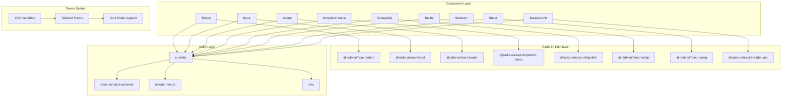
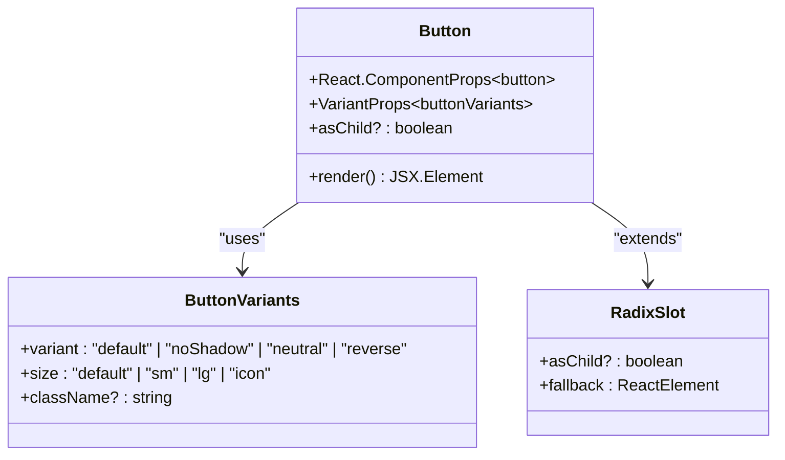
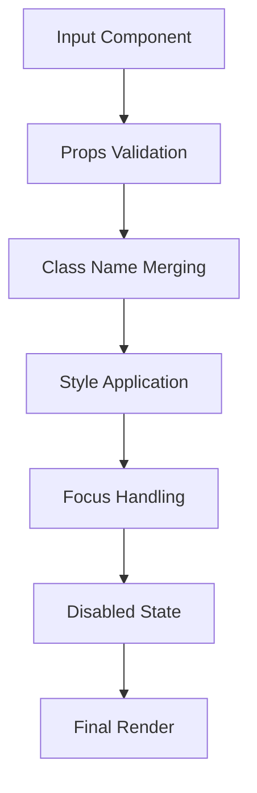
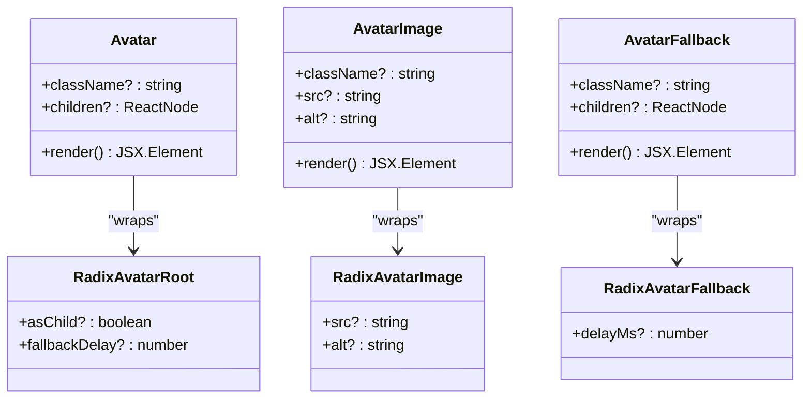
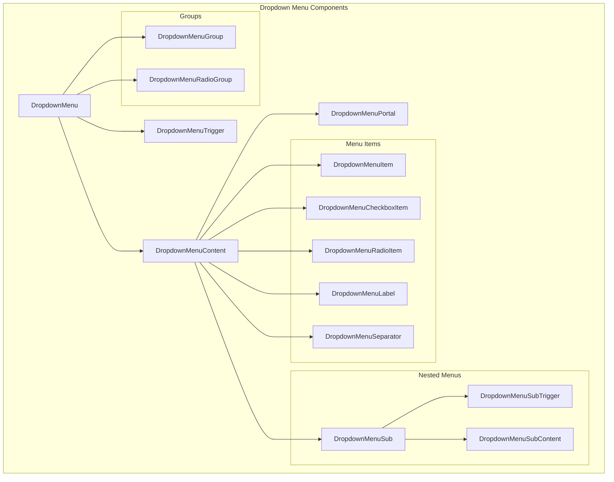
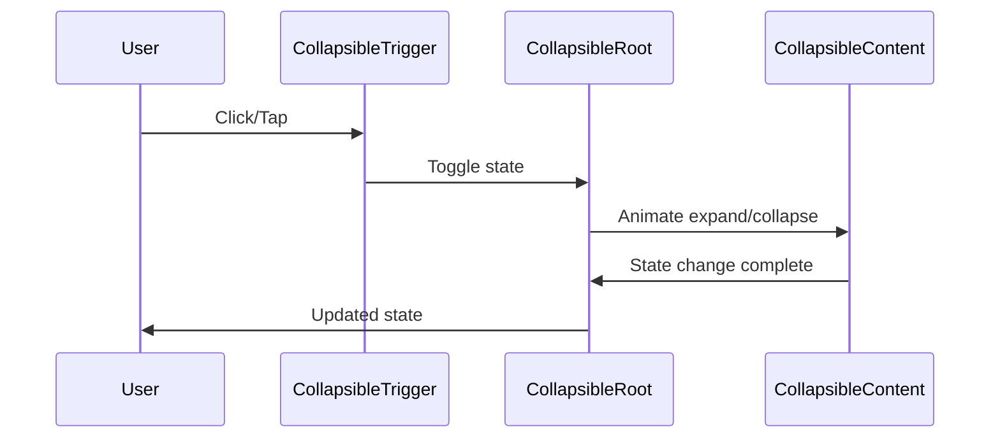
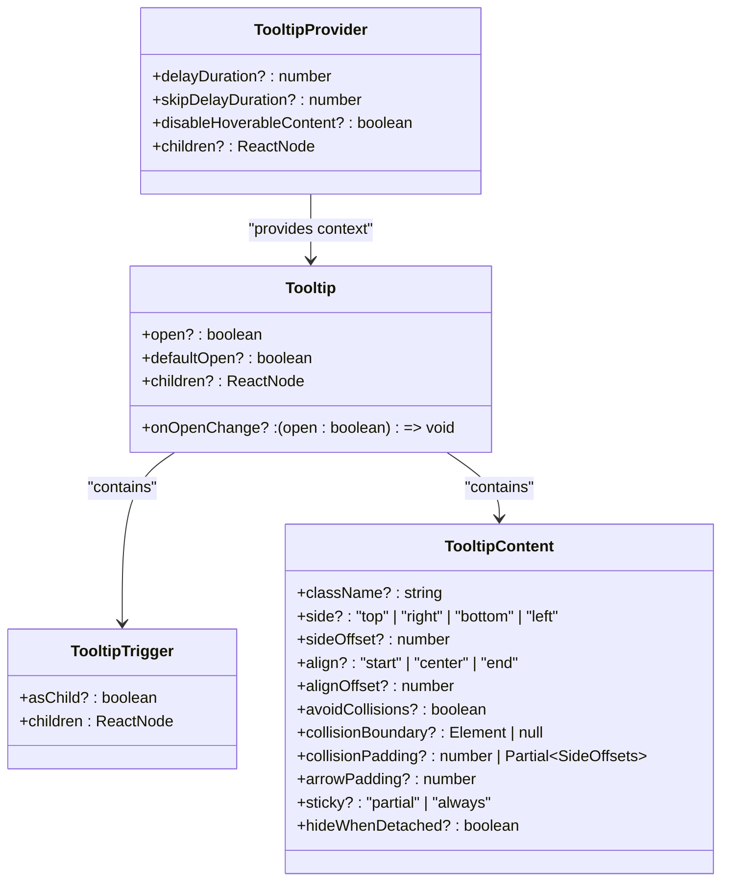
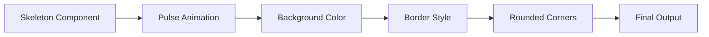
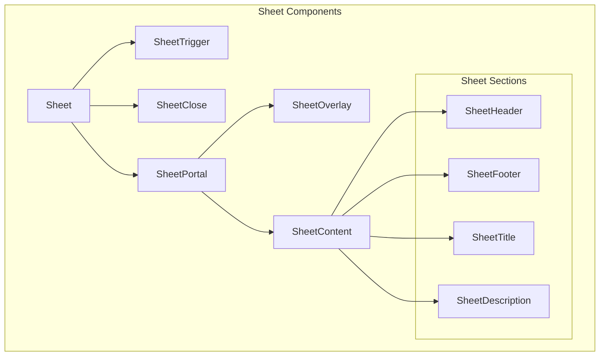
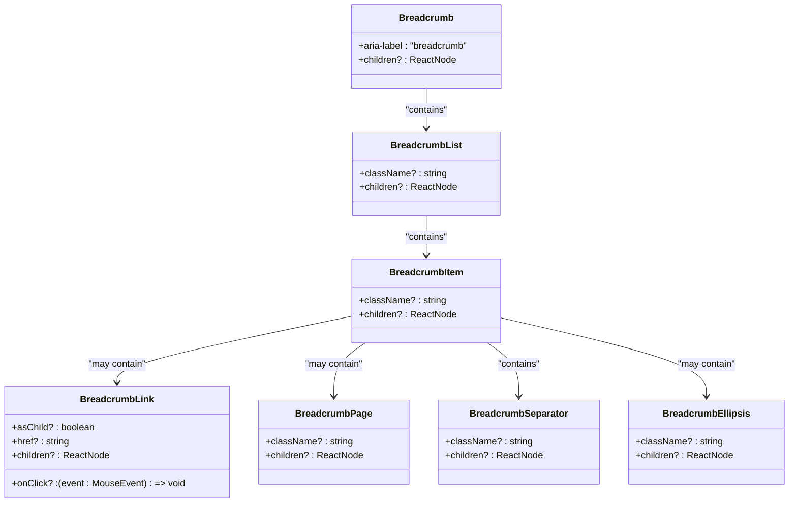

# UI Components

<cite>
**Referenced Files in This Document**
- [lib/utils.ts](file://lib/utils.ts)
- [components/ui/button.tsx](file://components/ui/button.tsx)
- [components/ui/input.tsx](file://components/ui/input.tsx)
- [components/ui/avatar.tsx](file://components/ui/avatar.tsx)
- [components/ui/dropdown-menu.tsx](file://components/ui/dropdown-menu.tsx)
- [components/ui/collapsible.tsx](file://components/ui/collapsible.tsx)
- [components/ui/tooltip.tsx](file://components/ui/tooltip.tsx)
- [components/ui/skeleton.tsx](file://components/ui/skeleton.tsx)
- [components/ui/sheet.tsx](file://components/ui/sheet.tsx)
- [components/ui/breadcrumb.tsx](file://components/ui/breadcrumb.tsx)
- [app/globals.css](file://app/globals.css)
- [app/layout.tsx](file://app/layout.tsx)
- [package.json](file://package.json)
</cite>

## Table of Contents
1. [Introduction](#introduction)
2. [Architecture Overview](#architecture-overview)
3. [Core Utility Functions](#core-utility-functions)
4. [Button Component](#button-component)
5. [Input Component](#input-component)
6. [Avatar Component](#avatar-component)
7. [Dropdown Menu Component](#dropdown-menu-component)
8. [Collapsible Component](#collapsible-component)
9. [Tooltip Component](#tooltip-component)
10. [Skeleton Component](#skeleton-component)
11. [Sheet Component](#sheet-component)
12. [Breadcrumb Component](#breadcrumb-component)
13. [Theme System](#theme-system)
14. [Best Practices](#best-practices)
15. [Usage Examples](#usage-examples)

## Introduction

The Activity Tracker application features a comprehensive UI component library built on top of Radix UI primitives with Tailwind CSS styling. This library provides reusable, accessible, and customizable components that maintain design consistency across the entire application. The components wrap Radix UI primitives while adding project-specific styling, animations, and accessibility features.

The component library follows a consistent design pattern where each component:
- Extends Radix UI primitives for accessibility and state management
- Uses Tailwind CSS for styling with custom theme variables
- Implements the `cn()` utility for class merging and customization
- Provides TypeScript interfaces for type safety
- Includes accessibility attributes and keyboard navigation support

## Architecture Overview

The UI component architecture is organized around a centralized utility system and component wrappers that extend Radix UI primitives. The architecture ensures consistency, reusability, and maintainability across all components.



**Diagram sources**
- [lib/utils.ts](file://lib/utils.ts#L1-L7)
- [components/ui/button.tsx](file://components/ui/button.tsx#L1-L57)
- [components/ui/input.tsx](file://components/ui/input.tsx#L1-L20)

## Core Utility Functions

The component library relies on a centralized utility system that provides consistent class merging and styling capabilities.

### CN Utility Function

The `cn()` function serves as the primary utility for combining and merging Tailwind CSS classes with conditional logic and overrides.

```typescript
// Core utility function
export function cn(...inputs: ClassValue[]) {
  return twMerge(clsx(inputs))
}
```

**Key Features:**
- **clsx**: Handles conditional class logic and object-based class combinations
- **twMerge**: Resolves Tailwind CSS conflicts and merges conflicting classes intelligently
- **Type Safety**: Supports TypeScript's `ClassValue[]` type for compile-time class validation

**Usage Patterns:**
```typescript
// Basic class combination
cn("text-red-500", "hover:text-blue-500")

// Conditional classes
cn(isActive && "bg-green-100", disabled && "opacity-50")

// Object-based classes
cn({
  "text-red-500": isError,
  "text-green-500": isSuccess,
  "text-gray-500": !isError && !isSuccess
})
```

**Section sources**
- [lib/utils.ts](file://lib/utils.ts#L1-L7)

## Button Component

The Button component provides a versatile, accessible button interface with multiple variants and sizes. It extends Radix UI's Slot primitive to support both native button elements and custom renderers.

### Component Structure



**Diagram sources**
- [components/ui/button.tsx](file://components/ui/button.tsx#L1-L57)

### Variants and Styles

The Button component supports four distinct variants with custom styling:

**Default Variant**: Primary action button with shadow effects
```typescript
default: "text-main-foreground bg-main border-2 border-border shadow-shadow hover:translate-x-boxShadowX hover:translate-y-boxShadowY hover:shadow-none"
```

**No Shadow Variant**: Flat button without elevation
```typescript
noShadow: "text-main-foreground bg-main border-2 border-border"
```

**Neutral Variant**: Secondary button with subtle styling
```typescript
neutral: "bg-secondary-background text-foreground border-2 border-border shadow-shadow hover:translate-x-boxShadowX hover:translate-y-boxShadowY hover:shadow-none"
```

**Reverse Variant**: Button with reversed shadow effect
```typescript
reverse: "text-main-foreground bg-main border-2 border-border hover:translate-x-reverseBoxShadowX hover:translate-y-reverseBoxShadowY hover:shadow-shadow"
```

### Size Options

- **default**: 40px height with padding (h-10 px-4 py-2)
- **sm**: 36px height with reduced padding (h-9 px-3)
- **lg**: 44px height with increased padding (h-11 px-8)
- **icon**: Square button with 40px dimensions (size-10)

### Accessibility Features

- **Focus Management**: Automatic focus ring with proper color contrast
- **Keyboard Navigation**: Full keyboard support for interactive elements
- **Screen Reader Support**: Proper ARIA attributes and semantic markup
- **Disabled State**: Properly styled disabled state with pointer events disabled

### Usage Examples

```typescript
// Basic primary button
<Button>Click Me</Button>

// Secondary button with icon
<Button variant="neutral">
  <SettingsIcon />
  Settings
</Button>

// Small destructive button
<Button variant="neutral" size="sm" className="text-red-500">
  Delete
</Button>

// Icon-only button
<Button variant="noShadow" size="icon">
  <PlusIcon />
</Button>
```

**Section sources**
- [components/ui/button.tsx](file://components/ui/button.tsx#L1-L57)

## Input Component

The Input component provides a styled form input field with consistent appearance and behavior across the application. It maintains accessibility standards while providing enhanced visual feedback.

### Component Implementation



**Diagram sources**
- [components/ui/input.tsx](file://components/ui/input.tsx#L1-L20)

### Styling Features

The Input component applies comprehensive styling for:
- **Border**: 2px solid border with theme-aware colors
- **Background**: Secondary background color for optimal contrast
- **Text**: Consistent typography with proper spacing
- **Selection**: Custom selection colors for better user experience
- **Placeholder**: Subtle placeholder text with opacity adjustment
- **Focus**: Clear focus indication with ring effects
- **Disabled**: Visual feedback for disabled state

### Responsive Behavior

The component adapts to various input types and contexts:
- **File Inputs**: Special styling for file upload inputs
- **Text Areas**: Multi-line input support
- **Number Inputs**: Numeric input field styling
- **Password Fields**: Secure input masking

### Usage Examples

```typescript
// Basic text input
<Input type="text" placeholder="Enter your name" />

// Password input with label
<div>
  <label htmlFor="password">Password</label>
  <Input id="password" type="password" placeholder="••••••••" />
</div>

// Search input with icon
<Input 
  type="search" 
  placeholder="Search activities..." 
  className="pr-10"
/>

// Number input with validation
<Input 
  type="number" 
  min="0" 
  max="100" 
  defaultValue="50" 
/>
```

**Section sources**
- [components/ui/input.tsx](file://components/ui/input.tsx#L1-L20)

## Avatar Component

The Avatar component provides a flexible image display solution with fallback text support. It consists of three interconnected parts: Avatar, AvatarImage, and AvatarFallback.

### Component Architecture



**Diagram sources**
- [components/ui/avatar.tsx](file://components/ui/avatar.tsx#L1-L55)

### Fallback Strategy

The Avatar component implements a robust fallback mechanism:
1. **Primary Image**: Attempts to load the main avatar image
2. **Fallback Text**: Displays initials or text when image fails to load
3. **Accessibility**: Ensures screen readers can announce the avatar content

### Styling Features

- **Circular Design**: 10px diameter with rounded-full class
- **Outline**: 2px outline with border color for emphasis
- **Overflow Control**: Hidden overflow for clean edges
- **Aspect Ratio**: Maintains square aspect ratio for images

### Usage Examples

```typescript
// Basic avatar with image
<Avatar>
  <AvatarImage src="/avatars/user1.png" alt="John Doe" />
  <AvatarFallback>JD</AvatarFallback>
</Avatar>

// Avatar with initials
<Avatar>
  <AvatarFallback>JD</AvatarFallback>
</Avatar>

// Large avatar for profile
<Avatar className="size-20">
  <AvatarImage src="/avatars/profile.jpg" alt="Profile" />
  <AvatarFallback>JD</AvatarFallback>
</Avatar>

// Avatar with loading state
<Avatar>
  <AvatarImage src={user.avatarUrl} alt={user.name} />
  <AvatarFallback>{user.initials}</AvatarFallback>
</Avatar>
```

**Section sources**
- [components/ui/avatar.tsx](file://components/ui/avatar.tsx#L1-L55)

## Dropdown Menu Component

The Dropdown Menu component provides a comprehensive menu system with support for nested menus, checkboxes, radio buttons, and various menu item types. It extends Radix UI's dropdown-menu primitives with enhanced styling and functionality.

### Component Structure



**Diagram sources**
- [components/ui/dropdown-menu.tsx](file://components/ui/dropdown-menu.tsx#L1-L240)

### Animation System

The component implements sophisticated animations for smooth user experience:
- **Open Animations**: Fade-in, slide-in, and zoom-in effects
- **Close Animations**: Reverse of open animations
- **Directional Animations**: Different animations based on placement direction
- **Timing Controls**: Configurable animation durations

### Menu Item Types

**Standard Items**: Basic clickable menu items with inset support
**Checkbox Items**: Items with checkbox indicators and state management
**Radio Items**: Radio button items with exclusive selection
**Labels**: Non-interactive labels for grouping menu items
**Separators**: Visual dividers between menu sections

### Keyboard Navigation

Full keyboard support includes:
- **Arrow Keys**: Navigate between menu items
- **Enter/Space**: Activate selected menu item
- **Escape**: Close menu
- **Tab**: Move focus to next focusable element
- **Home/End**: Jump to first/last menu item

### Usage Examples

```typescript
// Basic dropdown menu
<DropdownMenu>
  <DropdownMenuTrigger>Actions</DropdownMenuTrigger>
  <DropdownMenuContent>
    <DropdownMenuItem>New Tab</DropdownMenuItem>
    <DropdownMenuItem>New Window</DropdownMenuItem>
    <DropdownMenuSeparator />
    <DropdownMenuItem>Preferences...</DropdownMenuItem>
  </DropdownMenuContent>
</DropdownMenu>

// Nested dropdown menu
<DropdownMenu>
  <DropdownMenuTrigger>More Actions</DropdownMenuTrigger>
  <DropdownMenuContent>
    <DropdownMenuSub>
      <DropdownMenuSubTrigger>Share</DropdownMenuSubTrigger>
      <DropdownMenuSubContent>
        <DropdownMenuItem>Email</DropdownMenuItem>
        <DropdownMenuItem>Twitter</DropdownMenuItem>
      </DropdownMenuSubContent>
    </DropdownMenuSub>
    <DropdownMenuCheckboxItem checked={true}>
      Show Toolbar
    </DropdownMenuCheckboxItem>
  </DropdownMenuContent>
</DropdownMenu>

// Radio group menu
<DropdownMenu>
  <DropdownMenuTrigger>View Mode</DropdownMenuTrigger>
  <DropdownMenuContent>
    <DropdownMenuRadioGroup value={viewMode}>
      <DropdownMenuRadioItem value="list">List View</DropdownMenuRadioItem>
      <DropdownMenuRadioItem value="grid">Grid View</DropdownMenuRadioItem>
      <DropdownMenuRadioItem value="card">Card View</DropdownMenuRadioItem>
    </DropdownMenuRadioGroup>
  </DropdownMenuContent>
</DropdownMenu>
```

**Section sources**
- [components/ui/dropdown-menu.tsx](file://components/ui/dropdown-menu.tsx#L1-L240)

## Collapsible Component

The Collapsible component provides expandable and collapsible content areas with smooth animations. It's ideal for creating accordion-style interfaces and hiding/showing supplementary information.

### Component Architecture



**Diagram sources**
- [components/ui/collapsible.tsx](file://components/ui/collapsible.tsx#L1-L36)

### Animation Features

The component provides:
- **Smooth Transitions**: CSS transitions for expand/collapse animations
- **State Awareness**: Visual feedback for expanded/collapsed states
- **Content Height**: Dynamic height calculation for content
- **Performance**: Hardware-accelerated animations when possible

### Usage Patterns

**Accordion Implementation**: Multiple collapsible sections with single-open behavior
**Details Disclosure**: Hide/show detailed information sections
**Filter Panels**: Expandable filter options in forms
**Navigation Menus**: Hierarchical navigation with expandable sections

### Example Implementation

```typescript
// Basic collapsible section
<Collapsible>
  <CollapsibleTrigger className="w-full text-left">
    <span>Show Details</span>
  </CollapsibleTrigger>
  <CollapsibleContent>
    <div className="p-4 bg-gray-50 rounded-lg">
      Detailed information goes here...
    </div>
  </CollapsibleContent>
</Collapsible>

// Accordion with multiple sections
<div className="space-y-2">
  {sections.map((section) => (
    <Collapsible key={section.id}>
      <CollapsibleTrigger className="w-full p-2 bg-gray-100 rounded-lg">
        {section.title}
      </CollapsibleTrigger>
      <CollapsibleContent>
        {section.content}
      </CollapsibleContent>
    </Collapsible>
  ))}
</div>
```

**Section sources**
- [components/ui/collapsible.tsx](file://components/ui/collapsible.tsx#L1-L36)

## Tooltip Component

The Tooltip component provides contextual information on hover or focus. It extends Radix UI's tooltip primitives with enhanced positioning, timing controls, and visual styling.

### Component Structure



**Diagram sources**
- [components/ui/tooltip.tsx](file://components/ui/tooltip.tsx#L1-L53)

### Positioning System

The tooltip implements intelligent positioning:
- **Automatic Placement**: Positions based on available space
- **Collision Detection**: Prevents tooltips from appearing off-screen
- **Offset Control**: Configurable spacing from trigger element
- **Arrow Alignment**: Proper arrow positioning relative to content

### Timing Controls

Configurable delays for optimal user experience:
- **Show Delay**: Time before tooltip appears (default: 0ms)
- **Hide Delay**: Time before tooltip disappears
- **Hoverable Content**: Allows hovering over tooltip content
- **Disable Hoverable**: Forces immediate hide on mouse leave

### Animation System

Smooth entrance and exit animations:
- **Fade In**: Gradual opacity increase
- **Zoom In**: Scale-up effect for better visibility
- **Slide Direction**: Animated from appropriate direction
- **Origin Point**: Animation starts from trigger element

### Usage Examples

```typescript
// Basic tooltip
<TooltipProvider>
  <Tooltip>
    <TooltipTrigger asChild>
      <button>Hover me</button>
    </TooltipTrigger>
    <TooltipContent>
      <p>This is helpful information</p>
    </TooltipContent>
  </Tooltip>
</TooltipProvider>

// Tooltip with custom positioning
<TooltipProvider delayDuration={300}>
  <Tooltip>
    <TooltipTrigger asChild>
      <button>Info</button>
    </TooltipTrigger>
    <TooltipContent side="right" sideOffset={8}>
      <div className="max-w-sm">
        Detailed information about this feature
      </div>
    </TooltipContent>
  </Tooltip>
</TooltipProvider>

// Tooltip with interactive content
<TooltipProvider disableHoverableContent={false}>
  <Tooltip>
    <TooltipTrigger asChild>
      <button>Help</button>
    </TooltipTrigger>
    <TooltipContent className="p-4 bg-white border rounded-lg shadow-lg">
      <div className="space-y-2">
        <h4 className="font-semibold">Quick Tips</h4>
        <ul className="list-disc pl-4">
          <li>Use keyboard shortcuts</li>
          <li>Customize your preferences</li>
          <li>Get help anytime</li>
        </ul>
      </div>
    </TooltipContent>
  </Tooltip>
</TooltipProvider>
```

**Section sources**
- [components/ui/tooltip.tsx](file://components/ui/tooltip.tsx#L1-L53)

## Skeleton Component

The Skeleton component provides a loading state placeholder that mimics the appearance of content while it's being fetched or rendered. It uses animated pulse effects to indicate loading progress.

### Component Implementation



**Diagram sources**
- [components/ui/skeleton.tsx](file://components/ui/skeleton.tsx#L1-L17)

### Animation Features

The Skeleton component implements:
- **Pulse Effect**: Continuous opacity animation for loading indication
- **Smooth Transitions**: CSS transitions for animation quality
- **Performance**: GPU-accelerated animations for smooth performance
- **Customizable**: Can be adapted for different content types

### Styling Properties

- **Background**: Secondary background color with subtle opacity
- **Border**: 2px solid border for visual separation
- **Rounding**: Base radius for consistent appearance
- **Animation**: Continuous pulse animation

### Usage Patterns

**Content Loading**: Placeholder for articles, cards, and lists
**Form Fields**: Loading state for form inputs and controls
**Image Placeholders**: Temporary display for images during load
**Data Tables**: Row placeholders for tabular data

### Example Implementation

```typescript
// Basic skeleton
<Skeleton className="w-full h-10" />

// Card skeleton
<div className="space-y-4">
  <Skeleton className="w-full h-48 rounded-lg" />
  <Skeleton className="w-3/4 h-4" />
  <Skeleton className="w-1/2 h-4" />
</div>

// Avatar skeleton
<Skeleton className="w-10 h-10 rounded-full" />

// Button skeleton
<Skeleton className="w-24 h-10" />

// List skeleton
<ul className="space-y-2">
  {[1, 2, 3].map((item) => (
    <li key={item} className="flex items-center space-x-4">
      <Skeleton className="w-10 h-10 rounded-full" />
      <div className="space-y-2">
        <Skeleton className="w-24 h-4" />
        <Skeleton className="w-32 h-4" />
      </div>
    </li>
  ))}
</ul>
```

**Section sources**
- [components/ui/skeleton.tsx](file://components/ui/skeleton.tsx#L1-L17)

## Sheet Component

The Sheet component provides overlay-based modal dialogs that slide in from different directions. It extends Radix UI's dialog primitives with enhanced animations, positioning, and mobile responsiveness.

### Component Architecture



**Diagram sources**
- [components/ui/sheet.tsx](file://components/ui/sheet.tsx#L1-L143)

### Positioning System

The Sheet component supports four directional positions:
- **Right**: Slides in from the right side (default)
- **Left**: Slides in from the left side
- **Top**: Slides down from the top
- **Bottom**: Slides up from the bottom

Each position has:
- **Slide Animation**: Direction-specific slide-in/out animations
- **Size Control**: Configurable width/height limits
- **Responsive Breakpoints**: Mobile-first responsive design
- **Overlay Interaction**: Proper backdrop interaction and closing

### Animation System

Sophisticated animations for smooth user experience:
- **Entrance**: Slide-in animations with easing curves
- **Exit**: Reverse slide-out animations
- **Duration Control**: Configurable animation timing
- **Hardware Acceleration**: Optimized for smooth performance

### Mobile Responsiveness

- **Touch Gestures**: Swipe gestures for closing sheets
- **Viewport Adaptation**: Responsive sizing based on screen size
- **Safe Area**: Respect device safe areas and notches
- **Keyboard Handling**: Proper keyboard navigation support

### Usage Examples

```typescript
// Right-side sheet
<Sheet>
  <SheetTrigger>Open Settings</SheetTrigger>
  <SheetContent>
    <SheetHeader>
      <SheetTitle>Settings</SheetTitle>
      <SheetDescription>
        Configure your application preferences
      </SheetDescription>
    </SheetHeader>
    <div className="py-4">
      {/* Settings content */}
    </div>
    <SheetFooter>
      <Button onClick={() => setSheetOpen(false)}>Save Changes</Button>
    </SheetFooter>
  </SheetContent>
</Sheet>

// Left-side sheet for navigation
<Sheet side="left">
  <SheetTrigger>Open Menu</SheetTrigger>
  <SheetContent side="left">
    <SheetHeader>
      <SheetTitle>Navigation</SheetTitle>
    </SheetHeader>
    <nav className="mt-4">
      {/* Navigation links */}
    </nav>
  </SheetContent>
</Sheet>

// Top sheet for notifications
<Sheet side="top">
  <SheetTrigger>Show Notifications</SheetTrigger>
  <SheetContent side="top" className="h-1/2">
    <SheetHeader>
      <SheetTitle>Notifications</SheetTitle>
    </SheetHeader>
    <div className="overflow-y-auto mt-4">
      {/* Notification list */}
    </div>
  </SheetContent>
</Sheet>
```

**Section sources**
- [components/ui/sheet.tsx](file://components/ui/sheet.tsx#L1-L143)

## Breadcrumb Component

The Breadcrumb component provides hierarchical navigation indicators that show the user's location within the application's information architecture. It follows web accessibility standards and provides clear visual hierarchy.

### Component Structure



**Diagram sources**
- [components/ui/breadcrumb.tsx](file://components/ui/breadcrumb.tsx#L1-L107)

### Accessibility Features

The Breadcrumb component implements comprehensive accessibility:
- **ARIA Labels**: Proper aria-label for screen reader support
- **Semantic HTML**: Use of nav, ol, li, and a elements appropriately
- **Keyboard Navigation**: Tab order and keyboard interaction support
- **Role Attributes**: Appropriate roles for navigation elements
- **State Indicators**: Current page indication with aria-current

### Responsive Design

- **Break Words**: Handles long URLs and text gracefully
- **Gap Control**: Responsive spacing between elements
- **Ellipsis Handling**: Intelligent truncation with ellipsis display
- **Mobile Adaptation**: Touch-friendly spacing and sizing

### Usage Patterns

**Hierarchical Navigation**: Showing user's path through application
**Category Navigation**: Product categories and subcategories
**Page Traversal**: Previous page navigation with breadcrumbs
**Site Structure**: Website navigation hierarchy

### Example Implementation

```typescript
// Basic breadcrumb
<Breadcrumb>
  <BreadcrumbList>
    <BreadcrumbItem>
      <BreadcrumbLink href="/">Home</BreadcrumbLink>
    </BreadcrumbItem>
    <BreadcrumbSeparator />
    <BreadcrumbItem>
      <BreadcrumbLink href="/dashboard">Dashboard</BreadcrumbLink>
    </BreadcrumbItem>
    <BreadcrumbSeparator />
    <BreadcrumbItem>
      <BreadcrumbPage>Activity Tracker</BreadcrumbPage>
    </BreadcrumbItem>
  </BreadcrumbList>
</Breadcrumb>

// With ellipsis for long paths
<Breadcrumb>
  <BreadcrumbList>
    <BreadcrumbItem>
      <BreadcrumbLink href="/">Home</BreadcrumbLink>
    </BreadcrumbItem>
    <BreadcrumbSeparator />
    <BreadcrumbItem>
      <BreadcrumbEllipsis />
    </BreadcrumbItem>
    <BreadcrumbSeparator />
    <BreadcrumbItem>
      <BreadcrumbLink href="/projects">Projects</BreadcrumbLink>
    </BreadcrumbItem>
    <BreadcrumbSeparator />
    <BreadcrumbItem>
      <BreadcrumbLink href="/projects/web-app">Web Application</BreadcrumbLink>
    </BreadcrumbItem>
    <BreadcrumbSeparator />
    <BreadcrumbItem>
      <BreadcrumbPage>Feature Development</BreadcrumbPage>
    </BreadcrumbItem>
  </BreadcrumbList>
</Breadcrumb>

// Custom separator icons
<Breadcrumb>
  <BreadcrumbList>
    <BreadcrumbItem>
      <BreadcrumbLink href="/" className="flex items-center gap-1">
        <HomeIcon className="w-4 h-4" />
        Home
      </BreadcrumbLink>
    </BreadcrumbItem>
    <BreadcrumbSeparator>
      <ChevronRightIcon className="w-3 h-3 text-gray-400" />
    </BreadcrumbSeparator>
    <BreadcrumbItem>
      <BreadcrumbPage>Current Page</BreadcrumbPage>
    </BreadcrumbItem>
  </BreadcrumbList>
</Breadcrumb>
```

**Section sources**
- [components/ui/breadcrumb.tsx](file://components/ui/breadcrumb.tsx#L1-L107)

## Theme System

The application implements a comprehensive theme system using CSS custom properties and Tailwind CSS utilities. The theme supports light and dark modes with consistent color palettes and design tokens.

### Color Palette

The theme defines a comprehensive color system:

**Base Colors**:
- `--background`: Primary background color
- `--secondary-background`: Secondary background for surfaces
- `--foreground`: Primary text color
- `--main`: Primary brand color
- `--border`: Border color for elements
- `--ring`: Focus ring color

**Brand Colors**:
- `--main-foreground`: Text color for main brand elements
- `--overlay`: Semi-transparent overlay for modals and sheets
- `--shadow`: Box shadow configuration

**Chart Colors**: Five distinct colors for data visualization
- `--chart-1` through `--chart-5`: Color palette for charts and graphs
- `--chart-active-dot`: Active dot color for chart interactions

### Typography System

The theme establishes consistent typography:
- **Base Font**: 500 weight for readable text
- **Heading Font**: 700 weight for headings and titles
- **Font Family**: Geist Sans and Geist Mono for optimal readability
- **Line Heights**: Consistent line heights across all text sizes

### Spacing and Layout

**Spacing Tokens**:
- `--spacing-boxShadowX`: Horizontal shadow offset (4px)
- `--spacing-boxShadowY`: Vertical shadow offset (4px)
- `--spacing-reverseBoxShadowX`: Negative horizontal shadow offset (-4px)
- `--spacing-reverseBoxShadowY`: Negative vertical shadow offset (-4px)

**Radius System**:
- `--radius-base`: Base border radius (5px) for consistent rounding

### Dark Mode Support

The theme automatically switches between light and dark modes:
- **Automatic Detection**: System preference detection
- **Manual Override**: User preference storage
- **Smooth Transitions**: CSS transitions for mode switching
- **Consistent Colors**: Dark mode color variations maintain contrast ratios

### Tailwind Integration

The theme integrates seamlessly with Tailwind CSS:
- **Custom Utilities**: Tailwind utilities for theme variables
- **Responsive Design**: Mobile-first responsive breakpoints
- **State Variants**: Focus, hover, and active state utilities
- **Animation Classes**: Built-in animation utilities

**Section sources**
- [app/globals.css](file://app/globals.css#L1-L74)

## Best Practices

### Importing Components

Components should be imported using path aliases for consistency and maintainability:

```typescript
// Correct import pattern
import { Button, Input, Avatar } from '@/components/ui'

// Usage in components
export default function Dashboard() {
  return (
    <div className="space-y-4">
      <Button variant="default">Primary Action</Button>
      <Input placeholder="Enter text..." />
      <Avatar>
        <AvatarImage src="/avatar.jpg" alt="User" />
        <AvatarFallback>JD</AvatarFallback>
      </Avatar>
    </div>
  )
}
```

### Class Merging Strategy

Always use the `cn()` utility for class merging:

```typescript
// Good: Using cn utility
<Button className={cn("custom-class", variant && "variant-class")}>
  Click Me
</Button>

// Bad: Manual class concatenation
<Button className={"custom-class " + (variant ? "variant-class" : "")}>
  Click Me
</Button>
```

### Accessibility Guidelines

Follow accessibility best practices:
- **Semantic HTML**: Use appropriate HTML elements
- **ARIA Attributes**: Add ARIA attributes when needed
- **Keyboard Navigation**: Ensure all interactive elements are keyboard accessible
- **Screen Reader Support**: Provide meaningful labels and descriptions
- **Color Contrast**: Maintain sufficient color contrast ratios

### Responsive Design

Implement responsive behavior:
- **Mobile First**: Design for mobile devices first
- **Breakpoint Usage**: Use Tailwind's responsive prefixes
- **Touch Targets**: Ensure adequate touch target sizes
- **Performance**: Optimize for mobile performance

### Performance Optimization

Optimize component performance:
- **Code Splitting**: Use dynamic imports for heavy components
- **Memoization**: Memoize expensive calculations
- **Lazy Loading**: Load components on demand
- **Bundle Size**: Minimize bundle size with tree shaking

## Usage Examples

### Dashboard Component

```typescript
import { Button, Input, Avatar, DropdownMenu, Sheet } from '@/components/ui'
import { SettingsIcon, PlusIcon, UserIcon } from 'lucide-react'

export default function Dashboard() {
  return (
    <div className="space-y-6">
      {/* Header with actions */}
      <header className="flex justify-between items-center">
        <h1 className="text-2xl font-bold">Dashboard</h1>
        
        <div className="flex items-center gap-4">
          <Input 
            type="search" 
            placeholder="Search activities..."
            className="w-64"
          />
          
          <DropdownMenu>
            <DropdownMenuTrigger asChild>
              <Button variant="neutral" size="sm">
                <SettingsIcon className="mr-2" />
                Settings
              </Button>
            </DropdownMenuTrigger>
            <DropdownMenuContent>
              <DropdownMenuItem>Profile Settings</DropdownMenuItem>
              <DropdownMenuItem>Notification Preferences</DropdownMenuItem>
              <DropdownMenuItem>Export Data</DropdownMenuItem>
            </DropdownMenuContent>
          </DropdownMenu>
          
          <Sheet>
            <SheetTrigger asChild>
              <Button variant="default">
                <PlusIcon className="mr-2" />
                New Activity
              </Button>
            </SheetTrigger>
            <SheetContent>
              <SheetHeader>
                <SheetTitle>Create New Activity</SheetTitle>
                <SheetDescription>
                  Enter details for your new activity
                </SheetDescription>
              </SheetHeader>
              
              <form className="space-y-4 mt-6">
                <Input 
                  placeholder="Activity Name"
                  className="col-span-3"
                />
                
                <Input 
                  type="textarea"
                  placeholder="Description"
                  className="min-h-[100px]"
                />
                
                <div className="flex justify-end gap-2">
                  <Button variant="neutral" type="button">
                    Cancel
                  </Button>
                  <Button type="submit">Create</Button>
                </div>
              </form>
            </SheetContent>
          </Sheet>
        </div>
      </header>
      
      {/* User Profile */}
      <div className="flex items-center gap-4">
        <Avatar>
          <AvatarImage src="/users/john-doe.jpg" alt="John Doe" />
          <AvatarFallback>JD</AvatarFallback>
        </Avatar>
        
        <div>
          <h2 className="font-semibold">John Doe</h2>
          <p className="text-sm text-gray-500">Software Developer</p>
        </div>
      </div>
      
      {/* Activity Cards */}
      <div className="grid grid-cols-1 md:grid-cols-2 lg:grid-cols-3 gap-4">
        {activities.map((activity) => (
          <div 
            key={activity.id} 
            className="p-4 border rounded-lg hover:shadow-md transition-shadow"
          >
            <h3 className="font-medium">{activity.name}</h3>
            <p className="text-sm text-gray-500">{activity.description}</p>
            
            <div className="mt-2 flex items-center gap-2">
              <span className="text-xs badge">{activity.category}</span>
              <span className="text-xs text-gray-500">
                {activity.duration} mins
              </span>
            </div>
          </div>
        ))}
      </div>
    </div>
  )
}
```

### Form Component

```typescript
import { 
  Button, 
  Input, 
  Select, 
  Checkbox, 
  RadioGroup, 
  Switch 
} from '@/components/ui'

export default function SettingsForm() {
  return (
    <form className="space-y-6">
      <div>
        <label htmlFor="username" className="block text-sm font-medium">
          Username
        </label>
        <Input 
          id="username" 
          type="text" 
          placeholder="Enter your username"
          className="mt-1"
        />
      </div>
      
      <div>
        <label htmlFor="email" className="block text-sm font-medium">
          Email Address
        </label>
        <Input 
          id="email" 
          type="email" 
          placeholder="Enter your email"
          className="mt-1"
        />
      </div>
      
      <div>
        <label className="block text-sm font-medium">Notification Preferences</label>
        
        <div className="mt-2 space-y-2">
          <Checkbox id="notifications" />
          <label htmlFor="notifications" className="text-sm">
            Receive email notifications
          </label>
        </div>
        
        <div className="mt-2 space-y-2">
          <Switch id="push-notifications" />
          <label htmlFor="push-notifications" className="text-sm">
            Enable push notifications
          </label>
        </div>
      </div>
      
      <div>
        <label className="block text-sm font-medium">Time Zone</label>
        <Select className="mt-1">
          <option value="utc">UTC</option>
          <option value="est">Eastern Standard Time (EST)</option>
          <option value="pst">Pacific Standard Time (PST)</option>
        </Select>
      </div>
      
      <div>
        <label className="block text-sm font-medium">Theme Preference</label>
        <RadioGroup defaultValue="light" className="mt-2">
          <div className="flex items-center gap-4">
            <RadioGroupItem value="light" id="light-theme" />
            <label htmlFor="light-theme" className="text-sm">
              Light Theme
            </label>
          </div>
          <div className="flex items-center gap-4">
            <RadioGroupItem value="dark" id="dark-theme" />
            <label htmlFor="dark-theme" className="text-sm">
              Dark Theme
            </label>
          </div>
        </RadioGroup>
      </div>
      
      <div className="flex justify-end gap-4">
        <Button variant="neutral" type="button">
          Cancel
        </Button>
        <Button type="submit">Save Changes</Button>
      </div>
    </form>
  )
}
```

### Navigation Component

```typescript
import { 
  Button, 
  Avatar, 
  DropdownMenu, 
  Sheet, 
  Breadcrumb 
} from '@/components/ui'
import { 
  HomeIcon, 
  SettingsIcon, 
  LogOutIcon, 
  MenuIcon 
} from 'lucide-react'

export default function Navigation() {
  return (
    <nav className="fixed inset-0 z-50">
      {/* Desktop Navigation */}
      <div className="hidden md:flex h-full w-64 flex-col border-r">
        <div className="p-4 border-b">
          <h1 className="text-xl font-bold">Activity Tracker</h1>
        </div>
        
        <div className="flex-1 overflow-y-auto p-4">
          <nav className="space-y-2">
            <NavItem icon={<HomeIcon />} label="Dashboard" href="/dashboard" />
            <NavItem icon={<ActivityIcon />} label="Activities" href="/tracker" />
            <NavItem icon={<CalendarIcon />} label="Schedule" href="/schedule" />
            <NavItem icon={<ChartIcon />} label="Analytics" href="/analytics" />
          </nav>
        </div>
        
        <div className="p-4 border-t">
          <DropdownMenu>
            <DropdownMenuTrigger asChild>
              <Button variant="neutral" className="w-full justify-start">
                <Avatar className="mr-2">
                  <AvatarImage src="/users/current.jpg" alt="Current User" />
                  <AvatarFallback>CU</AvatarFallback>
                </Avatar>
                <span className="truncate">Current User</span>
              </Button>
            </DropdownMenuTrigger>
            <DropdownMenuContent>
              <DropdownMenuItem>
                <UserIcon className="mr-2" />
                Profile
              </DropdownMenuItem>
              <DropdownMenuItem>
                <SettingsIcon className="mr-2" />
                Settings
              </DropdownMenuItem>
              <DropdownMenuSeparator />
              <DropdownMenuItem>
                <LogOutIcon className="mr-2" />
                Logout
              </DropdownMenuItem>
            </DropdownMenuContent>
          </DropdownMenu>
        </div>
      </div>
      
      {/* Mobile Navigation */}
      <div className="md:hidden">
        <Sheet>
          <SheetTrigger asChild>
            <Button variant="neutral" className="fixed top-4 left-4 z-50">
              <MenuIcon />
            </Button>
          </SheetTrigger>
          <SheetContent side="left">
            <SheetHeader>
              <SheetTitle>Navigation</SheetTitle>
            </SheetHeader>
            
            <nav className="mt-6 space-y-2">
              <NavItem icon={<HomeIcon />} label="Dashboard" href="/dashboard" />
              <NavItem icon={<ActivityIcon />} label="Activities" href="/tracker" />
              <NavItem icon={<CalendarIcon />} label="Schedule" href="/schedule" />
              <NavItem icon={<ChartIcon />} label="Analytics" href="/analytics" />
            </nav>
          </SheetContent>
        </Sheet>
        
        {/* Bottom Navigation */}
        <div className="fixed bottom-0 left-0 right-0 bg-background border-t">
          <div className="flex justify-around p-2">
            <NavItem icon={<HomeIcon />} label="Dashboard" href="/dashboard" />
            <NavItem icon={<ActivityIcon />} label="Activities" href="/tracker" />
            <NavItem icon={<CalendarIcon />} label="Schedule" href="/schedule" />
            <NavItem icon={<ChartIcon />} label="Analytics" href="/analytics" />
          </div>
        </div>
      </div>
      
      {/* Breadcrumb */}
      <div className="md:hidden p-4 border-b">
        <Breadcrumb>
          <BreadcrumbList>
            <BreadcrumbItem>
              <BreadcrumbLink href="/">Home</BreadcrumbLink>
            </BreadcrumbItem>
            <BreadcrumbSeparator />
            <BreadcrumbItem>
              <BreadcrumbPage>Dashboard</BreadcrumbPage>
            </BreadcrumbItem>
          </BreadcrumbList>
        </Breadcrumb>
      </div>
    </nav>
  )
}

function NavItem({ icon, label, href }: {
  icon: React.ReactNode
  label: string
  href: string
}) {
  return (
    <a 
      href={href} 
      className="flex items-center gap-2 px-4 py-2 rounded-lg hover:bg-gray-100 transition-colors"
    >
      {icon}
      <span>{label}</span>
    </a>
  )
}
```