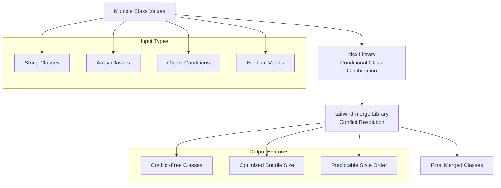
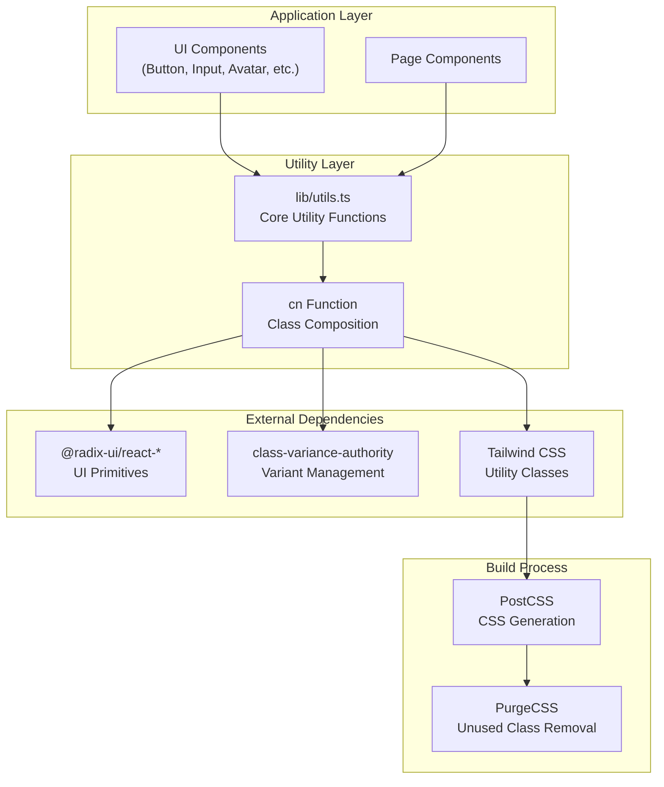
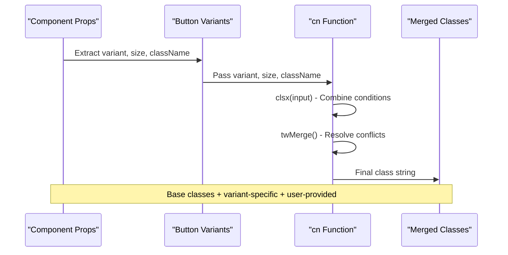

# Utility Functions

<cite>
**Referenced Files in This Document**
- [lib/utils.ts](file://lib/utils.ts)
- [components/ui/button.tsx](file://components/ui/button.tsx)
- [components/ui/input.tsx](file://components/ui/input.tsx)
- [components/ui/avatar.tsx](file://components/ui/avatar.tsx)
- [components/ui/sidebar.tsx](file://components/ui/sidebar.tsx)
- [components/ui/dropdown-menu.tsx](file://components/ui/dropdown-menu.tsx)
- [components/ui/sheet.tsx](file://components/ui/sheet.tsx)
- [components/ui/skeleton.tsx](file://components/ui/skeleton.tsx)
- [components/ui/tooltip.tsx](file://components/ui/tooltip.tsx)
- [components/ui/breadcrumb.tsx](file://components/ui/breadcrumb.tsx)
- [package.json](file://package.json)
</cite>

## Table of Contents
1. [Introduction](#introduction)
2. [Core Utility Implementation](#core-utility-implementation)
3. [Architecture Overview](#architecture-overview)
4. [Real-World Usage Examples](#real-world-usage-examples)
5. [Benefits and Advantages](#benefits-and-advantages)
6. [Best Practices](#best-practices)
7. [Extending the Utils Module](#extending-the-utils-module)
8. [Performance Considerations](#performance-considerations)
9. [Troubleshooting Guide](#troubleshooting-guide)
10. [Conclusion](#conclusion)

## Introduction

The utility functions in this Next.js application serve as the foundation for managing Tailwind CSS class composition across the entire component library. At the heart of this system is the `cn` function, which elegantly combines two powerful libraries: `clsx` for conditional class concatenation and `tailwind-merge` for intelligent class conflict resolution.

This utility function addresses a fundamental challenge in modern web development: maintaining clean, predictable class composition while avoiding style conflicts and ensuring optimal bundle sizes. By centralizing class management in a single utility, the application achieves consistency, reduces duplication, and simplifies maintenance across all UI components.

## Core Utility Implementation

The `cn` function is implemented in a minimalist yet powerful manner, leveraging the strengths of both `clsx` and `tailwind-merge` to create a robust solution for class composition.



**Diagram sources**
- [lib/utils.ts](file://lib/utils.ts#L1-L7)

The implementation demonstrates elegant simplicity:

```typescript
import { clsx, type ClassValue } from "clsx"
import { twMerge } from "tailwind-merge"

export function cn(...inputs: ClassValue[]) {
  return twMerge(clsx(inputs))
}
```

This single-function utility encapsulates the essence of modern class composition, combining the flexibility of conditional class building with the intelligence of conflict resolution.

**Section sources**
- [lib/utils.ts](file://lib/utils.ts#L1-L7)

## Architecture Overview

The utility system follows a centralized architecture pattern that promotes consistency and maintainability across the entire application.



**Diagram sources**
- [lib/utils.ts](file://lib/utils.ts#L1-L7)
- [package.json](file://package.json#L15-L25)

The architecture ensures that:

1. **Centralization**: All class composition logic resides in a single, well-defined module
2. **Consistency**: Every component uses the same utility for class management
3. **Flexibility**: Supports various input types and conditional logic
4. **Optimization**: Leverages tree-shaking and PurgeCSS for minimal bundle sizes

## Real-World Usage Examples

The `cn` function is extensively used throughout the component library, demonstrating its versatility and power in real-world scenarios.

### Button Component Example

The Button component showcases sophisticated class composition with variant support:



**Diagram sources**
- [components/ui/button.tsx](file://components/ui/button.tsx#L15-L35)

```typescript
// Base classes + variant-specific + user-provided
className={cn(
  "inline-flex items-center justify-center whitespace-nowrap rounded-base text-sm font-base ring-offset-white transition-all gap-2",
  className,
)}
```

### Input Component Example

The Input component demonstrates simple yet effective class composition:

```typescript
// Simple class merging with user customization
className={cn(
  "flex h-10 w-full rounded-base border-2 border-border bg-secondary-background px-3 py-2 text-sm font-base text-foreground",
  className,
)}
```

### Complex Layout Components

Components like Sidebar and Sheet demonstrate advanced conditional class composition:

```typescript
// Conditional layout classes based on props
className={cn(
  "bg-secondary-background text-foreground flex h-full w-(--sidebar-width) flex-col",
  className,
)}

// Dynamic side positioning
className={cn(
  "bg-background data-[state=open]:animate-in data-[state=closed]:animate-out fixed z-50 flex flex-col gap-4 border-2 border-border transition ease-in-out",
  side === "right" &&
    "data-[state=closed]:slide-out-to-right data-[state=open]:slide-in-from-right inset-y-0 right-0 h-full w-3/4 border-l sm:max-w-sm",
  side === "left" &&
    "data-[state=closed]:slide-out-to-left data-[state=open]:slide-in-from-left inset-y-0 left-0 h-full w-3/4 border-r sm:max-w-sm",
  className,
)}
```

**Section sources**
- [components/ui/button.tsx](file://components/ui/button.tsx#L35-L40)
- [components/ui/input.tsx](file://components/ui/input.tsx#L8-L12)
- [components/ui/sidebar.tsx](file://components/ui/sidebar.tsx#L110-L115)
- [components/ui/sheet.tsx](file://components/ui/sheet.tsx#L50-L65)

## Benefits and Advantages

The `cn` utility function provides numerous benefits that enhance both developer experience and application performance.

### Developer Experience Enhancements

1. **Type Safety**: Full TypeScript support with proper type inference
2. **Intuitive API**: Familiar `clsx` syntax with enhanced capabilities
3. **Conflict Prevention**: Automatic resolution of conflicting Tailwind classes
4. **Consistency**: Uniform approach across all components
5. **Readability**: Clear separation between base, variant, and dynamic classes

### Performance Optimizations

1. **Bundle Size Reduction**: Tree-shakable imports minimize overhead
2. **Runtime Efficiency**: Single function call for complex operations
3. **Build-Time Optimization**: Compatible with PurgeCSS for unused class removal
4. **Memory Efficiency**: Minimal memory footprint with functional composition

### Maintenance Advantages

1. **Single Point of Control**: Changes propagate across all components
2. **Reduced Duplication**: Eliminates repeated class composition logic
3. **Easier Debugging**: Centralized error handling and logging
4. **Future-Proof**: Easy to extend with additional utilities

## Best Practices

Following established best practices ensures optimal utilization of the `cn` utility function and maintains code quality across the application.

### Import Patterns

Always import the `cn` function using the absolute path for consistency:

```typescript
import { cn } from "@/lib/utils"
```

### Class Composition Strategies

1. **Base Classes First**: Always include base classes before user-provided ones
2. **Variant-Specific Classes**: Use conditional logic for variant-based classes
3. **Dynamic Classes**: Apply runtime-dependent classes last
4. **Consistent Ordering**: Maintain predictable class order for debugging

### Component Design Guidelines

```typescript
// Recommended pattern
function MyComponent({
  className,
  variant = "default",
  ...props
}: React.ComponentProps<"div"> & {
  variant?: "default" | "destructive"
}) {
  return (
    <div
      className={cn(
        "base-classes",
        variant && `variant-specific-${variant}`,
        className, // User-provided classes last
      )}
      {...props}
    />
  )
}
```

### Testing Considerations

1. **Unit Tests**: Verify class composition with various input combinations
2. **Integration Tests**: Ensure proper rendering with composed classes
3. **Visual Regression**: Test against design system specifications
4. **Accessibility**: Validate that composed classes don't break accessibility features

## Extending the Utils Module

While the current implementation focuses on the `cn` function, the utils module can be extended to support additional helper functions as the application grows.

### Extension Strategies

1. **Helper Functions**: Add utility functions for common operations
2. **Type Definitions**: Extend type safety with custom type guards
3. **Validation Functions**: Implement runtime validation for class compositions
4. **Debug Utilities**: Add development-time debugging helpers

### Future Enhancement Example

```typescript
// Potential future additions
export function cnSafe(...inputs: ClassValue[]) {
  // Enhanced validation and logging
  console.log('Class composition:', inputs)
  return twMerge(clsx(inputs))
}

export function cnWithDebug(...inputs: ClassValue[]) {
  // Development-only debugging
  if (process.env.NODE_ENV === 'development') {
    console.debug('CN Composition:', inputs)
  }
  return twMerge(clsx(inputs))
}
```

### Module Organization

Maintain a clean, organized structure for the utils module:

```typescript
// lib/utils.ts - Current implementation
import { clsx, type ClassValue } from "clsx"
import { twMerge } from "tailwind-merge"

export function cn(...inputs: ClassValue[]) {
  return twMerge(clsx(inputs))
}

// lib/utils/index.ts - Export module
export * from './utils'
export * from './validation'
export * from './helpers'
```

## Performance Considerations

The utility function is designed with performance in mind, leveraging several optimization strategies.

### Runtime Performance

1. **Minimal Overhead**: Single function call with no additional processing
2. **Efficient Algorithms**: Both `clsx` and `twMerge` use optimized algorithms
3. **Memory Management**: No unnecessary object creation or copying
4. **Garbage Collection**: Minimal impact on GC cycles

### Build-Time Optimizations

1. **Tree Shaking**: Unused functions are automatically removed
2. **PurgeCSS Integration**: Removes unused Tailwind classes from production builds
3. **Module Federation**: Efficient bundling with modern build tools
4. **Code Splitting**: Can be split into separate chunks if needed

### Monitoring and Profiling

Consider implementing monitoring for class composition performance:

```typescript
// Optional performance monitoring
export function cnMonitored(...inputs: ClassValue[]) {
  const start = performance.now()
  const result = twMerge(clsx(inputs))
  const duration = performance.now() - start
  
  if (duration > 1) {
    console.warn(`CN composition took ${duration}ms`, inputs)
  }
  
  return result
}
```

## Troubleshooting Guide

Common issues and solutions when working with the `cn` utility function.

### Class Conflicts

**Problem**: Unexpected styles appearing due to class conflicts
**Solution**: Review the order of classes and ensure proper use of `twMerge`

```typescript
// Problematic - potential conflicts
className={cn("text-red-500 text-green-500", className)}

// Solution - explicit ordering
className={cn("text-green-500", className)} // Override previous classes
```

### Type Errors

**Problem**: TypeScript errors with class composition
**Solution**: Ensure proper type imports and use `ClassValue` type

```typescript
import { type ClassValue } from "clsx"

// Correct usage
function Component({ className }: { className?: ClassValue }) {
  return <div className={cn("base-class", className)} />
}
```

### Performance Issues

**Problem**: Slow rendering with complex class compositions
**Solution**: Profile and optimize class composition patterns

```typescript
// Optimize expensive computations
const computedClasses = useMemo(() => {
  return cn("complex-class-composition", dynamicClasses)
}, [dynamicClasses])
```

### Debugging Tips

1. **Console Logging**: Temporarily log class compositions during development
2. **Browser DevTools**: Inspect generated class lists in the browser
3. **CSS Specificity**: Understand how Tailwind's specificity rules apply
4. **Component Isolation**: Test components in isolation to identify issues

## Conclusion

The `cn` utility function represents a masterfully crafted solution for modern class composition in React applications. By combining the strengths of `clsx` and `tailwind-merge`, it provides developers with a powerful, type-safe, and efficient way to manage Tailwind CSS classes across the entire component library.

The implementation demonstrates several key architectural principles:

- **Simplicity**: Elegant, minimalistic design that's easy to understand and maintain
- **Flexibility**: Support for various input types and conditional logic
- **Performance**: Optimized for both runtime efficiency and build-time optimization
- **Consistency**: Uniform approach across all components promotes maintainability

As the application continues to grow, this utility function serves as a solid foundation for scalable class composition, ensuring that the component library remains maintainable, performant, and developer-friendly. The strategic use of this utility throughout the codebase exemplifies best practices in modern React development and provides a template for similar utility systems in other projects.

The comprehensive usage patterns demonstrated across various components show the versatility and power of this approach, making it an essential tool for any large-scale React application utilizing Tailwind CSS.